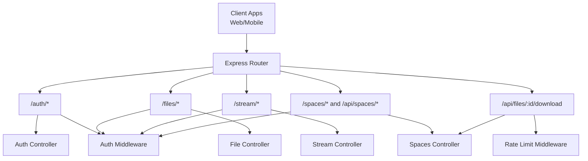
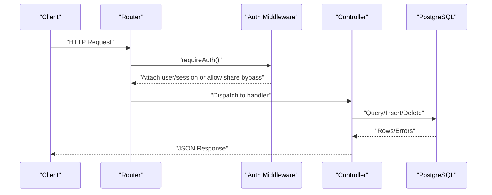
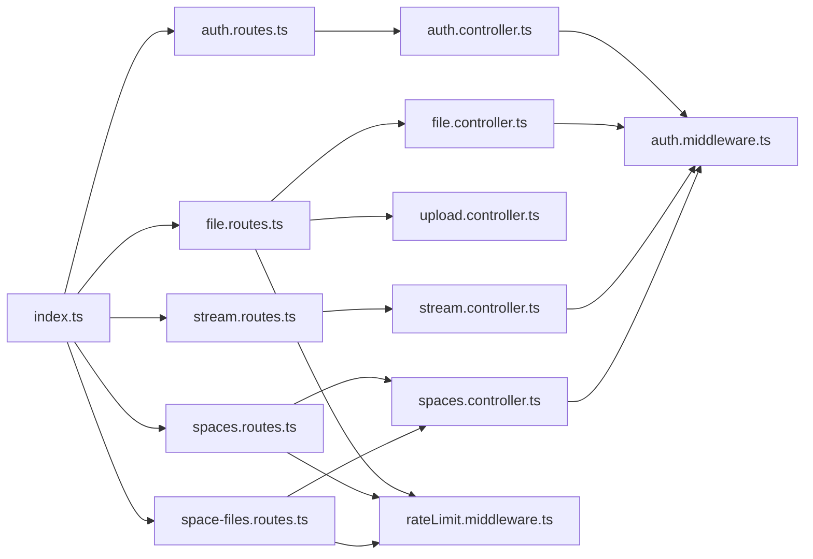

# API Reference

<cite>
**Referenced Files in This Document**
- [index.ts](file://server/src/index.ts)
- [auth.routes.ts](file://server/src/routes/auth.routes.ts)
- [file.routes.ts](file://server/src/routes/file.routes.ts)
- [stream.routes.ts](file://server/src/routes/stream.routes.ts)
- [spaces.routes.ts](file://server/src/routes/spaces.routes.ts)
- [space-files.routes.ts](file://server/src/routes/space-files.routes.ts)
- [auth.controller.ts](file://server/src/controllers/auth.controller.ts)
- [file.controller.ts](file://server/src/controllers/file.controller.ts)
- [upload.controller.ts](file://server/src/controllers/upload.controller.ts)
- [stream.controller.ts](file://server/src/controllers/stream.controller.ts)
- [spaces.controller.ts](file://server/src/controllers/spaces.controller.ts)
- [auth.middleware.ts](file://server/src/middlewares/auth.middleware.ts)
- [rateLimit.middleware.ts](file://server/src/middlewares/rateLimit.middleware.ts)
- [share.service.ts](file://server/src/services/share.service.ts)
- [apiClient.ts](file://app/src/services/apiClient.ts)
- [api.ts](file://app/src/services/api.ts)
</cite>

## Table of Contents
1. [Introduction](#introduction)
2. [Project Structure](#project-structure)
3. [Core Components](#core-components)
4. [Architecture Overview](#architecture-overview)
5. [Detailed Component Analysis](#detailed-component-analysis)
6. [Dependency Analysis](#dependency-analysis)
7. [Performance Considerations](#performance-considerations)
8. [Troubleshooting Guide](#troubleshooting-guide)
9. [Conclusion](#conclusion)
10. [Appendices](#appendices)

## Introduction
This document describes the ANYX RESTful API, covering authentication, file and folder management, uploads (single and chunked), streaming, downloads, and shared spaces. It specifies HTTP methods, URL patterns, request/response schemas, authentication requirements, rate limiting, and security considerations. It also includes client integration guidance and operational notes.

## Project Structure
The API is implemented as an Express server with modular route groups and controllers. Authentication is enforced via a JWT middleware. Public endpoints (e.g., shared links) use token bypass logic. Rate limiting is applied globally and per-feature.

**Diagram sources**
- [index.ts](file://server/src/index.ts#L14-L220)
- [auth.routes.ts](file://server/src/routes/auth.routes.ts#L1-L13)
- [file.routes.ts](file://server/src/routes/file.routes.ts#L1-L118)
- [stream.routes.ts](file://server/src/routes/stream.routes.ts#L1-L26)
- [spaces.routes.ts](file://server/src/routes/spaces.routes.ts#L1-L35)
- [space-files.routes.ts](file://server/src/routes/space-files.routes.ts#L1-L10)
- [auth.middleware.ts](file://server/src/middlewares/auth.middleware.ts#L1-L82)
- [rateLimit.middleware.ts](file://server/src/middlewares/rateLimit.middleware.ts#L1-L47)

**Section sources**
- [index.ts](file://server/src/index.ts#L14-L220)

## Core Components
- Authentication middleware validates JWT and supports share-link token bypass for public access.
- Controllers implement business logic for auth, files, uploads, streaming, and shared spaces.
- Rate limiters protect endpoints from abuse (global, auth, uploads, shared spaces).
- Services handle share link signing/verification and URL construction.

**Section sources**
- [auth.middleware.ts](file://server/src/middlewares/auth.middleware.ts#L1-L82)
- [rateLimit.middleware.ts](file://server/src/middlewares/rateLimit.middleware.ts#L1-L47)
- [share.service.ts](file://server/src/services/share.service.ts#L1-L183)

## Architecture Overview
The server exposes grouped routes under base paths. Authentication is mandatory for most endpoints except public shared access. Streaming uses a disk cache with HTTP Range support. Shared spaces enforce password and access tokens.

**Diagram sources**
- [index.ts](file://server/src/index.ts#L14-L220)
- [auth.middleware.ts](file://server/src/middlewares/auth.middleware.ts#L19-L81)
- [auth.controller.ts](file://server/src/controllers/auth.controller.ts#L1-L96)
- [file.controller.ts](file://server/src/controllers/file.controller.ts#L103-L133)
- [spaces.controller.ts](file://server/src/controllers/spaces.controller.ts#L161-L194)

## Detailed Component Analysis

### Authentication Endpoints
- Base path: /auth
- All endpoints require Authorization: Bearer <JWT> except where noted.

Endpoints
- POST /auth/send-code
  - Purpose: Request OTP for phone-based login.
  - Auth: None.
  - Request body: { phoneNumber: string }.
  - Response: { success: boolean, phoneCodeHash: string, tempSession: string }.
  - Errors: 400 (missing phone), 500 (Telegram-related).
  - Notes: Uses Telegram API; environment variables required.

- POST /auth/verify-code
  - Purpose: Verify OTP and issue JWT.
  - Auth: None.
  - Request body: { phoneNumber: string, phoneCodeHash: string, phoneCode: string, tempSession: string }.
  - Response: { success: boolean, message: string, token: string, user: { id, phone, name, username } }.
  - Errors: 400 (missing fields), 500 (general).

- GET /auth/me
  - Purpose: Fetch current user profile.
  - Auth: Bearer JWT.
  - Response: { success: boolean, user: { id, phone, name, username, profile_pic } }.
  - Errors: 401 (unauthorized), 404 (not found), 500 (server error).

- DELETE /auth/account
  - Purpose: Permanently delete user account (cascades).
  - Auth: Bearer JWT.
  - Response: { success: boolean, message: string }.
  - Errors: 401 (unauthorized), 500 (server error).

Security and Headers
- Authorization: Bearer <JWT>.
- Content-Type: application/json.

Rate Limiting
- Auth endpoints are protected by a dedicated limiter (window 10 minutes, max 15).

Example Client Usage
- Use Authorization header with token stored by the client.
- Example path: [apiClient.ts](file://app/src/services/apiClient.ts#L46-L84)

**Section sources**
- [auth.routes.ts](file://server/src/routes/auth.routes.ts#L7-L10)
- [auth.controller.ts](file://server/src/controllers/auth.controller.ts#L9-L95)
- [auth.middleware.ts](file://server/src/middlewares/auth.middleware.ts#L54-L81)
- [index.ts](file://server/src/index.ts#L107-L108)
- [rateLimit.middleware.ts](file://server/src/middlewares/rateLimit.middleware.ts#L101-L105)

### File Management Endpoints
- Base path: /files
- All endpoints require Bearer JWT.

Endpoints
- GET /files/
  - Purpose: List files with pagination and filtering.
  - Query params: limit, offset, folder_id, sort, order.
  - Response: { success: boolean, files: [file...] }.

- GET /files/search
  - Purpose: Search files/folders by name/type and optional folder scope.
  - Query params: q (required), type, folder_id, limit, offset.
  - Response: { success: boolean, results: [...], pagination: {...} }.

- GET /files/stats
  - Purpose: Account stats.
  - Response: { success: boolean, ... }.

- GET /files/activity
  - Purpose: Recent activity.
  - Response: { success: boolean, ... }.

- GET /files/starred
  - Purpose: Starred items.
  - Response: { success: boolean, files: [...] }.

- PATCH /files/:id/star
  - Purpose: Toggle starred flag.
  - Response: { success: boolean }.

- GET /files/trash
  - Purpose: Trashed items.
  - Response: { success: boolean, files: [...] }.

- PATCH /files/:id/trash
  - Purpose: Move to trash.
  - Response: { success: boolean }.

- PATCH /files/:id/restore
  - Purpose: Restore from trash.
  - Response: { success: boolean }.

- DELETE /files/trash
  - Purpose: Empty trash.
  - Response: { success: boolean }.
  
- POST /files/bulk
  - Purpose: Bulk actions.
  - Request body: { operation: string, ids: string[], ... }.
  - Response: { success: boolean, ... }.

- GET /files/recent-accessed
  - Purpose: Recently accessed items.
  - Response: { success: boolean, files: [...] }.

- POST /files/:id/accessed
  - Purpose: Mark item as recently accessed.
  - Response: { success: boolean }.

- GET /files/:id/details
  - Purpose: Detailed metadata.
  - Response: { success: boolean, file: {...} }.

- GET /files/:id/tags
  - Purpose: List tags.
  - Response: { success: boolean, tags: [...] }.

- POST /files/:id/tags
  - Purpose: Add tag(s).
  - Request body: { tags: string[] }.
  - Response: { success: boolean }.

- DELETE /files/:id/tags/:tag
  - Purpose: Remove tag.
  - Response: { success: boolean }.

- GET /files/tags
  - Purpose: List all user tags.
  - Response: { success: boolean, tags: [...] }.

- GET /files/tags/:tag
  - Purpose: List files by tag.
  - Response: { success: boolean, files: [...] }.

- GET /files/:id/download
  - Purpose: Download file (requires JWT or valid share token).
  - Query: token=<jwt> for public access.
  - Response: Binary stream or 401/404/410.

- GET /files/:id/stream
  - Purpose: Stream with Range support (requires JWT).
  - Response: 200 or 206 with Range; see Streaming section.

- GET /files/:id/thumbnail
  - Purpose: Thumbnail (requires JWT or valid share token).
  - Response: Image or 401/404/410.

- PATCH /files/:id
  - Purpose: Update metadata.
  - Response: { success: boolean }.

- DELETE /files/:id
  - Purpose: Delete file.
  - Response: { success: boolean }.

- POST /files/folder
  - Purpose: Create folder.
  - Request body: { name: string, parent_id?: string }.
  - Response: { success: boolean, folder: {...} }.

- GET /files/folders
  - Purpose: List folders.
  - Query params: parent_id, limit, offset.
  - Response: { success: boolean, folders: [...] }.

- PATCH /files/folder/:id
  - Purpose: Update folder.
  - Response: { success: boolean }.

- DELETE /files/folder/:id
  - Purpose: Delete folder.
  - Response: { success: boolean }.

Upload Endpoints (Single File)
- POST /files/upload
  - Purpose: Legacy single-file upload.
  - Form field: file (binary).
  - Response: { success: boolean, file: {...} }.
  - Limits: Up to configured max per multer.

Upload Endpoints (Chunked)
- POST /files/upload/init
  - Purpose: Initialize chunked upload; deduplicate by hash.
  - Request body: { originalname, size, mimetype, folder_id?, telegram_chat_id?, hash? }.
  - Response: { success: boolean, duplicate?, file?, message? }.
  - Rate limit: User-scoped upload limiter.

- POST /files/upload/chunk
  - Purpose: Upload a chunk.
  - Form field: chunk (binary).
  - Response: { success: boolean, progress? }.
  - Rate limit: Chunk limiter.

- POST /files/upload/complete
  - Purpose: Finalize upload.
  - Request body: { uploadId, ... }.
  - Response: { success: boolean, file: {...} }.
  - Rate limit: User-scoped upload limiter.

- POST /files/upload/cancel
  - Purpose: Cancel upload.
  - Request body: { uploadId }.
  - Response: { success: boolean }.
  - Rate limit: User-scoped upload limiter.

- GET /files/upload/status/:uploadId
  - Purpose: Check status.
  - Response: { success: boolean, status, totalSize, downloadedBytes, progress, cached, error? }.

Security and Headers
- Authorization: Bearer <JWT>.
- Content-Type: multipart/form-data for uploads; application/json otherwise.

Rate Limiting
- Global limiter: 1000 requests per 15 minutes (skips /health).
- Auth limiter: 15 attempts per 10 minutes.
- Upload limiter: 2000 per 15 minutes (user-scoped).
- Chunk limiter: 6000 per 15 minutes.

Example Client Usage
- Use Authorization header and uploadClient for large uploads.
- Example path: [apiClient.ts](file://app/src/services/apiClient.ts#L36-L42)

**Section sources**
- [file.routes.ts](file://server/src/routes/file.routes.ts#L19-L117)
- [file.controller.ts](file://server/src/controllers/file.controller.ts#L49-L200)
- [upload.controller.ts](file://server/src/controllers/upload.controller.ts#L136-L200)
- [index.ts](file://server/src/index.ts#L87-L98)
- [rateLimit.middleware.ts](file://server/src/middlewares/rateLimit.middleware.ts#L60-L81)

### Streaming Endpoints
- Base path: /stream
- All endpoints require Bearer JWT.

Endpoints
- GET /stream/:fileId
  - Purpose: Progressive streaming with HTTP Range support.
  - Response: 200 or 206; serves cached file if available.
  - Behavior: Downloads to disk cache first, then streams; respects Range.

- GET /stream/:fileId/status
  - Purpose: Streaming status and progress.
  - Response: { success: boolean, status, totalSize, downloadedBytes, progress, cached, error? }.

Security and Headers
- Authorization: Bearer <JWT>.
- Content-Type: Determined by file’s MIME type.

Notes
- Ownership cache prevents frequent DB queries.
- Cleanup jobs remove stale cache files.

**Section sources**
- [stream.routes.ts](file://server/src/routes/stream.routes.ts#L1-L26)
- [stream.controller.ts](file://server/src/controllers/stream.controller.ts#L322-L460)

### Shared Spaces Endpoints
- Base paths: /spaces and /api/spaces
- Public endpoints (password validation, listing) use rate limiting; upload requires JWT.

Endpoints
- GET /spaces/
  - Purpose: List spaces owned by the authenticated user.
  - Auth: Bearer JWT.
  - Response: { success: boolean, spaces: [...] }.

- POST /spaces/create
  - Purpose: Create a shared space.
  - Auth: Bearer JWT.
  - Request body: { name: string, allow_upload?: boolean, allow_download?: boolean, password?: string, expires_at?: string }.
  - Response: { success: boolean, space: {...} }.

- GET /spaces/:id
  - Purpose: Public space view (requires password or access token).
  - Auth: Optional; requires password or access token.
  - Response: { success: boolean, space: {...}, files: [...] }.
  - Rate limit: spaceViewLimiter.

- POST /spaces/:id/validate-password
  - Purpose: Validate password and issue access token.
  - Request body: { password: string }.
  - Response: { success: boolean, token: string }.
  - Rate limit: spacePasswordLimiter.

- GET /spaces/:id/files
  - Purpose: List files in a space (requires access).
  - Auth: Access token or password validated.
  - Response: { success: boolean, files: [...] }.
  - Rate limit: spaceViewLimiter.

- POST /spaces/:id/upload
  - Purpose: Upload to a space (requires access).
  - Auth: Access token or password validated.
  - Form field: file (binary).
  - Response: { success: boolean, file: {...} }.
  - Rate limit: spaceUploadLimiter.

- GET /api/files/:id/download
  - Purpose: Signed download for shared space files.
  - Auth: Access token or password validated.
  - Query: token=<jwt> (signed token).
  - Response: Binary stream or 401/403/404/410.

Security and Headers
- Authorization: Bearer <JWT> for owner endpoints.
- X-Space-Access-Token or Cookie for public access.
- Content-Type: multipart/form-data for uploads; application/json otherwise.

Rate Limiting
- spaceViewLimiter: 60 per minute.
- spacePasswordLimiter: 8 attempts per 15 minutes.
- spaceUploadLimiter: 120 per 15 minutes.
- signedDownloadLimiter: 80 per 5 minutes.

**Section sources**
- [spaces.routes.ts](file://server/src/routes/spaces.routes.ts#L1-L35)
- [space-files.routes.ts](file://server/src/routes/space-files.routes.ts#L1-L10)
- [spaces.controller.ts](file://server/src/controllers/spaces.controller.ts#L161-L200)
- [rateLimit.middleware.ts](file://server/src/middlewares/rateLimit.middleware.ts#L24-L46)

### Authentication Header Requirements
- All endpoints requiring user authentication expect Authorization: Bearer <JWT>.
- For public access to downloads/thumbnails, pass token=<jwt> as query parameter when applicable.

**Section sources**
- [auth.middleware.ts](file://server/src/middlewares/auth.middleware.ts#L54-L81)
- [index.ts](file://server/src/index.ts#L113-L201)

### Content-Type Specifications
- JSON APIs: application/json.
- Uploads: multipart/form-data.
- Streaming: determined by file MIME type.

**Section sources**
- [index.ts](file://server/src/index.ts#L81-L83)
- [file.routes.ts](file://server/src/routes/file.routes.ts#L19-L22)

### Request/Response Examples
- Authentication
  - Request: POST /auth/send-code with { phoneNumber }.
  - Response: { success, phoneCodeHash, tempSession }.
  - Request: POST /auth/verify-code with OTP and session.
  - Response: { success, token, user }.
  - Request: GET /auth/me with Authorization header.
  - Response: { success, user }.

- File Management
  - Request: GET /files/?limit=50&offset=0
  - Response: { success, files: [...] }.
  - Request: POST /files/upload with form field file.
  - Response: { success, file }.

- Streaming
  - Request: GET /stream/:fileId with Authorization header.
  - Response: 200/206 binary stream.

- Shared Spaces
  - Request: POST /spaces/:id/validate-password with { password }.
  - Response: { success, token }.
  - Request: GET /api/files/:id/download?token=<jwt>.
  - Response: Binary stream.

**Section sources**
- [auth.controller.ts](file://server/src/controllers/auth.controller.ts#L9-L95)
- [file.controller.ts](file://server/src/controllers/file.controller.ts#L103-L133)
- [stream.controller.ts](file://server/src/controllers/stream.controller.ts#L322-L460)
- [spaces.controller.ts](file://server/src/controllers/spaces.controller.ts#L161-L200)

### Error Codes and Handling
Common HTTP statuses
- 200 OK, 201 Created, 204 No Content.
- 400 Bad Request (validation failures).
- 401 Unauthorized (missing/invalid token, not found).
- 403 Forbidden (access denied).
- 404 Not Found.
- 410 Gone (expired resources).
- 413 Payload Too Large (file size limits).
- 429 Too Many Requests (rate limited).
- 500 Internal Server Error.

Global error handler
- Catches unhandled exceptions and multer file size errors.

**Section sources**
- [index.ts](file://server/src/index.ts#L239-L249)

### Rate Limiting Information
- Global limiter: 1000 per 15 minutes (skips /health).
- Auth limiter: 15 per 10 minutes.
- Upload limiter: 2000 per 15 minutes (user-scoped).
- Chunk limiter: 6000 per 15 minutes.
- spaceViewLimiter: 60 per minute.
- spacePasswordLimiter: 8 per 15 minutes.
- spaceUploadLimiter: 120 per 15 minutes.
- signedDownloadLimiter: 80 per 5 minutes.

**Section sources**
- [index.ts](file://server/src/index.ts#L87-L105)
- [file.routes.ts](file://server/src/routes/file.routes.ts#L60-L81)
- [rateLimit.middleware.ts](file://server/src/middlewares/rateLimit.middleware.ts#L1-L47)

### Security Considerations
- JWT secret must be configured; server refuses to start without it.
- Share link tokens and access tokens are signed with separate secrets and TTLs.
- CORS allows credentials and selected origins; share endpoints relax CORS for downloads.
- Helmet CSP sets nonce-based script-src and restricts inline styles.
- Multer limits file sizes; streaming enforces ownership checks.

**Section sources**
- [auth.middleware.ts](file://server/src/middlewares/auth.middleware.ts#L5-L6)
- [share.service.ts](file://server/src/services/share.service.ts#L33-L36)
- [index.ts](file://server/src/index.ts#L52-L77)
- [file.routes.ts](file://server/src/routes/file.routes.ts#L19-L22)

### API Versioning, Backwards Compatibility, and Deprecation
- Version endpoint: GET / returns { status: "OK", service: "Axya Cloud API", version: "1.0.0" }.
- Backward compatibility: Redirects legacy share links to new format.
- Deprecation: No explicit deprecation notices observed; maintainers should announce changes via changelog or deployment notes.

**Section sources**
- [index.ts](file://server/src/index.ts#L222-L236)
- [index.ts](file://server/src/index.ts#L203-L214)

## Dependency Analysis

**Diagram sources**
- [index.ts](file://server/src/index.ts#L14-L220)
- [auth.routes.ts](file://server/src/routes/auth.routes.ts#L1-L13)
- [file.routes.ts](file://server/src/routes/file.routes.ts#L1-L118)
- [stream.routes.ts](file://server/src/routes/stream.routes.ts#L1-L26)
- [spaces.routes.ts](file://server/src/routes/spaces.routes.ts#L1-L35)
- [space-files.routes.ts](file://server/src/routes/space-files.routes.ts#L1-L10)
- [auth.middleware.ts](file://server/src/middlewares/auth.middleware.ts#L1-L82)
- [rateLimit.middleware.ts](file://server/src/middlewares/rateLimit.middleware.ts#L1-L47)

**Section sources**
- [index.ts](file://server/src/index.ts#L14-L220)

## Performance Considerations
- Streaming strategy: Download-first, cache-to-disk, then serve with HTTP Range. This improves reliability on mobile players and reduces repeated Telegram fetches.
- Ownership caching: Reduces DB load for frequent polling.
- Semaphore: Limits concurrent Telegram uploads to prevent OOM.
- Cleanup: Stale cache and upload temp dirs are periodically removed.

**Section sources**
- [stream.controller.ts](file://server/src/controllers/stream.controller.ts#L1-L27)
- [stream.controller.ts](file://server/src/controllers/stream.controller.ts#L56-L89)
- [upload.controller.ts](file://server/src/controllers/upload.controller.ts#L76-L100)
- [index.ts](file://server/src/index.ts#L281-L293)

## Troubleshooting Guide
- 401 Unauthorized
  - Cause: Missing or invalid Authorization header; token payload invalid; user not found.
  - Resolution: Re-authenticate and ensure token storage is intact.

- 403 Forbidden
  - Cause: Access denied to shared space without valid password or access token.
  - Resolution: Validate password or obtain a space access token.

- 404 Not Found
  - Cause: File or resource does not exist; expired share link.
  - Resolution: Refresh link or verify resource ownership.

- 410 Gone
  - Cause: Expired resource (share link or space).
  - Resolution: Recreate link or space.

- 413 Payload Too Large
  - Cause: File exceeds configured limits.
  - Resolution: Split into smaller chunks or reduce size.

- 429 Too Many Requests
  - Cause: Rate limit exceeded.
  - Resolution: Back off and retry per limiter windows.

- 500 Internal Server Error
  - Cause: Unexpected server failure.
  - Resolution: Inspect logs and retry.

**Section sources**
- [auth.middleware.ts](file://server/src/middlewares/auth.middleware.ts#L54-L81)
- [index.ts](file://server/src/index.ts#L239-L249)
- [rateLimit.middleware.ts](file://server/src/middlewares/rateLimit.middleware.ts#L1-L47)

## Conclusion
ANYX provides a comprehensive REST API for authentication, file management, streaming, and shared spaces. It emphasizes reliability with chunked uploads, disk-cached streaming, robust rate limiting, and strong security via JWT and share tokens. Clients should use Authorization headers for protected endpoints and token query parameters for public access where supported.

## Appendices

### Example Client Implementation Notes
- Inject Authorization header automatically for all requests.
- Use a separate upload client with higher timeout for large uploads.
- Store JWT securely and refresh as needed.

**Section sources**
- [apiClient.ts](file://app/src/services/apiClient.ts#L46-L84)
- [apiClient.ts](file://app/src/services/apiClient.ts#L36-L42)