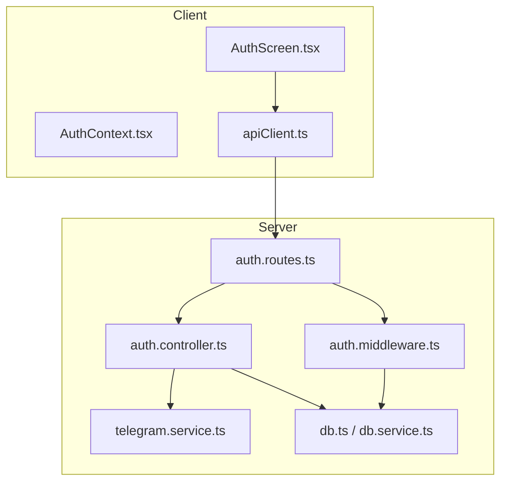
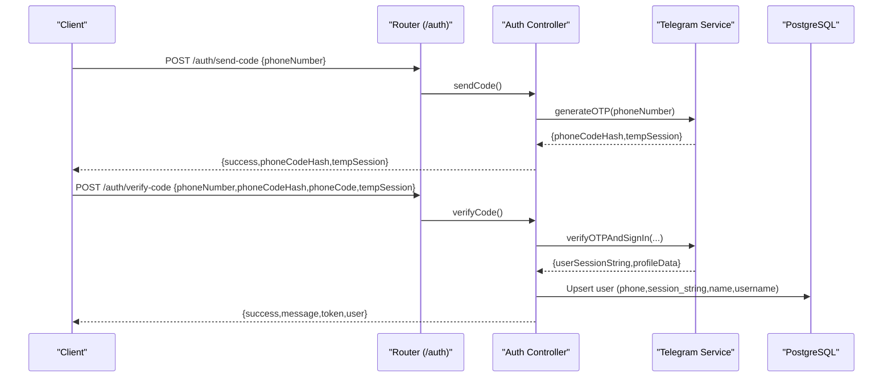
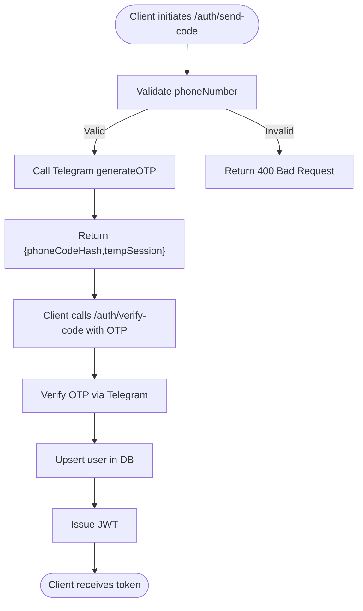
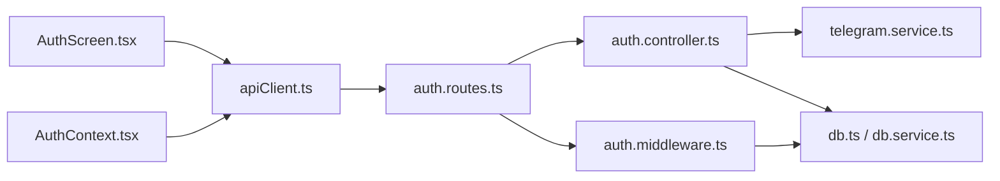

# Authentication Endpoints

<cite>
**Referenced Files in This Document**
- [server/src/index.ts](file://server/src/index.ts)
- [server/src/routes/auth.routes.ts](file://server/src/routes/auth.routes.ts)
- [server/src/controllers/auth.controller.ts](file://server/src/controllers/auth.controller.ts)
- [server/src/middlewares/auth.middleware.ts](file://server/src/middlewares/auth.middleware.ts)
- [server/src/services/telegram.service.ts](file://server/src/services/telegram.service.ts)
- [server/src/config/db.ts](file://server/src/config/db.ts)
- [server/src/services/db.service.ts](file://server/src/services/db.service.ts)
- [app/src/screens/AuthScreen.tsx](file://app/src/screens/AuthScreen.tsx)
- [app/src/context/AuthContext.tsx](file://app/src/context/AuthContext.tsx)
- [app/src/services/apiClient.ts](file://app/src/services/apiClient.ts)
</cite>

## Table of Contents
1. [Introduction](#introduction)
2. [Project Structure](#project-structure)
3. [Core Components](#core-components)
4. [Architecture Overview](#architecture-overview)
5. [Detailed Component Analysis](#detailed-component-analysis)
6. [Dependency Analysis](#dependency-analysis)
7. [Performance Considerations](#performance-considerations)
8. [Troubleshooting Guide](#troubleshooting-guide)
9. [Conclusion](#conclusion)
10. [Appendices](#appendices)

## Introduction
This document provides comprehensive API documentation for the authentication endpoints used for phone number-based login. It covers:
- OTP generation and verification flow
- Protected endpoints for profile retrieval and account deletion
- Request/response schemas
- Authentication requirements and security considerations
- Rate limiting policies
- Client-side integration patterns and examples

## Project Structure
The authentication flow spans the backend Express server and the mobile/web client application:
- Backend routes define the endpoints under /auth
- Controllers implement the business logic for OTP generation, verification, profile retrieval, and account deletion
- Middleware enforces JWT-based authentication for protected endpoints
- Telegram service integrates with Telegram’s MTProto to generate and verify OTPs
- Database stores user profiles and session strings
- Frontend components orchestrate the phone number input, OTP input, and token handling

**Diagram sources**
- [server/src/routes/auth.routes.ts](file://server/src/routes/auth.routes.ts#L1-L13)
- [server/src/controllers/auth.controller.ts](file://server/src/controllers/auth.controller.ts#L1-L96)
- [server/src/middlewares/auth.middleware.ts](file://server/src/middlewares/auth.middleware.ts#L1-L82)
- [server/src/services/telegram.service.ts](file://server/src/services/telegram.service.ts#L1-L260)
- [server/src/config/db.ts](file://server/src/config/db.ts#L1-L61)
- [server/src/services/db.service.ts](file://server/src/services/db.service.ts#L1-L315)
- [app/src/screens/AuthScreen.tsx](file://app/src/screens/AuthScreen.tsx#L1-L397)
- [app/src/context/AuthContext.tsx](file://app/src/context/AuthContext.tsx#L1-L98)
- [app/src/services/apiClient.ts](file://app/src/services/apiClient.ts#L1-L164)

**Section sources**
- [server/src/index.ts](file://server/src/index.ts#L108-L108)
- [server/src/routes/auth.routes.ts](file://server/src/routes/auth.routes.ts#L1-L13)

## Core Components
- Authentication endpoints:
  - POST /auth/send-code: Initiates OTP generation via Telegram
  - POST /auth/verify-code: Verifies OTP and issues JWT
  - GET /auth/me: Retrieves authenticated user profile
  - DELETE /auth/account: Deletes user account and cascades related data
- Middleware:
  - requireAuth: Validates JWT and attaches user context
- Telegram integration:
  - generateOTP: Sends OTP to the provided phone number
  - verifyOTPAndSignIn: Verifies OTP and returns session string and profile data
- Database:
  - Users table stores phone, session_string, name, username, profile_pic, and metadata
  - Schema initialization and migrations ensure integrity and indexes

**Section sources**
- [server/src/controllers/auth.controller.ts](file://server/src/controllers/auth.controller.ts#L9-L96)
- [server/src/middlewares/auth.middleware.ts](file://server/src/middlewares/auth.middleware.ts#L19-L81)
- [server/src/services/telegram.service.ts](file://server/src/services/telegram.service.ts#L101-L160)
- [server/src/services/db.service.ts](file://server/src/services/db.service.ts#L7-L137)

## Architecture Overview
The authentication flow is composed of two phases:
1. OTP Generation:
   - Client sends phone number to /auth/send-code
   - Server calls Telegram service to generate OTP and returns phoneCodeHash and tempSession
2. OTP Verification:
   - Client submits OTP with phoneCodeHash and tempSession to /auth/verify-code
   - Server verifies OTP via Telegram, persists user profile, and issues JWT
3. Subsequent Requests:
   - Client includes Authorization: Bearer <token> for protected endpoints
   - Server validates JWT and attaches user context

**Diagram sources**
- [server/src/routes/auth.routes.ts](file://server/src/routes/auth.routes.ts#L7-L10)
- [server/src/controllers/auth.controller.ts](file://server/src/controllers/auth.controller.ts#L9-L69)
- [server/src/services/telegram.service.ts](file://server/src/services/telegram.service.ts#L101-L160)
- [server/src/config/db.ts](file://server/src/config/db.ts#L1-L61)

## Detailed Component Analysis

### Endpoint: POST /auth/send-code
- Purpose: Initiate OTP generation for a phone number
- Authentication: No authentication required
- Rate Limiting: Enforced by a dedicated auth limiter configured globally for /auth
- Request Body
  - phoneNumber: string (required)
- Response
  - success: boolean
  - phoneCodeHash: string
  - tempSession: string
- Error Responses
  - 400 Bad Request: Missing phone number
  - 500 Internal Server Error: Telegram errors mapped to user-friendly messages (e.g., invalid API ID/Hash, invalid phone number format)
- Security Notes
  - The endpoint does not expose session secrets; it returns a temporary session string and hash for subsequent verification
  - Telegram API credentials are loaded from environment variables and never exposed to clients

**Section sources**
- [server/src/controllers/auth.controller.ts](file://server/src/controllers/auth.controller.ts#L9-L32)
- [server/src/services/telegram.service.ts](file://server/src/services/telegram.service.ts#L101-L128)
- [server/src/index.ts](file://server/src/index.ts#L100-L105)

### Endpoint: POST /auth/verify-code
- Purpose: Verify OTP and authenticate the user
- Authentication: No authentication required
- Rate Limiting: Enforced by the same auth limiter as send-code
- Request Body
  - phoneNumber: string (required)
  - phoneCodeHash: string (required)
  - phoneCode: string (required)
  - tempSession: string (required)
- Response
  - success: boolean
  - message: string
  - token: string (JWT)
  - user: object
    - id: string
    - phone: string
    - name: string
    - username: string
- Error Responses
  - 400 Bad Request: Missing required fields
  - 500 Internal Server Error: Telegram verification failure
- Security Notes
  - On success, the server persists the Telegram session string and user profile, then issues a JWT with a 30-day expiration

**Section sources**
- [server/src/controllers/auth.controller.ts](file://server/src/controllers/auth.controller.ts#L34-L69)
- [server/src/services/telegram.service.ts](file://server/src/services/telegram.service.ts#L131-L160)

### Endpoint: GET /auth/me
- Purpose: Retrieve authenticated user profile
- Authentication: Required (Bearer token)
- Request Headers
  - Authorization: Bearer <token>
- Response
  - success: boolean
  - user: object
    - id: string
    - phone: string
    - name: string
    - username: string
    - profile_pic: string (nullable)
- Error Responses
  - 401 Unauthorized: Missing or invalid token, or user not found
  - 404 Not Found: User record not found
  - 500 Internal Server Error: Server error

**Section sources**
- [server/src/controllers/auth.controller.ts](file://server/src/controllers/auth.controller.ts#L71-L80)
- [server/src/middlewares/auth.middleware.ts](file://server/src/middlewares/auth.middleware.ts#L54-L81)

### Endpoint: DELETE /auth/account
- Purpose: Delete the authenticated user’s account and associated data
- Authentication: Required (Bearer token)
- Request Headers
  - Authorization: Bearer <token>
- Response
  - success: boolean
  - message: string
- Error Responses
  - 401 Unauthorized: Missing or invalid token
  - 500 Internal Server Error: Could not delete account

**Section sources**
- [server/src/controllers/auth.controller.ts](file://server/src/controllers/auth.controller.ts#L85-L95)
- [server/src/services/db.service.ts](file://server/src/services/db.service.ts#L7-L18)

### Authentication Flow Details
- JWT Issuance
  - The server signs a JWT with a secret stored in environment variables and sets an expiration of 30 days
- Token Validation
  - The middleware extracts the Bearer token from Authorization header, verifies it, and loads user data from the database
- Telegram Integration
  - OTP generation and verification are delegated to Telegram via a persistent client pool with auto-reconnect and TTL-based eviction
  - Session strings are stored securely in the database and never exposed to clients

**Diagram sources**
- [server/src/controllers/auth.controller.ts](file://server/src/controllers/auth.controller.ts#L9-L69)
- [server/src/services/telegram.service.ts](file://server/src/services/telegram.service.ts#L101-L160)
- [server/src/config/db.ts](file://server/src/config/db.ts#L1-L61)

**Section sources**
- [server/src/controllers/auth.controller.ts](file://server/src/controllers/auth.controller.ts#L58-L65)
- [server/src/middlewares/auth.middleware.ts](file://server/src/middlewares/auth.middleware.ts#L62-L75)
- [server/src/services/telegram.service.ts](file://server/src/services/telegram.service.ts#L57-L97)

## Dependency Analysis
- Route to Controller
  - /auth/* routes are wired to auth controller actions
- Controller to Service
  - Auth controller depends on Telegram service for OTP operations and on database for user persistence
- Middleware to Database
  - requireAuth middleware validates JWT and queries user data from the database
- Frontend to Backend
  - Client uses apiClient to attach Authorization headers and manage retries
  - AuthScreen orchestrates the phone and OTP steps and invokes the backend endpoints
  - AuthContext persists and refreshes the JWT and user profile

**Diagram sources**
- [server/src/routes/auth.routes.ts](file://server/src/routes/auth.routes.ts#L1-L13)
- [server/src/controllers/auth.controller.ts](file://server/src/controllers/auth.controller.ts#L1-L96)
- [server/src/middlewares/auth.middleware.ts](file://server/src/middlewares/auth.middleware.ts#L1-L82)
- [server/src/services/telegram.service.ts](file://server/src/services/telegram.service.ts#L1-L260)
- [server/src/config/db.ts](file://server/src/config/db.ts#L1-L61)
- [server/src/services/db.service.ts](file://server/src/services/db.service.ts#L1-L315)
- [app/src/screens/AuthScreen.tsx](file://app/src/screens/AuthScreen.tsx#L1-L397)
- [app/src/context/AuthContext.tsx](file://app/src/context/AuthContext.tsx#L1-L98)
- [app/src/services/apiClient.ts](file://app/src/services/apiClient.ts#L1-L164)

**Section sources**
- [server/src/index.ts](file://server/src/index.ts#L108-L108)
- [app/src/services/apiClient.ts](file://app/src/services/apiClient.ts#L46-L84)

## Performance Considerations
- Rate Limiting
  - Dedicated auth limiter restricts OTP brute-force attempts (window and max configurable)
  - Global limiter prevents excessive load across the API
- Database Pool
  - PostgreSQL pool is tuned for low-memory environments with conservative limits and quick idle release
- Telegram Client Pool
  - Persistent client pool with TTL and auto-reconnect reduces connection overhead and handles session expiry gracefully

[No sources needed since this section provides general guidance]

## Troubleshooting Guide
- Invalid or Missing Credentials
  - /auth/send-code returns 400 if phoneNumber is missing
  - /auth/verify-code returns 400 if any of the required fields are missing
- Telegram Errors
  - Mapped to user-friendly messages (e.g., invalid API ID/Hash, invalid phone number format)
  - Ensure TELEGRAM_API_ID and TELEGRAM_API_HASH are set in environment variables
- JWT Issues
  - requireAuth returns 401 for missing/invalid Authorization header or invalid/expired token
  - Ensure JWT_SECRET is set in environment variables
- Database Connectivity
  - Check DATABASE_URL and SSL mode configuration; the pool logs warnings for unexpected disconnections and timeouts
- Account Deletion
  - Cascading deletes are enforced by foreign key constraints; verify referential integrity if encountering errors

**Section sources**
- [server/src/controllers/auth.controller.ts](file://server/src/controllers/auth.controller.ts#L11-L31)
- [server/src/controllers/auth.controller.ts](file://server/src/controllers/auth.controller.ts#L37-L38)
- [server/src/controllers/auth.controller.ts](file://server/src/controllers/auth.controller.ts#L66-L68)
- [server/src/middlewares/auth.middleware.ts](file://server/src/middlewares/auth.middleware.ts#L56-L58)
- [server/src/middlewares/auth.middleware.ts](file://server/src/middlewares/auth.middleware.ts#L78-L79)
- [server/src/config/db.ts](file://server/src/config/db.ts#L9-L12)
- [server/src/config/db.ts](file://server/src/config/db.ts#L40-L52)
- [server/src/services/db.service.ts](file://server/src/services/db.service.ts#L267-L305)

## Conclusion
The authentication system provides a robust, secure, and rate-limited phone-number-based login flow powered by Telegram’s MTProto. It issues JWTs for subsequent authenticated requests and exposes protected endpoints for profile retrieval and account deletion. The frontend integrates seamlessly with the backend using a typed API client and context management.

[No sources needed since this section summarizes without analyzing specific files]

## Appendices

### API Definitions

- POST /auth/send-code
  - Request: { phoneNumber: string }
  - Response: { success: boolean, phoneCodeHash: string, tempSession: string }
  - Errors: 400, 500

- POST /auth/verify-code
  - Request: { phoneNumber: string, phoneCodeHash: string, phoneCode: string, tempSession: string }
  - Response: { success: boolean, message: string, token: string, user: { id: string, phone: string, name: string, username: string } }
  - Errors: 400, 500

- GET /auth/me
  - Headers: Authorization: Bearer <token>
  - Response: { success: boolean, user: { id: string, phone: string, name: string, username: string, profile_pic: string|null } }
  - Errors: 401, 404, 500

- DELETE /auth/account
  - Headers: Authorization: Bearer <token>
  - Response: { success: boolean, message: string }
  - Errors: 401, 500

### Rate Limiting Policies
- Auth endpoints (/auth/*): 15 attempts per 10 minutes per IP
- Global API: 1000 requests per 15 minutes per IP (skips health check)

**Section sources**
- [server/src/index.ts](file://server/src/index.ts#L100-L105)
- [server/src/index.ts](file://server/src/index.ts#L87-L98)

### Client Implementation Patterns
- Frontend Integration
  - AuthScreen orchestrates phone input and OTP input, invoking /auth/send-code and /auth/verify-code
  - apiClient automatically attaches Authorization headers for authenticated requests
  - AuthContext persists JWT and user profile, refreshing on app boot

**Section sources**
- [app/src/screens/AuthScreen.tsx](file://app/src/screens/AuthScreen.tsx#L104-L162)
- [app/src/services/apiClient.ts](file://app/src/services/apiClient.ts#L46-L84)
- [app/src/context/AuthContext.tsx](file://app/src/context/AuthContext.tsx#L25-L60)