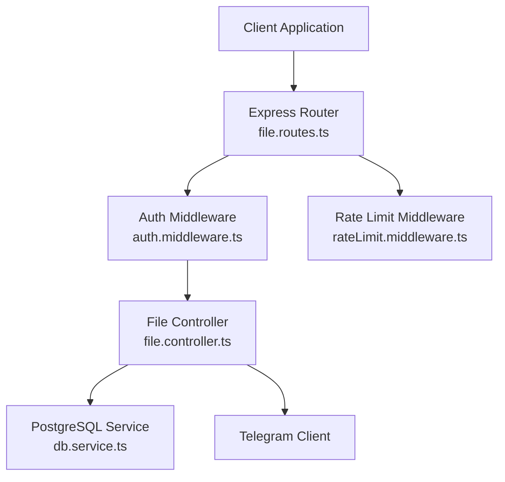
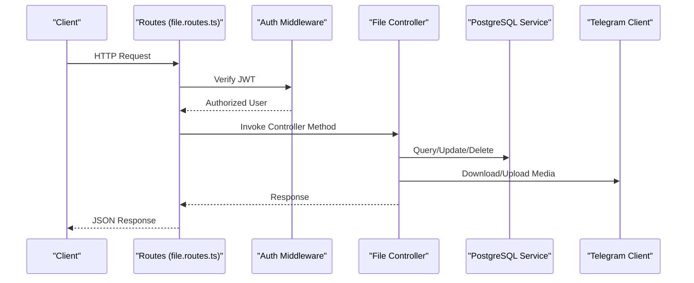
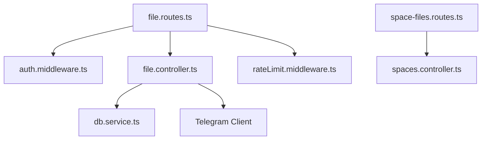

# File Management Endpoints

<cite>
**Referenced Files in This Document**
- [file.routes.ts](file://server/src/routes/file.routes.ts)
- [file.controller.ts](file://server/src/controllers/file.controller.ts)
- [auth.middleware.ts](file://server/src/middlewares/auth.middleware.ts)
- [db.service.ts](file://server/src/services/db.service.ts)
- [rateLimit.middleware.ts](file://server/src/middlewares/rateLimit.middleware.ts)
- [space-files.routes.ts](file://server/src/routes/space-files.routes.ts)
- [spaces.controller.ts](file://server/src/controllers/spaces.controller.ts)
</cite>

## Table of Contents
1. [Introduction](#introduction)
2. [Project Structure](#project-structure)
3. [Core Components](#core-components)
4. [Architecture Overview](#architecture-overview)
5. [Detailed Component Analysis](#detailed-component-analysis)
6. [Dependency Analysis](#dependency-analysis)
7. [Performance Considerations](#performance-considerations)
8. [Troubleshooting Guide](#troubleshooting-guide)
9. [Conclusion](#conclusion)

## Introduction
This document provides comprehensive API documentation for file management endpoints in the teledrive system. It covers CRUD operations for files and folders, including listing with pagination and filtering, creating, retrieving, updating, and soft-deleting files, as well as folder creation, updates, and soft-deletion. It also documents query parameters for sorting, filtering, and pagination, along with request/response schemas for file objects, metadata fields, and folder structures. Error handling patterns for file not found, permission denied, and invalid operations are included.

## Project Structure
The file management APIs are implemented in the server application using Express.js routing and controller functions. Authentication middleware enforces JWT-based access control, while PostgreSQL database service manages persistence. Rate limiting middleware protects sensitive endpoints from abuse.

**Diagram sources**
- [file.routes.ts](file://server/src/routes/file.routes.ts#L1-L118)
- [auth.middleware.ts](file://server/src/middlewares/auth.middleware.ts#L1-L82)
- [file.controller.ts](file://server/src/controllers/file.controller.ts#L1-L1121)
- [db.service.ts](file://server/src/services/db.service.ts#L1-L293)
- [rateLimit.middleware.ts](file://server/src/middlewares/rateLimit.middleware.ts#L1-L47)

**Section sources**
- [file.routes.ts](file://server/src/routes/file.routes.ts#L1-L118)
- [auth.middleware.ts](file://server/src/middlewares/auth.middleware.ts#L1-L82)
- [db.service.ts](file://server/src/services/db.service.ts#L1-L293)

## Core Components
- Routes: Define endpoints for file and folder operations, including upload, list, search, star, trash, restore, download, stream, and thumbnail.
- Controllers: Implement business logic for file/folder CRUD, pagination, filtering, tagging, and activity logging.
- Authentication: Enforce JWT-based authentication and optional share-link token bypass for public access.
- Database: Persist files, folders, tags, and activity logs with UUID primary keys and foreign key relationships.
- Rate Limiting: Apply rate limits to protect upload and download endpoints.

**Section sources**
- [file.routes.ts](file://server/src/routes/file.routes.ts#L1-L118)
- [file.controller.ts](file://server/src/controllers/file.controller.ts#L1-L1121)
- [auth.middleware.ts](file://server/src/middlewares/auth.middleware.ts#L1-L82)
- [db.service.ts](file://server/src/services/db.service.ts#L1-L293)

## Architecture Overview
The file management API follows a layered architecture:
- Presentation Layer: Express routes define HTTP endpoints.
- Application Layer: Controllers orchestrate operations, enforce validations, and manage transactions.
- Persistence Layer: PostgreSQL stores files, folders, tags, and logs.
- External Services: Telegram client handles media storage and retrieval.

**Diagram sources**
- [file.routes.ts](file://server/src/routes/file.routes.ts#L1-L118)
- [auth.middleware.ts](file://server/src/middlewares/auth.middleware.ts#L19-L81)
- [file.controller.ts](file://server/src/controllers/file.controller.ts#L103-L133)
- [db.service.ts](file://server/src/services/db.service.ts#L1-L293)

## Detailed Component Analysis

### Authentication and Authorization
- JWT-based authentication is enforced for all file endpoints via middleware.
- Share-link token bypass allows public access to specific endpoints when a valid token is provided.

**Section sources**
- [auth.middleware.ts](file://server/src/middlewares/auth.middleware.ts#L19-L81)

### File Endpoints

#### GET /files
- Purpose: List files with pagination and filtering.
- Query Parameters:
  - limit: Number of items to return (default 50).
  - offset: Starting position for pagination (default 0).
  - folder_id: Filter by folder ID or special values "root" or "null".
  - sort: Sort column (created_at, file_name, file_size, updated_at).
  - order: Sort direction (ASC or DESC).
- Response Schema:
  - success: Boolean indicating operation success.
  - files: Array of file objects with fields:
    - id: UUID.
    - name: String.
    - folder_id: UUID or null.
    - size: Number.
    - mime_type: String.
    - telegram_chat_id: String.
    - is_starred: Boolean.
    - is_trashed: Boolean.
    - created_at: Timestamp.
    - updated_at: Timestamp.

**Section sources**
- [file.routes.ts](file://server/src/routes/file.routes.ts#L91-L91)
- [file.controller.ts](file://server/src/controllers/file.controller.ts#L103-L133)

#### POST /files
- Purpose: Create a new file by uploading to Telegram and storing metadata in the database.
- Request Body (multipart/form-data):
  - file: File upload field.
  - folder_id: Optional folder UUID.
  - telegram_chat_id: Optional Telegram chat identifier (defaults to "me").
- Response Schema:
  - success: Boolean.
  - file: File object with fields as listed above.

**Section sources**
- [file.routes.ts](file://server/src/routes/file.routes.ts#L90-L90)
- [file.controller.ts](file://server/src/controllers/file.controller.ts#L49-L98)

#### GET /files/:id/details
- Purpose: Retrieve detailed file information including tags and share link metadata.
- Path Parameter:
  - id: File UUID.
- Response Schema:
  - success: Boolean.
  - file: File object with additional fields:
    - folder_name: String.
    - sha256_hash: String or null.
  - tags: Array of tag strings.
  - shareLink: Object with fields:
    - id: UUID.
    - folder_id: UUID.
    - file_id: UUID.
    - expires_at: Timestamp.
    - created_at: Timestamp.
    - download_count: Number.
    - allow_download: Boolean.
    - view_only: Boolean.
    - token: String.
    - share_url: String.
    - shareUrl: String.

**Section sources**
- [file.routes.ts](file://server/src/routes/file.routes.ts#L105-L105)
- [file.controller.ts](file://server/src/controllers/file.controller.ts#L1076-L1120)

#### GET /files/:id/download
- Purpose: Download a file by retrieving it from Telegram and serving as attachment.
- Path Parameter:
  - id: File UUID.
- Response: Binary stream with Content-Disposition header for saving.

**Section sources**
- [file.routes.ts](file://server/src/routes/file.routes.ts#L111-L111)
- [file.controller.ts](file://server/src/controllers/file.controller.ts#L413-L441)

#### GET /files/:id/stream
- Purpose: Stream media with HTTP Range support and disk caching.
- Path Parameter:
  - id: File UUID.
- Response: Binary stream with Range support and caching headers.

**Section sources**
- [file.routes.ts](file://server/src/routes/file.routes.ts#L112-L112)
- [file.controller.ts](file://server/src/controllers/file.controller.ts#L614-L689)

#### GET /files/:id/thumbnail
- Purpose: Serve optimized thumbnails with disk caching and compression.
- Path Parameter:
  - id: File UUID.
- Response: Image stream (WEBP) with caching headers.

**Section sources**
- [file.routes.ts](file://server/src/routes/file.routes.ts#L113-L113)
- [file.controller.ts](file://server/src/controllers/file.controller.ts#L453-L541)

#### PATCH /files/:id
- Purpose: Update file metadata (rename or move).
- Path Parameter:
  - id: File UUID.
- Request Body:
  - folder_id: Optional folder UUID.
  - file_name: Optional trimmed string.
- Response Schema:
  - success: Boolean.
  - file: Updated file object.

**Section sources**
- [file.routes.ts](file://server/src/routes/file.routes.ts#L114-L114)
- [file.controller.ts](file://server/src/controllers/file.controller.ts#L208-L244)

#### DELETE /files/:id
- Purpose: Permanently delete a file from Telegram and database.
- Path Parameter:
  - id: File UUID.
- Response Schema:
  - success: Boolean.
  - message: Deletion confirmation.

**Section sources**
- [file.routes.ts](file://server/src/routes/file.routes.ts#L115-L115)
- [file.controller.ts](file://server/src/controllers/file.controller.ts#L325-L351)

### Folder Endpoints

#### POST /files/folder
- Purpose: Create a new folder.
- Request Body:
  - name: Required trimmed string.
  - parent_id: Optional UUID or null.
  - color: Optional color string (default "#3174ff").
- Response Schema:
  - success: Boolean.
  - folder: Folder object with fields:
    - id: UUID.
    - user_id: UUID.
    - name: String.
    - parent_id: UUID or null.
    - color: String.
    - created_at: Timestamp.
    - is_trashed: Boolean.
    - trashed_at: Timestamp or null.

**Section sources**
- [file.routes.ts](file://server/src/routes/file.routes.ts#L50-L50)
- [file.controller.ts](file://server/src/controllers/file.controller.ts#L695-L718)

#### GET /files/folders
- Purpose: List folders with recursive file counts.
- Query Parameters:
  - parent_id: Optional UUID to filter by parent.
  - sort: Sort column (name, created_at, file_count).
  - order: Sort direction (ASC or DESC).
- Response Schema:
  - success: Boolean.
  - folders: Array of folder objects with additional fields:
    - file_count: Number.
    - total_file_count: Number.
    - folder_count: Number.

**Section sources**
- [file.routes.ts](file://server/src/routes/file.routes.ts#L51-L51)
- [file.controller.ts](file://server/src/controllers/file.controller.ts#L723-L790)

#### PATCH /files/folder/:id
- Purpose: Update folder metadata (rename or color).
- Path Parameter:
  - id: Folder UUID.
- Request Body:
  - name: Optional trimmed string.
  - color: Optional color string.
- Response Schema:
  - success: Boolean.
  - folder: Updated folder object.

**Section sources**
- [file.routes.ts](file://server/src/routes/file.routes.ts#L52-L52)
- [file.controller.ts](file://server/src/controllers/file.controller.ts#L795-L833)

#### DELETE /files/folder/:id
- Purpose: Soft-delete a folder and all its descendants with cascading effect on files.
- Path Parameter:
  - id: Folder UUID.
- Response Schema:
  - success: Boolean.
  - message: Confirmation including number of sub-folders moved to trash.

**Section sources**
- [file.routes.ts](file://server/src/routes/file.routes.ts#L53-L53)
- [file.controller.ts](file://server/src/controllers/file.controller.ts#L838-L872)

### Additional File Operations

#### GET /files/search
- Purpose: Search files and folders by name with pagination.
- Query Parameters:
  - q: Required search term.
  - type: Optional MIME type filter.
  - folder_id: Optional folder UUID filter.
  - limit: Maximum results (capped at 200).
  - offset: Offset for pagination.
- Response Schema:
  - success: Boolean.
  - results: Mixed array of folder and file objects.
  - pagination: Object with limit, offset, returned.

**Section sources**
- [file.routes.ts](file://server/src/routes/file.routes.ts#L32-L32)
- [file.controller.ts](file://server/src/controllers/file.controller.ts#L138-L203)

#### GET /files/starred
- Purpose: List starred files.
- Response Schema:
  - success: Boolean.
  - files: Array of file objects.

**Section sources**
- [file.routes.ts](file://server/src/routes/file.routes.ts#L39-L39)
- [file.controller.ts](file://server/src/controllers/file.controller.ts#L269-L280)

#### PATCH /files/:id/star
- Purpose: Toggle star status for a file.
- Path Parameter:
  - id: File UUID.
- Response Schema:
  - success: Boolean.
  - is_starred: Boolean.

**Section sources**
- [file.routes.ts](file://server/src/routes/file.routes.ts#L40-L40)
- [file.controller.ts](file://server/src/controllers/file.controller.ts#L249-L264)

#### GET /files/trash
- Purpose: List trashed files.
- Response Schema:
  - success: Boolean.
  - files: Array of file objects.

**Section sources**
- [file.routes.ts](file://server/src/routes/file.routes.ts#L43-L43)
- [file.controller.ts](file://server/src/controllers/file.controller.ts#L356-L367)

#### PATCH /files/:id/trash
- Purpose: Move a file to trash (soft delete).
- Path Parameter:
  - id: File UUID.
- Response Schema:
  - success: Boolean.
  - message: Confirmation.

**Section sources**
- [file.routes.ts](file://server/src/routes/file.routes.ts#L44-L44)
- [file.controller.ts](file://server/src/controllers/file.controller.ts#L285-L300)

#### PATCH /files/:id/restore
- Purpose: Restore a file from trash.
- Path Parameter:
  - id: File UUID.
- Response Schema:
  - success: Boolean.
  - message: Confirmation.

**Section sources**
- [file.routes.ts](file://server/src/routes/file.routes.ts#L45-L45)
- [file.controller.ts](file://server/src/controllers/file.controller.ts#L305-L320)

#### DELETE /files/trash
- Purpose: Permanently delete all trashed files and their Telegram messages.
- Response Schema:
  - success: Boolean.
  - message: Confirmation.

**Section sources**
- [file.routes.ts](file://server/src/routes/file.routes.ts#L46-L46)
- [file.controller.ts](file://server/src/controllers/file.controller.ts#L372-L407)

### Shared Space File Download (External)
- Endpoint: GET /api/space/:id/download
- Purpose: Download a file from a shared space using a signed token.
- Query Parameters:
  - sig: Signed token identifying the file and space.
- Response: Binary stream with Content-Disposition header.

**Section sources**
- [space-files.routes.ts](file://server/src/routes/space-files.routes.ts#L1-L10)
- [spaces.controller.ts](file://server/src/controllers/spaces.controller.ts#L427-L497)

## Dependency Analysis
The file management endpoints depend on:
- Authentication middleware for user identity and session string.
- Database service for schema initialization and data persistence.
- Rate limiting middleware for upload and chunk endpoints.
- Telegram client for media operations.

**Diagram sources**
- [file.routes.ts](file://server/src/routes/file.routes.ts#L1-L118)
- [auth.middleware.ts](file://server/src/middlewares/auth.middleware.ts#L1-L82)
- [file.controller.ts](file://server/src/controllers/file.controller.ts#L1-L1121)
- [db.service.ts](file://server/src/services/db.service.ts#L1-L293)
- [rateLimit.middleware.ts](file://server/src/middlewares/rateLimit.middleware.ts#L1-L47)
- [space-files.routes.ts](file://server/src/routes/space-files.routes.ts#L1-L10)
- [spaces.controller.ts](file://server/src/controllers/spaces.controller.ts#L1-L498)

**Section sources**
- [file.routes.ts](file://server/src/routes/file.routes.ts#L1-L118)
- [file.controller.ts](file://server/src/controllers/file.controller.ts#L1-L1121)
- [auth.middleware.ts](file://server/src/middlewares/auth.middleware.ts#L1-L82)
- [db.service.ts](file://server/src/services/db.service.ts#L1-L293)
- [rateLimit.middleware.ts](file://server/src/middlewares/rateLimit.middleware.ts#L1-L47)
- [space-files.routes.ts](file://server/src/routes/space-files.routes.ts#L1-L10)
- [spaces.controller.ts](file://server/src/controllers/spaces.controller.ts#L1-L498)

## Performance Considerations
- Pagination: All list endpoints accept limit and offset parameters to control result size and enable efficient traversal.
- Sorting: Sorting is supported on specific columns with validated whitelist to prevent SQL injection.
- Caching: Thumbnail and stream endpoints utilize disk caching to reduce repeated downloads and improve latency.
- Batch Operations: Bulk actions allow efficient operations on multiple files.

[No sources needed since this section provides general guidance]

## Troubleshooting Guide
Common error scenarios and their likely causes:
- 401 Unauthorized: Missing or invalid JWT token, or missing share-link token for public endpoints.
- 404 Not Found: File or folder ID does not exist or belongs to another user.
- 400 Bad Request: Missing required fields, invalid parameters, or unsupported file type.
- 403 Forbidden: Attempted operation not permitted (e.g., shared space download disabled).
- 500 Internal Server Error: Database or Telegram client failures during operations.

Typical error response format:
- success: false
- error: Human-readable error message

**Section sources**
- [auth.middleware.ts](file://server/src/middlewares/auth.middleware.ts#L54-L80)
- [file.controller.ts](file://server/src/controllers/file.controller.ts#L238-L238)
- [file.controller.ts](file://server/src/controllers/file.controller.ts#L294-L294)
- [file.controller.ts](file://server/src/controllers/file.controller.ts#L438-L438)
- [spaces.controller.ts](file://server/src/controllers/spaces.controller.ts#L440-L443)

## Conclusion
The file management API provides a robust set of endpoints for CRUD operations on files and folders, with strong authentication, pagination, filtering, and caching. The design emphasizes reliability through soft deletion, activity logging, and structured error responses. Developers should leverage the documented schemas and parameters to integrate seamlessly with the backend services.