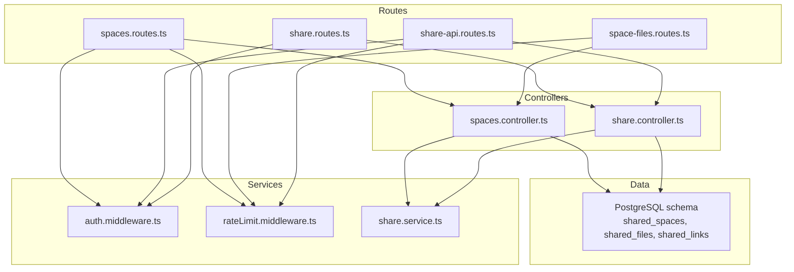
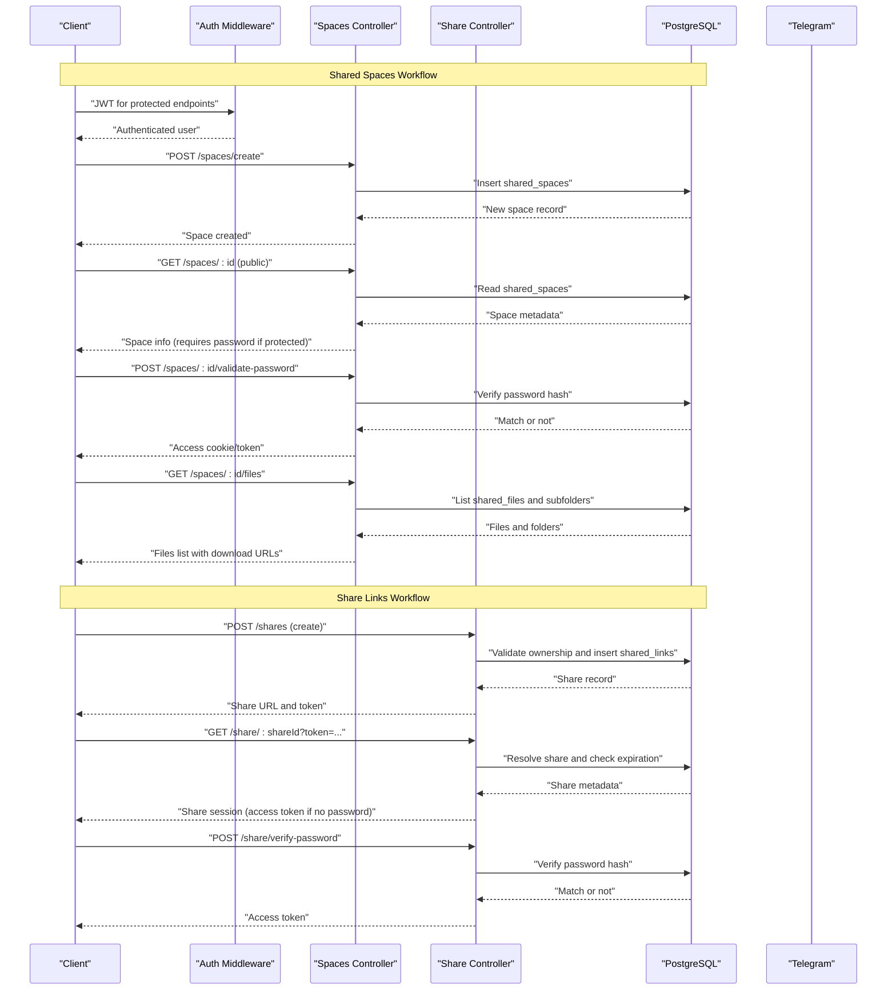
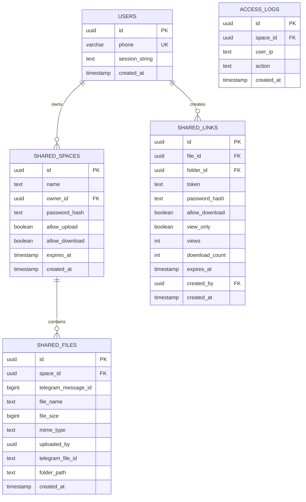
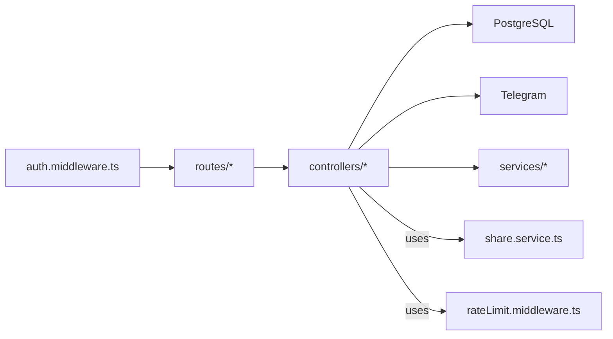

# Shared Spaces Endpoints

<cite>
**Referenced Files in This Document**
- [spaces.controller.ts](file://server/src/controllers/spaces.controller.ts)
- [spaces.routes.ts](file://server/src/routes/spaces.routes.ts)
- [space-files.routes.ts](file://server/src/routes/space-files.routes.ts)
- [share.controller.ts](file://server/src/controllers/share.controller.ts)
- [share.routes.ts](file://server/src/routes/share.routes.ts)
- [share-api.routes.ts](file://server/src/routes/share-api.routes.ts)
- [auth.middleware.ts](file://server/src/middlewares/auth.middleware.ts)
- [rateLimit.middleware.ts](file://server/src/middlewares/rateLimit.middleware.ts)
- [share.service.ts](file://server/src/services/share.service.ts)
- [db.service.ts](file://server/src/services/db.service.ts)
- [index.ts](file://server/src/index.ts)
</cite>

## Table of Contents
1. [Introduction](#introduction)
2. [Project Structure](#project-structure)
3. [Core Components](#core-components)
4. [Architecture Overview](#architecture-overview)
5. [Detailed Component Analysis](#detailed-component-analysis)
6. [Dependency Analysis](#dependency-analysis)
7. [Performance Considerations](#performance-considerations)
8. [Troubleshooting Guide](#troubleshooting-guide)
9. [Conclusion](#conclusion)

## Introduction
This document describes the collaborative workspace (shared spaces) and file sharing APIs. It covers:
- Creating and listing shared spaces
- Accessing space details and managing password-protected access
- Managing files within spaces (listing, uploading, downloading)
- Generating and using share links for public/private file/folder sharing
- Permission management, authentication, and access control mechanisms

The system integrates a Telegram-backed storage layer with PostgreSQL for metadata and JWT-based authentication. Rate limiting protects endpoints from abuse.

## Project Structure
Key backend modules involved in shared spaces and sharing:
- Routes define endpoint contracts and attach middleware
- Controllers implement business logic and integrate with Telegram and DB
- Services encapsulate JWT signing/verification and URL generation
- Middleware enforces authentication and rate limits
- Database schema defines shared spaces, shared files, and shared links

**Diagram sources**
- [spaces.routes.ts](file://server/src/routes/spaces.routes.ts#L1-L35)
- [space-files.routes.ts](file://server/src/routes/space-files.routes.ts#L1-L10)
- [share.routes.ts](file://server/src/routes/share.routes.ts#L1-L12)
- [share-api.routes.ts](file://server/src/routes/share-api.routes.ts#L1-L21)
- [spaces.controller.ts](file://server/src/controllers/spaces.controller.ts#L1-L498)
- [share.controller.ts](file://server/src/controllers/share.controller.ts#L1-L633)
- [auth.middleware.ts](file://server/src/middlewares/auth.middleware.ts#L1-L82)
- [rateLimit.middleware.ts](file://server/src/middlewares/rateLimit.middleware.ts#L1-L47)
- [share.service.ts](file://server/src/services/share.service.ts#L1-L183)
- [db.service.ts](file://server/src/services/db.service.ts#L67-L123)

**Section sources**
- [spaces.routes.ts](file://server/src/routes/spaces.routes.ts#L1-L35)
- [space-files.routes.ts](file://server/src/routes/space-files.routes.ts#L1-L10)
- [share.routes.ts](file://server/src/routes/share.routes.ts#L1-L12)
- [share-api.routes.ts](file://server/src/routes/share-api.routes.ts#L1-L21)
- [spaces.controller.ts](file://server/src/controllers/spaces.controller.ts#L1-L498)
- [share.controller.ts](file://server/src/controllers/share.controller.ts#L1-L633)
- [auth.middleware.ts](file://server/src/middlewares/auth.middleware.ts#L1-L82)
- [rateLimit.middleware.ts](file://server/src/middlewares/rateLimit.middleware.ts#L1-L47)
- [share.service.ts](file://server/src/services/share.service.ts#L1-L183)
- [db.service.ts](file://server/src/services/db.service.ts#L67-L123)

## Core Components
- Shared Spaces API
  - POST /api/spaces/create: Create a new shared space with optional password, upload/download permissions, and expiration
  - GET /api/spaces: List spaces owned by the authenticated user
  - GET /api/spaces/:id: Get public space metadata (requires password if protected)
  - POST /api/spaces/:id/validate-password: Validate password for a protected space; returns access cookie/token
  - GET /api/spaces/:id/files: List files and subfolders within a space (requires access)
  - POST /api/spaces/:id/upload: Upload a file into a space (requires access and enabled upload)
  - GET /api/files/:id/download?sig=...: Download a file from a space using a signed token

- Share Links API
  - POST /api/shares: Create a share link for a file or folder with optional password, download/view permissions, and expiration
  - GET /api/shares: List user’s own share links
  - DELETE /api/shares/:id: Revoke a share link
  - GET /share/:shareId?token=...: Public entry point to a share session
  - POST /api/share/verify-password: Verify password for a protected share link
  - GET /api/share/files: List files/folders in a share (authorized)
  - GET /api/share/download/:fileId: Download a file from a share (authorized)

- Authentication and Access Control
  - JWT-based auth for most endpoints
  - Space-specific access cookies/tokens for password-protected spaces
  - Share link tokens and access tokens for public/private sharing
  - Rate limiting per endpoint category

**Section sources**
- [spaces.controller.ts](file://server/src/controllers/spaces.controller.ts#L161-L295)
- [spaces.controller.ts](file://server/src/controllers/spaces.controller.ts#L297-L497)
- [spaces.routes.ts](file://server/src/routes/spaces.routes.ts#L26-L32)
- [space-files.routes.ts](file://server/src/routes/space-files.routes.ts#L7-L7)
- [share.controller.ts](file://server/src/controllers/share.controller.ts#L205-L325)
- [share.controller.ts](file://server/src/controllers/share.controller.ts#L327-L538)
- [share.routes.ts](file://server/src/routes/share.routes.ts#L7-L9)
- [share-api.routes.ts](file://server/src/routes/share-api.routes.ts#L14-L18)
- [auth.middleware.ts](file://server/src/middlewares/auth.middleware.ts#L19-L81)
- [rateLimit.middleware.ts](file://server/src/middlewares/rateLimit.middleware.ts#L4-L46)

## Architecture Overview
High-level flow for shared spaces and sharing:
- Clients authenticate with JWT
- For shared spaces:
  - Public metadata retrieval checks expiration and password requirement
  - Password-protected spaces issue a space access cookie/token upon successful validation
  - File operations within a space require validated access and configured permissions
- For share links:
  - Creation validates ownership and target (file or folder)
  - Optional password-protected links issue a share access token after verification
  - Downloads enforce permissions and optional view-only restrictions

**Diagram sources**
- [spaces.controller.ts](file://server/src/controllers/spaces.controller.ts#L161-L295)
- [spaces.controller.ts](file://server/src/controllers/spaces.controller.ts#L297-L497)
- [share.controller.ts](file://server/src/controllers/share.controller.ts#L205-L325)
- [share.controller.ts](file://server/src/controllers/share.controller.ts#L327-L538)
- [auth.middleware.ts](file://server/src/middlewares/auth.middleware.ts#L19-L81)
- [db.service.ts](file://server/src/services/db.service.ts#L67-L123)

## Detailed Component Analysis

### Shared Spaces Endpoints

#### POST /api/spaces/create
- Purpose: Create a new shared space
- Authentication: Required (JWT)
- Body fields:
  - name (required, 2–120 chars)
  - allow_upload (optional, default false)
  - allow_download (optional, default true)
  - password (optional, sets password hash)
  - expires_at (optional UTC datetime)
- Behavior:
  - Validates inputs and expiration
  - Hashes password if provided
  - Inserts into shared_spaces
  - Returns created space metadata
- Access control:
  - Owner is the authenticated user
  - Optional password enables password-protected access
- Rate limit: None (auth required)

**Section sources**
- [spaces.controller.ts](file://server/src/controllers/spaces.controller.ts#L161-L194)
- [spaces.routes.ts](file://server/src/routes/spaces.routes.ts#L27-L27)

#### GET /api/spaces
- Purpose: List spaces owned by the authenticated user
- Authentication: Required (JWT)
- Response includes:
  - Space summary with file_count and total_size aggregated from shared_files
- Access control:
  - Only owner’s spaces are returned

**Section sources**
- [spaces.controller.ts](file://server/src/controllers/spaces.controller.ts#L196-L216)
- [spaces.routes.ts](file://server/src/routes/spaces.routes.ts#L26-L26)

#### GET /api/spaces/:id
- Purpose: Get public space metadata
- Authentication: Not required for this endpoint
- Behavior:
  - Checks expiration
  - Indicates whether password is required
  - Logs access event
- Access control:
  - If password-protected, access token/cookie is required for further operations

**Section sources**
- [spaces.controller.ts](file://server/src/controllers/spaces.controller.ts#L218-L253)
- [spaces.routes.ts](file://server/src/routes/spaces.routes.ts#L29-L29)

#### POST /api/spaces/:id/validate-password
- Purpose: Validate password for a password-protected space
- Authentication: Not required for this endpoint
- Behavior:
  - Verifies password against stored hash
  - Issues a space access cookie/token on success
  - Logs password attempts
- Access control:
  - On success, grants temporary access to space operations

**Section sources**
- [spaces.controller.ts](file://server/src/controllers/spaces.controller.ts#L255-L295)
- [spaces.routes.ts](file://server/src/routes/spaces.routes.ts#L30-L30)
- [rateLimit.middleware.ts](file://server/src/middlewares/rateLimit.middleware.ts#L30-L34)

#### GET /api/spaces/:id/files
- Purpose: List files and subfolders within a space
- Authentication: Not required for this endpoint (but requires space access)
- Behavior:
  - Validates space access (including password if required)
  - Lists files in the requested folder_path
  - Builds child folders list
  - Adds signed download URLs when downloads are allowed
- Access control:
  - Requires space access; respects allow_download flag

**Section sources**
- [spaces.controller.ts](file://server/src/controllers/spaces.controller.ts#L297-L355)
- [spaces.routes.ts](file://server/src/routes/spaces.routes.ts#L31-L31)
- [rateLimit.middleware.ts](file://server/src/middlewares/rateLimit.middleware.ts#L24-L28)

#### POST /api/spaces/:id/upload
- Purpose: Upload a file into a space
- Authentication: Not required for this endpoint (but requires space access)
- Behavior:
  - Validates file size and MIME type
  - Uploads to Telegram using owner’s session
  - Records shared_files entry
  - Logs upload event
- Access control:
  - Requires space access and allow_upload=true

**Section sources**
- [spaces.controller.ts](file://server/src/controllers/spaces.controller.ts#L357-L425)
- [spaces.routes.ts](file://server/src/routes/spaces.routes.ts#L32-L32)
- [rateLimit.middleware.ts](file://server/src/middlewares/rateLimit.middleware.ts#L36-L40)

#### GET /api/files/:id/download?sig=...
- Purpose: Download a file from a space using a signed token
- Authentication: Not required for this endpoint (validated via sig)
- Behavior:
  - Verifies signed token bound to space and file
  - Streams file from Telegram via owner session
  - Respects allow_download flag
- Access control:
  - Token must match both file and space; TTL enforced

**Section sources**
- [spaces.controller.ts](file://server/src/controllers/spaces.controller.ts#L427-L497)
- [space-files.routes.ts](file://server/src/routes/space-files.routes.ts#L7-L7)
- [rateLimit.middleware.ts](file://server/src/middlewares/rateLimit.middleware.ts#L42-L46)

### Share Links Endpoints

#### POST /api/shares
- Purpose: Create a share link for a file or folder
- Authentication: Required (JWT)
- Body fields:
  - folder_id or file_id (mutually exclusive)
  - password (optional)
  - expires_in_hours (optional, default ~5 days)
  - allow_download (optional, default true)
  - view_only (optional, default false)
- Behavior:
  - Validates ownership and target existence
  - Optionally hashes password
  - Generates share link token and URL
- Access control:
  - Only the owner can create shares

**Section sources**
- [share.controller.ts](file://server/src/controllers/share.controller.ts#L205-L264)
- [share.routes.ts](file://server/src/routes/share.routes.ts#L8-L8)

#### GET /api/shares
- Purpose: List user’s own share links
- Authentication: Required (JWT)
- Response includes:
  - Share metadata with share_url and token

**Section sources**
- [share.controller.ts](file://server/src/controllers/share.controller.ts#L266-L307)
- [share.routes.ts](file://server/src/routes/share.routes.ts#L7-L7)

#### DELETE /api/shares/:id
- Purpose: Revoke a share link
- Authentication: Required (JWT)
- Behavior:
  - Deletes share if owned by the user

**Section sources**
- [share.controller.ts](file://server/src/controllers/share.controller.ts#L309-L325)
- [share.routes.ts](file://server/src/routes/share.routes.ts#L9-L9)

#### GET /share/:shareId?token=...
- Purpose: Enter a share session
- Authentication: Not required for this endpoint
- Behavior:
  - Resolves share and checks expiration
  - If password required, returns requires_password=true without access token
  - Otherwise issues a share access token

**Section sources**
- [share.controller.ts](file://server/src/controllers/share.controller.ts#L327-L359)
- [share-api.routes.ts](file://server/src/routes/share-api.routes.ts#L18-L18)

#### POST /api/share/verify-password
- Purpose: Verify password for a protected share
- Authentication: Not required for this endpoint
- Behavior:
  - Verifies password hash
  - Returns access token on success

**Section sources**
- [share.controller.ts](file://server/src/controllers/share.controller.ts#L361-L392)
- [share-api.routes.ts](file://server/src/routes/share-api.routes.ts#L15-L15)
- [rateLimit.middleware.ts](file://server/src/middlewares/rateLimit.middleware.ts#L4-L8)

#### GET /api/share/files
- Purpose: List files/folders in a share (authorized)
- Authentication: Required (share access token)
- Behavior:
  - Resolves authorized share
  - Supports pagination, sorting, and search within the share tree
  - Enforces depth limits and visibility rules

**Section sources**
- [share.controller.ts](file://server/src/controllers/share.controller.ts#L394-L538)
- [share-api.routes.ts](file://server/src/routes/share-api.routes.ts#L16-L16)
- [rateLimit.middleware.ts](file://server/src/middlewares/rateLimit.middleware.ts#L10-L22)

#### GET /api/share/download/:fileId
- Purpose: Download a file from a share (authorized)
- Authentication: Required (share access token)
- Behavior:
  - Resolves authorized share and file
  - Enforces allow_download and view_only flags
  - Streams file from Telegram via owner session
  - Supports Range requests

**Section sources**
- [share.controller.ts](file://server/src/controllers/share.controller.ts#L540-L632)
- [share-api.routes.ts](file://server/src/routes/share-api.routes.ts#L17-L17)
- [rateLimit.middleware.ts](file://server/src/middlewares/rateLimit.middleware.ts#L17-L22)

### Authentication and Access Control

#### JWT Authentication
- Most endpoints require a Bearer JWT
- Middleware verifies token and attaches user/session to request
- Some public endpoints accept a share link token via query param to bypass auth for specific routes

**Section sources**
- [auth.middleware.ts](file://server/src/middlewares/auth.middleware.ts#L19-L81)

#### Space Access Tokens
- Password-protected spaces issue a space access cookie/token
- Used to access space resources without re-entering password during a period

**Section sources**
- [spaces.controller.ts](file://server/src/controllers/spaces.controller.ts#L65-L85)
- [spaces.controller.ts](file://server/src/controllers/spaces.controller.ts#L281-L291)

#### Share Access Tokens
- Generated after successful password verification or upon entering a non-password-protected share
- Used for authorized operations like listing files and downloading

**Section sources**
- [share.service.ts](file://server/src/services/share.service.ts#L89-L110)
- [share.controller.ts](file://server/src/controllers/share.controller.ts#L350-L355)
- [share.controller.ts](file://server/src/controllers/share.controller.ts#L377-L388)

#### Rate Limiting
- Different categories with distinct thresholds and windows:
  - sharePasswordLimiter: strict password attempts
  - shareViewLimiter: public share views
  - shareDownloadLimiter: share downloads
  - spaceViewLimiter: space public views
  - spacePasswordLimiter: space password attempts
  - spaceUploadLimiter: space uploads
  - signedDownloadLimiter: signed download attempts

**Section sources**
- [rateLimit.middleware.ts](file://server/src/middlewares/rateLimit.middleware.ts#L4-L46)

### Data Models and Permissions

**Diagram sources**
- [db.service.ts](file://server/src/services/db.service.ts#L67-L123)

**Section sources**
- [db.service.ts](file://server/src/services/db.service.ts#L67-L123)

## Dependency Analysis

**Diagram sources**
- [auth.middleware.ts](file://server/src/middlewares/auth.middleware.ts#L1-L82)
- [spaces.routes.ts](file://server/src/routes/spaces.routes.ts#L1-L35)
- [space-files.routes.ts](file://server/src/routes/space-files.routes.ts#L1-L10)
- [share.routes.ts](file://server/src/routes/share.routes.ts#L1-L12)
- [share-api.routes.ts](file://server/src/routes/share-api.routes.ts#L1-L21)
- [spaces.controller.ts](file://server/src/controllers/spaces.controller.ts#L1-L498)
- [share.controller.ts](file://server/src/controllers/share.controller.ts#L1-L633)
- [share.service.ts](file://server/src/services/share.service.ts#L1-L183)
- [rateLimit.middleware.ts](file://server/src/middlewares/rateLimit.middleware.ts#L1-L47)
- [db.service.ts](file://server/src/services/db.service.ts#L67-L123)

**Section sources**
- [auth.middleware.ts](file://server/src/middlewares/auth.middleware.ts#L1-L82)
- [spaces.controller.ts](file://server/src/controllers/spaces.controller.ts#L1-L498)
- [share.controller.ts](file://server/src/controllers/share.controller.ts#L1-L633)
- [share.service.ts](file://server/src/services/share.service.ts#L1-L183)
- [rateLimit.middleware.ts](file://server/src/middlewares/rateLimit.middleware.ts#L1-L47)
- [db.service.ts](file://server/src/services/db.service.ts#L67-L123)

## Performance Considerations
- Streaming downloads: Both shared spaces and share links stream directly from Telegram to clients, minimizing server memory usage
- Signed tokens: Short-lived tokens reduce server-side state and enable CDN-friendly caching of signed URLs
- Pagination and limits: Share file listing supports pagination and size limits to control response sizes
- Rate limiting: Prevents abuse and ensures fair resource allocation across endpoints
- Thumbnails and streaming caches: Separate caching strategies exist elsewhere in the system to optimize media delivery

[No sources needed since this section provides general guidance]

## Troubleshooting Guide
- 401 Unauthorized
  - Missing or invalid Bearer token
  - Share link token mismatch or missing
- 403 Forbidden
  - Uploads/downloads disabled for the space/share
  - View-only mode prevents downloads
- 404 Not Found
  - Space, file, or share not found
  - Target not present in share tree
- 410 Gone
  - Space or share has expired
- Too Many Requests
  - Exceeded rate limits for password attempts, views, downloads, or uploads

Common checks:
- Verify JWT secret and environment configuration
- Confirm share link secret and base URL settings
- Ensure Telegram session_string is valid for the owner
- Validate folder_path normalization and MIME type allowances

**Section sources**
- [spaces.controller.ts](file://server/src/controllers/spaces.controller.ts#L128-L159)
- [spaces.controller.ts](file://server/src/controllers/spaces.controller.ts#L255-L295)
- [spaces.controller.ts](file://server/src/controllers/spaces.controller.ts#L357-L425)
- [share.controller.ts](file://server/src/controllers/share.controller.ts#L327-L392)
- [share.controller.ts](file://server/src/controllers/share.controller.ts#L540-L632)
- [rateLimit.middleware.ts](file://server/src/middlewares/rateLimit.middleware.ts#L4-L46)

## Conclusion
The shared spaces and share link APIs provide a robust foundation for collaborative file management:
- Spaces offer password-protected, permissioned collaboration with upload/download controls
- Share links enable flexible public/private distribution with granular permissions
- Strong authentication and rate limiting protect the system
- Efficient streaming and tokenization keep performance high

Future enhancements could include member roles, audit logs, and advanced permission matrices.