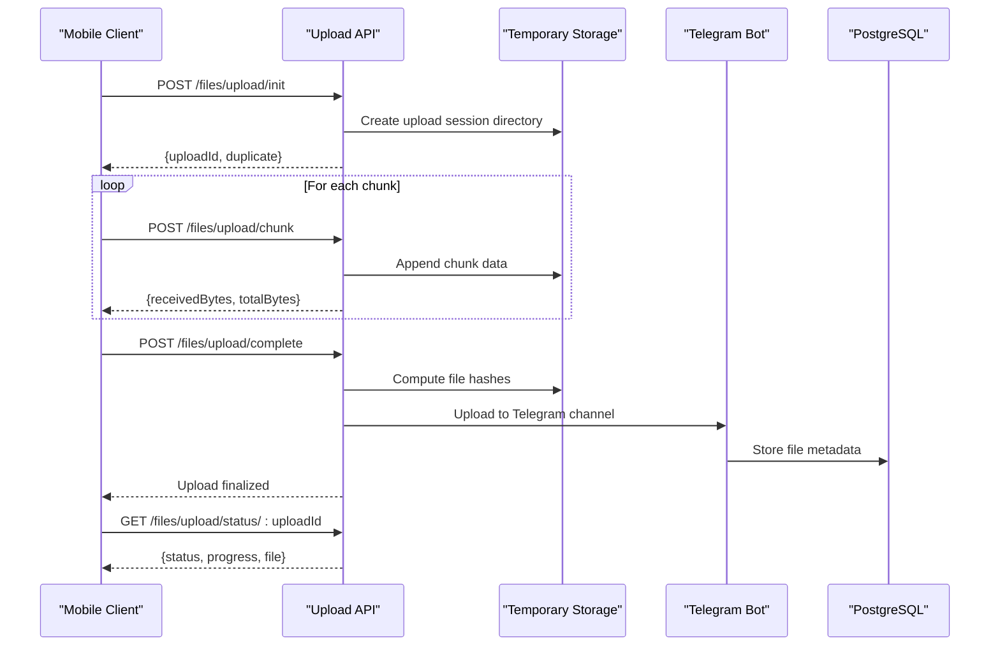
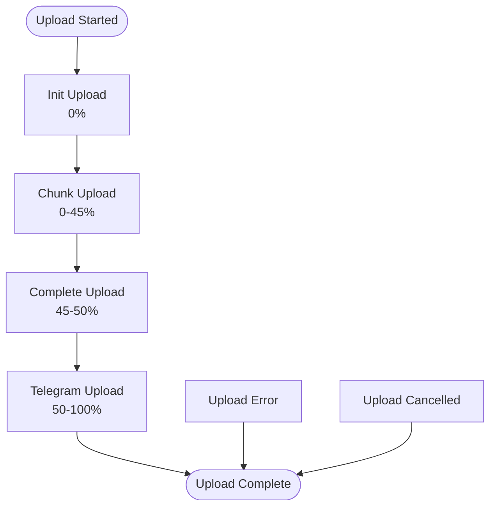
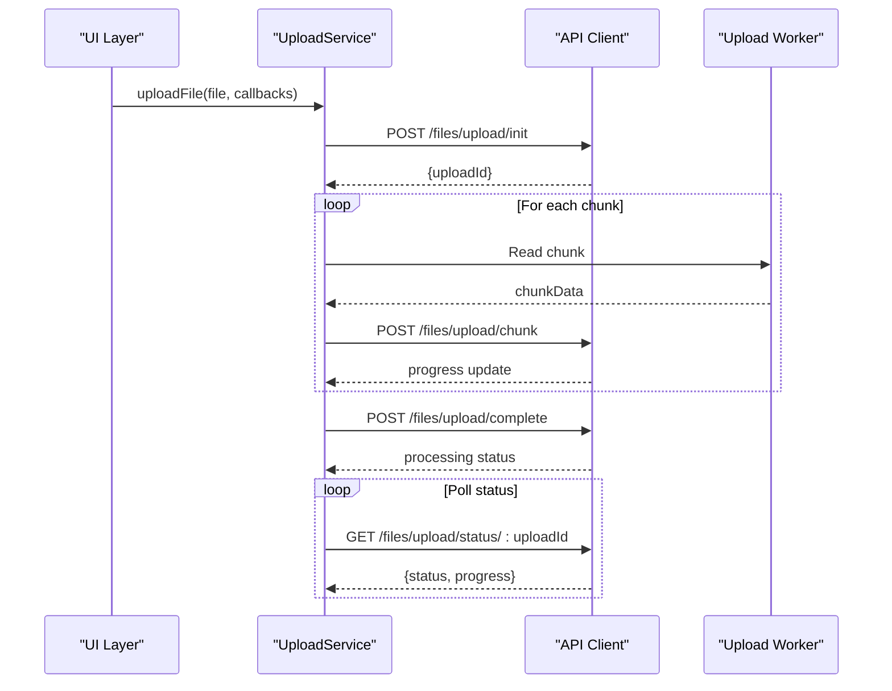

# Upload and Download Endpoints

<cite>
**Referenced Files in This Document**
- [upload.controller.ts](file://server/src/controllers/upload.controller.ts)
- [file.controller.ts](file://server/src/controllers/file.controller.ts)
- [stream.controller.ts](file://server/src/controllers/stream.controller.ts)
- [file.routes.ts](file://server/src/routes/file.routes.ts)
- [stream.routes.ts](file://server/src/routes/stream.routes.ts)
- [uploadService.ts](file://app/src/services/uploadService.ts)
- [DownloadManager.ts](file://app/src/services/DownloadManager.ts)
- [apiClient.ts](file://app/src/services/apiClient.ts)
</cite>

## Table of Contents
1. [Introduction](#introduction)
2. [Upload Architecture](#upload-architecture)
3. [Upload Endpoints](#upload-endpoints)
4. [Download Endpoints](#download-endpoints)
5. [Streaming Endpoints](#streaming-endpoints)
6. [Request/Response Schemas](#requestresponse-schemas)
7. [Chunked Upload Implementation](#chunked-upload-implementation)
8. [Progress Tracking](#progress-tracking)
9. [Error Handling](#error-handling)
10. [Client-Side Implementation Patterns](#client-side-implementation-patterns)
11. [Performance Considerations](#performance-considerations)
12. [Troubleshooting Guide](#troubleshooting-guide)
13. [Conclusion](#conclusion)

## Introduction

This document provides comprehensive API documentation for the upload and download endpoints in the Axya cloud storage system. The platform uses Telegram as the underlying storage backend while providing a modern cloud drive interface through a React Native mobile application.

The system implements a sophisticated chunked upload mechanism with resume capability, progressive streaming with HTTP Range support, and robust error handling for interrupted transfers. All endpoints are protected by JWT authentication middleware.

## Upload Architecture

The upload system follows a three-tier architecture designed for reliability and performance:



**Diagram sources**
- [upload.controller.ts](file://server/src/controllers/upload.controller.ts#L136-L274)
- [upload.controller.ts](file://server/src/controllers/upload.controller.ts#L277-L320)
- [upload.controller.ts](file://server/src/controllers/upload.controller.ts#L323-L488)

## Upload Endpoints

### POST /files/upload/init

**Purpose**: Initialize a new file upload session and check for duplicates.

**Request Body**:
```typescript
{
  originalname: string;      // Original filename
  size: number;              // File size in bytes
  mimetype: string;          // MIME type
  folder_id?: string;        // Target folder ID
  telegram_chat_id?: string; // Telegram chat target
  hash?: string;             // File hash for deduplication
}
```

**Response**:
```typescript
{
  success: boolean;
  uploadId?: string;         // Unique upload session ID
  duplicate?: boolean;       // True if file already exists
  file?: FileMetadata;       // Existing file metadata (when duplicate)
}
```

**Duplicate Detection**: The system checks for existing files using SHA256 or MD5 hashes. If a duplicate is found, it returns the existing file metadata without re-uploading.

**Rate Limiting**: 2000 requests per 15 minutes per user.

### POST /files/upload/chunk

**Purpose**: Upload file chunks with resume capability.

**Request Body**:
```typescript
{
  uploadId: string;          // Session ID from init
  chunkIndex: number;        // Zero-based chunk index
  chunkBase64?: string;      // Base64 encoded chunk data
  // OR multipart/form-data with 'chunk' field
}
```

**Response**:
```typescript
{
  success: boolean;
  receivedBytes: number;     // Total bytes received
  totalBytes: number;        // Total file size
}
```

**Chunk Ordering**: The system validates chunk order to prevent out-of-sequence uploads. Each chunk must match the expected `nextExpectedChunk` value.

**Chunk Size Recommendations**: 
- Mobile platforms: 5MB chunks
- Web platform: Variable size based on available memory
- Maximum recommended: 10MB per chunk

### POST /files/upload/complete

**Purpose**: Finalize the upload process and initiate Telegram upload.

**Request Body**:
```typescript
{
  uploadId: string;          // Session ID from init
}
```

**Response**:
```typescript
{
  success: boolean;
  message: string;           // Processing status
}
```

**Processing**: The system computes file hashes, performs pre-upload deduplication, and uploads to Telegram using a semaphore-controlled queue.

### POST /files/upload/cancel

**Purpose**: Cancel an active upload session.

**Request Body**:
```typescript
{
  uploadId: string;          // Session ID to cancel
}
```

**Response**:
```typescript
{
  success: boolean;
  message: string;
}
```

### GET /files/upload/status/:uploadId

**Purpose**: Poll upload status during Telegram upload process.

**Response**:
```typescript
{
  success: boolean;
  progress: number;          // Telegram upload progress (0-100)
  status: string;            // Session status
  file?: FileMetadata;       // Final file metadata
  error?: string;            // Error message if any
  receivedBytes: number;
  totalBytes: number;
}
```

**Status Values**: `initialized`, `uploading_to_telegram`, `completed`, `error`, `cancelled`

## Download Endpoints

### GET /files/:id/download

**Purpose**: Direct file download with immediate response.

**Response Headers**:
- `Content-Type`: File MIME type
- `Content-Disposition`: `attachment; filename="..."`  
- `Content-Length`: File size in bytes
- `Cache-Control`: `private, max-age=3600`

**Implementation Pattern**: The server downloads the file from Telegram, caches it temporarily, and serves it directly to the client.

**Client-Side Usage**: The mobile app uses `expo-file-system` for reliable downloads with progress tracking and cancellation support.

### GET /files/:id/stream

**Purpose**: Progressive streaming with HTTP Range support for media playback.

**Response Headers**:
- `Content-Type`: File MIME type
- `Accept-Ranges`: `bytes`
- `Content-Length`: Chunk size in bytes
- `Cache-Control`: `private, max-age=3600`
- `Content-Disposition`: `inline; filename="..."`
- `Content-Range`: Present for partial content (206 responses)

**Range Request Support**: Mobile video players frequently send multiple Range requests. The system handles these efficiently by serving pre-downloaded cached content.

**Cache Strategy**: Files are downloaded once from Telegram, cached to disk, and served from cache for subsequent requests.

## Streaming Endpoints

### GET /stream/:fileId

**Purpose**: Alternative streaming endpoint with enhanced progress tracking.

**Response**: Same as `/files/:id/stream` but with improved caching and progress reporting.

### GET /stream/:fileId/status

**Purpose**: Monitor streaming download progress and cache status.

**Response**:
```typescript
{
  success: boolean;
  status: string;            // pending/downloading/ready/error
  totalSize: number;
  downloadedBytes: number;
  progress: number;
  cached: boolean;
  error?: string;
}
```

**Progress Tracking**: The system maintains download progress in memory and provides real-time status updates.

## Request/Response Schemas

### Upload Init Request
| Field | Type | Required | Description |
|-------|------|----------|-------------|
| originalname | string | Yes | Original filename |
| size | number | Yes | File size in bytes |
| mimetype | string | Yes | MIME type |
| folder_id | string | No | Target folder |
| telegram_chat_id | string | No | Telegram chat target |
| hash | string | No | SHA256 or MD5 hash |

### Upload Init Response
| Field | Type | Description |
|-------|------|-------------|
| success | boolean | Operation result |
| uploadId | string | Session identifier |
| duplicate | boolean | True if duplicate found |
| file | object | Existing file metadata |

### Chunk Upload Request
| Field | Type | Required | Description |
|-------|------|----------|-------------|
| uploadId | string | Yes | Session ID |
| chunkIndex | number | Yes | Zero-based chunk index |
| chunkBase64 | string | Alternative | Base64 encoded chunk |
| chunk | file | Alternative | File field for multipart |

### Chunk Upload Response
| Field | Type | Description |
|-------|------|-------------|
| success | boolean | Operation result |
| receivedBytes | number | Total bytes received |
| totalBytes | number | File size |

### Download Response Headers
| Header | Purpose | Example |
|--------|---------|---------|
| Content-Type | File MIME type | `video/mp4` |
| Content-Disposition | Download behavior | `attachment; filename="video.mp4"` |
| Content-Length | File size | `10485760` |
| Cache-Control | Browser caching | `private, max-age=3600` |
| Content-Range | Partial content | `bytes 0-999999/10485760` |

## Chunked Upload Implementation

### Server-Side Implementation

The upload controller implements several key features:

**Upload State Management**: All active uploads are tracked in memory with automatic cleanup after 1 hour.

**Concurrency Control**: A semaphore limits concurrent Telegram uploads to 3 simultaneous operations to prevent server overload.

**Deduplication**: Multiple layers of deduplication prevent unnecessary uploads:
1. Hash-based deduplication during init
2. Pre-upload Telegram check
3. Post-upload database conflict resolution

**Error Recovery**: The system handles various error scenarios:
- Network interruptions with automatic retry
- Telegram flood waits with exponential backoff
- Chunk ordering violations
- Session expiration cleanup

### Client-Side Implementation

The mobile app implements a robust upload pipeline:

**Chunk Size Strategy**: 5MB chunks for optimal performance across different network conditions.

**Progress Calculation**: 
- 0-45%: Chunk upload phase
- 45-50%: Chunk upload completion
- 50-100%: Telegram upload progress (mapped 0.5x)

**Cancellation Support**: Full cancellation support via AbortSignal and isCancelled callback.

**Resume Capability**: Automatic resume from last successful chunk index.

## Progress Tracking

### Upload Progress Breakdown



**Diagram sources**
- [uploadService.ts](file://app/src/services/uploadService.ts#L154-L205)

### Progress Calculation Logic

The client calculates progress using weighted percentages:
- **Chunk Upload Phase**: `(offset / totalSize) * 45%`
- **Telegram Upload Phase**: `50 + (telegramProgress * 0.5)`
- **Final Completion**: `100%`

### Streaming Progress

For the alternative streaming endpoint (`/stream/:fileId`):
- **Pending**: Initial state before download starts
- **Downloading**: Active download with progress tracking
- **Ready**: Download complete, file cached
- **Error**: Download failed with error message

## Error Handling

### Upload Error Scenarios

**Common Upload Errors**:
- `400 Bad Request`: Missing parameters or invalid chunk data
- `401 Unauthorized`: Invalid or missing authentication
- `403 Forbidden`: Upload session belongs to another user
- `404 Not Found`: Upload session not found or expired
- `409 Conflict`: Chunk arrived out of order
- `413 Payload Too Large`: File exceeds configured limits
- `429 Too Many Requests`: Rate limit exceeded
- `500 Internal Server Error`: Server-side failures

**Error Recovery Strategies**:
- Automatic retry with exponential backoff
- Chunk-level resume capability
- Session cleanup on error
- Graceful degradation to direct upload

### Download Error Scenarios

**Download Errors**:
- `401 Unauthorized`: Expired or invalid JWT token
- `404 Not Found`: File doesn't exist or access denied
- `416 Range Not Satisfiable`: Invalid range request
- `500 Internal Server Error`: Telegram API failures

**Download Recovery**:
- Automatic retry with exponential backoff
- Resume capability for partial downloads
- Progress restoration on reconnect

### Streaming Error Handling

**Streaming Issues**:
- `416 Range Not Satisfiable`: Invalid byte range
- `500 Internal Server Error`: Cache or Telegram download failures
- Client disconnection handling

**Streaming Recovery**:
- Range request validation and correction
- Cache refresh on corruption
- Progressive loading with minimal buffering

## Client-Side Implementation Patterns

### Upload Implementation Pattern



**Diagram sources**
- [uploadService.ts](file://app/src/services/uploadService.ts#L67-L206)

### Download Implementation Pattern

The mobile app uses a queue-based download manager:

**Features**:
- Concurrent download limit (3 simultaneous downloads)
- Progress tracking with notifications
- Cancellation support per download
- Batch cancellation capability
- Automatic retry with exponential backoff

**Download Flow**:
1. Add download to queue with file metadata
2. Process queue with concurrency control
3. Stream download with progress callbacks
4. Handle completion with sharing integration
5. Manage download lifecycle with cleanup

### Streaming Implementation Pattern

For media playback, the system implements progressive streaming:

**Key Features**:
- HTTP Range support for seeking
- Disk caching for subsequent plays
- Concurrent-safe download locks
- Automatic cache cleanup
- Progress-based chunk delivery

**Usage Pattern**:
1. Check stream status for cache availability
2. Start streaming with initial range request
3. Handle subsequent range requests automatically
4. Monitor download progress for UI feedback

## Performance Considerations

### Upload Performance

**Chunk Size Optimization**:
- **5MB chunks**: Recommended for most scenarios
- **Network stability**: Larger chunks reduce overhead but increase risk
- **Memory constraints**: Mobile devices may require smaller chunks

**Concurrency Limits**:
- Maximum 3 concurrent Telegram uploads
- Session-based rate limiting (2000 per 15 minutes)
- Chunk upload rate limiting (6000 per 15 minutes)

**Caching Strategy**:
- Temporary file storage during upload
- Hash computation for deduplication
- Automatic cleanup after 1 hour

### Download Performance

**Direct Download**:
- Single request with immediate response
- Suitable for small files or offline saving
- No caching involved

**Streaming Download**:
- Download once, stream many times
- Disk caching reduces Telegram bandwidth
- Range requests for efficient seeking

**Memory Management**:
- Progressive loading for large files
- Automatic cleanup of temporary files
- Connection pooling for efficient transfers

### Network Considerations

**Timeout Configuration**:
- Standard API: 15-second timeout
- Upload API: 10-minute timeout for large files
- Retry logic with exponential backoff

**Connection Resilience**:
- Automatic retry on network failures
- Resume capability for interrupted transfers
- Graceful degradation for poor connectivity

## Troubleshooting Guide

### Common Upload Issues

**Issue**: Upload stuck at 0%
- **Cause**: Invalid uploadId or missing authentication
- **Solution**: Verify JWT token and upload session validity

**Issue**: Chunk upload failing with 409 error
- **Cause**: Out-of-order chunk arrival
- **Solution**: Restart upload from beginning or implement proper chunk ordering

**Issue**: Upload timing out during Telegram upload
- **Cause**: Large file or slow network
- **Solution**: Increase timeout, reduce chunk size, or use direct upload

**Issue**: Duplicate detection not working
- **Cause**: Hash calculation failures
- **Solution**: Retry upload without hash parameter

### Common Download Issues

**Issue**: Download fails with 401 error
- **Cause**: Expired JWT token
- **Solution**: Refresh authentication token and retry

**Issue**: Streaming not working on mobile
- **Cause**: Range request not supported by player
- **Solution**: Use direct download endpoint or update player

**Issue**: Download progress not updating
- **Cause**: Network interruption or server issue
- **Solution**: Check network connectivity and retry

### Streaming Issues

**Issue**: Video player buffering frequently
- **Cause**: Insufficient cache or network issues
- **Solution**: Allow more time for initial download, check network speed

**Issue**: Seeking not working properly
- **Cause**: Range request not handled correctly
- **Solution**: Verify Content-Range headers and player compatibility

**Issue**: Memory usage increasing during streaming
- **Cause**: Large cache files or multiple concurrent streams
- **Solution**: Clear cache, reduce concurrent streams, adjust cache TTL

## Conclusion

The Axya upload and download system provides a robust, scalable solution for file transfer using Telegram as the underlying storage backend. The chunked upload mechanism with resume capability ensures reliable transfers even over unstable networks, while the streaming system delivers excellent media playback performance through intelligent caching and HTTP Range support.

Key strengths of the implementation include:
- **Reliability**: Multiple layers of error handling and recovery
- **Performance**: Optimized chunk sizes and caching strategies
- **Scalability**: Concurrency controls and rate limiting
- **User Experience**: Real-time progress tracking and cancellation support

The system demonstrates best practices in distributed file transfer architecture, combining local caching with remote storage to deliver both performance and reliability. The comprehensive error handling and progress tracking make it suitable for production deployment in diverse environments.