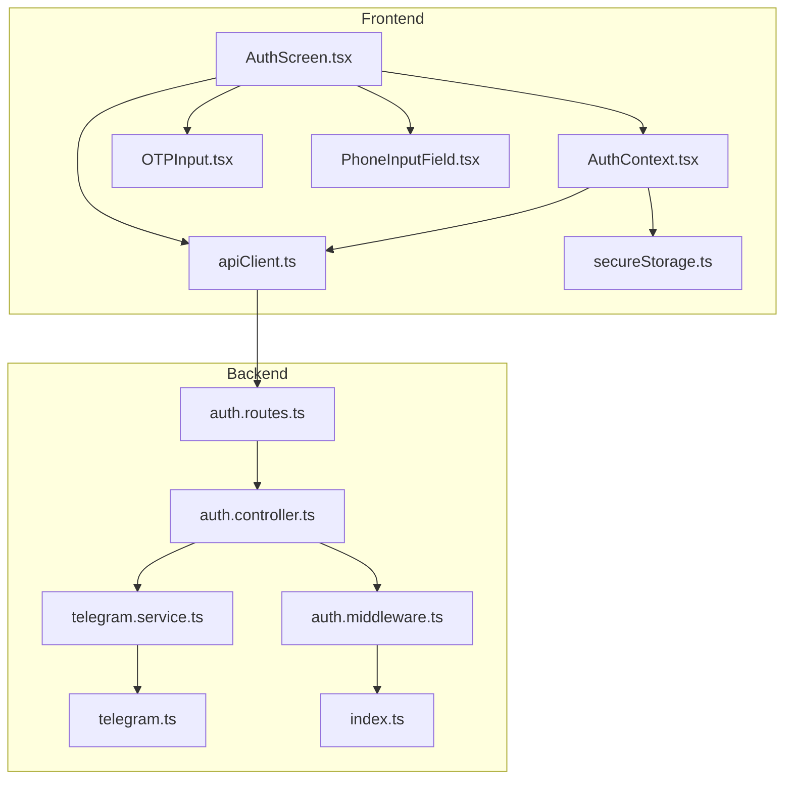
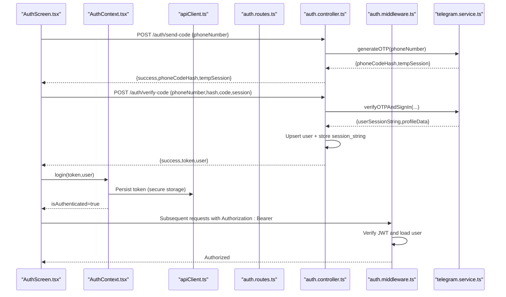
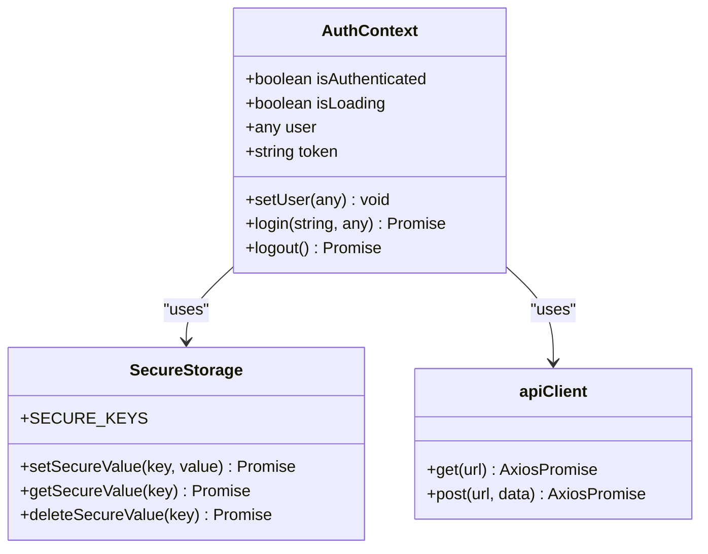
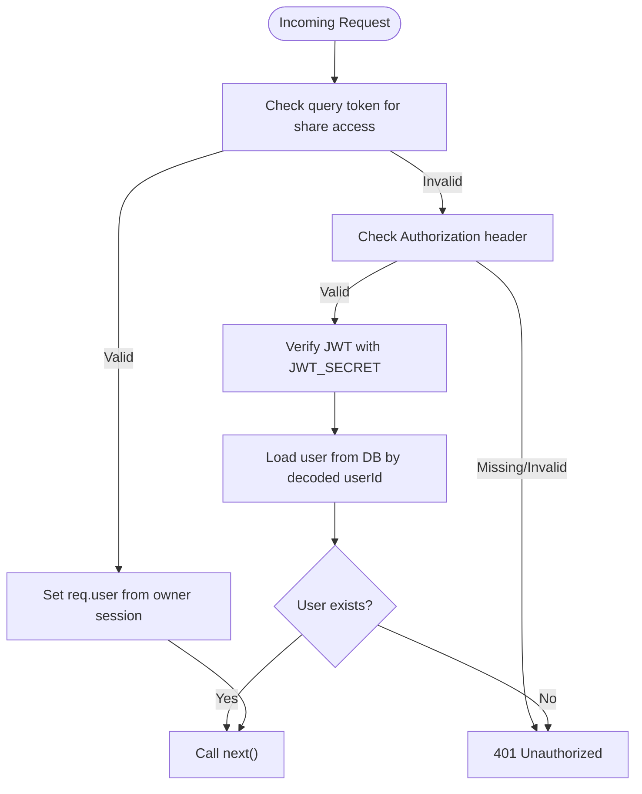
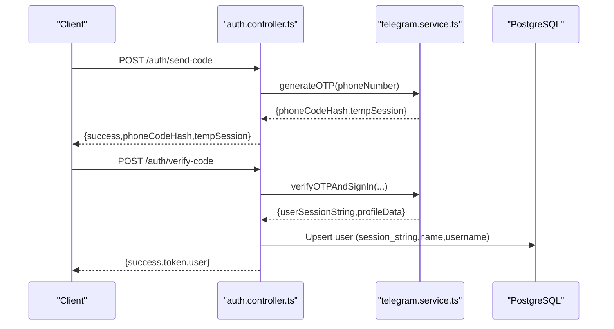
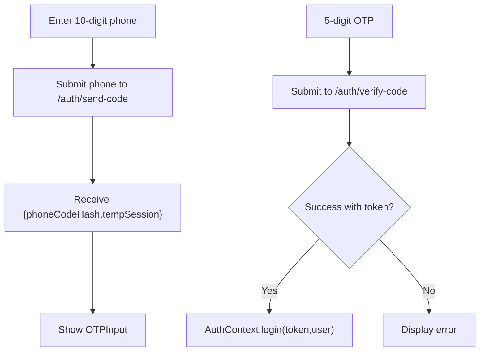
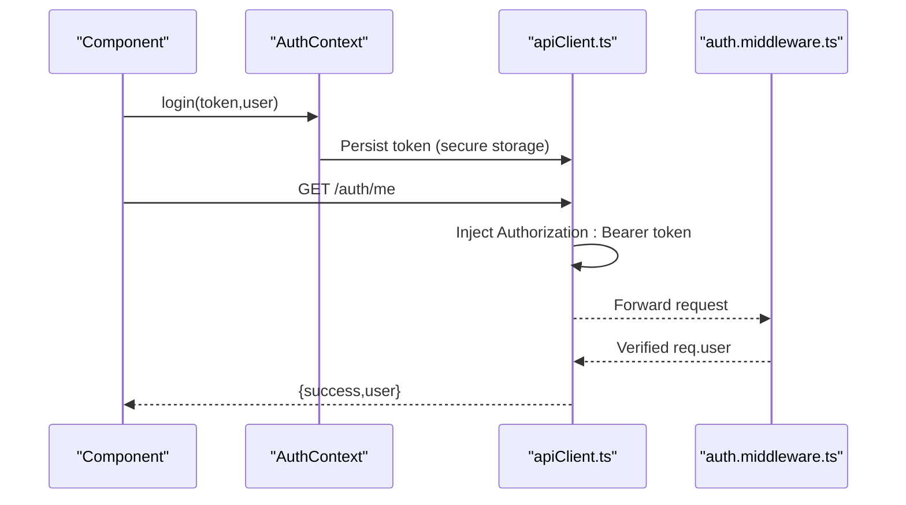
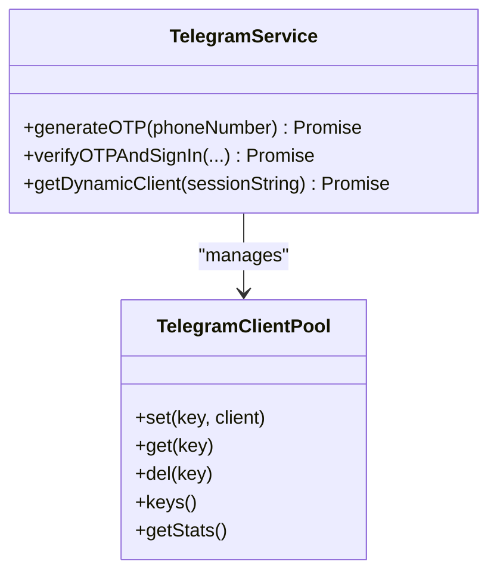
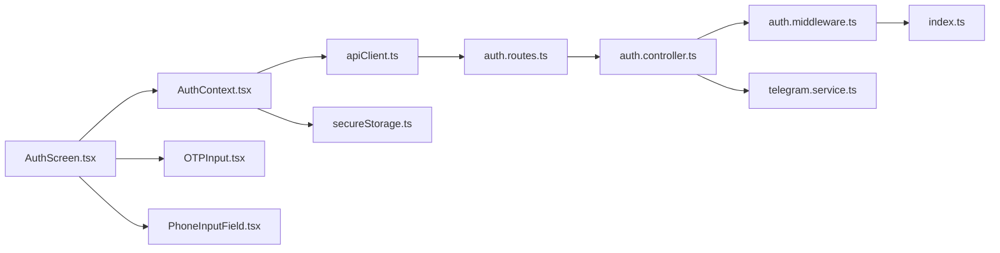

# Authentication System

<cite>
**Referenced Files in This Document**
- [AuthContext.tsx](file://app/src/context/AuthContext.tsx)
- [AuthScreen.tsx](file://app/src/screens/AuthScreen.tsx)
- [OTPInput.tsx](file://app/src/components/OTPInput.tsx)
- [PhoneInputField.tsx](file://app/src/components/PhoneInputField.tsx)
- [apiClient.ts](file://app/src/services/apiClient.ts)
- [secureStorage.ts](file://app/src/utils/secureStorage.ts)
- [auth.controller.ts](file://server/src/controllers/auth.controller.ts)
- [auth.middleware.ts](file://server/src/middlewares/auth.middleware.ts)
- [auth.routes.ts](file://server/src/routes/auth.routes.ts)
- [telegram.service.ts](file://server/src/services/telegram.service.ts)
- [telegram.ts](file://server/src/config/telegram.ts)
- [index.ts](file://server/src/index.ts)
</cite>

## Table of Contents
1. [Introduction](#introduction)
2. [Project Structure](#project-structure)
3. [Core Components](#core-components)
4. [Architecture Overview](#architecture-overview)
5. [Detailed Component Analysis](#detailed-component-analysis)
6. [Dependency Analysis](#dependency-analysis)
7. [Performance Considerations](#performance-considerations)
8. [Security Considerations](#security-considerations)
9. [Troubleshooting Guide](#troubleshooting-guide)
10. [Conclusion](#conclusion)

## Introduction
This document explains the phone number-based authentication system in Teledrive. It covers the complete workflow from phone number submission and OTP verification to Telegram session creation and JWT token management. It documents the AuthContext implementation for centralized state management, authentication middleware for request validation, and security considerations including token storage and session handling. It also includes detailed code references, sequence diagrams, and troubleshooting guidance.

## Project Structure
The authentication system spans the mobile app and the backend server:
- Frontend (React Native): Auth state management, UI flows, API client, and secure storage utilities
- Backend (Express): Authentication routes, controllers, middleware, and Telegram integration

**Diagram sources**
- [AuthContext.tsx](file://app/src/context/AuthContext.tsx#L1-L98)
- [AuthScreen.tsx](file://app/src/screens/AuthScreen.tsx#L1-L397)
- [OTPInput.tsx](file://app/src/components/OTPInput.tsx#L1-L245)
- [PhoneInputField.tsx](file://app/src/components/PhoneInputField.tsx#L1-L124)
- [apiClient.ts](file://app/src/services/apiClient.ts#L1-L164)
- [secureStorage.ts](file://app/src/utils/secureStorage.ts#L1-L74)
- [auth.routes.ts](file://server/src/routes/auth.routes.ts#L1-L13)
- [auth.controller.ts](file://server/src/controllers/auth.controller.ts#L1-L96)
- [auth.middleware.ts](file://server/src/middlewares/auth.middleware.ts#L1-L82)
- [telegram.service.ts](file://server/src/services/telegram.service.ts#L1-L260)
- [telegram.ts](file://server/src/config/telegram.ts#L1-L29)
- [index.ts](file://server/src/index.ts#L92-L119)

**Section sources**
- [AuthContext.tsx](file://app/src/context/AuthContext.tsx#L1-L98)
- [AuthScreen.tsx](file://app/src/screens/AuthScreen.tsx#L1-L397)
- [apiClient.ts](file://app/src/services/apiClient.ts#L1-L164)
- [auth.routes.ts](file://server/src/routes/auth.routes.ts#L1-L13)
- [auth.controller.ts](file://server/src/controllers/auth.controller.ts#L1-L96)
- [auth.middleware.ts](file://server/src/middlewares/auth.middleware.ts#L1-L82)
- [telegram.service.ts](file://server/src/services/telegram.service.ts#L1-L260)
- [index.ts](file://server/src/index.ts#L92-L119)

## Core Components
- AuthContext (frontend): Centralized authentication state, login/logout, and token persistence
- AuthScreen: Phone number entry and OTP verification UI with animated transitions
- OTPInput: Digit-by-digit OTP input with clipboard detection and resend timer
- PhoneInputField: Formatted phone input with country code and validation
- apiClient: Axios client with automatic token injection and retry logic
- secureStorage: Cross-platform secure token storage abstraction
- auth.controller (backend): Phone code generation, OTP verification, JWT issuance, and user profile retrieval
- auth.middleware (backend): JWT verification and share-link bypass logic
- telegram.service: Telegram client pool, OTP generation, and sign-in flow
- Rate limiting: OTP brute-force protection at the gateway

**Section sources**
- [AuthContext.tsx](file://app/src/context/AuthContext.tsx#L1-L98)
- [AuthScreen.tsx](file://app/src/screens/AuthScreen.tsx#L1-L397)
- [OTPInput.tsx](file://app/src/components/OTPInput.tsx#L1-L245)
- [PhoneInputField.tsx](file://app/src/components/PhoneInputField.tsx#L1-L124)
- [apiClient.ts](file://app/src/services/apiClient.ts#L1-L164)
- [secureStorage.ts](file://app/src/utils/secureStorage.ts#L1-L74)
- [auth.controller.ts](file://server/src/controllers/auth.controller.ts#L1-L96)
- [auth.middleware.ts](file://server/src/middlewares/auth.middleware.ts#L1-L82)
- [telegram.service.ts](file://server/src/services/telegram.service.ts#L1-L260)
- [index.ts](file://server/src/index.ts#L92-L119)

## Architecture Overview
The authentication flow integrates the frontend UI with backend controllers and Telegram’s MTProto protocol. The backend generates and verifies OTPs via Telegram, persists user sessions, and issues JWTs for subsequent authenticated requests.

**Diagram sources**
- [AuthScreen.tsx](file://app/src/screens/AuthScreen.tsx#L104-L162)
- [AuthContext.tsx](file://app/src/context/AuthContext.tsx#L62-L76)
- [apiClient.ts](file://app/src/services/apiClient.ts#L46-L74)
- [auth.routes.ts](file://server/src/routes/auth.routes.ts#L7-L10)
- [auth.controller.ts](file://server/src/controllers/auth.controller.ts#L9-L69)
- [auth.middleware.ts](file://server/src/middlewares/auth.middleware.ts#L19-L81)
- [telegram.service.ts](file://server/src/services/telegram.service.ts#L101-L160)

## Detailed Component Analysis

### AuthContext Implementation (Centralized State Management)
AuthContext provides:
- Initialization: Reads secure token on app start, validates via /auth/me, and sets authenticated state
- Login: Stores token in secure storage and updates context state
- Logout: Removes token and resets state

**Diagram sources**
- [AuthContext.tsx](file://app/src/context/AuthContext.tsx#L7-L97)
- [secureStorage.ts](file://app/src/utils/secureStorage.ts#L30-L60)
- [apiClient.ts](file://app/src/services/apiClient.ts#L31-L42)

**Section sources**
- [AuthContext.tsx](file://app/src/context/AuthContext.tsx#L19-L97)
- [secureStorage.ts](file://app/src/utils/secureStorage.ts#L1-L74)
- [apiClient.ts](file://app/src/services/apiClient.ts#L46-L84)

### Authentication Middleware (Request Validation)
The middleware enforces:
- Share-link bypass for public downloads/thumbnails using a token
- Standard JWT verification for protected routes
- User lookup and session string exposure for downstream handlers

**Diagram sources**
- [auth.middleware.ts](file://server/src/middlewares/auth.middleware.ts#L19-L81)

**Section sources**
- [auth.middleware.ts](file://server/src/middlewares/auth.middleware.ts#L1-L82)

### Backend Authentication Controllers
Controllers implement:
- sendCode: Generates OTP via Telegram and returns phoneCodeHash and tempSession
- verifyCode: Verifies OTP, signs in to Telegram, upserts user with session_string, and issues JWT
- getMe: Returns authenticated user profile
- deleteAccount: Deletes user with cascading effects

**Diagram sources**
- [auth.controller.ts](file://server/src/controllers/auth.controller.ts#L9-L69)
- [telegram.service.ts](file://server/src/services/telegram.service.ts#L101-L160)

**Section sources**
- [auth.controller.ts](file://server/src/controllers/auth.controller.ts#L1-L96)
- [telegram.service.ts](file://server/src/services/telegram.service.ts#L101-L160)

### Frontend Authentication Screen and Inputs
The AuthScreen orchestrates:
- Phone number submission to /auth/send-code
- OTP collection and submission to /auth/verify-code
- Login completion by invoking AuthContext.login
- Animated transitions and error handling

**Diagram sources**
- [AuthScreen.tsx](file://app/src/screens/AuthScreen.tsx#L104-L162)
- [OTPInput.tsx](file://app/src/components/OTPInput.tsx#L59-L84)
- [PhoneInputField.tsx](file://app/src/components/PhoneInputField.tsx#L40-L45)

**Section sources**
- [AuthScreen.tsx](file://app/src/screens/AuthScreen.tsx#L19-L310)
- [OTPInput.tsx](file://app/src/components/OTPInput.tsx#L1-L245)
- [PhoneInputField.tsx](file://app/src/components/PhoneInputField.tsx#L1-L124)

### API Client and Token Injection
The API client:
- Injects Authorization: Bearer token from storage on every request
- Provides robust retry logic for transient failures
- Logs request lifecycle for observability

**Diagram sources**
- [apiClient.ts](file://app/src/services/apiClient.ts#L46-L84)
- [auth.middleware.ts](file://server/src/middlewares/auth.middleware.ts#L54-L81)
- [AuthContext.tsx](file://app/src/context/AuthContext.tsx#L62-L76)

**Section sources**
- [apiClient.ts](file://app/src/services/apiClient.ts#L1-L164)
- [auth.middleware.ts](file://server/src/middlewares/auth.middleware.ts#L1-L82)
- [AuthContext.tsx](file://app/src/context/AuthContext.tsx#L1-L98)

### Telegram Integration and Session Management
The backend maintains:
- A persistent Telegram client pool with TTL and auto-reconnect
- OTP generation and sign-in via Telegram
- Secure storage of session strings in the database

**Diagram sources**
- [telegram.service.ts](file://server/src/services/telegram.service.ts#L35-L97)
- [telegram.service.ts](file://server/src/services/telegram.service.ts#L101-L160)

**Section sources**
- [telegram.service.ts](file://server/src/services/telegram.service.ts#L1-L260)
- [telegram.ts](file://server/src/config/telegram.ts#L1-L29)

## Dependency Analysis
- Frontend depends on:
  - AuthContext for state
  - apiClient for HTTP requests
  - secureStorage for token persistence
  - UI components for input handling
- Backend depends on:
  - Express routes and controllers
  - auth.middleware for protection
  - telegram.service for Telegram integration
  - PostgreSQL for user/session storage
  - Rate limiting middleware for auth endpoints

**Diagram sources**
- [AuthContext.tsx](file://app/src/context/AuthContext.tsx#L1-L98)
- [AuthScreen.tsx](file://app/src/screens/AuthScreen.tsx#L1-L397)
- [OTPInput.tsx](file://app/src/components/OTPInput.tsx#L1-L245)
- [PhoneInputField.tsx](file://app/src/components/PhoneInputField.tsx#L1-L124)
- [apiClient.ts](file://app/src/services/apiClient.ts#L1-L164)
- [secureStorage.ts](file://app/src/utils/secureStorage.ts#L1-L74)
- [auth.routes.ts](file://server/src/routes/auth.routes.ts#L1-L13)
- [auth.controller.ts](file://server/src/controllers/auth.controller.ts#L1-L96)
- [auth.middleware.ts](file://server/src/middlewares/auth.middleware.ts#L1-L82)
- [telegram.service.ts](file://server/src/services/telegram.service.ts#L1-L260)
- [index.ts](file://server/src/index.ts#L92-L119)

**Section sources**
- [auth.routes.ts](file://server/src/routes/auth.routes.ts#L1-L13)
- [auth.controller.ts](file://server/src/controllers/auth.controller.ts#L1-L96)
- [auth.middleware.ts](file://server/src/middlewares/auth.middleware.ts#L1-L82)
- [telegram.service.ts](file://server/src/services/telegram.service.ts#L1-L260)
- [index.ts](file://server/src/index.ts#L92-L119)

## Performance Considerations
- Telegram client pooling: Clients persist for up to one hour and auto-reconnect on disconnect to minimize handshake overhead
- Streaming downloads: iterDownload streams chunks without buffering full files, reducing memory usage
- Request retries: Frontend axios interceptor retries transient failures with exponential backoff
- Rate limiting: Auth endpoints are rate-limited to prevent OTP brute-force attacks

[No sources needed since this section provides general guidance]

## Security Considerations
- Token storage:
  - Native: SecureStore in device keychain/keystore
  - Web: AsyncStorage fallback (not encrypted)
- Token transmission:
  - Authorization header with Bearer scheme
  - JWT_SECRET enforced at startup
- Session handling:
  - Telegram session strings stored securely in database
  - Client pool eviction and reconnection on expiration
- Error handling:
  - Distinguish transient vs. permanent failures during token verification
  - Clear auth state only on explicit 401/403 responses

**Section sources**
- [secureStorage.ts](file://app/src/utils/secureStorage.ts#L1-L74)
- [apiClient.ts](file://app/src/services/apiClient.ts#L46-L74)
- [auth.middleware.ts](file://server/src/middlewares/auth.middleware.ts#L5-L7)
- [telegram.service.ts](file://server/src/services/telegram.service.ts#L42-L47)
- [AuthContext.tsx](file://app/src/context/AuthContext.tsx#L41-L51)

## Troubleshooting Guide
Common issues and resolutions:
- Invalid phone number format:
  - Ensure international format (e.g., +1234567890)
  - Server returns specific error for PHONE_NUMBER_INVALID
- Telegram API ID/Hash misconfiguration:
  - Check TELEGRAM_API_ID and TELEGRAM_API_HASH environment variables
- OTP verification failures:
  - Confirm 5-digit OTP length and correct submission
  - Resend code after timer completes
- Network/server failures:
  - Transient failures keep session; explicit 401/403 clears auth
- Token not applied to requests:
  - Verify AsyncStorage retrieval and Authorization header injection

**Section sources**
- [auth.controller.ts](file://server/src/controllers/auth.controller.ts#L23-L30)
- [AuthScreen.tsx](file://app/src/screens/AuthScreen.tsx#L104-L162)
- [AuthContext.tsx](file://app/src/context/AuthContext.tsx#L41-L51)
- [apiClient.ts](file://app/src/services/apiClient.ts#L46-L74)

## Conclusion
Teledrive’s authentication system combines Telegram’s secure OTP flow with JWT-based session management. The frontend provides a smooth UX with animated transitions and robust input handling, while the backend ensures secure token issuance, strict middleware enforcement, and resilient Telegram integration. Proper token storage, rate limiting, and error handling contribute to a secure and reliable authentication experience.