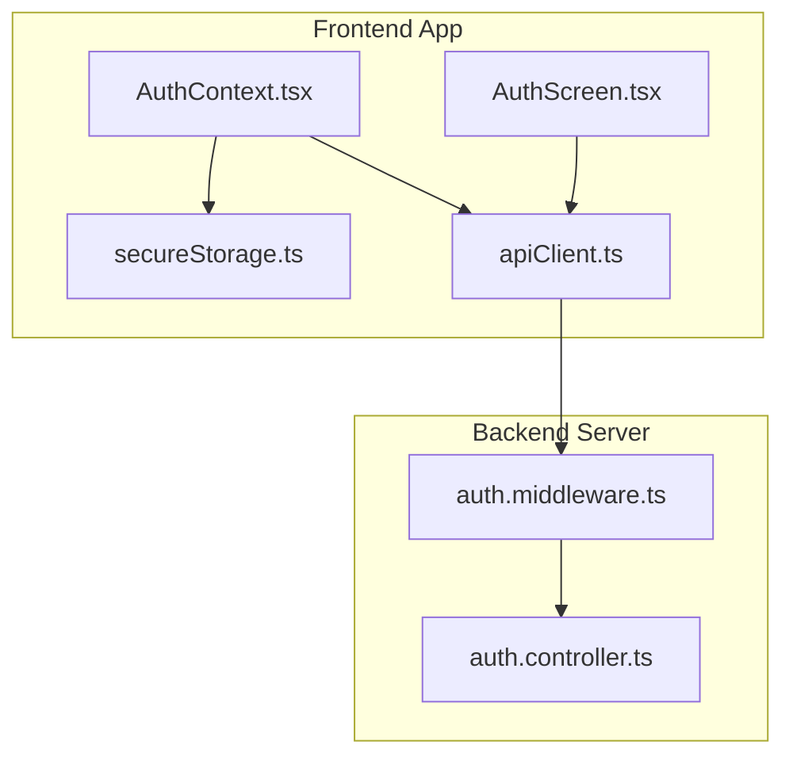
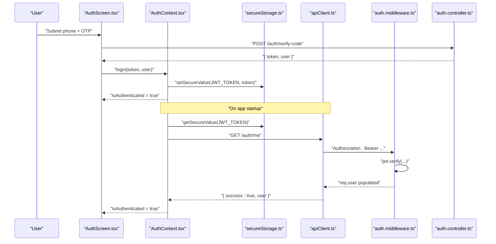
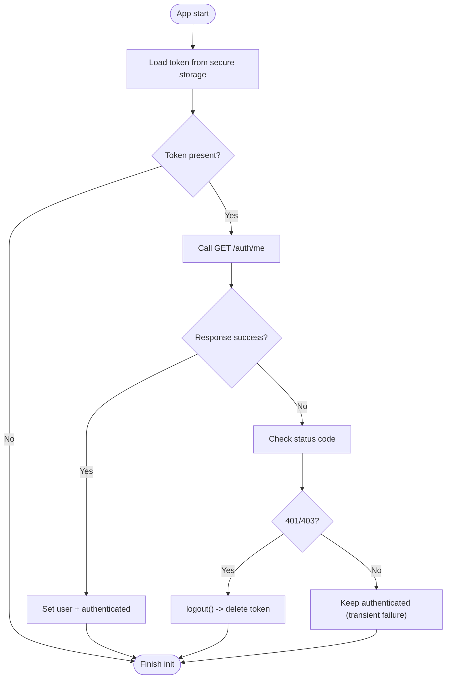
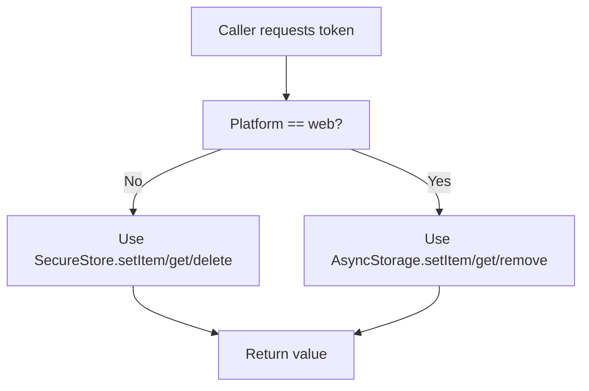
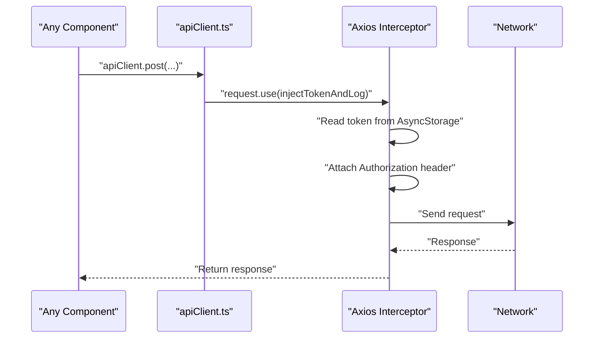
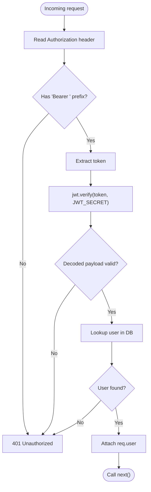
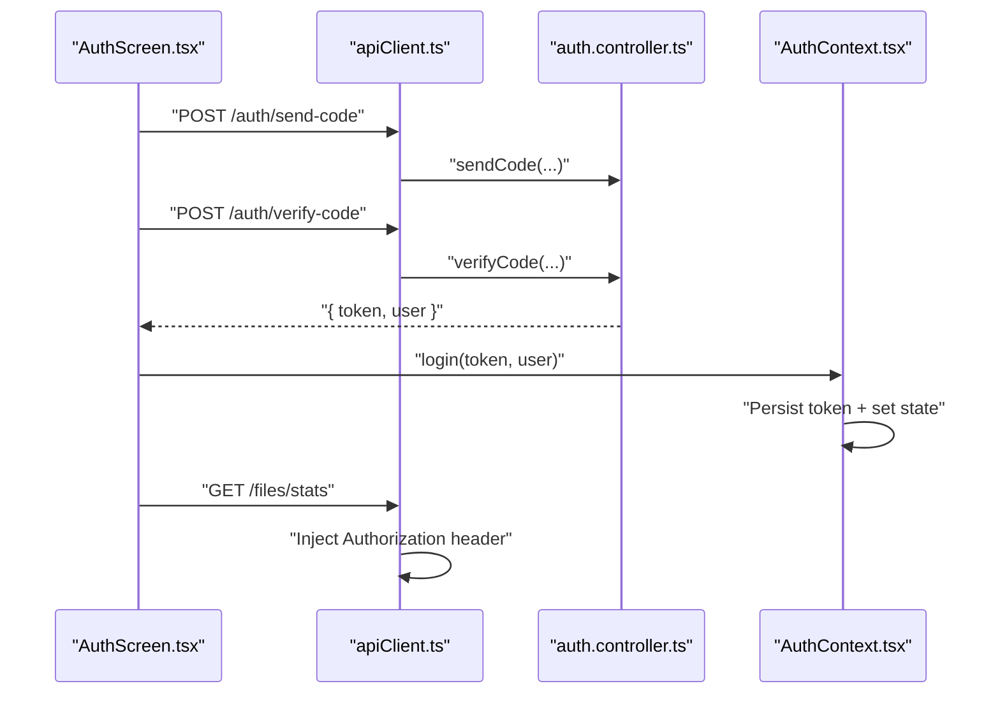
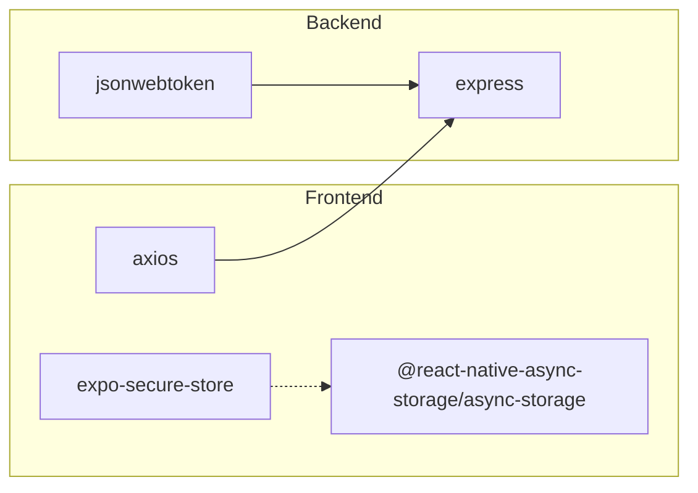

# JWT Token Management

<cite>
**Referenced Files in This Document**
- [AuthContext.tsx](file://app/src/context/AuthContext.tsx)
- [secureStorage.ts](file://app/src/utils/secureStorage.ts)
- [apiClient.ts](file://app/src/services/apiClient.ts)
- [auth.middleware.ts](file://server/src/middlewares/auth.middleware.ts)
- [auth.controller.ts](file://server/src/controllers/auth.controller.ts)
- [AuthScreen.tsx](file://app/src/screens/AuthScreen.tsx)
- [api.ts](file://app/src/services/api.ts)
- [retry.ts](file://app/src/utils/retry.ts)
- [package.json](file://app/package.json)
- [package.json](file://server/package.json)
</cite>

## Table of Contents
1. [Introduction](#introduction)
2. [Project Structure](#project-structure)
3. [Core Components](#core-components)
4. [Architecture Overview](#architecture-overview)
5. [Detailed Component Analysis](#detailed-component-analysis)
6. [Dependency Analysis](#dependency-analysis)
7. [Performance Considerations](#performance-considerations)
8. [Troubleshooting Guide](#troubleshooting-guide)
9. [Conclusion](#conclusion)

## Introduction
This document explains JWT token management across the authentication system. It covers how tokens are stored securely on-device, how they are injected into outgoing requests, how the app validates tokens on startup, and how the backend verifies tokens for protected routes. It also outlines security best practices, error handling for unauthorized access, and troubleshooting guidance for common token-related issues.

## Project Structure
The authentication and token lifecycle spans three layers:
- Frontend React Native app (token storage, request injection, startup validation)
- Secure storage abstraction (platform-aware token persistence)
- Backend Express middleware (token extraction and verification)

**Diagram sources**
- [AuthContext.tsx](file://app/src/context/AuthContext.tsx#L1-L98)
- [secureStorage.ts](file://app/src/utils/secureStorage.ts#L1-L74)
- [apiClient.ts](file://app/src/services/apiClient.ts#L1-L164)
- [AuthScreen.tsx](file://app/src/screens/AuthScreen.tsx#L1-L397)
- [auth.middleware.ts](file://server/src/middlewares/auth.middleware.ts#L1-L82)
- [auth.controller.ts](file://server/src/controllers/auth.controller.ts#L1-L96)

**Section sources**
- [AuthContext.tsx](file://app/src/context/AuthContext.tsx#L1-L98)
- [secureStorage.ts](file://app/src/utils/secureStorage.ts#L1-L74)
- [apiClient.ts](file://app/src/services/apiClient.ts#L1-L164)
- [auth.middleware.ts](file://server/src/middlewares/auth.middleware.ts#L1-L82)
- [auth.controller.ts](file://server/src/controllers/auth.controller.ts#L1-L96)

## Core Components
- AuthContext manages authentication state, logs users in/out, and validates tokens on app startup.
- secureStorage abstracts platform-specific secure storage for tokens.
- apiClient injects Authorization headers automatically and centralizes retry logic.
- auth.middleware extracts and verifies JWTs for protected routes.

Key responsibilities:
- Token storage: secureStorage stores tokens using the device’s secure enclave/keychain on native and falls back to AsyncStorage on web.
- Token injection: apiClient reads the stored token and attaches Authorization: Bearer headers to all outgoing requests.
- Startup validation: AuthContext retrieves the stored token on launch, calls /auth/me, and authenticates the user if the token is valid.
- Backend verification: auth.middleware checks Authorization headers, decodes JWTs, and ensures the user still exists.

**Section sources**
- [AuthContext.tsx](file://app/src/context/AuthContext.tsx#L25-L60)
- [secureStorage.ts](file://app/src/utils/secureStorage.ts#L30-L60)
- [apiClient.ts](file://app/src/services/apiClient.ts#L46-L85)
- [auth.middleware.ts](file://server/src/middlewares/auth.middleware.ts#L19-L81)

## Architecture Overview
The token lifecycle integrates frontend and backend components:

**Diagram sources**
- [AuthScreen.tsx](file://app/src/screens/AuthScreen.tsx#L144-L162)
- [auth.controller.ts](file://server/src/controllers/auth.controller.ts#L34-L80)
- [AuthContext.tsx](file://app/src/context/AuthContext.tsx#L62-L76)
- [secureStorage.ts](file://app/src/utils/secureStorage.ts#L30-L49)
- [apiClient.ts](file://app/src/services/apiClient.ts#L46-L74)
- [auth.middleware.ts](file://server/src/middlewares/auth.middleware.ts#L19-L81)

## Detailed Component Analysis

### AuthContext.tsx: Token Storage, Validation, and Logout
- On startup, retrieves the stored token and calls /auth/me to validate.
- On successful validation, sets user and authenticated state.
- On 401/403 responses during validation, clears the stored token and resets state.
- Provides login(token, userData?) to persist and set the token.
- Provides logout() to remove the token and reset state.

**Diagram sources**
- [AuthContext.tsx](file://app/src/context/AuthContext.tsx#L25-L60)

**Section sources**
- [AuthContext.tsx](file://app/src/context/AuthContext.tsx#L25-L76)

### secureStorage.ts: Platform-Specific Secure Storage
- Uses expo-secure-store on native platforms for encrypted storage in the device keychain.
- Falls back to AsyncStorage on web (non-encrypted).
- Exposes setSecureValue, getSecureValue, deleteSecureValue, and SECURE_KEYS.

**Diagram sources**
- [secureStorage.ts](file://app/src/utils/secureStorage.ts#L15-L67)

**Section sources**
- [secureStorage.ts](file://app/src/utils/secureStorage.ts#L1-L74)

### apiClient.ts: Automatic Token Injection and Retry Logic
- Injects Authorization: Bearer <token> into outgoing requests using AsyncStorage.
- Centralizes retry logic for transient network/server errors.
- Logs requests and responses for observability.

**Diagram sources**
- [apiClient.ts](file://app/src/services/apiClient.ts#L46-L85)

**Section sources**
- [apiClient.ts](file://app/src/services/apiClient.ts#L46-L132)

### auth.middleware.ts: JWT Extraction, Verification, and Access Control
- Extracts Authorization: Bearer <token> from headers.
- Verifies JWT using JWT_SECRET and decodes the payload.
- Loads user data from the database and attaches req.user.
- Supports a special bypass for public shared links via query token.

**Diagram sources**
- [auth.middleware.ts](file://server/src/middlewares/auth.middleware.ts#L19-L81)

**Section sources**
- [auth.middleware.ts](file://server/src/middlewares/auth.middleware.ts#L1-L82)

### Authentication Flow: OTP Login to Token Usage
- AuthScreen handles phone + OTP submission and receives a JWT.
- login(token, user) persists the token and updates state.
- Subsequent requests automatically include the Authorization header.

**Diagram sources**
- [AuthScreen.tsx](file://app/src/screens/AuthScreen.tsx#L104-L162)
- [auth.controller.ts](file://server/src/controllers/auth.controller.ts#L34-L80)
- [AuthContext.tsx](file://app/src/context/AuthContext.tsx#L62-L76)
- [apiClient.ts](file://app/src/services/apiClient.ts#L46-L74)

**Section sources**
- [AuthScreen.tsx](file://app/src/screens/AuthScreen.tsx#L104-L162)
- [auth.controller.ts](file://server/src/controllers/auth.controller.ts#L34-L80)
- [AuthContext.tsx](file://app/src/context/AuthContext.tsx#L62-L76)
- [apiClient.ts](file://app/src/services/apiClient.ts#L46-L74)

## Dependency Analysis
- Frontend dependencies:
  - @react-native-async-storage/async-storage for AsyncStorage fallback
  - expo-secure-store for native secure storage
  - axios for HTTP client with interceptors
- Backend dependencies:
  - jsonwebtoken for JWT verification
  - express for middleware and routes

**Diagram sources**
- [package.json](file://app/package.json#L11-L51)
- [package.json](file://server/package.json#L19-L40)

**Section sources**
- [package.json](file://app/package.json#L11-L51)
- [package.json](file://server/package.json#L19-L40)

## Performance Considerations
- Request retries: apiClient retries transient failures (network errors, 5xx, 408) with exponential backoff to reduce user impact.
- Startup validation: On app boot, a single /auth/me call confirms token validity without blocking the UI indefinitely.
- Shared link bypass: Public routes can bypass JWT for specific endpoints using a query token, reducing unnecessary verification overhead.

[No sources needed since this section provides general guidance]

## Troubleshooting Guide
Common issues and resolutions:
- Token not applied to requests
  - Ensure AsyncStorage contains the token key and apiClient interceptor is registered.
  - Verify the interceptor runs before requests are made.
  - Check for exceptions during token read in the interceptor.
  - See [apiClient.ts](file://app/src/services/apiClient.ts#L46-L74).

- Invalid token on startup
  - On 401/403 from /auth/me, the app automatically logs out and clears the token.
  - Transient network/server failures keep the authenticated state to avoid false logouts.
  - See [AuthContext.tsx](file://app/src/context/AuthContext.tsx#L33-L51).

- Unauthorized responses from protected routes
  - Confirm Authorization header is present and formatted as Bearer <token>.
  - Verify JWT_SECRET is configured on the server.
  - Ensure the user still exists in the database.
  - See [auth.middleware.ts](file://server/src/middlewares/auth.middleware.ts#L55-L81).

- Web vs native storage differences
  - On web, tokens are stored in AsyncStorage (not encrypted). On native, tokens are stored in the device keychain.
  - If testing on web, expect lower security guarantees compared to native.
  - See [secureStorage.ts](file://app/src/utils/secureStorage.ts#L1-L23).

- Manual logout not clearing token
  - Ensure logout() is called and that deleteSecureValue is invoked.
  - See [AuthContext.tsx](file://app/src/context/AuthContext.tsx#L70-L76) and [secureStorage.ts](file://app/src/utils/secureStorage.ts#L54-L60).

- Protected API calls failing intermittently
  - Review retry logic and ensure exponential backoff is functioning.
  - See [retry.ts](file://app/src/utils/retry.ts#L14-L33) and [apiClient.ts](file://app/src/services/apiClient.ts#L118-L127).

**Section sources**
- [apiClient.ts](file://app/src/services/apiClient.ts#L46-L132)
- [AuthContext.tsx](file://app/src/context/AuthContext.tsx#L33-L76)
- [auth.middleware.ts](file://server/src/middlewares/auth.middleware.ts#L55-L81)
- [secureStorage.ts](file://app/src/utils/secureStorage.ts#L1-L23)
- [retry.ts](file://app/src/utils/retry.ts#L14-L33)

## Conclusion
The system implements a robust, layered JWT token management strategy:
- Tokens are persisted securely on native devices and safely on web.
- Requests automatically include Authorization headers.
- The app validates tokens on startup and gracefully handles transient failures.
- The backend enforces strict JWT verification and protects routes.
Adhering to the outlined best practices and troubleshooting steps will maintain a secure and reliable authentication experience.