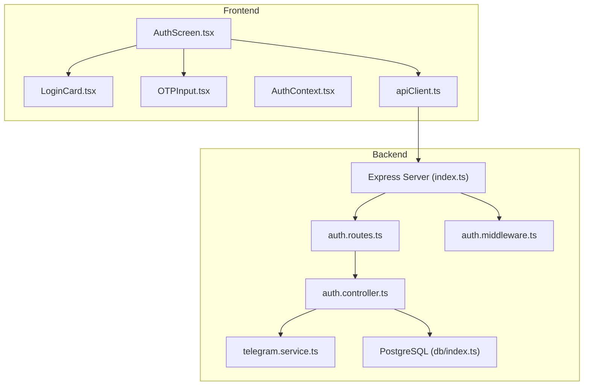
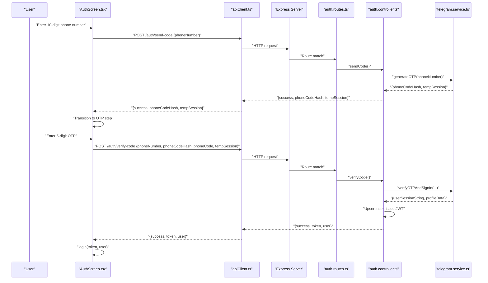
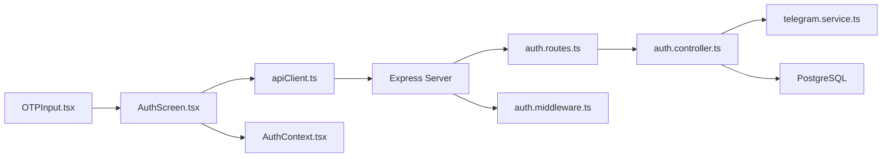

# Phone Number Authentication Flow

<cite>
**Referenced Files in This Document**
- [AuthScreen.tsx](file://app/src/screens/AuthScreen.tsx)
- [LoginCard.tsx](file://app/src/components/LoginCard.tsx)
- [OTPInput.tsx](file://app/src/components/OTPInput.tsx)
- [apiClient.ts](file://app/src/services/apiClient.ts)
- [AuthContext.tsx](file://app/src/context/AuthContext.tsx)
- [auth.controller.ts](file://server/src/controllers/auth.controller.ts)
- [auth.routes.ts](file://server/src/routes/auth.routes.ts)
- [telegram.service.ts](file://server/src/services/telegram.service.ts)
- [index.ts](file://server/src/index.ts)
- [auth.middleware.ts](file://server/src/middlewares/auth.middleware.ts)
- [db/index.ts](file://server/src/db/index.ts)
</cite>

## Table of Contents
1. [Introduction](#introduction)
2. [Project Structure](#project-structure)
3. [Core Components](#core-components)
4. [Architecture Overview](#architecture-overview)
5. [Detailed Component Analysis](#detailed-component-analysis)
6. [Dependency Analysis](#dependency-analysis)
7. [Performance Considerations](#performance-considerations)
8. [Troubleshooting Guide](#troubleshooting-guide)
9. [Conclusion](#conclusion)

## Introduction
This document explains the phone number authentication flow end-to-end, covering the complete user journey from phone number input to OTP verification and account registration. It documents the frontend components AuthScreen.tsx, LoginCard.tsx, and OTPInput.tsx, and details the backend controller methods responsible for phone number validation, OTP generation, and user registration. It also covers request/response patterns, error handling, integration with Telegram’s bot API, and security considerations such as rate limiting, OTP expiration handling, and input sanitization.

## Project Structure
The authentication flow spans both the mobile frontend and the backend server:
- Frontend screens and components manage user input, state transitions, and API communication.
- Backend routes and controllers orchestrate Telegram OTP generation and verification, and manage user persistence and JWT issuance.
- Middleware enforces rate limits and protects sensitive endpoints.
- Database stores user profiles and session strings.

**Diagram sources**
- [AuthScreen.tsx](file://app/src/screens/AuthScreen.tsx#L1-L397)
- [LoginCard.tsx](file://app/src/components/LoginCard.tsx#L1-L89)
- [OTPInput.tsx](file://app/src/components/OTPInput.tsx#L1-L245)
- [apiClient.ts](file://app/src/services/apiClient.ts#L1-L164)
- [AuthContext.tsx](file://app/src/context/AuthContext.tsx#L1-L98)
- [index.ts](file://server/src/index.ts#L1-L315)
- [auth.routes.ts](file://server/src/routes/auth.routes.ts#L1-L13)
- [auth.controller.ts](file://server/src/controllers/auth.controller.ts#L1-L96)
- [telegram.service.ts](file://server/src/services/telegram.service.ts#L1-L260)
- [db/index.ts](file://server/src/db/index.ts#L1-L56)
- [auth.middleware.ts](file://server/src/middlewares/auth.middleware.ts#L1-L82)

**Section sources**
- [AuthScreen.tsx](file://app/src/screens/AuthScreen.tsx#L1-L397)
- [auth.routes.ts](file://server/src/routes/auth.routes.ts#L1-L13)
- [index.ts](file://server/src/index.ts#L100-L108)

## Core Components
- AuthScreen.tsx: Orchestrates the phone number entry and OTP verification steps, manages loading states, error messaging, and navigation between steps. It posts to /auth/send-code and /auth/verify-code and invokes the AuthContext login upon success.
- LoginCard.tsx: Provides a reusable animated card layout for the authentication forms with scroll behavior and keyboard-aware adjustments.
- OTPInput.tsx: Handles secure 5-digit OTP entry with individual digit inputs, clipboard detection, resend timer, and auto-focus transitions.
- apiClient.ts: Axios-based HTTP client with automatic JWT injection, request logging, and retry logic.
- AuthContext.tsx: Manages authentication state, persists tokens securely, and verifies tokens on app boot.
- Backend:
  - auth.controller.ts: Implements /auth/send-code and /auth/verify-code, integrates with Telegram service, and persists user data with JWT issuance.
  - telegram.service.ts: Generates OTP via Telegram client, verifies OTP, and returns user session string and profile data.
  - auth.routes.ts: Exposes authentication endpoints.
  - index.ts: Applies global and auth-specific rate limiting and mounts auth routes.
  - auth.middleware.ts: Validates JWT for protected endpoints and supports share-link token bypass.
  - db/index.ts: Initializes PostgreSQL schema for users and related entities.

**Section sources**
- [AuthScreen.tsx](file://app/src/screens/AuthScreen.tsx#L104-L162)
- [OTPInput.tsx](file://app/src/components/OTPInput.tsx#L15-L103)
- [apiClient.ts](file://app/src/services/apiClient.ts#L46-L84)
- [AuthContext.tsx](file://app/src/context/AuthContext.tsx#L62-L76)
- [auth.controller.ts](file://server/src/controllers/auth.controller.ts#L9-L69)
- [telegram.service.ts](file://server/src/services/telegram.service.ts#L101-L160)
- [auth.routes.ts](file://server/src/routes/auth.routes.ts#L7-L10)
- [index.ts](file://server/src/index.ts#L100-L108)
- [auth.middleware.ts](file://server/src/middlewares/auth.middleware.ts#L19-L80)
- [db/index.ts](file://server/src/db/index.ts#L14-L48)

## Architecture Overview
The authentication flow follows a client-server pattern:
- The client collects a 10-digit phone number, sends it to the backend, and receives a temporary session and phone code hash.
- The backend contacts Telegram to send an OTP to the provided number and returns the hash and session to the client.
- The client displays an OTP input field, collects the 5-digit code, and submits it along with the stored hash and session.
- The backend verifies the OTP via Telegram, persists or updates the user record, issues a JWT, and returns it to the client.
- The client stores the JWT securely and logs the user in.

**Diagram sources**
- [AuthScreen.tsx](file://app/src/screens/AuthScreen.tsx#L104-L162)
- [apiClient.ts](file://app/src/services/apiClient.ts#L31-L42)
- [auth.routes.ts](file://server/src/routes/auth.routes.ts#L7-L10)
- [auth.controller.ts](file://server/src/controllers/auth.controller.ts#L9-L69)
- [telegram.service.ts](file://server/src/services/telegram.service.ts#L101-L160)

## Detailed Component Analysis

### AuthScreen.tsx: Phone Number Entry and OTP Verification
Responsibilities:
- Manage step state: phone vs otp.
- Validate phone input length and format.
- Post to /auth/send-code with a normalized phone number (+91 prefix).
- Store returned tempSession and phoneCodeHash.
- Navigate to OTP step and animate transitions.
- Collect OTP, enforce minimum length, and post to /auth/verify-code.
- Handle verification errors and race conditions via a ref guard.
- On success, call AuthContext.login to persist token and user data.

Key behaviors:
- Double-submit prevention using a ref flag.
- Auto-focus only on initial mount for better UX.
- Animated step indicators and keyboard-aware layouts.

Request/response patterns:
- Send code:
  - Request: POST /auth/send-code with { phoneNumber: "+91XXXXXXXXXX" }
  - Response: { success: boolean, phoneCodeHash: string, tempSession: string }
- Verify code:
  - Request: POST /auth/verify-code with { phoneNumber, phoneCodeHash, phoneCode, tempSession }
  - Response: { success: boolean, token: string, user: { id, phone, name, username } }

Error handling:
- Invalid phone length shows a localized error message.
- Network or backend errors surface user-friendly messages.
- Incorrect OTP triggers an error and keeps the user on the OTP step.

Security considerations:
- Phone number is sanitized by removing whitespace and enforced to a 10-digit length before sending.
- OTP verification is guarded against rapid re-submission.

**Section sources**
- [AuthScreen.tsx](file://app/src/screens/AuthScreen.tsx#L104-L162)
- [AuthContext.tsx](file://app/src/context/AuthContext.tsx#L62-L76)

### LoginCard.tsx: Animated Card Container
Responsibilities:
- Provide a reusable, scrollable card layout for authentication forms.
- Apply entrance animations and adjust layout when the keyboard is visible.
- Constrain card height on small devices.

UX improvements:
- Spring and fade animations for smooth entrance.
- Scroll container with handled taps to dismiss keyboard.

**Section sources**
- [LoginCard.tsx](file://app/src/components/LoginCard.tsx#L9-L54)

### OTPInput.tsx: Secure OTP Entry
Responsibilities:
- Render fixed-length OTP input boxes (default 5).
- Enforce numeric-only input and single-character entries.
- Auto-focus to the next input after typing.
- Handle backspace to move focus backward.
- Detect clipboard content for OTP and populate inputs automatically.
- Provide resend timer with a “Resend Code” action.
- Animate focused underline and error state.

Request/response patterns:
- Resend action triggers a callback to re-send the code to the same number.
- On input change, emits the joined OTP string to parent components.

Security considerations:
- Uses secure text input attributes to encourage OS autofill.
- Clipboard reads are attempted silently and errors are ignored.

**Section sources**
- [OTPInput.tsx](file://app/src/components/OTPInput.tsx#L15-L103)

### Backend Controllers and Services

#### auth.controller.ts: OTP Generation and Verification
Endpoints:
- POST /auth/send-code
  - Validates presence of phoneNumber.
  - Calls telegram.service.generateOTP(phoneNumber) to contact Telegram and obtain phoneCodeHash and tempSession.
  - Returns success with phoneCodeHash and tempSession.
  - Maps Telegram-specific errors to user-friendly messages.
- POST /auth/verify-code
  - Validates presence of phoneNumber, phoneCodeHash, phoneCode, tempSession.
  - Calls telegram.service.verifyOTPAndSignIn(...) to authenticate with Telegram.
  - Upserts user in the database (insert or update session_string and profile fields).
  - Issues a JWT and returns it with user info.

Error handling:
- Missing fields return 400 with a structured error.
- Telegram errors are caught and mapped to readable messages.
- Generic 500 responses are returned for unexpected failures.

**Section sources**
- [auth.controller.ts](file://server/src/controllers/auth.controller.ts#L9-L69)

#### telegram.service.ts: Telegram Integration
OTP generation:
- Creates a temporary TelegramClient with a fresh session.
- Calls sendCode with the cleaned phone number.
- Returns phoneCodeHash and saves the session string for later verification.

OTP verification:
- Rehydrates the temporary session string into a TelegramClient.
- Invokes SignIn with phoneNumber, phoneCodeHash, and phoneCode.
- Retrieves user profile data and returns the persisted session string.

Security and reliability:
- Uses a client pool with TTL and eviction to manage long-lived connections.
- Auto-reconnects and evicts stale/expired clients.
- Logs errors and disconnections for observability.

**Section sources**
- [telegram.service.ts](file://server/src/services/telegram.service.ts#L101-L160)

#### auth.routes.ts and index.ts: Routing and Rate Limiting
- Routes:
  - POST /auth/send-code → sendCode
  - POST /auth/verify-code → verifyCode
  - GET /auth/me → requireAuth + getMe
  - DELETE /auth/account → requireAuth + deleteAccount
- Rate limiting:
  - Global limiter prevents overload.
  - Auth limiter restricts OTP brute-force attempts on /auth endpoints.

**Section sources**
- [auth.routes.ts](file://server/src/routes/auth.routes.ts#L7-L10)
- [index.ts](file://server/src/index.ts#L100-L108)

#### auth.middleware.ts: JWT Validation and Share Link Bypass
- Extracts Bearer token from Authorization header.
- Verifies JWT and loads user from the database.
- Supports share-link token bypass for specific download/stream endpoints.

**Section sources**
- [auth.middleware.ts](file://server/src/middlewares/auth.middleware.ts#L19-L80)

#### Database Schema: Users and Related Entities
- users: Stores phone (unique), telegram_id, session_string, and timestamps.
- folders and files: Support file and folder management for authenticated users.

**Section sources**
- [db/index.ts](file://server/src/db/index.ts#L14-L48)

## Dependency Analysis
The authentication flow depends on:
- Frontend:
  - AuthScreen.tsx depends on apiClient.ts for HTTP calls and AuthContext.tsx for login.
  - OTPInput.tsx depends on Clipboard API and communicates with AuthScreen.tsx.
- Backend:
  - auth.controller.ts depends on telegram.service.ts for Telegram operations and db pool for user persistence.
  - auth.routes.ts mounts auth controller methods under /auth.
  - index.ts applies rate limiting and mounts auth routes.
  - auth.middleware.ts validates JWT for protected endpoints.

**Diagram sources**
- [AuthScreen.tsx](file://app/src/screens/AuthScreen.tsx#L1-L397)
- [OTPInput.tsx](file://app/src/components/OTPInput.tsx#L1-L245)
- [apiClient.ts](file://app/src/services/apiClient.ts#L1-L164)
- [AuthContext.tsx](file://app/src/context/AuthContext.tsx#L1-L98)
- [auth.routes.ts](file://server/src/routes/auth.routes.ts#L1-L13)
- [auth.controller.ts](file://server/src/controllers/auth.controller.ts#L1-L96)
- [telegram.service.ts](file://server/src/services/telegram.service.ts#L1-L260)
- [db/index.ts](file://server/src/db/index.ts#L1-L56)
- [auth.middleware.ts](file://server/src/middlewares/auth.middleware.ts#L1-L82)
- [index.ts](file://server/src/index.ts#L100-L108)

**Section sources**
- [AuthScreen.tsx](file://app/src/screens/AuthScreen.tsx#L104-L162)
- [auth.controller.ts](file://server/src/controllers/auth.controller.ts#L9-L69)
- [telegram.service.ts](file://server/src/services/telegram.service.ts#L101-L160)
- [auth.routes.ts](file://server/src/routes/auth.routes.ts#L7-L10)
- [index.ts](file://server/src/index.ts#L100-L108)

## Performance Considerations
- Frontend:
  - Animated transitions are optimized with useNativeDriver where possible to reduce JS thread load.
  - OTPInput.tsx uses memoization to avoid unnecessary re-renders.
  - apiClient.ts includes retry logic with exponential backoff to improve resilience.
- Backend:
  - Telegram client pooling reduces connection overhead and improves responsiveness.
  - Rate limiting prevents abuse and maintains service stability.
  - Database operations are minimal and indexed appropriately.

[No sources needed since this section provides general guidance]

## Troubleshooting Guide

Common issues and resolutions:
- Invalid phone number:
  - Symptom: Error message indicating invalid number or international format requirement.
  - Cause: Missing or malformed phone number on the frontend or Telegram API error.
  - Resolution: Ensure the phone number is 10 digits and formatted as +91XXXXXXXXXX before submission. The backend maps PHONE_NUMBER_INVALID to a user-friendly message.
- OTP incorrect or expired:
  - Symptom: Error message stating incorrect OTP.
  - Cause: Wrong code or Telegram session expiry.
  - Resolution: Prompt user to re-enter OTP or resend code. The backend returns generic errors on failure; ensure the correct phoneCodeHash and tempSession are used.
- Telegram connectivity issues:
  - Symptom: Telegram connection failed or session expired.
  - Cause: API ID/Hash misconfiguration or revoked/expired session.
  - Resolution: Verify TELEGRAM_API_ID and TELEGRAM_API_HASH environment variables. The backend maps API_ID_INVALID and PHONE_NUMBER_INVALID to actionable messages.
- Network errors:
  - Symptom: Network error prompt.
  - Cause: Temporary network outage or server unavailability.
  - Resolution: The frontend retries requests with exponential backoff; advise users to try again.
- Rate limiting:
  - Symptom: Too many auth attempts; request blocked.
  - Cause: Exceeded auth limiter thresholds.
  - Resolution: Wait for the cooldown period before retrying.

Integration patterns:
- Frontend:
  - Use AuthScreen.tsx as the single entry point for phone and OTP steps.
  - Use OTPInput.tsx for OTP capture and bind its onChange to trigger verification when length reaches the configured threshold.
  - Persist JWT securely via AuthContext.tsx and use apiClient.ts for all authenticated requests.
- Backend:
  - Ensure TELEGRAM_API_ID and TELEGRAM_API_HASH are set.
  - Confirm DATABASE_URL points to a reachable PostgreSQL instance.
  - Mount /auth routes behind the authLimiter middleware.

**Section sources**
- [AuthScreen.tsx](file://app/src/screens/AuthScreen.tsx#L104-L162)
- [auth.controller.ts](file://server/src/controllers/auth.controller.ts#L20-L31)
- [index.ts](file://server/src/index.ts#L100-L108)
- [apiClient.ts](file://app/src/services/apiClient.ts#L118-L127)

## Conclusion
The phone number authentication flow integrates a robust frontend UX with secure backend operations powered by Telegram’s API and PostgreSQL persistence. The system enforces rate limiting, handles errors gracefully, and provides a seamless user experience with animated transitions and intelligent OTP handling. By following the documented patterns and troubleshooting steps, teams can maintain a reliable and secure authentication pipeline.