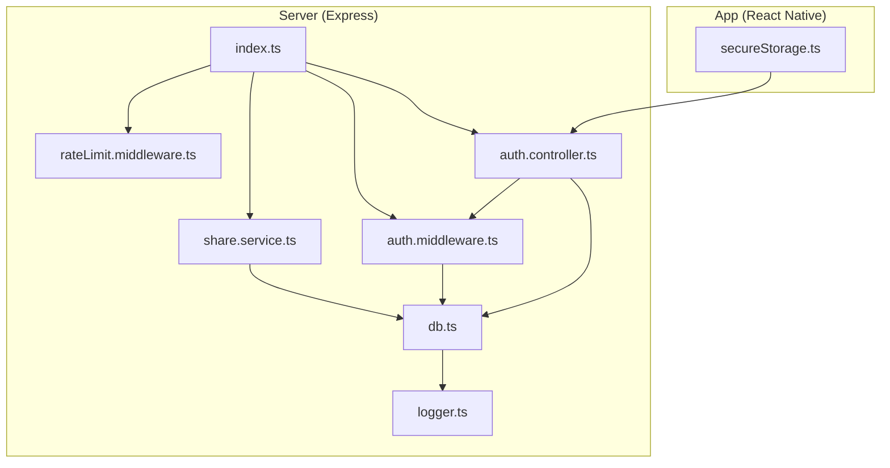
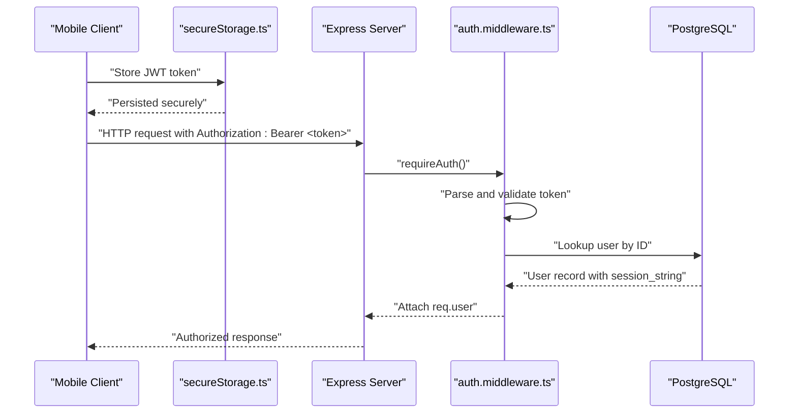
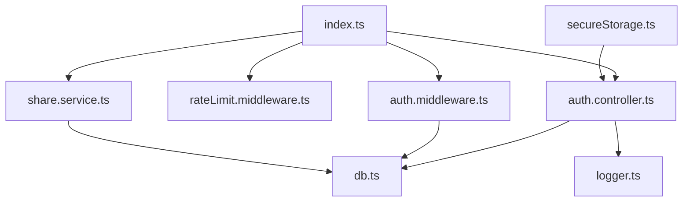

# Security Considerations and Best Practices

<cite>
**Referenced Files in This Document**
- [secureStorage.ts](file://app/src/utils/secureStorage.ts)
- [auth.middleware.ts](file://server/src/middlewares/auth.middleware.ts)
- [rateLimit.middleware.ts](file://server/src/middlewares/rateLimit.middleware.ts)
- [auth.controller.ts](file://server/src/controllers/auth.controller.ts)
- [auth.routes.ts](file://server/src/routes/auth.routes.ts)
- [index.ts](file://server/src/index.ts)
- [share.service.ts](file://server/src/services/share.service.ts)
- [db.ts](file://server/src/config/db.ts)
- [logger.ts](file://server/src/utils/logger.ts)
- [telegram.service.ts](file://server/src/services/telegram.service.ts)
- [db.service.ts](file://server/src/services/db.service.ts)
- [package.json](file://server/package.json)
- [package.json](file://app/package.json)
</cite>

## Table of Contents
1. [Introduction](#introduction)
2. [Project Structure](#project-structure)
3. [Core Components](#core-components)
4. [Architecture Overview](#architecture-overview)
5. [Detailed Component Analysis](#detailed-component-analysis)
6. [Dependency Analysis](#dependency-analysis)
7. [Performance Considerations](#performance-considerations)
8. [Troubleshooting Guide](#troubleshooting-guide)
9. [Conclusion](#conclusion)
10. [Appendices](#appendices)

## Introduction
This document consolidates authentication security considerations and best practices implemented in the project. It focuses on:
- Platform-specific secure keychain integration for storing JWT tokens on native devices while acknowledging web limitations.
- JWT validation and session security measures in the backend middleware.
- Rate limiting strategies to mitigate brute-force attacks and protect against automated abuse.
- Secure token transmission, input validation and sanitization, and protections against common vulnerabilities such as XSS and CSRF.
- Security audit considerations, logging practices for suspicious activities, and incident response procedures.
- Guidelines for secure deployment configurations, environment variable management, and regular security maintenance.

## Project Structure
The authentication and security surface spans three primary areas:
- Frontend mobile app with secure token storage abstraction.
- Backend Express server with JWT-based authentication, rate limiting, and shared-link token handling.
- Database layer with schema and integrity checks.

**Diagram sources**
- [secureStorage.ts](file://app/src/utils/secureStorage.ts#L1-L74)
- [index.ts](file://server/src/index.ts#L1-L315)
- [auth.middleware.ts](file://server/src/middlewares/auth.middleware.ts#L1-L82)
- [rateLimit.middleware.ts](file://server/src/middlewares/rateLimit.middleware.ts#L1-L47)
- [auth.controller.ts](file://server/src/controllers/auth.controller.ts#L1-L96)
- [share.service.ts](file://server/src/services/share.service.ts#L1-L183)
- [db.ts](file://server/src/config/db.ts#L1-L61)
- [logger.ts](file://server/src/utils/logger.ts#L1-L27)

**Section sources**
- [secureStorage.ts](file://app/src/utils/secureStorage.ts#L1-L74)
- [index.ts](file://server/src/index.ts#L1-L315)
- [auth.middleware.ts](file://server/src/middlewares/auth.middleware.ts#L1-L82)
- [rateLimit.middleware.ts](file://server/src/middlewares/rateLimit.middleware.ts#L1-L47)
- [auth.controller.ts](file://server/src/controllers/auth.controller.ts#L1-L96)
- [share.service.ts](file://server/src/services/share.service.ts#L1-L183)
- [db.ts](file://server/src/config/db.ts#L1-L61)
- [logger.ts](file://server/src/utils/logger.ts#L1-L27)

## Core Components
- Secure token storage abstraction:
  - Uses platform-specific secure keychain on native and falls back to AsyncStorage on web.
  - Exposes typed keys for JWT and refresh tokens.
- JWT authentication middleware:
  - Validates Authorization header bearer tokens.
  - Verifies token signature against a secret.
  - Loads user session string from the database for session-bound checks.
  - Supports a share-link token bypass for public resources under controlled conditions.
- Rate limiting:
  - Global and endpoint-specific limits to throttle auth attempts and shared resource access.
  - Configurable windows and thresholds tailored to different routes.
- Shared link token service:
  - Generates and verifies separate secrets for share links and access tokens.
  - Provides helpers to read bearer tokens and normalize paths.
- Security middleware stack:
  - Helmet CSP with nonce-based script-src.
  - CORS configuration allowing controlled origins and credentials.
  - Trust proxy enabled for cloud platforms.
- Logging and observability:
  - Structured JSON logs with timestamps, levels, scopes, and metadata.
  - Centralized error handling and uncaught exception/rejection logging.

**Section sources**
- [secureStorage.ts](file://app/src/utils/secureStorage.ts#L1-L74)
- [auth.middleware.ts](file://server/src/middlewares/auth.middleware.ts#L1-L82)
- [rateLimit.middleware.ts](file://server/src/middlewares/rateLimit.middleware.ts#L1-L47)
- [share.service.ts](file://server/src/services/share.service.ts#L1-L183)
- [index.ts](file://server/src/index.ts#L46-L98)
- [logger.ts](file://server/src/utils/logger.ts#L1-L27)

## Architecture Overview
The authentication flow integrates frontend token storage with backend JWT validation and rate-limited endpoints. Shared link access leverages separate token types with distinct secrets.

**Diagram sources**
- [secureStorage.ts](file://app/src/utils/secureStorage.ts#L30-L60)
- [auth.middleware.ts](file://server/src/middlewares/auth.middleware.ts#L19-L81)
- [db.ts](file://server/src/config/db.ts#L27-L37)

## Detailed Component Analysis

### Secure Token Storage (secureStorage.ts)
Implementation highlights:
- Platform-aware storage:
  - On native platforms, tokens are stored in the device’s secure enclave/keychain.
  - On web, tokens are stored in AsyncStorage (non-encrypted) as the best available option.
- Keychain accessibility:
  - Uses appropriate accessibility attributes for native environments.
- Typed keys:
  - Exposes constants for JWT and refresh token keys to reduce magic strings.

Security considerations:
- Native keychain storage significantly reduces exposure compared to in-memory or filesystem storage.
- Web fallback relies on browser storage; additional hardening (same-site cookies, HttpOnly flags) is not applied here. Treat web storage as less secure and minimize token lifetime.

Best practices:
- Always store only encrypted tokens in native keychain.
- Prefer short-lived tokens with refresh token rotation.
- Avoid logging sensitive token values.

**Section sources**
- [secureStorage.ts](file://app/src/utils/secureStorage.ts#L1-L74)

### JWT Validation and Session Security (auth.middleware.ts)
Key behaviors:
- Share link token bypass:
  - Certain GET routes and specific paths can be accessed using a share link token, which is verified independently.
  - On successful bypass, the request is decorated with share metadata and user session string.
- Standard JWT flow:
  - Extracts Authorization header, validates Bearer format, and verifies the token signature using a secret.
  - Loads user data from the database and attaches it to the request object.
- Error handling:
  - Returns explicit 401 responses for missing/invalid headers, invalid payload, or user not found.

Security measures:
- Signature verification prevents tampering.
- Database-backed user lookup ensures revocation and session binding.
- Share link bypass is constrained to specific routes and validated against the database owner.

Vulnerability mitigations:
- Rejects malformed Authorization headers.
- Enforces strict route/path checks for share link bypass.

**Section sources**
- [auth.middleware.ts](file://server/src/middlewares/auth.middleware.ts#L1-L82)
- [share.service.ts](file://server/src/services/share.service.ts#L79-L110)
- [db.ts](file://server/src/config/db.ts#L27-L37)

### Rate Limiting (rateLimit.middleware.ts and index.ts)
Global and endpoint-specific rate limiting:
- Global limiter:
  - High threshold to accommodate batch operations while preventing abuse.
- Authentication limiter:
  - Limits OTP brute-force attempts for login endpoints.
- Endpoint-specific limiters:
  - Share password attempts, share view/download rates, shared space access, and upload attempts are throttled with tailored windows and maxima.

Security benefits:
- Reduces risk of credential stuffing and OTP guessing.
- Controls resource exhaustion for public endpoints.

Operational notes:
- Trust proxy is enabled to ensure accurate client IP detection behind load balancers/proxies.
- Health check endpoint is excluded from global rate limiting.

**Section sources**
- [rateLimit.middleware.ts](file://server/src/middlewares/rateLimit.middleware.ts#L1-L47)
- [index.ts](file://server/src/index.ts#L43-L98)

### Authentication Controller and Routes (auth.controller.ts, auth.routes.ts)
Flow overview:
- sendCode:
  - Validates presence of phone number.
  - Generates OTP via Telegram service and returns a temporary session and hash.
- verifyCode:
  - Validates required fields.
  - Verifies OTP and signs in to obtain a session string.
  - Upserts user record and issues a JWT with a long expiration.
- getMe and deleteAccount:
  - Protected by requireAuth middleware.

Security considerations:
- Input validation prevents empty payloads.
- Telegram credentials are managed server-side; session strings are stored encrypted in the database and never exposed to clients.
- JWT secret is enforced at startup.

**Section sources**
- [auth.controller.ts](file://server/src/controllers/auth.controller.ts#L1-L96)
- [auth.routes.ts](file://server/src/routes/auth.routes.ts#L1-L13)
- [telegram.service.ts](file://server/src/services/telegram.service.ts#L101-L160)

### Shared Link Token Service (share.service.ts)
Highlights:
- Separate secrets for share link tokens and access tokens.
- Token signing and verification functions with expiration handling.
- Helpers to derive base URLs and normalize paths to prevent traversal.
- Utilities to read bearer tokens from requests.

Security posture:
- Isolates shared access tokens from user JWTs.
- Enforces type checks and payload validation.

**Section sources**
- [share.service.ts](file://server/src/services/share.service.ts#L1-L183)

### Security Middleware Stack (index.ts)
Implemented protections:
- Nonce injection for CSP:
  - Generates a random nonce per request and whitelists it in script-src.
- Helmet configuration:
  - Enforces CSP with strict defaults and customized directives.
  - Disables dangerous inline scripts and restricts stylesheets.
- CORS policy:
  - Restricts origins via environment variable with a default fallback.
  - Allows credentials and broad origin allowance for share endpoints.
- Trust proxy:
  - Enables correct client IP resolution behind proxies/load balancers.

Additional safeguards:
- Structured logging for all requests and errors.
- Global error handler with detailed metadata.
- Uncaught exception and rejection handlers to prevent crashes.

**Section sources**
- [index.ts](file://server/src/index.ts#L46-L98)
- [index.ts](file://server/src/index.ts#L112-L201)
- [index.ts](file://server/src/index.ts#L238-L272)

### Database Layer and Schema Integrity (db.ts, db.service.ts)
- Connection pooling:
  - SSL enforcement for remote databases, capped connections, and fast timeouts.
- Schema initialization:
  - Creates tables with constraints and indexes.
  - Applies migrations with critical checks to ensure integrity.
- Access logs and activity logs:
  - Dedicated tables to track access and user actions for auditing.

Security implications:
- Constraints and triggers enforce referential integrity and cross-field validations.
- Indexes optimize queries for access control checks.

**Section sources**
- [db.ts](file://server/src/config/db.ts#L1-L61)
- [db.service.ts](file://server/src/services/db.service.ts#L1-L315)

### Logging and Observability (logger.ts)
- Structured JSON logging with timestamps, severity, scope, and metadata.
- Centralized logging for HTTP requests and process-level events.
- Error-level logs are directed to stderr for external log aggregation.

Security audit value:
- Logs include request method, URL, status, duration, and client IP.
- Process-level errors capture exceptions and rejections for incident triage.

**Section sources**
- [logger.ts](file://server/src/utils/logger.ts#L1-L27)
- [index.ts](file://server/src/index.ts#L28-L41)
- [index.ts](file://server/src/index.ts#L264-L272)

## Dependency Analysis
High-level dependencies among security-critical components:

**Diagram sources**
- [index.ts](file://server/src/index.ts#L1-L315)
- [auth.middleware.ts](file://server/src/middlewares/auth.middleware.ts#L1-L82)
- [rateLimit.middleware.ts](file://server/src/middlewares/rateLimit.middleware.ts#L1-L47)
- [auth.controller.ts](file://server/src/controllers/auth.controller.ts#L1-L96)
- [share.service.ts](file://server/src/services/share.service.ts#L1-L183)
- [db.ts](file://server/src/config/db.ts#L1-L61)
- [logger.ts](file://server/src/utils/logger.ts#L1-L27)
- [secureStorage.ts](file://app/src/utils/secureStorage.ts#L1-L74)

**Section sources**
- [index.ts](file://server/src/index.ts#L1-L315)
- [auth.middleware.ts](file://server/src/middlewares/auth.middleware.ts#L1-L82)
- [rateLimit.middleware.ts](file://server/src/middlewares/rateLimit.middleware.ts#L1-L47)
- [auth.controller.ts](file://server/src/controllers/auth.controller.ts#L1-L96)
- [share.service.ts](file://server/src/services/share.service.ts#L1-L183)
- [db.ts](file://server/src/config/db.ts#L1-L61)
- [logger.ts](file://server/src/utils/logger.ts#L1-L27)
- [secureStorage.ts](file://app/src/utils/secureStorage.ts#L1-L74)

## Performance Considerations
- Connection pooling:
  - Conservative max connections and aggressive idle timeouts reduce resource contention on free-tier deployments.
- Streaming and caching:
  - Telegram client pooling with TTL and eviction minimizes reconnect overhead.
- Rate limiting:
  - Tailored limits balance usability and protection; adjust based on observed traffic patterns.

[No sources needed since this section provides general guidance]

## Troubleshooting Guide
Common issues and remediation steps:
- Missing JWT_SECRET:
  - The server refuses to start if the JWT secret is not configured. Set the environment variable and redeploy.
- Database connectivity:
  - Check DATABASE_URL and SSL mode. Remote deployments require sslmode=require.
- CORS and credentials:
  - Ensure ALLOWED_ORIGINS includes the frontend origins. Credentials are enabled; mismatched origins will block requests.
- Rate limit exceeded:
  - Review auth and shared link limiters. Adjust thresholds or implement client-side backoff.
- Share link access failures:
  - Verify SHARE_LINK_SECRET and SHARE_ACCESS_SECRET. Confirm token expiration and payload type.
- Logging and monitoring:
  - Inspect structured logs for request metadata and error stacks. Use scopes to filter relevant entries.

**Section sources**
- [auth.middleware.ts](file://server/src/middlewares/auth.middleware.ts#L5-L6)
- [db.ts](file://server/src/config/db.ts#L9-L12)
- [index.ts](file://server/src/index.ts#L63-L77)
- [rateLimit.middleware.ts](file://server/src/middlewares/rateLimit.middleware.ts#L1-L47)
- [share.service.ts](file://server/src/services/share.service.ts#L33-L34)
- [logger.ts](file://server/src/utils/logger.ts#L1-L27)

## Conclusion
The project implements layered authentication security:
- Frontend secure storage with platform-aware encryption.
- Backend JWT validation with database-backed session checks and share link token isolation.
- Comprehensive rate limiting and robust security middleware.
- Structured logging and integrity-preserving database schema.

Adhering to the best practices and operational guidance herein will strengthen resilience against common threats and support ongoing security maintenance.

[No sources needed since this section summarizes without analyzing specific files]

## Appendices

### Secure Token Transmission Examples (paths only)
- Storing tokens:
  - [setSecureValue](file://app/src/utils/secureStorage.ts#L30-L38)
- Retrieving tokens:
  - [getSecureValue](file://app/src/utils/secureStorage.ts#L43-L49)
- Deleting tokens:
  - [deleteSecureValue](file://app/src/utils/secureStorage.ts#L54-L60)

### Input Validation and Sanitization (paths only)
- Authentication controller input checks:
  - [sendCode](file://server/src/controllers/auth.controller.ts#L9-L32)
  - [verifyCode](file://server/src/controllers/auth.controller.ts#L34-L69)
- Share path normalization:
  - [normalizeSharePath](file://server/src/services/share.service.ts#L141-L153)

### Protection Against XSS and CSRF (paths only)
- CSP with nonce:
  - [Helmet CSP configuration](file://server/src/index.ts#L52-L61)
- CSRF considerations:
  - CSRF protection is not implemented in the current codebase. Consider adding SameSite cookies, CSRF tokens for state-changing forms, and Origin/CORS controls aligned with your threat model.

### Security Audit and Incident Response (paths only)
- Structured logging:
  - [logger utility](file://server/src/utils/logger.ts#L1-L27)
- Request logging middleware:
  - [request logging](file://server/src/index.ts#L28-L41)
- Global error handling:
  - [error handler](file://server/src/index.ts#L238-L249)
- Uncaught exception/rejection handling:
  - [process event handlers](file://server/src/index.ts#L264-L272)

### Secure Deployment and Environment Management (paths only)
- Dependencies and security packages:
  - [server package.json](file://server/package.json#L19-L40)
  - [app package.json](file://app/package.json#L11-L51)
- Environment variables:
  - JWT_SECRET and related secrets are loaded from environment.
  - Database URL and SSL mode are enforced.
  - CORS origins and credentials are configurable.

**Section sources**
- [logger.ts](file://server/src/utils/logger.ts#L1-L27)
- [index.ts](file://server/src/index.ts#L28-L41)
- [index.ts](file://server/src/index.ts#L238-L249)
- [index.ts](file://server/src/index.ts#L264-L272)
- [package.json](file://server/package.json#L19-L40)
- [package.json](file://app/package.json#L11-L51)