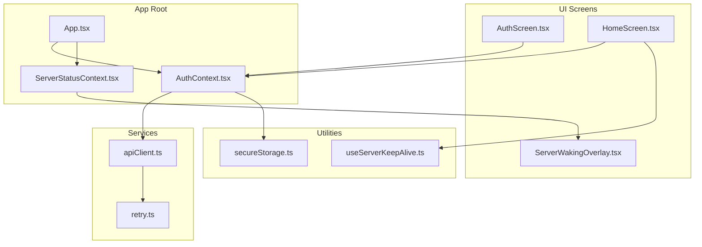
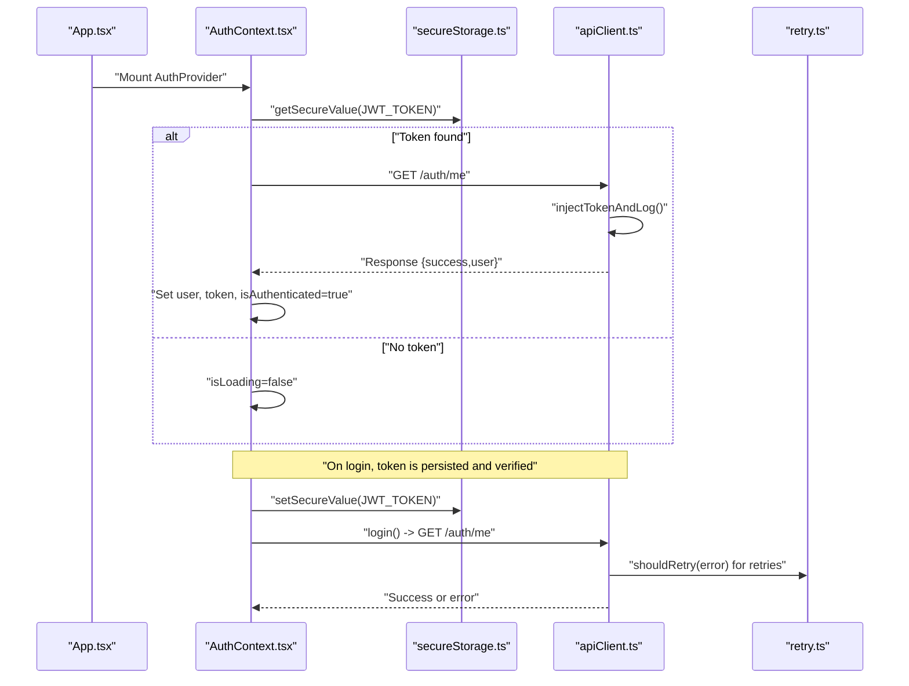
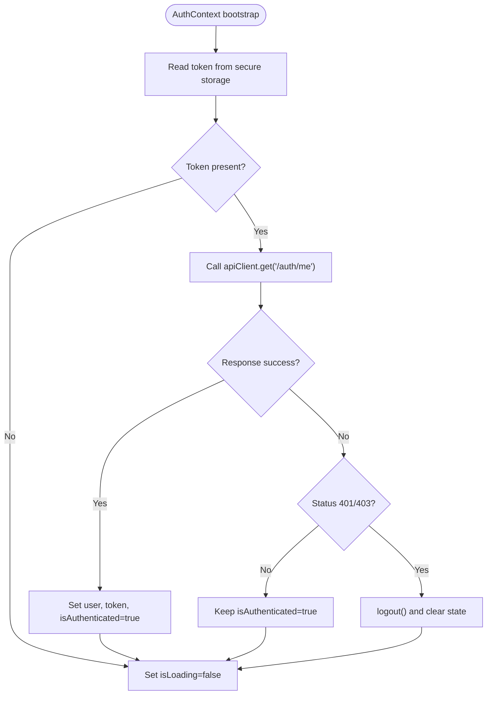
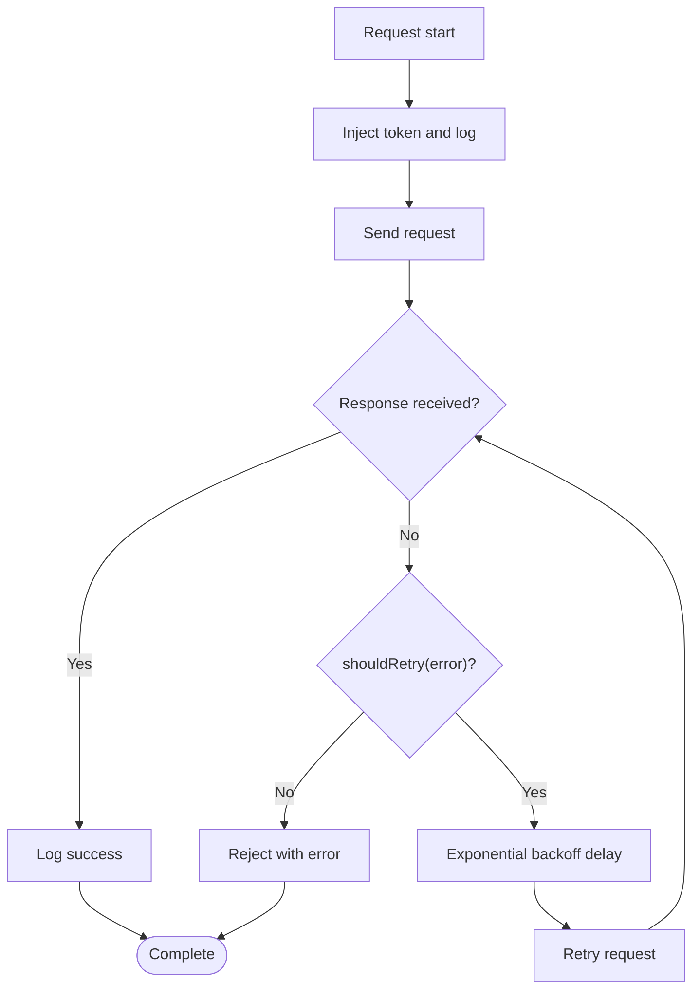
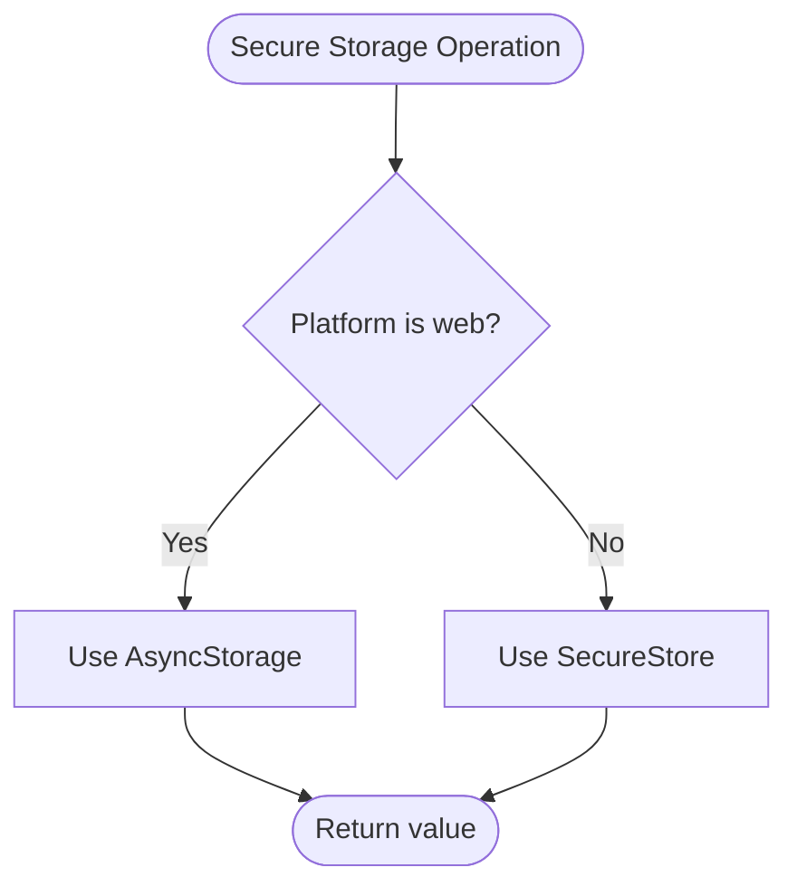
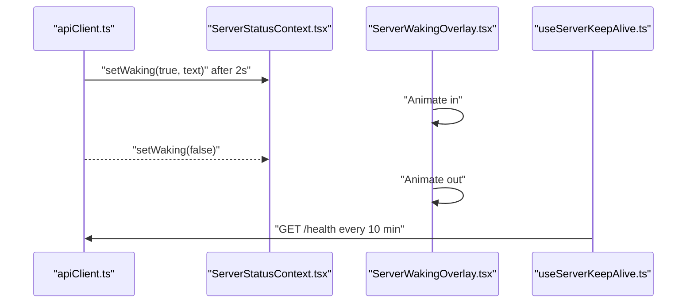
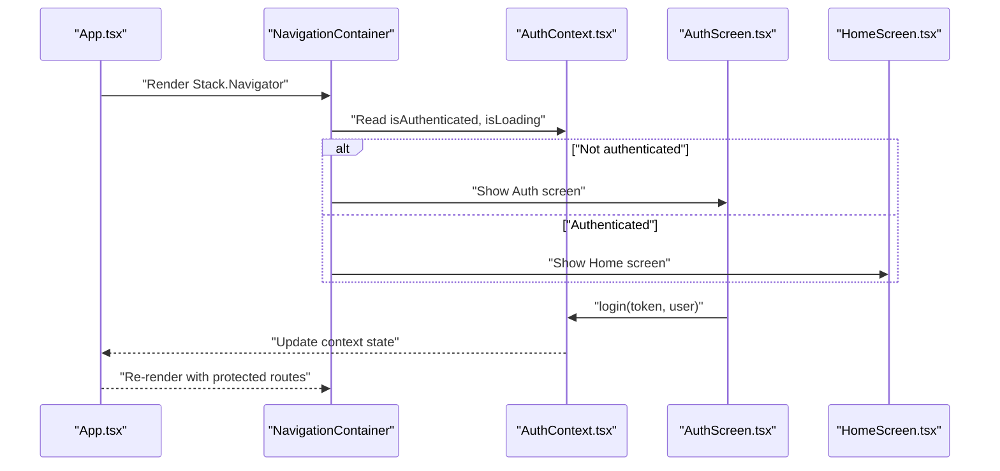
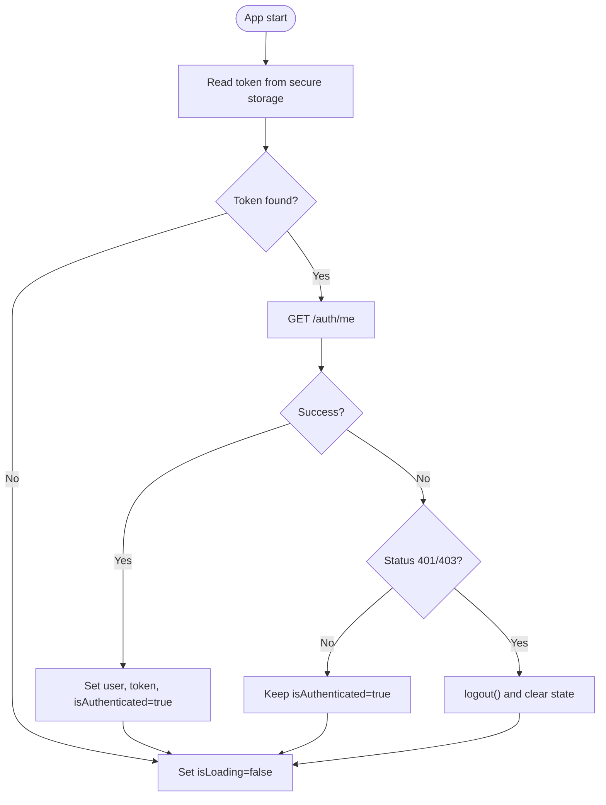
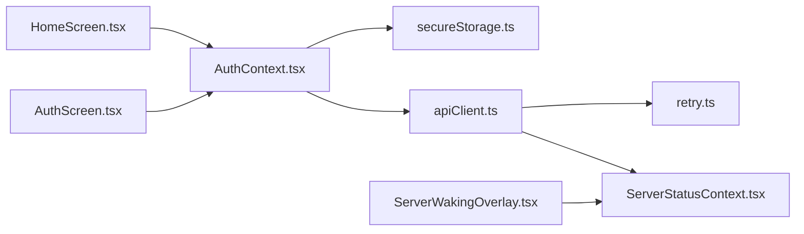

# Session Handling and State Management

<cite>
**Referenced Files in This Document**
- [AuthContext.tsx](file://app/src/context/AuthContext.tsx)
- [apiClient.ts](file://app/src/services/apiClient.ts)
- [retry.ts](file://app/src/utils/retry.ts)
- [secureStorage.ts](file://app/src/utils/secureStorage.ts)
- [AuthScreen.tsx](file://app/src/screens/AuthScreen.tsx)
- [App.tsx](file://app/src/App.tsx)
- [ServerStatusContext.tsx](file://app/src/context/ServerStatusContext.tsx)
- [ServerWakingOverlay.tsx](file://app/src/components/ServerWakingOverlay.tsx)
- [useServerKeepAlive.ts](file://app/src/hooks/useServerKeepAlive.ts)
- [HomeScreen.tsx](file://app/src/screes/HomeScreen.tsx)
</cite>

## Table of Contents
1. [Introduction](#introduction)
2. [Project Structure](#project-structure)
3. [Core Components](#core-components)
4. [Architecture Overview](#architecture-overview)
5. [Detailed Component Analysis](#detailed-component-analysis)
6. [Dependency Analysis](#dependency-analysis)
7. [Performance Considerations](#performance-considerations)
8. [Troubleshooting Guide](#troubleshooting-guide)
9. [Conclusion](#conclusion)

## Introduction
This document explains the session handling and centralized state management implementation for authentication across the application. It focuses on:
- The AuthContext provider pattern for managing authentication state globally
- Automatic token injection, request retry logic, and error handling in apiClient
- The retry utility for transient network failures
- State synchronization across components, automatic session restoration on app restart, and logout cleanup
- Edge cases such as concurrent authentication requests, offline handling, and session timeout scenarios
- Guidance for extending the authentication context and integrating conditional rendering based on authentication state

## Project Structure
The authentication and state management span several layers:
- Context providers at the root of the app
- Authentication context for user/session state
- API client with interceptors for token injection and retry logic
- Secure storage utilities for token persistence
- UI overlays for server waking feedback
- Hooks to keep the backend awake during foreground usage

**Diagram sources**
- [App.tsx](file://app/src/App.tsx#L115-L286)
- [AuthContext.tsx](file://app/src/context/AuthContext.tsx#L19-L91)
- [ServerStatusContext.tsx](file://app/src/context/ServerStatusContext.tsx#L25-L43)
- [AuthScreen.tsx](file://app/src/screens/AuthScreen.tsx#L19-L310)
- [HomeScreen.tsx](file://app/src/screes/HomeScreen.tsx#L360-L365)
- [ServerWakingOverlay.tsx](file://app/src/components/ServerWakingOverlay.tsx#L6-L39)
- [apiClient.ts](file://app/src/services/apiClient.ts#L31-L85)
- [retry.ts](file://app/src/utils/retry.ts#L14-L33)
- [secureStorage.ts](file://app/src/utils/secureStorage.ts#L30-L60)
- [useServerKeepAlive.ts](file://app/src/hooks/useServerKeepAlive.ts#L16-L42)

**Section sources**
- [App.tsx](file://app/src/App.tsx#L115-L286)
- [AuthContext.tsx](file://app/src/context/AuthContext.tsx#L19-L91)
- [apiClient.ts](file://app/src/services/apiClient.ts#L31-L85)

## Core Components
- AuthContext: Centralized authentication state with user, token, authentication status, and loading state. Provides login and logout functions and restores session on app startup.
- apiClient: Axios instance with automatic Authorization header injection, request/response logging, server waking overlay integration, and retry logic for transient failures.
- retry utility: Determines whether a failed request should be retried based on network errors, timeouts, and server errors.
- secureStorage: Cross-platform secure token storage abstraction using platform-specific secure stores and AsyncStorage fallback.
- ServerStatusContext and ServerWakingOverlay: Provide UI feedback when the server is waking up due to long-running requests.
- useServerKeepAlive: Keeps the backend awake during foreground usage to reduce cold start latency.

**Section sources**
- [AuthContext.tsx](file://app/src/context/AuthContext.tsx#L7-L17)
- [apiClient.ts](file://app/src/services/apiClient.ts#L24-L34)
- [retry.ts](file://app/src/utils/retry.ts#L14-L33)
- [secureStorage.ts](file://app/src/utils/secureStorage.ts#L30-L60)
- [ServerStatusContext.tsx](file://app/src/context/ServerStatusContext.tsx#L16-L23)
- [ServerWakingOverlay.tsx](file://app/src/components/ServerWakingOverlay.tsx#L6-L39)
- [useServerKeepAlive.ts](file://app/src/hooks/useServerKeepAlive.ts#L16-L42)

## Architecture Overview
The authentication lifecycle integrates initialization, login, persistent storage, and automatic session restoration.

**Diagram sources**
- [App.tsx](file://app/src/App.tsx#L273-L277)
- [AuthContext.tsx](file://app/src/context/AuthContext.tsx#L25-L60)
- [secureStorage.ts](file://app/src/utils/secureStorage.ts#L43-L48)
- [apiClient.ts](file://app/src/services/apiClient.ts#L46-L74)
- [retry.ts](file://app/src/utils/retry.ts#L14-L33)

## Detailed Component Analysis

### AuthContext Provider Pattern
AuthContext manages:
- isAuthenticated: Tracks whether the user is authenticated
- isLoading: Indicates bootstrapping completion
- user: Current user object
- token: JWT token string
- login(token, userData?): Persists token and sets state
- logout(): Clears token and state
- Automatic session restoration on app start by fetching user profile

Key behaviors:
- On mount, reads the token from secure storage and verifies it via the API
- On transient failures, keeps the session active to avoid forcing re-auth unnecessarily
- On explicit 401/403, clears the session

**Diagram sources**
- [AuthContext.tsx](file://app/src/context/AuthContext.tsx#L25-L60)

**Section sources**
- [AuthContext.tsx](file://app/src/context/AuthContext.tsx#L19-L91)

### API Client Configuration and Retry Logic
apiClient provides:
- Automatic Authorization header injection using AsyncStorage/JWT token
- Request/response logging with request IDs and timing
- Server waking overlay integration for long requests
- Retry logic for transient failures using exponential backoff

Retry policy:
- Retries on network errors (no response)
- Retries on 500–599 server errors
- Retries on 408 Request Timeout
- Retries on client-side timeouts (ECONNABORTED)
- Exponential backoff with max retries

**Diagram sources**
- [apiClient.ts](file://app/src/services/apiClient.ts#L46-L74)
- [apiClient.ts](file://app/src/services/apiClient.ts#L87-L132)
- [retry.ts](file://app/src/utils/retry.ts#L14-L33)

**Section sources**
- [apiClient.ts](file://app/src/services/apiClient.ts#L31-L164)
- [retry.ts](file://app/src/utils/retry.ts#L1-L34)

### Secure Storage for Tokens
secureStorage abstracts token persistence:
- On native platforms, uses secure keychain/keystore
- On web, falls back to AsyncStorage
- Provides setSecureValue, getSecureValue, deleteSecureValue, and key constants

**Diagram sources**
- [secureStorage.ts](file://app/src/utils/secureStorage.ts#L18-L48)

**Section sources**
- [secureStorage.ts](file://app/src/utils/secureStorage.ts#L30-L60)

### Server Waking Feedback and Keep-Alive
- ServerStatusContext exposes isWaking and statusText
- ServerWakingOverlay animates a UI overlay when the server is waking
- useServerKeepAlive pings the health endpoint periodically while the app is active to reduce cold starts

**Diagram sources**
- [apiClient.ts](file://app/src/services/apiClient.ts#L67-L82)
- [ServerStatusContext.tsx](file://app/src/context/ServerStatusContext.tsx#L16-L36)
- [ServerWakingOverlay.tsx](file://app/src/components/ServerWakingOverlay.tsx#L11-L23)
- [useServerKeepAlive.ts](file://app/src/hooks/useServerKeepAlive.ts#L20-L42)

**Section sources**
- [ServerStatusContext.tsx](file://app/src/context/ServerStatusContext.tsx#L25-L52)
- [ServerWakingOverlay.tsx](file://app/src/components/ServerWakingOverlay.tsx#L6-L39)
- [useServerKeepAlive.ts](file://app/src/hooks/useServerKeepAlive.ts#L16-L67)

### State Synchronization and Conditional Rendering
- App.tsx wraps the navigation tree with AuthProvider and renders public vs protected routes based on authentication state
- AuthScreen uses useAuth to trigger login and handles OTP verification with guards against double submission
- HomeScreen consumes AuthContext to display user-specific data and to trigger logout actions

**Diagram sources**
- [App.tsx](file://app/src/App.tsx#L64-L113)
- [AuthContext.tsx](file://app/src/context/AuthContext.tsx#L78-L91)
- [AuthScreen.tsx](file://app/src/screens/AuthScreen.tsx#L104-L162)
- [HomeScreen.tsx](file://app/src/screes/HomeScreen.tsx#L360-L365)

**Section sources**
- [App.tsx](file://app/src/App.tsx#L64-L113)
- [AuthScreen.tsx](file://app/src/screens/AuthScreen.tsx#L19-L310)
- [HomeScreen.tsx](file://app/src/screes/HomeScreen.tsx#L360-L365)

### Automatic Session Restoration and Logout Cleanup
- On app start, AuthContext attempts to restore the session by reading the token and verifying it via the API
- On successful verification, user and token are set and authentication state becomes true
- On transient failures, the session remains active; on 401/403, logout clears the token and resets state
- Logout removes the token from secure storage and clears state

**Diagram sources**
- [AuthContext.tsx](file://app/src/context/AuthContext.tsx#L25-L60)
- [secureStorage.ts](file://app/src/utils/secureStorage.ts#L54-L60)

**Section sources**
- [AuthContext.tsx](file://app/src/context/AuthContext.tsx#L25-L76)
- [secureStorage.ts](file://app/src/utils/secureStorage.ts#L54-L60)

### Concurrent Authentication Requests and Offline Handling
- Double-submission prevention in AuthScreen uses a ref flag to guard OTP verification
- apiClient’s retry logic prevents redundant manual retries by handling transient failures automatically
- For offline scenarios, the retry utility treats network errors as retryable; on persistent offline, the overlay indicates server waking and the app remains responsive

Recommendations:
- Use optimistic UI for login where appropriate, then reconcile with server response
- Debounce repeated login attempts and surface user-friendly messages on repeated failures
- Consider adding an explicit offline mode UI that disables network-dependent actions

**Section sources**
- [AuthScreen.tsx](file://app/src/screens/AuthScreen.tsx#L132-L162)
- [retry.ts](file://app/src/utils/retry.ts#L14-L33)
- [apiClient.ts](file://app/src/services/apiClient.ts#L118-L131)

### Session Timeout Scenarios
- On 401/403 responses, the AuthContext triggers logout, clearing the token and resetting state
- The API client’s retry logic does not retry unauthorized responses; the app relies on explicit logout to recover

**Section sources**
- [AuthContext.tsx](file://app/src/context/AuthContext.tsx#L46-L50)
- [apiClient.ts](file://app/src/services/apiClient.ts#L118-L131)

### Extending the Authentication Context
To add new user properties:
- Extend the AuthContextType interface to include new fields
- Update the AuthProvider state initialization and setters
- Persist new properties in secure storage or via API calls as needed
- Consume the extended context in components using useAuth

Integration patterns for conditional rendering:
- Wrap route stacks with checks against isAuthenticated and isLoading
- Use AuthContext values to drive navigation and UI visibility
- Provide a public route for unauthenticated users and protected routes for authenticated users

**Section sources**
- [AuthContext.tsx](file://app/src/context/AuthContext.tsx#L7-L17)
- [App.tsx](file://app/src/App.tsx#L88-L105)

## Dependency Analysis
AuthContext depends on:
- secureStorage for token persistence
- apiClient for token verification and authenticated requests
- React context APIs for state propagation

apiClient depends on:
- retry utility for determining retry eligibility
- ServerStatusContext for UI feedback during long requests

**Diagram sources**
- [AuthContext.tsx](file://app/src/context/AuthContext.tsx#L1-L10)
- [apiClient.ts](file://app/src/services/apiClient.ts#L1-L7)
- [retry.ts](file://app/src/utils/retry.ts#L1-L6)
- [ServerStatusContext.tsx](file://app/src/context/ServerStatusContext.tsx#L1-L6)
- [ServerWakingOverlay.tsx](file://app/src/components/ServerWakingOverlay.tsx#L1-L4)
- [HomeScreen.tsx](file://app/src/screes/HomeScreen.tsx#L18-L21)
- [AuthScreen.tsx](file://app/src/screens/AuthScreen.tsx#L11-L11)

**Section sources**
- [AuthContext.tsx](file://app/src/context/AuthContext.tsx#L1-L10)
- [apiClient.ts](file://app/src/services/apiClient.ts#L1-L7)
- [retry.ts](file://app/src/utils/retry.ts#L1-L6)
- [ServerStatusContext.tsx](file://app/src/context/ServerStatusContext.tsx#L1-L6)
- [ServerWakingOverlay.tsx](file://app/src/components/ServerWakingOverlay.tsx#L1-L4)
- [HomeScreen.tsx](file://app/src/screes/HomeScreen.tsx#L18-L21)
- [AuthScreen.tsx](file://app/src/screens/AuthScreen.tsx#L11-L11)

## Performance Considerations
- Token injection and logging occur per request; keep payloads minimal to reduce overhead
- Exponential backoff reduces server load during transient failures
- Staggered initial loads in HomeScreen avoid cold-start bursts
- Server keep-alive pings only run while the app is active to conserve resources

## Troubleshooting Guide
Common issues and resolutions:
- Token not restored on startup: Verify secure storage availability and that the token exists under the expected key
- Repeated server waking overlay: Confirm retry thresholds and that the overlay is cleared on success
- Unauthorized errors: Expect logout to be triggered; ensure clients handle 401/403 gracefully
- Double submissions during OTP verification: The AuthScreen guards against this; ensure similar guards in other flows

**Section sources**
- [AuthContext.tsx](file://app/src/context/AuthContext.tsx#L46-L50)
- [apiClient.ts](file://app/src/services/apiClient.ts#L118-L131)
- [AuthScreen.tsx](file://app/src/screens/AuthScreen.tsx#L132-L162)

## Conclusion
The authentication system centers around a robust AuthContext provider, secure token persistence, and an intelligent API client with retry logic and server-waking feedback. Together, these components deliver resilient session handling, automatic restoration, and a smooth user experience across network conditions and app lifecycle events.