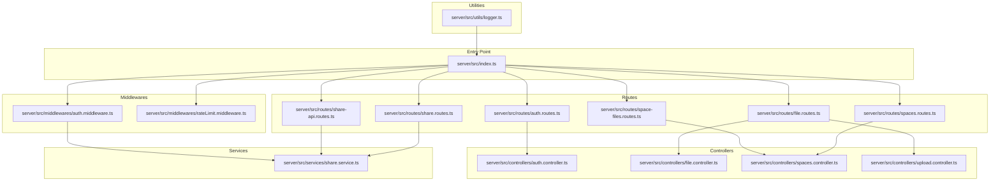
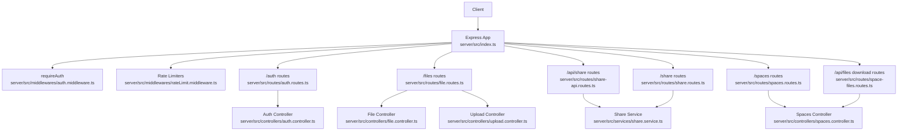
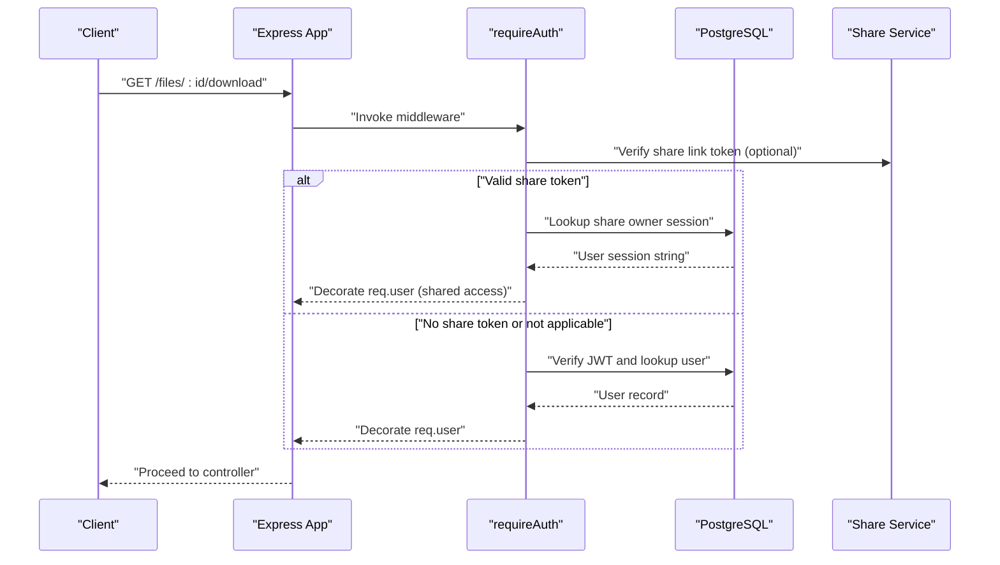
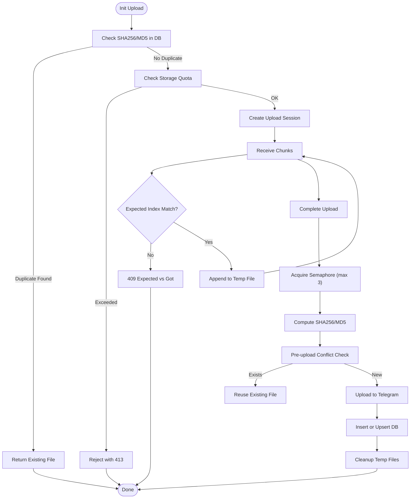
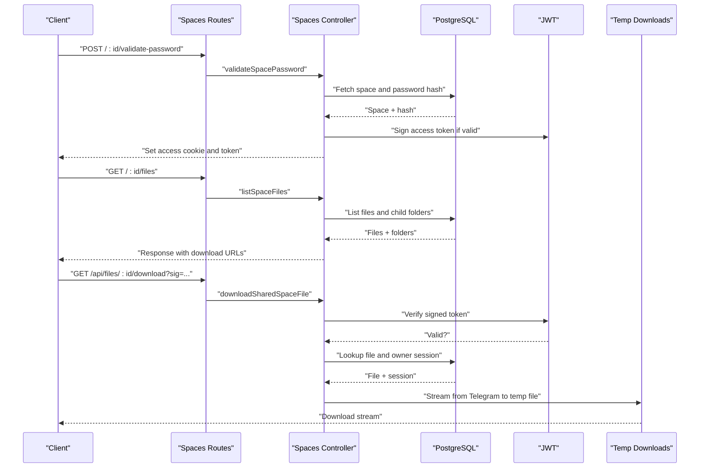
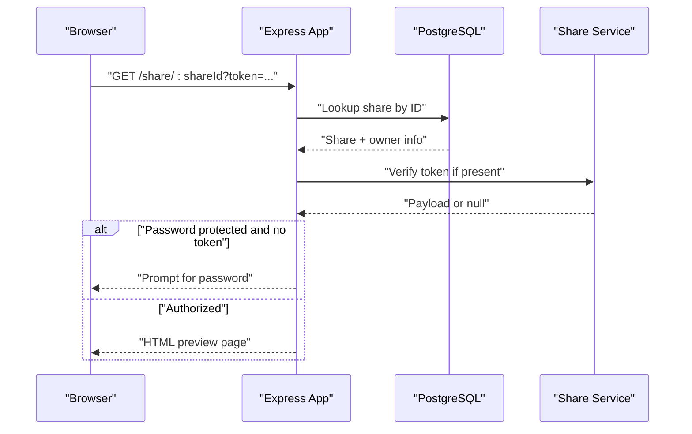

# Backend API Architecture

<cite>
**Referenced Files in This Document**
- [index.ts](file://server/src/index.ts)
- [auth.controller.ts](file://server/src/controllers/auth.controller.ts)
- [file.controller.ts](file://server/src/controllers/file.controller.ts)
- [spaces.controller.ts](file://server/src/controllers/spaces.controller.ts)
- [upload.controller.ts](file://server/src/controllers/upload.controller.ts)
- [auth.middleware.ts](file://server/src/middlewares/auth.middleware.ts)
- [rateLimit.middleware.ts](file://server/src/middlewares/rateLimit.middleware.ts)
- [auth.routes.ts](file://server/src/routes/auth.routes.ts)
- [file.routes.ts](file://server/src/routes/file.routes.ts)
- [spaces.routes.ts](file://server/src/routes/spaces.routes.ts)
- [share.routes.ts](file://server/src/routes/share.routes.ts)
- [share-api.routes.ts](file://server/src/routes/share-api.routes.ts)
- [space-files.routes.ts](file://server/src/routes/space-files.routes.ts)
- [share.service.ts](file://server/src/services/share.service.ts)
- [logger.ts](file://server/src/utils/logger.ts)
- [package.json](file://server/package.json)
</cite>

## Table of Contents
1. [Introduction](#introduction)
2. [Project Structure](#project-structure)
3. [Core Components](#core-components)
4. [Architecture Overview](#architecture-overview)
5. [Detailed Component Analysis](#detailed-component-analysis)
6. [Dependency Analysis](#dependency-analysis)
7. [Performance Considerations](#performance-considerations)
8. [Troubleshooting Guide](#troubleshooting-guide)
9. [Conclusion](#conclusion)
10. [Appendices](#appendices)

## Introduction
This document describes the backend API architecture built with Express.js. It focuses on RESTful API design, route organization, middleware stack, and error handling. The system is structured around an MVC pattern: routes define endpoints, controllers encapsulate business logic, and middleware handles cross-cutting concerns such as authentication, rate limiting, and request processing. The API integrates with a PostgreSQL database and the Telegram client for media storage and retrieval. Security measures include Helmet, CORS configuration, nonce-based CSP, and JWT-based authentication. The architecture also supports shared spaces and public share links with token-based access and password protection.

## Project Structure
The server application is organized by layers and features:
- Entry point initializes Express, middleware, routes, and error handling.
- Controllers implement business logic for authentication, files, shared spaces, and streaming.
- Middlewares enforce authentication and rate limits.
- Routes group endpoints by domain (authentication, files, shares, spaces, streams).
- Services encapsulate reusable logic (e.g., share token signing and URL generation).
- Utilities provide logging and shared helpers.

**Diagram sources**
- [index.ts](file://server/src/index.ts#L1-L315)
- [auth.middleware.ts](file://server/src/middlewares/auth.middleware.ts#L1-L82)
- [rateLimit.middleware.ts](file://server/src/middlewares/rateLimit.middleware.ts#L1-L47)
- [auth.routes.ts](file://server/src/routes/auth.routes.ts#L1-L13)
- [file.routes.ts](file://server/src/routes/file.routes.ts#L1-L118)
- [share.routes.ts](file://server/src/routes/share.routes.ts#L1-L12)
- [share-api.routes.ts](file://server/src/routes/share-api.routes.ts#L1-L21)
- [spaces.routes.ts](file://server/src/routes/spaces.routes.ts#L1-L35)
- [space-files.routes.ts](file://server/src/routes/space-files.routes.ts#L1-L10)
- [auth.controller.ts](file://server/src/controllers/auth.controller.ts#L1-L96)
- [file.controller.ts](file://server/src/controllers/file.controller.ts#L1-L1090)
- [spaces.controller.ts](file://server/src/controllers/spaces.controller.ts#L1-L498)
- [upload.controller.ts](file://server/src/controllers/upload.controller.ts#L1-L540)
- [share.service.ts](file://server/src/services/share.service.ts#L1-L183)
- [logger.ts](file://server/src/utils/logger.ts#L1-L27)

**Section sources**
- [index.ts](file://server/src/index.ts#L1-L315)
- [package.json](file://server/package.json#L1-L57)

## Core Components
- Express application initialization and middleware stack:
  - Logging middleware logs request lifecycle events.
  - Trust proxy enabled for cloud platforms.
  - Helmet with CSP using per-request nonce.
  - CORS configured with dynamic origin handling and credential support.
  - Body parsing with JSON and URL-encoded payloads and cookie parsing.
  - Global rate limiter and specialized auth limiter.
  - Route registration for authentication, files, shares, spaces, streams, and health checks.
  - Global error handler and graceful shutdown.
- Authentication middleware:
  - Validates JWT for standard routes.
  - Supports share-link token bypass for public downloads/thumbnails.
  - Injects user context into the request.
- Rate limiting middleware:
  - Dedicated limiters for share password attempts, share views/downloads, shared space views/passwords/uploads, and signed downloads.
- Controllers:
  - Authentication: send code, verify code, get user, delete account.
  - Files: upload (multipart and chunked), list/search, star/trash/restore/delete, folders, download/stream/thumbnail, tags, recent access, stats/activity.
  - Spaces: create/list/get public, validate password, list files, upload to space, download shared space file.
  - Upload: init/chunk/complete/cancel/status with deduplication, concurrency control, and Telegram integration.
- Services:
  - Share service: token signing/verification, share URLs, normalization, sorting helpers.
- Utilities:
  - Structured logger with JSON output.

**Section sources**
- [index.ts](file://server/src/index.ts#L25-L273)
- [auth.middleware.ts](file://server/src/middlewares/auth.middleware.ts#L19-L81)
- [rateLimit.middleware.ts](file://server/src/middlewares/rateLimit.middleware.ts#L1-L47)
- [auth.controller.ts](file://server/src/controllers/auth.controller.ts#L1-L96)
- [file.controller.ts](file://server/src/controllers/file.controller.ts#L1-L1090)
- [spaces.controller.ts](file://server/src/controllers/spaces.controller.ts#L1-L498)
- [upload.controller.ts](file://server/src/controllers/upload.controller.ts#L1-L540)
- [share.service.ts](file://server/src/services/share.service.ts#L1-L183)
- [logger.ts](file://server/src/utils/logger.ts#L1-L27)

## Architecture Overview
The API follows a layered MVC architecture:
- Routes define endpoint contracts and bind middleware.
- Controllers implement business logic and orchestrate services and database operations.
- Middlewares handle authentication, rate limiting, and request preprocessing.
- Services encapsulate domain-specific logic (e.g., share tokens).
- Utilities provide logging and shared helpers.

**Diagram sources**
- [index.ts](file://server/src/index.ts#L107-L220)
- [auth.middleware.ts](file://server/src/middlewares/auth.middleware.ts#L19-L81)
- [rateLimit.middleware.ts](file://server/src/middlewares/rateLimit.middleware.ts#L1-L47)
- [auth.routes.ts](file://server/src/routes/auth.routes.ts#L1-L13)
- [file.routes.ts](file://server/src/routes/file.routes.ts#L1-L118)
- [share.routes.ts](file://server/src/routes/share.routes.ts#L1-L12)
- [share-api.routes.ts](file://server/src/routes/share-api.routes.ts#L1-L21)
- [spaces.routes.ts](file://server/src/routes/spaces.routes.ts#L1-L35)
- [space-files.routes.ts](file://server/src/routes/space-files.routes.ts#L1-L10)
- [auth.controller.ts](file://server/src/controllers/auth.controller.ts#L1-L96)
- [file.controller.ts](file://server/src/controllers/file.controller.ts#L1-L1090)
- [spaces.controller.ts](file://server/src/controllers/spaces.controller.ts#L1-L498)
- [upload.controller.ts](file://server/src/controllers/upload.controller.ts#L1-L540)
- [share.service.ts](file://server/src/services/share.service.ts#L1-L183)

## Detailed Component Analysis

### Authentication Flow
The authentication flow validates JWT tokens and supports share-link token bypass for public access.

**Diagram sources**
- [auth.middleware.ts](file://server/src/middlewares/auth.middleware.ts#L19-L81)
- [share.service.ts](file://server/src/services/share.service.ts#L79-L110)
- [index.ts](file://server/src/index.ts#L113-L201)

**Section sources**
- [auth.middleware.ts](file://server/src/middlewares/auth.middleware.ts#L19-L81)
- [share.service.ts](file://server/src/services/share.service.ts#L79-L110)

### File Upload Pipeline (Chunked)
The chunked upload pipeline ensures deduplication, concurrency control, and robust Telegram integration.

**Diagram sources**
- [upload.controller.ts](file://server/src/controllers/upload.controller.ts#L136-L482)

**Section sources**
- [upload.controller.ts](file://server/src/controllers/upload.controller.ts#L136-L482)

### Shared Spaces Access Control
Shared spaces use password validation and signed access tokens for controlled access.

**Diagram sources**
- [spaces.routes.ts](file://server/src/routes/spaces.routes.ts#L29-L32)
- [spaces.controller.ts](file://server/src/controllers/spaces.controller.ts#L255-L497)
- [space-files.routes.ts](file://server/src/routes/space-files.routes.ts#L7-L7)

**Section sources**
- [spaces.routes.ts](file://server/src/routes/spaces.routes.ts#L29-L32)
- [spaces.controller.ts](file://server/src/controllers/spaces.controller.ts#L255-L497)
- [space-files.routes.ts](file://server/src/routes/space-files.routes.ts#L7-L7)

### Public Share Link Rendering
Public share links render a preview page and support password-protected content.

**Diagram sources**
- [index.ts](file://server/src/index.ts#L113-L201)
- [share.service.ts](file://server/src/services/share.service.ts#L79-L110)

**Section sources**
- [index.ts](file://server/src/index.ts#L113-L201)
- [share.service.ts](file://server/src/services/share.service.ts#L79-L110)

### Route Definitions and Organization
- Authentication routes: send code, verify code, get user, delete account.
- Files routes: multipart upload, chunked upload, list/search, star/trash/restore/delete, folders, download/stream/thumbnail, tags, recent access, stats/activity.
- Share routes: list/create/revoke links.
- Share API routes: create, verify password, list files, download, get session.
- Spaces routes: create/list/get public, validate password, list files, upload to space.
- Space files routes: signed download endpoint.

**Section sources**
- [auth.routes.ts](file://server/src/routes/auth.routes.ts#L1-L13)
- [file.routes.ts](file://server/src/routes/file.routes.ts#L1-L118)
- [share.routes.ts](file://server/src/routes/share.routes.ts#L1-L12)
- [share-api.routes.ts](file://server/src/routes/share-api.routes.ts#L1-L21)
- [spaces.routes.ts](file://server/src/routes/spaces.routes.ts#L1-L35)
- [space-files.routes.ts](file://server/src/routes/space-files.routes.ts#L1-L10)

### Middleware Stack
- Logging middleware: logs request completion with method, URL, status, and duration.
- Security: Helmet with CSP using per-request nonce; CORS allowing configured origins and credentials; trust proxy enabled.
- Body parsing: JSON and URL-encoded with size limits; cookie parser with secret.
- Global rate limiting: configurable window and max requests; auth limiter for OTP brute-force prevention.
- Route-specific rate limiting: share password, share view/download, shared space view/password/upload, signed download.
- Authentication: JWT verification; share-link token bypass for public endpoints.

**Section sources**
- [index.ts](file://server/src/index.ts#L28-L98)
- [auth.middleware.ts](file://server/src/middlewares/auth.middleware.ts#L19-L81)
- [rateLimit.middleware.ts](file://server/src/middlewares/rateLimit.middleware.ts#L1-L47)

### Error Handling Strategy
- Global error handler logs unhandled errors and responds with standardized JSON.
- Multer file size errors mapped to 413.
- Controllers return structured responses with success/error fields and appropriate HTTP status codes.
- Uncaught exceptions and unhandled rejections are logged and handled gracefully.

**Section sources**
- [index.ts](file://server/src/index.ts#L238-L272)
- [auth.controller.ts](file://server/src/controllers/auth.controller.ts#L1-L96)
- [file.controller.ts](file://server/src/controllers/file.controller.ts#L1-L1090)
- [spaces.controller.ts](file://server/src/controllers/spaces.controller.ts#L1-L498)
- [upload.controller.ts](file://server/src/controllers/upload.controller.ts#L1-L540)

## Dependency Analysis
The application depends on Express and several middleware packages for routing, security, rate limiting, and file handling. Controllers depend on the database pool and Telegram client for media operations. Services encapsulate share-related logic and URL generation.

```mermaid
graph TB
Express["express"]
Helmet["helmet"]
CORS["cors"]
Cookie["cookie-parser"]
RateLimit["express-rate-limit"]
Multer["multer"]
JWT["jsonwebtoken"]
PG["pg"]
Sharp["sharp"]
Telegraf["telegram"]
Bcrypt["bcryptjs"]
IDX["server/src/index.ts"] --> Express
IDX --> Helmet
IDX --> CORS
IDX --> Cookie
IDX --> RateLimit
IDX --> Multer
IDX --> PG
AMW["server/src/middlewares/auth.middleware.ts"] --> JWT
AMW --> PG
FC["server/src/controllers/file.controller.ts"] --> Telegraf
FC --> PG
FC --> Sharp
UC["server/src/controllers/upload.controller.ts"] --> Telegraf
UC --> PG
UC --> Multer
SC["server/src/controllers/spaces.controller.ts"] --> JWT
SC --> Bcrypt
SC --> PG
SC --> Telegraf
SSR["server/src/services/share.service.ts"] --> JWT
```

**Diagram sources**
- [package.json](file://server/package.json#L19-L41)
- [index.ts](file://server/src/index.ts#L1-L315)
- [auth.middleware.ts](file://server/src/middlewares/auth.middleware.ts#L1-L82)
- [file.controller.ts](file://server/src/controllers/file.controller.ts#L1-L1090)
- [upload.controller.ts](file://server/src/controllers/upload.controller.ts#L1-L540)
- [spaces.controller.ts](file://server/src/controllers/spaces.controller.ts#L1-L498)
- [share.service.ts](file://server/src/services/share.service.ts#L1-L183)

**Section sources**
- [package.json](file://server/package.json#L19-L41)

## Performance Considerations
- Streaming and caching:
  - Thumbnail generation caches WebP images on disk with TTL and Sharp optimization.
  - Media streaming uses disk-cached files with HTTP Range support and concurrency-safe download locks.
- Concurrency control:
  - Telegram upload semaphore limits concurrent operations to prevent OOM and improve stability.
- Deduplication:
  - Chunked upload pipeline checks SHA256/MD5 hashes to reuse existing files and reduce network/storage overhead.
- Rate limiting:
  - Global and route-specific rate limiters protect against abuse while accommodating legitimate batch operations.
- Memory management:
  - Upload state evicts completed/failed sessions after TTL to prevent memory leaks.

[No sources needed since this section provides general guidance]

## Troubleshooting Guide
- Authentication failures:
  - Verify JWT_SECRET is set and valid; ensure Authorization header format is "Bearer <token>".
  - For share-link access, confirm token validity and expiration.
- Upload issues:
  - Check storage quota and file size limits; review chunk ordering and session state.
  - Inspect Telegram flood wait errors and retry behavior.
- Shared spaces:
  - Confirm password hash validation and access cookie/token presence.
  - Validate signed download tokens and TTL.
- Logging:
  - Use structured logs to diagnose request lifecycle, stream errors, and upload failures.

**Section sources**
- [auth.middleware.ts](file://server/src/middlewares/auth.middleware.ts#L5-L81)
- [upload.controller.ts](file://server/src/controllers/upload.controller.ts#L38-L71)
- [spaces.controller.ts](file://server/src/controllers/spaces.controller.ts#L87-L126)
- [logger.ts](file://server/src/utils/logger.ts#L1-L27)

## Conclusion
The backend API employs a clean MVC structure with well-defined routes, robust middleware, and comprehensive error handling. Security is enforced through JWT, share tokens, CSP, and CORS. Performance is optimized via streaming, caching, and concurrency controls. The architecture supports extensibility with modular controllers and services, enabling consistent addition of new endpoints and features.

[No sources needed since this section summarizes without analyzing specific files]

## Appendices

### API Versioning
- The current routes do not include explicit version segments in paths. To introduce versioning, prefix routes with "/v1", "/v2", etc., and maintain backward compatibility by deprecating older endpoints.

[No sources needed since this section provides general guidance]

### Request Validation and Response Formatting
- Validation:
  - Use express-validator for input validation and sanitization.
  - Enforce allowed MIME types and size limits in controllers.
- Response:
  - Standardize success/error fields and HTTP status codes across controllers.
  - Include pagination metadata for list endpoints.

[No sources needed since this section provides general guidance]

### Security Guidelines
- Secrets:
  - Ensure JWT_SECRET, SHARE_LINK_SECRET, SHARE_ACCESS_SECRET, and other secrets are set securely.
- Headers:
  - Helmet CSP uses per-request nonce; verify nonce propagation in HTML rendering.
- CORS:
  - Configure ALLOWED_ORIGINS appropriately for deployment environments.

[No sources needed since this section provides general guidance]

### Extending the API
- Add a new route group:
  - Create a new router file under routes/.
  - Implement controller methods under controllers/.
  - Register the router in the entry point with appropriate middleware.
- Maintain consistency:
  - Follow naming conventions for endpoints and parameters.
  - Centralize shared logic in services.
  - Use structured logging for observability.

[No sources needed since this section provides general guidance]