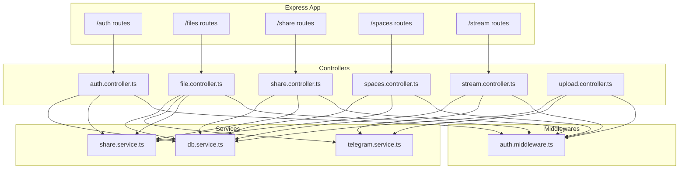
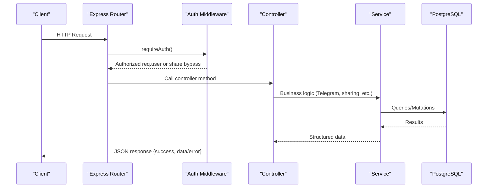
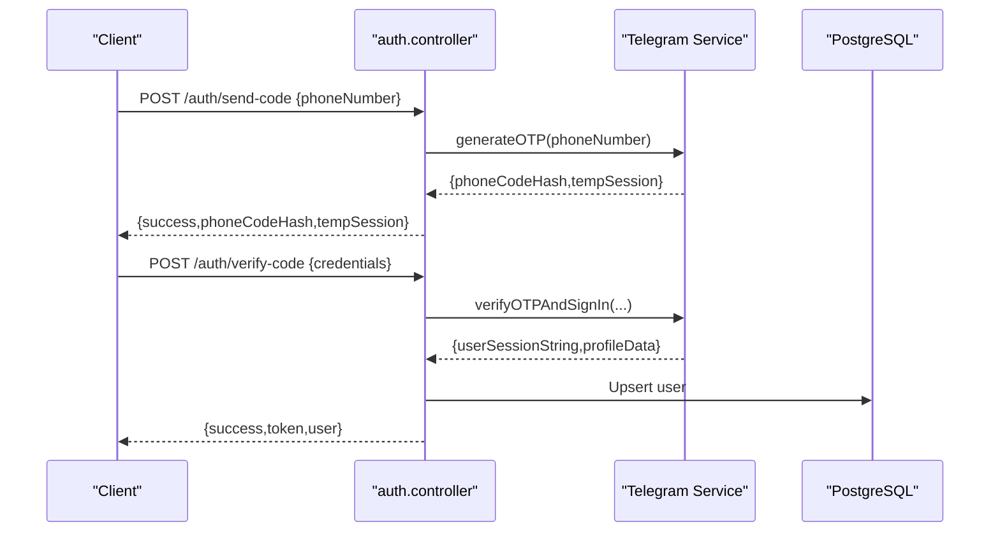
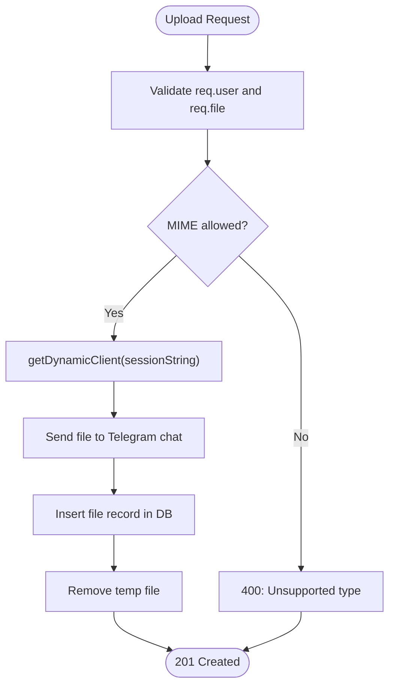
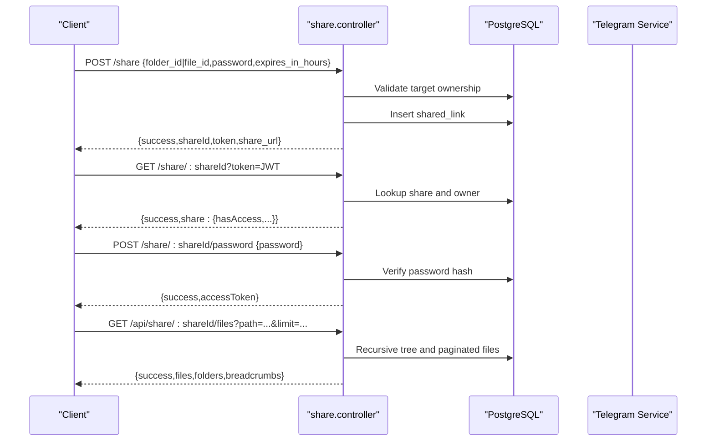
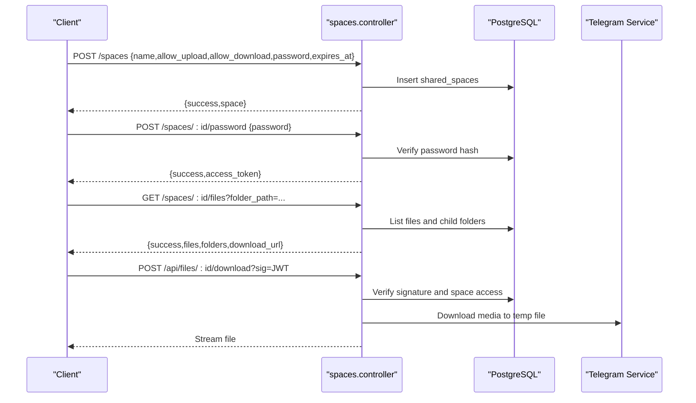
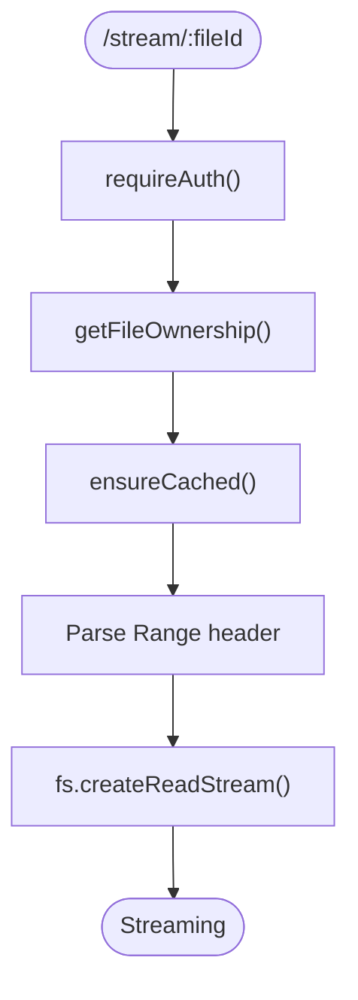
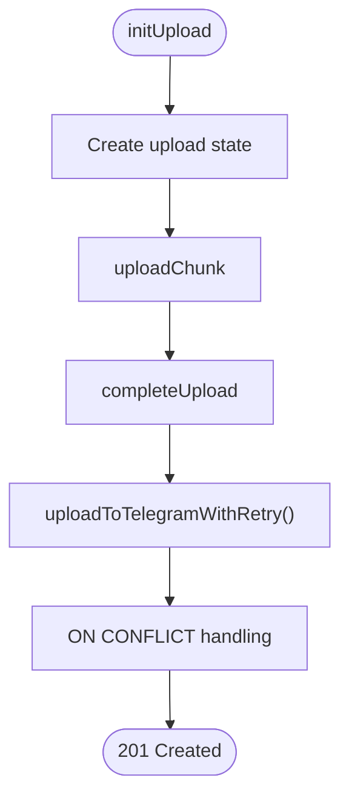
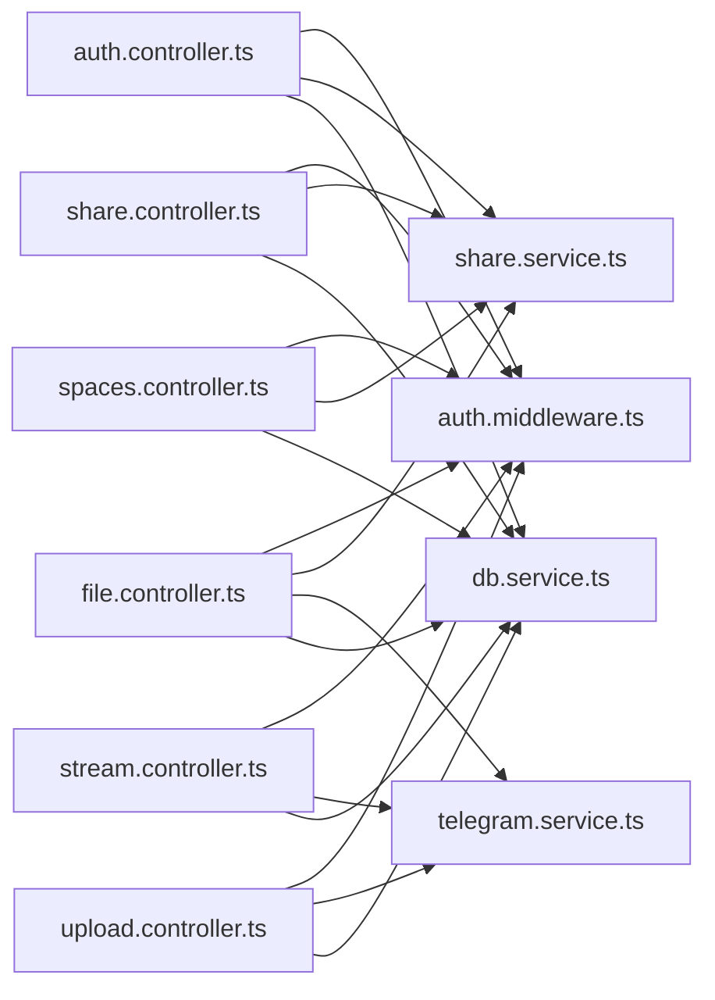

# Controller Implementation and Business Logic

<cite>
**Referenced Files in This Document**
- [auth.controller.ts](file://server/src/controllers/auth.controller.ts)
- [file.controller.ts](file://server/src/controllers/file.controller.ts)
- [share.controller.ts](file://server/src/controllers/share.controller.ts)
- [spaces.controller.ts](file://server/src/controllers/spaces.controller.ts)
- [stream.controller.ts](file://server/src/controllers/stream.controller.ts)
- [upload.controller.ts](file://server/src/controllers/upload.controller.ts)
- [auth.middleware.ts](file://server/src/middlewares/auth.middleware.ts)
- [telegram.service.ts](file://server/src/services/telegram.service.ts)
- [share.service.ts](file://server/src/services/share.service.ts)
- [db.service.ts](file://server/src/services/db.service.ts)
- [auth.routes.ts](file://server/src/routes/auth.routes.ts)
- [file.routes.ts](file://server/src/routes/file.routes.ts)
- [share.routes.ts](file://server/src/routes/share.routes.ts)
- [index.ts](file://server/src/index.ts)
</cite>

## Table of Contents
1. [Introduction](#introduction)
2. [Project Structure](#project-structure)
3. [Core Components](#core-components)
4. [Architecture Overview](#architecture-overview)
5. [Detailed Component Analysis](#detailed-component-analysis)
6. [Dependency Analysis](#dependency-analysis)
7. [Performance Considerations](#performance-considerations)
8. [Troubleshooting Guide](#troubleshooting-guide)
9. [Conclusion](#conclusion)
10. [Appendices](#appendices)

## Introduction
This document explains the Express.js controller implementation and business logic for the teledrive project. It focuses on how controllers handle HTTP requests, validate parameters, enforce business rules, interact with services and external systems, and return structured responses. The documentation covers authentication operations, file management, sharing functionality, space management, streaming, and upload processing. It also provides guidance on testing strategies, dependency injection patterns, separation of concerns, and extension practices.

## Project Structure
The server follows a layered architecture:
- Controllers: HTTP entry points that validate inputs, enforce permissions, and orchestrate service calls.
- Services: Encapsulate business logic and integrations (e.g., Telegram, sharing, database).
- Middlewares: Authentication and cross-cutting concerns.
- Routes: Define URL patterns and attach middlewares and controllers.
- Database: PostgreSQL schema and migrations managed by a service.

**Diagram sources**
- [index.ts](file://server/src/index.ts#L107-L220)
- [auth.routes.ts](file://server/src/routes/auth.routes.ts#L1-L12)
- [file.routes.ts](file://server/src/routes/file.routes.ts#L1-L118)
- [share.routes.ts](file://server/src/routes/share.routes.ts#L1-L12)
- [auth.controller.ts](file://server/src/controllers/auth.controller.ts#L1-L96)
- [file.controller.ts](file://server/src/controllers/file.controller.ts#L1-L1121)
- [share.controller.ts](file://server/src/controllers/share.controller.ts#L1-L633)
- [spaces.controller.ts](file://server/src/controllers/spaces.controller.ts#L1-L498)
- [stream.controller.ts](file://server/src/controllers/stream.controller.ts#L1-L460)
- [upload.controller.ts](file://server/src/controllers/upload.controller.ts#L1-L546)
- [auth.middleware.ts](file://server/src/middlewares/auth.middleware.ts#L1-L82)
- [telegram.service.ts](file://server/src/services/telegram.service.ts#L1-L260)
- [share.service.ts](file://server/src/services/share.service.ts#L1-L183)
- [db.service.ts](file://server/src/services/db.service.ts#L1-L315)

**Section sources**
- [index.ts](file://server/src/index.ts#L107-L220)
- [auth.routes.ts](file://server/src/routes/auth.routes.ts#L1-L12)
- [file.routes.ts](file://server/src/routes/file.routes.ts#L1-L118)
- [share.routes.ts](file://server/src/routes/share.routes.ts#L1-L12)

## Core Components
- Authentication controller: OTP-based phone login, JWT issuance, user profile retrieval, and account deletion.
- File controller: CRUD operations, search, star/unstar, trash/restore, thumbnails, streaming, and folder management.
- Sharing controller: Create, list, revoke, and resolve share links; password-protected access; public file/folder browsing.
- Spaces controller: Shared spaces creation, password validation, listing, upload, and download with signed tokens.
- Stream controller: Cached progressive streaming with Range support, ownership caching, and progress tracking.
- Upload controller: Chunked upload with deduplication, retries, concurrency control, and progress reporting.
- Authentication middleware: JWT verification and share-link bypass for public endpoints.
- Telegram service: Client pooling, session management, and progressive file download.
- Share service: JWT signing/verification for share links and access tokens, URL construction, and path normalization.
- Database service: Schema initialization and migrations.

**Section sources**
- [auth.controller.ts](file://server/src/controllers/auth.controller.ts#L1-L96)
- [file.controller.ts](file://server/src/controllers/file.controller.ts#L1-L1121)
- [share.controller.ts](file://server/src/controllers/share.controller.ts#L1-L633)
- [spaces.controller.ts](file://server/src/controllers/spaces.controller.ts#L1-L498)
- [stream.controller.ts](file://server/src/controllers/stream.controller.ts#L1-L460)
- [upload.controller.ts](file://server/src/controllers/upload.controller.ts#L1-L546)
- [auth.middleware.ts](file://server/src/middlewares/auth.middleware.ts#L1-L82)
- [telegram.service.ts](file://server/src/services/telegram.service.ts#L1-L260)
- [share.service.ts](file://server/src/services/share.service.ts#L1-L183)
- [db.service.ts](file://server/src/services/db.service.ts#L1-L315)

## Architecture Overview
Controllers implement the Model-View-Controller pattern:
- Controllers accept HTTP requests, validate parameters, enforce authorization, and delegate to services.
- Services encapsulate business logic and integrate with external systems (Telegram) and the database.
- Middlewares handle cross-cutting concerns like authentication and rate limiting.
- Routes define the API surface and attach middlewares and controllers.

**Diagram sources**
- [auth.middleware.ts](file://server/src/middlewares/auth.middleware.ts#L19-L81)
- [auth.controller.ts](file://server/src/controllers/auth.controller.ts#L9-L96)
- [file.controller.ts](file://server/src/controllers/file.controller.ts#L49-L98)
- [share.controller.ts](file://server/src/controllers/share.controller.ts#L205-L264)
- [spaces.controller.ts](file://server/src/controllers/spaces.controller.ts#L161-L194)
- [stream.controller.ts](file://server/src/controllers/stream.controller.ts#L322-L459)
- [upload.controller.ts](file://server/src/controllers/upload.controller.ts#L136-L274)
- [telegram.service.ts](file://server/src/services/telegram.service.ts#L57-L97)
- [db.service.ts](file://server/src/services/db.service.ts#L3-L312)

## Detailed Component Analysis

### Authentication Controller
Responsibilities:
- Send OTP to a phone number via Telegram.
- Verify OTP and sign in to retrieve user session string and profile.
- Retrieve current user profile and delete account with cascading effects.

Key patterns:
- Parameter validation and early returns with 400/401 responses.
- Environment validation for secrets.
- Database operations for user creation/update and deletion.
- JWT signing for long-lived sessions.

**Diagram sources**
- [auth.controller.ts](file://server/src/controllers/auth.controller.ts#L9-L69)
- [telegram.service.ts](file://server/src/services/telegram.service.ts#L102-L160)
- [db.service.ts](file://server/src/services/db.service.ts#L7-L47)

**Section sources**
- [auth.controller.ts](file://server/src/controllers/auth.controller.ts#L1-L96)
- [auth.routes.ts](file://server/src/routes/auth.routes.ts#L7-L10)

### File Management Controller
Responsibilities:
- Upload files (single and chunked), search, list, update, star/unstar, trash/restore/delete, and fetch trash.
- Thumbnails with disk caching and Sharp optimization.
- Streaming with Range support and disk caching.
- Folder management (create, list, update, delete).
- Tagging and recently accessed tracking.

Key patterns:
- Input validation and whitelisting for sort/order parameters.
- Ownership checks via middleware-decorated user context.
- Telegram client reuse via dynamic client pool.
- Disk caching for thumbnails and streams to reduce network load.
- Activity logging for auditability.

**Diagram sources**
- [file.controller.ts](file://server/src/controllers/file.controller.ts#L49-L98)
- [telegram.service.ts](file://server/src/services/telegram.service.ts#L57-L97)

**Section sources**
- [file.controller.ts](file://server/src/controllers/file.controller.ts#L1-L1121)
- [file.routes.ts](file://server/src/routes/file.routes.ts#L1-L118)

### Sharing Controller
Responsibilities:
- Create share links with optional password, expiration, and permissions.
- List and revoke user’s own shares.
- Public session retrieval and password verification for protected shares.
- Browse shared files/folders with pagination, sorting, and breadcrumbs.
- Download shared files with Range support and access control.

Key patterns:
- JWT-based link and access tokens with separate secrets.
- Share resolution with expiration and permission checks.
- Path normalization and recursive folder traversal for shared trees.
- Iterative download for progressive streaming without buffering.

**Diagram sources**
- [share.controller.ts](file://server/src/controllers/share.controller.ts#L205-L538)
- [share.service.ts](file://server/src/services/share.service.ts#L62-L129)
- [telegram.service.ts](file://server/src/services/telegram.service.ts#L215-L251)

**Section sources**
- [share.controller.ts](file://server/src/controllers/share.controller.ts#L1-L633)
- [share.routes.ts](file://server/src/routes/share.routes.ts#L1-L12)
- [share.service.ts](file://server/src/services/share.service.ts#L1-L183)

### Spaces Controller
Responsibilities:
- Create shared spaces with optional password, upload/download permissions, and expiration.
- Validate space password and issue access tokens via cookies.
- List space files with folder navigation and child folders discovery.
- Upload files to a space using the owner’s Telegram session.
- Download space files with signed tokens and temporary disk caching.

Key patterns:
- JWT-based access tokens with configurable TTL and secrets.
- IP-based access logs for auditing.
- Safe path normalization to prevent traversal.
- Signed download tokens with short TTL for secure downloads.

**Diagram sources**
- [spaces.controller.ts](file://server/src/controllers/spaces.controller.ts#L161-L497)
- [telegram.service.ts](file://server/src/services/telegram.service.ts#L57-L97)

**Section sources**
- [spaces.controller.ts](file://server/src/controllers/spaces.controller.ts#L1-L498)

### Stream Controller
Responsibilities:
- Provide cached progressive streaming with Range support.
- Track download progress and cache status.
- Use ownership caching to avoid frequent DB queries.
- Handle partial downloads and client disconnects.

Key patterns:
- Disk cache with TTL and cleanup jobs.
- In-flight download locks to prevent redundant downloads.
- Ownership cache with 60s TTL for status endpoints.
- Iterative download with backpressure handling.

**Diagram sources**
- [stream.controller.ts](file://server/src/controllers/stream.controller.ts#L322-L459)

**Section sources**
- [stream.controller.ts](file://server/src/controllers/stream.controller.ts#L1-L460)

### Upload Controller
Responsibilities:
- Initialize chunked uploads with deduplication via hashes.
- Receive and append chunks with ordering validation.
- Finalize uploads with retries, concurrency control, and conflict resolution.
- Report progress and allow cancellation.

Key patterns:
- In-memory upload state with eviction after completion.
- Semaphore to limit concurrent Telegram uploads.
- Deduplication against DB and pre-upload checks.
- Exponential backoff and flood wait handling for Telegram.

**Diagram sources**
- [upload.controller.ts](file://server/src/controllers/upload.controller.ts#L136-L488)
- [telegram.service.ts](file://server/src/services/telegram.service.ts#L39-L71)

**Section sources**
- [upload.controller.ts](file://server/src/controllers/upload.controller.ts#L1-L546)

### Authentication Middleware
Responsibilities:
- Verify JWT bearer tokens for standard routes.
- Allow public access for specific endpoints via share-link tokens.
- Populate req.user with session string for downstream controllers.

Key patterns:
- Share-link bypass for download/stream/thumbnail endpoints.
- User session string retrieval for Telegram operations.

**Section sources**
- [auth.middleware.ts](file://server/src/middlewares/auth.middleware.ts#L1-L82)

### Telegram Service
Responsibilities:
- Manage a persistent client pool keyed by session fingerprint.
- Auto-reconnect and eviction of expired clients.
- Progressive file download via iterDownload for streaming.
- Sign-in flows for OTP and session persistence.

Key patterns:
- Client TTL and eviction callbacks.
- Iterative download with configurable chunk size.
- Session-based client reuse to minimize reconnect overhead.

**Section sources**
- [telegram.service.ts](file://server/src/services/telegram.service.ts#L1-L260)

### Share Service
Responsibilities:
- JWT signing/verification for share links and access tokens.
- URL construction and token parsing helpers.
- Path normalization and breadcrumb building.
- Sorting helpers for shared listings.

Key patterns:
- Separate secrets for link and access tokens.
- TTL parsing with multiple formats.

**Section sources**
- [share.service.ts](file://server/src/services/share.service.ts#L1-L183)

### Database Service
Responsibilities:
- Initialize schema and apply migrations.
- Enforce referential integrity and unique constraints.
- Maintain user storage counters via triggers.

Key patterns:
- Extensive indexes for performance.
- Triggers for automatic counters and validations.

**Section sources**
- [db.service.ts](file://server/src/services/db.service.ts#L1-L315)

## Dependency Analysis
Controllers depend on:
- Middlewares for authentication and authorization.
- Services for business logic and external integrations.
- Database service for persistence.
- Telegram service for media operations.

**Diagram sources**
- [auth.controller.ts](file://server/src/controllers/auth.controller.ts#L1-L96)
- [file.controller.ts](file://server/src/controllers/file.controller.ts#L1-L1121)
- [share.controller.ts](file://server/src/controllers/share.controller.ts#L1-L633)
- [spaces.controller.ts](file://server/src/controllers/spaces.controller.ts#L1-L498)
- [stream.controller.ts](file://server/src/controllers/stream.controller.ts#L1-L460)
- [upload.controller.ts](file://server/src/controllers/upload.controller.ts#L1-L546)
- [auth.middleware.ts](file://server/src/middlewares/auth.middleware.ts#L1-L82)
- [share.service.ts](file://server/src/services/share.service.ts#L1-L183)
- [telegram.service.ts](file://server/src/services/telegram.service.ts#L1-L260)
- [db.service.ts](file://server/src/services/db.service.ts#L1-L315)

**Section sources**
- [index.ts](file://server/src/index.ts#L107-L220)

## Performance Considerations
- Streaming and caching: Disk caching for thumbnails and streams reduces Telegram bandwidth and latency.
- Ownership caching: Short-lived in-memory cache for ownership checks improves status endpoint performance.
- Client pooling: Telegram client reuse minimizes reconnect overhead.
- Concurrency control: Semaphores limit concurrent uploads to prevent OOM and stabilize throughput.
- Indexes and migrations: Carefully designed indexes and triggers optimize query performance and integrity.
- Rate limiting: Per-endpoint and global rate limits protect against abuse and resource exhaustion.

[No sources needed since this section provides general guidance]

## Troubleshooting Guide
Common issues and resolutions:
- Unauthorized requests: Ensure Authorization header contains a valid JWT or, for public endpoints, a valid share token.
- Telegram session errors: Sessions may expire; controllers propagate “session expired” messages to guide re-authentication.
- File not found: Controllers check ownership and trashed state; verify file IDs and user context.
- Upload failures: Check deduplication, chunk ordering, and Telegram flood waits; review progress and error fields.
- Share link invalid/expired: Verify token validity and expiration; ensure correct base URL configuration.

**Section sources**
- [auth.middleware.ts](file://server/src/middlewares/auth.middleware.ts#L19-L81)
- [file.controller.ts](file://server/src/controllers/file.controller.ts#L413-L441)
- [upload.controller.ts](file://server/src/controllers/upload.controller.ts#L394-L403)
- [share.controller.ts](file://server/src/controllers/share.controller.ts#L331-L358)
- [spaces.controller.ts](file://server/src/controllers/spaces.controller.ts#L128-L159)

## Conclusion
The teledrive server demonstrates robust Express.js controller patterns with clear separation of concerns. Controllers validate inputs, enforce authorization, and delegate to services that encapsulate business logic and external integrations. The implementation emphasizes reliability through caching, client pooling, concurrency control, and careful error handling. Following the documented patterns ensures maintainability and extensibility when adding new features.

[No sources needed since this section summarizes without analyzing specific files]

## Appendices

### Testing Strategies
- Unit tests for controllers: Mock services and database to isolate controller logic and assert response shapes.
- Integration tests: Use in-memory databases and stub Telegram client to validate end-to-end flows.
- End-to-end tests: Automated browser or API tests for critical user journeys (login, upload, share, stream).
- Load tests: Simulate concurrent uploads and streams to validate throttling and caching behavior.

[No sources needed since this section provides general guidance]

### Dependency Injection Patterns
- Services as singletons: Import and reuse services across controllers.
- Environment-driven configuration: Secrets and limits configured via environment variables.
- Factory functions: Use factory-style helpers for Telegram clients and caches.

[No sources needed since this section provides general guidance]

### Separation of Concerns
- Controllers: HTTP concerns, parameter validation, and response formatting.
- Services: Business logic, external integrations, and data transformations.
- Middlewares: Cross-cutting concerns like auth and rate limiting.
- Routes: URL mapping and middleware attachment.

[No sources needed since this section provides general guidance]

### Guidelines for Extending Controllers
- Keep controllers thin: Move heavy logic to services.
- Validate early: Fail fast with clear error messages.
- Use consistent response shape: {success, data|error}.
- Respect authorization: Always check ownership and permissions.
- Add logging: Instrument key events for observability.
- Preserve idempotency: Design endpoints to tolerate retries.

[No sources needed since this section provides general guidance]