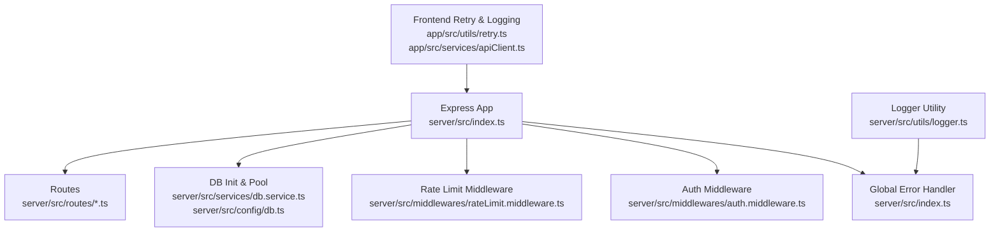
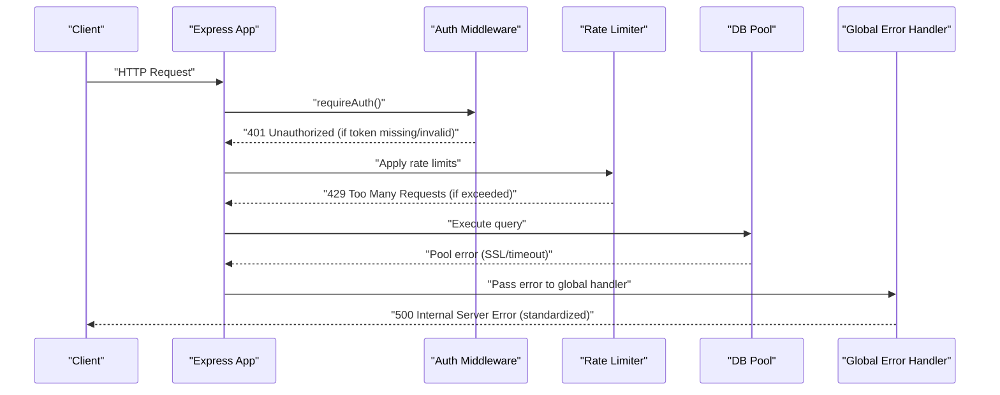
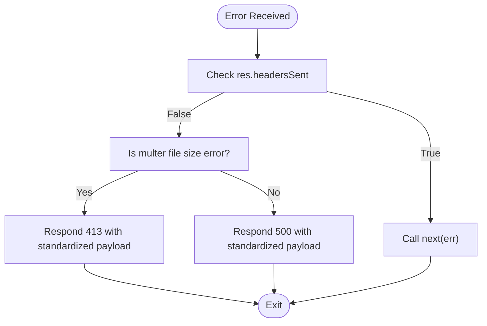
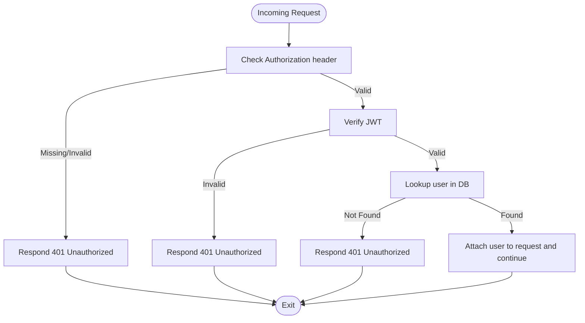
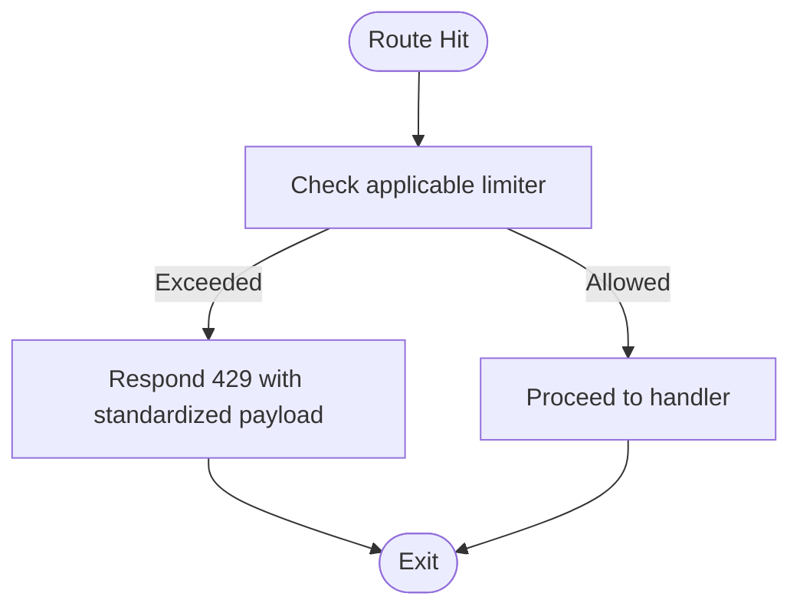
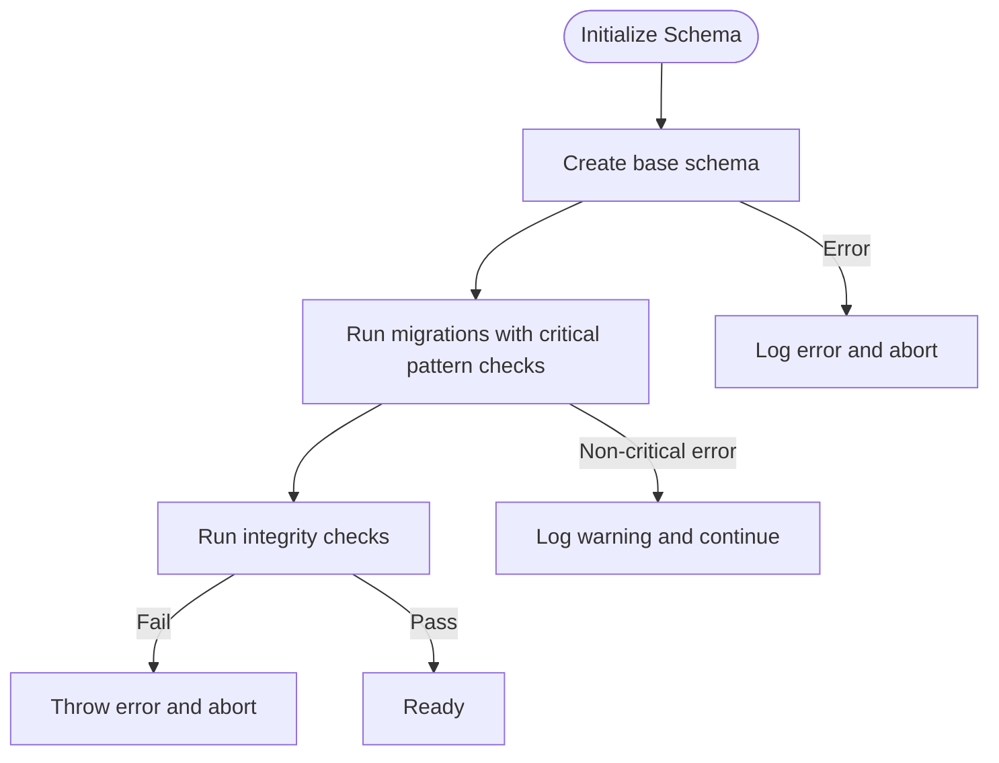
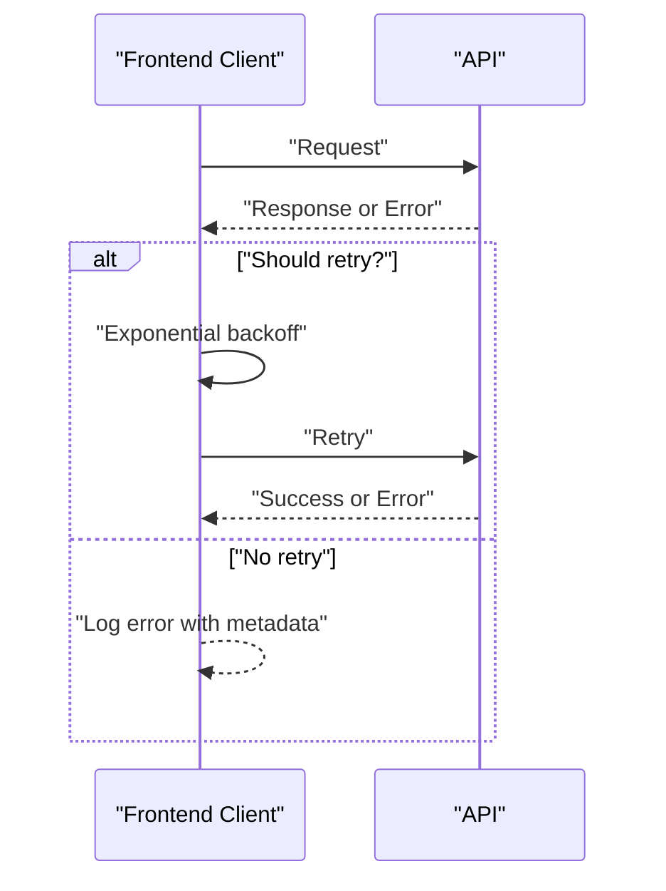
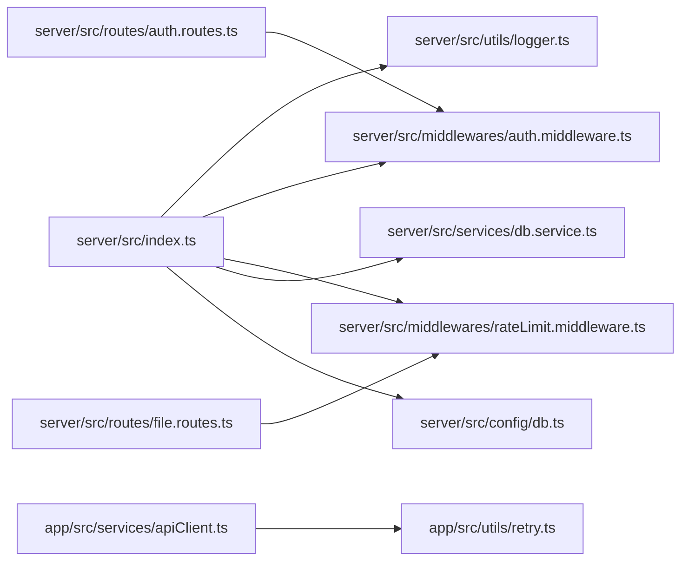

# Error Handling and Response Management

<cite>
**Referenced Files in This Document**
- [server/src/index.ts](file://server/src/index.ts)
- [server/src/utils/logger.ts](file://server/src/utils/logger.ts)
- [server/src/middlewares/auth.middleware.ts](file://server/src/middlewares/auth.middleware.ts)
- [server/src/middlewares/rateLimit.middleware.ts](file://server/src/middlewares/rateLimit.middleware.ts)
- [server/src/services/db.service.ts](file://server/src/services/db.service.ts)
- [server/src/config/db.ts](file://server/src/config/db.ts)
- [server/src/routes/auth.routes.ts](file://server/src/routes/auth.routes.ts)
- [server/src/routes/file.routes.ts](file://server/src/routes/file.routes.ts)
- [app/src/utils/retry.ts](file://app/src/utils/retry.ts)
- [app/src/services/apiClient.ts](file://app/src/services/apiClient.ts)
</cite>

## Table of Contents
1. [Introduction](#introduction)
2. [Project Structure](#project-structure)
3. [Core Components](#core-components)
4. [Architecture Overview](#architecture-overview)
5. [Detailed Component Analysis](#detailed-component-analysis)
6. [Dependency Analysis](#dependency-analysis)
7. [Performance Considerations](#performance-considerations)
8. [Troubleshooting Guide](#troubleshooting-guide)
9. [Conclusion](#conclusion)
10. [Appendices](#appendices)

## Introduction
This document focuses on centralized error handling, logging strategies, and consistent response formatting across the backend server. It explains the global error handler middleware, error response patterns, logging integration with the built-in logger, and error categorization with HTTP status code assignment. It also covers error message formatting, sensitive data handling, and practical examples for validation errors, authentication failures, database errors, and internal server errors. Finally, it provides guidelines for adding new error types, implementing custom error handlers, and maintaining consistency across the application.

## Project Structure
The error handling and response management spans several layers:
- Express application bootstrap and middleware pipeline
- Centralized global error handler
- Authentication middleware with explicit 401 responses
- Rate limiting middleware returning structured error payloads
- Database initialization and connection error handling
- Frontend client-side retry and logging integration

**Diagram sources**
- [server/src/index.ts](file://server/src/index.ts#L238-L249)
- [server/src/middlewares/auth.middleware.ts](file://server/src/middlewares/auth.middleware.ts#L19-L81)
- [server/src/middlewares/rateLimit.middleware.ts](file://server/src/middlewares/rateLimit.middleware.ts#L1-L47)
- [server/src/services/db.service.ts](file://server/src/services/db.service.ts#L1-L315)
- [server/src/config/db.ts](file://server/src/config/db.ts#L1-L61)
- [server/src/utils/logger.ts](file://server/src/utils/logger.ts#L1-L27)
- [app/src/utils/retry.ts](file://app/src/utils/retry.ts#L1-L33)
- [app/src/services/apiClient.ts](file://app/src/services/apiClient.ts#L90-L122)

**Section sources**
- [server/src/index.ts](file://server/src/index.ts#L1-L315)
- [server/src/utils/logger.ts](file://server/src/utils/logger.ts#L1-L27)
- [server/src/middlewares/auth.middleware.ts](file://server/src/middlewares/auth.middleware.ts#L1-L82)
- [server/src/middlewares/rateLimit.middleware.ts](file://server/src/middlewares/rateLimit.middleware.ts#L1-L47)
- [server/src/services/db.service.ts](file://server/src/services/db.service.ts#L1-L315)
- [server/src/config/db.ts](file://server/src/config/db.ts#L1-L61)
- [server/src/routes/auth.routes.ts](file://server/src/routes/auth.routes.ts#L1-L13)
- [server/src/routes/file.routes.ts](file://server/src/routes/file.routes.ts#L1-L118)
- [app/src/utils/retry.ts](file://app/src/utils/retry.ts#L1-L33)
- [app/src/services/apiClient.ts](file://app/src/services/apiClient.ts#L90-L122)

## Core Components
- Centralized global error handler: Provides a single catch-all for unhandled exceptions and Express errors, logs with structured metadata, and returns a consistent JSON response format.
- Logger utility: Writes structured JSON logs to stdout/stderr with severity levels and optional metadata.
- Authentication middleware: Explicitly returns 401 Unauthorized with a consistent error payload for missing or invalid tokens and user lookup failures.
- Rate limiting middleware: Applies multiple rate limiters with consistent error payloads and HTTP 429 responses.
- Database initialization and pool error handling: Initializes schema and migrations with robust error handling and logs pool events for SSL and timeout conditions.

Key implementation references:
- Global error handler and uncaught exception/rejection handling: [server/src/index.ts](file://server/src/index.ts#L238-L272)
- Logger utility: [server/src/utils/logger.ts](file://server/src/utils/logger.ts#L1-L27)
- Auth middleware error responses: [server/src/middlewares/auth.middleware.ts](file://server/src/middlewares/auth.middleware.ts#L54-L81)
- Rate limiters: [server/src/middlewares/rateLimit.middleware.ts](file://server/src/middlewares/rateLimit.middleware.ts#L1-L47)
- DB initialization and pool error handling: [server/src/services/db.service.ts](file://server/src/services/db.service.ts#L276-L312), [server/src/config/db.ts](file://server/src/config/db.ts#L39-L52)

**Section sources**
- [server/src/index.ts](file://server/src/index.ts#L238-L272)
- [server/src/utils/logger.ts](file://server/src/utils/logger.ts#L1-L27)
- [server/src/middlewares/auth.middleware.ts](file://server/src/middlewares/auth.middleware.ts#L54-L81)
- [server/src/middlewares/rateLimit.middleware.ts](file://server/src/middlewares/rateLimit.middleware.ts#L1-L47)
- [server/src/services/db.service.ts](file://server/src/services/db.service.ts#L276-L312)
- [server/src/config/db.ts](file://server/src/config/db.ts#L39-L52)

## Architecture Overview
The error handling architecture centers on a global Express error-handling middleware that standardizes responses and logs. Authentication and rate limiting middleware emit explicit HTTP responses with consistent payloads. Database operations surface errors through the pool event handlers and initialization routines. The frontend integrates retry logic and structured logging to gracefully handle transient failures.

**Diagram sources**
- [server/src/index.ts](file://server/src/index.ts#L238-L249)
- [server/src/middlewares/auth.middleware.ts](file://server/src/middlewares/auth.middleware.ts#L54-L81)
- [server/src/middlewares/rateLimit.middleware.ts](file://server/src/middlewares/rateLimit.middleware.ts#L1-L47)
- [server/src/config/db.ts](file://server/src/config/db.ts#L39-L52)

## Detailed Component Analysis

### Centralized Global Error Handler
- Purpose: Catch unhandled errors, log them with structured metadata, and return a standardized JSON response.
- Behavior:
  - Logs unhandled errors with scope, method, URL, message, and stack.
  - Detects file size limit errors from file upload libraries and responds with 413.
  - Prevents duplicate headers by checking res.headersSent.
  - Defaults to 500 Internal Server Error for all other unhandled cases.
- Response format: Consistent JSON with success flag and error message.
- Logging integration: Uses the internal logger utility with severity mapping.

**Diagram sources**
- [server/src/index.ts](file://server/src/index.ts#L238-L249)
- [server/src/utils/logger.ts](file://server/src/utils/logger.ts#L1-L27)

**Section sources**
- [server/src/index.ts](file://server/src/index.ts#L238-L249)
- [server/src/utils/logger.ts](file://server/src/utils/logger.ts#L1-L27)

### Authentication Middleware Error Responses
- Purpose: Enforce authentication and return explicit 401 responses with consistent payloads.
- Scenarios:
  - Missing or malformed Authorization header: 401 with error message.
  - Token verification failure: 401 with error message.
  - User not found in database: 401 with error message.
- Response format: Consistent JSON with success flag and error message.

**Diagram sources**
- [server/src/middlewares/auth.middleware.ts](file://server/src/middlewares/auth.middleware.ts#L54-L81)

**Section sources**
- [server/src/middlewares/auth.middleware.ts](file://server/src/middlewares/auth.middleware.ts#L54-L81)

### Rate Limiting Middleware and Responses
- Purpose: Apply rate limits with consistent error payloads and HTTP 429 responses.
- Implemented limiters:
  - Share password attempts
  - Share view throttling
  - Share download throttling
  - Shared space view
  - Shared space password attempts
  - Shared space upload attempts
  - Signed download attempts
- Response format: Consistent JSON with success flag and error message.

**Diagram sources**
- [server/src/middlewares/rateLimit.middleware.ts](file://server/src/middlewares/rateLimit.middleware.ts#L1-L47)

**Section sources**
- [server/src/middlewares/rateLimit.middleware.ts](file://server/src/middlewares/rateLimit.middleware.ts#L1-L47)

### Database Initialization and Pool Error Handling
- Purpose: Initialize schema and migrations, enforce integrity checks, and handle pool errors.
- Key behaviors:
  - Schema creation and migrations with critical pattern detection.
  - Integrity checks for constraints, indexes, and triggers.
  - Pool error logging for SSL and timeout conditions.
  - Graceful handling of non-critical migration warnings.
- Error propagation: Throws on critical migration failures; logs warnings for non-critical issues.

**Diagram sources**
- [server/src/services/db.service.ts](file://server/src/services/db.service.ts#L276-L312)
- [server/src/config/db.ts](file://server/src/config/db.ts#L39-L52)

**Section sources**
- [server/src/services/db.service.ts](file://server/src/services/db.service.ts#L276-L312)
- [server/src/config/db.ts](file://server/src/config/db.ts#L39-L52)

### Frontend Retry and Logging Integration
- Purpose: Improve resilience against transient failures with exponential backoff and structured logging.
- Retry conditions:
  - No response (network errors or server asleep)
  - 500–599 gateway/server errors
  - 408 Request Timeout
  - Client-side timeouts
- Logging:
  - Tracks request success and error with scope, method, URL, status, and duration.
  - Implements retry count and exponential backoff delays.

**Diagram sources**
- [app/src/utils/retry.ts](file://app/src/utils/retry.ts#L14-L33)
- [app/src/services/apiClient.ts](file://app/src/services/apiClient.ts#L90-L122)

**Section sources**
- [app/src/utils/retry.ts](file://app/src/utils/retry.ts#L1-L33)
- [app/src/services/apiClient.ts](file://app/src/services/apiClient.ts#L90-L122)

## Dependency Analysis
- Express app depends on:
  - Logger utility for structured logging
  - Authentication middleware for 401 responses
  - Rate limiting middleware for 429 responses
  - Database initialization and pool for schema and connectivity
- Routes depend on:
  - Authentication middleware for protected endpoints
  - Rate limiters for upload and shared space endpoints
- Frontend depends on:
  - API client for request lifecycle and logging
  - Retry utility for transient failure handling

**Diagram sources**
- [server/src/index.ts](file://server/src/index.ts#L1-L315)
- [server/src/utils/logger.ts](file://server/src/utils/logger.ts#L1-L27)
- [server/src/middlewares/auth.middleware.ts](file://server/src/middlewares/auth.middleware.ts#L1-L82)
- [server/src/middlewares/rateLimit.middleware.ts](file://server/src/middlewares/rateLimit.middleware.ts#L1-L47)
- [server/src/services/db.service.ts](file://server/src/services/db.service.ts#L1-L315)
- [server/src/config/db.ts](file://server/src/config/db.ts#L1-L61)
- [server/src/routes/auth.routes.ts](file://server/src/routes/auth.routes.ts#L1-L13)
- [server/src/routes/file.routes.ts](file://server/src/routes/file.routes.ts#L1-L118)
- [app/src/services/apiClient.ts](file://app/src/services/apiClient.ts#L90-L122)
- [app/src/utils/retry.ts](file://app/src/utils/retry.ts#L1-L33)

**Section sources**
- [server/src/index.ts](file://server/src/index.ts#L1-L315)
- [server/src/utils/logger.ts](file://server/src/utils/logger.ts#L1-L27)
- [server/src/middlewares/auth.middleware.ts](file://server/src/middlewares/auth.middleware.ts#L1-L82)
- [server/src/middlewares/rateLimit.middleware.ts](file://server/src/middlewares/rateLimit.middleware.ts#L1-L47)
- [server/src/services/db.service.ts](file://server/src/services/db.service.ts#L1-L315)
- [server/src/config/db.ts](file://server/src/config/db.ts#L1-L61)
- [server/src/routes/auth.routes.ts](file://server/src/routes/auth.routes.ts#L1-L13)
- [server/src/routes/file.routes.ts](file://server/src/routes/file.routes.ts#L1-L118)
- [app/src/services/apiClient.ts](file://app/src/services/apiClient.ts#L90-L122)
- [app/src/utils/retry.ts](file://app/src/utils/retry.ts#L1-L33)

## Performance Considerations
- Centralized error handler avoids redundant error handling logic and ensures consistent logging overhead.
- Rate limiters reduce load spikes and improve fairness; they return early with 429 to prevent downstream bottlenecks.
- Database pool configuration balances connection concurrency and resource usage while enabling quick recovery from transient disconnections.
- Frontend retry with exponential backoff reduces repeated load on failing endpoints and improves user experience.

[No sources needed since this section provides general guidance]

## Troubleshooting Guide
Common scenarios and recommended actions:
- Validation errors (client-side validation failures):
  - Use the existing consistent JSON response format with success flag and error message.
  - Ensure validation middleware or controller logic returns appropriate HTTP 4xx codes with standardized payloads.
- Authentication failures:
  - Rely on the authentication middleware to return 401 Unauthorized with a consistent error payload.
  - Verify JWT_SECRET is configured and tokens are valid and not expired.
- Database errors:
  - Monitor pool error logs for SSL and timeout conditions; adjust DATABASE_URL sslmode as needed.
  - Review migration logs for critical failures and integrity check results.
- Internal server errors:
  - Inspect the global error handler logs for method, URL, message, and stack traces.
  - Confirm that res.headersSent is not true before attempting to send an error response.
- Frontend resilience:
  - Leverage retry logic for transient failures (500–599, 408, network errors).
  - Use structured logging to track request durations and outcomes.

**Section sources**
- [server/src/middlewares/auth.middleware.ts](file://server/src/middlewares/auth.middleware.ts#L54-L81)
- [server/src/services/db.service.ts](file://server/src/services/db.service.ts#L276-L312)
- [server/src/config/db.ts](file://server/src/config/db.ts#L39-L52)
- [server/src/index.ts](file://server/src/index.ts#L238-L249)
- [app/src/utils/retry.ts](file://app/src/utils/retry.ts#L14-L33)
- [app/src/services/apiClient.ts](file://app/src/services/apiClient.ts#L90-L122)

## Conclusion
The application employs a centralized error handling strategy with consistent response formatting, structured logging, and explicit HTTP status codes. The global error handler, authentication middleware, rate limiters, and database initialization routines collectively ensure predictable error behavior and improved observability. The frontend complements this with resilient retry logic and structured logging. Together, these components provide a robust foundation for error handling and response management.

[No sources needed since this section summarizes without analyzing specific files]

## Appendices

### Error Response Patterns
- Standardized JSON payload:
  - success: boolean
  - error: string
- Status codes:
  - 401 Unauthorized for authentication failures
  - 413 Payload Too Large for file size violations
  - 429 Too Many Requests for rate limit violations
  - 500 Internal Server Error for unhandled errors

**Section sources**
- [server/src/index.ts](file://server/src/index.ts#L238-L249)
- [server/src/middlewares/auth.middleware.ts](file://server/src/middlewares/auth.middleware.ts#L54-L81)
- [server/src/middlewares/rateLimit.middleware.ts](file://server/src/middlewares/rateLimit.middleware.ts#L1-L47)

### Guidelines for Adding New Error Types
- Define a new limiter or middleware-specific error response if applicable.
- Extend the global error handler to detect and map specific error codes/messages to appropriate HTTP statuses.
- Ensure consistent JSON payload format and include minimal, user-friendly messages without exposing sensitive details.
- Add structured logging with relevant scopes and metadata for traceability.

**Section sources**
- [server/src/index.ts](file://server/src/index.ts#L238-L249)
- [server/src/middlewares/rateLimit.middleware.ts](file://server/src/middlewares/rateLimit.middleware.ts#L1-L47)

### Sensitive Data Handling
- Avoid logging sensitive fields (tokens, secrets, personal data).
- Use structured logs with metadata to capture context without embedding secrets.
- Ensure environment variables are validated at startup (e.g., JWT_SECRET presence).

**Section sources**
- [server/src/middlewares/auth.middleware.ts](file://server/src/middlewares/auth.middleware.ts#L5-L6)
- [server/src/utils/logger.ts](file://server/src/utils/logger.ts#L1-L27)