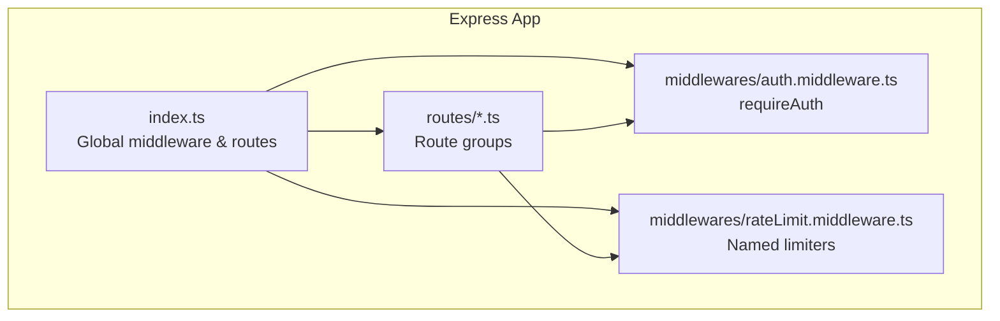
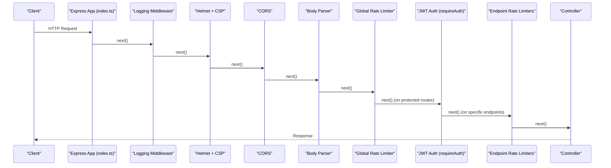
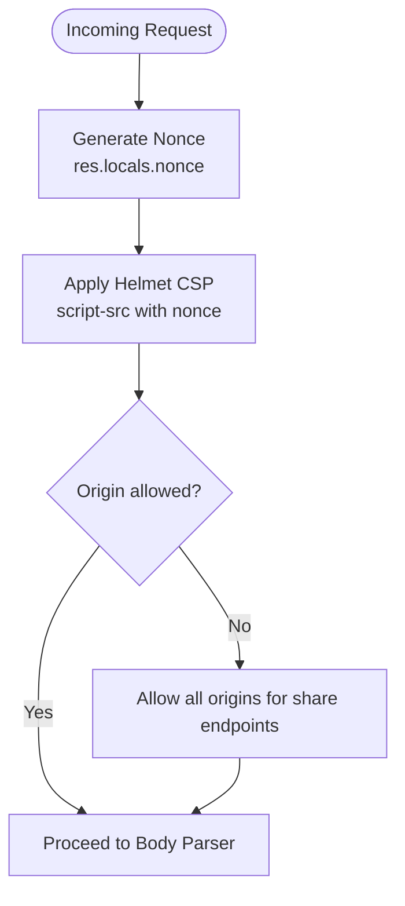
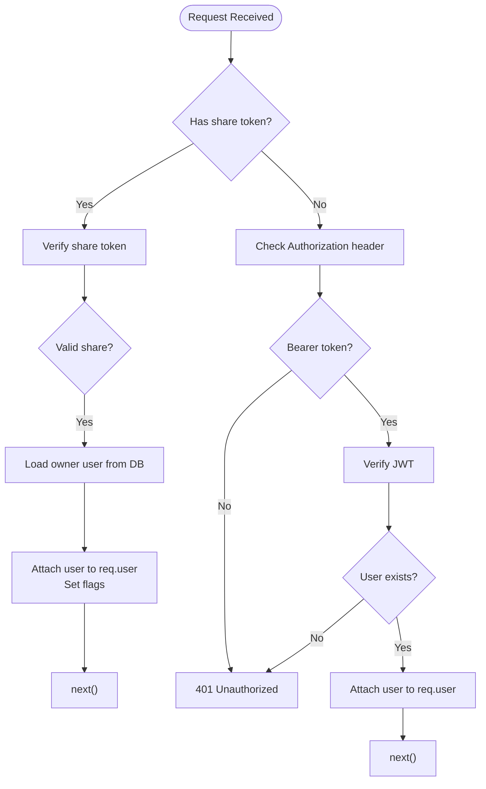
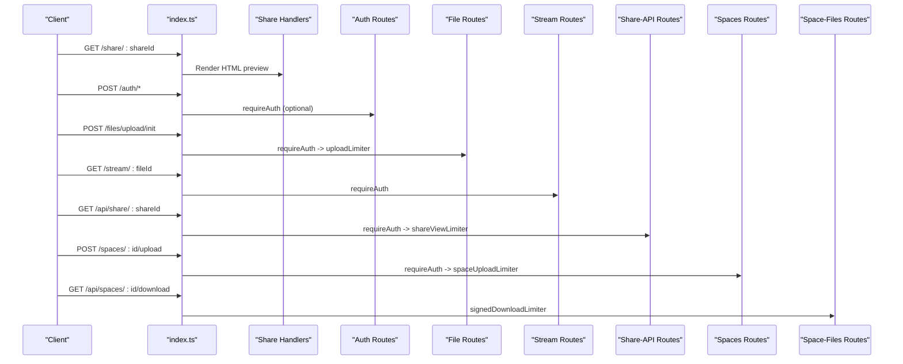
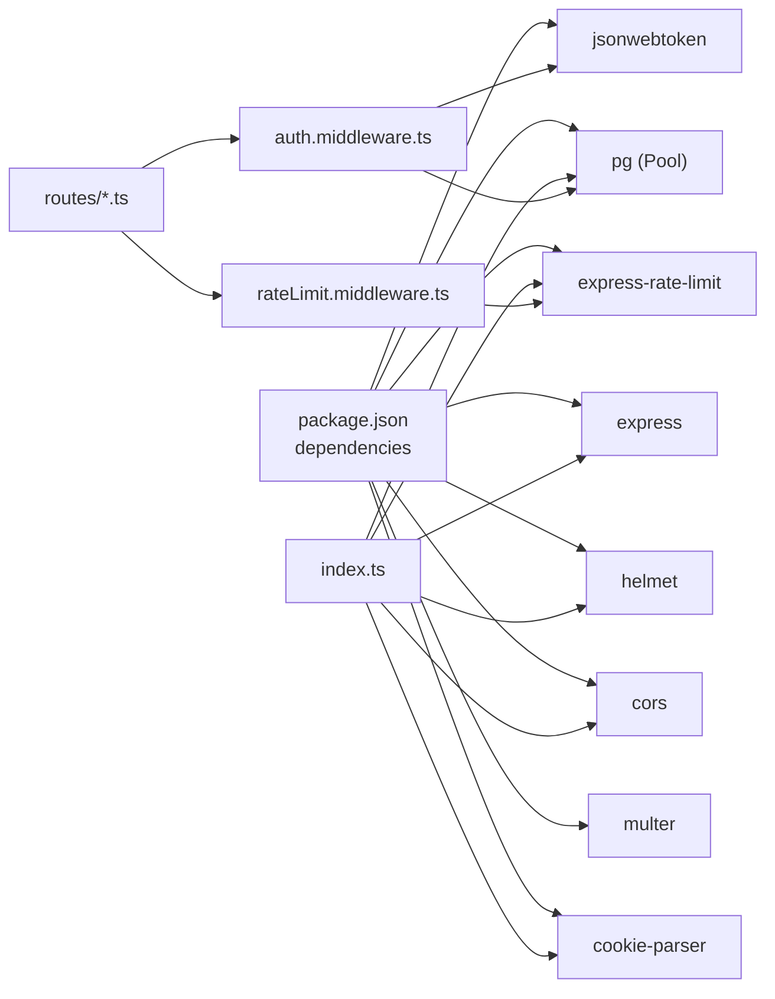

# Middleware Stack and Processing

<cite>
**Referenced Files in This Document**
- [index.ts](file://server/src/index.ts)
- [auth.middleware.ts](file://server/src/middlewares/auth.middleware.ts)
- [rateLimit.middleware.ts](file://server/src/middlewares/rateLimit.middleware.ts)
- [auth.routes.ts](file://server/src/routes/auth.routes.ts)
- [file.routes.ts](file://server/src/routes/file.routes.ts)
- [share.routes.ts](file://server/src/routes/share.routes.ts)
- [share-api.routes.ts](file://server/src/routes/share-api.routes.ts)
- [spaces.routes.ts](file://server/src/routes/spaces.routes.ts)
- [space-files.routes.ts](file://server/src/routes/space-files.routes.ts)
- [stream.routes.ts](file://server/src/routes/stream.routes.ts)
- [db.ts](file://server/src/config/db.ts)
- [logger.ts](file://server/src/utils/logger.ts)
- [package.json](file://server/package.json)
</cite>

## Table of Contents
1. [Introduction](#introduction)
2. [Project Structure](#project-structure)
3. [Core Components](#core-components)
4. [Architecture Overview](#architecture-overview)
5. [Detailed Component Analysis](#detailed-component-analysis)
6. [Dependency Analysis](#dependency-analysis)
7. [Performance Considerations](#performance-considerations)
8. [Troubleshooting Guide](#troubleshooting-guide)
9. [Conclusion](#conclusion)

## Introduction
This document explains the Express.js middleware stack and request processing pipeline for the server module. It focuses on:
- Security middleware: Helmet for security headers, dynamic CORS origin handling, and Content Security Policy (CSP) with nonce injection.
- Rate limiting: Global, endpoint-specific, and user-scoped strategies.
- Authentication: JWT validation with a special bypass for share-link tokens.
- Request parsing: JSON, URL-encoded, and cookies.
- Global error handling and graceful shutdown.
- Execution order, configuration options, performance characteristics, and security implications.
- Guidelines for building custom middleware and integrating third-party middleware consistently.

## Project Structure
The server entry initializes middleware globally, mounts route groups, and defines a global error handler. Route modules apply middleware locally (e.g., JWT auth and rate limiters) to protect endpoints.

**Diagram sources**
- [index.ts](file://server/src/index.ts#L25-L315)
- [auth.middleware.ts](file://server/src/middlewares/auth.middleware.ts#L1-L82)
- [rateLimit.middleware.ts](file://server/src/middlewares/rateLimit.middleware.ts#L1-L47)
- [auth.routes.ts](file://server/src/routes/auth.routes.ts#L1-L13)
- [file.routes.ts](file://server/src/routes/file.routes.ts#L1-L118)
- [share-api.routes.ts](file://server/src/routes/share-api.routes.ts#L1-L21)
- [spaces.routes.ts](file://server/src/routes/spaces.routes.ts#L1-L35)
- [space-files.routes.ts](file://server/src/routes/space-files.routes.ts#L1-L10)
- [stream.routes.ts](file://server/src/routes/stream.routes.ts#L1-L26)

**Section sources**
- [index.ts](file://server/src/index.ts#L25-L315)
- [auth.routes.ts](file://server/src/routes/auth.routes.ts#L1-L13)
- [file.routes.ts](file://server/src/routes/file.routes.ts#L1-L118)
- [share-api.routes.ts](file://server/src/routes/share-api.routes.ts#L1-L21)
- [spaces.routes.ts](file://server/src/routes/spaces.routes.ts#L1-L35)
- [space-files.routes.ts](file://server/src/routes/space-files.routes.ts#L1-L10)
- [stream.routes.ts](file://server/src/routes/stream.routes.ts#L1-L26)

## Core Components
- Request logging and timing middleware
- Trust proxy configuration for cloud platforms
- CSP with nonce injection and Helmet
- Dynamic CORS with origin allowlist and credential support
- Body parsing for JSON, URL-encoded, and cookies
- Global and endpoint-specific rate limiters
- JWT-based authentication with share-link token bypass
- Global error handler and uncaught exception handling
- Health check and root route for platform compatibility

**Section sources**
- [index.ts](file://server/src/index.ts#L29-L41)
- [index.ts](file://server/src/index.ts#L43-L44)
- [index.ts](file://server/src/index.ts#L46-L61)
- [index.ts](file://server/src/index.ts#L63-L77)
- [index.ts](file://server/src/index.ts#L79-L83)
- [index.ts](file://server/src/index.ts#L85-L98)
- [index.ts](file://server/src/index.ts#L100-L108)
- [auth.middleware.ts](file://server/src/middlewares/auth.middleware.ts#L19-L81)
- [index.ts](file://server/src/index.ts#L238-L249)
- [index.ts](file://server/src/index.ts#L222-L236)

## Architecture Overview
The middleware stack is layered to enforce security, parse requests, apply rate limits, and authenticate users before reaching route handlers.

**Diagram sources**
- [index.ts](file://server/src/index.ts#L29-L98)
- [auth.middleware.ts](file://server/src/middlewares/auth.middleware.ts#L19-L81)
- [rateLimit.middleware.ts](file://server/src/middlewares/rateLimit.middleware.ts#L1-L47)
- [auth.routes.ts](file://server/src/routes/auth.routes.ts#L1-L13)
- [file.routes.ts](file://server/src/routes/file.routes.ts#L55-L81)
- [share-api.routes.ts](file://server/src/routes/share-api.routes.ts#L10-L20)
- [spaces.routes.ts](file://server/src/routes/spaces.routes.ts#L12-L32)

## Detailed Component Analysis

### Security Middleware Stack
- Nonce injection: A random nonce is generated per request and attached to response locals for CSP script-src directive.
- Helmet: Applies default security headers and overrides CSP directives to include a per-request nonce and restrict inline styles to whitelisted sources.
- Dynamic CORS: Origin allowlist is loaded from environment variables; requests without an origin (e.g., mobile clients) are permitted. Credentials are enabled.

**Diagram sources**
- [index.ts](file://server/src/index.ts#L46-L61)
- [index.ts](file://server/src/index.ts#L63-L77)

**Section sources**
- [index.ts](file://server/src/index.ts#L46-L61)
- [index.ts](file://server/src/index.ts#L63-L77)

### Authentication Middleware
- Validates Authorization header for JWT bearer tokens.
- Supports a share-link token bypass for public endpoints (download, thumbnail, stream) when a valid token is provided.
- On successful validation, decorates the request with user identity and flags for downstream controllers.

**Diagram sources**
- [auth.middleware.ts](file://server/src/middlewares/auth.middleware.ts#L19-L81)

**Section sources**
- [auth.middleware.ts](file://server/src/middlewares/auth.middleware.ts#L19-L81)

### Request Parsing Middleware
- JSON and URL-encoded bodies with a 10 MB limit.
- Cookie parsing with a configurable secret from environment variables.

**Section sources**
- [index.ts](file://server/src/index.ts#L79-L83)

### Rate Limiting Strategies
- Global limiter: 15-minute window, 1000 requests, skips health checks, applies to most routes.
- Auth limiter: 10-minute window, 15 attempts, applied to the auth route group.
- Endpoint-specific limiters:
  - Share password attempts, views, and downloads.
  - Shared spaces: password, views, uploads.
  - Signed downloads.
  - File uploads: separate upload and chunk limiters keyed by user ID when available.
- Key generation strategies:
  - User ID-based key for authenticated upload endpoints.
  - Fallback to IP-based key otherwise.

```mermaid
classDiagram
class GlobalLimiter {
+windowMs : number
+max : number
+skip(path)
+message
}
class AuthLimiter {
+windowMs : number
+max : number
+message
}
class SharePasswordLimiter {
+windowMs : number
+max : number
+message
}
class ShareViewLimiter {
+windowMs : number
+max : number
+message
}
class ShareDownloadLimiter {
+windowMs : number
+max : number
+message
}
class SpacePasswordLimiter {
+windowMs : number
+max : number
+message
}
class SpaceViewLimiter {
+windowMs : number
+max : number
+message
}
class SpaceUploadLimiter {
+windowMs : number
+max : number
+message
}
class SignedDownloadLimiter {
+windowMs : number
+max : number
+message
}
class UploadLimiter {
+windowMs : number
+max : number
+keyGenerator(req)
+message
}
class ChunkLimiter {
+windowMs : number
+max : number
+message
}
```

**Diagram sources**
- [index.ts](file://server/src/index.ts#L85-L98)
- [index.ts](file://server/src/index.ts#L100-L105)
- [rateLimit.middleware.ts](file://server/src/middlewares/rateLimit.middleware.ts#L1-L47)
- [file.routes.ts](file://server/src/routes/file.routes.ts#L60-L81)

**Section sources**
- [index.ts](file://server/src/index.ts#L85-L98)
- [index.ts](file://server/src/index.ts#L100-L105)
- [rateLimit.middleware.ts](file://server/src/middlewares/rateLimit.middleware.ts#L1-L47)
- [file.routes.ts](file://server/src/routes/file.routes.ts#L60-L81)

### Request/Response Handling and Route Integration
- Route groups apply middleware locally:
  - File routes: JWT auth applied to the entire group; upload endpoints use user-scoped keys.
  - Stream routes: JWT auth applied to the entire group.
  - Share API routes: JWT auth plus share-specific rate limiters.
  - Spaces routes: JWT auth plus space-specific rate limiters.
  - Space files routes: signed-download limiter.
- Public share rendering and legacy token redirection are handled at the app level.

**Diagram sources**
- [index.ts](file://server/src/index.ts#L112-L220)
- [auth.routes.ts](file://server/src/routes/auth.routes.ts#L1-L13)
- [file.routes.ts](file://server/src/routes/file.routes.ts#L15-L25)
- [file.routes.ts](file://server/src/routes/file.routes.ts#L83-L88)
- [stream.routes.ts](file://server/src/routes/stream.routes.ts#L12-L17)
- [share-api.routes.ts](file://server/src/routes/share-api.routes.ts#L9-L20)
- [spaces.routes.ts](file://server/src/routes/spaces.routes.ts#L11-L32)
- [space-files.routes.ts](file://server/src/routes/space-files.routes.ts#L1-L10)

**Section sources**
- [index.ts](file://server/src/index.ts#L112-L220)
- [auth.routes.ts](file://server/src/routes/auth.routes.ts#L1-L13)
- [file.routes.ts](file://server/src/routes/file.routes.ts#L15-L25)
- [file.routes.ts](file://server/src/routes/file.routes.ts#L83-L88)
- [stream.routes.ts](file://server/src/routes/stream.routes.ts#L12-L17)
- [share-api.routes.ts](file://server/src/routes/share-api.routes.ts#L9-L20)
- [spaces.routes.ts](file://server/src/routes/spaces.routes.ts#L11-L32)
- [space-files.routes.ts](file://server/src/routes/space-files.routes.ts#L1-L10)

### Global Error Handling and Logging
- Centralized error handler logs structured errors and prevents duplicate headers.
- Special handling for file size limits from file upload middleware.
- Uncaught exceptions and rejections are logged; the process continues to allow platform restart.

**Section sources**
- [index.ts](file://server/src/index.ts#L238-L249)
- [index.ts](file://server/src/index.ts#L264-L272)
- [logger.ts](file://server/src/utils/logger.ts#L1-L27)

## Dependency Analysis
- Express and middleware libraries are declared in package dependencies.
- Database connection pool is configured with environment-driven SSL and connection limits.
- Logger utility provides structured logging for HTTP and process events.

**Diagram sources**
- [package.json](file://server/package.json#L19-L40)
- [index.ts](file://server/src/index.ts#L1-L11)
- [auth.middleware.ts](file://server/src/middlewares/auth.middleware.ts#L1-L6)
- [rateLimit.middleware.ts](file://server/src/middlewares/rateLimit.middleware.ts#L1-L2)
- [db.ts](file://server/src/config/db.ts#L1-L61)

**Section sources**
- [package.json](file://server/package.json#L19-L40)
- [db.ts](file://server/src/config/db.ts#L27-L37)

## Performance Considerations
- Trust proxy is enabled to ensure accurate client IP detection behind load balancers/proxies.
- Database pool limits concurrent connections and releases idle connections promptly to reduce memory pressure on constrained platforms.
- Rate limit windows and thresholds are tuned to accommodate batch operations (e.g., chunked uploads) while preventing abuse.
- Body parsers use modest limits appropriate for the application’s workload.

Recommendations:
- Monitor rate limiter hits and adjust thresholds per deployment environment.
- Consider Redis-backed stores for distributed rate limiting if scaling horizontally.
- Validate upload limits and chunk sizes against storage and network constraints.

**Section sources**
- [index.ts](file://server/src/index.ts#L43-L44)
- [db.ts](file://server/src/config/db.ts#L22-L37)
- [index.ts](file://server/src/index.ts#L85-L98)
- [file.routes.ts](file://server/src/routes/file.routes.ts#L60-L81)

## Troubleshooting Guide
Common issues and resolutions:
- Unauthorized responses:
  - Ensure Authorization header is present and formatted as Bearer <token>.
  - Confirm JWT_SECRET is set and valid.
- Share link access:
  - Verify share token validity and that the route matches public endpoints (download, thumbnail, stream).
- CORS failures:
  - Confirm ALLOWED_ORIGINS includes the requesting origin; note that share endpoints allow all origins.
- Rate limit exceeded:
  - Review configured windows and max values; consider increasing limits for legitimate batch operations.
- File upload errors:
  - Check file size limits and multipart configuration; the global error handler surfaces file size errors distinctly.
- Health checks:
  - The /health endpoint is exempt from global rate limiting and returns service metrics.

Operational logging:
- HTTP request completion logs include method, URL, status, duration, and client IP.
- Process-level errors and unhandled rejections are captured for diagnostics.

**Section sources**
- [auth.middleware.ts](file://server/src/middlewares/auth.middleware.ts#L54-L80)
- [index.ts](file://server/src/index.ts#L63-L77)
- [index.ts](file://server/src/index.ts#L85-L98)
- [index.ts](file://server/src/index.ts#L238-L249)
- [index.ts](file://server/src/index.ts#L222-L236)
- [logger.ts](file://server/src/utils/logger.ts#L1-L27)

## Conclusion
The middleware stack enforces strong security defaults, robust authentication, and thoughtful rate limiting tailored to both protected and public endpoints. By combining global middleware with targeted route-level protections, the system balances usability, performance, and resilience. Adhering to the documented patterns ensures consistency when adding custom middleware or integrating third-party packages.