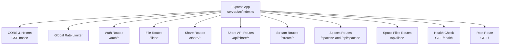
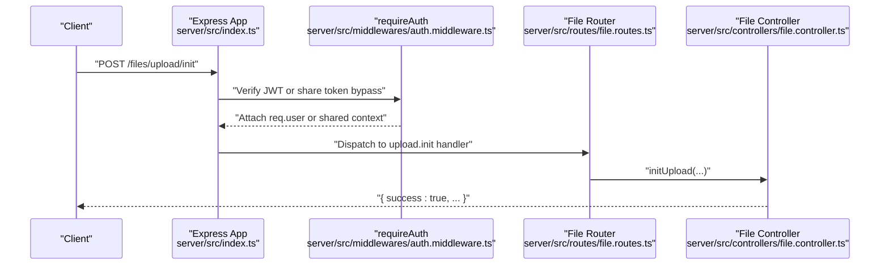
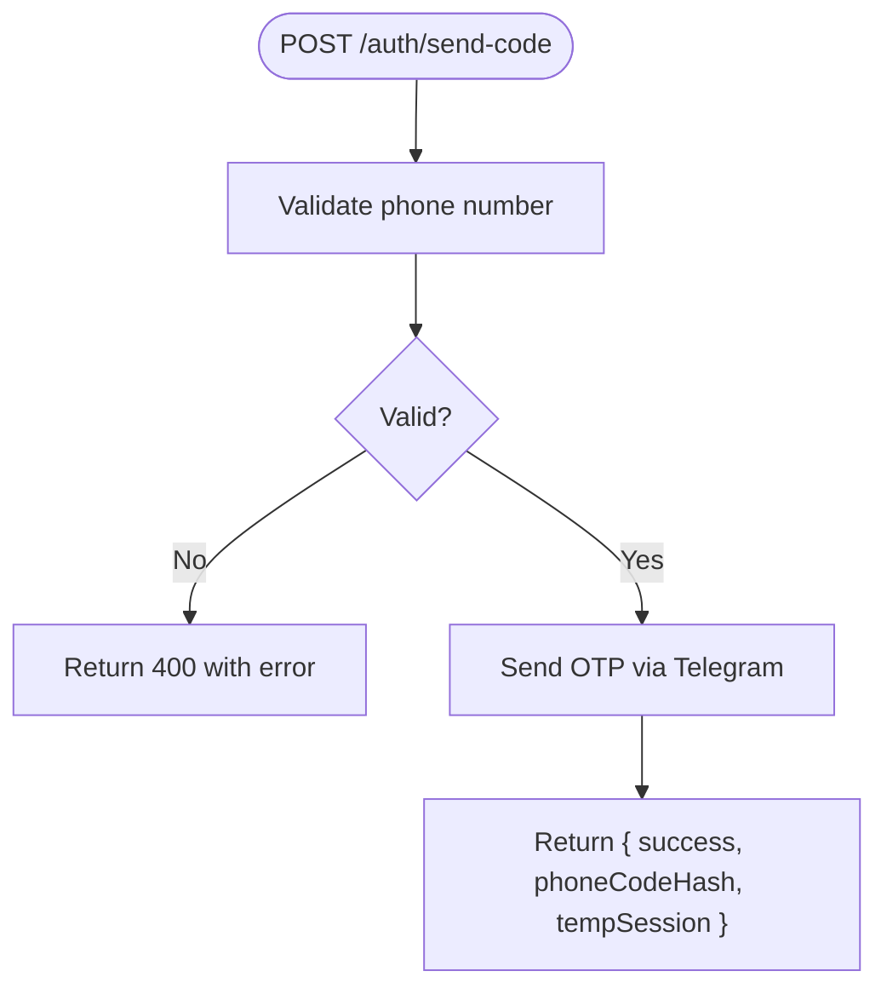
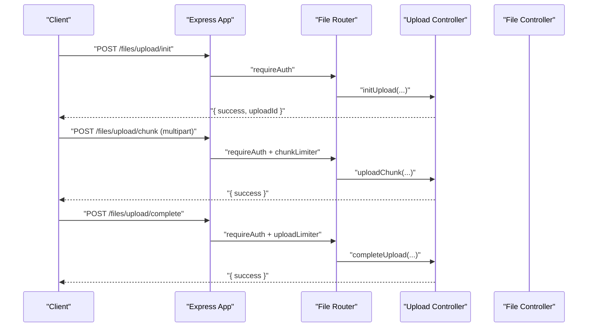
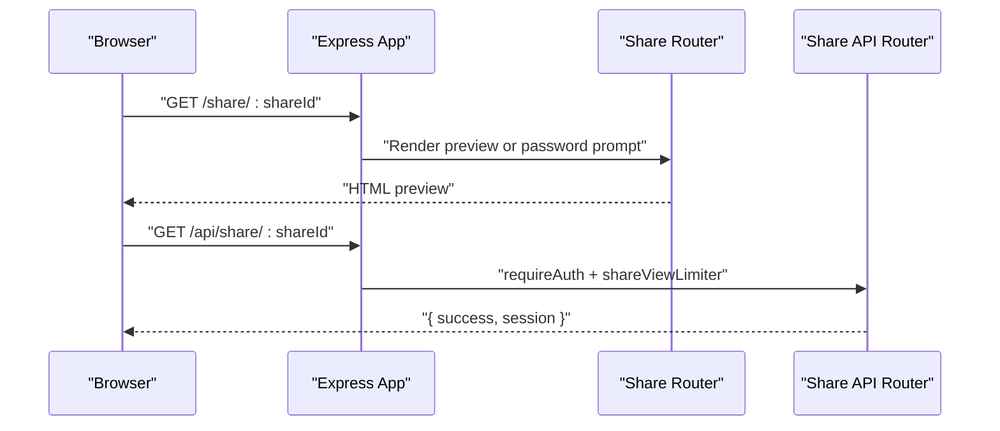
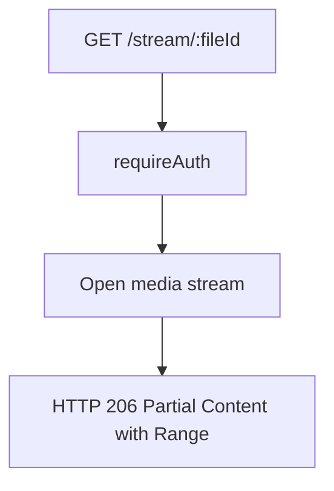
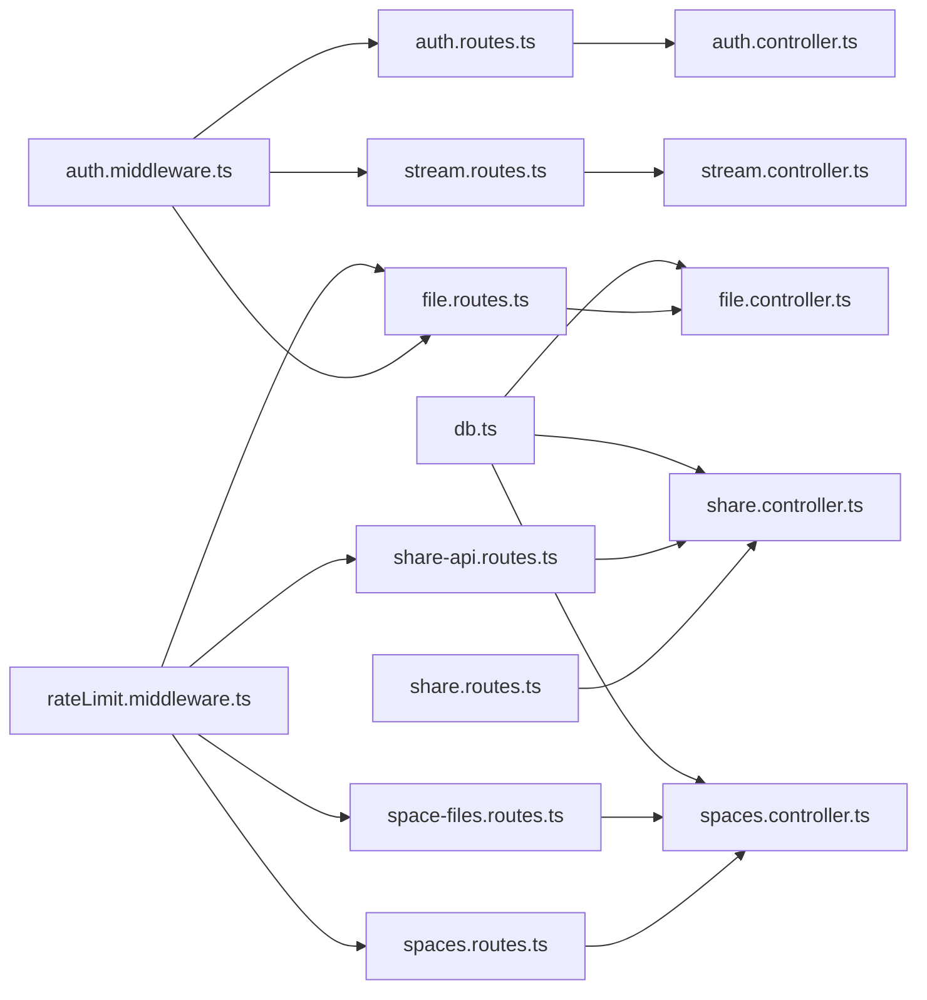

# Route Organization and Endpoints

<cite>
**Referenced Files in This Document**
- [server/src/index.ts](file://server/src/index.ts)
- [server/src/routes/auth.routes.ts](file://server/src/routes/auth.routes.ts)
- [server/src/routes/file.routes.ts](file://server/src/routes/file.routes.ts)
- [server/src/routes/share.routes.ts](file://server/src/routes/share.routes.ts)
- [server/src/routes/share-api.routes.ts](file://server/src/routes/share-api.routes.ts)
- [server/src/routes/stream.routes.ts](file://server/src/routes/stream.routes.ts)
- [server/src/routes/spaces.routes.ts](file://server/src/routes/spaces.routes.ts)
- [server/src/routes/space-files.routes.ts](file://server/src/routes/space-files.routes.ts)
- [server/src/middlewares/auth.middleware.ts](file://server/src/middlewares/auth.middleware.ts)
- [server/src/middlewares/rateLimit.middleware.ts](file://server/src/middlewares/rateLimit.middleware.ts)
- [server/src/controllers/auth.controller.ts](file://server/src/controllers/auth.controller.ts)
- [server/src/controllers/file.controller.ts](file://server/src/controllers/file.controller.ts)
- [server/src/config/db.ts](file://server/src/config/db.ts)
- [server/package.json](file://server/package.json)
</cite>

## Table of Contents
1. [Introduction](#introduction)
2. [Project Structure](#project-structure)
3. [Core Components](#core-components)
4. [Architecture Overview](#architecture-overview)
5. [Detailed Component Analysis](#detailed-component-analysis)
6. [Dependency Analysis](#dependency-analysis)
7. [Performance Considerations](#performance-considerations)
8. [Troubleshooting Guide](#troubleshooting-guide)
9. [Conclusion](#conclusion)
10. [Appendices](#appendices)

## Introduction
This document explains the route organization and endpoint structure for the Express.js backend. It covers modular route grouping under /auth, /files, /share, /api/share, /stream, /spaces, /api/spaces, and /api/files, detailing endpoint definitions, URL patterns, parameter handling, middleware application, and response formatting. It also addresses security, CORS behavior, backward compatibility, and provides guidelines for extending the route surface while maintaining RESTful consistency.

## Project Structure
The server initializes Express, applies security and parsing middleware, registers route groups, and exposes health checks. Route modules are grouped by domain and mounted under specific base paths. Authentication and rate-limiting middleware are applied at both route and endpoint levels depending on scope.

**Diagram sources**
- [server/src/index.ts](file://server/src/index.ts#L107-L236)

**Section sources**
- [server/src/index.ts](file://server/src/index.ts#L1-L315)

## Core Components
- Route registration pattern: The server mounts route modules under base paths and applies middleware at mount-time or endpoint-time. For example, authentication routes are mounted with a per-endpoint rate limiter, while file routes apply a global auth middleware to all endpoints.
- Endpoint naming conventions: Endpoints use resource-based nouns and actions (e.g., /upload/init, /upload/chunk, /:id/download). Query parameters are used for filtering and pagination (e.g., limit, offset, folder_id).
- Parameter handling: Path parameters (e.g., :id, :fileId, :shareId) and query parameters are extracted and validated in controllers. Some endpoints accept multipart/form-data for uploads.
- Response formatting: All endpoints return a consistent envelope: { success: boolean, ...data }. Errors are returned with appropriate HTTP status codes and an error field.

Examples of route definitions and usage:
- Authentication: POST /auth/send-code, POST /auth/verify-code, GET /auth/me, DELETE /auth/account
- Files: POST /files/upload/init, POST /files/upload/chunk, POST /files/upload/complete, GET /files/:id/download, PATCH /files/:id/star, GET /files/search
- Sharing: POST /share/, GET /share/:id, DELETE /share/:id, POST /api/share/create, GET /api/share/:shareId
- Streaming: GET /stream/:fileId, GET /stream/:fileId/status
- Spaces: POST /spaces/create, GET /spaces/:id, POST /spaces/:id/validate-password, GET /spaces/:id/files, POST /spaces/:id/upload
- Space files: GET /api/files/:id/download

**Section sources**
- [server/src/index.ts](file://server/src/index.ts#L107-L236)
- [server/src/routes/auth.routes.ts](file://server/src/routes/auth.routes.ts#L1-L13)
- [server/src/routes/file.routes.ts](file://server/src/routes/file.routes.ts#L1-L118)
- [server/src/routes/share.routes.ts](file://server/src/routes/share.routes.ts#L1-L12)
- [server/src/routes/share-api.routes.ts](file://server/src/routes/share-api.routes.ts#L1-L21)
- [server/src/routes/stream.routes.ts](file://server/src/routes/stream.routes.ts#L1-L26)
- [server/src/routes/spaces.routes.ts](file://server/src/routes/spaces.routes.ts#L1-L35)
- [server/src/routes/space-files.routes.ts](file://server/src/routes/space-files.routes.ts#L1-L10)

## Architecture Overview
The routing architecture follows a layered approach:
- Application bootstrap sets up logging, security headers, CORS, body parsing, and global rate limiting.
- Route modules encapsulate endpoints and apply domain-specific middleware (authentication and rate limits).
- Controllers handle business logic, interact with the database, and return standardized responses.
- Shared middleware enforces authentication and rate limits across endpoints.

**Diagram sources**
- [server/src/index.ts](file://server/src/index.ts#L107-L108)
- [server/src/middlewares/auth.middleware.ts](file://server/src/middlewares/auth.middleware.ts#L19-L81)
- [server/src/routes/file.routes.ts](file://server/src/routes/file.routes.ts#L84-L84)
- [server/src/controllers/file.controller.ts](file://server/src/controllers/file.controller.ts#L1-L200)

## Detailed Component Analysis

### Authentication Routes (/auth/*)
- Purpose: Phone-based OTP login, user info retrieval, and account deletion.
- Endpoints:
  - POST /auth/send-code: Initiates OTP delivery.
  - POST /auth/verify-code: Verifies OTP and issues JWT.
  - GET /auth/me: Returns current user profile.
  - DELETE /auth/account: Deletes the user account (protected).
- Middleware:
  - requireAuth is applied to GET /auth/me and DELETE /auth/account.
- Response format: Consistent envelope with success flag and either user data or error message.

**Diagram sources**
- [server/src/controllers/auth.controller.ts](file://server/src/controllers/auth.controller.ts#L9-L32)

**Section sources**
- [server/src/routes/auth.routes.ts](file://server/src/routes/auth.routes.ts#L1-L13)
- [server/src/controllers/auth.controller.ts](file://server/src/controllers/auth.controller.ts#L1-L96)
- [server/src/middlewares/auth.middleware.ts](file://server/src/middlewares/auth.middleware.ts#L19-L81)

### File Management Routes (/files/*)
- Purpose: File lifecycle, folder operations, tagging, starred items, trash, search, stats, and uploads.
- Endpoints:
  - GET /files/stats, GET /files/activity
  - GET /files/search
  - GET /files/tags, GET /files/tags/:tag
  - GET /files/starred, PATCH /files/:id/star
  - GET /files/trash, PATCH /files/:id/trash, PATCH /files/:id/restore, DELETE /files/trash
  - POST /files/folder, GET /files/folders, PATCH /files/folder/:id, DELETE /files/folder/:id
  - POST /files/upload/init, POST /files/upload/chunk, POST /files/upload/complete, POST /files/upload/cancel, GET /files/upload/status/:uploadId
  - Legacy: POST /files/upload
  - POST /files/bulk
  - GET /files/recent-accessed, POST /files/:id/accessed
  - GET /files/:id/tags, POST /files/:id/tags, DELETE /files/:id/tags/:tag
  - GET /files/:id/details
  - GET /files/:id/download, GET /files/:id/stream, GET /files/:id/thumbnail, PATCH /files/:id, DELETE /files/:id
- Middleware:
  - All endpoints under /files are protected by requireAuth.
  - Upload endpoints use dedicated rate limiters keyed by user ID or IP.
- Parameter handling:
  - Path parameters: :id, :uploadId.
  - Query parameters: limit, offset, folder_id, sort, order, q, type.
  - Multipart form for chunked uploads.

**Diagram sources**
- [server/src/routes/file.routes.ts](file://server/src/routes/file.routes.ts#L55-L81)
- [server/src/middlewares/auth.middleware.ts](file://server/src/middlewares/auth.middleware.ts#L19-L81)

**Section sources**
- [server/src/routes/file.routes.ts](file://server/src/routes/file.routes.ts#L1-L118)
- [server/src/controllers/file.controller.ts](file://server/src/controllers/file.controller.ts#L1-L200)
- [server/src/middlewares/auth.middleware.ts](file://server/src/middlewares/auth.middleware.ts#L19-L81)
- [server/src/middlewares/rateLimit.middleware.ts](file://server/src/middlewares/rateLimit.middleware.ts#L1-L47)

### Sharing Routes (/share/* and /api/share/*)
- Public share rendering: GET /share/:shareId serves a preview page for shared files/folders, with optional password gating and token verification.
- Legacy redirect: GET /share/:legacyToken redirects to the modern share URL if a valid legacy token is provided.
- API endpoints under /api/share:
  - POST /api/share/create (authenticated)
  - POST /api/share/verify-password (rate-limited)
  - GET /api/share/files (rate-limited)
  - GET /api/share/:shareId (rate-limited)
  - GET /api/share/download/:fileId (rate-limited)

**Diagram sources**
- [server/src/index.ts](file://server/src/index.ts#L113-L214)
- [server/src/routes/share-api.routes.ts](file://server/src/routes/share-api.routes.ts#L1-L21)

**Section sources**
- [server/src/index.ts](file://server/src/index.ts#L113-L214)
- [server/src/routes/share.routes.ts](file://server/src/routes/share.routes.ts#L1-L12)
- [server/src/routes/share-api.routes.ts](file://server/src/routes/share-api.routes.ts#L1-L21)
- [server/src/middlewares/rateLimit.middleware.ts](file://server/src/middlewares/rateLimit.middleware.ts#L3-L22)

### Stream Routes (/stream/*)
- Purpose: Progressive media streaming with HTTP Range support and cache/status reporting.
- Endpoints:
  - GET /stream/:fileId (requires auth)
  - GET /stream/:fileId/status
- Middleware:
  - requireAuth applied to all stream endpoints.

**Diagram sources**
- [server/src/routes/stream.routes.ts](file://server/src/routes/stream.routes.ts#L1-L26)
- [server/src/middlewares/auth.middleware.ts](file://server/src/middlewares/auth.middleware.ts#L19-L81)

**Section sources**
- [server/src/routes/stream.routes.ts](file://server/src/routes/stream.routes.ts#L1-L26)
- [server/src/middlewares/auth.middleware.ts](file://server/src/middlewares/auth.middleware.ts#L19-L81)

### Spaces Routes (/spaces/* and /api/spaces/*)
- Purpose: Shared spaces creation, validation, listing, and uploading.
- Endpoints:
  - GET /spaces/ (authenticated)
  - POST /spaces/create (authenticated)
  - GET /spaces/:id (public, rate-limited)
  - POST /spaces/:id/validate-password (rate-limited)
  - GET /spaces/:id/files (public, rate-limited)
  - POST /spaces/:id/upload (rate-limited, multipart)
- Notes:
  - Both /spaces and /api/spaces mount the same router for backward compatibility.

**Section sources**
- [server/src/routes/spaces.routes.ts](file://server/src/routes/spaces.routes.ts#L1-L35)
- [server/src/index.ts](file://server/src/index.ts#L217-L218)
- [server/src/middlewares/rateLimit.middleware.ts](file://server/src/middlewares/rateLimit.middleware.ts#L24-L40)

### Space Files Routes (/api/files/*)
- Purpose: Signed download endpoint for shared space files.
- Endpoints:
  - GET /api/files/:id/download (rate-limited)

**Section sources**
- [server/src/routes/space-files.routes.ts](file://server/src/routes/space-files.routes.ts#L1-L10)
- [server/src/middlewares/rateLimit.middleware.ts](file://server/src/middlewares/rateLimit.middleware.ts#L42-L46)

## Dependency Analysis
- Route-to-controller mapping is explicit in each route module, importing handlers from controllers.
- Middleware dependencies:
  - requireAuth validates JWT or allows share-link token bypass and attaches user context.
  - Rate limiters are exported and applied per-route or per-endpoint.
- Database connectivity is centralized via a PostgreSQL pool configured with environment variables.

**Diagram sources**
- [server/src/routes/auth.routes.ts](file://server/src/routes/auth.routes.ts#L1-L13)
- [server/src/routes/file.routes.ts](file://server/src/routes/file.routes.ts#L1-L118)
- [server/src/routes/share.routes.ts](file://server/src/routes/share.routes.ts#L1-L12)
- [server/src/routes/share-api.routes.ts](file://server/src/routes/share-api.routes.ts#L1-L21)
- [server/src/routes/stream.routes.ts](file://server/src/routes/stream.routes.ts#L1-L26)
- [server/src/routes/spaces.routes.ts](file://server/src/routes/spaces.routes.ts#L1-L35)
- [server/src/routes/space-files.routes.ts](file://server/src/routes/space-files.routes.ts#L1-L10)
- [server/src/middlewares/auth.middleware.ts](file://server/src/middlewares/auth.middleware.ts#L1-L82)
- [server/src/middlewares/rateLimit.middleware.ts](file://server/src/middlewares/rateLimit.middleware.ts#L1-L47)
- [server/src/config/db.ts](file://server/src/config/db.ts#L1-L61)

**Section sources**
- [server/src/index.ts](file://server/src/index.ts#L1-L315)
- [server/src/config/db.ts](file://server/src/config/db.ts#L1-L61)

## Performance Considerations
- Global rate limiting reduces noise and protects endpoints from abuse.
- Endpoint-specific rate limiters (e.g., uploadInit, chunkUpload) scale with workload characteristics.
- Multer destination and size limits control upload overhead.
- Database pool sizing and timeouts are tuned for serverless environments.

[No sources needed since this section provides general guidance]

## Troubleshooting Guide
- CORS behavior:
  - Origins are validated against an allowed list; otherwise, requests without an Origin header are allowed. Share-related endpoints intentionally relax origin checks to support external embeds.
- Authentication failures:
  - Missing or malformed Authorization header yields 401.
  - Invalid JWT or missing user in DB yields 401.
  - Share-link token bypass requires a valid token and matching share record.
- Upload issues:
  - Multer file size errors return 413 with a structured error.
  - Chunked upload endpoints enforce per-user or per-IP rate limits.
- Health and root:
  - GET /health returns service metrics.
  - GET / returns a simple OK payload to prevent cold-start probes from failing.

**Section sources**
- [server/src/index.ts](file://server/src/index.ts#L63-L77)
- [server/src/middlewares/auth.middleware.ts](file://server/src/middlewares/auth.middleware.ts#L54-L81)
- [server/src/routes/file.routes.ts](file://server/src/routes/file.routes.ts#L55-L81)
- [server/src/index.ts](file://server/src/index.ts#L222-L236)

## Conclusion
The route organization cleanly separates concerns by domain, applies authentication and rate limiting consistently, and maintains backward compatibility through dual mounts and legacy redirects. The standardized response envelope and explicit parameter handling improve reliability and developer experience. Following the documented patterns ensures new endpoints remain consistent and secure.

[No sources needed since this section summarizes without analyzing specific files]

## Appendices

### Guidelines for Adding New Routes
- Choose the appropriate base path (/auth, /files, /share, /api/share, /stream, /spaces, /api/spaces, /api/files).
- Define the route in the relevant router module with clear HTTP verbs and parameter names.
- Apply requireAuth when the endpoint is user-scoped; apply domain-specific rate limiters when appropriate.
- Validate inputs in controllers and return the standard envelope { success, ... }.
- Add tests for happy paths, error conditions, and rate-limit scenarios.

### Security Considerations
- Always protect endpoints requiring user context with requireAuth.
- Use share-link token bypass sparingly and only for read-only operations (download, stream, thumbnail).
- Enforce CORS policies per group; be cautious with public endpoints.
- Rotate secrets and monitor rate-limit triggers.

### CORS Handling Across Groups
- General API routes: Enforced by allowed origins list.
- Share previews and downloads: Relaxed origin checks to support embedding and external clients.

**Section sources**
- [server/src/index.ts](file://server/src/index.ts#L63-L77)
- [server/src/middlewares/auth.middleware.ts](file://server/src/middlewares/auth.middleware.ts#L20-L52)

### Backward Compatibility
- Dual mounts for spaces: /spaces and /api/spaces point to the same router.
- Legacy share redirect: Old tokens are redirected to the new share URL.
- Legacy upload fallback: POST /files/upload remains supported.

**Section sources**
- [server/src/index.ts](file://server/src/index.ts#L217-L218)
- [server/src/index.ts](file://server/src/index.ts#L203-L214)
- [server/src/routes/file.routes.ts](file://server/src/routes/file.routes.ts#L90-L90)

### Environment and Dependencies
- Express version and engine constraints are defined in package.json.
- Database connectivity is configured via DATABASE_URL with SSL tuning for hosted environments.

**Section sources**
- [server/package.json](file://server/package.json#L16-L18)
- [server/src/config/db.ts](file://server/src/config/db.ts#L6-L37)