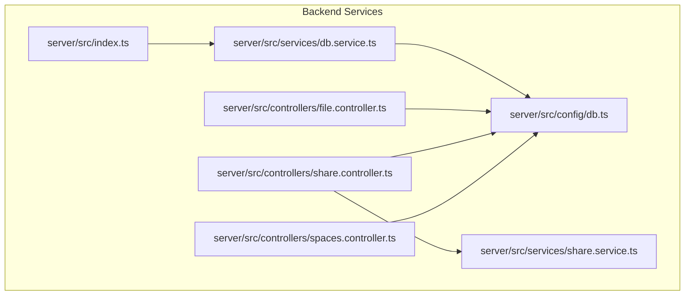
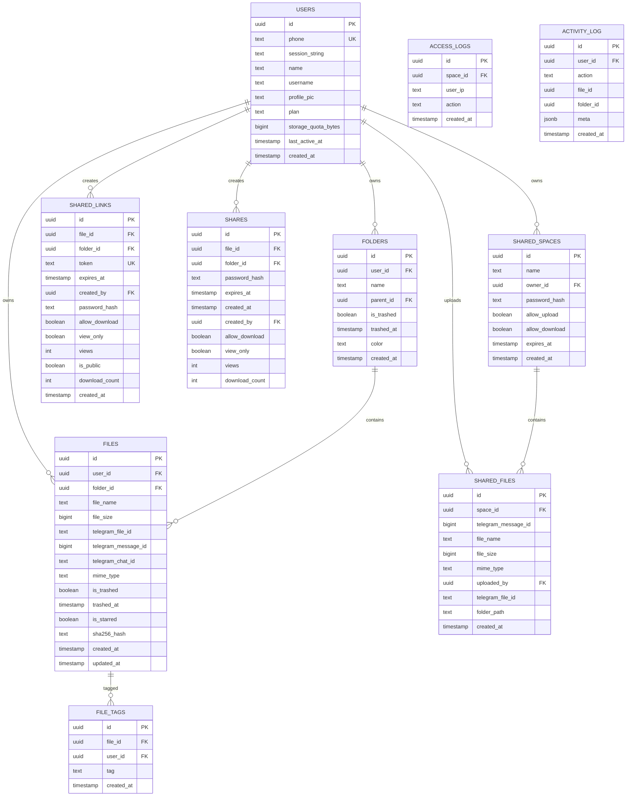
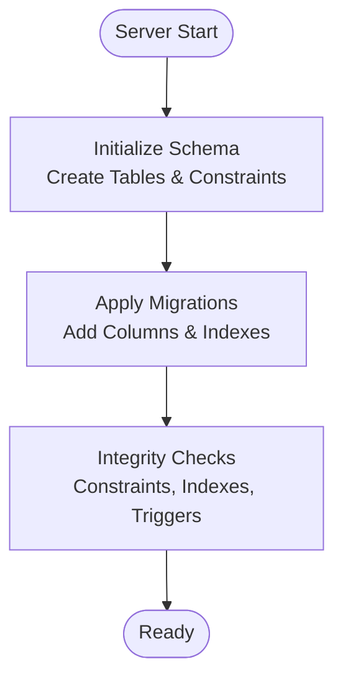
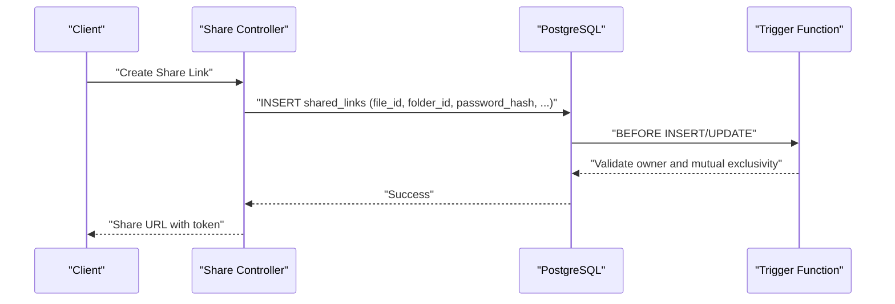
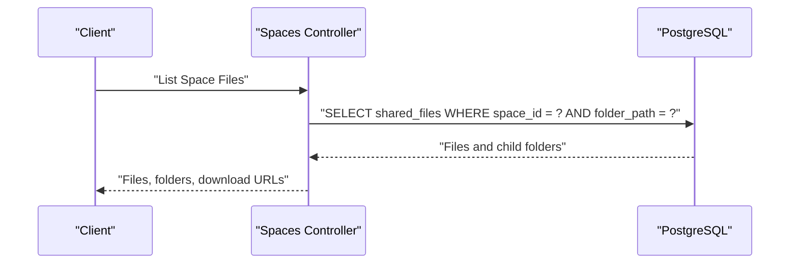
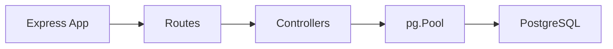

# Database Schema and Design

<cite>
**Referenced Files in This Document**
- [db.service.ts](file://server/src/services/db.service.ts)
- [db.ts](file://server/src/config/db.ts)
- [index.ts](file://server/src/index.ts)
- [file.controller.ts](file://server/src/controllers/file.controller.ts)
- [spaces.controller.ts](file://server/src/controllers/spaces.controller.ts)
- [share.controller.ts](file://server/src/controllers/share.controller.ts)
- [share.service.ts](file://server/src/services/share.service.ts)
- [index.ts](file://server/src/db/index.ts)
</cite>

## Table of Contents
1. [Introduction](#introduction)
2. [Project Structure](#project-structure)
3. [Core Components](#core-components)
4. [Architecture Overview](#architecture-overview)
5. [Detailed Component Analysis](#detailed-component-analysis)
6. [Dependency Analysis](#dependency-analysis)
7. [Performance Considerations](#performance-considerations)
8. [Troubleshooting Guide](#troubleshooting-guide)
9. [Conclusion](#conclusion)
10. [Appendices](#appendices)

## Introduction
This document describes the complete database schema and design for the Teledrive application, focusing on PostgreSQL table relationships, indexing strategy, and migration management. It explains the schema implemented in the backend services, covering user management, file metadata storage, folder organization, shared links, shared spaces, and related audit/logging tables. It also documents foreign key constraints, indexes, triggers, and data validation rules, along with practical guidance for performance, backups, lifecycle management, and security.

## Project Structure
The database schema is initialized and managed by the backend service. The schema creation and migrations are executed at server startup, ensuring the database is ready before serving requests. Controllers interact with the schema to implement file management, sharing, and shared spaces features.

**Diagram sources**
- [index.ts](file://server/src/index.ts#L11-L11)
- [db.service.ts](file://server/src/services/db.service.ts#L3-L137)
- [db.ts](file://server/src/config/db.ts#L27-L37)
- [file.controller.ts](file://server/src/controllers/file.controller.ts#L5-L5)
- [share.controller.ts](file://server/src/controllers/share.controller.ts#L3-L3)
- [spaces.controller.ts](file://server/src/controllers/spaces.controller.ts#L8-L8)
- [share.service.ts](file://server/src/services/share.service.ts#L33-L34)

**Section sources**
- [index.ts](file://server/src/index.ts#L295-L312)
- [db.service.ts](file://server/src/services/db.service.ts#L3-L137)
- [db.ts](file://server/src/config/db.ts#L27-L37)

## Core Components
This section outlines the core database schema and its evolution through migrations. The schema includes:
- Users: user account and profile data
- Folders: hierarchical organization under users
- Files: metadata and Telegram references
- Shared Links: public/private sharing entries
- Shares: internal sharing records
- Shared Spaces: collaborative spaces with permissions and access logs
- Access Logs: audit trail for shared spaces
- Activity Log: user activity tracking
- File Tags: tagging files per user

Key design characteristics:
- UUID primary keys for most tables
- Foreign keys with cascading deletes where appropriate
- Indexes optimized for frequent queries
- Triggers and constraints for data integrity
- Migrations to evolve schema safely

**Section sources**
- [db.service.ts](file://server/src/services/db.service.ts#L7-L137)
- [db.service.ts](file://server/src/services/db.service.ts#L139-L265)

## Architecture Overview
The database architecture centers around user-centric entities and relationships enabling file and folder management, sharing, and collaboration. The following diagram maps the entities and their relationships.

**Diagram sources**
- [db.service.ts](file://server/src/services/db.service.ts#L7-L137)

## Detailed Component Analysis

### Schema Initialization and Migrations
The schema is initialized and migrated at server startup. The initialization script:
- Creates extension for cryptographic functions
- Creates all tables with primary keys, constraints, and defaults
- Applies a series of migrations to add columns, indexes, and constraints
- Enforces critical integrity checks post-migration

Key migration highlights:
- Adds plan, storage quota, last active timestamps to users
- Adds trashed flags and timestamps to files and folders
- Adds starred flag, hashes, updated timestamps, and chat identifiers
- Adds indexes for performance (user/folder, trashed, starred, name search, accessed, hash)
- Adds shared links constraints and triggers to enforce ownership and mutual exclusivity
- Adds unique indexes for shared links targeting files/folders
- Adds triggers and functions to maintain user storage counters
- Adds indexes for shared spaces, shares, shared files, and access logs
- Updates user counters from existing data

**Diagram sources**
- [db.service.ts](file://server/src/services/db.service.ts#L3-L137)
- [db.service.ts](file://server/src/services/db.service.ts#L139-L265)
- [db.service.ts](file://server/src/services/db.service.ts#L295-L305)

**Section sources**
- [db.service.ts](file://server/src/services/db.service.ts#L3-L137)
- [db.service.ts](file://server/src/services/db.service.ts#L139-L265)
- [db.service.ts](file://server/src/services/db.service.ts#L295-L305)

### Users and Profiles
- Stores user identity, session, profile, plan, quotas, and activity timestamps
- Unique phone number constraint ensures single registration per phone
- Default plan and storage quota applied at creation
- Last active timestamp and counters updated via triggers

**Section sources**
- [db.service.ts](file://server/src/services/db.service.ts#L7-L18)
- [db.service.ts](file://server/src/services/db.service.ts#L226-L264)

### Folders and Hierarchical Organization
- Hierarchical tree under users with parent-child relationships
- Trashed flag and timestamps for soft deletion
- Color customization for visual grouping
- Unique constraints enforced at query-time for duplicate names at the same level

**Section sources**
- [db.service.ts](file://server/src/services/db.service.ts#L20-L29)
- [file.controller.ts](file://server/src/controllers/file.controller.ts#L695-L718)

### Files and Metadata
- Links files to users and optional folders
- Stores Telegram identifiers and chat for remote retrieval
- Supports trashed state, starred state, and SHA-256 hashing for deduplication
- Updated and created timestamps track freshness
- Indexes optimize queries by user/folder, trashed, starred, name, accessed, and hash

**Section sources**
- [db.service.ts](file://server/src/services/db.service.ts#L31-L47)
- [db.service.ts](file://server/src/services/db.service.ts#L134-L165)
- [file.controller.ts](file://server/src/controllers/file.controller.ts#L103-L133)

### Shared Links and Access Control
- Single-target sharing for either a file or a folder
- Mutual exclusion enforced by a check constraint
- Owner validation via trigger to ensure created_by matches the owner of the target
- Optional password protection and download/view-only controls
- Unique indexes per target to prevent duplicates

**Diagram sources**
- [db.service.ts](file://server/src/services/db.service.ts#L178-L206)
- [db.service.ts](file://server/src/services/db.service.ts#L267-L274)
- [share.controller.ts](file://server/src/controllers/share.controller.ts#L205-L264)

**Section sources**
- [db.service.ts](file://server/src/services/db.service.ts#L49-L81)
- [db.service.ts](file://server/src/services/db.service.ts#L166-L206)
- [db.service.ts](file://server/src/services/db.service.ts#L267-L274)

### Shares (Internal Sharing)
- Similar structure to shared links but scoped to internal sharing
- Constraints mirror shared links for mutual exclusivity and ownership
- Additional indexes for created_by, file_id, folder_id, and expiration

**Section sources**
- [db.service.ts](file://server/src/services/db.service.ts#L67-L81)
- [db.service.ts](file://server/src/services/db.service.ts#L218-L221)

### Shared Spaces and Collaboration
- Spaces owned by users with optional password, upload/download permissions, and expiration
- Shared files stored with Telegram identifiers and folder path normalization
- Access logs record IP and actions for auditing
- Controllers manage creation, listing, password validation, file listing, upload, and download

**Diagram sources**
- [spaces.controller.ts](file://server/src/controllers/spaces.controller.ts#L297-L355)
- [db.service.ts](file://server/src/services/db.service.ts#L83-L105)

**Section sources**
- [db.service.ts](file://server/src/services/db.service.ts#L83-L105)
- [spaces.controller.ts](file://server/src/controllers/spaces.controller.ts#L161-L194)
- [spaces.controller.ts](file://server/src/controllers/spaces.controller.ts#L297-L355)

### Access Logs and Activity Tracking
- Access logs capture space access events with IP and action
- Activity log captures user actions with optional file/folder context and JSON metadata
- Indexes optimized for chronological queries

**Section sources**
- [db.service.ts](file://server/src/services/db.service.ts#L107-L123)
- [db.service.ts](file://server/src/services/db.service.ts#L216-L225)
- [spaces.controller.ts](file://server/src/controllers/spaces.controller.ts#L97-L106)

### File Tags
- Per-user tags associated with files
- Unique constraint prevents duplicate tags per file per user

**Section sources**
- [db.service.ts](file://server/src/services/db.service.ts#L125-L132)

## Dependency Analysis
The backend depends on a PostgreSQL connection pool configured for production-grade reliability and performance. The pool settings are tuned for Render free tier and Neon serverless environments, including connection limits, timeouts, and SSL handling.

**Diagram sources**
- [db.ts](file://server/src/config/db.ts#L27-L37)
- [index.ts](file://server/src/index.ts#L108-L220)

**Section sources**
- [db.ts](file://server/src/config/db.ts#L27-L37)
- [index.ts](file://server/src/index.ts#L108-L220)

## Performance Considerations
- Indexes
  - Composite indexes on user/folder combinations for file and folder queries
  - Conditional indexes for starred, trashed, and hash-based lookups
  - Unique indexes for shared links per target to prevent duplicates
  - Expiration and owner-based indexes for efficient cleanup and filtering
- Triggers and Functions
  - Storage counter updates on insert/delete/update of files
  - Owner validation for shared links to prevent cross-user sharing
- Query Patterns
  - Controllers use parameterized queries and whitelisted sorts to avoid SQL injection
  - Pagination and sorting are supported for large datasets
- Caching and Streaming
  - Thumbnails and streams leverage disk caching to reduce repeated downloads
  - Range requests are supported for efficient media streaming

[No sources needed since this section provides general guidance]

## Troubleshooting Guide
- Migration Failures
  - Critical migrations are enforced; failures halt startup to preserve integrity
  - Non-critical warnings are logged but do not block startup
- Integrity Checks
  - After migrations, the system verifies presence of constraints, indexes, and triggers
  - Absence of required integrity elements causes startup failure
- Connection Issues
  - Pool emits warnings for unexpected disconnects and timeouts
  - SSL mode is automatically appended for non-local deployments
- Startup Cleanup
  - Orphaned temporary upload directories are cleaned on startup

**Section sources**
- [db.service.ts](file://server/src/services/db.service.ts#L280-L293)
- [db.service.ts](file://server/src/services/db.service.ts#L295-L305)
- [db.ts](file://server/src/config/db.ts#L40-L52)
- [index.ts](file://server/src/index.ts#L295-L293)

## Conclusion
The database schema is designed around user-centric entities with robust foreign key relationships, targeted indexes, and integrity-enforcing constraints and triggers. Migrations evolve the schema safely while preserving data integrity. The controllers implement efficient queries and leverage caching and streaming to optimize performance. Together, these components provide a scalable foundation for file management, sharing, and collaboration.

[No sources needed since this section summarizes without analyzing specific files]

## Appendices

### Index Strategy Summary
- Files
  - user_id, folder_id
  - user_id, is_trashed
  - user_id, is_starred (conditional)
  - user_id, file_name
  - user_id, last_accessed_at (conditional)
  - sha256_hash (conditional)
  - user_id, sha256_hash (conditional)
  - md5_hash (conditional)
  - user_id, md5_hash (conditional)
  - user_id, folder_id, created_at (conditional)
  - user_id, folder_id, file_name (conditional)
  - user_id, folder_id, file_size (conditional)
- Folders
  - user_id, parent_id
  - user_id, is_trashed
- Shared Links
  - token (unique)
  - created_by, file_id (unique, conditional)
  - created_by, folder_id (unique, conditional)
- Shares
  - created_by, created_at
  - folder_id (conditional)
  - file_id (conditional)
  - expires_at
- Shared Spaces
  - owner_id, created_at
  - expires_at
- Shared Files
  - space_id, created_at
  - space_id, folder_path
- Access Logs
  - space_id, created_at
- Activity Log
  - user_id, created_at

**Section sources**
- [db.service.ts](file://server/src/services/db.service.ts#L134-L165)
- [db.service.ts](file://server/src/services/db.service.ts#L216-L225)

### Sample Data Examples
- Users
  - id: UUID
  - phone: unique phone number
  - session_string: Telegram session string
  - plan: default 'free'
  - storage_quota_bytes: default 5 GB
  - last_active_at: timestamp
  - created_at: timestamp
- Folders
  - id: UUID
  - user_id: UUID referencing users
  - name: text
  - parent_id: UUID referencing folders
  - is_trashed: boolean
  - trashed_at: timestamp
  - color: text
  - created_at: timestamp
- Files
  - id: UUID
  - user_id: UUID referencing users
  - folder_id: UUID referencing folders
  - file_name: text
  - file_size: bigint
  - telegram_file_id: text
  - telegram_message_id: bigint
  - telegram_chat_id: text
  - mime_type: text
  - is_trashed: boolean
  - trashed_at: timestamp
  - is_starred: boolean
  - sha256_hash: text
  - created_at: timestamp
  - updated_at: timestamp
- Shared Links
  - id: UUID
  - file_id: UUID referencing files
  - folder_id: UUID referencing folders
  - token: unique hex-encoded token
  - expires_at: timestamp
  - created_by: UUID referencing users
  - password_hash: text
  - allow_download: boolean
  - view_only: boolean
  - views: integer
  - is_public: boolean
  - download_count: integer
  - created_at: timestamp
- Shares
  - id: UUID
  - file_id: UUID referencing files
  - folder_id: UUID referencing folders
  - password_hash: text
  - expires_at: timestamp
  - created_at: timestamp
  - created_by: UUID referencing users
  - allow_download: boolean
  - view_only: boolean
  - views: integer
  - download_count: integer
- Shared Spaces
  - id: UUID
  - name: text
  - owner_id: UUID referencing users
  - password_hash: text
  - allow_upload: boolean
  - allow_download: boolean
  - expires_at: timestamp
  - created_at: timestamp
- Shared Files
  - id: UUID
  - space_id: UUID referencing shared_spaces
  - telegram_message_id: bigint
  - file_name: text
  - file_size: bigint
  - mime_type: text
  - uploaded_by: UUID referencing users
  - telegram_file_id: text
  - folder_path: text
  - created_at: timestamp
- Access Logs
  - id: UUID
  - space_id: UUID referencing shared_spaces
  - user_ip: text
  - action: text
  - created_at: timestamp
- Activity Log
  - id: UUID
  - user_id: UUID referencing users
  - action: text
  - file_id: UUID
  - folder_id: UUID
  - meta: JSONB
  - created_at: timestamp
- File Tags
  - id: UUID
  - file_id: UUID referencing files
  - user_id: UUID referencing users
  - tag: text
  - created_at: timestamp

**Section sources**
- [db.service.ts](file://server/src/services/db.service.ts#L7-L137)

### Migration Procedures
- Run server startup to apply schema and migrations
- Monitor logs for critical migration failures
- Verify integrity checks pass post-migration
- Back up database before major migrations in production

**Section sources**
- [db.service.ts](file://server/src/services/db.service.ts#L276-L305)
- [index.ts](file://server/src/index.ts#L295-L312)

### Backup and Lifecycle Management
- Backups
  - Use managed PostgreSQL provider backups or logical dumps
  - Schedule periodic backups for critical tables (users, files, shared spaces)
- Data Lifecycle
  - Soft-deleted items (trashed) remain in DB until explicit purge
  - Shared links and spaces expire based on timestamps
  - Access logs and activity logs can be rotated periodically
- Security Measures
  - Store hashed passwords for shared links and spaces
  - Use HTTPS and SSL for connections
  - Limit database credentials and network exposure
  - Enforce role-based access and least privilege

[No sources needed since this section provides general guidance]

### Implementation Guidelines
- Schema Evolution
  - Add new columns via migrations with defaults
  - Create indexes alongside new columns for performance
  - Use conditional indexes for filtered queries
- Maintenance
  - Regularly review slow queries and add indexes as needed
  - Monitor storage counters and quotas
  - Rotate secrets and update JWT signing keys periodically
- Integration
  - Controllers must use parameterized queries and validated inputs
  - Respect TTLs for shared links and spaces
  - Ensure cleanup tasks for temporary files and caches

[No sources needed since this section provides general guidance]