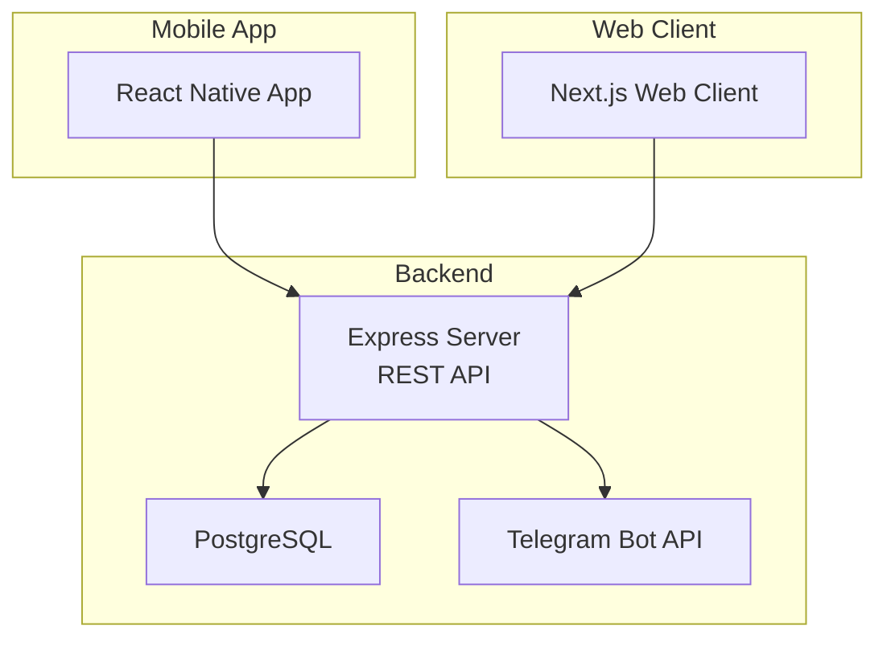
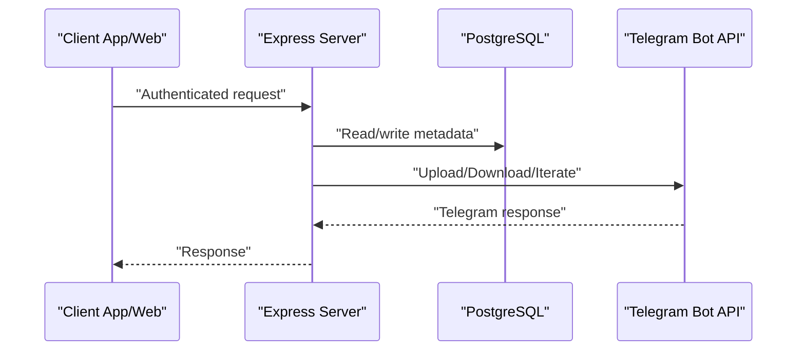
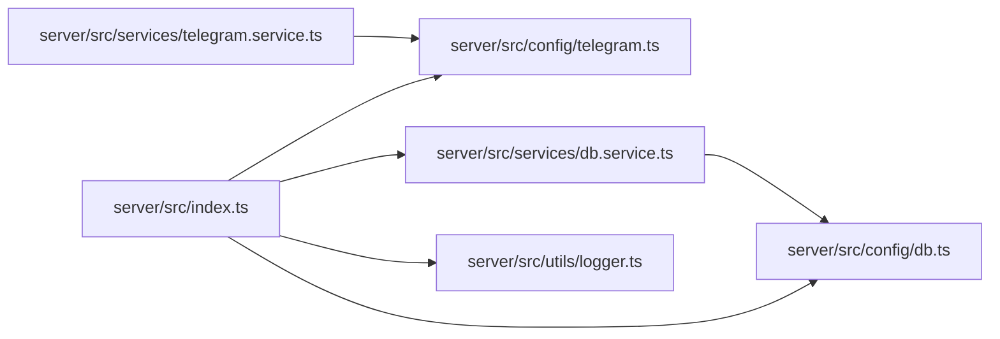

# Deployment and Configuration

<cite>
**Referenced Files in This Document**
- [README.md](file://README.md)
- [Procfile](file://Procfile)
- [package.json](file://package.json)
- [server/package.json](file://server/package.json)
- [.github/workflows/main_axyzcloud.yml](file://.github/workflows/main_axyzcloud.yml)
- [server/src/index.ts](file://server/src/index.ts)
- [server/src/config/db.ts](file://server/src/config/db.ts)
- [server/src/config/telegram.ts](file://server/src/config/telegram.ts)
- [server/src/services/db.service.ts](file://server/src/services/db.service.ts)
- [server/src/services/telegram.service.ts](file://server/src/services/telegram.service.ts)
- [server/src/utils/logger.ts](file://server/src/utils/logger.ts)
- [server/src/generateSession.ts](file://server/src/generateSession.ts)
</cite>

## Table of Contents
1. [Introduction](#introduction)
2. [Project Structure](#project-structure)
3. [Core Components](#core-components)
4. [Architecture Overview](#architecture-overview)
5. [Detailed Component Analysis](#detailed-component-analysis)
6. [Dependency Analysis](#dependency-analysis)
7. [Performance Considerations](#performance-considerations)
8. [Troubleshooting Guide](#troubleshooting-guide)
9. [Conclusion](#conclusion)
10. [Appendices](#appendices)

## Introduction
This document provides a complete guide to deploying and configuring the Teledrive system in production. It covers environment setup, database configuration, Telegram bot/session setup, infrastructure options, containerization strategies, CI/CD pipeline setup, monitoring, maintenance, scaling, backups, SSL/TLS, security hardening, automation, rollbacks, and operational monitoring. The goal is to enable reliable, secure, and scalable deployments across multiple platforms.

## Project Structure
Teledrive consists of:
- A Node.js + Express backend (server)
- A React Native mobile app (app)
- A Next.js web client (web)
- GitHub Actions CI/CD workflow for Azure deployment
- A Procfile for platform deployment (e.g., Heroku-style)

**Diagram sources**
- [server/src/index.ts](file://server/src/index.ts#L1-L315)
- [server/src/config/db.ts](file://server/src/config/db.ts#L1-L61)
- [server/src/config/telegram.ts](file://server/src/config/telegram.ts#L1-L29)

**Section sources**
- [README.md](file://README.md#L225-L246)
- [Procfile](file://Procfile#L1-L2)
- [package.json](file://package.json#L1-L19)
- [server/package.json](file://server/package.json#L1-L57)
- [web/package.json](file://web/package.json#L1-L21)

## Core Components
- Backend server: Express application with routing, middleware, rate limiting, CORS, Helmet security headers, health checks, graceful shutdown, and structured logging.
- Database: PostgreSQL configured via a connection pool with SSL enforcement for hosted providers and optimized for low-memory environments.
- Telegram integration: TelegramClient with persistent client pooling, dynamic client retrieval, OTP generation/sign-in, and progressive file download streaming.
- CI/CD: GitHub Actions workflow targeting Azure Web App, Node.js 20.x, and zipped artifact deployment.

Key deployment-enabling elements:
- Environment variables for database URL, Telegram API credentials, JWT secret, cookie secret, and allowed origins.
- Health endpoint for platform keep-alive and readiness probes.
- Structured logging for observability.
- Graceful shutdown and uncaught exception handling for stability.

**Section sources**
- [server/src/index.ts](file://server/src/index.ts#L25-L315)
- [server/src/config/db.ts](file://server/src/config/db.ts#L1-L61)
- [server/src/config/telegram.ts](file://server/src/config/telegram.ts#L1-L29)
- [server/src/services/telegram.service.ts](file://server/src/services/telegram.service.ts#L1-L260)
- [.github/workflows/main_axyzcloud.yml](file://.github/workflows/main_axyzcloud.yml#L1-L71)

## Architecture Overview
The backend orchestrates:
- Authentication and authorization
- File and folder management
- Streaming and downloads via Telegram
- Shared links and spaces
- Activity logging and metrics

**Diagram sources**
- [server/src/index.ts](file://server/src/index.ts#L107-L221)
- [server/src/config/db.ts](file://server/src/config/db.ts#L1-L61)
- [server/src/services/telegram.service.ts](file://server/src/services/telegram.service.ts#L57-L97)

## Detailed Component Analysis

### Environment Setup and Variables
Required environment variables for production:
- PORT: Listening port for the backend
- DATABASE_URL: PostgreSQL connection string (supports SSL for hosted providers)
- TELEGRAM_API_ID: Telegram API ID
- TELEGRAM_API_HASH: Telegram API Hash
- TELEGRAM_SESSION: Saved Telegram session string
- TELEGRAM_CHANNEL_ID: Private Telegram channel identifier
- JWT_SECRET: Secret for signing tokens
- COOKIE_SECRET: Secret for signing cookies
- ALLOWED_ORIGINS: Comma-separated list of allowed origins (CORS)

Notes:
- DATABASE_URL is validated and SSL enforced for non-local connections.
- The backend sets trust proxy to accommodate cloud platforms.
- Health endpoint supports keep-alive and readiness checks.

**Section sources**
- [README.md](file://README.md#L279-L300)
- [server/src/index.ts](file://server/src/index.ts#L23-L44)
- [server/src/index.ts](file://server/src/index.ts#L63-L77)
- [server/src/index.ts](file://server/src/index.ts#L222-L231)
- [server/src/config/db.ts](file://server/src/config/db.ts#L7-L20)

### Database Configuration
- Connection pool optimized for low-memory environments and hosted providers.
- Automatic SSL mode requirement for non-local connections.
- Schema initialization and migrations executed on startup.
- Integrity checks ensure critical constraints and indexes are present.

Operational guidance:
- Use managed PostgreSQL providers (e.g., Neon, Supabase, or self-hosted).
- Ensure DATABASE_URL includes proper SSL parameters for production.
- Monitor pool usage and adjust max/min idle connections if scaling.

**Section sources**
- [server/src/config/db.ts](file://server/src/config/db.ts#L27-L37)
- [server/src/config/db.ts](file://server/src/config/db.ts#L39-L52)
- [server/src/services/db.service.ts](file://server/src/services/db.service.ts#L3-L137)
- [server/src/services/db.service.ts](file://server/src/services/db.service.ts#L267-L312)

### Telegram Bot and Session Setup
- TelegramClient is created with API ID/Hash and a persisted session.
- Dynamic client retrieval with auto-reconnect and eviction on expiration.
- OTP generation and sign-in flow for user sessions.
- Progressive file download streaming via iterDownload for efficient bandwidth and memory usage.

Setup steps:
- Obtain TELEGRAM_API_ID and TELEGRAM_API_HASH from Telegram.
- Generate a session string using the provided script and store it in TELEGRAM_SESSION.
- Ensure TELEGRAM_CHANNEL_ID points to a private channel owned by the bot.

**Section sources**
- [server/src/config/telegram.ts](file://server/src/config/telegram.ts#L7-L14)
- [server/src/services/telegram.service.ts](file://server/src/services/telegram.service.ts#L57-L97)
- [server/src/services/telegram.service.ts](file://server/src/services/telegram.service.ts#L101-L160)
- [server/src/services/telegram.service.ts](file://server/src/services/telegram.service.ts#L215-L251)
- [server/src/generateSession.ts](file://server/src/generateSession.ts#L1-L36)

### Backend Startup and Lifecycle
- Initializes schema and cleans orphaned upload temp directories.
- Starts HTTP server with structured logging for all requests.
- Implements graceful shutdown and uncaught exception handling.
- Provides health endpoint for platform probes.

**Section sources**
- [server/src/index.ts](file://server/src/index.ts#L274-L312)
- [server/src/index.ts](file://server/src/index.ts#L251-L273)
- [server/src/index.ts](file://server/src/index.ts#L222-L231)
- [server/src/utils/logger.ts](file://server/src/utils/logger.ts#L1-L27)

### CI/CD Pipeline and Deployment Options
- GitHub Actions workflow builds, tests, and deploys to Azure Web App using a zipped artifact.
- Node.js 20.x runtime is specified.
- The repository includes a Procfile indicating a web process that starts the server.

Deployment options:
- Platform-as-a-Service: Railway, Render, Fly.io, VPS.
- Managed databases: Neon, Supabase, or PostgreSQL.
- Mobile builds: EAS build for native binaries.
- Containerization: Use the server’s Dockerfile or containerize the Node.js app with the provided Procfile and package scripts.

**Section sources**
- [.github/workflows/main_axyzcloud.yml](file://.github/workflows/main_axyzcloud.yml#L1-L71)
- [server/package.json](file://server/package.json#L6-L10)
- [Procfile](file://Procfile#L1-L2)
- [README.md](file://README.md#L323-L346)

### Monitoring and Logging
- Structured JSON logging with severity levels and scopes.
- Centralized logging for HTTP requests and process events.
- Health endpoint for uptime and memory metrics.
- Telegram client pool statistics for monitoring.

Recommendations:
- Forward logs to a centralized logging service (e.g., ELK, Loki, DataDog).
- Instrument custom metrics for database pool usage, Telegram client pool, and request latency.
- Set up alerts for error rates, timeouts, and pool exhaustion.

**Section sources**
- [server/src/utils/logger.ts](file://server/src/utils/logger.ts#L1-L27)
- [server/src/index.ts](file://server/src/index.ts#L28-L41)
- [server/src/index.ts](file://server/src/index.ts#L222-L231)
- [server/src/services/telegram.service.ts](file://server/src/services/telegram.service.ts#L255-L260)

### Security Hardening
- Helmet CSP with nonce-based script-src and unsafe-inline for fonts.
- CORS configured with allowed origins and credential support.
- Rate limiting for global and authentication endpoints.
- JWT and cookie secrets for session security.
- HTTPS recommended in production; DATABASE_URL SSL enforced for hosted providers.

**Section sources**
- [server/src/index.ts](file://server/src/index.ts#L52-L61)
- [server/src/index.ts](file://server/src/index.ts#L66-L77)
- [server/src/index.ts](file://server/src/index.ts#L87-L98)
- [server/src/index.ts](file://server/src/index.ts#L100-L105)
- [server/src/config/db.ts](file://server/src/config/db.ts#L14-L20)

### Scaling Considerations
- Database pool sizing tuned for low-memory environments; adjust max/min idle based on traffic.
- Telegram client pool with TTL and eviction to reuse authenticated sessions efficiently.
- Horizontal scaling: Stateless backend behind a load balancer; ensure sticky sessions are not required.
- CDN for static assets and media previews if serving public content.

**Section sources**
- [server/src/config/db.ts](file://server/src/config/db.ts#L32-L37)
- [server/src/services/telegram.service.ts](file://server/src/services/telegram.service.ts#L35-L47)

### Backup Strategies
- Database backups: Use provider-native automated backups or logical dumps (e.g., pg_dump) scheduled via cron.
- Session persistence: Telegram session stored securely in environment variables; rotate secrets periodically.
- Version control: Maintain .env.example and CI/CD secrets management.

[No sources needed since this section provides general guidance]

### SSL/TLS Configuration
- DATABASE_URL automatically appends sslmode=require for hosted providers.
- HTTPS recommended for production; enforce TLS at the platform layer or reverse proxy.

**Section sources**
- [server/src/config/db.ts](file://server/src/config/db.ts#L16-L20)

### Maintenance Procedures
- Graceful restarts: Use SIGTERM/SIGINT handlers to close database connections cleanly.
- Orphaned uploads cleanup: Temporary upload directories are cleaned on startup.
- Schema migrations: Executed on startup with integrity checks.

**Section sources**
- [server/src/index.ts](file://server/src/index.ts#L251-L293)
- [server/src/services/db.service.ts](file://server/src/services/db.service.ts#L276-L312)

### Deployment Automation and Rollback
- Automated CI/CD: GitHub Actions workflow builds and deploys artifacts to Azure.
- Rollback: Re-run the previous successful workflow or redeploy the last known-good artifact.
- Zero-downtime: Use blue/green deployments or rolling updates with health checks.

**Section sources**
- [.github/workflows/main_axyzcloud.yml](file://.github/workflows/main_axyzcloud.yml#L1-L71)

## Dependency Analysis
The backend depends on:
- Express for HTTP routing and middleware
- Helmet for security headers
- pg for PostgreSQL connection pooling
- telegram for Telegram client integration
- winston for logging
- rate-limiting and CORS for protection

**Diagram sources**
- [server/src/index.ts](file://server/src/index.ts#L1-L315)
- [server/src/config/db.ts](file://server/src/config/db.ts#L1-L61)
- [server/src/config/telegram.ts](file://server/src/config/telegram.ts#L1-L29)
- [server/src/services/telegram.service.ts](file://server/src/services/telegram.service.ts#L1-L260)
- [server/src/services/db.service.ts](file://server/src/services/db.service.ts#L1-L315)
- [server/src/utils/logger.ts](file://server/src/utils/logger.ts#L1-L27)

**Section sources**
- [server/package.json](file://server/package.json#L19-L41)

## Performance Considerations
- Database pool tuning: Adjust max/min idle and timeouts per workload.
- Telegram client reuse: Pool reduces connection overhead and improves streaming.
- Streaming downloads: iterDownload yields chunks progressively to minimize memory usage.
- Rate limiting: Prevents abuse and protects downstream systems.

[No sources needed since this section provides general guidance]

## Troubleshooting Guide
Common issues and resolutions:
- Database connection failures: Verify DATABASE_URL and SSL parameters; check pool error logs.
- Telegram session errors: Regenerate session string using the provided script; ensure API ID/Hash are correct.
- CORS or origin issues: Confirm ALLOWED_ORIGINS includes all frontend origins.
- Health probe failures: Ensure /health endpoint is reachable and responds with OK.

**Section sources**
- [server/src/config/db.ts](file://server/src/config/db.ts#L39-L52)
- [server/src/config/telegram.ts](file://server/src/config/telegram.ts#L16-L28)
- [server/src/index.ts](file://server/src/index.ts#L63-L77)
- [server/src/index.ts](file://server/src/index.ts#L222-L231)

## Conclusion
This guide outlines a production-ready deployment strategy for Teledrive, covering environment configuration, database and Telegram setup, infrastructure choices, CI/CD, monitoring, security, scaling, and operational procedures. By following these recommendations, teams can achieve reliable, secure, and scalable deployments across multiple platforms.

## Appendices

### Environment Variable Reference
- PORT
- DATABASE_URL
- TELEGRAM_API_ID
- TELEGRAM_API_HASH
- TELEGRAM_SESSION
- TELEGRAM_CHANNEL_ID
- JWT_SECRET
- COOKIE_SECRET
- ALLOWED_ORIGINS

**Section sources**
- [README.md](file://README.md#L279-L300)
- [server/src/config/db.ts](file://server/src/config/db.ts#L7-L12)
- [server/src/config/telegram.ts](file://server/src/config/telegram.ts#L7-L10)

### Deployment Scripts and Commands
- Build and start the backend: see server package scripts.
- Start the root project: see root package scripts.
- Generate Telegram session: see generateSession script.

**Section sources**
- [server/package.json](file://server/package.json#L6-L10)
- [package.json](file://package.json#L2-L5)
- [server/src/generateSession.ts](file://server/src/generateSession.ts#L1-L36)

### CI/CD Pipeline Notes
- Workflow triggers on pushes to main and manual dispatch.
- Node.js 20.x setup.
- Zipped artifact deployment to Azure Web App.

**Section sources**
- [.github/workflows/main_axyzcloud.yml](file://.github/workflows/main_axyzcloud.yml#L6-L14)
- [.github/workflows/main_axyzcloud.yml](file://.github/workflows/main_axyzcloud.yml#L25-L28)
- [.github/workflows/main_axyzcloud.yml](file://.github/workflows/main_axyzcloud.yml#L36-L43)
- [.github/workflows/main_axyzcloud.yml](file://.github/workflows/main_axyzcloud.yml#L65-L71)