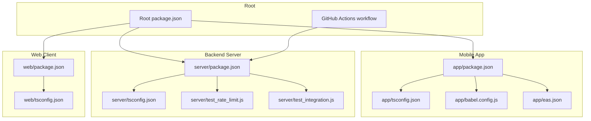
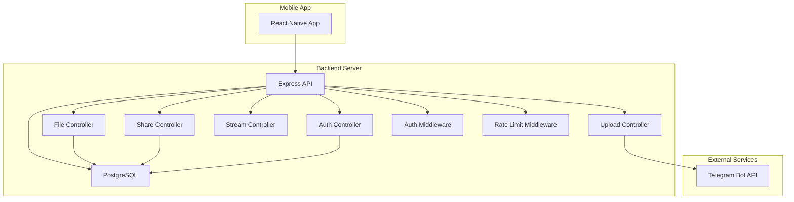
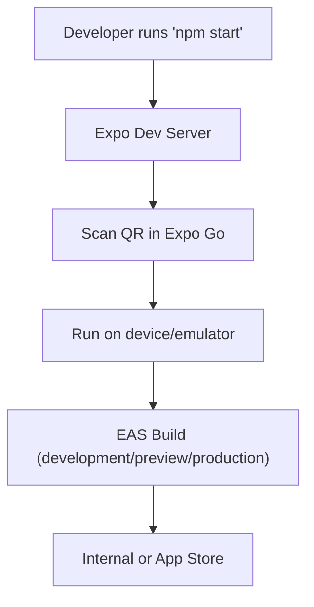
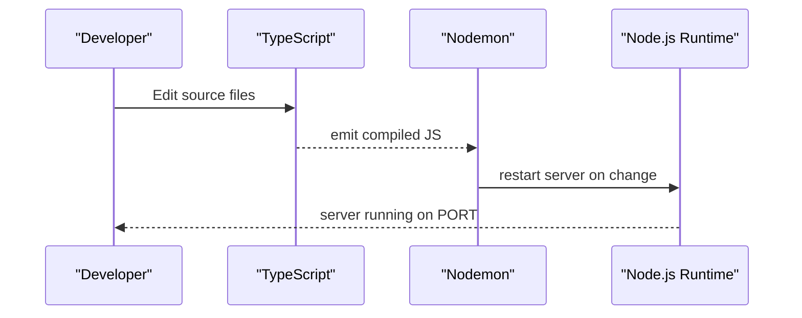
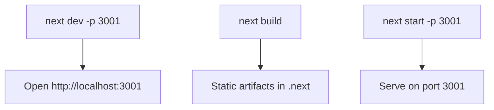
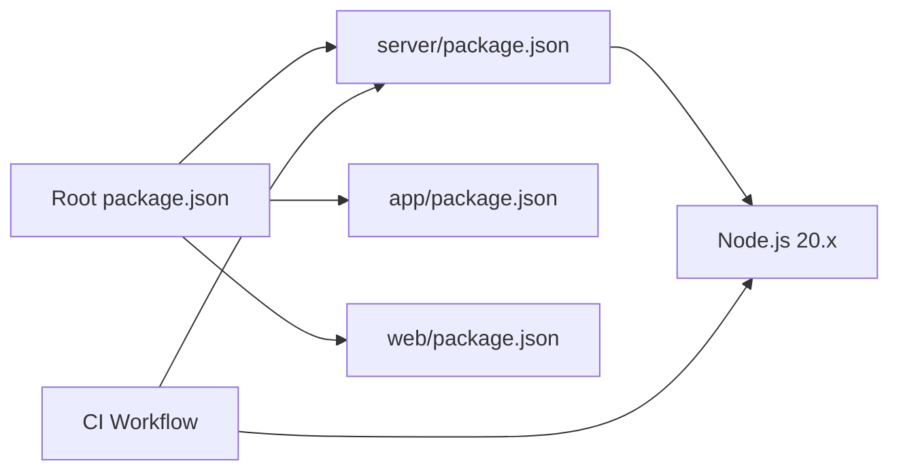
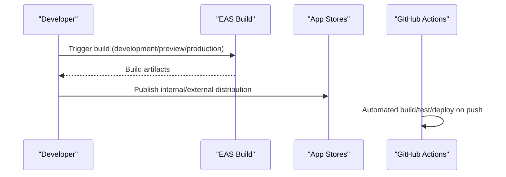

# Development Workflow

<cite>
**Referenced Files in This Document**
- [package.json](file://package.json)
- [app/package.json](file://app/package.json)
- [server/package.json](file://server/package.json)
- [web/package.json](file://web/package.json)
- [README.md](file://README.md)
- [app/tsconfig.json](file://app/tsconfig.json)
- [server/tsconfig.json](file://server/tsconfig.json)
- [web/tsconfig.json](file://web/tsconfig.json)
- [app/babel.config.js](file://app/babel.config.js)
- [app/eas.json](file://app/eas.json)
- [server/test_rate_limit.js](file://server/test_rate_limit.js)
- [server/test_integration.js](file://server/test_integration.js)
- [.github/workflows/main_axyzcloud.yml](file://.github/workflows/main_axyzcloud.yml)
</cite>

## Table of Contents
1. [Introduction](#introduction)
2. [Project Structure](#project-structure)
3. [Core Components](#core-components)
4. [Architecture Overview](#architecture-overview)
5. [Detailed Component Analysis](#detailed-component-analysis)
6. [Dependency Analysis](#dependency-analysis)
7. [Performance Considerations](#performance-considerations)
8. [Troubleshooting Guide](#troubleshooting-guide)
9. [Code Quality and Standards](#code-quality-and-standards)
10. [Testing Strategy](#testing-strategy)
11. [Debugging Techniques](#debugging-techniques)
12. [Contribution Guidelines](#contribution-guidelines)
13. [Release Management](#release-management)
14. [Conclusion](#conclusion)

## Introduction
This document defines the development workflow for the project, covering environment setup, code organization, testing, debugging, code quality, and contribution practices. It consolidates configuration from package.json files, build and runtime scripts, type configurations, and CI/CD pipeline definitions to guide contributors through building, testing, and releasing the mobile app, backend server, and web client.

## Project Structure
The repository is organized into three primary development areas:
- app: React Native mobile app with Expo tooling
- server: Node.js + Express backend written in TypeScript
- web: Next.js web client
- docs: Documentation and diagrams
- Root scripts and CI/CD workflows

**Diagram sources**
- [package.json](file://package.json#L1-L19)
- [app/package.json](file://app/package.json#L1-L59)
- [server/package.json](file://server/package.json#L1-L57)
- [web/package.json](file://web/package.json#L1-L21)
- [app/tsconfig.json](file://app/tsconfig.json#L1-L5)
- [server/tsconfig.json](file://server/tsconfig.json#L1-L13)
- [web/tsconfig.json](file://web/tsconfig.json#L1-L36)
- [app/babel.config.js](file://app/babel.config.js#L1-L12)
- [app/eas.json](file://app/eas.json#L1-L28)
- [server/test_rate_limit.js](file://server/test_rate_limit.js#L1-L8)
- [server/test_integration.js](file://server/test_integration.js#L1-L67)
- [.github/workflows/main_axyzcloud.yml](file://.github/workflows/main_axyzcloud.yml#L1-L71)

**Section sources**
- [README.md](file://README.md#L225-L246)
- [package.json](file://package.json#L1-L19)
- [app/package.json](file://app/package.json#L1-L59)
- [server/package.json](file://server/package.json#L1-L57)
- [web/package.json](file://web/package.json#L1-L21)

## Core Components
- Root scripts orchestrate server build and start commands.
- Mobile app scripts enable Expo start, Android/iOS runs, and web preview.
- Server scripts define dev/build/start/test lifecycles with Node.js 20.x requirement.
- Web client scripts define Next.js dev/build/start lifecycles.
- Type configurations standardize compiler options across platforms.

Key script references:
- Root: build, start
- Mobile: start, android, ios, web
- Server: dev, build, start, test
- Web: dev, build, start

**Section sources**
- [package.json](file://package.json#L2-L5)
- [app/package.json](file://app/package.json#L5-L10)
- [server/package.json](file://server/package.json#L6-L11)
- [web/package.json](file://web/package.json#L5-L9)

## Architecture Overview
The system comprises:
- Mobile app (React Native/Expo) consuming REST APIs from the backend
- Backend server (Node.js/Express) managing authentication, file/folder operations, sharing, and streaming
- Database (PostgreSQL) for metadata persistence
- Telegram Bot API for file storage within a private Telegram channel

**Diagram sources**
- [README.md](file://README.md#L72-L99)
- [server/package.json](file://server/package.json#L19-L41)

**Section sources**
- [README.md](file://README.md#L72-L99)

## Detailed Component Analysis

### Mobile App (Expo React Native)
- Toolchain: Expo SDK, TypeScript, Reanimated, React Navigation, MMKV, WebView, Notifications, Updates.
- Build and distribution: EAS Build configured for development, preview, and production channels.
- Transpilation: Babel preset for Expo with worklets plugin for Reanimated v4.
- Type safety: Extends Expo base tsconfig.

**Diagram sources**
- [app/package.json](file://app/package.json#L5-L10)
- [app/babel.config.js](file://app/babel.config.js#L1-L12)
- [app/eas.json](file://app/eas.json#L6-L23)

**Section sources**
- [app/package.json](file://app/package.json#L1-L59)
- [app/babel.config.js](file://app/babel.config.js#L1-L12)
- [app/eas.json](file://app/eas.json#L1-L28)
- [app/tsconfig.json](file://app/tsconfig.json#L1-L5)

### Backend Server (Node.js + Express)
- Language and tooling: TypeScript with strict compiler options, Nodemon for dev, Node.js 20.x runtime.
- Dependencies: Express, helmet, cors, jsonwebtoken, bcrypt, multer, pg, winston, sharp, telegram, archiver.
- Scripts: dev (watch), build (compile), start (run compiled), test placeholder.
- Testing utilities: ad-hoc scripts for rate limiting and integration checks.

**Diagram sources**
- [server/package.json](file://server/package.json#L6-L11)
- [server/tsconfig.json](file://server/tsconfig.json#L2-L11)

**Section sources**
- [server/package.json](file://server/package.json#L1-L57)
- [server/tsconfig.json](file://server/tsconfig.json#L1-L13)
- [server/test_rate_limit.js](file://server/test_rate_limit.js#L1-L8)
- [server/test_integration.js](file://server/test_integration.js#L1-L67)

### Web Client (Next.js)
- Language and tooling: TypeScript with strict mode, esnext module resolution, bundler-based resolution.
- Scripts: dev, build, start aligned with Next.js conventions.

**Diagram sources**
- [web/package.json](file://web/package.json#L5-L9)
- [web/tsconfig.json](file://web/tsconfig.json#L2-L24)

**Section sources**
- [web/package.json](file://web/package.json#L1-L21)
- [web/tsconfig.json](file://web/tsconfig.json#L1-L36)

## Dependency Analysis
- Root orchestrator depends on server scripts; server enforces Node.js 20.x.
- Mobile app depends on Expo ecosystem and native modules; EAS manages builds.
- Web client depends on Next.js and React.
- CI/CD uses Node.js 20.x and zips artifacts for deployment.

**Diagram sources**
- [package.json](file://package.json#L1-L19)
- [server/package.json](file://server/package.json#L16-L18)
- [.github/workflows/main_axyzcloud.yml](file://.github/workflows/main_axyzcloud.yml#L25-L28)

**Section sources**
- [package.json](file://package.json#L1-L19)
- [server/package.json](file://server/package.json#L16-L18)
- [.github/workflows/main_axyzcloud.yml](file://.github/workflows/main_axyzcloud.yml#L1-L71)

## Performance Considerations
- Use development scripts with hot reload for rapid iteration.
- Enable strict TypeScript settings to catch errors early.
- Prefer incremental builds and avoid unnecessary transpilations.
- Optimize image processing and streaming on the backend to reduce latency.
- Keep CI minimal and fast; leverage caching and selective artifact uploads.

## Troubleshooting Guide
Common issues and remedies:
- Node.js version mismatch: Ensure Node.js 20.x is installed locally and in CI.
- Missing environment variables: Confirm .env presence and required keys for backend.
- Port conflicts: Adjust ports for server and web clients if needed.
- Expo dev server connectivity: Verify network access and firewall settings.
- Rate limit or middleware errors: Validate rate limiter configuration and middleware order.

**Section sources**
- [server/package.json](file://server/package.json#L16-L18)
- [server/test_rate_limit.js](file://server/test_rate_limit.js#L1-L8)
- [README.md](file://README.md#L279-L300)

## Code Quality and Standards
- Language: TypeScript across all layers.
- Strictness: Enable strict compiler options and skipLibCheck where appropriate.
- Formatting and linting: Integrate Prettier and ESLint as needed (not present in current configs).
- Commit hygiene: Keep commits small, descriptive, and scoped.
- Branching: Feature branches merged via pull requests with reviews.

**Section sources**
- [app/tsconfig.json](file://app/tsconfig.json#L1-L5)
- [server/tsconfig.json](file://server/tsconfig.json#L9-L11)
- [web/tsconfig.json](file://web/tsconfig.json#L11-L11)

## Testing Strategy
Current testing landscape:
- Server test script is a placeholder; ad-hoc scripts exist for rate limiting and integration checks.
- Recommended approaches:
  - Unit tests for utilities and services using a framework like Jest or Vitest.
  - Integration tests against a test database and mocked Telegram API.
  - End-to-end tests for mobile and web using Detox or Playwright.
  - API contract tests with tools like Postman/Newman.

Ad-hoc scripts:
- Rate limit validation script demonstrates middleware usage.
- Integration script exercises shared links creation and basic API interaction.

**Section sources**
- [server/package.json](file://server/package.json#L10-L10)
- [server/test_rate_limit.js](file://server/test_rate_limit.js#L1-L8)
- [server/test_integration.js](file://server/test_integration.js#L1-L67)

## Debugging Techniques
- Mobile (Expo):
  - Use Expo Dev Tools and Flipper for device logs and inspection.
  - Enable remote debugging in the Expo client.
  - Inspect network requests via Flipper or Charles.
- Web:
  - Use Next.js dev tools and browser devtools.
  - Enable React DevTools for component inspection.
- Backend:
  - Use Node inspector with nodemon for breakpoints.
  - Leverage Winston logging and structured logs.
  - Validate middleware order and rate limiter behavior.

**Section sources**
- [app/package.json](file://app/package.json#L19-L35)
- [server/package.json](file://server/package.json#L52-L54)
- [server/test_rate_limit.js](file://server/test_rate_limit.js#L1-L8)

## Contribution Guidelines
- Fork the repository and create a feature branch.
- Commit changes following the project’s style and scope.
- Push the branch and open a pull request for review.
- Ensure CI passes and address reviewer feedback promptly.

**Section sources**
- [README.md](file://README.md#L370-L379)

## Release Management
- Mobile:
  - Configure EAS channels for development, preview, and production.
  - Use auto-increment for production builds.
- Backend:
  - CI builds and deploys using Node.js 20.x.
  - Artifact packaging and automated deployment to target environments.

**Diagram sources**
- [app/eas.json](file://app/eas.json#L6-L23)
- [.github/workflows/main_axyzcloud.yml](file://.github/workflows/main_axyzcloud.yml#L30-L35)

**Section sources**
- [app/eas.json](file://app/eas.json#L1-L28)
- [.github/workflows/main_axyzcloud.yml](file://.github/workflows/main_axyzcloud.yml#L1-L71)
- [README.md](file://README.md#L340-L346)

## Conclusion
This document consolidates the development workflow for the mobile app, backend server, and web client. By following the scripts, configurations, and practices outlined here—environment setup, testing, debugging, code quality, and release management—you can contribute effectively to the project and maintain a consistent, reliable development experience.