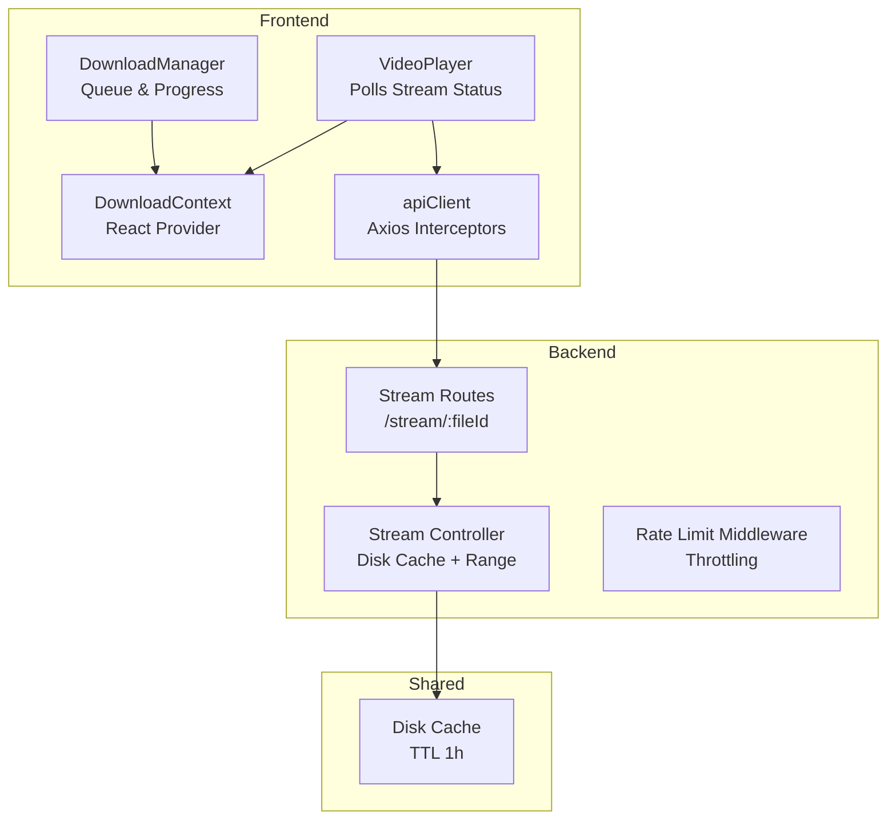
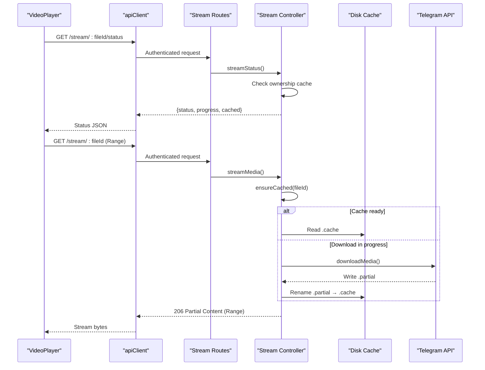
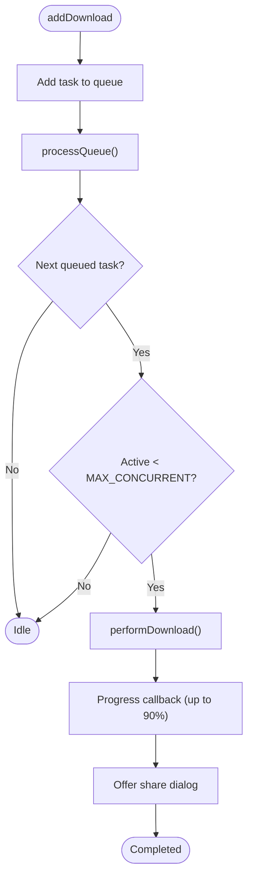
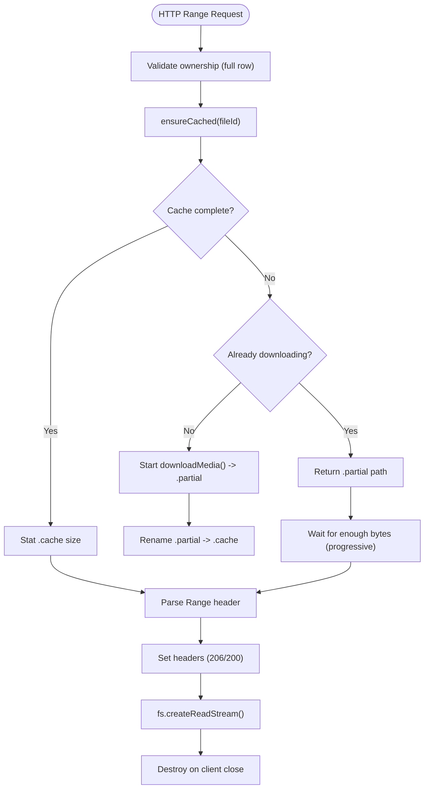
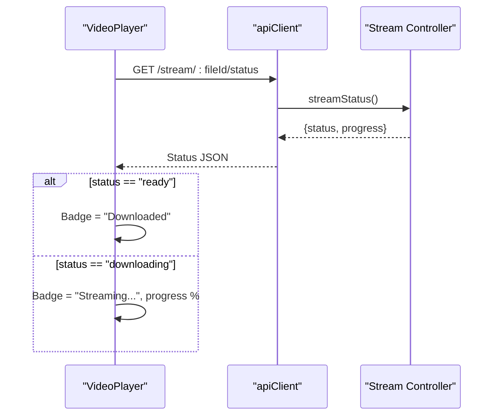
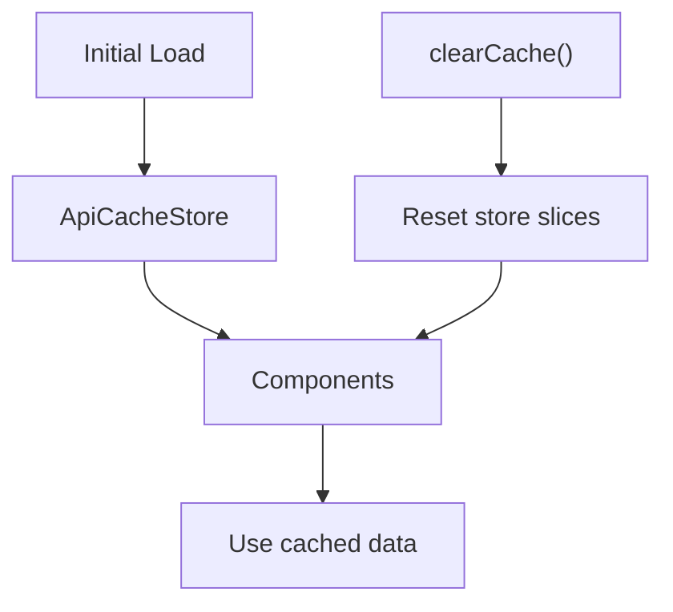
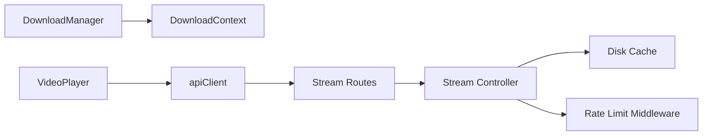

# Cache Management and Performance Optimization

<cite>
**Referenced Files in This Document**
- [DownloadManager.ts](file://app/src/services/DownloadManager.ts)
- [DownloadContext.tsx](file://app/src/context/DownloadContext.tsx)
- [ApiCacheStore.ts](file://app/src/context/ApiCacheStore.ts)
- [stream.controller.ts](file://server/src/controllers/stream.controller.ts)
- [stream.routes.ts](file://server/src/routes/stream.routes.ts)
- [VideoPlayer.tsx](file://app/src/components/VideoPlayer.tsx)
- [apiClient.ts](file://app/src/services/apiClient.ts)
- [retry.ts](file://app/src/utils/retry.ts)
- [rateLimit.middleware.ts](file://server/src/middlewares/rateLimit.middleware.ts)
- [cache-life.d.ts](file://web/.next/types/cache-life.d.ts)
</cite>

## Table of Contents
1. [Introduction](#introduction)
2. [Project Structure](#project-structure)
3. [Core Components](#core-components)
4. [Architecture Overview](#architecture-overview)
5. [Detailed Component Analysis](#detailed-component-analysis)
6. [Dependency Analysis](#dependency-analysis)
7. [Performance Considerations](#performance-considerations)
8. [Troubleshooting Guide](#troubleshooting-guide)
9. [Conclusion](#conclusion)

## Introduction
This document explains the cache management and performance optimization strategies implemented in the project. It covers:
- API response caching and invalidation
- File download caching and resumable transfers
- Media buffer management and streaming
- Cache invalidation strategies, TTL policies, and memory management for large files
- Implementation details from DownloadManager.ts for cache-aware download logic
- Stream controller optimizations for bandwidth efficiency
- Cache store integration and performance monitoring
- Prefetching strategies and adaptive bitrate handling for optimal streaming across different network conditions

## Project Structure
The caching and performance features span both the frontend and backend:
- Frontend: DownloadManager orchestrates downloads, maintains progress, and integrates with React contexts for UI updates.
- Backend: Stream controller implements a download-first, cache-to-disk strategy with HTTP Range support and TTL-based cache expiration.
- Shared: VideoPlayer polls stream status to inform users about caching progress and readiness.

**Diagram sources**
- [DownloadManager.ts](file://app/src/services/DownloadManager.ts#L42-L323)
- [DownloadContext.tsx](file://app/src/context/DownloadContext.tsx#L29-L94)
- [VideoPlayer.tsx](file://app/src/components/VideoPlayer.tsx#L28-L241)
- [apiClient.ts](file://app/src/services/apiClient.ts#L31-L164)
- [stream.controller.ts](file://server/src/controllers/stream.controller.ts#L1-L460)
- [stream.routes.ts](file://server/src/routes/stream.routes.ts#L1-L25)

**Section sources**
- [DownloadManager.ts](file://app/src/services/DownloadManager.ts#L1-L323)
- [DownloadContext.tsx](file://app/src/context/DownloadContext.tsx#L1-L94)
- [VideoPlayer.tsx](file://app/src/components/VideoPlayer.tsx#L1-L353)
- [apiClient.ts](file://app/src/services/apiClient.ts#L1-L164)
- [stream.controller.ts](file://server/src/controllers/stream.controller.ts#L1-L460)
- [stream.routes.ts](file://server/src/routes/stream.routes.ts#L1-L25)

## Core Components
- DownloadManager: Manages concurrent downloads, progress tracking, notifications, and cancellation. Uses expo-file-system for resumable downloads and shares a singleton instance across the app.
- DownloadContext: React provider that subscribes to DownloadManager snapshots and exposes derived helpers for UI.
- ApiCacheStore: Zustand store for API response caching of home data, files lists, starred items, and folders.
- Stream Controller: Implements a download-first strategy with disk cache, HTTP Range support, and TTL-based eviction.
- VideoPlayer: Polls stream status to display “Streaming…” or “Downloaded” badges and shows progress overlays.
- apiClient: Axios-based HTTP client with request/response logging, retry logic, and server waking UI.
- Rate Limit Middleware: Enforces throttling for various endpoints to protect backend resources.

**Section sources**
- [DownloadManager.ts](file://app/src/services/DownloadManager.ts#L42-L323)
- [DownloadContext.tsx](file://app/src/context/DownloadContext.tsx#L29-L94)
- [ApiCacheStore.ts](file://app/src/context/ApiCacheStore.ts#L1-L28)
- [stream.controller.ts](file://server/src/controllers/stream.controller.ts#L1-L460)
- [VideoPlayer.tsx](file://app/src/components/VideoPlayer.tsx#L28-L241)
- [apiClient.ts](file://app/src/services/apiClient.ts#L31-L164)
- [rateLimit.middleware.ts](file://server/src/middlewares/rateLimit.middleware.ts#L1-L47)

## Architecture Overview
The streaming pipeline prioritizes reliability and performance:
- First play: Backend downloads the entire Telegram media to a temporary disk cache (.partial → .cache), then serves via HTTP Range.
- Subsequent plays: Serve instantly from cache with zero Telegram calls.
- Cache TTL: 1 hour; periodic cleanup removes stale cache files.
- Ownership cache: Short-lived in-memory cache (60s) to avoid frequent DB queries for ownership checks.

**Diagram sources**
- [VideoPlayer.tsx](file://app/src/components/VideoPlayer.tsx#L53-L88)
- [apiClient.ts](file://app/src/services/apiClient.ts#L31-L164)
- [stream.routes.ts](file://server/src/routes/stream.routes.ts#L19-L23)
- [stream.controller.ts](file://server/src/controllers/stream.controller.ts#L268-L459)

## Detailed Component Analysis

### DownloadManager: Cache-Aware Download Logic
- Queue and concurrency: Limits concurrent downloads to a fixed cap and progresses queued tasks sequentially.
- Resumable downloads: Uses expo-file-system DownloadResumable with progress callbacks to compute progress up to 90% before post-processing.
- Cancellation: Supports per-task and global cancellation via AbortController semantics.
- Notifications: Updates Android notifications with average progress and completion summaries.
- Post-download actions: Shares the saved file via platform sharing APIs.

**Diagram sources**
- [DownloadManager.ts](file://app/src/services/DownloadManager.ts#L153-L318)

**Section sources**
- [DownloadManager.ts](file://app/src/services/DownloadManager.ts#L42-L323)
- [DownloadContext.tsx](file://app/src/context/DownloadContext.tsx#L29-L94)

### Stream Controller: Disk-Cache Streaming with TTL
- Disk cache: Stores full media under a temp directory with .cache extension; partial downloads use .partial until completion.
- TTL policy: Cache considered valid if file exists and was modified within the TTL window; periodic cleanup removes stale entries.
- Ownership cache: In-memory cache keyed by `${userId}:${fileId}` with 60s TTL to reduce DB queries.
- Download coordination: downloadLocks ensures only one download per fileId runs concurrently; other requests receive partial path and wait.
- Progressive streaming: Waits for sufficient bytes to satisfy a small chunk or near-end-of-file to minimize player timeouts.
- Range support: Parses HTTP Range headers and streams only the requested byte range; sets Content-Range and 206 Partial Content when applicable.
- Cleanup: On client disconnect, read streams are destroyed to free I/O.

**Diagram sources**
- [stream.controller.ts](file://server/src/controllers/stream.controller.ts#L180-L459)

**Section sources**
- [stream.controller.ts](file://server/src/controllers/stream.controller.ts#L1-L460)
- [stream.routes.ts](file://server/src/routes/stream.routes.ts#L1-L25)

### VideoPlayer: Stream Status Polling and User Feedback
- Polling: Every 2 seconds, fetches stream status to update “Streaming…” or “Downloaded” badges and progress percentage.
- Progressive messaging: Provides contextual loading messages to improve perceived performance.
- Error handling: Displays error overlay with retry action; retries by replacing the player source with the same URL and token.

**Diagram sources**
- [VideoPlayer.tsx](file://app/src/components/VideoPlayer.tsx#L53-L88)
- [apiClient.ts](file://app/src/services/apiClient.ts#L31-L164)
- [stream.controller.ts](file://server/src/controllers/stream.controller.ts#L268-L318)

**Section sources**
- [VideoPlayer.tsx](file://app/src/components/VideoPlayer.tsx#L28-L241)

### API Response Caching and Invalidation
- In-memory cache store: Zustand store caches home data, files lists, starred items, and folders. Provides setters and a clearCache action.
- Invalidation strategy: Manual clearing via clearCache resets all cached slices. No automatic TTL is implemented in this store.
- Integration: Components can read from the store to avoid redundant API calls and improve perceived performance.

**Diagram sources**
- [ApiCacheStore.ts](file://app/src/context/ApiCacheStore.ts#L16-L27)

**Section sources**
- [ApiCacheStore.ts](file://app/src/context/ApiCacheStore.ts#L1-L28)

### Web Cache Control and TTL Profiles
- Next.js cache profiles: Defines cache lifetimes for different profiles (seconds, minutes, hours, days, weeks, max) with stale, revalidate, and expire parameters.
- Purpose: Enables fine-grained control over client-side cache behavior for pages and data fetching.

**Section sources**
- [cache-life.d.ts](file://web/.next/types/cache-life.d.ts#L13-L141)

## Dependency Analysis
- Frontend depends on:
  - DownloadManager for queue and progress
  - DownloadContext for React integration
  - apiClient for authenticated requests and retry logic
  - VideoPlayer for UI feedback and polling
- Backend depends on:
  - Stream Controller for cache and streaming logic
  - Stream Routes for endpoint exposure
  - Rate Limit Middleware for resource protection
- Shared dependencies:
  - Disk cache directory and TTL constants
  - Ownership cache for reduced DB load

**Diagram sources**
- [DownloadManager.ts](file://app/src/services/DownloadManager.ts#L42-L323)
- [DownloadContext.tsx](file://app/src/context/DownloadContext.tsx#L29-L94)
- [VideoPlayer.tsx](file://app/src/components/VideoPlayer.tsx#L28-L241)
- [apiClient.ts](file://app/src/services/apiClient.ts#L31-L164)
- [stream.routes.ts](file://server/src/routes/stream.routes.ts#L1-L25)
- [stream.controller.ts](file://server/src/controllers/stream.controller.ts#L1-L460)
- [rateLimit.middleware.ts](file://server/src/middlewares/rateLimit.middleware.ts#L1-L47)

**Section sources**
- [DownloadManager.ts](file://app/src/services/DownloadManager.ts#L42-L323)
- [DownloadContext.tsx](file://app/src/context/DownloadContext.tsx#L29-L94)
- [VideoPlayer.tsx](file://app/src/components/VideoPlayer.tsx#L28-L241)
- [apiClient.ts](file://app/src/services/apiClient.ts#L31-L164)
- [stream.controller.ts](file://server/src/controllers/stream.controller.ts#L1-L460)
- [stream.routes.ts](file://server/src/routes/stream.routes.ts#L1-L25)
- [rateLimit.middleware.ts](file://server/src/middlewares/rateLimit.middleware.ts#L1-L47)

## Performance Considerations
- Download concurrency: Controlled by a fixed cap to balance throughput and device stability.
- Progress reporting: Uses a bounded progress scale to reserve headroom for post-download operations.
- Disk cache TTL: 1-hour TTL balances freshness and storage efficiency; periodic cleanup prevents accumulation of stale files.
- Ownership cache: 60-second TTL reduces repeated database queries for frequently polled endpoints.
- Progressive streaming: Player-friendly waits ensure mobile players receive initial chunks quickly, reducing timeouts.
- Range requests: Efficiently streams only requested byte ranges, minimizing bandwidth usage.
- Retry strategy: Exponential backoff with network error detection improves resilience without overloading servers.
- Rate limiting: Protects backend resources from abuse and ensures fair usage across users.

[No sources needed since this section provides general guidance]

## Troubleshooting Guide
- Downloads stuck at early progress:
  - Verify network connectivity and token validity.
  - Check cancellation logic and ensure tasks are not prematurely aborted.
- Stream fails with 416 or incomplete playback:
  - Confirm Range header parsing and ensure end offsets do not exceed available bytes.
  - Verify cache readiness and ownership cache correctness.
- Frequent server wake-up UI:
  - Inspect request timing logs and adjust retry delays.
  - Consider increasing timeouts for slow networks.
- Rate limit errors:
  - Review rate limit middleware configurations and reduce bursty requests.
- Cache cleanup not removing files:
  - Ensure cleanup interval is running and cache directory permissions are correct.

**Section sources**
- [DownloadManager.ts](file://app/src/services/DownloadManager.ts#L247-L263)
- [stream.controller.ts](file://server/src/controllers/stream.controller.ts#L395-L412)
- [apiClient.ts](file://app/src/services/apiClient.ts#L118-L131)
- [rateLimit.middleware.ts](file://server/src/middlewares/rateLimit.middleware.ts#L1-L47)

## Conclusion
The system combines a robust download manager with a disk-backed streaming cache to deliver reliable, efficient media playback. Key strategies include:
- Download-first caching with TTL and atomic transitions from partial to cache
- Progressive streaming with Range support and player-friendly waits
- In-memory ownership cache to reduce database load
- Frontend caching via a dedicated store and manual invalidation
- Retry logic and rate limiting to improve resilience and fairness
- Notifications and status polling to keep users informed

These mechanisms collectively optimize performance across varied network conditions and device capabilities.