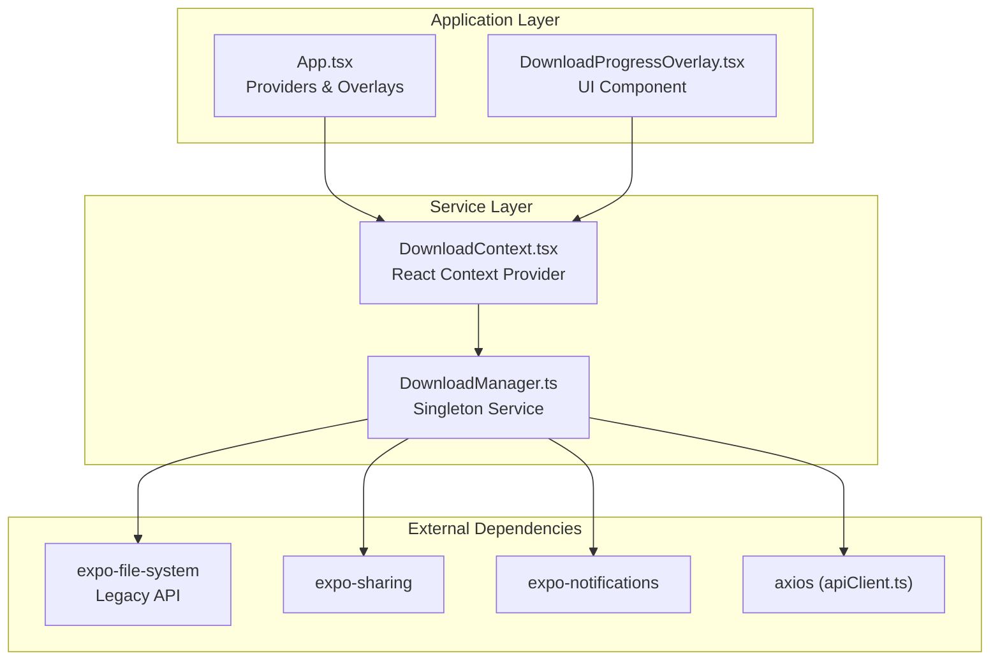
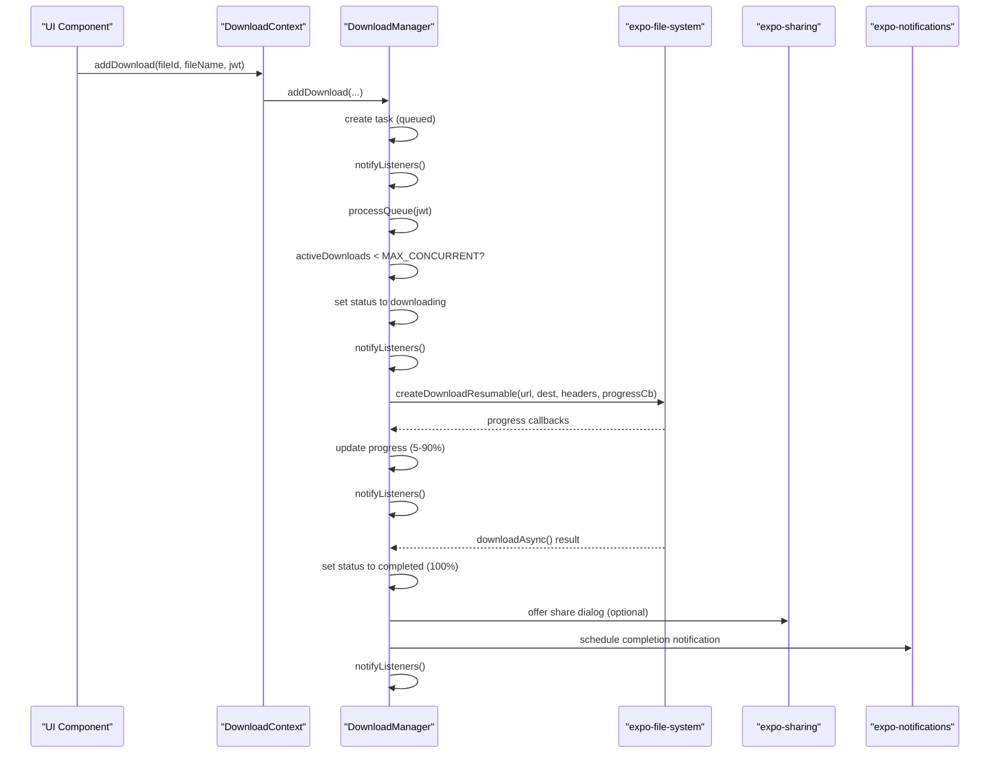
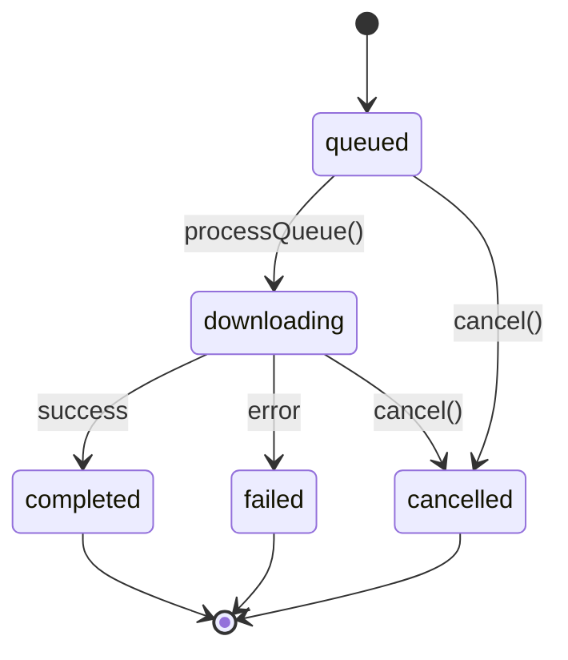
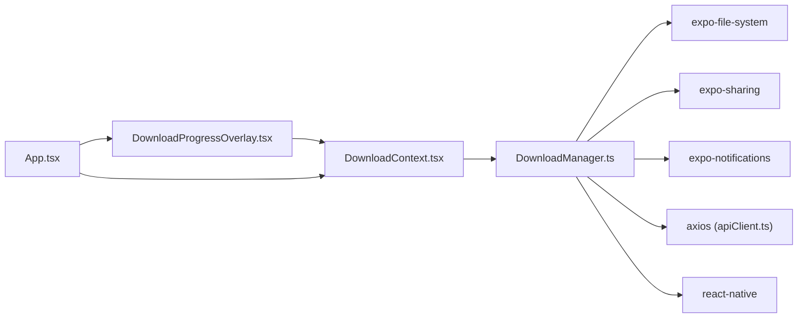

# Download Manager Implementation

<cite>
**Referenced Files in This Document**
- [DownloadManager.ts](file://app/src/services/DownloadManager.ts)
- [DownloadContext.tsx](file://app/src/context/DownloadContext.tsx)
- [DownloadProgressOverlay.tsx](file://app/src/components/DownloadProgressOverlay.tsx)
- [App.tsx](file://app/App.tsx)
- [apiClient.ts](file://app/src/services/apiClient.ts)
</cite>

## Table of Contents
1. [Introduction](#introduction)
2. [Project Structure](#project-structure)
3. [Core Components](#core-components)
4. [Architecture Overview](#architecture-overview)
5. [Detailed Component Analysis](#detailed-component-analysis)
6. [Dependency Analysis](#dependency-analysis)
7. [Performance Considerations](#performance-considerations)
8. [Troubleshooting Guide](#troubleshooting-guide)
9. [Conclusion](#conclusion)

## Introduction
This document provides comprehensive technical documentation for the DownloadManager implementation, focusing on download queue management, progress tracking, and concurrent download handling. It explains the DownloadManager class architecture, task lifecycle management, and the subscriber pattern used for React integration. The document covers download queue mechanics, concurrency limits (MAX_CONCURRENT), task state transitions (queued → downloading → completed/failed/cancelled), cancellation mechanisms, and integration with expo-file-system for reliable file downloads.

## Project Structure
The download functionality is implemented as a singleton service with a React context wrapper and a persistent overlay UI component. The key files are organized as follows:
- DownloadManager.ts: Centralized download queue manager with task lifecycle and progress tracking
- DownloadContext.tsx: React context provider wrapping the singleton for UI integration
- DownloadProgressOverlay.tsx: Persistent overlay UI displaying download progress and controls
- App.tsx: Application entry point integrating providers and overlays
- apiClient.ts: Provides API base URL used for constructing download endpoints

**Diagram sources**
- [App.tsx](file://app/App.tsx#L115-L286)
- [DownloadManager.ts](file://app/src/services/DownloadManager.ts#L42-L322)
- [DownloadContext.tsx](file://app/src/context/DownloadContext.tsx#L29-L84)

**Section sources**
- [App.tsx](file://app/App.tsx#L115-L286)
- [DownloadManager.ts](file://app/src/services/DownloadManager.ts#L1-L323)
- [DownloadContext.tsx](file://app/src/context/DownloadContext.tsx#L1-L94)

## Core Components
The DownloadManager implementation consists of three primary components:
- DownloadManager: Singleton service managing download tasks, queue processing, and progress tracking
- DownloadContext: React context provider enabling UI integration with the singleton
- DownloadProgressOverlay: Persistent UI component displaying download progress and controls

Key capabilities include:
- Concurrent download management with configurable limits
- Real-time progress tracking with granular callbacks
- Comprehensive error handling and cancellation support
- Notification system integration for Android
- React integration via subscriber pattern

**Section sources**
- [DownloadManager.ts](file://app/src/services/DownloadManager.ts#L42-L322)
- [DownloadContext.tsx](file://app/src/context/DownloadContext.tsx#L29-L94)
- [DownloadProgressOverlay.tsx](file://app/src/components/DownloadProgressOverlay.tsx#L85-L285)

## Architecture Overview
The DownloadManager follows a layered architecture with clear separation of concerns:
- Service Layer: DownloadManager handles all download logic and state management
- Presentation Layer: DownloadContext provides React integration via hooks
- UI Layer: DownloadProgressOverlay renders download progress and user controls
- Integration Layer: External libraries for file system operations, sharing, and notifications

**Diagram sources**
- [DownloadManager.ts](file://app/src/services/DownloadManager.ts#L153-L318)
- [DownloadContext.tsx](file://app/src/context/DownloadContext.tsx#L41-L49)

**Section sources**
- [DownloadManager.ts](file://app/src/services/DownloadManager.ts#L42-L322)
- [DownloadContext.tsx](file://app/src/context/DownloadContext.tsx#L29-L94)

## Detailed Component Analysis

### DownloadManager Class Architecture
The DownloadManager class implements a comprehensive download queue system with the following key features:

#### Task Lifecycle Management
The manager maintains an array of DownloadTask objects with explicit state transitions:
- queued: Initial state when a download is added to the queue
- downloading: Active state during file transfer
- completed: Final state when download finishes successfully
- failed: Terminal state for unsuccessful downloads
- cancelled: Terminal state for user-initiated cancellations

#### Concurrency Control
The implementation enforces a maximum concurrency limit of 3 simultaneous downloads:
- Tracks active downloads with an internal counter
- Processes only when below the MAX_CONCURRENT threshold
- Automatically starts the next download when capacity frees up

#### Progress Tracking System
Progress is tracked through multiple stages with precise percentages:
- Initial stage: 5% (setup and initialization)
- Transfer stage: 5% to 90% (based on bytes transferred)
- Post-processing: 90% to 95% (sharing preparation)
- Completion: 95% to 100% (finalization)

**Diagram sources**
- [DownloadManager.ts](file://app/src/services/DownloadManager.ts#L20-L38)
- [DownloadManager.ts](file://app/src/services/DownloadManager.ts#L233-L264)

#### Subscriber Pattern Implementation
The manager implements a publish-subscribe pattern for React integration:
- Maintains a list of listener callbacks
- Notifies subscribers on task state changes
- Provides unsubscribe mechanism
- Creates snapshot arrays to ensure React re-render detection

**Section sources**
- [DownloadManager.ts](file://app/src/services/DownloadManager.ts#L42-L174)
- [DownloadManager.ts](file://app/src/services/DownloadManager.ts#L233-L264)

### Download Worker Creation and Progress Callbacks
The core download functionality utilizes expo-file-system's legacy API for reliable file transfers:

#### Download Worker Setup
The manager creates DownloadResumable workers with:
- Authentication headers using JWT tokens
- Progress callback handlers for real-time updates
- Proper error handling for network interruptions

#### Progress Calculation Logic
Progress calculation follows a sophisticated algorithm:
- Uses totalBytesExpectedToWrite and totalBytesWritten
- Applies bounds checking to prevent invalid percentages
- Maintains minimum 5% and maximum 90% for transfer phase
- Preserves room for post-processing operations

#### Notification System Integration
The implementation integrates with expo-notifications for:
- Real-time progress updates during active downloads
- Completion notifications with success/failure indicators
- Android-specific notification channels and styling

**Section sources**
- [DownloadManager.ts](file://app/src/services/DownloadManager.ts#L268-L318)

### Cancellation Mechanisms and Error Handling
The DownloadManager implements robust cancellation and error handling:

#### Transport-Level Cancellation
Cancellation uses true transport-level interruption:
- Cancels underlying DownloadResumable workers
- Prevents network resource consumption
- Immediately stops file transfer operations

#### Graceful Error Recovery
Error handling encompasses multiple scenarios:
- Network failures and timeouts
- Authentication errors
- File system permission issues
- User-initiated cancellations

#### State Transition Logic
The manager ensures consistent state transitions:
- Cancellations mark tasks as cancelled with 0% progress
- Failures capture error messages for UI display
- Successful downloads finalize with 100% progress

**Section sources**
- [DownloadManager.ts](file://app/src/services/DownloadManager.ts#L179-L212)
- [DownloadManager.ts](file://app/src/services/DownloadManager.ts#L247-L257)

### React Integration and UI Components
The DownloadManager integrates seamlessly with React through multiple layers:

#### DownloadContext Provider
The context provider offers:
- Hook-based access to download functionality
- Derived helper computations (activeCount, overallProgress)
- Automatic subscription management
- Efficient state updates via snapshot arrays

#### DownloadProgressOverlay Component
The overlay provides:
- Persistent floating panel for download visibility
- Animated expand/collapse behavior
- Individual task progress bars
- Batch cancellation controls
- Completion notifications

**Section sources**
- [DownloadContext.tsx](file://app/src/context/DownloadContext.tsx#L29-L94)
- [DownloadProgressOverlay.tsx](file://app/src/components/DownloadProgressOverlay.tsx#L85-L285)

## Dependency Analysis
The DownloadManager has well-defined dependencies that support its functionality:

**Diagram sources**
- [DownloadManager.ts](file://app/src/services/DownloadManager.ts#L11-L16)
- [App.tsx](file://app/App.tsx#L16-L17)

The dependencies support:
- File system operations via expo-file-system
- Sharing functionality via expo-sharing
- Notification system via expo-notifications
- API communication via axios
- React Native platform integration

**Section sources**
- [DownloadManager.ts](file://app/src/services/DownloadManager.ts#L11-L16)
- [App.tsx](file://app/App.tsx#L16-L17)

## Performance Considerations
The DownloadManager implementation incorporates several performance optimizations:

### Concurrency Management
- Fixed maximum concurrency of 3 prevents resource exhaustion
- Automatic queuing prevents overwhelming network resources
- Efficient worker cleanup reduces memory footprint

### Progress Reporting Efficiency
- Optimized progress calculations minimize computational overhead
- Debounced UI updates prevent excessive re-renders
- Snapshot arrays ensure efficient React state comparisons

### Memory Management
- Proper cleanup of DownloadResumable workers
- Map-based worker storage with automatic removal
- Event listener unsubscription prevents memory leaks

## Troubleshooting Guide
Common issues and their resolutions:

### Download Stalls or Freezes
- Verify network connectivity and server availability
- Check JWT token validity and expiration
- Monitor progress callbacks for stuck transfers

### Cancellation Not Working
- Ensure proper task ID identification
- Verify worker cancellation support
- Check for immediate state changes after cancellation

### Progress Tracking Issues
- Confirm totalBytesExpectedToWrite availability
- Validate progress callback registration
- Check for early termination conditions

### Notification Problems
- Verify notification permissions
- Check Android notification channel configuration
- Ensure proper notification scheduling

**Section sources**
- [DownloadManager.ts](file://app/src/services/DownloadManager.ts#L179-L212)
- [DownloadManager.ts](file://app/src/services/DownloadManager.ts#L283-L318)

## Conclusion
The DownloadManager implementation provides a robust, production-ready solution for managing file downloads with comprehensive features including concurrent download control, detailed progress tracking, reliable cancellation mechanisms, and seamless React integration. The architecture supports scalability, maintainability, and user-friendly download experiences through its layered design and well-defined interfaces.

The implementation demonstrates best practices in mobile application development, including proper resource management, error handling, and user experience considerations. The integration with expo-file-system ensures reliable file operations while maintaining optimal performance characteristics.