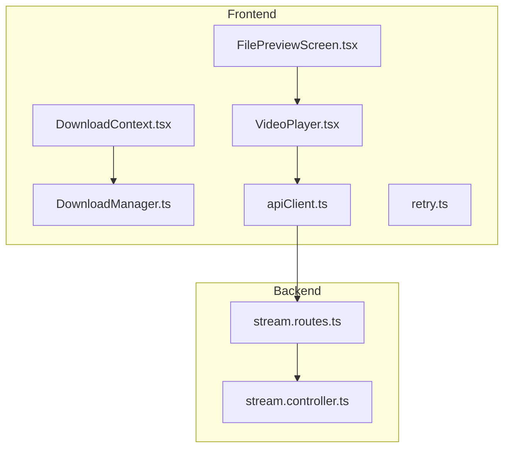
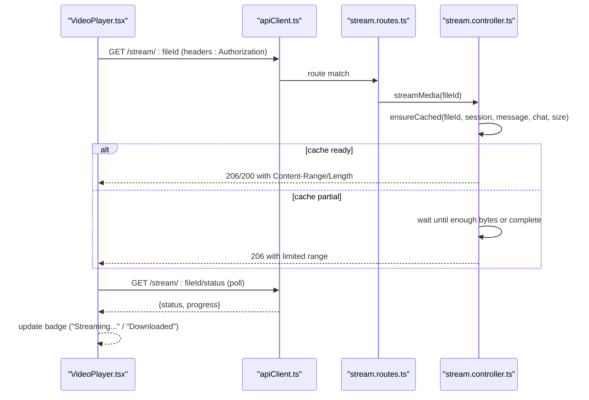
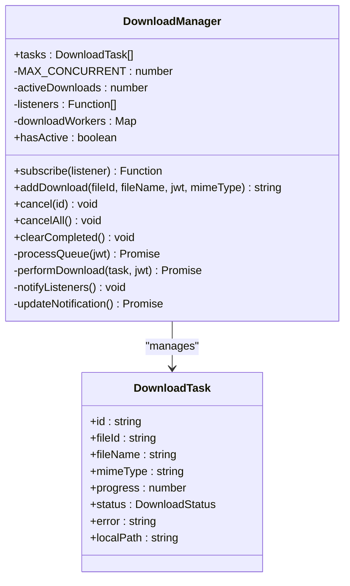
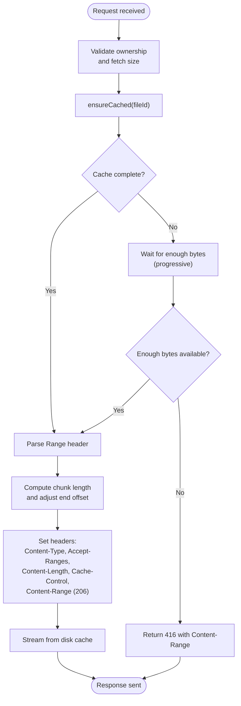
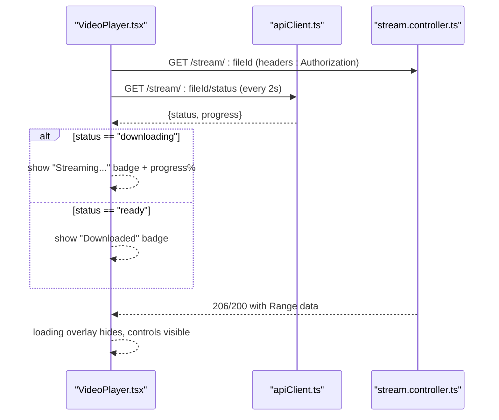
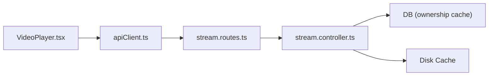

# Download and Streaming System

<cite>
**Referenced Files in This Document**
- [DownloadManager.ts](file://app/src/services/DownloadManager.ts)
- [DownloadContext.tsx](file://app/src/context/DownloadContext.tsx)
- [VideoPlayer.tsx](file://app/src/components/VideoPlayer.tsx)
- [VideoPlayer.web.tsx](file://app/src/components/VideoPlayer.web.tsx)
- [stream.controller.ts](file://server/src/controllers/stream.controller.ts)
- [stream.routes.ts](file://server/src/routes/stream.routes.ts)
- [apiClient.ts](file://app/src/services/apiClient.ts)
- [retry.ts](file://app/src/utils/retry.ts)
- [FilePreviewScreen.tsx](file://app/src/screens/FilePreviewScreen.tsx)
</cite>

## Table of Contents
1. [Introduction](#introduction)
2. [Project Structure](#project-structure)
3. [Core Components](#core-components)
4. [Architecture Overview](#architecture-overview)
5. [Detailed Component Analysis](#detailed-component-analysis)
6. [Dependency Analysis](#dependency-analysis)
7. [Performance Considerations](#performance-considerations)
8. [Troubleshooting Guide](#troubleshooting-guide)
9. [Conclusion](#conclusion)

## Introduction
This document explains the download and streaming system with a focus on progressive loading, HTTP Range request handling, and media streaming optimization. It covers:
- DownloadManager implementation for download queuing, progress tracking, and cache-like behavior
- Stream controller implementation for handling range requests, partial content delivery, and bandwidth optimization
- Video player integration for media playback and user feedback
- Streaming protocols, buffer management, adaptive bitrate handling, and performance optimization techniques
- Troubleshooting guidance for streaming issues, network optimization strategies, and integration patterns

## Project Structure
The streaming system spans the frontend React Native app and the backend Express server:
- Frontend services and UI:
  - DownloadManager.ts: centralized download queue manager
  - DownloadContext.tsx: React provider for global download state
  - VideoPlayer.tsx: media player with streaming badges and progressive loading
  - apiClient.ts: HTTP client with retries and logging
  - retry.ts: retry policy for network failures
  - FilePreviewScreen.tsx: integrates video playback and downloads
- Backend controllers and routes:
  - stream.controller.ts: download-first caching, Range support, and progressive streaming
  - stream.routes.ts: protected routes for streaming and status

**Diagram sources**
- [DownloadManager.ts](file://app/src/services/DownloadManager.ts#L42-L323)
- [DownloadContext.tsx](file://app/src/context/DownloadContext.tsx#L29-L94)
- [VideoPlayer.tsx](file://app/src/components/VideoPlayer.tsx#L28-L353)
- [apiClient.ts](file://app/src/services/apiClient.ts#L31-L164)
- [retry.ts](file://app/src/utils/retry.ts#L14-L33)
- [FilePreviewScreen.tsx](file://app/src/screens/FilePreviewScreen.tsx#L1-L200)
- [stream.controller.ts](file://server/src/controllers/stream.controller.ts#L322-L460)
- [stream.routes.ts](file://server/src/routes/stream.routes.ts#L10-L26)

**Section sources**
- [DownloadManager.ts](file://app/src/services/DownloadManager.ts#L1-L323)
- [DownloadContext.tsx](file://app/src/context/DownloadContext.tsx#L1-L94)
- [VideoPlayer.tsx](file://app/src/components/VideoPlayer.tsx#L1-L353)
- [apiClient.ts](file://app/src/services/apiClient.ts#L1-L164)
- [retry.ts](file://app/src/utils/retry.ts#L1-L34)
- [FilePreviewScreen.tsx](file://app/src/screens/FilePreviewScreen.tsx#L1-L200)
- [stream.controller.ts](file://server/src/controllers/stream.controller.ts#L1-L460)
- [stream.routes.ts](file://server/src/routes/stream.routes.ts#L1-L26)

## Core Components
- DownloadManager: manages a bounded concurrency queue, tracks progress, supports cancellation, and updates notifications. It uses Expo FileSystem’s download worker to stream to disk and offers sharing on completion.
- Stream Controller: implements a download-first strategy with disk caching, serves HTTP Range requests, and progressively streams available bytes to mobile players.
- Video Player: integrates with the streaming endpoint, polls cache status, shows “Streaming…” and “Downloaded” badges, and provides retry and error handling.
- API Client: injects auth headers, logs requests, and applies exponential backoff retry policy.

**Section sources**
- [DownloadManager.ts](file://app/src/services/DownloadManager.ts#L42-L323)
- [stream.controller.ts](file://server/src/controllers/stream.controller.ts#L322-L460)
- [VideoPlayer.tsx](file://app/src/components/VideoPlayer.tsx#L28-L353)
- [apiClient.ts](file://app/src/services/apiClient.ts#L31-L164)
- [retry.ts](file://app/src/utils/retry.ts#L14-L33)

## Architecture Overview
The system follows a download-first, cache-then-stream model:
- On first play, the backend downloads the entire file to a temporary cache and atomically renames it to a complete cache file.
- Subsequent plays stream directly from the cache.
- Range requests are honored to minimize buffering and improve startup latency.
- The frontend polls the status endpoint to inform users of caching progress and switches to “Downloaded” when complete.

**Diagram sources**
- [VideoPlayer.tsx](file://app/src/components/VideoPlayer.tsx#L48-L88)
- [apiClient.ts](file://app/src/services/apiClient.ts#L31-L164)
- [stream.routes.ts](file://server/src/routes/stream.routes.ts#L10-L26)
- [stream.controller.ts](file://server/src/controllers/stream.controller.ts#L322-L460)

## Detailed Component Analysis

### DownloadManager Implementation
- Responsibilities:
  - Enqueue downloads with unique IDs and track progress and status
  - Concurrency control with a fixed cap
  - Progress callbacks to update UI and notifications
  - Cancellation via AbortController semantics
  - Post-download sharing integration
- Key behaviors:
  - Queued → Downloading → Completed/Failed/Cancelled
  - Uses a snapshot pattern to emit new references for React state updates
  - Schedules OS-level notifications for progress and completion
  - Limits progress range to avoid misleading near-completion states

**Diagram sources**
- [DownloadManager.ts](file://app/src/services/DownloadManager.ts#L42-L323)

**Section sources**
- [DownloadManager.ts](file://app/src/services/DownloadManager.ts#L42-L323)
- [DownloadContext.tsx](file://app/src/context/DownloadContext.tsx#L29-L94)

### Stream Controller Implementation (Range Requests and Progressive Delivery)
- Strategy:
  - Download-first, cache-on-disk, serve-from-cache
  - Ownership validated per-request with a short-lived in-memory cache
  - Concurrency-safe: in-flight download lock ensures a single download per file
  - Cleanup: periodic pruning of stale cache files and progress entries
- Range handling:
  - Parses HTTP Range header and computes a safe chunk length
  - Progressive waits for sufficient bytes to satisfy a minimum chunk size or near-end conditions
  - Returns HTTP 206 Partial Content with accurate Content-Range
- Bandwidth optimization:
  - Atomic rename from partial to cache reduces I/O overhead
  - Client disconnect handling frees resources promptly
  - Cache TTL balances freshness and reuse

**Diagram sources**
- [stream.controller.ts](file://server/src/controllers/stream.controller.ts#L322-L460)

**Section sources**
- [stream.controller.ts](file://server/src/controllers/stream.controller.ts#L1-L460)
- [stream.routes.ts](file://server/src/routes/stream.routes.ts#L1-L26)

### Video Player Integration and User Feedback
- Integration:
  - Initializes a video player with Authorization headers for Range-based streaming
  - Polls the status endpoint to display “Streaming…” or “Downloaded”
  - Provides retry and error overlays
- UX:
  - Progressive loading messages timed to user expectations
  - Stream badges with icons and progress percentage
  - Native controls overlay for play/pause and mute

**Diagram sources**
- [VideoPlayer.tsx](file://app/src/components/VideoPlayer.tsx#L28-L353)
- [apiClient.ts](file://app/src/services/apiClient.ts#L31-L164)
- [stream.controller.ts](file://server/src/controllers/stream.controller.ts#L322-L460)

**Section sources**
- [VideoPlayer.tsx](file://app/src/components/VideoPlayer.tsx#L28-L353)
- [VideoPlayer.web.tsx](file://app/src/components/VideoPlayer.web.tsx#L1-L32)
- [FilePreviewScreen.tsx](file://app/src/screens/FilePreviewScreen.tsx#L1-L200)

### Adaptive Bitrate Handling
- Current implementation:
  - The backend serves a single rendition from a cached copy of the original file.
  - No dynamic quality switching is implemented.
- Recommended enhancements:
  - Pre-encode multiple renditions and segment with HLS/DASH
  - Serve manifest and segment lists with quality selection
  - Implement ABR logic based on client throughput and buffer health
  - Integrate with player’s adaptive engine and expose quality controls

[No sources needed since this section provides general guidance]

### Buffer Management and Startup Optimization
- Progressive loading:
  - The backend waits until a minimum chunk size beyond the requested start offset is available to reduce startup stalls.
- Player-side buffering:
  - Use player APIs to configure initial buffer sizes and target
  - Avoid aggressive prefetching that wastes bandwidth on mobile networks
- Cache lifecycle:
  - Short TTL encourages fresh content while enabling fast repeat plays
  - Cleanup intervals prevent disk bloat

**Section sources**
- [stream.controller.ts](file://server/src/controllers/stream.controller.ts#L376-L402)

## Dependency Analysis
- Frontend-to-backend dependencies:
  - VideoPlayer depends on apiClient for authenticated requests
  - apiClient depends on AsyncStorage for JWT injection
  - stream.routes protects endpoints with auth middleware
- Backend internal dependencies:
  - stream.controller orchestrates ownership checks, caching, and streaming
  - downloadLocks and downloadProgress coordinate concurrent downloads
  - Cache directory and cleanup timers manage disk usage

**Diagram sources**
- [VideoPlayer.tsx](file://app/src/components/VideoPlayer.tsx#L28-L353)
- [apiClient.ts](file://app/src/services/apiClient.ts#L31-L164)
- [stream.routes.ts](file://server/src/routes/stream.routes.ts#L10-L26)
- [stream.controller.ts](file://server/src/controllers/stream.controller.ts#L1-L460)

**Section sources**
- [apiClient.ts](file://app/src/services/apiClient.ts#L31-L164)
- [stream.controller.ts](file://server/src/controllers/stream.controller.ts#L1-L460)

## Performance Considerations
- Network and server:
  - Use exponential backoff and jitter for retries to avoid thundering herd
  - Keep timeouts reasonable for streaming vs. uploads
  - Monitor and log request durations for hotspots
- Streaming:
  - Prefer download-first for reliability on mobile players that aggressively probe with Range requests
  - Ensure atomic rename to avoid partial reads and reduce I/O
  - Limit early reads to a minimum chunk size to improve perceived startup time
- Client:
  - Avoid unnecessary polling; throttle status checks to 2 seconds
  - Provide user feedback during long downloads to reduce retries

**Section sources**
- [retry.ts](file://app/src/utils/retry.ts#L14-L33)
- [apiClient.ts](file://app/src/services/apiClient.ts#L118-L131)
- [stream.controller.ts](file://server/src/controllers/stream.controller.ts#L376-L402)

## Troubleshooting Guide
- Symptoms and causes:
  - 416 Range Not Satisfiable: Occurs when the requested range is invalid or exceeds available bytes; ensure the end offset is clamped to available bytes
  - Frequent 401 Unauthorized: Indicates expired or missing session; refresh credentials or re-authenticate
  - Long startup times: Likely due to insufficient cached bytes; ensure progressive wait logic is effective and consider increasing minimum chunk size
  - Player stalling: Verify that the backend returns 206 Partial Content with correct headers and that the client handles range requests properly
- Frontend checks:
  - Confirm Authorization header is attached to streaming requests
  - Validate status polling interval and badge logic
  - Use retry mechanism on transient network errors
- Backend checks:
  - Verify ownership cache TTL and cleanup intervals
  - Ensure partial-to-complete atomic rename succeeds
  - Log read stream errors and client disconnects

**Section sources**
- [stream.controller.ts](file://server/src/controllers/stream.controller.ts#L409-L412)
- [stream.controller.ts](file://server/src/controllers/stream.controller.ts#L347-L353)
- [VideoPlayer.tsx](file://app/src/components/VideoPlayer.tsx#L113-L131)
- [apiClient.ts](file://app/src/services/apiClient.ts#L118-L131)

## Conclusion
The system combines a robust download-first caching strategy with precise HTTP Range handling to deliver reliable, efficient media streaming on mobile clients. The DownloadManager coordinates downloads with progress and notifications, the stream controller optimizes for mobile player behavior, and the VideoPlayer surfaces real-time status to users. Future enhancements can introduce adaptive bitrate streaming and further refine buffer and retry policies for diverse network conditions.