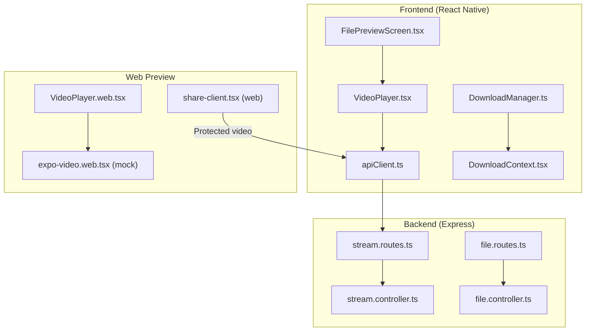
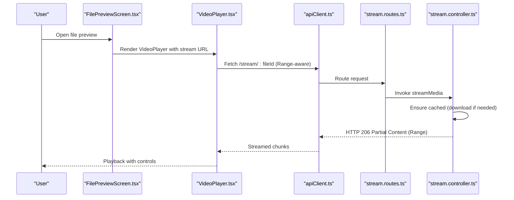
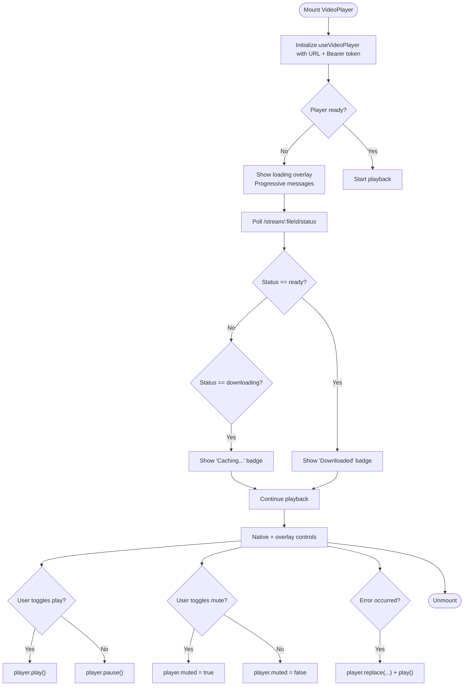
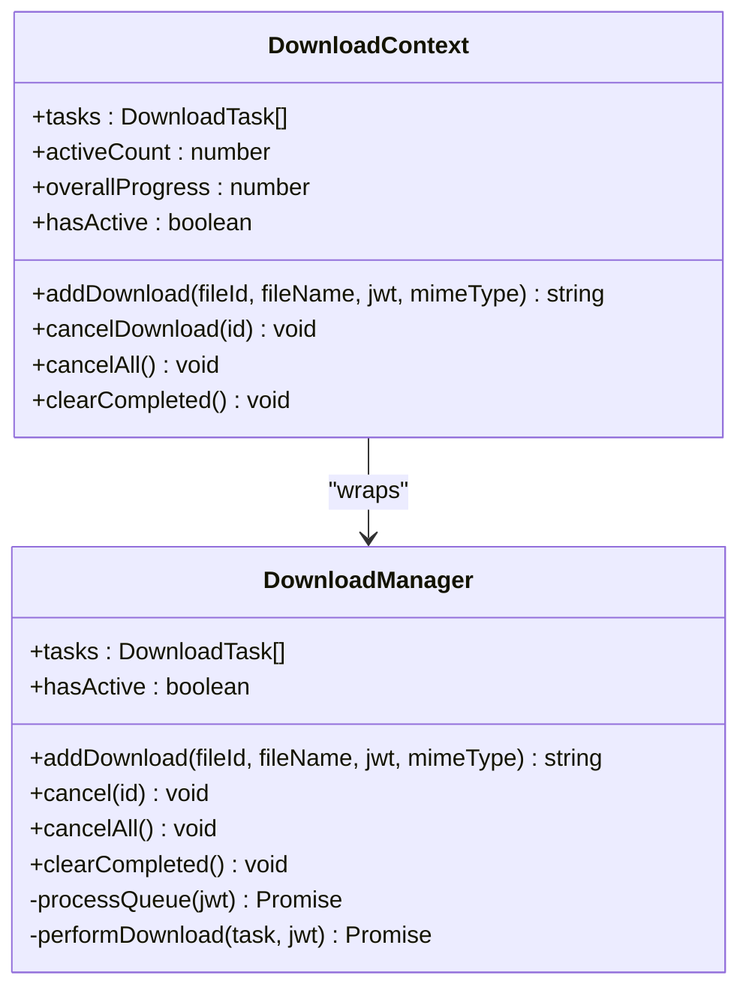
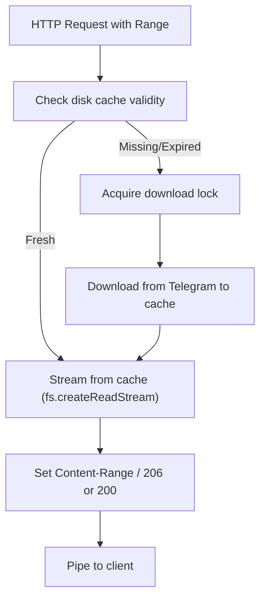
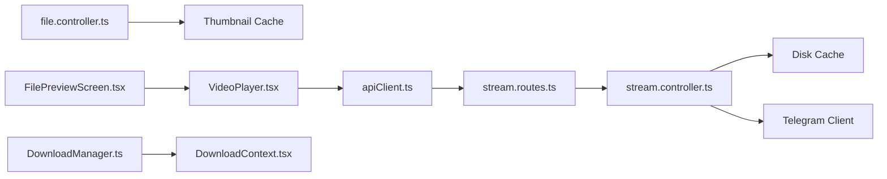

# Media Playback and Video Player Integration

<cite>
**Referenced Files in This Document**
- [VideoPlayer.tsx](file://app/src/components/VideoPlayer.tsx)
- [VideoPlayer.web.tsx](file://app/src/components/VideoPlayer.web.tsx)
- [expo-video.web.tsx](file://app/src/mocks/expo-video.web.tsx)
- [FilePreviewScreen.tsx](file://app/src/screens/FilePreviewScreen.tsx)
- [DownloadManager.ts](file://app/src/services/DownloadManager.ts)
- [DownloadContext.tsx](file://app/src/context/DownloadContext.tsx)
- [apiClient.ts](file://app/src/services/apiClient.ts)
- [stream.routes.ts](file://server/src/routes/stream.routes.ts)
- [stream.controller.ts](file://server/src/controllers/stream.controller.ts)
- [file.routes.ts](file://server/src/routes/file.routes.ts)
- [file.controller.ts](file://server/src/controllers/file.controller.ts)
- [share-client.tsx](file://web/app/share/[shareId]/share-client.tsx)
</cite>

## Table of Contents
1. [Introduction](#introduction)
2. [Project Structure](#project-structure)
3. [Core Components](#core-components)
4. [Architecture Overview](#architecture-overview)
5. [Detailed Component Analysis](#detailed-component-analysis)
6. [Dependency Analysis](#dependency-analysis)
7. [Performance Considerations](#performance-considerations)
8. [Troubleshooting Guide](#troubleshooting-guide)
9. [Conclusion](#conclusion)
10. [Appendices](#appendices)

## Introduction
This document explains the media playback and video player integration across React Native and web platforms. It covers the VideoPlayer component implementation, platform-specific adaptations, cross-platform compatibility, streaming protocols, buffer management, playback controls, offline playback via the download system, thumbnail generation, preview functionality, and performance optimization strategies.

## Project Structure
The media playback system spans three layers:
- Frontend (React Native): VideoPlayer component, preview screen, download manager, and API client.
- Backend (Express): Streaming routes and controllers implementing a download-then-stream strategy with HTTP Range support.
- Web Preview: A minimal placeholder for video playback on web.

**Diagram sources**
- [VideoPlayer.tsx](file://app/src/components/VideoPlayer.tsx#L1-L353)
- [FilePreviewScreen.tsx](file://app/src/screens/FilePreviewScreen.tsx#L460-L536)
- [DownloadManager.ts](file://app/src/services/DownloadManager.ts#L1-L323)
- [DownloadContext.tsx](file://app/src/context/DownloadContext.tsx#L1-L94)
- [apiClient.ts](file://app/src/services/apiClient.ts#L1-L164)
- [stream.routes.ts](file://server/src/routes/stream.routes.ts#L1-L25)
- [stream.controller.ts](file://server/src/controllers/stream.controller.ts#L1-L460)
- [file.routes.ts](file://server/src/routes/file.routes.ts#L1-L118)
- [file.controller.ts](file://server/src/controllers/file.controller.ts#L438-L545)
- [VideoPlayer.web.tsx](file://app/src/components/VideoPlayer.web.tsx#L1-L32)
- [expo-video.web.tsx](file://app/src/mocks/expo-video.web.tsx#L1-L23)
- [share-client.tsx](file://web/app/share/[shareId]/share-client.tsx#L804-L859)

**Section sources**
- [VideoPlayer.tsx](file://app/src/components/VideoPlayer.tsx#L1-L353)
- [FilePreviewScreen.tsx](file://app/src/screens/FilePreviewScreen.tsx#L460-L536)
- [DownloadManager.ts](file://app/src/services/DownloadManager.ts#L1-L323)
- [DownloadContext.tsx](file://app/src/context/DownloadContext.tsx#L1-L94)
- [apiClient.ts](file://app/src/services/apiClient.ts#L1-L164)
- [stream.routes.ts](file://server/src/routes/stream.routes.ts#L1-L25)
- [stream.controller.ts](file://server/src/controllers/stream.controller.ts#L1-L460)
- [file.routes.ts](file://server/src/routes/file.routes.ts#L1-L118)
- [file.controller.ts](file://server/src/controllers/file.controller.ts#L438-L545)
- [VideoPlayer.web.tsx](file://app/src/components/VideoPlayer.web.tsx#L1-L32)
- [expo-video.web.tsx](file://app/src/mocks/expo-video.web.tsx#L1-L23)
- [share-client.tsx](file://web/app/share/[shareId]/share-client.tsx#L804-L859)

## Core Components
- VideoPlayer (React Native): A production-ready video player using expo-video with streaming badges, progressive loading messages, error handling, and native controls.
- VideoPlayer (Web): A placeholder component indicating video playback is not supported in the web preview; includes a mock for expo-video to prevent bundling errors.
- FilePreviewScreen: Orchestrates preview rendering, detects media types, and renders VideoPlayer for videos.
- DownloadManager and DownloadContext: Manage offline downloads with progress tracking, notifications, concurrency, and cancellation.
- Backend streaming: Implements a download-then-stream strategy with HTTP Range support, cache management, and ownership checks.

**Section sources**
- [VideoPlayer.tsx](file://app/src/components/VideoPlayer.tsx#L1-L353)
- [VideoPlayer.web.tsx](file://app/src/components/VideoPlayer.web.tsx#L1-L32)
- [expo-video.web.tsx](file://app/src/mocks/expo-video.web.tsx#L1-L23)
- [FilePreviewScreen.tsx](file://app/src/screens/FilePreviewScreen.tsx#L460-L536)
- [DownloadManager.ts](file://app/src/services/DownloadManager.ts#L1-L323)
- [DownloadContext.tsx](file://app/src/context/DownloadContext.tsx#L1-L94)
- [stream.controller.ts](file://server/src/controllers/stream.controller.ts#L1-L460)

## Architecture Overview
The system uses a download-then-stream strategy to reliably serve video content to mobile players that aggressively request byte ranges. The frontend streams via Range requests, while the backend maintains a disk cache and tracks download progress.

**Diagram sources**
- [FilePreviewScreen.tsx](file://app/src/screens/FilePreviewScreen.tsx#L460-L536)
- [VideoPlayer.tsx](file://app/src/components/VideoPlayer.tsx#L39-L46)
- [apiClient.ts](file://app/src/services/apiClient.ts#L1-L164)
- [stream.routes.ts](file://server/src/routes/stream.routes.ts#L1-L25)
- [stream.controller.ts](file://server/src/controllers/stream.controller.ts#L1-L460)

## Detailed Component Analysis

### VideoPlayer (React Native)
Responsibilities:
- Initialize and configure an expo-video player with authentication headers.
- Poll backend for cache status to display “Streaming…” or “Downloaded” badges.
- Provide progressive loading messages and error overlays with retry.
- Control playback (play/pause) and audio (mute/unmute).
- Display native controls and overlay controls.

Key behaviors:
- Uses useVideoPlayer and VideoView from expo-video.
- Adds listeners for statusChange and playingChange to manage UI state.
- On error, sets loadError and invokes onError prop.
- Retries by replacing the player source and replaying.

**Diagram sources**
- [VideoPlayer.tsx](file://app/src/components/VideoPlayer.tsx#L28-L159)

**Section sources**
- [VideoPlayer.tsx](file://app/src/components/VideoPlayer.tsx#L1-L353)

### VideoPlayer (Web)
Responsibilities:
- Provide a non-functional placeholder on web to inform users that video playback is not supported in the web preview.
- Mock expo-video exports to avoid bundling failures.

Behavior:
- Renders a styled box with explanatory text.
- Uses a mock module that returns null/no-op functions for expo-video on web.

**Section sources**
- [VideoPlayer.web.tsx](file://app/src/components/VideoPlayer.web.tsx#L1-L32)
- [expo-video.web.tsx](file://app/src/mocks/expo-video.web.tsx#L1-L23)

### FilePreviewScreen (Video Rendering)
Responsibilities:
- Detect media type and render appropriate preview.
- For videos, pass stream URL, JWT token, and file ID to VideoPlayer.
- Provide actions like download and share.

Integration:
- Determines mime type and routes to VideoPlayer for video items.
- Passes onError callback to show user-friendly messages.

**Section sources**
- [FilePreviewScreen.tsx](file://app/src/screens/FilePreviewScreen.tsx#L460-L536)

### Download Manager and Offline Playback
Responsibilities:
- Queue and execute downloads with concurrency limits.
- Track progress, status, and errors.
- Provide notifications and subscription-based updates.
- Support cancellation and clearing of completed tasks.

Offline playback:
- Once a file is cached, it can be played back locally via the download system.
- The streaming controller serves cached files instantly on subsequent plays.

**Diagram sources**
- [DownloadManager.ts](file://app/src/services/DownloadManager.ts#L42-L323)
- [DownloadContext.tsx](file://app/src/context/DownloadContext.tsx#L27-L94)

**Section sources**
- [DownloadManager.ts](file://app/src/services/DownloadManager.ts#L1-L323)
- [DownloadContext.tsx](file://app/src/context/DownloadContext.tsx#L1-L94)

### Backend Streaming Protocol
Strategy:
- Download-first, then stream from disk cache.
- Serve HTTP Range requests (206 Partial Content) for smooth playback.
- Cache TTL of 1 hour; cleanup stale cache periodically.
- Concurrency-safe downloads via locks; in-memory ownership cache to reduce DB queries.

Key endpoints:
- GET /stream/:fileId — Stream with Range support.
- GET /stream/:fileId/status — Cache/download status for UI.

**Diagram sources**
- [stream.controller.ts](file://server/src/controllers/stream.controller.ts#L178-L460)
- [stream.routes.ts](file://server/src/routes/stream.routes.ts#L19-L23)

**Section sources**
- [stream.controller.ts](file://server/src/controllers/stream.controller.ts#L1-L460)
- [stream.routes.ts](file://server/src/routes/stream.routes.ts#L1-L25)

### Thumbnail Generation and Preview
- Thumbnails are generated on-demand and cached on disk for 24 hours.
- Optimized via Sharp to WebP with quality and effort tuning.
- Used in previews to reduce bandwidth and improve perceived performance.

**Section sources**
- [file.controller.ts](file://server/src/controllers/file.controller.ts#L443-L545)
- [file.routes.ts](file://server/src/routes/file.routes.ts#L111-L113)

## Dependency Analysis
- Frontend depends on:
  - expo-video for playback.
  - apiClient for authenticated requests.
  - DownloadManager/Context for offline capabilities.
- Backend depends on:
  - Telegram client for media retrieval.
  - Filesystem for caching.
  - Ownership cache to minimize DB queries.

**Diagram sources**
- [apiClient.ts](file://app/src/services/apiClient.ts#L1-L164)
- [stream.routes.ts](file://server/src/routes/stream.routes.ts#L1-L25)
- [stream.controller.ts](file://server/src/controllers/stream.controller.ts#L1-L460)
- [file.controller.ts](file://server/src/controllers/file.controller.ts#L443-L545)
- [VideoPlayer.tsx](file://app/src/components/VideoPlayer.tsx#L1-L353)
- [FilePreviewScreen.tsx](file://app/src/screens/FilePreviewScreen.tsx#L460-L536)
- [DownloadManager.ts](file://app/src/services/DownloadManager.ts#L1-L323)
- [DownloadContext.tsx](file://app/src/context/DownloadContext.tsx#L1-L94)

**Section sources**
- [apiClient.ts](file://app/src/services/apiClient.ts#L1-L164)
- [stream.controller.ts](file://server/src/controllers/stream.controller.ts#L1-L460)
- [file.controller.ts](file://server/src/controllers/file.controller.ts#L443-L545)
- [VideoPlayer.tsx](file://app/src/components/VideoPlayer.tsx#L1-L353)
- [FilePreviewScreen.tsx](file://app/src/screens/FilePreviewScreen.tsx#L460-L536)
- [DownloadManager.ts](file://app/src/services/DownloadManager.ts#L1-L323)
- [DownloadContext.tsx](file://app/src/context/DownloadContext.tsx#L1-L94)

## Performance Considerations
- Download-then-stream reduces player timeouts and improves reliability on mobile networks.
- HTTP Range support enables efficient buffering and seeking.
- Disk cache TTL balances freshness and performance.
- Ownership cache minimizes database load for frequent status polls.
- Thumbnail caching reduces bandwidth and speeds up preview rendering.
- Progressive loading messages improve perceived responsiveness.
- Concurrency limits in the download manager prevent resource contention.

[No sources needed since this section provides general guidance]

## Troubleshooting Guide
Common issues and remedies:
- Video fails to load:
  - Verify JWT token and network connectivity.
  - Use retry mechanism in VideoPlayer; check onError callback.
- Streaming stalls or shows 416:
  - Indicates out-of-range request; ensure backend cache is populated.
  - Confirm Range request handling and available bytes.
- Download progress stuck:
  - Check download manager subscriptions and task statuses.
  - Ensure cancellation and retry flows are functioning.
- Web preview shows “not supported”:
  - Expected behavior; video playback requires the mobile app.

**Section sources**
- [VideoPlayer.tsx](file://app/src/components/VideoPlayer.tsx#L118-L159)
- [DownloadManager.ts](file://app/src/services/DownloadManager.ts#L233-L264)
- [stream.controller.ts](file://server/src/controllers/stream.controller.ts#L409-L412)

## Conclusion
The media playback system combines a robust backend streaming strategy with a responsive frontend player to deliver reliable video playback across devices. The download-then-stream model, combined with caching and progress tracking, ensures smooth playback under varying network conditions. Cross-platform compatibility is achieved through platform-specific components and mocks, while the download system enables offline playback for improved user experience.

## Appendices

### API Definitions
- GET /stream/:fileId
  - Purpose: Stream file with HTTP Range support.
  - Authentication: Bearer token required.
  - Response: 200 or 206 with Content-Range; 416 on invalid range.
- GET /stream/:fileId/status
  - Purpose: Return cache/download status for UI badge.
  - Response: { success: true, status: "downloading" | "ready", progress: number }

**Section sources**
- [stream.routes.ts](file://server/src/routes/stream.routes.ts#L19-L23)
- [stream.controller.ts](file://server/src/controllers/stream.controller.ts#L1-L460)

### Web Video Preview
- Protected video component uses a temporary signed URL to stream protected content inline.

**Section sources**
- [share-client.tsx](file://web/app/share/[shareId]/share-client.tsx#L804-L859)