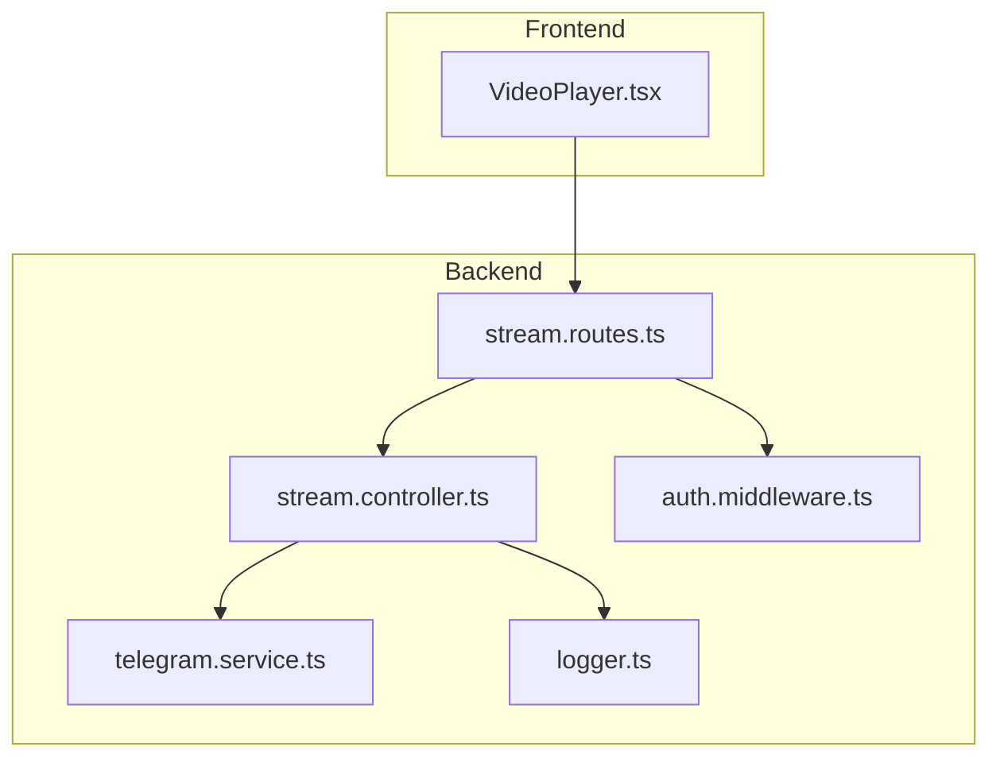
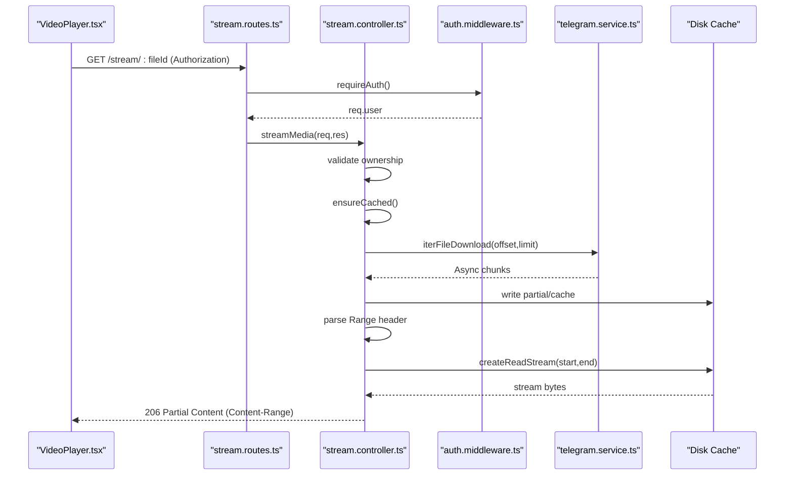
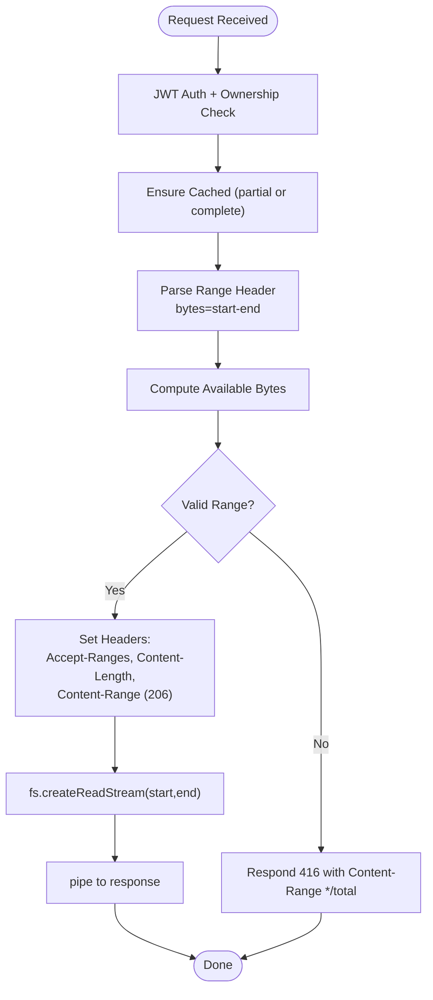
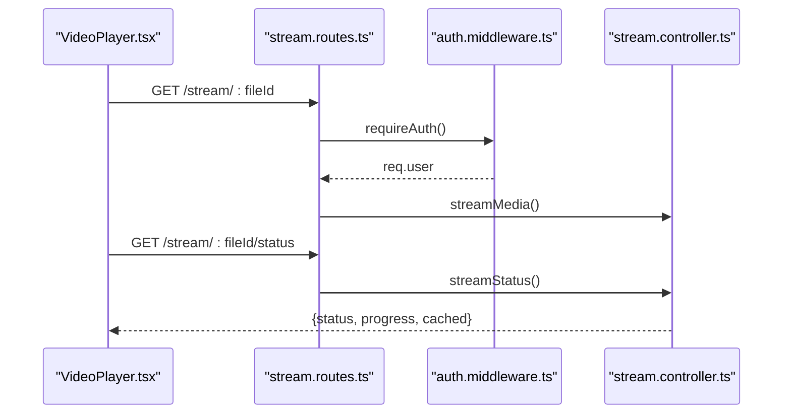
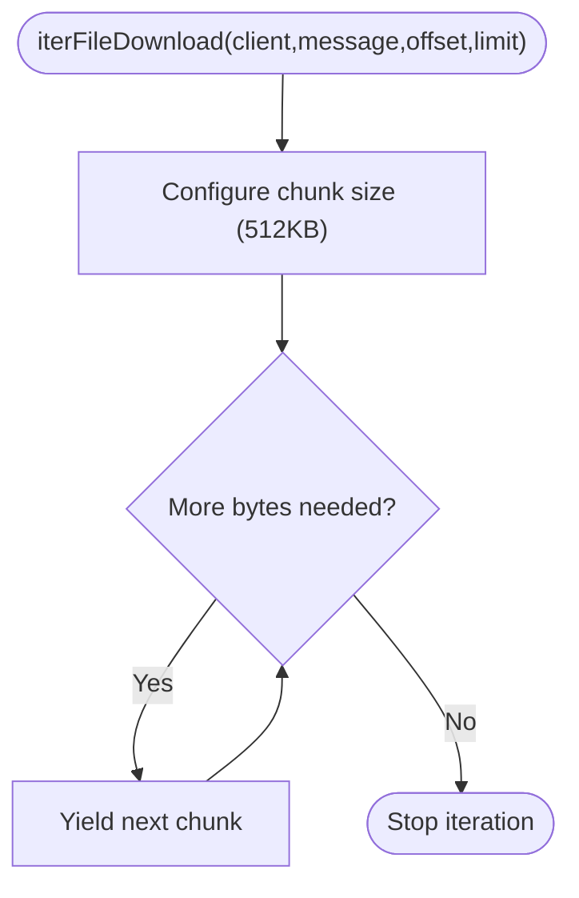
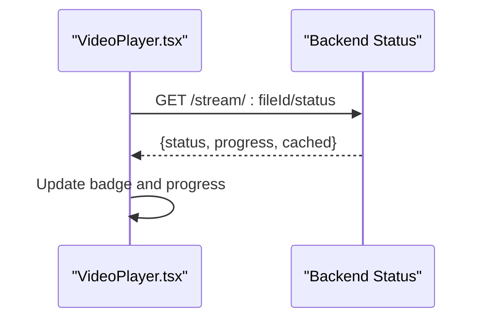
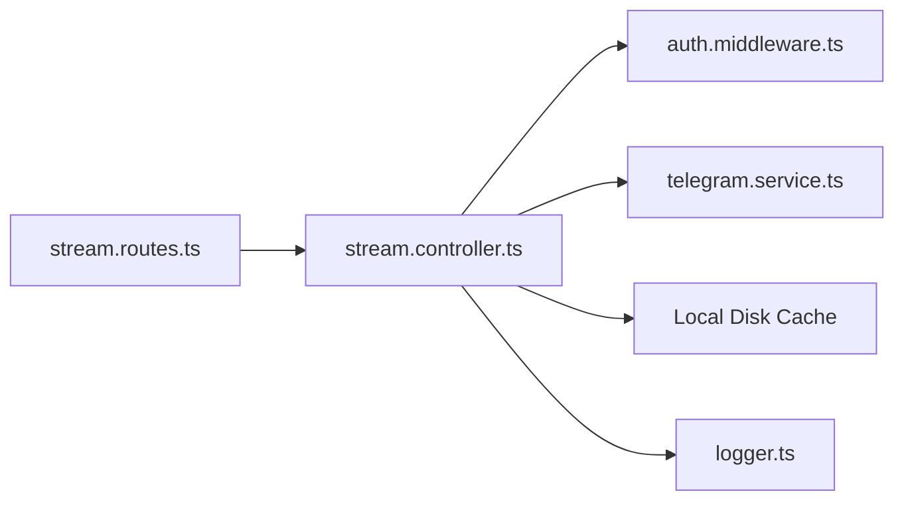

# Streaming Protocols and Range Requests

<cite>
**Referenced Files in This Document**
- [stream.controller.ts](file://server/src/controllers/stream.controller.ts)
- [stream.routes.ts](file://server/src/routes/stream.routes.ts)
- [auth.middleware.ts](file://server/src/middlewares/auth.middleware.ts)
- [telegram.service.ts](file://server/src/services/telegram.service.ts)
- [file.controller.ts](file://server/src/controllers/file.controller.ts)
- [VideoPlayer.tsx](file://app/src/components/VideoPlayer.tsx)
- [logger.ts](file://server/src/utils/logger.ts)
- [README.md](file://README.md)
</cite>

## Table of Contents
1. [Introduction](#introduction)
2. [Project Structure](#project-structure)
3. [Core Components](#core-components)
4. [Architecture Overview](#architecture-overview)
5. [Detailed Component Analysis](#detailed-component-analysis)
6. [Dependency Analysis](#dependency-analysis)
7. [Performance Considerations](#performance-considerations)
8. [Troubleshooting Guide](#troubleshooting-guide)
9. [Conclusion](#conclusion)

## Introduction
This document explains how the system implements HTTP range requests for efficient partial content delivery, focusing on the stream controller’s role in validating requests, managing cache and concurrency, and generating appropriate responses. It also covers streaming protocols for various media types, buffer management strategies, and performance optimizations for large file streaming. The implementation follows a download-first, serve-from-disk caching model tailored for mobile players that issue frequent range requests.

## Project Structure
The streaming feature spans the backend routes, controller, Telegram service integration, and the frontend video player. The backend enforces authentication, parses range requests, ensures cache readiness, and streams partial content. The frontend polls the backend for cache status and displays user-facing feedback.

**Diagram sources**
- [stream.routes.ts](file://server/src/routes/stream.routes.ts#L1-L26)
- [stream.controller.ts](file://server/src/controllers/stream.controller.ts#L1-L460)
- [auth.middleware.ts](file://server/src/middlewares/auth.middleware.ts#L1-L82)
- [telegram.service.ts](file://server/src/services/telegram.service.ts#L1-L260)
- [VideoPlayer.tsx](file://app/src/components/VideoPlayer.tsx#L1-L259)
- [logger.ts](file://server/src/utils/logger.ts#L1-L27)

**Section sources**
- [README.md](file://README.md#L193-L222)
- [stream.routes.ts](file://server/src/routes/stream.routes.ts#L1-L26)
- [stream.controller.ts](file://server/src/controllers/stream.controller.ts#L1-L460)
- [auth.middleware.ts](file://server/src/middlewares/auth.middleware.ts#L1-L82)
- [telegram.service.ts](file://server/src/services/telegram.service.ts#L1-L260)
- [VideoPlayer.tsx](file://app/src/components/VideoPlayer.tsx#L1-L259)
- [logger.ts](file://server/src/utils/logger.ts#L1-L27)

## Core Components
- Stream routes: Define protected endpoints for streaming and status polling.
- Stream controller: Implements range parsing, cache readiness checks, concurrent-safe downloads, and response generation with proper headers.
- Telegram service: Provides chunked iteration over Telegram media for progressive streaming.
- Frontend video player: Initiates streaming with Authorization headers and polls status for user feedback.

Key responsibilities:
- Validate ownership and enforce JWT-based authentication.
- Parse Range header and compute Content-Range for 206 responses.
- Manage cache lifecycle (partial and complete) and prune stale entries.
- Optimize bandwidth by serving only available bytes and destroying streams on client disconnect.
- Provide status endpoint for UI to reflect “Streaming…” vs “Downloaded”.

**Section sources**
- [stream.routes.ts](file://server/src/routes/stream.routes.ts#L1-L26)
- [stream.controller.ts](file://server/src/controllers/stream.controller.ts#L1-L460)
- [auth.middleware.ts](file://server/src/middlewares/auth.middleware.ts#L1-L82)
- [telegram.service.ts](file://server/src/services/telegram.service.ts#L215-L251)
- [VideoPlayer.tsx](file://app/src/components/VideoPlayer.tsx#L28-L88)

## Architecture Overview
The streaming pipeline integrates the frontend player, backend routes, controller, Telegram client pool, and local disk cache. The controller coordinates ownership checks, cache preparation, and range-aware streaming.

**Diagram sources**
- [stream.routes.ts](file://server/src/routes/stream.routes.ts#L10-L23)
- [stream.controller.ts](file://server/src/controllers/stream.controller.ts#L322-L459)
- [auth.middleware.ts](file://server/src/middlewares/auth.middleware.ts#L19-L81)
- [telegram.service.ts](file://server/src/services/telegram.service.ts#L215-L251)

## Detailed Component Analysis

### Stream Controller: Range Parsing, Validation, and Response Generation
The controller handles:
- Ownership verification and file metadata retrieval.
- Ensuring cache readiness, including partial files and background downloads.
- Parsing the Range header and computing boundaries.
- Enforcing 416 responses for unsatisfiable ranges.
- Setting Accept-Ranges, Content-Range, Content-Length, and Cache-Control.
- Streaming partial content and cleaning up on client disconnect.

**Diagram sources**
- [stream.controller.ts](file://server/src/controllers/stream.controller.ts#L362-L430)

Key implementation references:
- Range parsing and boundary computation: [stream.controller.ts](file://server/src/controllers/stream.controller.ts#L362-L402)
- 416 handling and Content-Range formatting: [stream.controller.ts](file://server/src/controllers/stream.controller.ts#L409-L412)
- Response headers and status selection (200 vs 206): [stream.controller.ts](file://server/src/controllers/stream.controller.ts#L416-L430)
- Stream creation and client disconnect handling: [stream.controller.ts](file://server/src/controllers/stream.controller.ts#L432-L436)

**Section sources**
- [stream.controller.ts](file://server/src/controllers/stream.controller.ts#L322-L459)

### Stream Routes and Authentication
- Routes define two endpoints: streaming and status polling.
- All stream routes are protected by JWT middleware.
- Status endpoint enables UI to display “Streaming…” or “Downloaded.”

**Diagram sources**
- [stream.routes.ts](file://server/src/routes/stream.routes.ts#L10-L23)
- [auth.middleware.ts](file://server/src/middlewares/auth.middleware.ts#L19-L81)
- [stream.controller.ts](file://server/src/controllers/stream.controller.ts#L268-L318)

**Section sources**
- [stream.routes.ts](file://server/src/routes/stream.routes.ts#L1-L26)
- [auth.middleware.ts](file://server/src/middlewares/auth.middleware.ts#L1-L82)
- [stream.controller.ts](file://server/src/controllers/stream.controller.ts#L268-L318)

### Telegram Progressive Streaming
The Telegram service supports chunked iteration over media, yielding buffers incrementally. This enables progressive streaming without fully buffering entire files in memory.

**Diagram sources**
- [telegram.service.ts](file://server/src/services/telegram.service.ts#L215-L251)

**Section sources**
- [telegram.service.ts](file://server/src/services/telegram.service.ts#L215-L251)

### Frontend Player Integration
The frontend video player:
- Sends Authorization headers with the stream URL.
- Polls the status endpoint to reflect cache progress.
- Displays “Streaming…” and “Downloaded” badges and progress percentage.

**Diagram sources**
- [VideoPlayer.tsx](file://app/src/components/VideoPlayer.tsx#L48-L88)

**Section sources**
- [VideoPlayer.tsx](file://app/src/components/VideoPlayer.tsx#L28-L88)

## Dependency Analysis
The stream controller depends on:
- Authentication middleware for user context and session string.
- Telegram service for chunked media iteration.
- Local filesystem for cache management.
- Logger for operational telemetry.

**Diagram sources**
- [stream.controller.ts](file://server/src/controllers/stream.controller.ts#L29-L36)
- [auth.middleware.ts](file://server/src/middlewares/auth.middleware.ts#L1-L82)
- [telegram.service.ts](file://server/src/services/telegram.service.ts#L1-L260)
- [logger.ts](file://server/src/utils/logger.ts#L1-L27)
- [stream.routes.ts](file://server/src/routes/stream.routes.ts#L10-L23)

**Section sources**
- [stream.controller.ts](file://server/src/controllers/stream.controller.ts#L29-L36)
- [auth.middleware.ts](file://server/src/middlewares/auth.middleware.ts#L1-L82)
- [telegram.service.ts](file://server/src/services/telegram.service.ts#L1-L260)
- [logger.ts](file://server/src/utils/logger.ts#L1-L27)
- [stream.routes.ts](file://server/src/routes/stream.routes.ts#L10-L23)

## Performance Considerations
- Chunk size: 512 KB for balanced throughput and latency in progressive streaming.
- Cache TTL: 1 hour to balance freshness and reuse.
- Concurrency control: download locks prevent redundant downloads and ensure single in-flight operation per file.
- Bandwidth optimization: stream only available bytes; mobile players naturally retry for missing ranges.
- Cleanup: periodic pruning of stale cache files and ownership cache eviction.
- Client disconnect handling: destroy read streams to free resources promptly.

[No sources needed since this section provides general guidance]

## Troubleshooting Guide
Common issues and diagnostics:
- 401 Unauthorized: Missing or invalid JWT token; verify Authorization header and token validity.
- 404 Not Found: File does not exist or access denied; confirm ownership and file existence.
- 416 Range Not Satisfiable: Invalid Range header; ensure start and end are within file bounds.
- 500 Internal Server Error: Stream read failures or background download errors; check logs for details.
- Long initial load: Large files require background download; rely on status endpoint to track progress.

Operational logging:
- Errors are emitted with structured metadata for scope, message, and stack traces.

**Section sources**
- [stream.controller.ts](file://server/src/controllers/stream.controller.ts#L347-L353)
- [stream.controller.ts](file://server/src/controllers/stream.controller.ts#L409-L412)
- [stream.controller.ts](file://server/src/controllers/stream.controller.ts#L448-L458)
- [logger.ts](file://server/src/utils/logger.ts#L3-L25)

## Conclusion
The streaming implementation combines robust HTTP range handling, intelligent caching, and progressive Telegram downloads to deliver reliable media playback. The stream controller centralizes ownership checks, cache orchestration, and response formatting, while the frontend integrates seamlessly via status polling and Authorization headers. Together, these components provide a scalable and user-friendly streaming experience for large files across diverse media types.