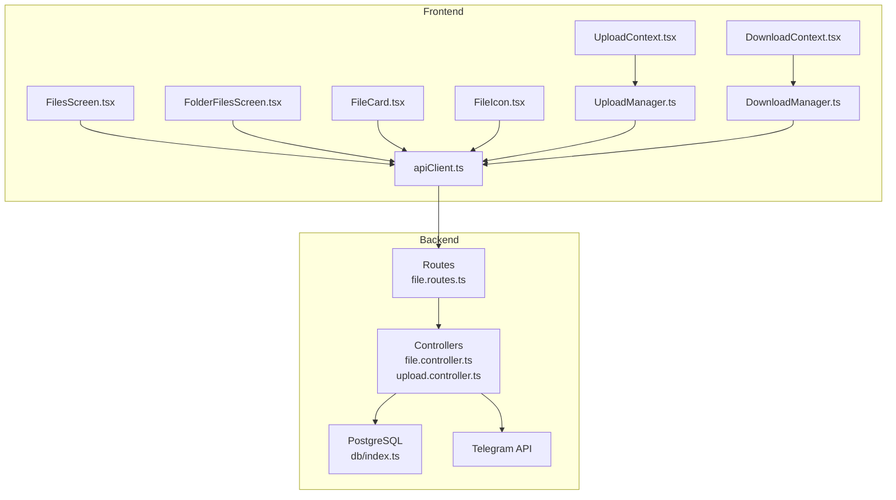
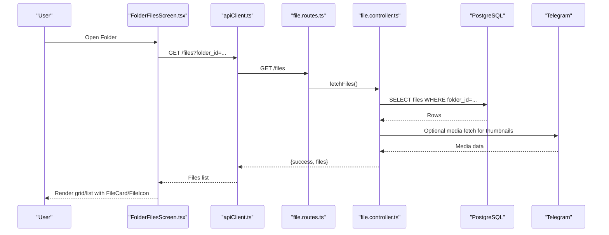
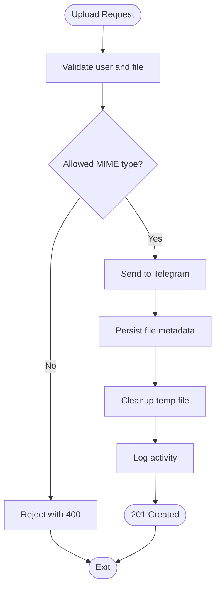
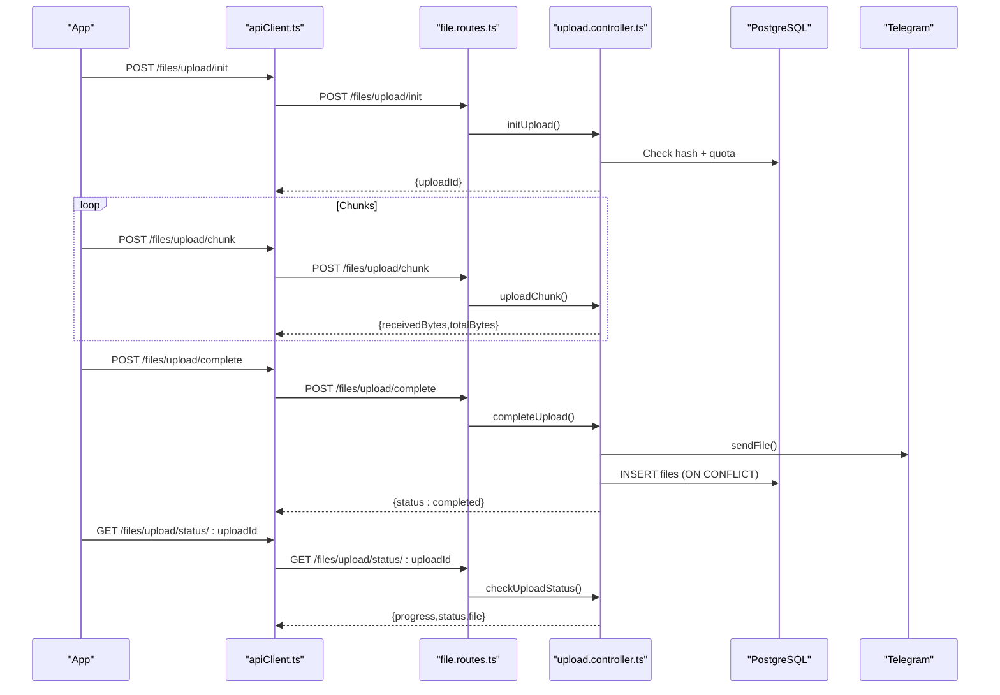
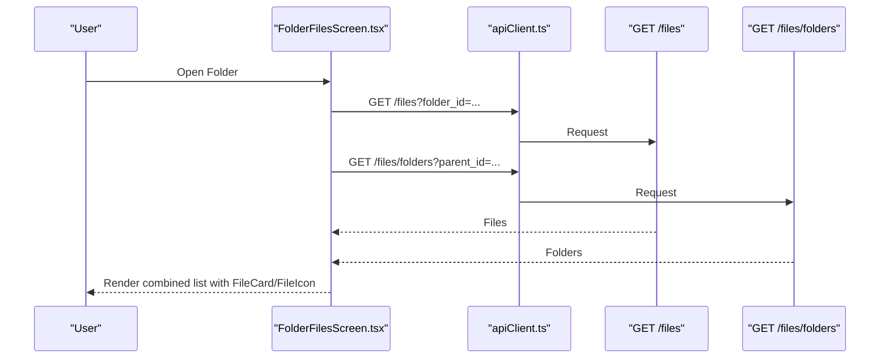
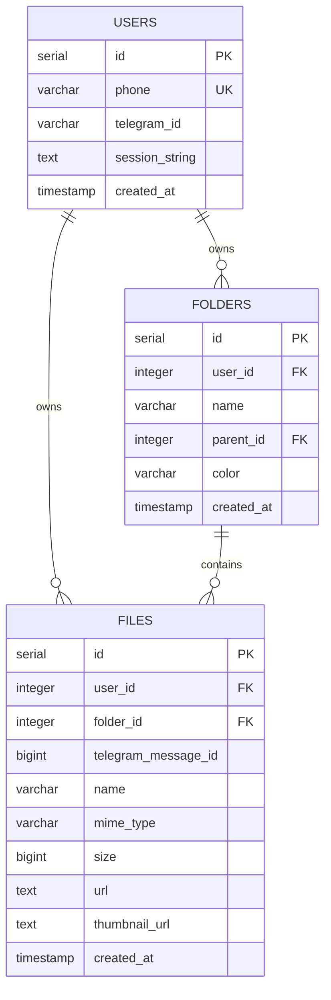
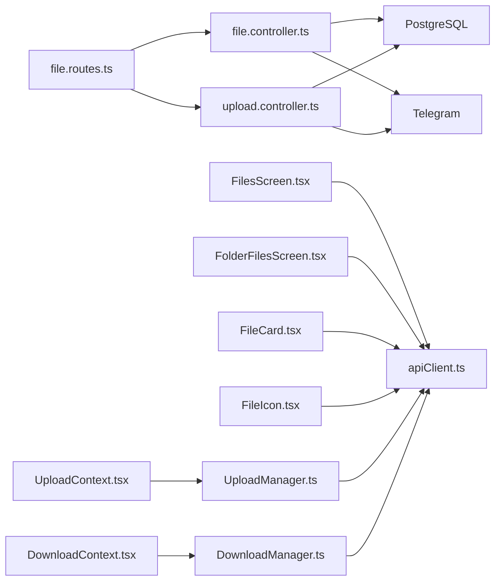

# File Management System

<cite>
**Referenced Files in This Document**
- [file.controller.ts](file://server/src/controllers/file.controller.ts)
- [file.routes.ts](file://server/src/routes/file.routes.ts)
- [upload.controller.ts](file://server/src/controllers/upload.controller.ts)
- [FilesScreen.tsx](file://app/src/screens/FilesScreen.tsx)
- [FolderFilesScreen.tsx](file://app/src/screens/FolderFilesScreen.tsx)
- [FileCard.tsx](file://app/src/components/FileCard.tsx)
- [FileIcon.tsx](file://app/src/components/FileIcon.tsx)
- [FileListComponent.tsx](file://app/src/components/FileListComponent.tsx)
- [apiClient.ts](file://app/src/services/apiClient.ts)
- [UploadManager.ts](file://app/src/services/UploadManager.ts)
- [DownloadManager.ts](file://app/src/services/DownloadManager.ts)
- [UploadContext.tsx](file://app/src/context/UploadContext.tsx)
- [DownloadContext.tsx](file://app/src/context/DownloadContext.tsx)
- [db/index.ts](file://server/src/db/index.ts)
</cite>

## Table of Contents
1. [Introduction](#introduction)
2. [Project Structure](#project-structure)
3. [Core Components](#core-components)
4. [Architecture Overview](#architecture-overview)
5. [Detailed Component Analysis](#detailed-component-analysis)
6. [Dependency Analysis](#dependency-analysis)
7. [Performance Considerations](#performance-considerations)
8. [Troubleshooting Guide](#troubleshooting-guide)
9. [Conclusion](#conclusion)
10. [Appendices](#appendices)

## Introduction
This document describes the file management system with a focus on CRUD operations, folder organization, and file metadata management. It explains the complete file lifecycle from upload through deletion, including backend controller implementations, route organization, and frontend display components. It also covers folder hierarchy management, breadcrumb navigation, file sorting capabilities, trash management, file type detection, thumbnail generation, progress tracking during operations, and error handling strategies. Implementation guidelines are included for extending features and integrating with other system components.

## Project Structure
The file management system spans a Node.js/Express backend and a React Native mobile frontend. The backend exposes REST endpoints for file operations and integrates with a PostgreSQL database and Telegram for media storage. The frontend provides screens for browsing files and folders, managing uploads and downloads, and displaying metadata and thumbnails.

**Diagram sources**
- [file.routes.ts](file://server/src/routes/file.routes.ts#L1-L118)
- [file.controller.ts](file://server/src/controllers/file.controller.ts#L1-L1090)
- [upload.controller.ts](file://server/src/controllers/upload.controller.ts#L1-L540)
- [db/index.ts](file://server/src/db/index.ts#L1-L56)
- [FilesScreen.tsx](file://app/src/screens/FilesScreen.tsx#L1-L403)
- [FolderFilesScreen.tsx](file://app/src/screens/FolderFilesScreen.tsx#L1-L798)
- [FileCard.tsx](file://app/src/components/FileCard.tsx#L1-L119)
- [FileIcon.tsx](file://app/src/components/FileIcon.tsx#L1-L48)
- [UploadContext.tsx](file://app/src/context/UploadContext.tsx#L1-L123)
- [DownloadContext.tsx](file://app/src/context/DownloadContext.tsx#L1-L94)
- [UploadManager.ts](file://app/src/services/UploadManager.ts#L1-L992)
- [DownloadManager.ts](file://app/src/services/DownloadManager.ts#L1-L323)
- [apiClient.ts](file://app/src/services/apiClient.ts#L1-L164)

**Section sources**
- [file.routes.ts](file://server/src/routes/file.routes.ts#L1-L118)
- [file.controller.ts](file://server/src/controllers/file.controller.ts#L1-L1090)
- [upload.controller.ts](file://server/src/controllers/upload.controller.ts#L1-L540)
- [db/index.ts](file://server/src/db/index.ts#L1-L56)
- [FilesScreen.tsx](file://app/src/screens/FilesScreen.tsx#L1-L403)
- [FolderFilesScreen.tsx](file://app/src/screens/FolderFilesScreen.tsx#L1-L798)
- [FileCard.tsx](file://app/src/components/FileCard.tsx#L1-L119)
- [FileIcon.tsx](file://app/src/components/FileIcon.tsx#L1-L48)
- [UploadContext.tsx](file://app/src/context/UploadContext.tsx#L1-L123)
- [DownloadContext.tsx](file://app/src/context/DownloadContext.tsx#L1-L94)
- [UploadManager.ts](file://app/src/services/UploadManager.ts#L1-L992)
- [DownloadManager.ts](file://app/src/services/DownloadManager.ts#L1-L323)
- [apiClient.ts](file://app/src/services/apiClient.ts#L1-L164)

## Core Components
- Backend Controllers
  - File operations: upload, list, search, update, star/unstar, trash/restore/delete, download, stream, thumbnail, folders CRUD, tags, stats/activity, recently accessed, bulk actions.
  - Upload pipeline: init, chunk upload, complete, cancel, status polling.
- Frontend Screens and Components
  - Files screen with sorting, filtering, search, and action modals.
  - Folder files screen with breadcrumb navigation, grid/list view, multi-select, and bulk actions.
  - File card and icon components for metadata and thumbnails.
  - Upload and download managers with progress tracking and notifications.
  - API client with interceptors and retry logic.
- Database Schema
  - Users, folders, and files tables with foreign keys and indexes.

**Section sources**
- [file.controller.ts](file://server/src/controllers/file.controller.ts#L49-L98)
- [file.controller.ts](file://server/src/controllers/file.controller.ts#L103-L133)
- [file.controller.ts](file://server/src/controllers/file.controller.ts#L138-L203)
- [file.controller.ts](file://server/src/controllers/file.controller.ts#L208-L244)
- [file.controller.ts](file://server/src/controllers/file.controller.ts#L285-L351)
- [file.controller.ts](file://server/src/controllers/file.controller.ts#L413-L441)
- [file.controller.ts](file://server/src/controllers/file.controller.ts#L614-L689)
- [file.controller.ts](file://server/src/controllers/file.controller.ts#L453-L541)
- [file.controller.ts](file://server/src/controllers/file.controller.ts#L695-L718)
- [file.controller.ts](file://server/src/controllers/file.controller.ts#L723-L759)
- [file.controller.ts](file://server/src/controllers/file.controller.ts#L764-L800)
- [upload.controller.ts](file://server/src/controllers/upload.controller.ts#L136-L268)
- [upload.controller.ts](file://server/src/controllers/upload.controller.ts#L271-L314)
- [upload.controller.ts](file://server/src/controllers/upload.controller.ts#L317-L482)
- [upload.controller.ts](file://server/src/controllers/upload.controller.ts#L494-L514)
- [upload.controller.ts](file://server/src/controllers/upload.controller.ts#L517-L539)
- [FilesScreen.tsx](file://app/src/screens/FilesScreen.tsx#L55-L100)
- [FolderFilesScreen.tsx](file://app/src/screens/FolderFilesScreen.tsx#L121-L241)
- [FileCard.tsx](file://app/src/components/FileCard.tsx#L32-L67)
- [FileIcon.tsx](file://app/src/components/FileIcon.tsx#L16-L47)
- [UploadManager.ts](file://app/src/services/UploadManager.ts#L514-L556)
- [UploadManager.ts](file://app/src/services/UploadManager.ts#L800-L992)
- [DownloadManager.ts](file://app/src/services/DownloadManager.ts#L153-L174)
- [DownloadManager.ts](file://app/src/services/DownloadManager.ts#L268-L318)
- [apiClient.ts](file://app/src/services/apiClient.ts#L31-L42)
- [db/index.ts](file://server/src/db/index.ts#L12-L56)

## Architecture Overview
The system follows a layered architecture:
- Routes define endpoints and apply authentication middleware.
- Controllers implement business logic, interact with the database and Telegram, and manage caching for thumbnails and streams.
- Services encapsulate Telegram client creation and database operations.
- Frontend screens consume REST endpoints via an API client with interceptors for logging, retries, and server waking UI.
- Managers orchestrate asynchronous operations like uploads and downloads with progress tracking and notifications.

**Diagram sources**
- [FolderFilesScreen.tsx](file://app/src/screens/FolderFilesScreen.tsx#L188-L241)
- [apiClient.ts](file://app/src/services/apiClient.ts#L1-L164)
- [file.routes.ts](file://server/src/routes/file.routes.ts#L91-L91)
- [file.controller.ts](file://server/src/controllers/file.controller.ts#L103-L133)
- [db/index.ts](file://server/src/db/index.ts#L36-L48)

**Section sources**
- [file.routes.ts](file://server/src/routes/file.routes.ts#L1-L118)
- [file.controller.ts](file://server/src/controllers/file.controller.ts#L1-L1090)
- [apiClient.ts](file://app/src/services/apiClient.ts#L1-L164)
- [db/index.ts](file://server/src/db/index.ts#L1-L56)

## Detailed Component Analysis

### Backend Controllers: File Operations
- Upload
  - Validates file type against allowed MIME prefixes, uploads to Telegram via a dynamic client, persists metadata to the database, logs activity, and cleans temporary files.
  - Enforces allowed types and rejects unsupported files early.
- List and Search
  - Supports server-side sorting and pagination, filters by folder, and merges folder and file results for unified search.
- Update and Star
  - Updates file metadata (rename/move) and toggles starred status atomically.
- Trash and Restore
  - Soft-deletes by marking is_trashed; restores by unmarking; permanent delete removes records and Telegram messages.
- Download and Stream
  - Downloads buffers for one-shot saves; streams with disk caching and HTTP Range support for media playback.
- Thumbnails
  - Attempts native Telegram thumbnails, falls back to Sharp-compressed images, and caches to disk for performance.
- Folders CRUD
  - Create, list with sorting, update with duplicate checks, and trash/delete folders.

**Diagram sources**
- [file.controller.ts](file://server/src/controllers/file.controller.ts#L49-L98)

**Section sources**
- [file.controller.ts](file://server/src/controllers/file.controller.ts#L49-L98)
- [file.controller.ts](file://server/src/controllers/file.controller.ts#L103-L133)
- [file.controller.ts](file://server/src/controllers/file.controller.ts#L138-L203)
- [file.controller.ts](file://server/src/controllers/file.controller.ts#L208-L244)
- [file.controller.ts](file://server/src/controllers/file.controller.ts#L285-L351)
- [file.controller.ts](file://server/src/controllers/file.controller.ts#L413-L441)
- [file.controller.ts](file://server/src/controllers/file.controller.ts#L614-L689)
- [file.controller.ts](file://server/src/controllers/file.controller.ts#L453-L541)
- [file.controller.ts](file://server/src/controllers/file.controller.ts#L695-L718)
- [file.controller.ts](file://server/src/controllers/file.controller.ts#L723-L759)
- [file.controller.ts](file://server/src/controllers/file.controller.ts#L764-L800)

### Backend Controllers: Upload Pipeline
- Initialization
  - Deduplicates by SHA256/MD5 hash, checks storage quotas, and prepares upload state with chunk ordering guards.
- Chunk Upload
  - Validates chunk indices, writes to disk, and tracks received bytes.
- Completion
  - Computes hashes, retries Telegram uploads with backoff, inserts into DB with conflict handling, and updates progress.
- Status Polling
  - Returns progress and status for UI polling until completion or error.
- Cancellation
  - Marks state as cancelled and cleans up temp files.

**Diagram sources**
- [upload.controller.ts](file://server/src/controllers/upload.controller.ts#L136-L268)
- [upload.controller.ts](file://server/src/controllers/upload.controller.ts#L271-L314)
- [upload.controller.ts](file://server/src/controllers/upload.controller.ts#L317-L482)
- [upload.controller.ts](file://server/src/controllers/upload.controller.ts#L517-L539)
- [file.routes.ts](file://server/src/routes/file.routes.ts#L84-L88)
- [file.routes.ts](file://server/src/routes/file.routes.ts#L89-L89)
- [file.routes.ts](file://server/src/routes/file.routes.ts#L89-L89)
- [file.routes.ts](file://server/src/routes/file.routes.ts#L89-L89)
- [file.routes.ts](file://server/src/routes/file.routes.ts#L89-L89)

**Section sources**
- [upload.controller.ts](file://server/src/controllers/upload.controller.ts#L136-L268)
- [upload.controller.ts](file://server/src/controllers/upload.controller.ts#L271-L314)
- [upload.controller.ts](file://server/src/controllers/upload.controller.ts#L317-L482)
- [upload.controller.ts](file://server/src/controllers/upload.controller.ts#L517-L539)
- [file.routes.ts](file://server/src/routes/file.routes.ts#L84-L88)
- [file.routes.ts](file://server/src/routes/file.routes.ts#L89-L89)

### Frontend Screens: Files and Folders
- Files Screen
  - Server-side sorting by created_at/name/size; client-side filtering by type and search; pagination and debounced access tracking.
- Folder Files Screen
  - Breadcrumb navigation; grid/list view; multi-select and bulk actions; rename, move, trash; share link creation; tags; and search within a folder.
- File Card and Icon
  - Renders metadata and icons; uses thumbnail endpoint for media previews.
- Upload and Download Managers
  - UploadManager orchestrates chunked uploads with deduplication, retries, progress, and notifications; DownloadManager manages downloads with progress and sharing.

**Diagram sources**
- [FolderFilesScreen.tsx](file://app/src/screens/FolderFilesScreen.tsx#L188-L241)
- [apiClient.ts](file://app/src/services/apiClient.ts#L1-L164)

**Section sources**
- [FilesScreen.tsx](file://app/src/screens/FilesScreen.tsx#L55-L100)
- [FolderFilesScreen.tsx](file://app/src/screens/FolderFilesScreen.tsx#L121-L241)
- [FileCard.tsx](file://app/src/components/FileCard.tsx#L32-L67)
- [FileIcon.tsx](file://app/src/components/FileIcon.tsx#L16-L47)
- [UploadManager.ts](file://app/src/services/UploadManager.ts#L514-L556)
- [DownloadManager.ts](file://app/src/services/DownloadManager.ts#L153-L174)

### Database Interactions
- Users table stores user identifiers and session data.
- Folders table supports hierarchical organization with parent_id and color.
- Files table stores metadata, Telegram identifiers, and trash flags.

**Diagram sources**
- [db/index.ts](file://server/src/db/index.ts#L15-L48)

**Section sources**
- [db/index.ts](file://server/src/db/index.ts#L12-L56)

## Dependency Analysis
- Route-to-Controller mapping defines all endpoints for file and upload operations.
- Controllers depend on:
  - Database pool for queries.
  - Telegram service for media operations.
  - File system for caching and temp files.
  - Sharp for image optimization.
- Frontend depends on:
  - API client for HTTP requests.
  - Upload/Download managers for async operations.
  - Context providers for state management.

**Diagram sources**
- [file.routes.ts](file://server/src/routes/file.routes.ts#L1-L118)
- [file.controller.ts](file://server/src/controllers/file.controller.ts#L1-L1090)
- [upload.controller.ts](file://server/src/controllers/upload.controller.ts#L1-L540)
- [FilesScreen.tsx](file://app/src/screens/FilesScreen.tsx#L1-L403)
- [FolderFilesScreen.tsx](file://app/src/screens/FolderFilesScreen.tsx#L1-L798)
- [FileCard.tsx](file://app/src/components/FileCard.tsx#L1-L119)
- [FileIcon.tsx](file://app/src/components/FileIcon.tsx#L1-L48)
- [UploadContext.tsx](file://app/src/context/UploadContext.tsx#L1-L123)
- [DownloadContext.tsx](file://app/src/context/DownloadContext.tsx#L1-L94)
- [UploadManager.ts](file://app/src/services/UploadManager.ts#L1-L992)
- [DownloadManager.ts](file://app/src/services/DownloadManager.ts#L1-L323)
- [apiClient.ts](file://app/src/services/apiClient.ts#L1-L164)

**Section sources**
- [file.routes.ts](file://server/src/routes/file.routes.ts#L1-L118)
- [file.controller.ts](file://server/src/controllers/file.controller.ts#L1-L1090)
- [upload.controller.ts](file://server/src/controllers/upload.controller.ts#L1-L540)
- [apiClient.ts](file://app/src/services/apiClient.ts#L1-L164)

## Performance Considerations
- Thumbnail Generation
  - Disk cache with TTL to avoid repeated Telegram downloads and Sharp recompression.
- Streaming
  - Disk-cached streaming with HTTP Range support and download locks to prevent redundant downloads.
- Upload Pipeline
  - Semaphore limits concurrent Telegram uploads; chunked uploads with base64 encoding on web and native FileHandle API on mobile; exponential backoff and retry; deduplication by hash; progress tracking; and idempotent completion.
- Frontend Rendering
  - Memoized file items, getItemLayout for FlatList, and client-side pagination reduce rendering overhead.

[No sources needed since this section provides general guidance]

## Troubleshooting Guide
- Upload Failures
  - Check uploadId validity, chunk ordering, and server status polling. Inspect error messages from Telegram (e.g., FLOOD_WAIT) and handle retries accordingly.
- Download Issues
  - Verify Authorization header, file existence on server, and local storage permissions. Use DownloadManager’s progress and notifications to diagnose.
- Thumbnail Problems
  - Confirm cache directory creation and permissions; ensure Sharp is available and fallback to native Telegram thumbnails when possible.
- Authentication and Rate Limiting
  - Ensure JWT is attached to requests; review rate limit configurations for upload endpoints.

**Section sources**
- [upload.controller.ts](file://server/src/controllers/upload.controller.ts#L39-L71)
- [upload.controller.ts](file://server/src/controllers/upload.controller.ts#L517-L539)
- [DownloadManager.ts](file://app/src/services/DownloadManager.ts#L268-L318)
- [file.controller.ts](file://server/src/controllers/file.controller.ts#L453-L541)
- [file.routes.ts](file://server/src/routes/file.routes.ts#L60-L81)

## Conclusion
The file management system provides robust CRUD operations, organized folder hierarchies, and efficient media handling through Telegram. The backend controllers implement comprehensive file lifecycle management with caching and streaming optimizations, while the frontend offers intuitive screens with sorting, filtering, and progress tracking. The modular design enables straightforward extension for additional features and integration with other system components.

[No sources needed since this section summarizes without analyzing specific files]

## Appendices

### API Endpoint Reference
- File CRUD
  - GET /files (list with pagination and sorting)
  - GET /files/search (search files and folders)
  - PATCH /files/:id (update file name/folder)
  - PATCH /files/:id/star (toggle starred)
  - GET /files/starred (list starred)
  - PATCH /files/:id/trash (move to trash)
  - PATCH /files/:id/restore (restore from trash)
  - DELETE /files/:id (permanent delete)
  - GET /files/:id/download (buffered download)
  - GET /files/:id/stream (stream with Range)
  - GET /files/:id/thumbnail (thumbnail with cache)
- Folders
  - POST /files/folder (create)
  - GET /files/folders (list with sorting)
  - PATCH /files/folder/:id (update)
  - DELETE /files/folder/:id (trash folder)
- Upload Pipeline
  - POST /files/upload/init
  - POST /files/upload/chunk
  - POST /files/upload/complete
  - POST /files/upload/cancel
  - GET /files/upload/status/:uploadId

**Section sources**
- [file.routes.ts](file://server/src/routes/file.routes.ts#L27-L116)

### Frontend Components and Behaviors
- FilesScreen
  - Server-side sort keys mapped to query parameters; client-side filter and search; pagination and refresh control.
- FolderFilesScreen
  - Breadcrumb navigation; grid/list toggle; multi-select and bulk actions; rename, move, trash; share link and tags; search within folder.
- FileCard and FileIcon
  - Metadata display; thumbnail loading with fallback; icon selection based on MIME type.
- UploadContext and DownloadContext
  - Global state for upload/download queues; progress and notifications; actions to manage tasks.

**Section sources**
- [FilesScreen.tsx](file://app/src/screens/FilesScreen.tsx#L26-L52)
- [FilesScreen.tsx](file://app/src/screens/FilesScreen.tsx#L88-L100)
- [FolderFilesScreen.tsx](file://app/src/screens/FolderFilesScreen.tsx#L27-L46)
- [FolderFilesScreen.tsx](file://app/src/screens/FolderFilesScreen.tsx#L188-L241)
- [FileCard.tsx](file://app/src/components/FileCard.tsx#L32-L67)
- [FileIcon.tsx](file://app/src/components/FileIcon.tsx#L16-L47)
- [UploadContext.tsx](file://app/src/context/UploadContext.tsx#L51-L114)
- [DownloadContext.tsx](file://app/src/context/DownloadContext.tsx#L29-L84)