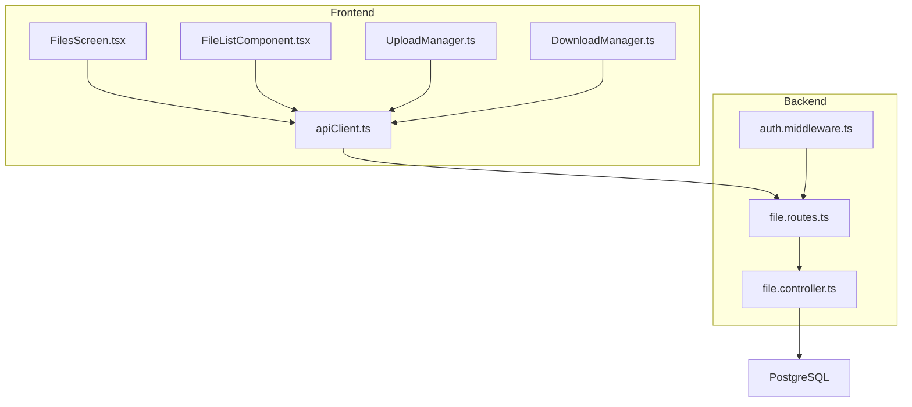
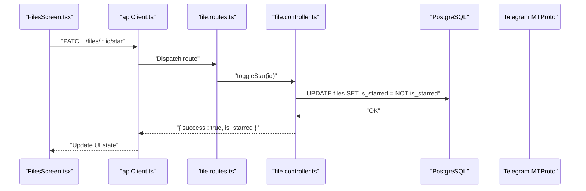
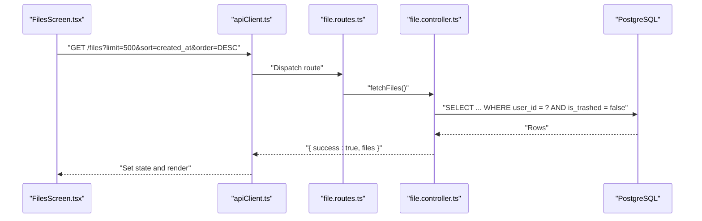
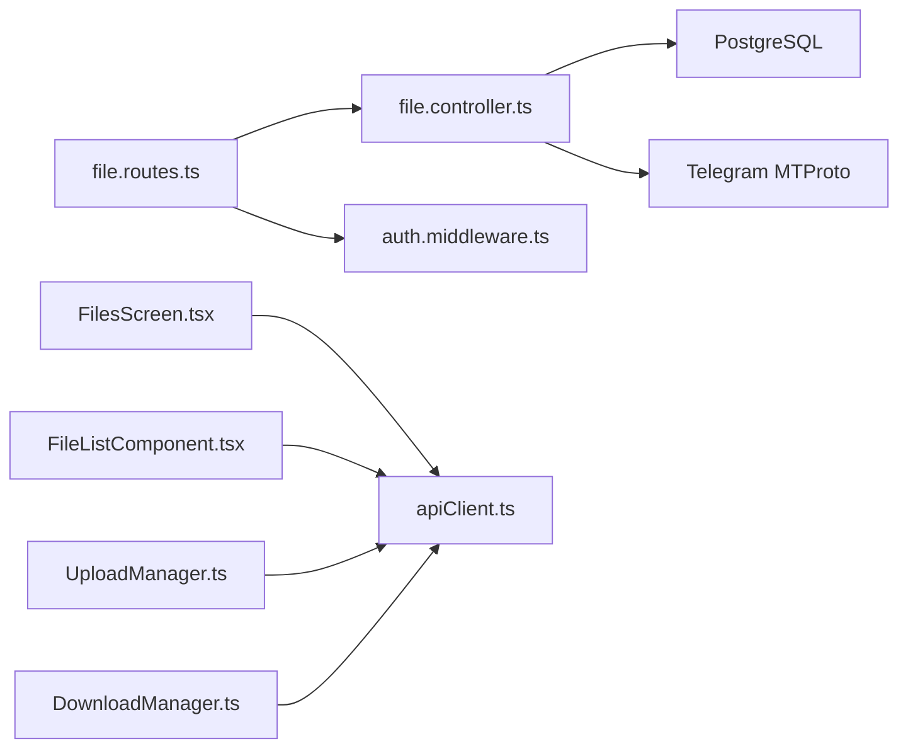

# File Operations

<cite>
**Referenced Files in This Document**
- [file.controller.ts](file://server/src/controllers/file.controller.ts)
- [file.routes.ts](file://server/src/routes/file.routes.ts)
- [auth.middleware.ts](file://server/src/middlewares/auth.middleware.ts)
- [FilesScreen.tsx](file://app/src/screens/FilesScreen.tsx)
- [FileListComponent.tsx](file://app/src/components/FileListComponent.tsx)
- [apiClient.ts](file://app/src/services/apiClient.ts)
- [UploadManager.ts](file://app/src/services/UploadManager.ts)
- [DownloadManager.ts](file://app/src/services/DownloadManager.ts)
</cite>

## Table of Contents
1. [Introduction](#introduction)
2. [Project Structure](#project-structure)
3. [Core Components](#core-components)
4. [Architecture Overview](#architecture-overview)
5. [Detailed Component Analysis](#detailed-component-analysis)
6. [Dependency Analysis](#dependency-analysis)
7. [Performance Considerations](#performance-considerations)
8. [Troubleshooting Guide](#troubleshooting-guide)
9. [Conclusion](#conclusion)

## Introduction
This document explains the file management system’s CRUD operations and related workflows in the teledrive project. It covers:
- Backend controllers and routes for upload, download, rename/move, star/unstar, soft delete/trash, restore, and permanent delete
- Frontend integration patterns for FilesScreen and FileListComponent
- Authentication, error handling, validation, and security considerations
- HTTP endpoint definitions and request/response characteristics

## Project Structure
The file operations span three layers:
- Backend: Express routes define endpoints; controllers implement business logic; middleware enforces authentication
- Database: PostgreSQL stores file metadata and user records
- Frontend: React Native screens and services orchestrate uploads/downloads and interact with backend APIs

**Diagram sources**
- [file.routes.ts](file://server/src/routes/file.routes.ts#L1-L118)
- [file.controller.ts](file://server/src/controllers/file.controller.ts#L1-L1121)
- [auth.middleware.ts](file://server/src/middlewares/auth.middleware.ts#L1-L82)
- [apiClient.ts](file://app/src/services/apiClient.ts#L1-L164)
- [UploadManager.ts](file://app/src/services/UploadManager.ts#L1-L992)
- [DownloadManager.ts](file://app/src/services/DownloadManager.ts#L1-L323)

**Section sources**
- [file.routes.ts](file://server/src/routes/file.routes.ts#L1-L118)
- [file.controller.ts](file://server/src/controllers/file.controller.ts#L1-L1121)
- [auth.middleware.ts](file://server/src/middlewares/auth.middleware.ts#L1-L82)
- [apiClient.ts](file://app/src/services/apiClient.ts#L1-L164)
- [UploadManager.ts](file://app/src/services/UploadManager.ts#L1-L992)
- [DownloadManager.ts](file://app/src/services/DownloadManager.ts#L1-L323)

## Core Components
- Controllers implement all file operations:
  - Upload, list, search
  - Rename/move, star/unstar, trash, restore, delete
  - Thumbnails and streaming
- Routes define HTTP endpoints and apply authentication middleware
- Middleware validates JWT and supports share-link token bypass for public downloads
- Frontend integrates via apiClient, UploadManager, and DownloadManager

**Section sources**
- [file.controller.ts](file://server/src/controllers/file.controller.ts#L49-L351)
- [file.routes.ts](file://server/src/routes/file.routes.ts#L1-L118)
- [auth.middleware.ts](file://server/src/middlewares/auth.middleware.ts#L19-L81)
- [apiClient.ts](file://app/src/services/apiClient.ts#L46-L85)

## Architecture Overview
The backend enforces authentication for all file endpoints. Controllers interact with PostgreSQL and Telegram MTProto to persist and retrieve media. Frontend clients use apiClient to send authenticated requests and manage uploads/downloads via UploadManager and DownloadManager.

**Diagram sources**
- [file.routes.ts](file://server/src/routes/file.routes.ts#L40-L40)
- [file.controller.ts](file://server/src/controllers/file.controller.ts#L249-L264)
- [apiClient.ts](file://app/src/services/apiClient.ts#L46-L85)

## Detailed Component Analysis

### Backend Controllers: File Operations
- Upload
  - Validates presence of file and user, checks allowed MIME types, sends to Telegram, persists metadata, logs activity, removes temp file
  - Size limit enforced by multer route-level configuration
- List/Search
  - List supports pagination and sorting; Search merges files and folders with pagination
- Rename/Move
  - Updates file_name and/or folder_id; ensures non-trash constraint
- Star/Unstar
  - Toggles is_starred flag atomically
- Trash/Restore/Delete
  - Soft delete sets is_trashed and trashed_at; Restore reverses; Permanent delete removes DB record and Telegram message
- Download/Stream/Thumbnail
  - Download returns buffer; Stream uses disk cache with Range support; Thumbnail caches and compresses images

Security and validation highlights:
- Authentication required for all file endpoints except public share-link downloads
- Allowed MIME types enforced on upload
- Rate limiting applied to upload-related endpoints
- Activity logging for auditability

**Section sources**
- [file.controller.ts](file://server/src/controllers/file.controller.ts#L49-L98)
- [file.controller.ts](file://server/src/controllers/file.controller.ts#L103-L133)
- [file.controller.ts](file://server/src/controllers/file.controller.ts#L138-L203)
- [file.controller.ts](file://server/src/controllers/file.controller.ts#L208-L244)
- [file.controller.ts](file://server/src/controllers/file.controller.ts#L249-L264)
- [file.controller.ts](file://server/src/controllers/file.controller.ts#L285-L351)
- [file.controller.ts](file://server/src/controllers/file.controller.ts#L413-L441)
- [file.controller.ts](file://server/src/controllers/file.controller.ts#L614-L689)
- [file.controller.ts](file://server/src/controllers/file.controller.ts#L453-L541)

### HTTP Endpoints and Schemas
All endpoints require authentication except public downloads/thumbnails via share-link token.

- GET /files
  - Query: limit, offset, folder_id, sort, order
  - Response: { success: boolean, files: File[] }
- GET /files/search
  - Query: q, type, folder_id, limit, offset
  - Response: { success: boolean, results, pagination }
- GET /files/starred
  - Response: { success: boolean, files: File[] }
- PATCH /files/:id/star
  - Response: { success: boolean, is_starred: boolean }
- GET /files/:id/download
  - Response: Binary stream (Content-Disposition attachment)
- GET /files/:id/stream
  - Response: Binary stream with Range support
- GET /files/:id/thumbnail
  - Response: Image stream (WebP or original)
- PATCH /files/:id
  - Body: { folder_id?, file_name? }
  - Response: { success: boolean, file: File }
- DELETE /files/:id
  - Response: { success: boolean, message: string }
- GET /files/trash
  - Response: { success: boolean, files: File[] }
- PATCH /files/:id/trash
  - Response: { success: boolean, message: string }
- PATCH /files/:id/restore
  - Response: { success: boolean, message: string }
- DELETE /files/trash
  - Response: { success: boolean, message: string }

Notes:
- Pagination is supported for list/search; defaults vary by endpoint
- Sorting columns are validated to prevent SQL injection
- Share-link token bypass is supported for GET /files/:id/download, /files/:id/stream, /files/:id/thumbnail

**Section sources**
- [file.routes.ts](file://server/src/routes/file.routes.ts#L32-L46)
- [file.routes.ts](file://server/src/routes/file.routes.ts#L83-L115)
- [file.controller.ts](file://server/src/controllers/file.controller.ts#L103-L133)
- [file.controller.ts](file://server/src/controllers/file.controller.ts#L138-L203)
- [file.controller.ts](file://server/src/controllers/file.controller.ts#L269-L280)
- [file.controller.ts](file://server/src/controllers/file.controller.ts#L249-L264)
- [file.controller.ts](file://server/src/controllers/file.controller.ts#L413-L441)
- [file.controller.ts](file://server/src/controllers/file.controller.ts#L614-L689)
- [file.controller.ts](file://server/src/controllers/file.controller.ts#L453-L541)
- [auth.middleware.ts](file://server/src/middlewares/auth.middleware.ts#L19-L52)

### Frontend Integration Patterns
- FilesScreen
  - Loads files with server-side sort and client-side filtering
  - Triggers trash/star actions via PATCH endpoints
  - Navigates to preview with filtered list and index
- FileListComponent
  - Renders folders and files; exposes download callback for files
- apiClient
  - Injects Authorization header and manages retries and timeouts
- UploadManager
  - Implements chunked uploads with polling, deduplication, and progress
- DownloadManager
  - Queues and performs downloads with progress and sharing

**Diagram sources**
- [FilesScreen.tsx](file://app/src/screens/FilesScreen.tsx#L88-L100)
- [file.routes.ts](file://server/src/routes/file.routes.ts#L91-L91)
- [file.controller.ts](file://server/src/controllers/file.controller.ts#L103-L133)

**Section sources**
- [FilesScreen.tsx](file://app/src/screens/FilesScreen.tsx#L55-L100)
- [FileListComponent.tsx](file://app/src/components/FileListComponent.tsx#L19-L56)
- [apiClient.ts](file://app/src/services/apiClient.ts#L46-L85)
- [UploadManager.ts](file://app/src/services/UploadManager.ts#L514-L556)
- [DownloadManager.ts](file://app/src/services/DownloadManager.ts#L153-L174)

### Error Handling, Authentication, and Validation
- Authentication
  - Standard JWT bearer token required for most endpoints
  - Share-link token bypass allows public access to download/stream/thumbnail when valid
- Error handling
  - Controllers return structured { success, error } responses
  - Frontend interceptors log requests and retry transient failures
- Validation
  - Upload: MIME type whitelist, size limit enforced by multer
  - Update: At least one field must be provided
  - Trash/Restore/Delete: Respect ownership and trashed constraints

**Section sources**
- [auth.middleware.ts](file://server/src/middlewares/auth.middleware.ts#L19-L81)
- [file.controller.ts](file://server/src/controllers/file.controller.ts#L15-L22)
- [file.routes.ts](file://server/src/routes/file.routes.ts#L19-L22)
- [file.controller.ts](file://server/src/controllers/file.controller.ts#L208-L244)
- [apiClient.ts](file://app/src/services/apiClient.ts#L100-L131)

### Security Considerations
- JWT secret must be configured; otherwise server startup fails
- Share-link token bypass is restricted to specific GET endpoints and verified against share records
- Rate limiting protects upload endpoints from abuse
- Activity logging tracks sensitive actions for auditing

**Section sources**
- [auth.middleware.ts](file://server/src/middlewares/auth.middleware.ts#L5-L6)
- [auth.middleware.ts](file://server/src/middlewares/auth.middleware.ts#L23-L52)
- [file.routes.ts](file://server/src/routes/file.routes.ts#L60-L81)
- [file.controller.ts](file://server/src/controllers/file.controller.ts#L24-L31)

## Dependency Analysis
- Controllers depend on:
  - Database pool for queries
  - Telegram client for media operations
  - Logger for activity and errors
- Routes depend on:
  - Multer for upload limits
  - Rate limiters for upload endpoints
  - Authentication middleware
- Frontend depends on:
  - apiClient for authenticated requests
  - UploadManager/DownloadManager for robust transfers

**Diagram sources**
- [file.routes.ts](file://server/src/routes/file.routes.ts#L1-L118)
- [file.controller.ts](file://server/src/controllers/file.controller.ts#L1-L1121)
- [auth.middleware.ts](file://server/src/middlewares/auth.middleware.ts#L1-L82)
- [apiClient.ts](file://app/src/services/apiClient.ts#L1-L164)
- [UploadManager.ts](file://app/src/services/UploadManager.ts#L1-L992)
- [DownloadManager.ts](file://app/src/services/DownloadManager.ts#L1-L323)

**Section sources**
- [file.routes.ts](file://server/src/routes/file.routes.ts#L1-L118)
- [file.controller.ts](file://server/src/controllers/file.controller.ts#L1-L1121)
- [auth.middleware.ts](file://server/src/middlewares/auth.middleware.ts#L1-L82)
- [apiClient.ts](file://app/src/services/apiClient.ts#L1-L164)
- [UploadManager.ts](file://app/src/services/UploadManager.ts#L1-L992)
- [DownloadManager.ts](file://app/src/services/DownloadManager.ts#L1-L323)

## Performance Considerations
- Streaming with disk cache and Range support reduces latency and bandwidth
- Thumbnail generation caches compressed WebP images and uses Sharp for optimization
- UploadManager chunks files and polls progress; concurrency capped to balance throughput and stability
- Pagination and server-side sorting reduce payload sizes

[No sources needed since this section provides general guidance]

## Troubleshooting Guide
Common issues and resolutions:
- Unauthorized errors
  - Ensure Authorization header is present and valid; verify JWT_SECRET is configured
- Upload failures
  - Check MIME type allowed list and size limits; review rate limit responses
- Download/stream errors
  - Verify file exists in Telegram; confirm share-link token validity for public links
- UI not updating after actions
  - Confirm PATCH endpoints return success and client updates state accordingly

**Section sources**
- [auth.middleware.ts](file://server/src/middlewares/auth.middleware.ts#L57-L80)
- [file.routes.ts](file://server/src/routes/file.routes.ts#L19-L22)
- [file.controller.ts](file://server/src/controllers/file.controller.ts#L63-L96)
- [file.controller.ts](file://server/src/controllers/file.controller.ts#L413-L441)
- [FilesScreen.tsx](file://app/src/screens/FilesScreen.tsx#L112-L135)

## Conclusion
The file management system provides a robust, authenticated CRUD surface backed by PostgreSQL and Telegram MTProto. The backend enforces validation and security, while the frontend offers resilient upload/download experiences with progress tracking and retry logic. Adhering to the documented endpoints, schemas, and security practices ensures reliable operation across platforms.