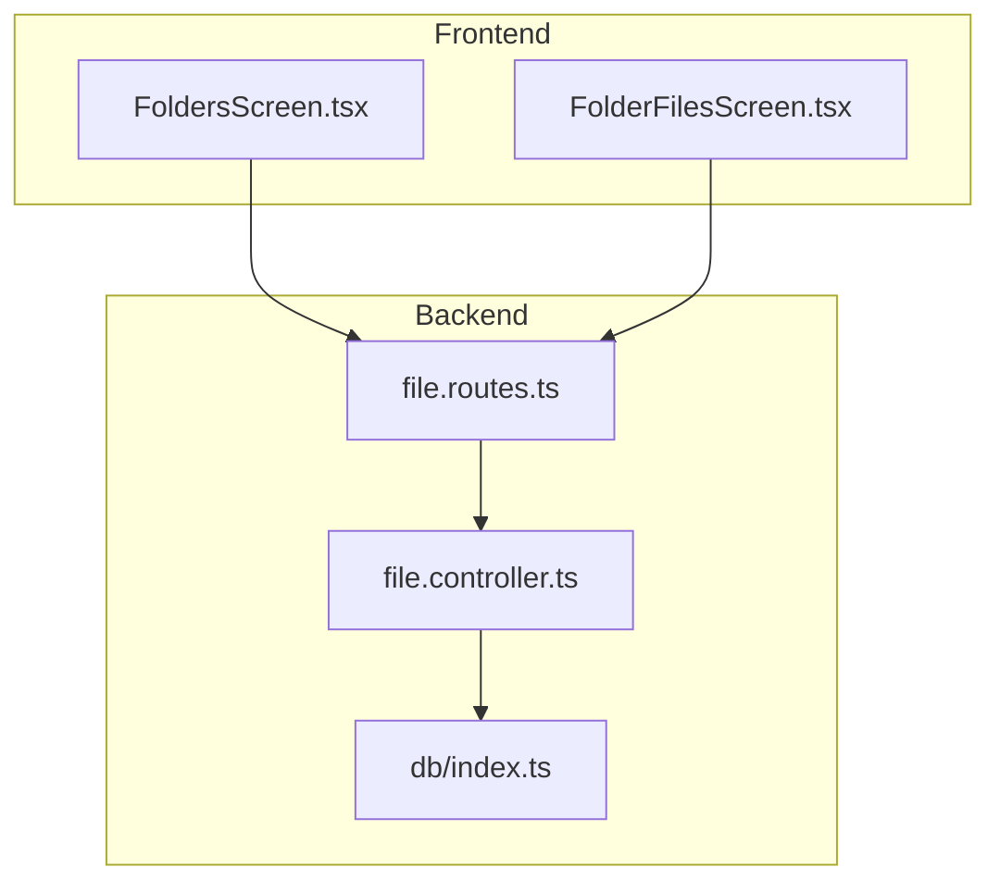
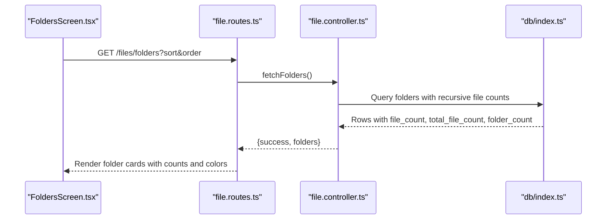
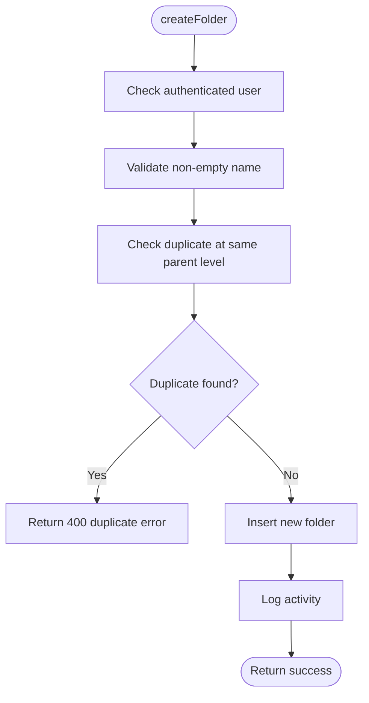
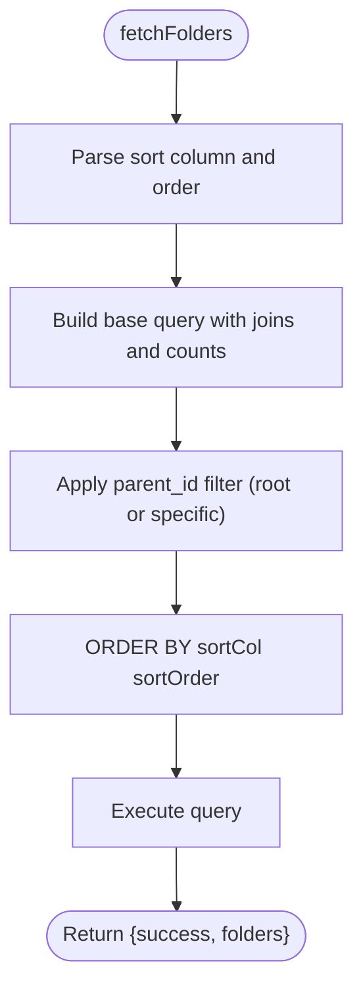
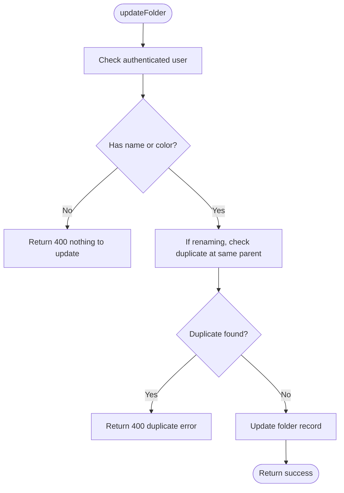
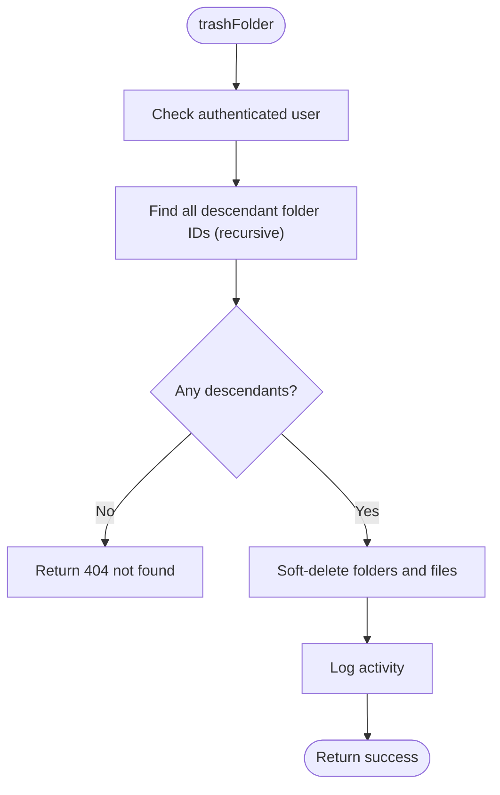
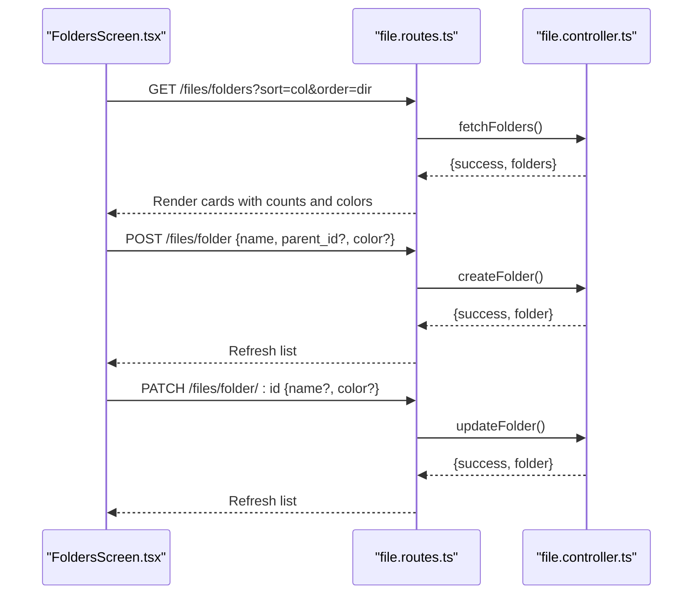
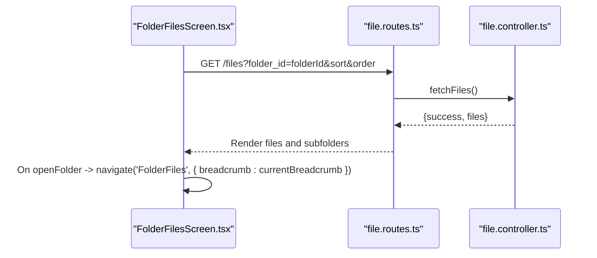
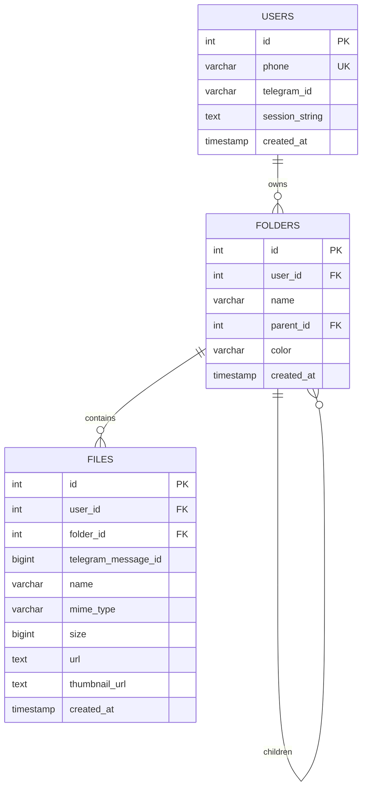
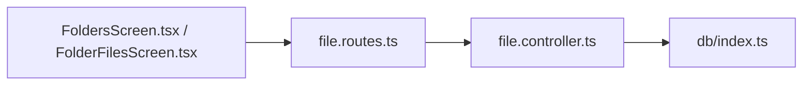

# Folder Management

<cite>
**Referenced Files in This Document**
- [file.controller.ts](file://server/src/controllers/file.controller.ts)
- [file.routes.ts](file://server/src/routes/file.routes.ts)
- [db/index.ts](file://server/src/db/index.ts)
- [FoldersScreen.tsx](file://app/src/screens/FoldersScreen.tsx)
- [FolderFilesScreen.tsx](file://app/src/screens/FolderFilesScreen.tsx)
</cite>

## Table of Contents
1. [Introduction](#introduction)
2. [Project Structure](#project-structure)
3. [Core Components](#core-components)
4. [Architecture Overview](#architecture-overview)
5. [Detailed Component Analysis](#detailed-component-analysis)
6. [Dependency Analysis](#dependency-analysis)
7. [Performance Considerations](#performance-considerations)
8. [Troubleshooting Guide](#troubleshooting-guide)
9. [Conclusion](#conclusion)

## Introduction
This document explains the folder management functionality in the application, covering backend controller methods for creating, listing, and updating folders, as well as the frontend screens that render hierarchical folder structures, handle navigation, and present folder statistics. It details parameter validation, duplicate checking, hierarchical aggregation of file counts, and the relationship between folders and files in the database schema.

## Project Structure
The folder management feature spans the backend controllers and routes, the database schema, and the frontend screens for browsing and interacting with folders.

**Diagram sources**
- [file.controller.ts](file://server/src/controllers/file.controller.ts#L695-L872)
- [file.routes.ts](file://server/src/routes/file.routes.ts#L49-L53)
- [db/index.ts](file://server/src/db/index.ts#L25-L48)
- [FoldersScreen.tsx](file://app/src/screens/FoldersScreen.tsx#L84-L101)
- [FolderFilesScreen.tsx](file://app/src/screens/FolderFilesScreen.tsx#L188-L200)

**Section sources**
- [file.controller.ts](file://server/src/controllers/file.controller.ts#L695-L872)
- [file.routes.ts](file://server/src/routes/file.routes.ts#L49-L53)
- [db/index.ts](file://server/src/db/index.ts#L25-L48)
- [FoldersScreen.tsx](file://app/src/screens/FoldersScreen.tsx#L84-L101)
- [FolderFilesScreen.tsx](file://app/src/screens/FolderFilesScreen.tsx#L188-L200)

## Core Components
- Backend controllers:
  - createFolder: Validates input, checks duplicates, inserts a new folder record.
  - fetchFolders: Lists folders with hierarchical aggregation of file counts and subfolder counts.
  - updateFolder: Validates updates, checks duplicates, applies changes.
  - trashFolder: Soft-deletes a folder and all its descendants along with their files.
- Frontend screens:
  - FoldersScreen: Renders a grid of folders, handles sorting, search, and actions (create/rename/delete).
  - FolderFilesScreen: Renders files and subfolders within a selected folder, displays breadcrumbs and filters.

**Section sources**
- [file.controller.ts](file://server/src/controllers/file.controller.ts#L695-L872)
- [FoldersScreen.tsx](file://app/src/screens/FoldersScreen.tsx#L84-L101)
- [FolderFilesScreen.tsx](file://app/src/screens/FolderFilesScreen.tsx#L188-L200)

## Architecture Overview
The backend exposes REST endpoints for folder operations. The frontend consumes these endpoints to render folder lists and manage folder hierarchies. The database enforces referential integrity for parent-child relationships and cascading deletes.

**Diagram sources**
- [file.routes.ts](file://server/src/routes/file.routes.ts#L51-L51)
- [file.controller.ts](file://server/src/controllers/file.controller.ts#L723-L790)
- [db/index.ts](file://server/src/db/index.ts#L25-L48)
- [FoldersScreen.tsx](file://app/src/screens/FoldersScreen.tsx#L84-L101)

## Detailed Component Analysis

### Backend Controllers: Folder Operations

#### createFolder
- Purpose: Create a new folder under a given parent with a unique name at that level.
- Parameter validation:
  - Requires authenticated user.
  - Requires non-empty name; trims whitespace.
  - Optional parent_id defaults to null (root-level).
  - Optional color defaults to a predefined value.
- Duplicate checking:
  - Ensures no untrashed folder with the same name exists at the same parent level.
- Persistence:
  - Inserts into folders table with user_id, name, parent_id, color.
  - Logs activity.

**Diagram sources**
- [file.controller.ts](file://server/src/controllers/file.controller.ts#L695-L718)

**Section sources**
- [file.controller.ts](file://server/src/controllers/file.controller.ts#L695-L718)

#### fetchFolders
- Purpose: Retrieve folders with aggregated counts:
  - file_count: direct files in the folder.
  - total_file_count: total files including descendants (recursive).
  - folder_count: immediate subfolder count.
- Sorting:
  - Allowed columns: name, created_at, file_count.
  - Order: ASC or DESC.
- Filtering:
  - Optionally restrict by parent_id (root if omitted).
- Hierarchical aggregation:
  - Uses a recursive CTE to traverse descendants and compute total file counts.

**Diagram sources**
- [file.controller.ts](file://server/src/controllers/file.controller.ts#L723-L790)

**Section sources**
- [file.controller.ts](file://server/src/controllers/file.controller.ts#L723-L790)

#### updateFolder
- Purpose: Update folder name and/or color.
- Validation:
  - Requires authenticated user.
  - At least one field to update (name or color).
- Duplicate checking:
  - When renaming, ensures no other folder at the same parent level shares the same name.
- Persistence:
  - Updates folders table and returns the updated record.

**Diagram sources**
- [file.controller.ts](file://server/src/controllers/file.controller.ts#L795-L833)

**Section sources**
- [file.controller.ts](file://server/src/controllers/file.controller.ts#L795-L833)

#### trashFolder (Soft Delete)
- Purpose: Move a folder and all its descendants to trash, including all files within those folders.
- Implementation:
  - Recursively collects all descendant folder IDs (including the root).
  - Soft-deletes all matched folders and files atomically.
  - Logs activity.

**Diagram sources**
- [file.controller.ts](file://server/src/controllers/file.controller.ts#L838-L872)

**Section sources**
- [file.controller.ts](file://server/src/controllers/file.controller.ts#L838-L872)

### Frontend Screens: Folder Navigation and Rendering

#### FoldersScreen.tsx
- Fetching folders:
  - Calls GET /files/folders with sort and order query parameters derived from UI state.
  - Receives folders with file_count, total_file_count, folder_count, and adds a color for rendering.
- Sorting:
  - Provides multiple sort options: newest/oldest, name ascending/descending, file count ascending/descending.
- Actions:
  - Create folder modal triggers POST /files/folder.
  - Rename folder modal triggers PATCH /files/folder/:id.
  - Delete folder triggers DELETE /files/folder/:id (soft deletion handled by backend).
- Rendering:
  - Grid of folder cards with color-coded icons and file/subfolder counts.
  - Search filters by name.

**Diagram sources**
- [FoldersScreen.tsx](file://app/src/screens/FoldersScreen.tsx#L84-L101)
- [file.routes.ts](file://server/src/routes/file.routes.ts#L50-L53)
- [file.controller.ts](file://server/src/controllers/file.controller.ts#L695-L833)

**Section sources**
- [FoldersScreen.tsx](file://app/src/screens/FoldersScreen.tsx#L84-L101)
- [file.routes.ts](file://server/src/routes/file.routes.ts#L50-L53)
- [file.controller.ts](file://server/src/controllers/file.controller.ts#L695-L833)

#### FolderFilesScreen.tsx
- Breadcrumbs:
  - Builds a breadcrumb trail from the incoming breadcrumb array plus the current folder.
- Rendering:
  - Displays subfolders and files within the current folder.
  - Supports filtering and sorting within the folder context.
- Navigation:
  - Navigates into subfolders while preserving the breadcrumb chain.

**Diagram sources**
- [FolderFilesScreen.tsx](file://app/src/screens/FolderFilesScreen.tsx#L422-L434)
- [file.routes.ts](file://server/src/routes/file.routes.ts#L91-L91)
- [file.controller.ts](file://server/src/controllers/file.controller.ts#L103-L133)

**Section sources**
- [FolderFilesScreen.tsx](file://app/src/screens/FolderFilesScreen.tsx#L422-L434)
- [file.routes.ts](file://server/src/routes/file.routes.ts#L91-L91)
- [file.controller.ts](file://server/src/controllers/file.controller.ts#L103-L133)

### Database Schema and Relationships
- folders table:
  - Primary key id.
  - References users(id) with ON DELETE CASCADE.
  - parent_id references folders(id) with ON DELETE CASCADE (self-referencing).
  - Additional fields: name, color, created_at.
- files table:
  - References folders(id) with ON DELETE SET NULL (when a folder is deleted, file.folder_id becomes null).
  - Other fields include user_id, telegram identifiers, name, mime_type, size, timestamps.
- Constraints:
  - Cascading deletes ensure data integrity when folders are removed.
  - Activity logging captures user actions for auditability.

**Diagram sources**
- [db/index.ts](file://server/src/db/index.ts#L25-L48)

**Section sources**
- [db/index.ts](file://server/src/db/index.ts#L25-L48)

## Dependency Analysis
- Routes depend on controllers for folder operations.
- Controllers depend on the database pool for queries.
- Frontend screens depend on routes for data fetching and mutation.
- The recursive CTE in fetchFolders depends on the self-referencing parent_id relationship.

**Diagram sources**
- [file.routes.ts](file://server/src/routes/file.routes.ts#L49-L53)
- [file.controller.ts](file://server/src/controllers/file.controller.ts#L723-L790)
- [db/index.ts](file://server/src/db/index.ts#L25-L48)
- [FoldersScreen.tsx](file://app/src/screens/FoldersScreen.tsx#L84-L101)
- [FolderFilesScreen.tsx](file://app/src/screens/FolderFilesScreen.tsx#L188-L200)

**Section sources**
- [file.routes.ts](file://server/src/routes/file.routes.ts#L49-L53)
- [file.controller.ts](file://server/src/controllers/file.controller.ts#L723-L790)
- [db/index.ts](file://server/src/db/index.ts#L25-L48)
- [FoldersScreen.tsx](file://app/src/screens/FoldersScreen.tsx#L84-L101)
- [FolderFilesScreen.tsx](file://app/src/screens/FolderFilesScreen.tsx#L188-L200)

## Performance Considerations
- Recursive CTE in fetchFolders:
  - Efficiently computes total file counts across the entire subtree in a single query.
  - Ensure indexes exist on user_id, parent_id, and is_trashed for optimal performance.
- Pagination and sorting:
  - Use sort and order parameters to avoid heavy client-side sorting.
- Frontend rendering:
  - Memoization and virtualized lists reduce re-renders when navigating between folders.

[No sources needed since this section provides general guidance]

## Troubleshooting Guide
- Duplicate folder name errors:
  - Occur when attempting to create or rename a folder to a name that already exists at the same parent level.
  - Verify parent_id and uniqueness constraints.
- Permission errors:
  - All folder endpoints require authentication; ensure the user session is valid.
- Soft delete behavior:
  - trashFolder moves the folder and all descendants to trash; confirm that is_trashed is respected in queries.
- Empty results:
  - fetchFolders returns only untrashed folders; check is_trashed flag and parent_id filters.

**Section sources**
- [file.controller.ts](file://server/src/controllers/file.controller.ts#L695-L718)
- [file.controller.ts](file://server/src/controllers/file.controller.ts#L795-L833)
- [file.controller.ts](file://server/src/controllers/file.controller.ts#L838-L872)

## Conclusion
The folder management system combines robust backend validation and duplicate checking with efficient recursive aggregation of file counts. The frontend provides intuitive navigation, sorting, and actions to manage folders effectively. The database schema enforces referential integrity and cascading deletes to maintain data consistency across hierarchical folder structures.