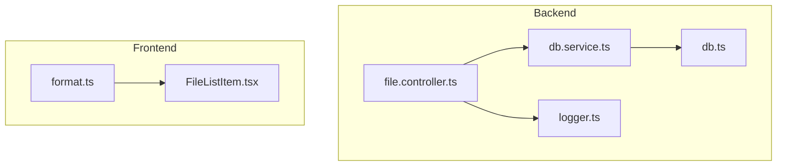
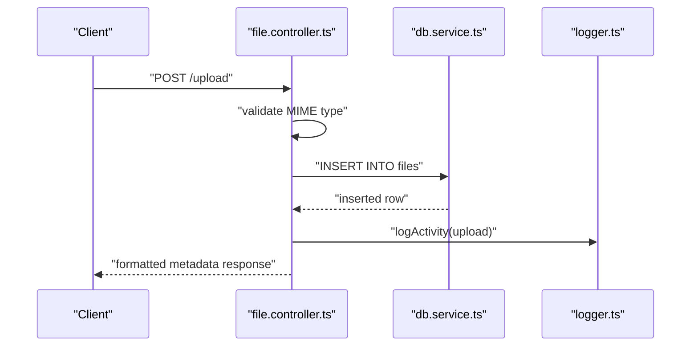
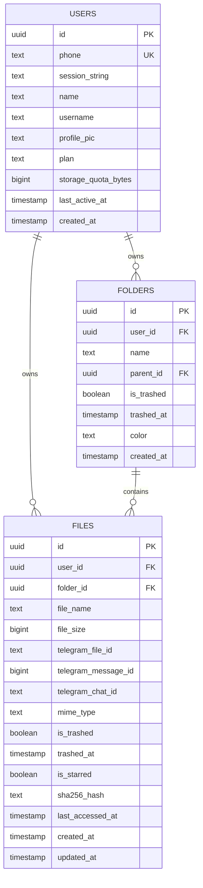
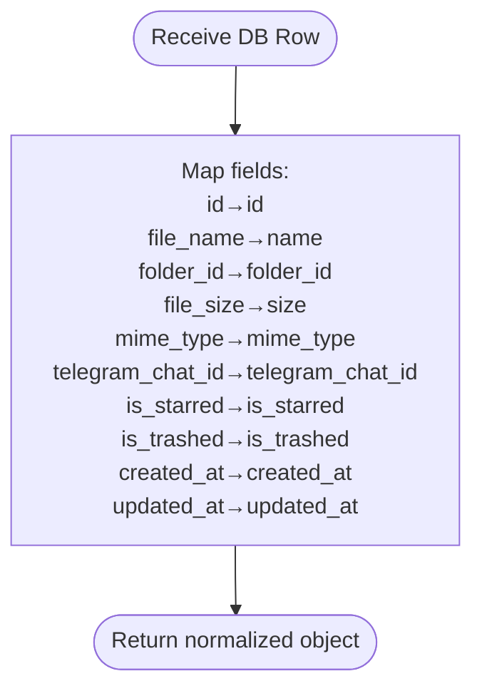
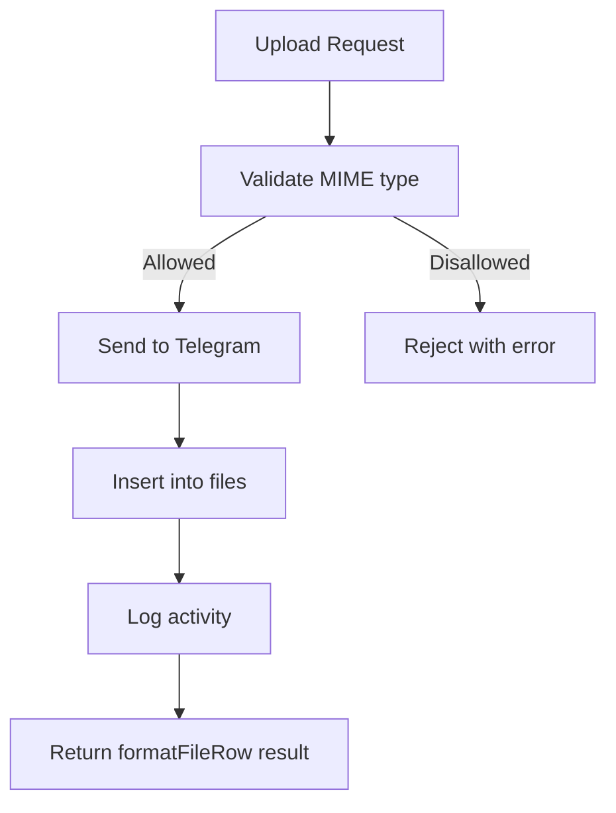
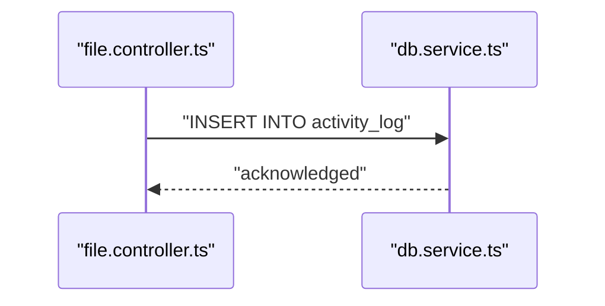
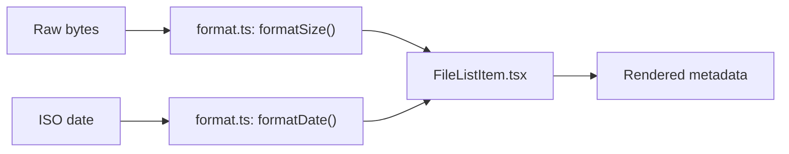
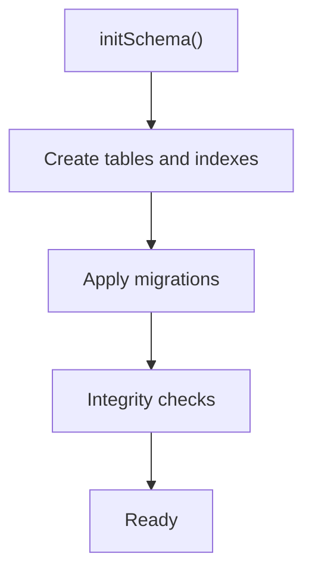
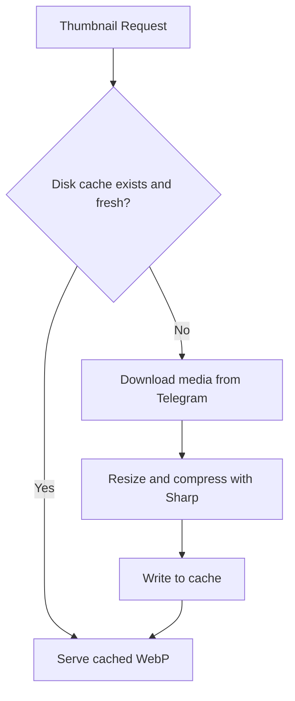
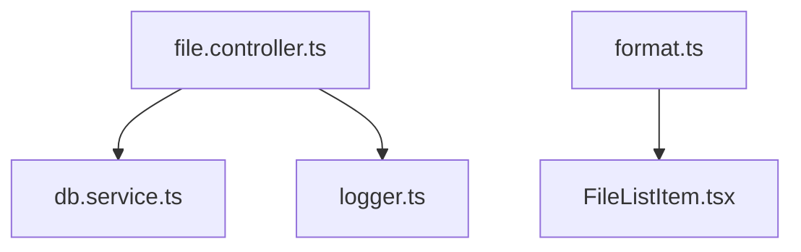

# Metadata Handling

<cite>
**Referenced Files in This Document**
- [db.service.ts](file://server/src/services/db.service.ts)
- [file.controller.ts](file://server/src/controllers/file.controller.ts)
- [db.ts](file://server/src/config/db.ts)
- [logger.ts](file://server/src/utils/logger.ts)
- [index.ts](file://server/src/db/index.ts)
- [format.ts](file://app/src/utils/format.ts)
- [FileListItem.tsx](file://app/src/components/FileListItem.tsx)
</cite>

## Table of Contents
1. [Introduction](#introduction)
2. [Project Structure](#project-structure)
3. [Core Components](#core-components)
4. [Architecture Overview](#architecture-overview)
5. [Detailed Component Analysis](#detailed-component-analysis)
6. [Dependency Analysis](#dependency-analysis)
7. [Performance Considerations](#performance-considerations)
8. [Troubleshooting Guide](#troubleshooting-guide)
9. [Conclusion](#conclusion)

## Introduction
This document explains how file metadata is managed across the Teledrive backend and frontend. It covers the database schema for storing file properties, timestamps, and system attributes; the standardized metadata representation used by the application; database initialization and migrations; validation and enrichment processes; audit logging; caching strategies; and data integrity measures. The goal is to provide a clear, accessible guide for developers and operators to understand and maintain the metadata pipeline.

## Project Structure
The metadata handling spans the backend service layer, database schema, and frontend presentation utilities:
- Backend service layer defines the schema and exposes CRUD operations for files.
- Controllers standardize metadata representation and orchestrate operations.
- Database configuration manages connection pooling and error handling.
- Frontend utilities format metadata for display.

**Diagram sources**
- [file.controller.ts](file://server/src/controllers/file.controller.ts#L1-L120)
- [db.service.ts](file://server/src/services/db.service.ts#L1-L140)
- [db.ts](file://server/src/config/db.ts#L1-L61)
- [logger.ts](file://server/src/utils/logger.ts#L1-L27)
- [format.ts](file://app/src/utils/format.ts#L1-L27)
- [FileListItem.tsx](file://app/src/components/FileListItem.tsx#L113-L189)

**Section sources**
- [file.controller.ts](file://server/src/controllers/file.controller.ts#L1-L120)
- [db.service.ts](file://server/src/services/db.service.ts#L1-L140)
- [db.ts](file://server/src/config/db.ts#L1-L61)
- [format.ts](file://app/src/utils/format.ts#L1-L27)
- [FileListItem.tsx](file://app/src/components/FileListItem.tsx#L113-L189)

## Core Components
- Standardized metadata representation: The formatFileRow function ensures consistent field mapping across the application, converting database columns to a normalized shape consumed by the frontend.
- Database schema: The files table stores file_name, file_size, mime_type, telegram_file_id, telegram_message_id, telegram_chat_id, is_starred, is_trashed, and timestamps. Additional columns like sha256_hash, last_accessed_at, and updated_at are available for advanced features.
- Audit logging: The logActivity function records user actions with optional metadata payloads for traceability.
- Validation and enrichment: Controllers validate allowed MIME types and enrich responses with derived metadata (e.g., formatted sizes and dates).
- Caching: Thumbnail and streaming endpoints implement disk-based caching to reduce repeated downloads and improve performance.

**Section sources**
- [file.controller.ts](file://server/src/controllers/file.controller.ts#L24-L44)
- [db.service.ts](file://server/src/services/db.service.ts#L31-L47)
- [file.controller.ts](file://server/src/controllers/file.controller.ts#L15-L22)
- [file.controller.ts](file://server/src/controllers/file.controller.ts#L447-L541)
- [file.controller.ts](file://server/src/controllers/file.controller.ts#L550-L689)

## Architecture Overview
The metadata lifecycle integrates database persistence, standardized representation, and frontend formatting.

**Diagram sources**
- [file.controller.ts](file://server/src/controllers/file.controller.ts#L49-L98)
- [db.service.ts](file://server/src/services/db.service.ts#L83-L105)
- [logger.ts](file://server/src/utils/logger.ts#L1-L27)

## Detailed Component Analysis

### Metadata Fields and Schema Design
The files table captures essential metadata and system attributes:
- Identity and ownership: id, user_id, folder_id
- File identity: file_name, mime_type, telegram_file_id, telegram_message_id, telegram_chat_id
- Lifecycle: is_trashed, trashed_at, created_at, updated_at
- User preferences: is_starred
- Integrity and discovery: sha256_hash, last_accessed_at
- Size accounting: file_size

Indexes optimize common queries:
- User-scoped lookups: idx_files_user_folder, idx_files_user_trashed, idx_files_starred, idx_files_name_search, idx_files_accessed
- Sorting and pagination: idx_files_sort_date, idx_files_sort_name, idx_files_sort_size
- Deduplication: files_user_sha256_unique
- Hash-based lookups: idx_files_hash, idx_files_user_hash, idx_files_md5, idx_files_user_md5

Constraints and triggers:
- Unique constraint on (user_id, sha256_hash) for non-trashed files to prevent duplicates
- Trigger to maintain user storage counters (storage_used_bytes, total_files_count) on insert/delete/update

**Diagram sources**
- [db.service.ts](file://server/src/services/db.service.ts#L7-L47)
- [db.service.ts](file://server/src/services/db.service.ts#L134-L166)
- [db.service.ts](file://server/src/services/db.service.ts#L209-L264)

**Section sources**
- [db.service.ts](file://server/src/services/db.service.ts#L31-L47)
- [db.service.ts](file://server/src/services/db.service.ts#L134-L166)
- [db.service.ts](file://server/src/services/db.service.ts#L209-L264)

### Standardized Metadata Representation: formatFileRow
The formatFileRow function transforms database rows into a normalized shape:
- id, name, folder_id, size, mime_type, telegram_chat_id, is_starred, is_trashed, created_at, updated_at

This normalization ensures consistent consumption across controllers and frontend components.

**Diagram sources**
- [file.controller.ts](file://server/src/controllers/file.controller.ts#L33-L44)

**Section sources**
- [file.controller.ts](file://server/src/controllers/file.controller.ts#L33-L44)

### Validation and Enrichment
- MIME type validation: Controllers enforce allowed MIME types before upload to ensure supported content.
- Enrichment: Responses include formatted metadata (sizes, dates) and derived fields (e.g., share link details).

**Diagram sources**
- [file.controller.ts](file://server/src/controllers/file.controller.ts#L15-L22)
- [file.controller.ts](file://server/src/controllers/file.controller.ts#L49-L98)

**Section sources**
- [file.controller.ts](file://server/src/controllers/file.controller.ts#L15-L22)
- [file.controller.ts](file://server/src/controllers/file.controller.ts#L49-L98)

### Audit Logging: logActivity
The logActivity function writes structured entries to the activity_log table:
- Columns: user_id, action, file_id, folder_id, meta (JSONB)
- Non-critical failures are suppressed to avoid blocking operations

**Diagram sources**
- [file.controller.ts](file://server/src/controllers/file.controller.ts#L24-L31)
- [db.service.ts](file://server/src/services/db.service.ts#L115-L123)

**Section sources**
- [file.controller.ts](file://server/src/controllers/file.controller.ts#L24-L31)
- [db.service.ts](file://server/src/services/db.service.ts#L115-L123)

### Frontend Metadata Presentation
- Formatting utilities convert raw bytes and timestamps into human-readable forms.
- List items render file metadata consistently, including starred indicators and creation/update timestamps.

**Diagram sources**
- [format.ts](file://app/src/utils/format.ts#L4-L22)
- [FileListItem.tsx](file://app/src/components/FileListItem.tsx#L155-L165)

**Section sources**
- [format.ts](file://app/src/utils/format.ts#L4-L22)
- [FileListItem.tsx](file://app/src/components/FileListItem.tsx#L155-L165)

### Database Initialization and Migrations
- Schema initialization creates tables and indexes, then applies migrations to evolve the schema safely.
- Integrity checks ensure critical constraints and indexes are present after migrations.
- Connection pooling is configured for production stability and resource limits.

**Diagram sources**
- [db.service.ts](file://server/src/services/db.service.ts#L3-L137)
- [db.service.ts](file://server/src/services/db.service.ts#L267-L305)
- [db.ts](file://server/src/config/db.ts#L27-L37)

**Section sources**
- [db.service.ts](file://server/src/services/db.service.ts#L3-L137)
- [db.service.ts](file://server/src/services/db.service.ts#L267-L305)
- [db.ts](file://server/src/config/db.ts#L27-L37)

### Caching Strategies
- Thumbnail caching: Disk cache with TTL to avoid repeated Telegram downloads and Sharp recompression.
- Streaming cache: Disk cache with TTL and download locks to prevent concurrent redundant downloads and support HTTP Range requests.

**Diagram sources**
- [file.controller.ts](file://server/src/controllers/file.controller.ts#L447-L541)

**Section sources**
- [file.controller.ts](file://server/src/controllers/file.controller.ts#L447-L541)
- [file.controller.ts](file://server/src/controllers/file.controller.ts#L550-L689)

## Dependency Analysis
- Controllers depend on the database service for schema and queries.
- Controllers depend on the logger for audit trails.
- Frontend formatting utilities depend on shared helpers for consistent display.

**Diagram sources**
- [file.controller.ts](file://server/src/controllers/file.controller.ts#L1-L12)
- [db.service.ts](file://server/src/services/db.service.ts#L1-L3)
- [logger.ts](file://server/src/utils/logger.ts#L1-L27)
- [format.ts](file://app/src/utils/format.ts#L1-L27)
- [FileListItem.tsx](file://app/src/components/FileListItem.tsx#L113-L189)

**Section sources**
- [file.controller.ts](file://server/src/controllers/file.controller.ts#L1-L12)
- [db.service.ts](file://server/src/services/db.service.ts#L1-L3)
- [logger.ts](file://server/src/utils/logger.ts#L1-L27)
- [format.ts](file://app/src/utils/format.ts#L1-L27)
- [FileListItem.tsx](file://app/src/components/FileListItem.tsx#L113-L189)

## Performance Considerations
- Indexing: Strategic indexes accelerate user-scoped queries, sorting, and deduplication.
- Triggers: Storage counters update efficiently via triggers on insert/delete/update.
- Caching: Disk caches reduce network and CPU overhead for thumbnails and streaming.
- Connection pooling: Configured limits and timeouts balance responsiveness and resource usage.

[No sources needed since this section provides general guidance]

## Troubleshooting Guide
- Database connectivity: Check DATABASE_URL and SSL mode; pool emits warnings for unexpected disconnections and timeouts.
- Migration integrity: Failures in critical migrations halt initialization; verify constraints and indexes post-migration.
- Activity logging: Non-critical failures are suppressed; monitor logs for errors.
- Frontend formatting: Ensure consistent use of shared formatting utilities for sizes and dates.

**Section sources**
- [db.ts](file://server/src/config/db.ts#L39-L58)
- [db.service.ts](file://server/src/services/db.service.ts#L267-L305)
- [logger.ts](file://server/src/utils/logger.ts#L1-L27)

## Conclusion
Teledrive’s metadata handling combines a robust database schema, standardized representation, validation and enrichment, comprehensive audit logging, and practical caching strategies. Together, these components deliver reliable, performant, and maintainable file metadata management across the platform.