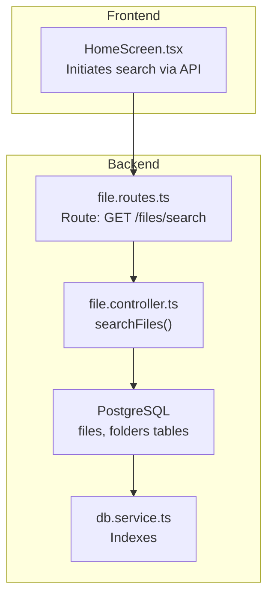
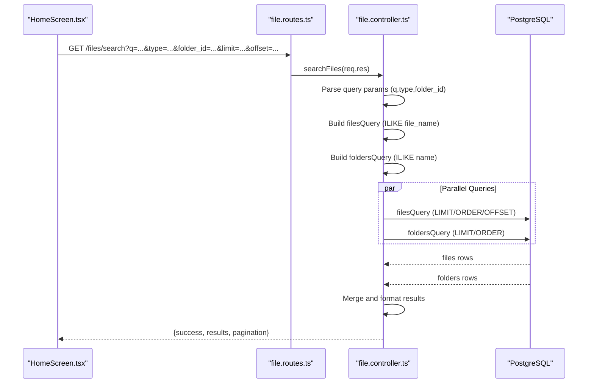

# Search Functionality

<cite>
**Referenced Files in This Document**
- [file.controller.ts](file://server/src/controllers/file.controller.ts)
- [file.routes.ts](file://server/src/routes/file.routes.ts)
- [db.service.ts](file://server/src/services/db.service.ts)
- [db.ts](file://server/src/config/db.ts)
- [HomeScreen.tsx](file://app/src/screens/HomeScreen.tsx)
</cite>

## Table of Contents
1. [Introduction](#introduction)
2. [Project Structure](#project-structure)
3. [Core Components](#core-components)
4. [Architecture Overview](#architecture-overview)
5. [Detailed Component Analysis](#detailed-component-analysis)
6. [Dependency Analysis](#dependency-analysis)
7. [Performance Considerations](#performance-considerations)
8. [Troubleshooting Guide](#troubleshooting-guide)
9. [Conclusion](#conclusion)

## Introduction
This document explains the search functionality that enables users to find files and folders across their storage. It focuses on the searchFiles controller method, detailing query parameter handling, pagination support, and combined file/folder search results. It also covers the SQL queries used for searching within specific folders and filtering by file type, the search algorithm that merges results with proper sorting, and practical examples of search queries, result formatting, pagination parameters. Finally, it addresses performance optimizations, indexing considerations, and security measures to prevent unauthorized access to search results.

## Project Structure
The search feature spans the backend controller and route layer, the database schema and indexes, and the frontend integration for initiating and displaying search results.

**Diagram sources**
- [file.routes.ts](file://server/src/routes/file.routes.ts#L31-L32)
- [file.controller.ts](file://server/src/controllers/file.controller.ts#L138-L203)
- [db.service.ts](file://server/src/services/db.service.ts#L134-L158)

**Section sources**
- [file.routes.ts](file://server/src/routes/file.routes.ts#L31-L32)
- [file.controller.ts](file://server/src/controllers/file.controller.ts#L138-L203)
- [db.service.ts](file://server/src/services/db.service.ts#L134-L158)

## Core Components
- Route registration: GET /files/search maps to the searchFiles controller.
- Controller: searchFiles validates authentication, parses query parameters, builds and executes parallel queries for files and folders, merges results, and returns pagination metadata.
- Database: files and folders tables with indexes supporting efficient searches.
- Frontend: HomeScreen debounces user input and calls the search endpoint.

Key implementation references:
- Route binding: [GET /files/search](file://server/src/routes/file.routes.ts#L31-L32)
- Controller method: [searchFiles](file://server/src/controllers/file.controller.ts#L138-L203)
- Database indexes: [initSchema indexes](file://server/src/services/db.service.ts#L134-L158)
- Frontend search initiation: [HomeScreen search effect](file://app/src/screens/HomeScreen.tsx#L425-L439)

**Section sources**
- [file.routes.ts](file://server/src/routes/file.routes.ts#L31-L32)
- [file.controller.ts](file://server/src/controllers/file.controller.ts#L138-L203)
- [db.service.ts](file://server/src/services/db.service.ts#L134-L158)
- [HomeScreen.tsx](file://app/src/screens/HomeScreen.tsx#L425-L439)

## Architecture Overview
The search flow is a coordinated request-response between the frontend and backend, with parallel database queries and result merging.

**Diagram sources**
- [file.routes.ts](file://server/src/routes/file.routes.ts#L31-L32)
- [file.controller.ts](file://server/src/controllers/file.controller.ts#L138-L203)

## Detailed Component Analysis

### searchFiles Controller Method
Responsibilities:
- Authentication check and parameter validation.
- Construct SQL queries for files and folders with ILIKE matching on names.
- Optional filters: folder_id constrains both files and folders; type filters files by mime_type.
- Pagination: limit (capped at 200) and offset; returned pagination metadata reflects actual returned count.
- Parallel execution of both queries for responsiveness.
- Merge results into a unified array with a result_type discriminator for downstream UI handling.

Key behaviors:
- Query parameter handling:
  - q: required; otherwise returns 400.
  - type: optional; filters files by mime_type ILIKE pattern.
  - folder_id: optional; constrains both files and folders.
  - limit: optional, capped at 200; defaults to 50.
  - offset: optional; defaults to 0.
- SQL queries:
  - Files: selects file fields plus a constant result_type, filters by user_id, trashed flag, optional folder_id, optional mime_type, orders by created_at descending, applies LIMIT and OFFSET.
  - Folders: selects folder fields mapped to a uniform shape with a constant result_type, filters by user_id, trashed flag, optional parent_id derived from folder_id, orders by name ascending, applies LIMIT.
- Result merging:
  - Folders rows are mapped to a uniform shape with result_type "folder".
  - Files rows are mapped via formatFileRow and tagged with result_type "file".
  - Merged array is returned with pagination metadata.

Example request parameters:
- Basic: /files/search?q=presentation
- Filter by type: /files/search?q=image&type=image/
- Filter by folder: /files/search?q=report&folder_id=<folder-id>
- Paginate: /files/search?q=doc&limit=50&offset=0

Response structure:
- success: boolean
- results: array of merged items (files and folders)
- pagination: { limit, offset, returned }

Security and correctness:
- Authentication enforced at the start; unauthorized requests return 401.
- Query parameters are bound to prepared statements to prevent SQL injection.
- Results are scoped to the authenticated user’s data.

**Section sources**
- [file.controller.ts](file://server/src/controllers/file.controller.ts#L138-L203)

### SQL Queries and Filtering
Files query:
- Filters: user_id, is_trashed=false, file_name ILIKE pattern, optional folder_id, optional mime_type.
- Sorting: created_at DESC.
- Pagination: LIMIT and OFFSET appended.

Folders query:
- Filters: user_id, is_trashed=false, name ILIKE pattern, optional parent_id derived from folder_id.
- Sorting: name ASC.
- Pagination: LIMIT appended.

These queries are executed in parallel to minimize latency.

**Section sources**
- [file.controller.ts](file://server/src/controllers/file.controller.ts#L148-L188)

### Result Formatting and Sorting
- Uniform shape: Both files and folders are normalized to a common structure with result_type to simplify UI consumption.
- Sorting:
  - Files: created_at DESC.
  - Folders: name ASC.
- Merging: folders first, then files, preserving sort characteristics per source.

**Section sources**
- [file.controller.ts](file://server/src/controllers/file.controller.ts#L190-L193)

### Frontend Integration
- Debounced search: HomeScreen triggers a GET /files/search with the current query after a short debounce.
- Result handling: On success, results are stored for immediate UI rendering.

**Section sources**
- [HomeScreen.tsx](file://app/src/screens/HomeScreen.tsx#L425-L439)

## Dependency Analysis
The search controller depends on:
- Route registration for the /files/search endpoint.
- Database connection pool and indexes for efficient queries.
- Frontend client to call the endpoint and render results.

**Diagram sources**
- [file.routes.ts](file://server/src/routes/file.routes.ts#L31-L32)
- [file.controller.ts](file://server/src/controllers/file.controller.ts#L138-L203)
- [db.ts](file://server/src/config/db.ts#L27-L37)
- [db.service.ts](file://server/src/services/db.service.ts#L134-L158)
- [HomeScreen.tsx](file://app/src/screens/HomeScreen.tsx#L425-L439)

**Section sources**
- [file.routes.ts](file://server/src/routes/file.routes.ts#L31-L32)
- [file.controller.ts](file://server/src/controllers/file.controller.ts#L138-L203)
- [db.ts](file://server/src/config/db.ts#L27-L37)
- [db.service.ts](file://server/src/services/db.service.ts#L134-L158)
- [HomeScreen.tsx](file://app/src/screens/HomeScreen.tsx#L425-L439)

## Performance Considerations
- Parallel queries: Files and folders queries run concurrently to reduce perceived latency.
- Indexes:
  - files: user_id, is_trashed, file_name, created_at, updated_at, folder_id, mime_type, hash columns.
  - folders: user_id, parent_id, is_trashed.
  - Additional indexes for sorting and filtering (e.g., idx_files_sort_*).
- Connection pooling: Limited max connections and idle timeouts to conserve resources.
- Pagination: Limit capped at 200 to prevent excessive result sets.

Recommendations:
- Add a GIN index on file_name for faster ILIKE operations if needed.
- Consider adding a GIN index on mime_type for frequent type filtering.
- Monitor slow query logs and adjust indexes based on actual usage patterns.

**Section sources**
- [db.service.ts](file://server/src/services/db.service.ts#L134-L158)
- [db.ts](file://server/src/config/db.ts#L27-L37)

## Troubleshooting Guide
Common issues and resolutions:
- Unauthorized: Ensure the request includes a valid authenticated session; the controller returns 401 if missing.
- Missing query: Provide the q parameter; the controller returns 400 if omitted.
- Excessive limit: The controller caps limit at 200; requests exceeding this cap are adjusted automatically.
- No results: Verify folder_id and type filters; confirm the user owns the targeted folder and that files exist under the given conditions.
- Slow responses: Confirm indexes exist and are effective; review database performance metrics.

**Section sources**
- [file.controller.ts](file://server/src/controllers/file.controller.ts#L138-L145)

## Conclusion
The search functionality combines authenticated, paginated queries against both files and folders, returning a unified result set with consistent formatting and pagination metadata. Its design leverages parallel execution, careful parameter binding, and strategic indexes to balance responsiveness and accuracy. The frontend integrates seamlessly by debouncing user input and rendering results immediately upon successful responses.