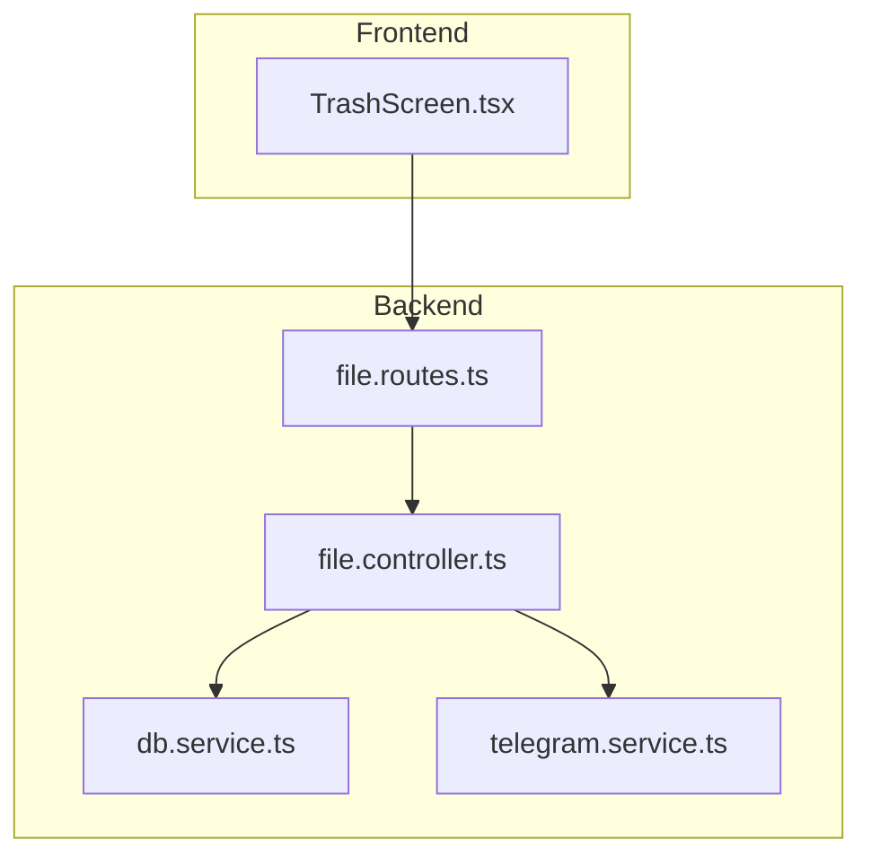
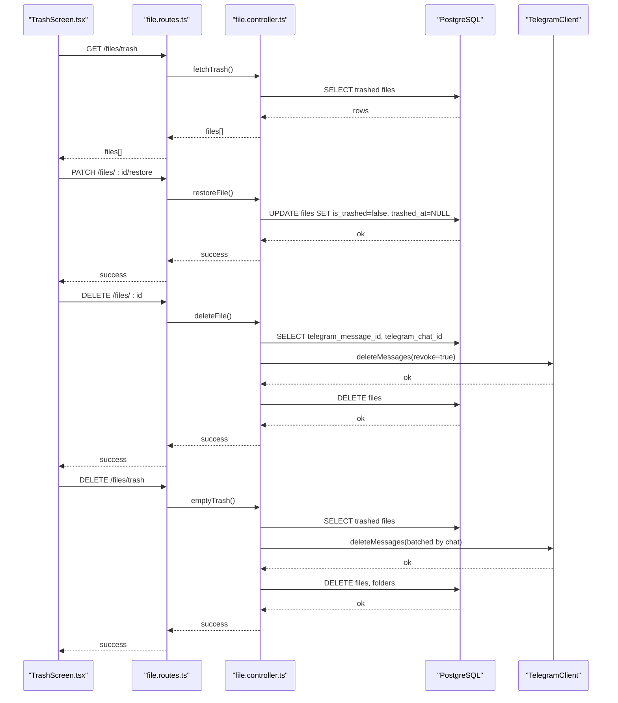
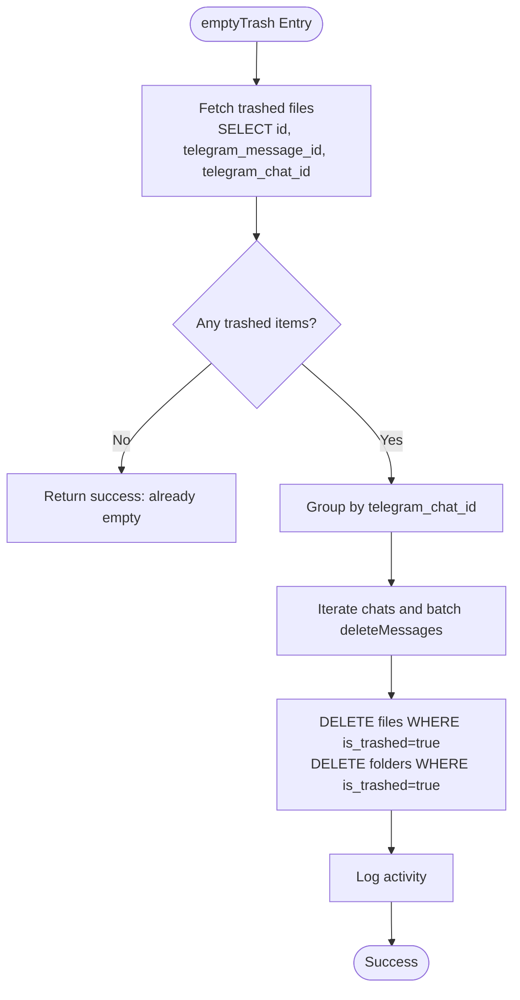
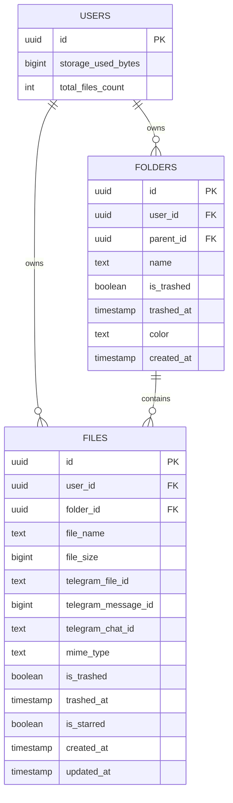
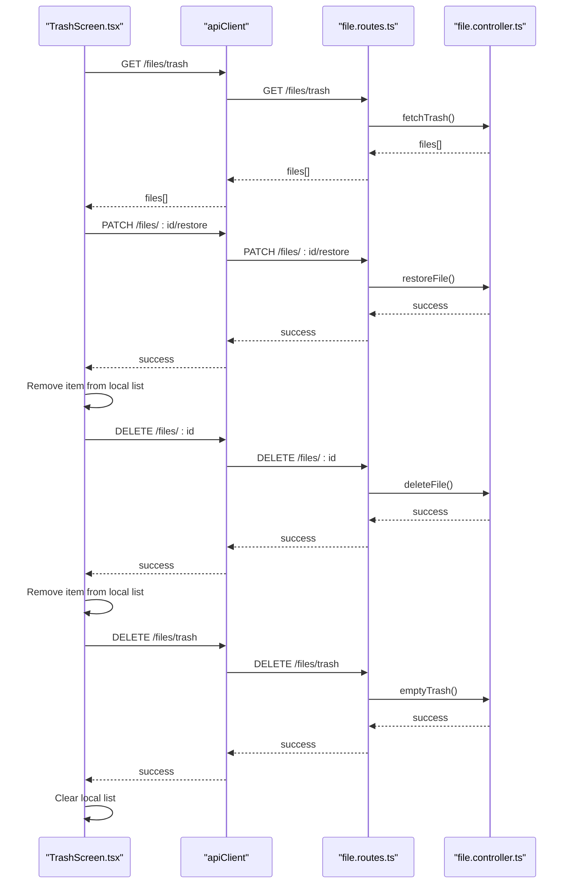
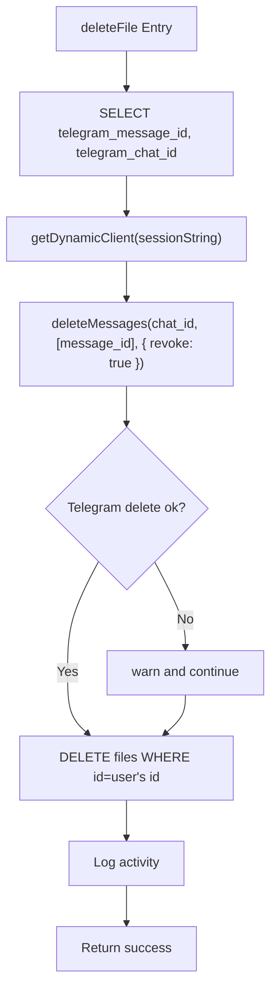
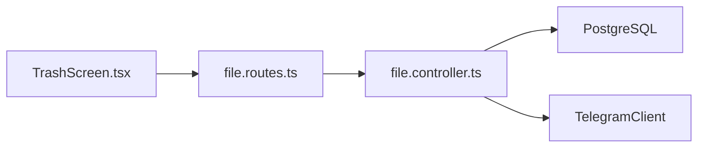

# Trash Management

<cite>
**Referenced Files in This Document**
- [file.controller.ts](file://server/src/controllers/file.controller.ts)
- [file.routes.ts](file://server/src/routes/file.routes.ts)
- [db.service.ts](file://server/src/services/db.service.ts)
- [telegram.service.ts](file://server/src/services/telegram.service.ts)
- [TrashScreen.tsx](file://app/src/screens/TrashScreen.tsx)
</cite>

## Table of Contents
1. [Introduction](#introduction)
2. [Project Structure](#project-structure)
3. [Core Components](#core-components)
4. [Architecture Overview](#architecture-overview)
5. [Detailed Component Analysis](#detailed-component-analysis)
6. [Dependency Analysis](#dependency-analysis)
7. [Performance Considerations](#performance-considerations)
8. [Troubleshooting Guide](#troubleshooting-guide)
9. [Conclusion](#conclusion)

## Introduction
This document explains the trash management system that implements soft deletion, trash retrieval, and permanent deletion. It covers the backend controller methods for moving files to trash, restoring them, fetching the trash list, and emptying the trash. It also documents the frontend integration for displaying trash items, performing bulk operations, and initiating recovery workflows. The document details the is_trashed flag and trashed_at timestamp tracking, cascade deletion of associated records, Telegram message cleanup, and data consistency across local state and Telegram.

## Project Structure
The trash management spans backend controllers and routes, database schema and triggers, Telegram client integration, and the React Native frontend screen.

**Diagram sources**
- [file.controller.ts](file://server/src/controllers/file.controller.ts#L285-L407)
- [file.routes.ts](file://server/src/routes/file.routes.ts#L42-L47)
- [db.service.ts](file://server/src/services/db.service.ts#L31-L47)
- [telegram.service.ts](file://server/src/services/telegram.service.ts#L57-L97)
- [TrashScreen.tsx](file://app/src/screens/TrashScreen.tsx#L12-L179)

**Section sources**
- [file.controller.ts](file://server/src/controllers/file.controller.ts#L285-L407)
- [file.routes.ts](file://server/src/routes/file.routes.ts#L42-L47)
- [db.service.ts](file://server/src/services/db.service.ts#L31-L47)
- [telegram.service.ts](file://server/src/services/telegram.service.ts#L57-L97)
- [TrashScreen.tsx](file://app/src/screens/TrashScreen.tsx#L12-L179)

## Core Components
- Backend controllers for trash operations:
  - trashFile: soft delete a file by setting is_trashed and trashed_at
  - restoreFile: restore a file by clearing is_trashed and trashed_at
  - deleteFile: permanent delete a file, including Telegram message cleanup
  - fetchTrash: retrieve all trashed files for a user
  - emptyTrash: permanently delete all trashed files and associated folders
- Frontend TrashScreen.tsx:
  - Loads trash list, displays items, supports restore and permanent delete actions, and bulk empty-trash
- Database schema and triggers:
  - is_trashed and trashed_at columns on files and folders
  - Storage counters trigger to maintain user storage usage and file counts
- Telegram integration:
  - Dynamic client retrieval and message deletion with revoke option

**Section sources**
- [file.controller.ts](file://server/src/controllers/file.controller.ts#L285-L407)
- [TrashScreen.tsx](file://app/src/screens/TrashScreen.tsx#L12-L179)
- [db.service.ts](file://server/src/services/db.service.ts#L31-L47)
- [db.service.ts](file://server/src/services/db.service.ts#L236-L265)
- [telegram.service.ts](file://server/src/services/telegram.service.ts#L57-L97)

## Architecture Overview
The trash lifecycle integrates database state changes with Telegram message deletions. The frontend interacts with backend routes to manage trash operations and reflects the current state locally.

**Diagram sources**
- [file.routes.ts](file://server/src/routes/file.routes.ts#L42-L47)
- [file.controller.ts](file://server/src/controllers/file.controller.ts#L285-L407)
- [db.service.ts](file://server/src/services/db.service.ts#L236-L265)
- [telegram.service.ts](file://server/src/services/telegram.service.ts#L57-L97)
- [TrashScreen.tsx](file://app/src/screens/TrashScreen.tsx#L47-L102)

## Detailed Component Analysis

### Backend Controllers: Trash Operations
- trashFile
  - Purpose: Move a file to trash by toggling is_trashed and setting trashed_at
  - Behavior: Updates a single file record; logs activity
  - Consistency: Does not touch Telegram messages; relies on emptyTrash for cleanup
- restoreFile
  - Purpose: Restore a file from trash by clearing is_trashed and trashed_at
  - Behavior: Updates a single file record; logs activity
- deleteFile
  - Purpose: Permanently delete a file and its Telegram message
  - Behavior: Retrieves telegram_message_id and telegram_chat_id, deletes Telegram message with revoke, then deletes DB record; logs activity
  - Cleanup: Ensures Telegram message removal even if DB delete succeeds
- fetchTrash
  - Purpose: Retrieve all trashed files for the authenticated user
  - Behavior: Queries files where is_trashed is true, ordered by trashed_at descending
- emptyTrash
  - Purpose: Permanently delete all trashed files and folders
  - Behavior: Selects trashed files, groups by telegram_chat_id, batches deleteMessages by chat, then deletes files and folders from DB; logs activity
  - Cascade: Deletes both files and folders marked as trashed

**Diagram sources**
- [file.controller.ts](file://server/src/controllers/file.controller.ts#L372-L407)

**Section sources**
- [file.controller.ts](file://server/src/controllers/file.controller.ts#L285-L407)

### Database Schema and Triggers
- Columns
  - files: is_trashed (boolean), trashed_at (timestamp)
  - folders: is_trashed (boolean), trashed_at (timestamp)
- Indexes
  - idx_files_user_trashed on (user_id, is_trashed)
  - idx_folders_user_trashed on (user_id, is_trashed)
- Triggers
  - update_user_storage_counters maintains storage_used_bytes and total_files_count based on is_trashed transitions
  - Trigger fires on INSERT/DELETE/UPDATE of is_trashed or file_size

**Diagram sources**
- [db.service.ts](file://server/src/services/db.service.ts#L31-L47)
- [db.service.ts](file://server/src/services/db.service.ts#L236-L265)

**Section sources**
- [db.service.ts](file://server/src/services/db.service.ts#L31-L47)
- [db.service.ts](file://server/src/services/db.service.ts#L139-L165)
- [db.service.ts](file://server/src/services/db.service.ts#L236-L265)

### Frontend Integration: TrashScreen.tsx
- Loading and normalization
  - fetchTrash loads trashed files and normalizes fields for consistent rendering
- Actions
  - Restore: PATCH /files/:id/restore; removes item from local list upon success
  - Permanent delete: DELETE /files/:id; removes item from local list upon success
  - Empty trash: DELETE /files/trash; clears local list upon success
- UI behavior
  - Shows loading skeletons, empty state, and pull-to-refresh
  - Displays items with preview navigation and restore button

**Diagram sources**
- [TrashScreen.tsx](file://app/src/screens/TrashScreen.tsx#L47-L102)
- [file.routes.ts](file://server/src/routes/file.routes.ts#L42-L47)
- [file.controller.ts](file://server/src/controllers/file.controller.ts#L285-L407)

**Section sources**
- [TrashScreen.tsx](file://app/src/screens/TrashScreen.tsx#L12-L179)

### Telegram Message Cleanup
- deleteFile
  - Retrieves telegram_message_id and telegram_chat_id
  - Calls Telegram client deleteMessages with revoke: true
  - Logs warnings if Telegram deletion fails but proceeds to DB delete
- emptyTrash
  - Groups trashed files by telegram_chat_id
  - Iterates chats and deletes messages in batches
  - Proceeds to DB deletion even if some Telegram deletions fail

**Diagram sources**
- [file.controller.ts](file://server/src/controllers/file.controller.ts#L325-L351)
- [telegram.service.ts](file://server/src/services/telegram.service.ts#L57-L97)

**Section sources**
- [file.controller.ts](file://server/src/controllers/file.controller.ts#L325-L351)
- [file.controller.ts](file://server/src/controllers/file.controller.ts#L372-L407)
- [telegram.service.ts](file://server/src/services/telegram.service.ts#L57-L97)

### Transaction Handling and Data Consistency
- Current behavior
  - Methods perform multiple operations (Telegram and DB) without wrapping them in a single database transaction
  - If Telegram deletion fails, the DB record is still removed by deleteFile and emptyTrash
- Implications
  - Risk of orphaned Telegram messages if DB operations succeed but Telegram fails
  - Risk of inconsistent local state if frontend removes items before backend confirms completion
- Recommendations
  - Wrap Telegram and DB operations in a single transaction where feasible
  - Ensure frontend state updates only after backend confirms success
  - Add idempotency checks for Telegram deletions

[No sources needed since this section provides general guidance]

## Dependency Analysis
- Controllers depend on:
  - Database pool for SQL operations
  - Telegram dynamic client for message deletions
- Routes expose trash endpoints mapped to controller methods
- Frontend depends on routes for trash operations

**Diagram sources**
- [file.routes.ts](file://server/src/routes/file.routes.ts#L42-L47)
- [file.controller.ts](file://server/src/controllers/file.controller.ts#L285-L407)
- [telegram.service.ts](file://server/src/services/telegram.service.ts#L57-L97)

**Section sources**
- [file.routes.ts](file://server/src/routes/file.routes.ts#L42-L47)
- [file.controller.ts](file://server/src/controllers/file.controller.ts#L285-L407)
- [telegram.service.ts](file://server/src/services/telegram.service.ts#L57-L97)

## Performance Considerations
- emptyTrash batching
  - Groups Telegram deletions by chat to minimize API calls
- Indexes
  - idx_files_user_trashed and idx_folders_user_trashed optimize trash queries
- Storage counters
  - Trigger-based counters reduce runtime computation for stats and quotas

**Section sources**
- [file.controller.ts](file://server/src/controllers/file.controller.ts#L372-L407)
- [db.service.ts](file://server/src/services/db.service.ts#L153-L158)
- [db.service.ts](file://server/src/services/db.service.ts#L236-L265)

## Troubleshooting Guide
- Telegram session errors
  - If Telegram client reconnect fails, the system evicts the client and throws an error; users should log in again
- Partial Telegram deletions
  - emptyTrash catches and warns on per-chat failures; subsequent runs can retry
  - deleteFile warns and continues if Telegram deletion fails
- Local state vs. backend
  - Frontend removes items immediately on restore/delete; if backend fails, the UI may be inconsistent until refresh

**Section sources**
- [telegram.service.ts](file://server/src/services/telegram.service.ts#L42-L77)
- [file.controller.ts](file://server/src/controllers/file.controller.ts#L341-L343)
- [file.controller.ts](file://server/src/controllers/file.controller.ts#L393-L396)
- [TrashScreen.tsx](file://app/src/screens/TrashScreen.tsx#L66-L102)

## Conclusion
The trash management system provides robust soft deletion, restoration, and permanent deletion workflows. The is_trashed flag and trashed_at timestamp enable efficient querying and cascading operations. Telegram message cleanup is integrated into both individual and bulk deletion paths. While the current implementation performs multiple operations without a single database transaction, the system remains functional with warnings and fallbacks. For improved reliability, consider wrapping critical operations in transactions and synchronizing frontend state updates with backend confirmations.