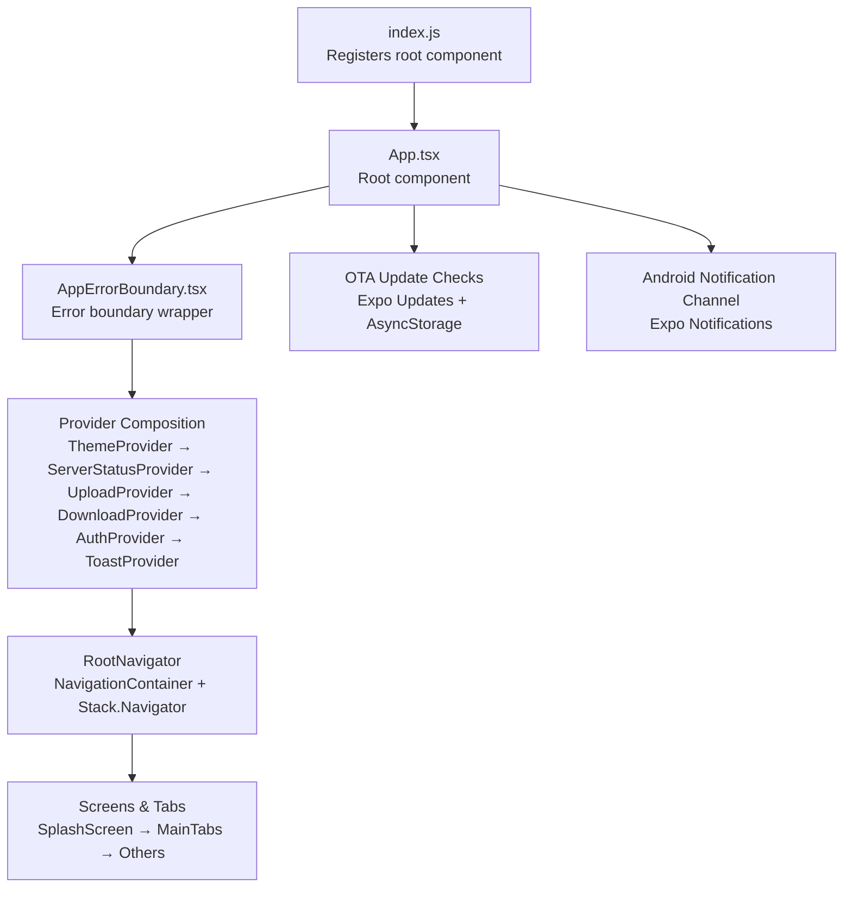
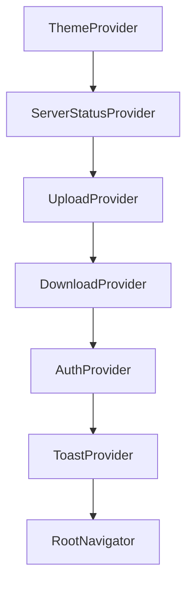
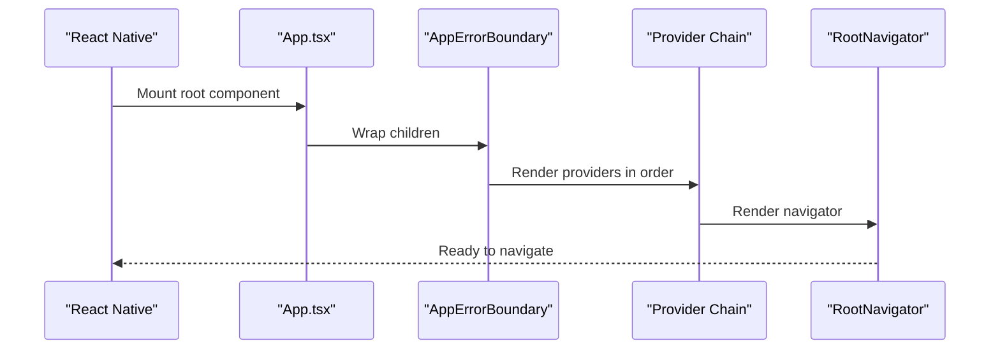
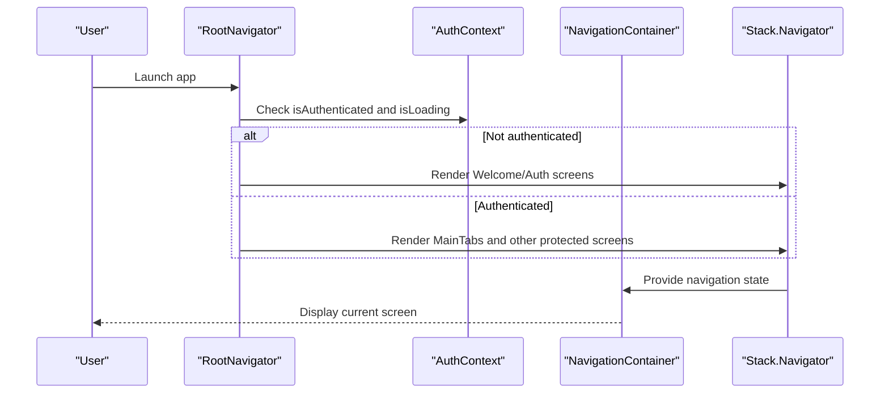
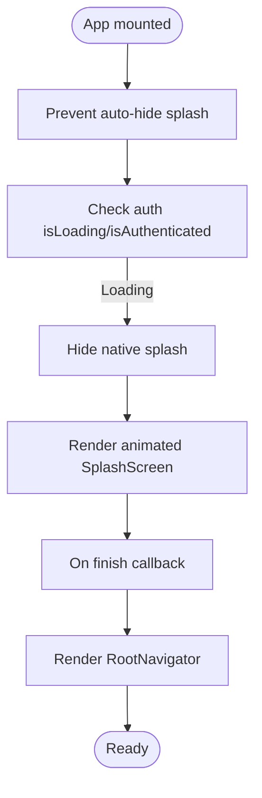
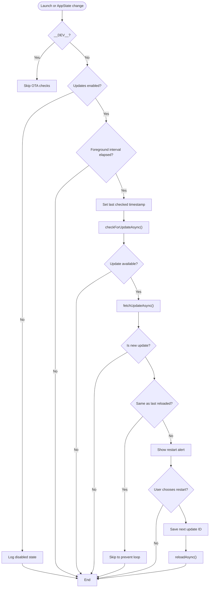
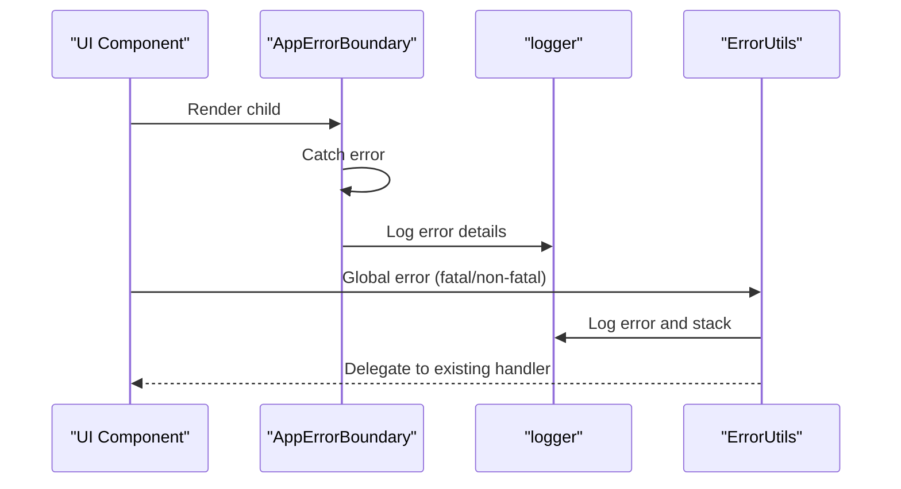
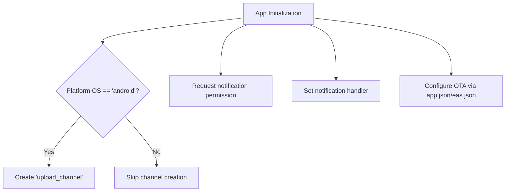
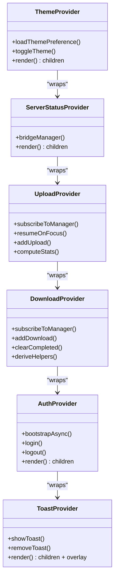
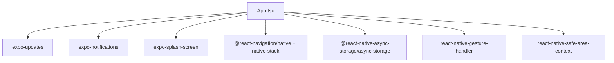

# Application Entry Point

<cite>
**Referenced Files in This Document**
- [App.tsx](file://app/App.tsx)
- [AppErrorBoundary.tsx](file://app/src/components/AppErrorBoundary.tsx)
- [ThemeContext.tsx](file://app/src/context/ThemeContext.tsx)
- [AuthContext.tsx](file://app/src/context/AuthContext.tsx)
- [ToastContext.tsx](file://app/src/context/ToastContext.tsx)
- [ServerStatusContext.tsx](file://app/src/context/ServerStatusContext.tsx)
- [UploadContext.tsx](file://app/src/context/UploadContext.tsx)
- [DownloadContext.tsx](file://app/src/context/DownloadContext.tsx)
- [SplashScreen.tsx](file://app/src/screens/SplashScreen.tsx)
- [MainTabs.tsx](file://app/src/navigation/MainTabs.tsx)
- [index.js](file://app/index.js)
- [app.json](file://app/app.json)
- [eas.json](file://app/eas.json)
- [package.json](file://app/package.json)
</cite>

## Table of Contents
1. [Introduction](#introduction)
2. [Project Structure](#project-structure)
3. [Core Components](#core-components)
4. [Architecture Overview](#architecture-overview)
5. [Detailed Component Analysis](#detailed-component-analysis)
6. [Dependency Analysis](#dependency-analysis)
7. [Performance Considerations](#performance-considerations)
8. [Troubleshooting Guide](#troubleshooting-guide)
9. [Conclusion](#conclusion)

## Introduction
This document explains the application entry point and initialization process centered on the main App.tsx component. It covers the root component structure, provider hierarchy, application lifecycle management, splash screen implementation, OTA update checking, error boundaries, global error handling, navigation container setup, state management initialization, and platform-specific configurations for Android notifications and Expo Updates integration.

## Project Structure
The application bootstraps via a minimal registration in index.js, which registers the main App.tsx component. App.tsx orchestrates:
- Provider composition for theme, server status, uploads, downloads, authentication, and toasts
- Navigation container with deep linking configuration
- Splash screen orchestration and safe area handling
- OTA update checks on launch and foreground transitions
- Global error handling and platform-specific notification setup

**Diagram sources**
- [index.js](file://app/index.js#L1-L10)
- [App.tsx](file://app/App.tsx#L115-L286)
- [AppErrorBoundary.tsx](file://app/src/components/AppErrorBoundary.tsx#L13-L48)
- [ThemeContext.tsx](file://app/src/context/ThemeContext.tsx#L102-L134)
- [ServerStatusContext.tsx](file://app/src/context/ServerStatusContext.tsx#L25-L43)
- [UploadContext.tsx](file://app/src/context/UploadContext.tsx#L51-L114)
- [DownloadContext.tsx](file://app/src/context/DownloadContext.tsx#L29-L84)
- [AuthContext.tsx](file://app/src/context/AuthContext.tsx#L19-L91)
- [ToastContext.tsx](file://app/src/context/ToastContext.tsx#L75-L98)
- [SplashScreen.tsx](file://app/src/screens/SplashScreen.tsx#L28-L112)
- [MainTabs.tsx](file://app/src/navigation/MainTabs.tsx#L76-L89)

**Section sources**
- [index.js](file://app/index.js#L1-L10)
- [App.tsx](file://app/App.tsx#L115-L286)

## Core Components
- Root component and provider composition: App.tsx composes providers in a strict order to ensure dependencies resolve correctly.
- Error boundary: AppErrorBoundary.tsx wraps the entire app to gracefully handle unhandled render errors.
- Navigation: RootNavigator renders NavigationContainer and Stack.Navigator with deep linking for share links.
- Splash screen: SplashScreen.tsx provides an animated entry experience, coordinated by App.tsx.
- OTA updates: App.tsx integrates Expo Updates with AsyncStorage to check and apply updates safely.
- Platform setup: Android notification channel and permissions are configured during initialization.

**Section sources**
- [App.tsx](file://app/App.tsx#L115-L286)
- [AppErrorBoundary.tsx](file://app/src/components/AppErrorBoundary.tsx#L13-L48)
- [SplashScreen.tsx](file://app/src/screens/SplashScreen.tsx#L28-L112)

## Architecture Overview
The provider hierarchy is intentionally ordered to satisfy dependencies:
- ThemeProvider loads user preference and guards against theme flashes
- ServerStatusProvider exposes server wake state to UI overlays
- UploadProvider and DownloadProvider expose task queues and derived stats
- AuthProvider initializes authentication state and secure token handling
- ToastProvider exposes toast notifications and animations

**Diagram sources**
- [App.tsx](file://app/App.tsx#L269-L281)
- [ThemeContext.tsx](file://app/src/context/ThemeContext.tsx#L102-L134)
- [ServerStatusContext.tsx](file://app/src/context/ServerStatusContext.tsx#L25-L43)
- [UploadContext.tsx](file://app/src/context/UploadContext.tsx#L51-L114)
- [DownloadContext.tsx](file://app/src/context/DownloadContext.tsx#L29-L84)
- [AuthContext.tsx](file://app/src/context/AuthContext.tsx#L19-L91)
- [ToastContext.tsx](file://app/src/context/ToastContext.tsx#L75-L98)

## Detailed Component Analysis

### Root Component and Provider Composition
The root component sets up:
- SafeAreaProvider and GestureHandlerRootView for UI and gesture handling
- ThemeProvider for theme mode and persistence
- ServerStatusProvider for server wake overlays
- UploadProvider and DownloadProvider for transfer state
- AuthProvider for authentication state and secure token handling
- ToastProvider for toast notifications
- AppErrorBoundary for error handling
- RootNavigator for routing and deep linking

Provider composition pattern:
- ThemeProvider wraps all others to ensure theme availability early
- ServerStatusProvider wraps UploadProvider to coordinate server wake state
- UploadProvider wraps DownloadProvider to centralize transfer state
- AuthProvider wraps ToastProvider to ensure auth-aware toasts
- RootNavigator is the innermost component to access all contexts

**Diagram sources**
- [App.tsx](file://app/App.tsx#L265-L285)
- [AppErrorBoundary.tsx](file://app/src/components/AppErrorBoundary.tsx#L13-L48)

**Section sources**
- [App.tsx](file://app/App.tsx#L265-L285)

### Navigation Container Setup and Deep Linking
RootNavigator configures:
- NavigationContainer with linking options for share links
- Stack.Navigator with headerless animations and conditional screen stacks
- Public routes for share links and welcome/auth flows
- Protected routes for authenticated users (tabs and nested screens)
- Progress overlays for uploads/downloads and server wake state

**Diagram sources**
- [App.tsx](file://app/App.tsx#L64-L113)
- [AuthContext.tsx](file://app/src/context/AuthContext.tsx#L19-L91)
- [MainTabs.tsx](file://app/src/navigation/MainTabs.tsx#L76-L89)

**Section sources**
- [App.tsx](file://app/App.tsx#L64-L113)
- [MainTabs.tsx](file://app/src/navigation/MainTabs.tsx#L76-L89)

### Splash Screen Implementation
The splash screen sequence:
- Prevents automatic splash hide initially
- Renders a native splash until authentication resolves
- Switches to animated SplashScreen after native splash hides
- Coordinates with RootNavigator to display proper screens afterward

**Diagram sources**
- [App.tsx](file://app/App.tsx#L43-L79)
- [SplashScreen.tsx](file://app/src/screens/SplashScreen.tsx#L28-L112)

**Section sources**
- [App.tsx](file://app/App.tsx#L43-L79)
- [SplashScreen.tsx](file://app/src/screens/SplashScreen.tsx#L28-L112)

### OTA Update Checking Mechanism
Key behaviors:
- Disabled in development
- Uses Expo Updates to check and fetch updates
- Stores last checked timestamp and last reloaded update ID in AsyncStorage
- Skips reloads to prevent update loops
- Alerts users with restart option and logs outcomes

**Diagram sources**
- [App.tsx](file://app/App.tsx#L119-L199)

**Section sources**
- [App.tsx](file://app/App.tsx#L119-L199)

### Error Boundary Integration and Global Error Handling
- AppErrorBoundary.tsx catches render errors and logs them
- Provides a simple UI to reload the boundary state
- Global JS error handler is temporarily overridden to log fatal errors and delegate to existing handler

**Diagram sources**
- [AppErrorBoundary.tsx](file://app/src/components/AppErrorBoundary.tsx#L16-L27)
- [App.tsx](file://app/App.tsx#L201-L215)

**Section sources**
- [AppErrorBoundary.tsx](file://app/src/components/AppErrorBoundary.tsx#L13-L48)
- [App.tsx](file://app/App.tsx#L201-L215)

### Platform-Specific Configurations
- Android notification channel:
  - Creates a dedicated channel for file transfers
  - Sets importance and disables vibration/badge/alerts
- Permissions:
  - Requests notification permission on startup
  - Configured notification handler to suppress alerts and banners
- Expo Updates:
  - Enabled and configured via app.json
  - Channels managed per EAS build profiles

**Diagram sources**
- [App.tsx](file://app/App.tsx#L217-L239)
- [app.json](file://app/app.json#L80-L85)
- [eas.json](file://app/eas.json#L6-L22)

**Section sources**
- [App.tsx](file://app/App.tsx#L217-L239)
- [app.json](file://app/app.json#L80-L85)
- [eas.json](file://app/eas.json#L6-L22)

### State Management Initialization
- ThemeProvider: Loads theme preference and prevents flash-of-wrong-theme
- AuthProvider: Bootstraps authentication state using secure storage and API verification
- UploadProvider/DownloadProvider: Subscribe to managers and compute derived stats
- ServerStatusProvider: Bridges singleton manager to React state
- ToastProvider: Manages toast queue and animations

**Diagram sources**
- [ThemeContext.tsx](file://app/src/context/ThemeContext.tsx#L102-L134)
- [AuthContext.tsx](file://app/src/context/AuthContext.tsx#L19-L91)
- [UploadContext.tsx](file://app/src/context/UploadContext.tsx#L51-L114)
- [DownloadContext.tsx](file://app/src/context/DownloadContext.tsx#L29-L84)
- [ServerStatusContext.tsx](file://app/src/context/ServerStatusContext.tsx#L25-L43)
- [ToastContext.tsx](file://app/src/context/ToastContext.tsx#L75-L98)

**Section sources**
- [ThemeContext.tsx](file://app/src/context/ThemeContext.tsx#L102-L134)
- [AuthContext.tsx](file://app/src/context/AuthContext.tsx#L19-L91)
- [UploadContext.tsx](file://app/src/context/UploadContext.tsx#L51-L114)
- [DownloadContext.tsx](file://app/src/context/DownloadContext.tsx#L29-L84)
- [ServerStatusContext.tsx](file://app/src/context/ServerStatusContext.tsx#L25-L43)
- [ToastContext.tsx](file://app/src/context/ToastContext.tsx#L75-L98)

## Dependency Analysis
External dependencies relevant to the entry point:
- Expo ecosystem: Updates, Notifications, Splash Screen, Status Bar
- Navigation: React Navigation Native and Native Stack
- Storage: AsyncStorage and secure storage utilities
- UI: Safe Area Context, Gesture Handler

**Diagram sources**
- [App.tsx](file://app/App.tsx#L1-L11)
- [package.json](file://app/package.json#L11-L51)

**Section sources**
- [App.tsx](file://app/App.tsx#L1-L11)
- [package.json](file://app/package.json#L11-L51)

## Performance Considerations
- Provider ordering minimizes re-renders by placing heavy providers (Upload/Download) close to the leaf nodes they serve
- ThemeProvider defers rendering until theme preference is resolved to avoid theme flashes
- OTA checks are throttled by interval and skip redundant reloads
- Animated splash uses native driver where possible to reduce JS overhead
- Navigation screens are conditionally rendered based on authentication state to avoid unnecessary mounts

## Troubleshooting Guide
Common issues and resolutions:
- OTA update loop: The app skips reloads when the next update ID matches the last reloaded ID; ensure AsyncStorage keys are properly maintained
- Authentication state stuck: Verify secure storage keys and API response handling in AuthProvider
- Toast not appearing: Confirm ToastProvider is mounted and theme context is available
- Splash not hiding: Ensure native splash is hidden after auth resolves and animated splash completes
- Notifications not visible: Confirm Android channel creation and notification permission status

**Section sources**
- [App.tsx](file://app/App.tsx#L157-L164)
- [AuthContext.tsx](file://app/src/context/AuthContext.tsx#L25-L60)
- [ToastContext.tsx](file://app/src/context/ToastContext.tsx#L75-L98)
- [App.tsx](file://app/App.tsx#L71-L76)
- [App.tsx](file://app/App.tsx#L217-L239)

## Conclusion
The App.tsx entry point establishes a robust initialization pipeline with a carefully ordered provider hierarchy, comprehensive error handling, animated splash experience, OTA update safety mechanisms, and platform-specific configurations. This structure ensures predictable state management, smooth user experience, and maintainable code organization across screens and navigation flows.