# Component Architecture

<cite>
**Referenced Files in This Document**
- [LoginCard.tsx](file://app/src/components/LoginCard.tsx)
- [OTPInput.tsx](file://app/src/components/OTPInput.tsx)
- [PrimaryButton.tsx](file://app/src/components/PrimaryButton.tsx)
- [FileCard.tsx](file://app/src/components/FileCard.tsx)
- [FileIcon.tsx](file://app/src/components/FileIcon.tsx)
- [FileListComponent.tsx](file://app/src/components/FileListComponent.tsx)
- [UploadFileButton.tsx](file://app/src/components/UploadFileButton.tsx)
- [VideoPlayer.tsx](file://app/src/components/VideoPlayer.tsx)
- [ShareFolderModal.tsx](file://app/src/components/ShareFolderModal.tsx)
- [PhoneInputField.tsx](file://app/src/components/PhoneInputField.tsx)
- [AxyaLogo.tsx](file://app/src/components/AxyaLogo.tsx)
- [ThemeContext.tsx](file://app/src/context/ThemeContext.tsx)
- [AuthContext.tsx](file://app/src/context/AuthContext.tsx)
- [theme.ts](file://app/src/ui/theme.ts)
</cite>

## Table of Contents
1. [Introduction](#introduction)
2. [Project Structure](#project-structure)
3. [Core Components](#core-components)
4. [Architecture Overview](#architecture-overview)
5. [Detailed Component Analysis](#detailed-component-analysis)
6. [Dependency Analysis](#dependency-analysis)
7. [Performance Considerations](#performance-considerations)
8. [Accessibility Implementation](#accessibility-implementation)
9. [Responsive Design Considerations](#responsive-design-considerations)
10. [Testing Strategies](#testing-strategies)
11. [Troubleshooting Guide](#troubleshooting-guide)
12. [Conclusion](#conclusion)

## Introduction
This document explains the component architecture for reusable UI components and composition patterns in the project. It covers component hierarchy, prop interfaces, lifecycle management, the design system, common component patterns (LoginCard, OTPInput, PrimaryButton), and specialized components for file management. It also documents styling patterns, integration with context providers, testing strategies, accessibility, and responsive design considerations.

## Project Structure
The UI components are organized under app/src/components, grouped by domain and responsibility:
- Authentication and user input: LoginCard, OTPInput, PhoneInputField
- Action primitives: PrimaryButton
- File management: FileCard, FileIcon, FileListComponent, UploadFileButton, VideoPlayer
- Sharing and modals: ShareFolderModal
- Branding and small UI: AxyaLogo
- Design system and contexts: ThemeContext, AuthContext, theme.ts

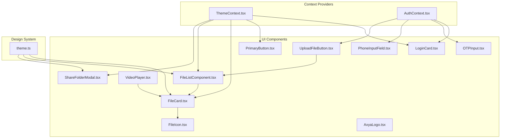

**Diagram sources**
- [ThemeContext.tsx](file://app/src/context/ThemeContext.tsx#L102-L134)
- [AuthContext.tsx](file://app/src/context/AuthContext.tsx#L19-L91)
- [LoginCard.tsx](file://app/src/components/LoginCard.tsx#L10-L54)
- [OTPInput.tsx](file://app/src/components/OTPInput.tsx#L15-L180)
- [PhoneInputField.tsx](file://app/src/components/PhoneInputField.tsx#L13-L88)
- [PrimaryButton.tsx](file://app/src/components/PrimaryButton.tsx#L13-L63)
- [FileCard.tsx](file://app/src/components/FileCard.tsx#L32-L93)
- [FileIcon.tsx](file://app/src/components/FileIcon.tsx#L16-L47)
- [FileListComponent.tsx](file://app/src/components/FileListComponent.tsx#L19-L59)
- [UploadFileButton.tsx](file://app/src/components/UploadFileButton.tsx#L14-L47)
- [VideoPlayer.tsx](file://app/src/components/VideoPlayer.tsx#L28-L241)
- [ShareFolderModal.tsx](file://app/src/components/ShareFolderModal.tsx#L18-L201)
- [AxyaLogo.tsx](file://app/src/components/AxyaLogo.tsx#L11-L27)
- [theme.ts](file://app/src/ui/theme.ts#L1-L130)

**Section sources**
- [ThemeContext.tsx](file://app/src/context/ThemeContext.tsx#L102-L134)
- [AuthContext.tsx](file://app/src/context/AuthContext.tsx#L19-L91)
- [theme.ts](file://app/src/ui/theme.ts#L1-L130)

## Core Components
This section introduces the foundational components and their roles in the system.

- LoginCard
  - Purpose: Presents form content in a bottom-sheet-like animated card with scroll support and keyboard-aware margins.
  - Props: children (ReactNode), keyboardVisible (boolean).
  - Lifecycle: Uses Animated with spring/timing on mount; integrates ScrollView with keyboard handling.
  - Composition: Wraps form sections; supports dynamic marginBottom based on keyboard visibility.

- OTPInput
  - Purpose: Multi-digit OTP entry with individual TextInput cells, auto-focus transitions, clipboard detection, resend timer, and error state.
  - Props: value (string), onChange (callback), onResend (callback), loading (optional), error (optional), resendSeconds (optional), length (optional).
  - Lifecycle: Manages internal OTP array state, timers, focus animations, and clipboard checks on mount.
  - Composition: Composes TextInput cells with animated underlines; exposes resend UX and error messaging.

- PrimaryButton
  - Purpose: Prominent CTA with press animations, loading indicator, and disabled states.
  - Props: onPress (callback), disabled (optional), loading (optional), label (string).
  - Lifecycle: Animates scale on pressIn/pressOut; disables interactions when loading/disabled.
  - Composition: Uses Animated.View and ActivityIndicator; integrates with theme colors.

- FileCard
  - Purpose: Unified card for files/folders with icon, name, metadata, and actions.
  - Props: item (any), onPress (callback), onOptions (optional), token (optional), apiBase (optional).
  - Lifecycle: Handles press animations; resolves folder vs file; formats size/date.
  - Composition: Integrates FileIcon; respects theme via ThemeContext; supports action buttons.

- FileIcon
  - Purpose: Renders appropriate icon or thumbnail based on MIME type and availability.
  - Props: item (any), size (number), token (optional), apiBase (optional), themeColors (object), style (optional).
  - Lifecycle: Uses Image with error fallback; constructs thumbnail URL from apiBase and token.
  - Composition: Provides color/background per MIME category; supports media thumbnails.

- FileListComponent
  - Purpose: Renders a unified list of folders and files with download affordances.
  - Props: files (array), folders (array), canDownload (boolean), onOpenFolder (callback), onDownload (callback).
  - Lifecycle: Memoizes combined rows; renders FlatList with themed styling.
  - Composition: Uses Folder/File icons; handles empty state.

- UploadFileButton
  - Purpose: Triggers document picker and uploads selected file to a shared space.
  - Props: spaceId (string), folderPath (string), accessToken (optional), onUploaded (callback).
  - Lifecycle: Manages uploading state; integrates with DocumentPicker and upload service.
  - Composition: Uses ThemeContext for colors; shows ActivityIndicator while uploading.

- VideoPlayer
  - Purpose: Full-featured video player with streaming status badges, loading overlays, error handling, and controls.
  - Props: url (string), token (string), width (number), fileId (optional), onError (optional).
  - Lifecycle: Manages player lifecycle, status polling, progressive loading messages, and retry logic.
  - Composition: Integrates expo-video; overlays controls and status indicators.

- ShareFolderModal
  - Purpose: Generates share links for files/folders with configurable permissions and expiry.
  - Props: visible (boolean), onClose (callback), targetItem (any).
  - Lifecycle: Maintains stable target while modal is open; manages settings and generation flow.
  - Composition: Uses Switch and pill selectors; integrates Clipboard and Alert.

- PhoneInputField
  - Purpose: Country-specific phone input with formatting and focus animations.
  - Props: value (string), onChangeText (callback), error (optional), editable (boolean), autoFocus (boolean), onSubmitEditing (optional).
  - Lifecycle: Formats numeric input; animates border color on focus; auto-focuses with delay.
  - Composition: Uses Animated for border color interpolation.

- AxyaLogo
  - Purpose: Brand logo with optional text and theme-aware coloring.
  - Props: size (number), showText (boolean), textColor (string), dark (boolean).
  - Composition: Renders image and text with proportional sizing.

**Section sources**
- [LoginCard.tsx](file://app/src/components/LoginCard.tsx#L4-L54)
- [OTPInput.tsx](file://app/src/components/OTPInput.tsx#L5-L180)
- [PrimaryButton.tsx](file://app/src/components/PrimaryButton.tsx#L5-L63)
- [FileCard.tsx](file://app/src/components/FileCard.tsx#L8-L93)
- [FileIcon.tsx](file://app/src/components/FileIcon.tsx#L6-L47)
- [FileListComponent.tsx](file://app/src/components/FileListComponent.tsx#L7-L59)
- [UploadFileButton.tsx](file://app/src/components/UploadFileButton.tsx#L7-L47)
- [VideoPlayer.tsx](file://app/src/components/VideoPlayer.tsx#L18-L241)
- [ShareFolderModal.tsx](file://app/src/components/ShareFolderModal.tsx#L12-L201)
- [PhoneInputField.tsx](file://app/src/components/PhoneInputField.tsx#L4-L88)
- [AxyaLogo.tsx](file://app/src/components/AxyaLogo.tsx#L4-L27)

## Architecture Overview
The component architecture follows a layered pattern:
- Design system layer: theme tokens and provider (ThemeContext)
- Domain components: file management, authentication, sharing, media playback
- Primitive components: buttons, inputs, modals
- Context integration: AuthContext for authentication state and secure token handling

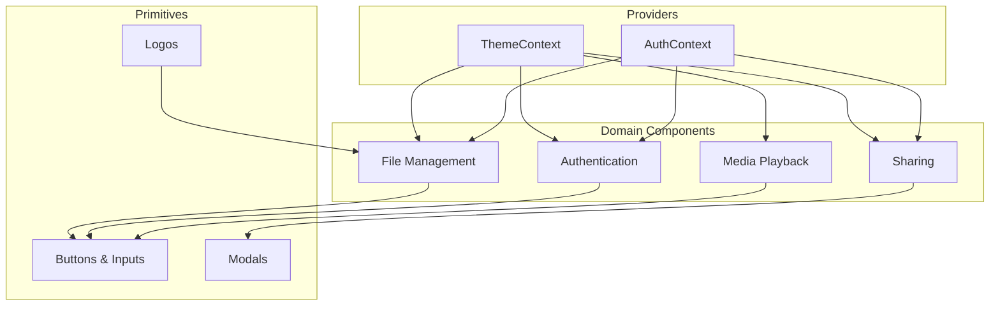

**Diagram sources**
- [ThemeContext.tsx](file://app/src/context/ThemeContext.tsx#L102-L134)
- [AuthContext.tsx](file://app/src/context/AuthContext.tsx#L19-L91)
- [FileCard.tsx](file://app/src/components/FileCard.tsx#L32-L93)
- [OTPInput.tsx](file://app/src/components/OTPInput.tsx#L15-L180)
- [PrimaryButton.tsx](file://app/src/components/PrimaryButton.tsx#L13-L63)
- [ShareFolderModal.tsx](file://app/src/components/ShareFolderModal.tsx#L18-L201)
- [VideoPlayer.tsx](file://app/src/components/VideoPlayer.tsx#L28-L241)

## Detailed Component Analysis

### LoginCard Analysis
- Composition pattern: Animated presentation with keyboard-aware margins; wraps arbitrary children; uses ScrollView for content overflow.
- Lifecycle: Spring and timing animations on mount; integrates with keyboardVisible to adjust layout.
- Styling: Uses StyleSheet with rounded corners, shadow, and constrained maxHeight for small devices.

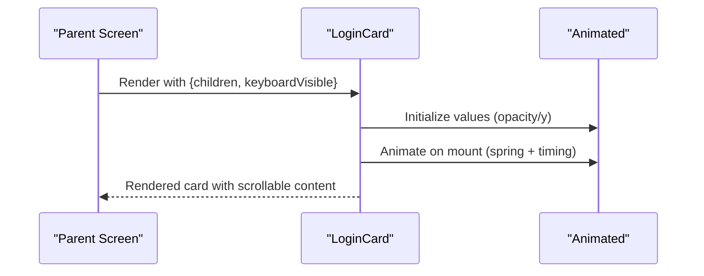

**Diagram sources**
- [LoginCard.tsx](file://app/src/components/LoginCard.tsx#L14-L30)
- [LoginCard.tsx](file://app/src/components/LoginCard.tsx#L32-L54)

**Section sources**
- [LoginCard.tsx](file://app/src/components/LoginCard.tsx#L4-L54)

### OTPInput Analysis
- Composition pattern: Array of single-character inputs; auto-focus transitions; clipboard detection; resend timer.
- Lifecycle: Manages internal OTP array; handles Backspace navigation; clears intervals on unmount.
- Styling: Animated underlines; error state overrides; centered digit inputs with consistent sizing.

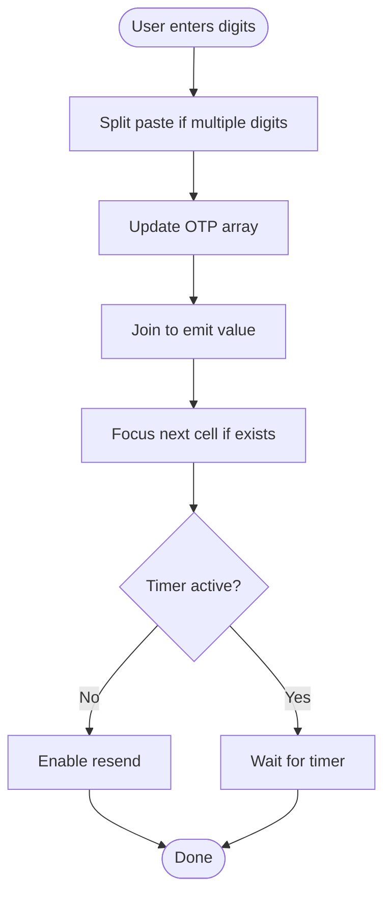

**Diagram sources**
- [OTPInput.tsx](file://app/src/components/OTPInput.tsx#L59-L94)
- [OTPInput.tsx](file://app/src/components/OTPInput.tsx#L96-L103)

**Section sources**
- [OTPInput.tsx](file://app/src/components/OTPInput.tsx#L5-L180)

### PrimaryButton Analysis
- Composition pattern: Animated press feedback; conditional loading indicator; integrates with theme colors.
- Lifecycle: Spring animations for pressIn/pressOut; disables interactions when loading/disabled.
- Styling: Consistent padding, shadow, and typography; arrow icon with background circle.

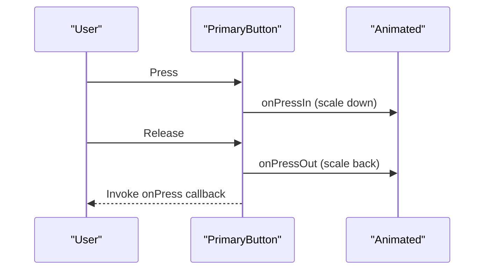

**Diagram sources**
- [PrimaryButton.tsx](file://app/src/components/PrimaryButton.tsx#L16-L32)
- [PrimaryButton.tsx](file://app/src/components/PrimaryButton.tsx#L36-L63)

**Section sources**
- [PrimaryButton.tsx](file://app/src/components/PrimaryButton.tsx#L5-L63)

### FileCard Analysis
- Composition pattern: Integrates FileIcon; supports folder vs file; action menu with MoreHorizontal.
- Lifecycle: Press animations; resolves folder vs file; formats size/date metadata.
- Styling: Uses theme colors for text and backgrounds; consistent spacing and typography.

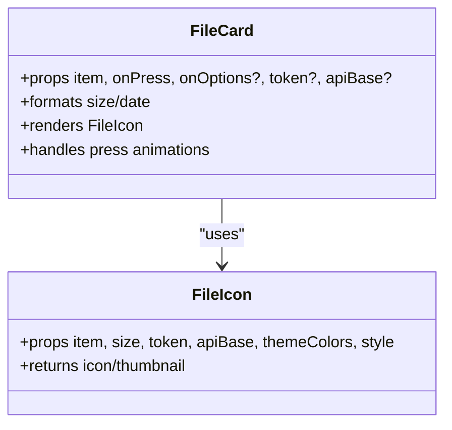

**Diagram sources**
- [FileCard.tsx](file://app/src/components/FileCard.tsx#L32-L93)
- [FileIcon.tsx](file://app/src/components/FileIcon.tsx#L16-L47)

**Section sources**
- [FileCard.tsx](file://app/src/components/FileCard.tsx#L8-L93)
- [FileIcon.tsx](file://app/src/components/FileIcon.tsx#L6-L47)

### FileListComponent Analysis
- Composition pattern: Combines folders and files into a single list; renders differently for folders vs files.
- Lifecycle: Memoizes combined rows to avoid unnecessary re-renders; handles empty state.
- Styling: Themed borders, backgrounds, and typography; consistent row layout.

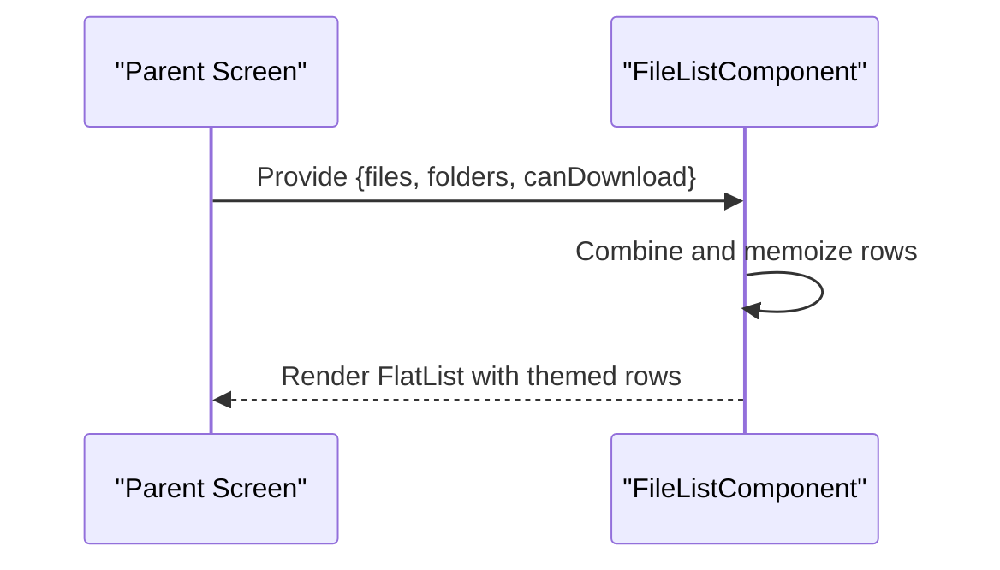

**Diagram sources**
- [FileListComponent.tsx](file://app/src/components/FileListComponent.tsx#L19-L59)

**Section sources**
- [FileListComponent.tsx](file://app/src/components/FileListComponent.tsx#L7-L59)

### UploadFileButton Analysis
- Composition pattern: Opens document picker; uploads selected file; notifies parent on completion.
- Lifecycle: Manages uploading state; integrates with DocumentPicker and upload service.
- Styling: Themed primary color; centered text or spinner.

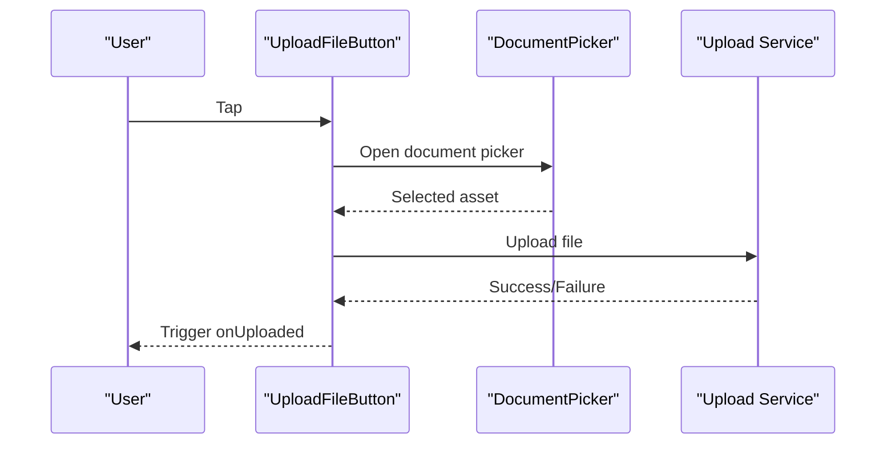

**Diagram sources**
- [UploadFileButton.tsx](file://app/src/components/UploadFileButton.tsx#L18-L36)
- [UploadFileButton.tsx](file://app/src/components/UploadFileButton.tsx#L38-L47)

**Section sources**
- [UploadFileButton.tsx](file://app/src/components/UploadFileButton.tsx#L7-L47)

### VideoPlayer Analysis
- Composition pattern: Integrates expo-video; overlays controls and status badges; handles retries and errors.
- Lifecycle: Manages player lifecycle, status polling, and progressive loading messages.
- Styling: Absolute overlays for controls and messages; themed badges and buttons.

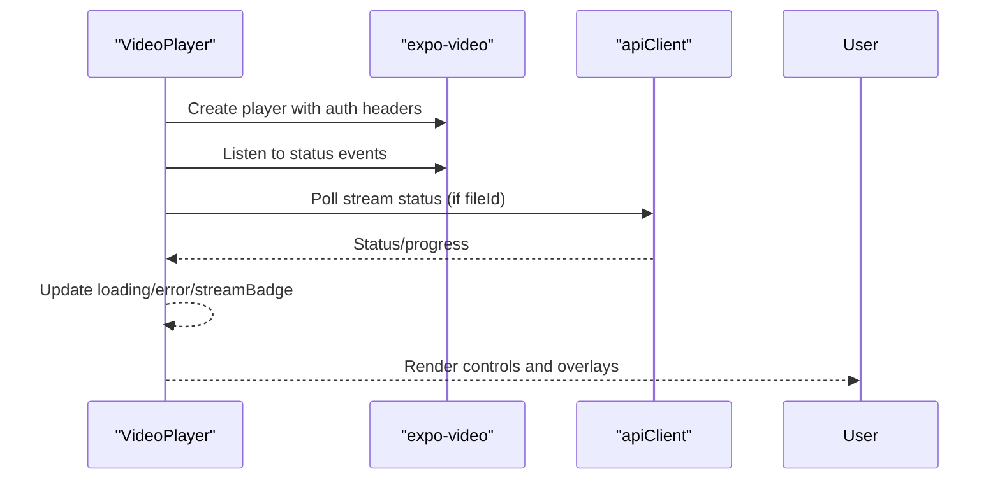

**Diagram sources**
- [VideoPlayer.tsx](file://app/src/components/VideoPlayer.tsx#L39-L88)
- [VideoPlayer.tsx](file://app/src/components/VideoPlayer.tsx#L113-L131)
- [VideoPlayer.tsx](file://app/src/components/VideoPlayer.tsx#L161-L241)

**Section sources**
- [VideoPlayer.tsx](file://app/src/components/VideoPlayer.tsx#L18-L241)

### ShareFolderModal Analysis
- Composition pattern: Modal with settings (allow download, expiry); generates share link; copies to clipboard.
- Lifecycle: Keeps stable target while visible; resets settings on open; integrates Clipboard and Alert.
- Styling: Themed backgrounds, borders, and typography; pill selectors and switches.

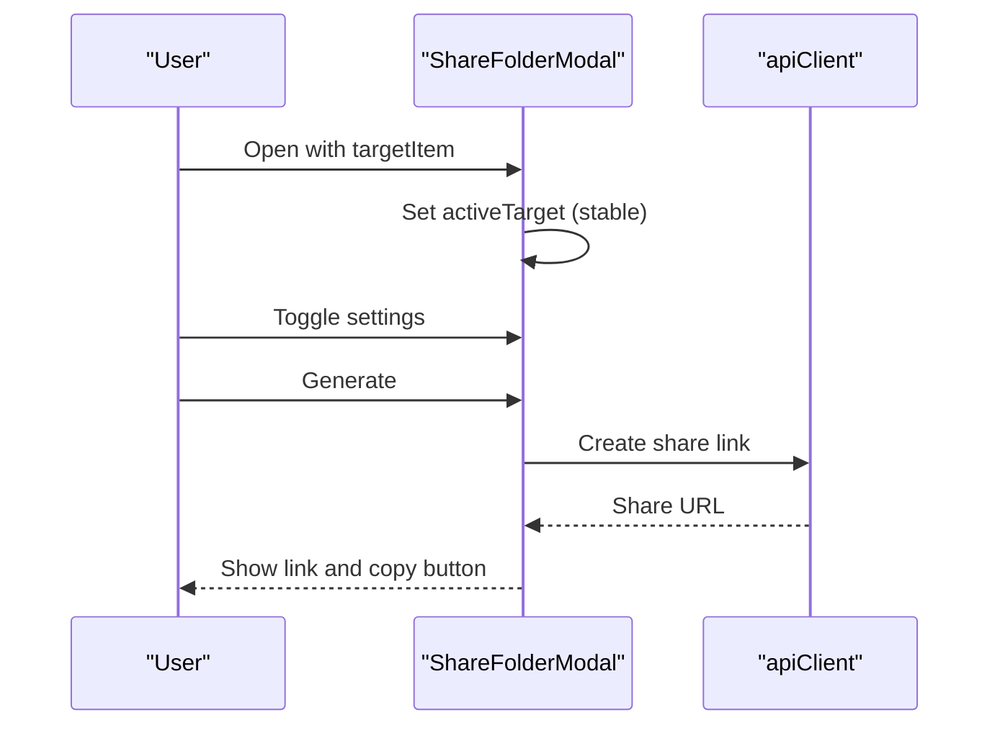

**Diagram sources**
- [ShareFolderModal.tsx](file://app/src/components/ShareFolderModal.tsx#L18-L88)
- [ShareFolderModal.tsx](file://app/src/components/ShareFolderModal.tsx#L54-L78)
- [ShareFolderModal.tsx](file://app/src/components/ShareFolderModal.tsx#L80-L85)

**Section sources**
- [ShareFolderModal.tsx](file://app/src/components/ShareFolderModal.tsx#L12-L201)

### PhoneInputField Analysis
- Composition pattern: Country code prefix; numeric formatting; focus animations; optional auto-focus.
- Lifecycle: Interpolates border color; cleans input to numeric; limits length.
- Styling: Consistent typography and spacing; placeholder and selection colors.

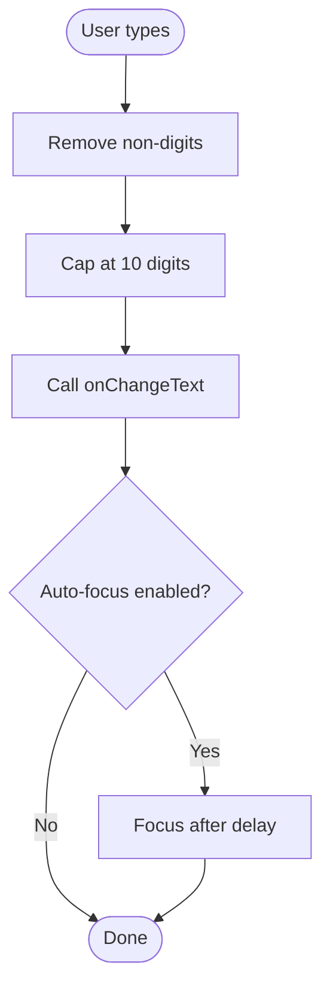

**Diagram sources**
- [PhoneInputField.tsx](file://app/src/components/PhoneInputField.tsx#L40-L45)
- [PhoneInputField.tsx](file://app/src/components/PhoneInputField.tsx#L25-L30)

**Section sources**
- [PhoneInputField.tsx](file://app/src/components/PhoneInputField.tsx#L4-L88)

### AxyaLogo Analysis
- Composition pattern: Renders logo image and optional text; supports dark/light variants.
- Styling: Proportional sizing; horizontal layout with spacing.

**Section sources**
- [AxyaLogo.tsx](file://app/src/components/AxyaLogo.tsx#L4-L27)

## Dependency Analysis
Key dependencies and relationships:
- ThemeContext supplies theme tokens and toggles to all themed components.
- AuthContext provides authentication state and secure token handling to auth-related components.
- FileCard depends on FileIcon for rendering; FileListComponent composes FileCard.
- VideoPlayer integrates with apiClient for stream status; UploadFileButton integrates with upload service.
- ShareFolderModal integrates with Clipboard and Alert; uses theme colors.

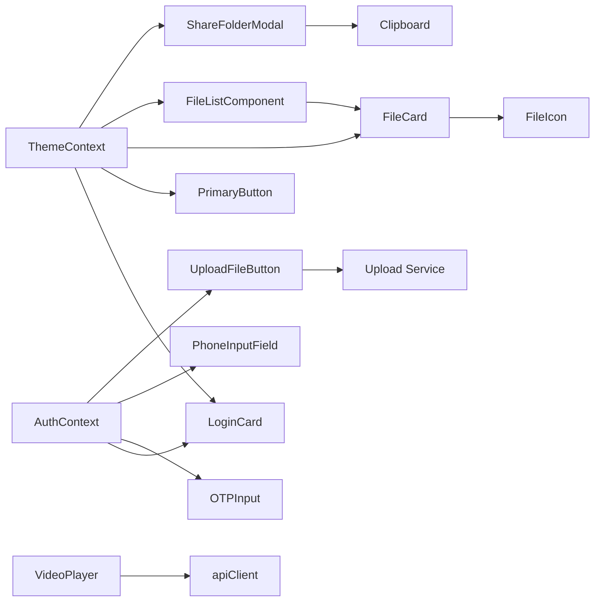

**Diagram sources**
- [ThemeContext.tsx](file://app/src/context/ThemeContext.tsx#L102-L134)
- [AuthContext.tsx](file://app/src/context/AuthContext.tsx#L19-L91)
- [FileCard.tsx](file://app/src/components/FileCard.tsx#L32-L93)
- [FileIcon.tsx](file://app/src/components/FileIcon.tsx#L16-L47)
- [FileListComponent.tsx](file://app/src/components/FileListComponent.tsx#L19-L59)
- [VideoPlayer.tsx](file://app/src/components/VideoPlayer.tsx#L28-L241)
- [UploadFileButton.tsx](file://app/src/components/UploadFileButton.tsx#L14-L47)
- [ShareFolderModal.tsx](file://app/src/components/ShareFolderModal.tsx#L18-L201)

**Section sources**
- [ThemeContext.tsx](file://app/src/context/ThemeContext.tsx#L102-L134)
- [AuthContext.tsx](file://app/src/context/AuthContext.tsx#L19-L91)
- [FileCard.tsx](file://app/src/components/FileCard.tsx#L32-L93)
- [FileIcon.tsx](file://app/src/components/FileIcon.tsx#L16-L47)
- [FileListComponent.tsx](file://app/src/components/FileListComponent.tsx#L19-L59)
- [VideoPlayer.tsx](file://app/src/components/VideoPlayer.tsx#L28-L241)
- [UploadFileButton.tsx](file://app/src/components/UploadFileButton.tsx#L14-L47)
- [ShareFolderModal.tsx](file://app/src/components/ShareFolderModal.tsx#L18-L201)

## Performance Considerations
- Component memoization: Several components use React.memo to prevent unnecessary re-renders (LoginCard, OTPInput, PrimaryButton, FileListComponent).
- Animated usage: Native driver is used where possible (e.g., LoginCard, PrimaryButton) to improve performance; non-native interpolations are used for color transitions.
- List virtualization: FileListComponent uses FlatList to efficiently render large lists.
- Async operations: VideoPlayer and ShareFolderModal manage timers and intervals carefully; cleanup occurs on unmount to avoid leaks.
- Image caching: FileIcon uses disk cache policy and error fallback to reduce repeated loads.

[No sources needed since this section provides general guidance]

## Accessibility Implementation
- Touch targets: Buttons and interactive elements use adequate size and spacing (e.g., PrimaryButton, ShareFolderModal buttons).
- Focus states: Inputs animate focus states (OTPInput, PhoneInputField) to indicate state changes.
- Text contrast: Theme tokens define sufficient contrast for text and backgrounds.
- Keyboard handling: LoginCard uses keyboardShouldPersistTaps and keyboardDismissMode; PhoneInputField auto-focus with delay to coordinate with animations.
- Content types: OTPInput sets textContentType and autoComplete for better OS integration.

[No sources needed since this section provides general guidance]

## Responsive Design Considerations
- Flexible layouts: Components use percentage widths and flexible directions (column/row) to adapt to varying screen sizes.
- Constrained heights: LoginCard applies maxHeight to prevent full-screen consumption on small devices.
- Typography scaling: theme.ts defines scalable font sizes and weights; components consume these tokens.
- Spacing grid: theme.ts defines an 8px spacing system; components use consistent spacing tokens.
- Modal presentations: ShareFolderModal uses KeyboardAvoidingView and platform-specific adjustments for iOS/Android.

[No sources needed since this section provides general guidance]

## Testing Strategies
Recommended strategies for component testing:
- Unit tests for pure logic:
  - OTPInput: simulate typing, pasting multi-digit values, Backspace navigation, timer ticks, and clipboard detection.
  - PhoneInputField: validate numeric cleaning, length caps, and focus animations.
  - FileCard: verify folder vs file rendering, size/date formatting, and action callbacks.
- Integration tests for composed flows:
  - LoginCard: verify animation start, keyboard-aware margin, and scroll behavior.
  - ShareFolderModal: simulate settings changes, link generation, and clipboard copy.
  - VideoPlayer: mock player status events, stream status polling, and retry logic.
- Context-aware tests:
  - ThemeContext: render components under both light/dark modes and assert color usage.
  - AuthContext: render auth-dependent components with and without token to verify behavior.
- Snapshot tests:
  - Capture rendered outputs of complex components (FileCard, ShareFolderModal) to detect unintended layout shifts.

[No sources needed since this section provides general guidance]

## Troubleshooting Guide
Common issues and resolutions:
- Animation glitches:
  - Ensure Animated values are initialized before mounting and cleared on unmount (e.g., OTPInput timers, LoginCard animations).
- Keyboard conflicts:
  - Use keyboardShouldPersistTaps and keyboardDismissMode in scroll containers; coordinate auto-focus delays with animations.
- Clipboard errors:
  - Wrap Clipboard operations in try/catch blocks and handle gracefully (OTPInput).
- Network/streaming failures:
  - Implement retry logic and error overlays (VideoPlayer).
- Theme flashes:
  - ThemeProvider defers rendering until theme preference is loaded to prevent flash-of-wrong-theme.

**Section sources**
- [OTPInput.tsx](file://app/src/components/OTPInput.tsx#L105-L119)
- [LoginCard.tsx](file://app/src/components/LoginCard.tsx#L14-L30)
- [ThemeContext.tsx](file://app/src/context/ThemeContext.tsx#L123-L127)
- [VideoPlayer.tsx](file://app/src/components/VideoPlayer.tsx#L153-L159)

## Conclusion
The component architecture emphasizes composability, consistency, and performance. Reusable primitives (buttons, inputs, modals) integrate with a robust design system and context providers to deliver a cohesive user experience. Specialized components for file management, authentication, and media playback demonstrate clear separation of concerns and maintainable patterns suitable for extension and testing.