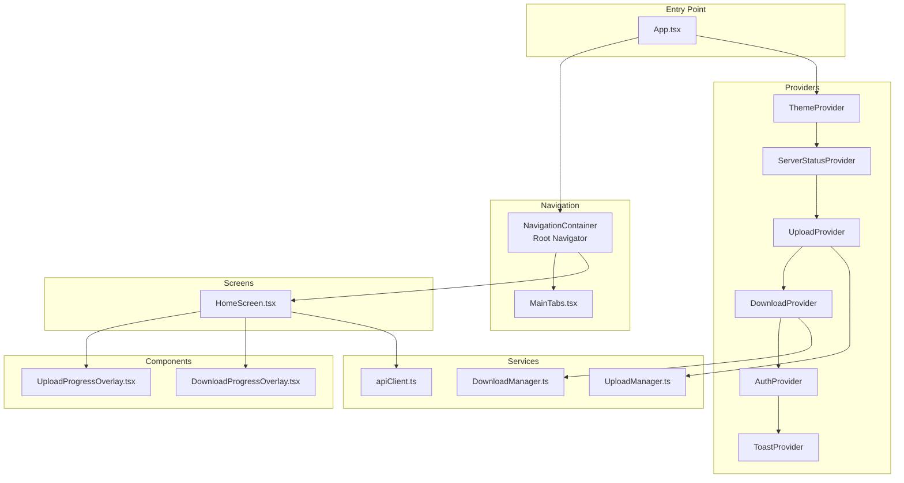
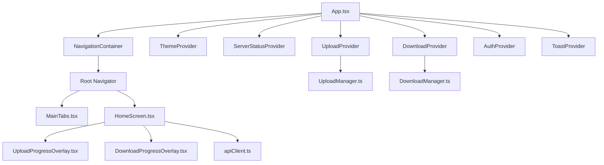
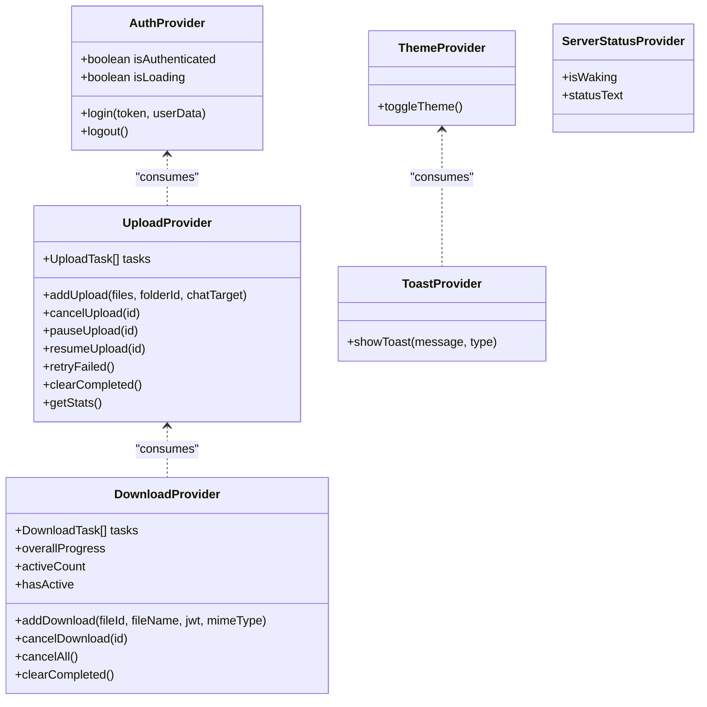
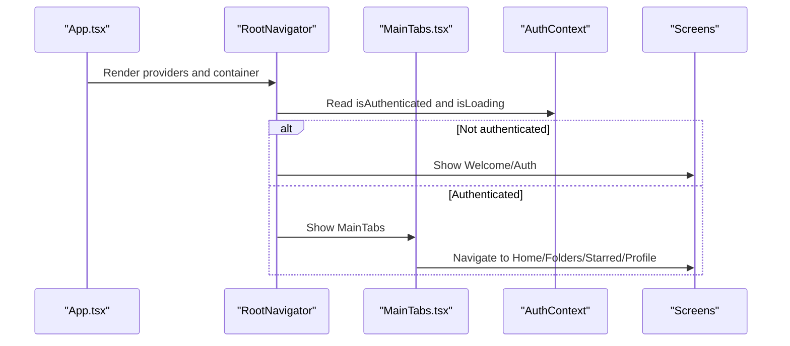
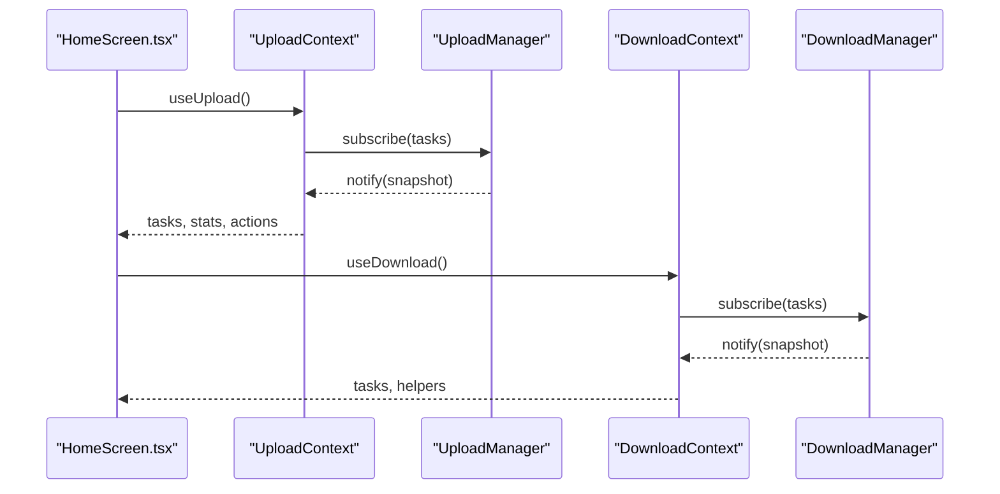
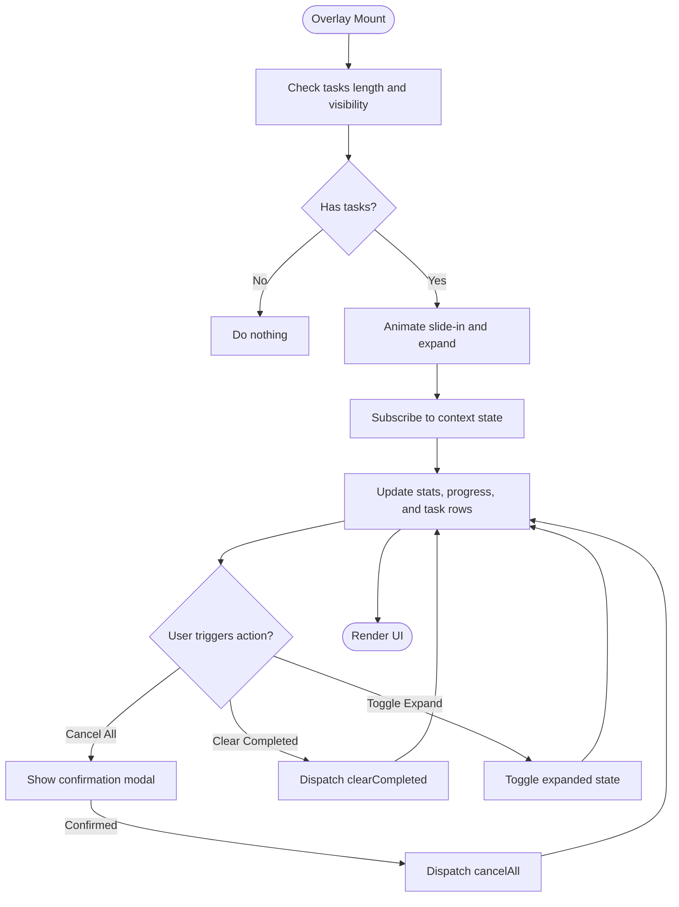
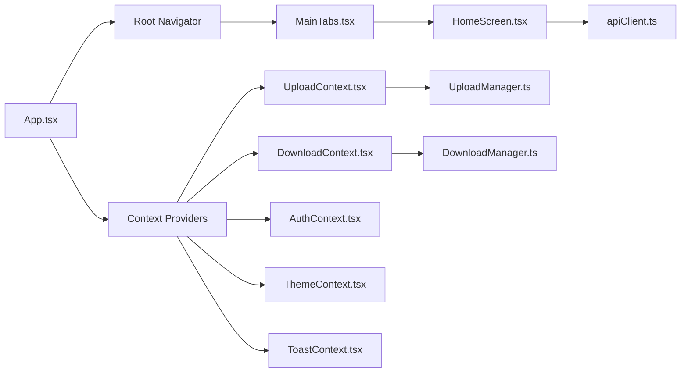

# Frontend Architecture

<cite>
**Referenced Files in This Document**
- [App.tsx](file://app/App.tsx)
- [MainTabs.tsx](file://app/src/navigation/MainTabs.tsx)
- [AuthContext.tsx](file://app/src/context/AuthContext.tsx)
- [UploadContext.tsx](file://app/src/context/UploadContext.tsx)
- [DownloadContext.tsx](file://app/src/context/DownloadContext.tsx)
- [ThemeContext.tsx](file://app/src/context/ThemeContext.tsx)
- [ToastContext.tsx](file://app/src/context/ToastContext.tsx)
- [ServerStatusContext.tsx](file://app/src/context/ServerStatusContext.tsx)
- [UploadManager.ts](file://app/src/services/UploadManager.ts)
- [DownloadManager.ts](file://app/src/services/DownloadManager.ts)
- [HomeScreen.tsx](file://app/src/screens/HomeScreen.tsx)
- [UploadProgressOverlay.tsx](file://app/src/components/UploadProgressOverlay.tsx)
- [DownloadProgressOverlay.tsx](file://app/src/components/DownloadProgressOverlay.tsx)
- [ApiCacheStore.ts](file://app/src/context/ApiCacheStore.ts)
- [apiClient.ts](file://app/src/services/apiClient.ts)
</cite>

## Table of Contents
1. [Introduction](#introduction)
2. [Project Structure](#project-structure)
3. [Core Components](#core-components)
4. [Architecture Overview](#architecture-overview)
5. [Detailed Component Analysis](#detailed-component-analysis)
6. [Dependency Analysis](#dependency-analysis)
7. [Performance Considerations](#performance-considerations)
8. [Troubleshooting Guide](#troubleshooting-guide)
9. [Conclusion](#conclusion)
10. [Appendices](#appendices)

## Introduction
This document explains the React Native frontend architecture of the application, focusing on the entry point, navigation system, and centralized state management via React Context providers. It details how the provider pattern is applied across authentication, uploads, downloads, theme, toasts, and server status, and how these integrate with service-layer managers and UI overlays. Guidance is included for extending the architecture and maintaining code quality as the application grows.

## Project Structure
The frontend is organized around a single entry point that composes navigators and providers, with feature-based screens and services. Providers wrap global state and services, enabling decoupled component composition and predictable data flow.

**Diagram sources**
- [App.tsx](file://app/App.tsx#L115-L286)
- [MainTabs.tsx](file://app/src/navigation/MainTabs.tsx#L76-L89)
- [UploadProgressOverlay.tsx](file://app/src/components/UploadProgressOverlay.tsx#L29-L67)
- [DownloadProgressOverlay.tsx](file://app/src/components/DownloadProgressOverlay.tsx#L85-L154)
- [UploadManager.ts](file://app/src/services/UploadManager.ts#L126-L198)
- [DownloadManager.ts](file://app/src/services/DownloadManager.ts#L42-L78)
- [apiClient.ts](file://app/src/services/apiClient.ts#L31-L42)

**Section sources**
- [App.tsx](file://app/App.tsx#L115-L286)
- [MainTabs.tsx](file://app/src/navigation/MainTabs.tsx#L76-L89)

## Core Components
- App.tsx: Application entry point orchestrating providers, navigator, overlays, and OTA update checks.
- Navigation: Root navigator determines routes based on authentication state; MainTabs defines the bottom-tabbed interface.
- Context Providers: Centralized state for authentication, uploads, downloads, theme, toasts, and server status.
- Managers: Singleton managers encapsulate upload/download queues and notify React contexts.
- Screens and Overlays: Feature screens consume context; persistent overlays visualize upload/download progress.

Key provider hierarchy and responsibilities:
- ThemeProvider: Manages theme mode and persists preferences.
- ServerStatusProvider: Bridges server wake state to UI.
- UploadProvider: Wraps UploadManager and exposes aggregated stats/actions.
- DownloadProvider: Wraps DownloadManager and exposes task lists/actions.
- AuthProvider: Handles token persistence, verification, and session lifecycle.
- ToastProvider: Provides animated toast notifications.

**Section sources**
- [App.tsx](file://app/App.tsx#L115-L286)
- [ThemeContext.tsx](file://app/src/context/ThemeContext.tsx#L102-L134)
- [ServerStatusContext.tsx](file://app/src/context/ServerStatusContext.tsx#L25-L43)
- [UploadContext.tsx](file://app/src/context/UploadContext.tsx#L51-L114)
- [DownloadContext.tsx](file://app/src/context/DownloadContext.tsx#L29-L84)
- [AuthContext.tsx](file://app/src/context/AuthContext.tsx#L19-L91)
- [ToastContext.tsx](file://app/src/context/ToastContext.tsx#L75-L98)

## Architecture Overview
The architecture follows a layered pattern:
- Entry and Composition Layer: App.tsx composes providers and navigator.
- Navigation Layer: Root navigator routes based on authentication; MainTabs provides bottom tabs.
- State Management Layer: Context providers wrap managers and expose derived state/actions.
- Services Layer: Managers coordinate asynchronous operations and persist state.
- UI Layer: Screens and overlays consume context and render state.

**Diagram sources**
- [App.tsx](file://app/App.tsx#L115-L286)
- [MainTabs.tsx](file://app/src/navigation/MainTabs.tsx#L76-L89)
- [UploadContext.tsx](file://app/src/context/UploadContext.tsx#L51-L114)
- [DownloadContext.tsx](file://app/src/context/DownloadContext.tsx#L29-L84)
- [UploadManager.ts](file://app/src/services/UploadManager.ts#L126-L198)
- [DownloadManager.ts](file://app/src/services/DownloadManager.ts#L42-L78)
- [HomeScreen.tsx](file://app/src/screens/HomeScreen.tsx#L360-L520)
- [UploadProgressOverlay.tsx](file://app/src/components/UploadProgressOverlay.tsx#L29-L67)
- [DownloadProgressOverlay.tsx](file://app/src/components/DownloadProgressOverlay.tsx#L85-L154)
- [apiClient.ts](file://app/src/services/apiClient.ts#L31-L42)

## Detailed Component Analysis

### Provider Pattern and Context Composition
The provider pattern centralizes cross-cutting concerns:
- Authentication: Token retrieval, verification, and session cleanup.
- Uploads: Queue management, progress, speed, and notifications.
- Downloads: Queue management, progress, and sharing.
- Theme: Light/dark mode with persisted preference.
- Toasts: Animated notifications with dismissal.
- Server Status: Waking indicator bridged to UI.

**Diagram sources**
- [AuthContext.tsx](file://app/src/context/AuthContext.tsx#L19-L91)
- [UploadContext.tsx](file://app/src/context/UploadContext.tsx#L51-L114)
- [DownloadContext.tsx](file://app/src/context/DownloadContext.tsx#L29-L84)
- [ThemeContext.tsx](file://app/src/context/ThemeContext.tsx#L102-L134)
- [ToastContext.tsx](file://app/src/context/ToastContext.tsx#L75-L98)
- [ServerStatusContext.tsx](file://app/src/context/ServerStatusContext.tsx#L25-L43)

**Section sources**
- [AuthContext.tsx](file://app/src/context/AuthContext.tsx#L19-L91)
- [UploadContext.tsx](file://app/src/context/UploadContext.tsx#L51-L114)
- [DownloadContext.tsx](file://app/src/context/DownloadContext.tsx#L29-L84)
- [ThemeContext.tsx](file://app/src/context/ThemeContext.tsx#L102-L134)
- [ToastContext.tsx](file://app/src/context/ToastContext.tsx#L75-L98)
- [ServerStatusContext.tsx](file://app/src/context/ServerStatusContext.tsx#L25-L43)

### Navigation System and Route Composition
The root navigator conditionally renders public and authenticated routes and integrates persistent overlays for uploads/downloads and server wake state.

**Diagram sources**
- [App.tsx](file://app/App.tsx#L64-L113)
- [MainTabs.tsx](file://app/src/navigation/MainTabs.tsx#L76-L89)
- [AuthContext.tsx](file://app/src/context/AuthContext.tsx#L19-L91)

**Section sources**
- [App.tsx](file://app/App.tsx#L64-L113)
- [MainTabs.tsx](file://app/src/navigation/MainTabs.tsx#L76-L89)

### Upload and Download Managers Integration
UploadManager and DownloadManager are singleton managers that maintain task arrays, enforce concurrency, compute stats, and notify React contexts. UploadProvider and DownloadProvider subscribe to these managers and expose normalized state and actions.

**Diagram sources**
- [HomeScreen.tsx](file://app/src/screens/HomeScreen.tsx#L519-L520)
- [UploadContext.tsx](file://app/src/context/UploadContext.tsx#L51-L114)
- [UploadManager.ts](file://app/src/services/UploadManager.ts#L259-L300)
- [DownloadContext.tsx](file://app/src/context/DownloadContext.tsx#L29-L84)
- [DownloadManager.ts](file://app/src/services/DownloadManager.ts#L57-L78)

**Section sources**
- [UploadManager.ts](file://app/src/services/UploadManager.ts#L126-L198)
- [DownloadManager.ts](file://app/src/services/DownloadManager.ts#L42-L78)
- [UploadContext.tsx](file://app/src/context/UploadContext.tsx#L51-L114)
- [DownloadContext.tsx](file://app/src/context/DownloadContext.tsx#L29-L84)

### UI Overlays and State Synchronization
UploadProgressOverlay and DownloadProgressOverlay render persistent panels synchronized with context state. They animate expansion/collapse, surface actions, and reflect aggregate progress.

**Diagram sources**
- [UploadProgressOverlay.tsx](file://app/src/components/UploadProgressOverlay.tsx#L29-L67)
- [DownloadProgressOverlay.tsx](file://app/src/components/DownloadProgressOverlay.tsx#L85-L154)

**Section sources**
- [UploadProgressOverlay.tsx](file://app/src/components/UploadProgressOverlay.tsx#L29-L67)
- [DownloadProgressOverlay.tsx](file://app/src/components/DownloadProgressOverlay.tsx#L85-L154)

### Component Composition Patterns
- Provider composition in App.tsx ensures all screens receive global state.
- Screens consume specific contexts (e.g., HomeScreen consumes AuthContext, UploadContext, ToastContext).
- Managers emit snapshots; contexts derive stats and expose actions; overlays subscribe to contexts.

Example composition references:
- Provider hierarchy: [App.tsx](file://app/App.tsx#L265-L285)
- Screen consuming multiple contexts: [HomeScreen.tsx](file://app/src/screens/HomeScreen.tsx#L360-L520)
- Context stores: [ApiCacheStore.ts](file://app/src/context/ApiCacheStore.ts#L16-L27)

**Section sources**
- [App.tsx](file://app/App.tsx#L265-L285)
- [HomeScreen.tsx](file://app/src/screens/HomeScreen.tsx#L360-L520)
- [ApiCacheStore.ts](file://app/src/context/ApiCacheStore.ts#L16-L27)

## Dependency Analysis
The frontend relies on:
- React Navigation for routing and tab navigation.
- React Context for state distribution.
- Singleton managers for upload/download orchestration.
- Axios-based clients for API communication with retry and logging.

**Diagram sources**
- [App.tsx](file://app/App.tsx#L115-L286)
- [MainTabs.tsx](file://app/src/navigation/MainTabs.tsx#L76-L89)
- [UploadContext.tsx](file://app/src/context/UploadContext.tsx#L51-L114)
- [DownloadContext.tsx](file://app/src/context/DownloadContext.tsx#L29-L84)
- [AuthContext.tsx](file://app/src/context/AuthContext.tsx#L19-L91)
- [ThemeContext.tsx](file://app/src/context/ThemeContext.tsx#L102-L134)
- [ToastContext.tsx](file://app/src/context/ToastContext.tsx#L75-L98)
- [UploadManager.ts](file://app/src/services/UploadManager.ts#L126-L198)
- [DownloadManager.ts](file://app/src/services/DownloadManager.ts#L42-L78)
- [HomeScreen.tsx](file://app/src/screens/HomeScreen.tsx#L360-L520)
- [apiClient.ts](file://app/src/services/apiClient.ts#L31-L42)

**Section sources**
- [App.tsx](file://app/App.tsx#L115-L286)
- [UploadManager.ts](file://app/src/services/UploadManager.ts#L126-L198)
- [DownloadManager.ts](file://app/src/services/DownloadManager.ts#L42-L78)
- [apiClient.ts](file://app/src/services/apiClient.ts#L31-L42)

## Performance Considerations
- Efficient re-renders: Contexts expose minimal state and derived stats; managers notify with new array/object references to trigger targeted updates.
- Concurrency control: UploadManager caps concurrent uploads; DownloadManager limits active downloads.
- Throttled notifications: UploadManager throttles state updates to reduce React re-renders.
- Persistence: Upload/Download queues survive app restarts via AsyncStorage.
- Animations: Overlays use native driver where applicable and memoized components to minimize layout thrash.
- Network resilience: apiClient implements exponential backoff and request timing/logging.

[No sources needed since this section provides general guidance]

## Troubleshooting Guide
Common areas to inspect:
- Authentication state: Verify token retrieval and verification flow in AuthProvider.
- Upload/Download progress: Confirm manager subscriptions and context state propagation.
- Server wake UI: Ensure serverStatusManager bridge updates are dispatched on long requests.
- Toast delivery: Validate ToastProvider’s animation lifecycle and removal callbacks.
- OTA updates: Review update checks and reload logic in App.tsx.

**Section sources**
- [AuthContext.tsx](file://app/src/context/AuthContext.tsx#L19-L91)
- [UploadContext.tsx](file://app/src/context/UploadContext.tsx#L51-L114)
- [DownloadContext.tsx](file://app/src/context/DownloadContext.tsx#L29-L84)
- [ServerStatusContext.tsx](file://app/src/context/ServerStatusContext.tsx#L25-L43)
- [ToastContext.tsx](file://app/src/context/ToastContext.tsx#L75-L98)
- [App.tsx](file://app/App.tsx#L119-L199)

## Conclusion
The frontend employs a clean separation of concerns: navigation, providers, managers, and UI components. The provider pattern and singleton managers enable scalable state management and robust asynchronous workflows. The architecture supports extension through additional contexts, managers, and screens while preserving performance and developer ergonomics.

[No sources needed since this section summarizes without analyzing specific files]

## Appendices

### Extending the Architecture
- Add a new context/provider for domain-specific state.
- Introduce a singleton manager mirroring UploadManager/DownloadManager patterns.
- Wire the provider into the hierarchy in App.tsx.
- Create a screen or overlay to consume the new context.
- Ensure proper cleanup and persistence where applicable.

[No sources needed since this section provides general guidance]