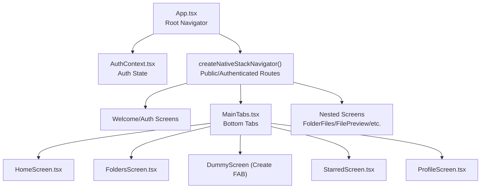
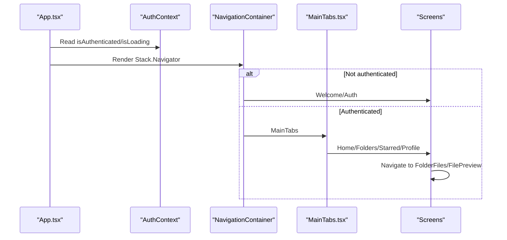
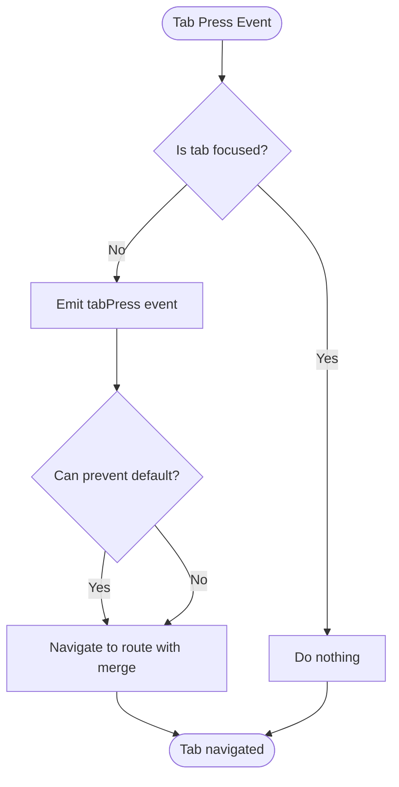
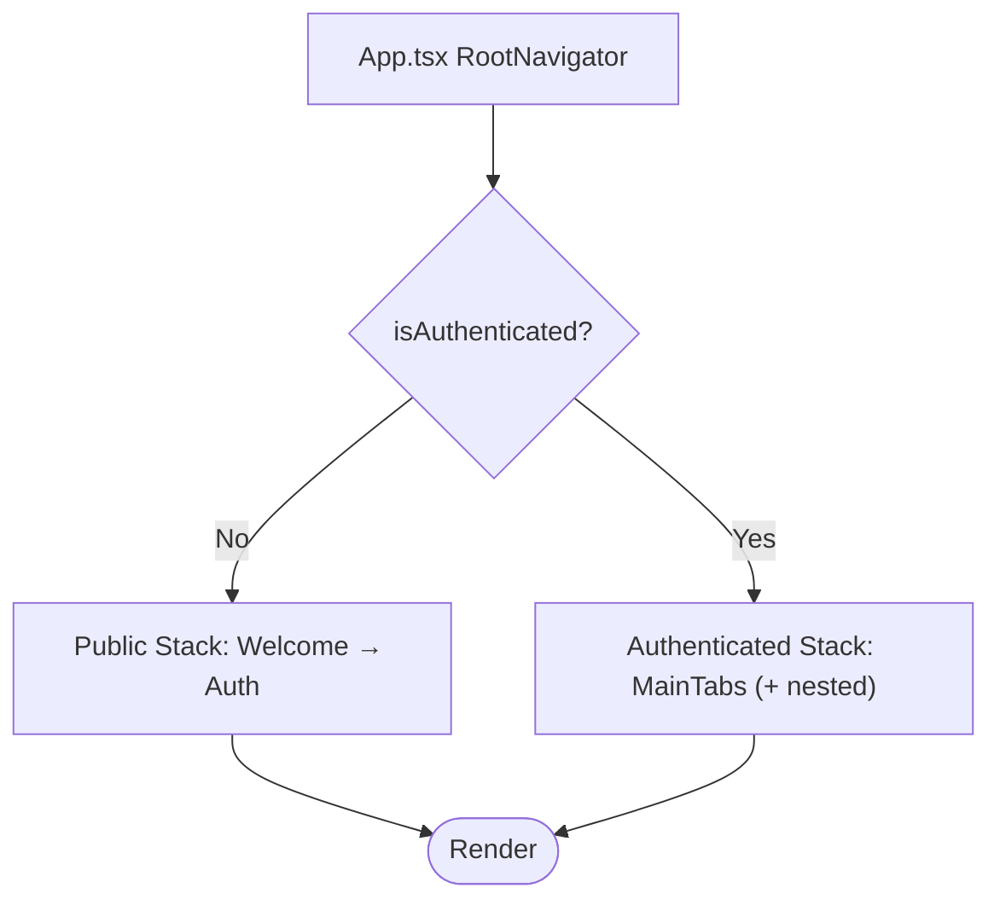
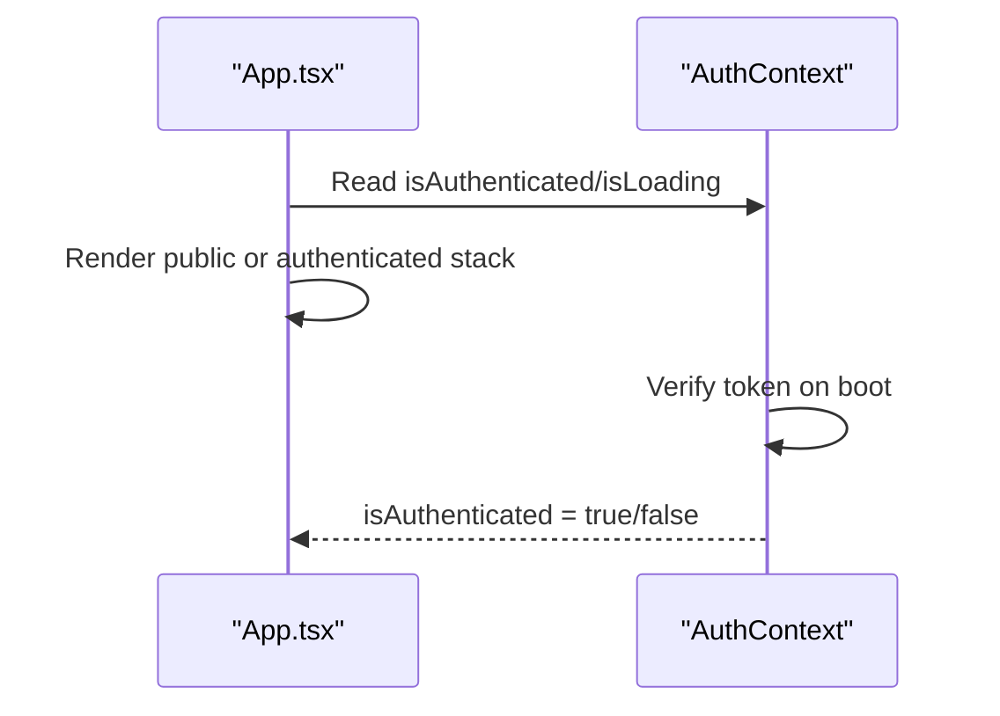
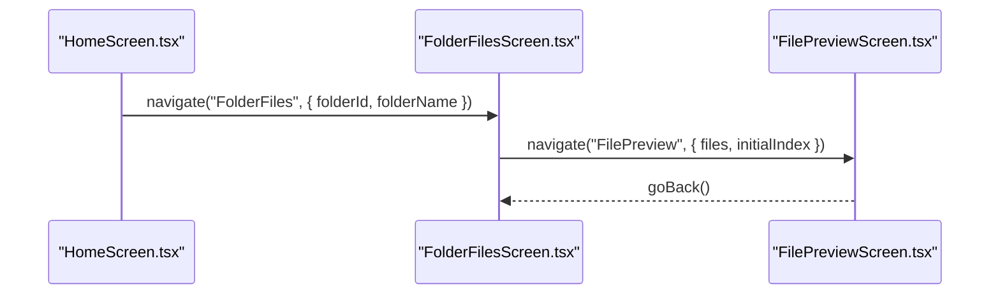
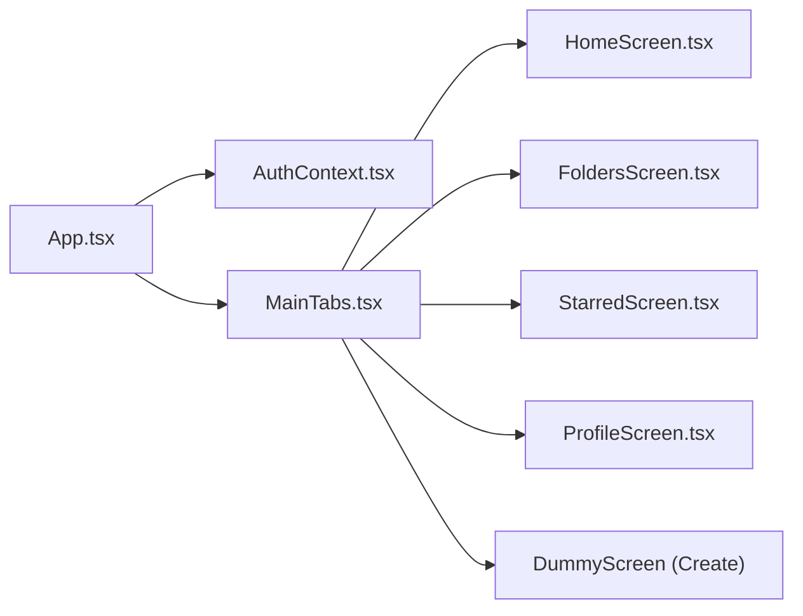

# Navigation System

<cite>
**Referenced Files in This Document**
- [MainTabs.tsx](file://app/src/navigation/MainTabs.tsx)
- [App.tsx](file://app/App.tsx)
- [AuthContext.tsx](file://app/src/context/AuthContext.tsx)
- [HomeScreen.tsx](file://app/src/sreens/HomeScreen.tsx)
- [ProfileScreen.tsx](file://app/src/sreens/ProfileScreen.tsx)
- [FoldersScreen.tsx](file://app/src/sreens/FoldersScreen.tsx)
- [StarredScreen.tsx](file://app/src/sreens/StarredScreen.tsx)
- [WelcomeScreen.tsx](file://app/src/sreens/WelcomeScreen.tsx)
- [AuthScreen.tsx](file://app/src/sreens/AuthScreen.tsx)
- [FolderFilesScreen.tsx](file://app/src/sreens/FolderFilesScreen.tsx)
- [FilePreviewScreen.tsx](file://app/src/sreens/FilePreviewScreen.tsx)
</cite>

## Table of Contents
1. [Introduction](#introduction)
2. [Project Structure](#project-structure)
3. [Core Components](#core-components)
4. [Architecture Overview](#architecture-overview)
5. [Detailed Component Analysis](#detailed-component-analysis)
6. [Dependency Analysis](#dependency-analysis)
7. [Performance Considerations](#performance-considerations)
8. [Troubleshooting Guide](#troubleshooting-guide)
9. [Conclusion](#conclusion)

## Introduction
This document explains the navigation system built with React Navigation in the teledrive React Native application. It focuses on the tab-based navigation implemented in MainTabs.tsx, the root navigator setup in App.tsx, and the conditional navigation logic driven by authentication status. It also covers screen configuration, navigation state management, tab bar customization, screen transitions, parameter passing, navigation guards, and performance optimization techniques.

## Project Structure
The navigation system spans three layers:
- Root navigator: App.tsx orchestrates public and authenticated flows.
- Tab navigator: MainTabs.tsx defines the bottom-tabbed interface.
- Screens: Individual screens under app/src/screens implement navigation actions and parameter passing.

**Diagram sources**
- [App.tsx](file://app/App.tsx#L64-L113)
- [MainTabs.tsx](file://app/src/navigation/MainTabs.tsx#L76-L89)
- [AuthContext.tsx](file://app/src/context/AuthContext.tsx#L19-L91)

**Section sources**
- [App.tsx](file://app/App.tsx#L1-L287)
- [MainTabs.tsx](file://app/src/navigation/MainTabs.tsx#L1-L133)

## Core Components
- Root navigator (App.tsx):
  - Uses NavigationContainer with deep linking configuration for share links.
  - Conditionally renders public routes (Welcome, Auth) when not authenticated and authenticated routes (MainTabs, nested screens) when authenticated.
  - Manages splash screen lifecycle and OTA update checks.
- Authentication provider (AuthContext.tsx):
  - Provides isAuthenticated, isLoading, login, logout, and token/user state.
  - Verifies stored token on startup and sets authenticated state accordingly.
- Tab navigator (MainTabs.tsx):
  - Defines five tabs: Home, Folders, Create, Starred, Profile.
  - Implements a custom bottom tab bar with icons, labels, and a central FAB.
  - Intercepts the “Create” tab to emit a global event for the FAB.

**Section sources**
- [App.tsx](file://app/App.tsx#L64-L113)
- [AuthContext.tsx](file://app/src/context/AuthContext.tsx#L19-L91)
- [MainTabs.tsx](file://app/src/navigation/MainTabs.tsx#L76-L89)

## Architecture Overview
The navigation architecture separates concerns:
- Conditional routing: App.tsx decides between public and authenticated stacks based on AuthContext.
- Tab-based UX: MainTabs.tsx encapsulates tab configuration and custom tab bar rendering.
- Screen-level navigation: Screens navigate to nested views (e.g., FolderFiles, FilePreview) and pass parameters.

**Diagram sources**
- [App.tsx](file://app/App.tsx#L64-L113)
- [AuthContext.tsx](file://app/src/context/AuthContext.tsx#L19-L91)
- [MainTabs.tsx](file://app/src/navigation/MainTabs.tsx#L76-L89)

## Detailed Component Analysis

### MainTabs.tsx: Tab Navigator and Custom Tab Bar
- Tab configuration:
  - Five screens registered with names: Home, Folders, Create, Starred, Profile.
  - The “Create” tab uses a dummy component and is intercepted via a DeviceEventEmitter to trigger a global FAB action.
- Custom tab bar:
  - Renders a row of tab items with icons and labels.
  - Uses theme colors for active/inactive states.
  - Implements tab press and long press events.
  - Central “Create” button styled as a floating action button.
- Screen options:
  - Disables headers globally for the tab navigator.

**Diagram sources**
- [MainTabs.tsx](file://app/src/navigation/MainTabs.tsx#L14-L34)

**Section sources**
- [MainTabs.tsx](file://app/src/navigation/MainTabs.tsx#L14-L89)

### Root Navigator Setup in App.tsx
- Conditional routing:
  - When not authenticated: renders Welcome and Auth screens.
  - When authenticated: renders MainTabs and nested screens (FolderFiles, FilePreview, Trash, Settings, Analytics, Files, SharedLinks, SharedSpace).
- Deep linking:
  - Configured for share links with specific prefixes and route mapping.
- Splash and OTA:
  - Manages splash screen visibility and periodic OTA update checks with user prompts.

**Diagram sources**
- [App.tsx](file://app/App.tsx#L64-L113)

**Section sources**
- [App.tsx](file://app/App.tsx#L50-L113)

### Authentication Context and Guards
- AuthContext:
  - Loads token from secure storage on startup.
  - Verifies token via API and sets authenticated state.
  - Exposes login/logout functions to set/remove token and user data.
- Guards:
  - App.tsx reads isAuthenticated and isLoading to decide which stack to render.
  - AuthScreen uses useAuth to complete login flow and call login(token, user).

**Diagram sources**
- [AuthContext.tsx](file://app/src/context/AuthContext.tsx#L25-L60)
- [App.tsx](file://app/App.tsx#L64-L79)

**Section sources**
- [AuthContext.tsx](file://app/src/context/AuthContext.tsx#L19-L91)
- [App.tsx](file://app/App.tsx#L64-L79)

### Screen Transitions and Parameter Passing
- HomeScreen:
  - Navigates to FolderFiles with { folderId, folderName }.
  - Navigates to FilePreview with { files, initialIndex, file }.
- FolderFilesScreen:
  - Navigates to FilePreview with filtered files and initial index.
  - Uses push to append breadcrumbs for nested folders.
- FilePreviewScreen:
  - Receives files array and initialIndex to page to the correct item.
  - Supports moving files, renaming, sharing, and starring.

**Diagram sources**
- [HomeScreen.tsx](file://app/src/sreens/HomeScreen.tsx#L583-L594)
- [FolderFilesScreen.tsx](file://app/src/sreens/FolderFilesScreen.tsx#L433-L443)
- [FilePreviewScreen.tsx](file://app/src/sreens/FilePreviewScreen.tsx#L314-L323)

**Section sources**
- [HomeScreen.tsx](file://app/src/sreens/HomeScreen.tsx#L583-L594)
- [FolderFilesScreen.tsx](file://app/src/sreens/FolderFilesScreen.tsx#L426-L464)
- [FilePreviewScreen.tsx](file://app/src/sreens/FilePreviewScreen.tsx#L314-L323)

### Tab Bar Configuration and Behavior
- Icons and labels:
  - Custom icons for Home, Folders, Starred, Profile.
  - “Create” tab is rendered as a floating action button.
- Theming:
  - Uses ThemeContext to adapt colors for active/inactive states and layout.
- Accessibility:
  - Includes accessibility roles and labels for tab items.

**Section sources**
- [MainTabs.tsx](file://app/src/navigation/MainTabs.tsx#L14-L74)

### Nested Screens and Navigation Patterns
- WelcomeScreen/AuthScreen:
  - WelcomeScreen navigates to AuthScreen.
  - AuthScreen completes phone/OTP flow and calls login to become authenticated.
- ProfileScreen:
  - Navigates to Files, Analytics, Starred, Trash, Settings.
- FoldersScreen:
  - Navigates to FolderFiles and Files.
- StarredScreen:
  - Navigates to FilePreview with sorted files.

**Section sources**
- [WelcomeScreen.tsx](file://app/src/sreens/WelcomeScreen.tsx#L147-L154)
- [AuthScreen.tsx](file://app/src/sreens/AuthScreen.tsx#L144-L162)
- [ProfileScreen.tsx](file://app/src/sreens/ProfileScreen.tsx#L222-L251)
- [FoldersScreen.tsx](file://app/src/sreens/FoldersScreen.tsx#L337-L338)
- [StarredScreen.tsx](file://app/src/sreens/StarredScreen.tsx#L103-L104)

## Dependency Analysis
- App.tsx depends on:
  - AuthContext for authentication state.
  - MainTabs for authenticated tab navigation.
  - Individual screens for both public and authenticated flows.
- MainTabs.tsx depends on:
  - ThemeContext for styling.
  - DeviceEventEmitter for global FAB handling.
  - Screens for tab content.

**Diagram sources**
- [App.tsx](file://app/App.tsx#L12-L35)
- [MainTabs.tsx](file://app/src/navigation/MainTabs.tsx#L1-L12)

**Section sources**
- [App.tsx](file://app/App.tsx#L12-L35)
- [MainTabs.tsx](file://app/src/navigation/MainTabs.tsx#L1-L12)

## Performance Considerations
- Conditional rendering:
  - App.tsx avoids rendering authenticated screens until authentication resolves, preventing unnecessary navigation setup.
- Tab navigator:
  - Disables headers to reduce layout overhead.
  - Custom tab bar minimizes re-renders by relying on theme props and memoization.
- Screen-level optimizations:
  - HomeScreen uses staggered requests on cold start to avoid server bursts.
  - FolderFilesScreen uses FlatList with windowSize, maxToRenderPerBatch, and removeClippedSubviews for large lists.
  - FilePreviewScreen disables paging when zoomed to avoid gesture conflicts and improves responsiveness.
- Splash and OTA:
  - Splash screen is hidden once authentication state is resolved.
  - OTA checks are throttled to prevent frequent network calls.

[No sources needed since this section provides general guidance]

## Troubleshooting Guide
- Authentication loops or incorrect state:
  - Verify token retrieval and verification in AuthContext. Check for 401/403 handling and fallback to authenticated state on transient errors.
- Tab navigation not working:
  - Ensure the “Create” tab is handled via DeviceEventEmitter and not navigated to directly.
  - Confirm tabPress/tabLongPress events are emitted and default prevention logic behaves as expected.
- Parameter passing issues:
  - Validate route params passed to FolderFiles and FilePreview screens match expected shapes (e.g., { folderId, folderName }, { files, initialIndex }).
- Deep linking:
  - Confirm prefixes and route mapping for share links are correct and accessible.

**Section sources**
- [AuthContext.tsx](file://app/src/context/AuthContext.tsx#L25-L60)
- [MainTabs.tsx](file://app/src/navigation/MainTabs.tsx#L14-L34)
- [FolderFilesScreen.tsx](file://app/src/sreens/FolderFilesScreen.tsx#L426-L464)
- [FilePreviewScreen.tsx](file://app/src/sreens/FilePreviewScreen.tsx#L314-L323)
- [App.tsx](file://app/App.tsx#L50-L62)

## Conclusion
The navigation system combines a clean root-level conditional router with a customizable tab navigator and robust screen-level navigation patterns. Authentication state drives route visibility, while custom tab bar and gesture handling deliver a polished UX. Performance optimizations at both the tab and screen levels ensure smooth interactions across devices.