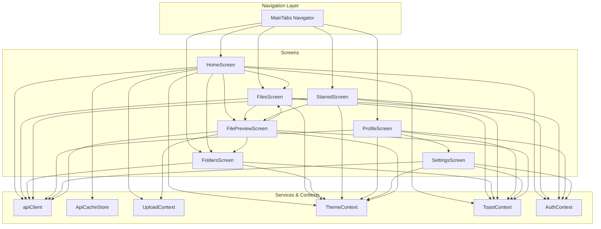
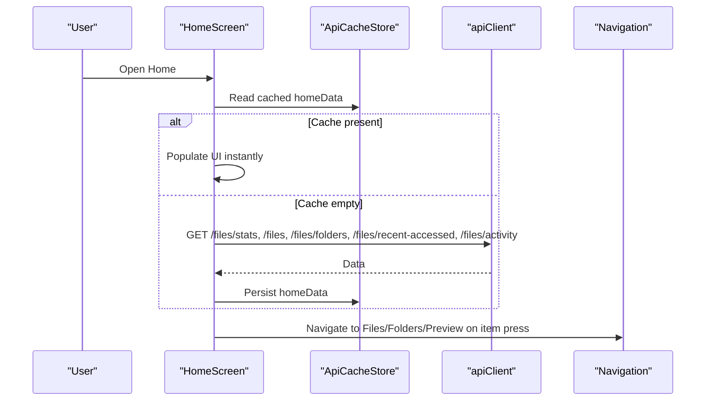
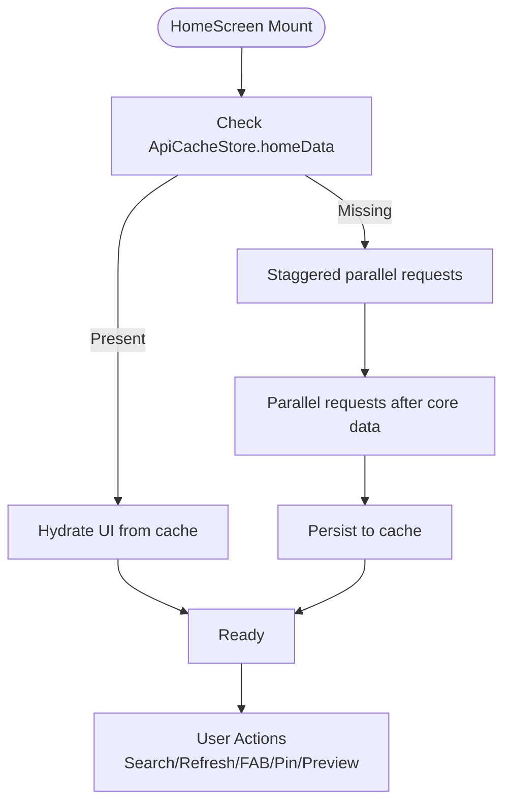
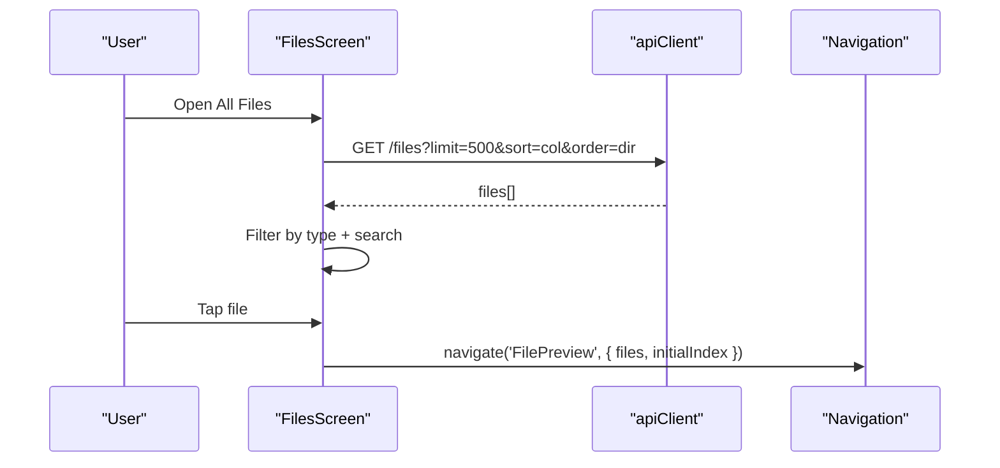
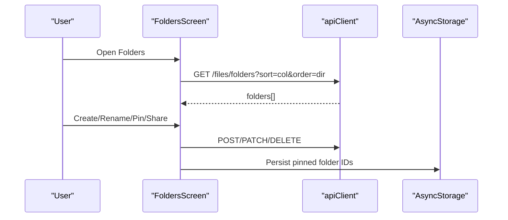
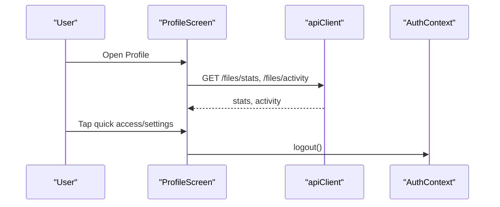
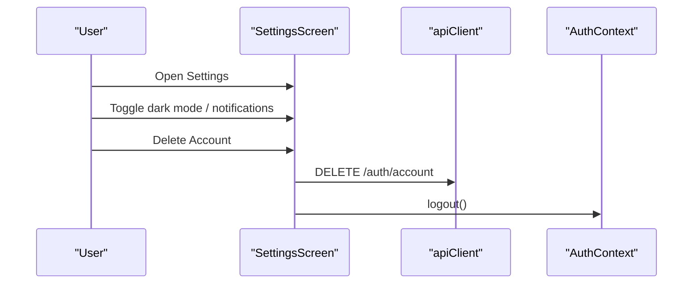
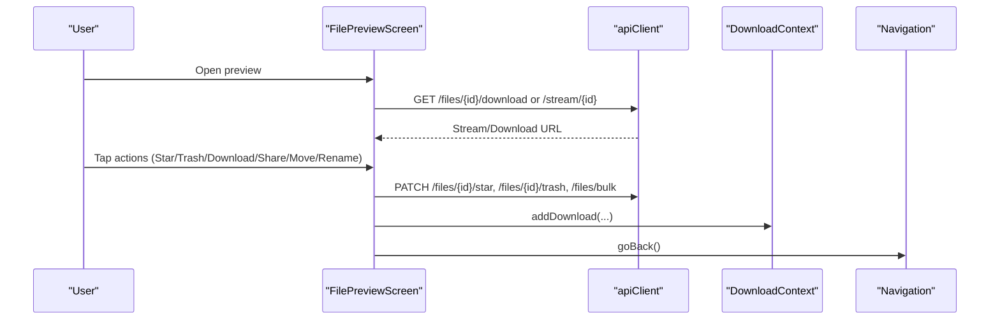
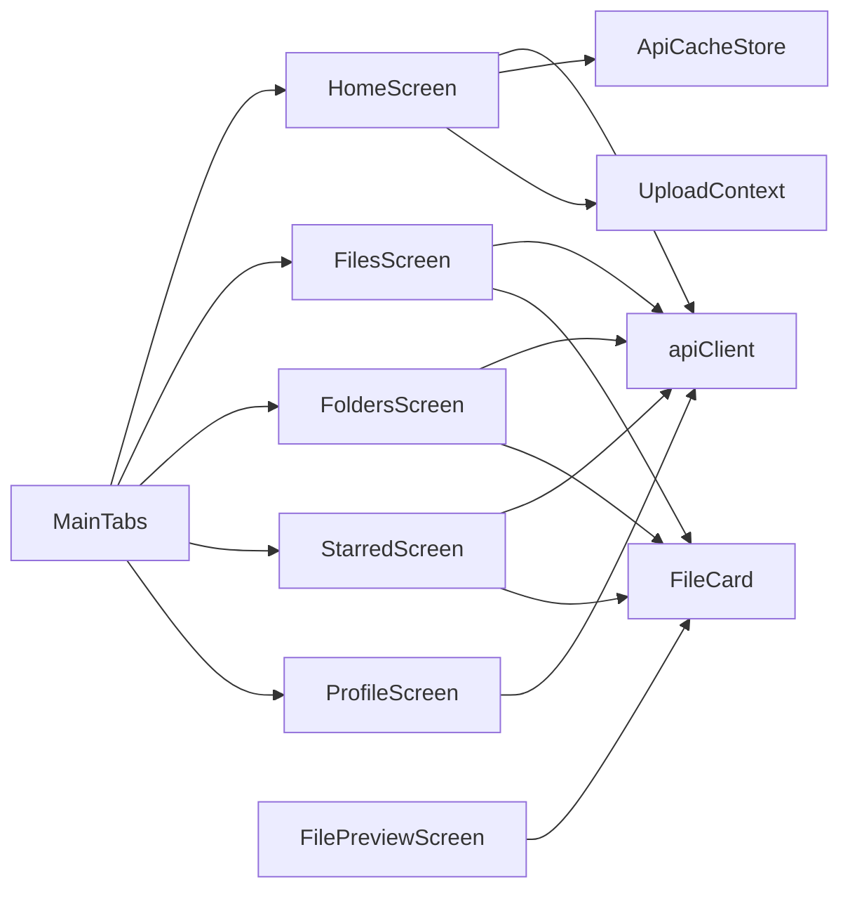

# Screen Implementation

<cite>
**Referenced Files in This Document**
- [HomeScreen.tsx](file://app/src/screens/HomeScreen.tsx)
- [FilesScreen.tsx](file://app/src/screens/FilesScreen.tsx)
- [FoldersScreen.tsx](file://app/src/screens/FoldersScreen.tsx)
- [ProfileScreen.tsx](file://app/src/screens/ProfileScreen.tsx)
- [SettingsScreen.tsx](file://app/src/screens/SettingsScreen.tsx)
- [FilePreviewScreen.tsx](file://app/src/screens/FilePreviewScreen.tsx)
- [MainTabs.tsx](file://app/src/navigation/MainTabs.tsx)
- [apiClient.ts](file://app/src/services/apiClient.ts)
- [ApiCacheStore.ts](file://app/src/context/ApiCacheStore.ts)
- [UploadContext.tsx](file://app/src/context/UploadContext.tsx)
- [FileCard.tsx](file://app/src/components/FileCard.tsx)
- [Skeleton.tsx](file://app/src/ui/Skeleton.tsx)
- [StarredScreen.tsx](file://app/src/screens/StarredScreen.tsx)
- [TrashScreen.tsx](file://app/src/screens/TrashScreen.tsx)
- [AnalyticsScreen.tsx](file://app/src/screens/AnalyticsScreen.tsx)
</cite>

## Table of Contents
1. [Introduction](#introduction)
2. [Project Structure](#project-structure)
3. [Core Components](#core-components)
4. [Architecture Overview](#architecture-overview)
5. [Detailed Component Analysis](#detailed-component-analysis)
6. [Dependency Analysis](#dependency-analysis)
7. [Performance Considerations](#performance-considerations)
8. [Troubleshooting Guide](#troubleshooting-guide)
9. [Conclusion](#conclusion)

## Introduction
This document provides a comprehensive guide to the screen implementation across the application’s core screens. It explains screen structure patterns, data fetching strategies, user interaction handling, navigation integration, state management, and performance optimizations for HomeScreen, FilesScreen, FoldersScreen, ProfileScreen, SettingsScreen, and FilePreviewScreen. The goal is to help developers understand how each screen is built, how they interact with APIs and contexts, and how to maintain and extend them effectively.

## Project Structure
The screens are organized under app/src/screens and integrated via a bottom-tab navigator. Each screen encapsulates its UI, state, and interactions while leveraging shared services and contexts for authentication, theming, caching, and uploads.

**Diagram sources**
- [MainTabs.tsx](file://app/src/navigation/MainTabs.tsx#L76-L89)
- [HomeScreen.tsx](file://app/src/screens/HomeScreen.tsx#L360-L520)
- [FilesScreen.tsx](file://app/src/screens/FilesScreen.tsx#L55-L100)
- [FoldersScreen.tsx](file://app/src/screens/FoldersScreen.tsx#L35-L101)
- [StarredScreen.tsx](file://app/src/screens/StarredScreen.tsx#L44-L68)
- [ProfileScreen.tsx](file://app/src/screens/ProfileScreen.tsx#L78-L115)
- [SettingsScreen.tsx](file://app/src/screens/SettingsScreen.tsx#L52-L74)
- [FilePreviewScreen.tsx](file://app/src/screens/FilePreviewScreen.tsx#L314-L396)
- [apiClient.ts](file://app/src/services/apiClient.ts#L31-L42)
- [ApiCacheStore.ts](file://app/src/context/ApiCacheStore.ts#L16-L27)
- [UploadContext.tsx](file://app/src/context/UploadContext.tsx#L51-L114)

**Section sources**
- [MainTabs.tsx](file://app/src/navigation/MainTabs.tsx#L76-L89)

## Core Components
- Navigation integration: Screens are registered in a bottom-tab navigator with a custom tab bar and a floating action button.
- Data fetching: Centralized via apiClient with automatic JWT injection and retry logic.
- State management: Local state per screen plus shared Zustand cache store for home data and upload context for global upload state.
- UI patterns: Consistent theming, skeleton loaders, and reusable components like FileCard.

**Section sources**
- [MainTabs.tsx](file://app/src/navigation/MainTabs.tsx#L14-L74)
- [apiClient.ts](file://app/src/services/apiClient.ts#L46-L84)
- [ApiCacheStore.ts](file://app/src/context/ApiCacheStore.ts#L16-L27)
- [UploadContext.tsx](file://app/src/context/UploadContext.tsx#L51-L114)

## Architecture Overview
The screens follow a layered architecture:
- Presentation layer: React components rendering UI and handling user interactions.
- State layer: React hooks and Zustand stores for local and global state.
- Service layer: apiClient for HTTP requests and UploadManager via UploadContext.
- Integration layer: Navigation integration and cross-screen communication via params and navigation helpers.

**Diagram sources**
- [HomeScreen.tsx](file://app/src/screens/HomeScreen.tsx#L441-L517)
- [ApiCacheStore.ts](file://app/src/context/ApiCacheStore.ts#L16-L27)
- [apiClient.ts](file://app/src/services/apiClient.ts#L87-L132)

## Detailed Component Analysis

### HomeScreen
- Purpose: Dashboard showing storage summary, recent files, folders, and activity.
- Data fetching: Uses a staggered strategy on cold start and parallel on warm cache; integrates with ApiCacheStore for instant hydration.
- Interactions: Search, refresh, FAB upload, create/rename folder, pin/unpin folders, navigate to previews.
- State management: Local state for UI, search, and pinned folders persisted to AsyncStorage; integrates with UploadContext for global upload status.
- UX patterns: Animated counters, skeleton placeholders, and a bottom tab bar with a floating action button.

**Diagram sources**
- [HomeScreen.tsx](file://app/src/screens/HomeScreen.tsx#L441-L517)
- [ApiCacheStore.ts](file://app/src/context/ApiCacheStore.ts#L16-L27)

**Section sources**
- [HomeScreen.tsx](file://app/src/screens/HomeScreen.tsx#L360-L520)
- [HomeScreen.tsx](file://app/src/screens/HomeScreen.tsx#L524-L580)
- [HomeScreen.tsx](file://app/src/screens/HomeScreen.tsx#L582-L594)
- [HomeScreen.tsx](file://app/src/screens/HomeScreen.tsx#L648-L696)
- [ApiCacheStore.ts](file://app/src/context/ApiCacheStore.ts#L16-L27)

### FilesScreen
- Purpose: Browse and manage all files with sorting, filtering, search, and actions.
- Data fetching: Server-side sorting via query parameters; client-side filtering and pagination-like behavior via displayLimit.
- Interactions: Sort modal, search bar, filter tabs, open preview, star/trash actions, and refresh control.
- Performance: getItemLayout for fast scrolling, onEndReached for lazy loading, and skeleton placeholders.

**Diagram sources**
- [FilesScreen.tsx](file://app/src/screens/FilesScreen.tsx#L88-L100)
- [FilesScreen.tsx](file://app/src/screens/FilesScreen.tsx#L103-L108)
- [FilesScreen.tsx](file://app/src/screens/FilesScreen.tsx#L138-L147)

**Section sources**
- [FilesScreen.tsx](file://app/src/screens/FilesScreen.tsx#L55-L100)
- [FilesScreen.tsx](file://app/src/screens/FilesScreen.tsx#L102-L108)
- [FilesScreen.tsx](file://app/src/screens/FilesScreen.tsx#L137-L147)
- [FilesScreen.tsx](file://app/src/screens/FilesScreen.tsx#L224-L264)

### FoldersScreen
- Purpose: Manage folders with creation, renaming, pinning to Home, and sharing.
- Data fetching: Server-side sorting; loads folders and applies local search.
- Interactions: Sort modal, create/rename modals, long-press menu (platform-specific), and share modal.
- UX patterns: Grid layout, skeleton placeholders, and persistent pinned folder IDs via AsyncStorage.

**Diagram sources**
- [FoldersScreen.tsx](file://app/src/screens/FoldersScreen.tsx#L84-L101)
- [FoldersScreen.tsx](file://app/src/screens/FoldersScreen.tsx#L103-L129)
- [FoldersScreen.tsx](file://app/src/screens/FoldersScreen.tsx#L131-L152)

**Section sources**
- [FoldersScreen.tsx](file://app/src/screens/FoldersScreen.tsx#L35-L101)
- [FoldersScreen.tsx](file://app/src/screens/FoldersScreen.tsx#L103-L152)
- [FoldersScreen.tsx](file://app/src/screens/FoldersScreen.tsx#L154-L203)

### ProfileScreen
- Purpose: User profile, stats, quick access, settings, and recent activity.
- Data fetching: Parallel fetch for stats and activity; animated entrance.
- Interactions: Quick access to Files, Starred, Folders, Trash, Analytics; logout confirmation; security note.
- UX patterns: Animated scroll reveal, stat tiles, and recent activity list.

**Diagram sources**
- [ProfileScreen.tsx](file://app/src/screens/ProfileScreen.tsx#L101-L115)
- [ProfileScreen.tsx](file://app/src/screens/ProfileScreen.tsx#L117-L134)

**Section sources**
- [ProfileScreen.tsx](file://app/src/screens/ProfileScreen.tsx#L78-L115)
- [ProfileScreen.tsx](file://app/src/screens/ProfileScreen.tsx#L117-L134)
- [ProfileScreen.tsx](file://app/src/screens/ProfileScreen.tsx#L315-L354)

### SettingsScreen
- Purpose: Minimal settings with preferences, storage, insights, security, and account management.
- Interactions: Toggle notifications, dark mode, storage analytics, shared links, sign out, and delete account.
- UX patterns: Pressable rows with scaling feedback, animated entrance, and danger zone styling.

**Diagram sources**
- [SettingsScreen.tsx](file://app/src/screens/SettingsScreen.tsx#L81-L94)
- [SettingsScreen.tsx](file://app/src/screens/SettingsScreen.tsx#L96-L131)

**Section sources**
- [SettingsScreen.tsx](file://app/src/screens/SettingsScreen.tsx#L52-L74)
- [SettingsScreen.tsx](file://app/src/screens/SettingsScreen.tsx#L81-L94)
- [SettingsScreen.tsx](file://app/src/screens/SettingsScreen.tsx#L114-L131)

### FilePreviewScreen
- Purpose: Unified preview for images, videos, PDFs, Office documents, and generic files.
- Data fetching: Uses JWT from AsyncStorage; streams media via API endpoints.
- Interactions: Horizontal swipe, pinch-to-zoom for images, video player, PDF open button, share link, move, rename, trash, and download.
- Performance: FlatList with getItemLayout, removeClippedSubviews, and window sizing; gesture handling for zoom; WebView sandboxing.

**Diagram sources**
- [FilePreviewScreen.tsx](file://app/src/screens/FilePreviewScreen.tsx#L389-L396)
- [FilePreviewScreen.tsx](file://app/src/screens/FilePreviewScreen.tsx#L398-L421)
- [FilePreviewScreen.tsx](file://app/src/screens/FilePreviewScreen.tsx#L423-L429)
- [FilePreviewScreen.tsx](file://app/src/screens/FilePreviewScreen.tsx#L431-L447)
- [FilePreviewScreen.tsx](file://app/src/screens/FilePreviewScreen.tsx#L449-L457)

**Section sources**
- [FilePreviewScreen.tsx](file://app/src/screens/FilePreviewScreen.tsx#L314-L396)
- [FilePreviewScreen.tsx](file://app/src/screens/FilePreviewScreen.tsx#L398-L457)
- [FilePreviewScreen.tsx](file://app/src/screens/FilePreviewScreen.tsx#L459-L536)
- [FilePreviewScreen.tsx](file://app/src/screens/FilePreviewScreen.tsx#L614-L644)

## Dependency Analysis
- Navigation: MainTabs registers screens and exposes a custom tab bar with a floating action button.
- Services: apiClient centralizes base URL, timeouts, JWT injection, and retry logic.
- State: ApiCacheStore provides a single source of truth for home data; UploadContext manages upload tasks globally.
- UI: FileCard is reused across screens; Skeleton provides consistent loading states.

**Diagram sources**
- [MainTabs.tsx](file://app/src/navigation/MainTabs.tsx#L76-L89)
- [apiClient.ts](file://app/src/services/apiClient.ts#L31-L42)
- [ApiCacheStore.ts](file://app/src/context/ApiCacheStore.ts#L16-L27)
- [UploadContext.tsx](file://app/src/context/UploadContext.tsx#L51-L114)
- [FileCard.tsx](file://app/src/components/FileCard.tsx#L32-L92)

**Section sources**
- [MainTabs.tsx](file://app/src/navigation/MainTabs.tsx#L76-L89)
- [apiClient.ts](file://app/src/services/apiClient.ts#L31-L42)
- [ApiCacheStore.ts](file://app/src/context/ApiCacheStore.ts#L16-L27)
- [UploadContext.tsx](file://app/src/context/UploadContext.tsx#L51-L114)
- [FileCard.tsx](file://app/src/components/FileCard.tsx#L32-L92)

## Performance Considerations
- HomeScreen
  - Staggered requests on cold start to avoid overwhelming the server.
  - Parallel requests when cache is warm to minimize perceived latency.
  - Animated counters and skeleton loaders improve perceived performance.
- FilesScreen
  - getItemLayout for O(1) scroll performance.
  - onEndReached with displayLimit simulates pagination and reduces DOM nodes.
  - Debounced markAccessed to avoid frequent network calls.
- FoldersScreen
  - Grid layout with fixed card widths and skeleton placeholders.
  - Local search and server-side sorting reduce payload sizes.
- FilePreviewScreen
  - FlatList with getItemLayout and window sizing for smooth horizontal swiping.
  - Gesture-based zoom with spring animations; WebView sandboxing restricts external URLs.
  - removeClippedSubviews and limited batch rendering reduce memory footprint.

[No sources needed since this section provides general guidance]

## Troubleshooting Guide
- Authentication failures
  - Ensure JWT is present in AsyncStorage; apiClient injects Authorization headers automatically.
  - Check request interceptors for errors and retry logic.
- Network timeouts and retries
  - apiClient sets timeouts and retries based on shouldRetry; review logs for retry attempts.
- Server waking UI
  - ServerStatusContext triggers a “waking” overlay when requests exceed 2 seconds; dismisses on response.
- Upload issues
  - UploadContext manages upload lifecycle; verify AppState events resume uploads when app becomes active.
- Cache inconsistencies
  - ApiCacheStore.setHomeData updates cached home data; clear cache if stale data appears.

**Section sources**
- [apiClient.ts](file://app/src/services/apiClient.ts#L46-L84)
- [apiClient.ts](file://app/src/services/apiClient.ts#L100-L131)
- [UploadContext.tsx](file://app/src/context/UploadContext.tsx#L62-L72)
- [ApiCacheStore.ts](file://app/src/context/ApiCacheStore.ts#L16-L27)

## Conclusion
The screen implementations demonstrate a cohesive pattern: centralized service layer, shared state management, and consistent UI components. Each screen balances user experience with performance through thoughtful data fetching strategies, skeleton loaders, and optimized rendering. The navigation integration via MainTabs ensures seamless transitions, while contexts like ApiCacheStore and UploadContext enable scalable state management across screens.