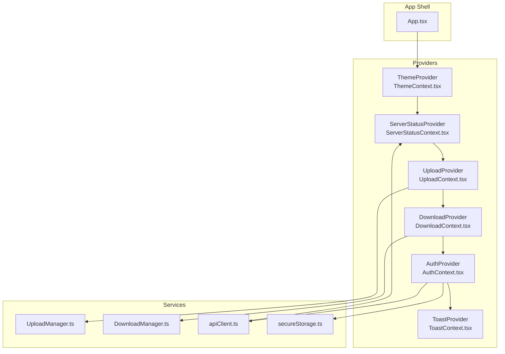
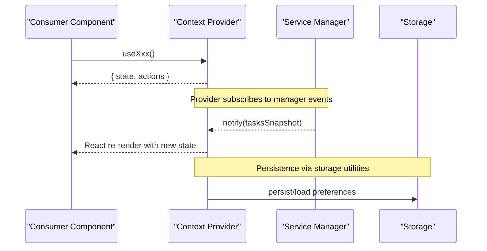
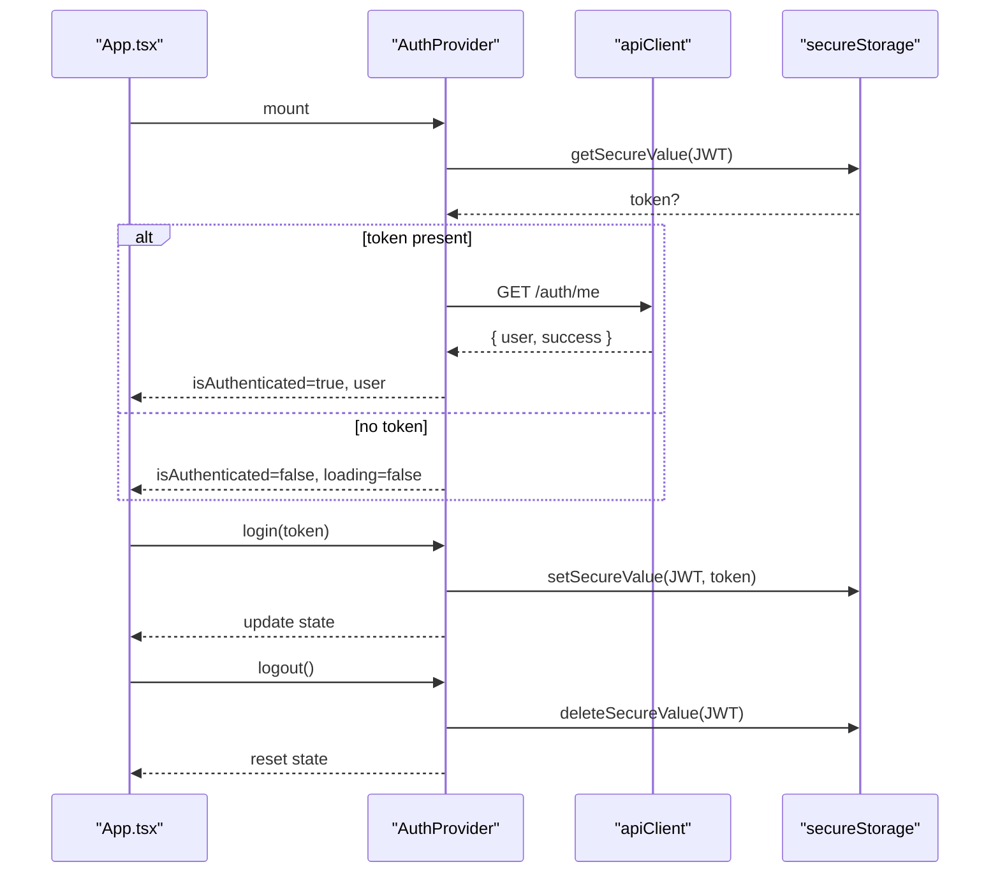
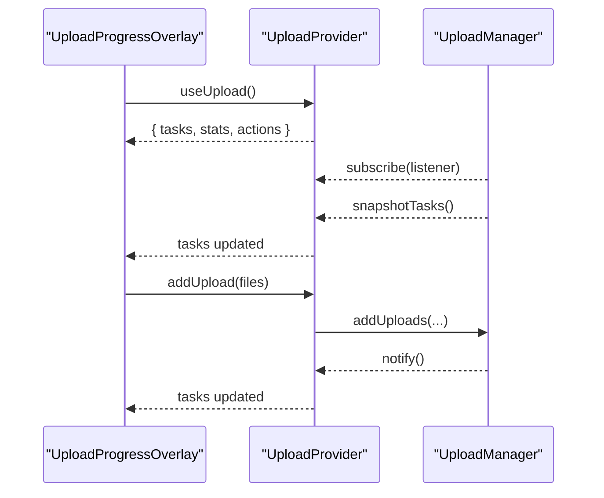
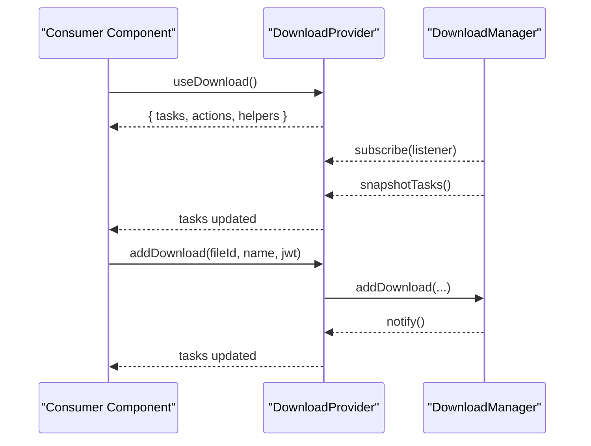
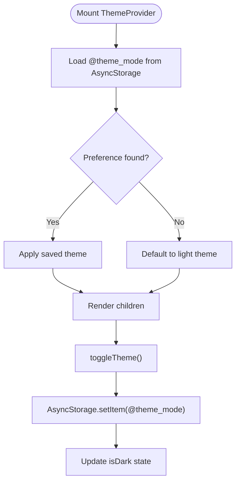
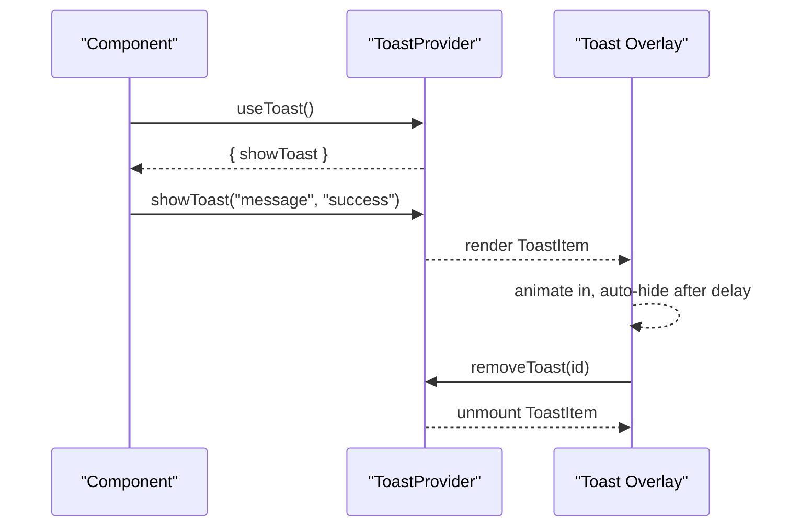
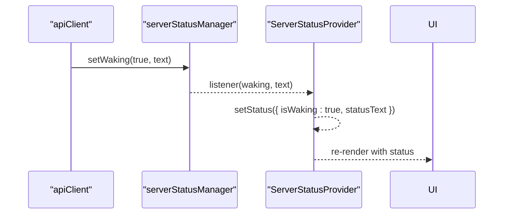
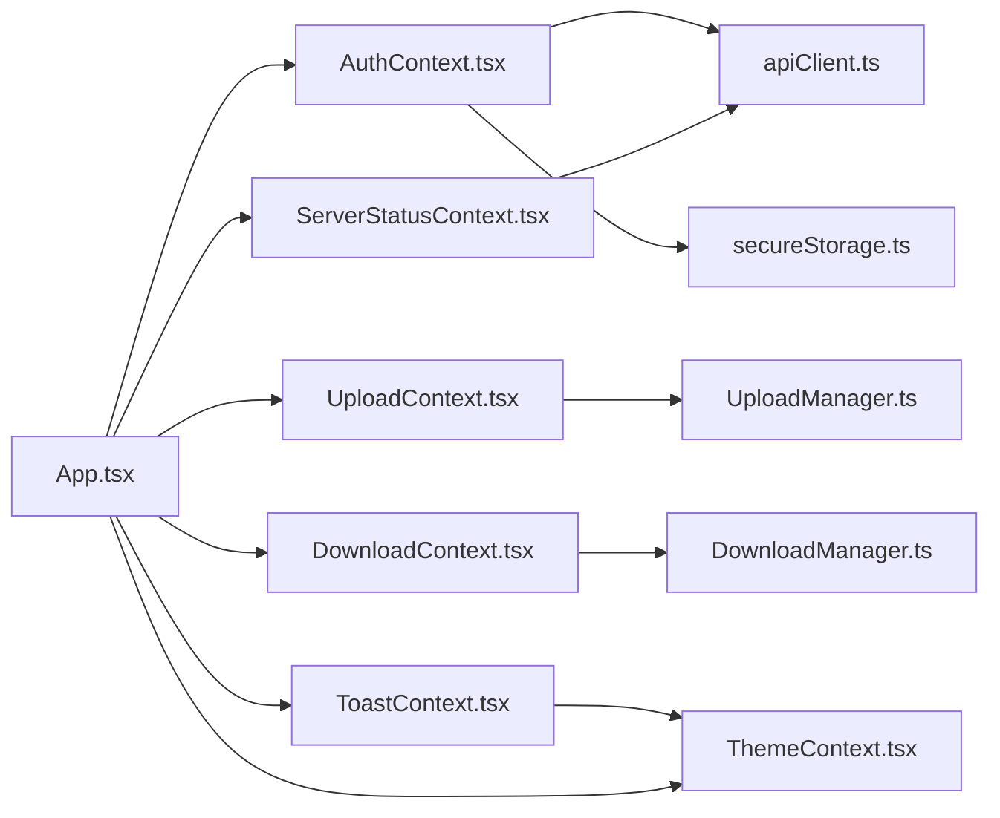

# State Management

<cite>
**Referenced Files in This Document**
- [App.tsx](file://app/App.tsx)
- [AuthContext.tsx](file://app/src/context/AuthContext.tsx)
- [UploadContext.tsx](file://app/src/context/UploadContext.tsx)
- [DownloadContext.tsx](file://app/src/context/DownloadContext.tsx)
- [ThemeContext.tsx](file://app/src/context/ThemeContext.tsx)
- [ToastContext.tsx](file://app/src/context/ToastContext.tsx)
- [ServerStatusContext.tsx](file://app/src/context/ServerStatusContext.tsx)
- [UploadManager.ts](file://app/src/services/UploadManager.ts)
- [DownloadManager.ts](file://app/src/services/DownloadManager.ts)
- [apiClient.ts](file://app/src/services/apiClient.ts)
- [secureStorage.ts](file://app/src/utils/secureStorage.ts)
- [AuthScreen.tsx](file://app/src/screens/AuthScreen.tsx)
- [FilesScreen.tsx](file://app/src/screens/FilesScreen.tsx)
- [UploadProgressOverlay.tsx](file://app/src/components/UploadProgressOverlay.tsx)
</cite>

## Table of Contents
1. [Introduction](#introduction)
2. [Project Structure](#project-structure)
3. [Core Components](#core-components)
4. [Architecture Overview](#architecture-overview)
5. [Detailed Component Analysis](#detailed-component-analysis)
6. [Dependency Analysis](#dependency-analysis)
7. [Performance Considerations](#performance-considerations)
8. [Troubleshooting Guide](#troubleshooting-guide)
9. [Conclusion](#conclusion)

## Introduction
This document explains the state management system centered on React Context in the teledrive application. It covers the provider pattern across AuthContext, UploadContext, DownloadContext, ThemeContext, ToastContext, and ServerStatusContext. It documents context value structures, synchronization with underlying managers, consumer integration, persistence strategies, performance optimizations, and debugging techniques.

## Project Structure
The state management is organized around six contexts, each exposing a Provider and a hook. Providers wrap the app shell and integrate with service-layer managers for uploads/downloads and with platform/storage utilities for secure token persistence.

**Diagram sources**
- [App.tsx](file://app/App.tsx#L265-L286)
- [ThemeContext.tsx](file://app/src/context/ThemeContext.tsx#L102-L134)
- [ServerStatusContext.tsx](file://app/src/context/ServerStatusContext.tsx#L25-L43)
- [UploadContext.tsx](file://app/src/context/UploadContext.tsx#L51-L114)
- [DownloadContext.tsx](file://app/src/context/DownloadContext.tsx#L29-L84)
- [AuthContext.tsx](file://app/src/context/AuthContext.tsx#L19-L91)
- [ToastContext.tsx](file://app/src/context/ToastContext.tsx#L75-L98)
- [UploadManager.ts](file://app/src/services/UploadManager.ts#L126-L320)
- [DownloadManager.ts](file://app/src/services/DownloadManager.ts#L42-L141)
- [apiClient.ts](file://app/src/services/apiClient.ts#L31-L85)
- [secureStorage.ts](file://app/src/utils/secureStorage.ts#L30-L60)

**Section sources**
- [App.tsx](file://app/App.tsx#L115-L286)

## Core Components
- AuthContext: Centralizes authentication state, token lifecycle, and secure storage integration. Provides login/logout and exposes user/token flags.
- UploadContext: Wraps UploadManager, synchronizes tasks and derived stats, and exposes actions to manage the upload queue.
- DownloadContext: Wraps DownloadManager, synchronizes tasks and derived helpers, and exposes actions to manage downloads.
- ThemeContext: Manages theme mode and theme object, persists preference to storage, and prevents flash-of-wrong-theme.
- ToastContext: Provides a toast notification system with animated entries and removal.
- ServerStatusContext: Bridges a singleton to React state for server waking UI signaling.

**Section sources**
- [AuthContext.tsx](file://app/src/context/AuthContext.tsx#L7-L98)
- [UploadContext.tsx](file://app/src/context/UploadContext.tsx#L16-L123)
- [DownloadContext.tsx](file://app/src/context/DownloadContext.tsx#L11-L94)
- [ThemeContext.tsx](file://app/src/context/ThemeContext.tsx#L90-L137)
- [ToastContext.tsx](file://app/src/context/ToastContext.tsx#L16-L143)
- [ServerStatusContext.tsx](file://app/src/context/ServerStatusContext.tsx#L3-L52)

## Architecture Overview
The providers subscribe to service-layer managers and expose normalized state to consumers. Consumers use dedicated hooks to read state and trigger actions. Persistence is handled via AsyncStorage and secure storage utilities.

**Diagram sources**
- [UploadContext.tsx](file://app/src/context/UploadContext.tsx#L54-L60)
- [DownloadContext.tsx](file://app/src/context/DownloadContext.tsx#L32-L37)
- [AuthContext.tsx](file://app/src/context/AuthContext.tsx#L25-L60)
- [secureStorage.ts](file://app/src/utils/secureStorage.ts#L30-L60)

## Detailed Component Analysis

### AuthContext
- Purpose: Manage authentication state, token lifecycle, and secure storage.
- Key behaviors:
  - On mount, loads token from secure storage and validates via API.
  - Supports login by storing token securely and updating state.
  - Supports logout by removing token and resetting state.
  - Handles transient vs. permanent auth failures.
- Context value: isAuthenticated, isLoading, user, token, setUser, login, logout.
- Persistence: Secure storage for tokens; AsyncStorage fallback on web.

**Diagram sources**
- [AuthContext.tsx](file://app/src/context/AuthContext.tsx#L19-L91)
- [apiClient.ts](file://app/src/services/apiClient.ts#L31-L42)
- [secureStorage.ts](file://app/src/utils/secureStorage.ts#L30-L60)

**Section sources**
- [AuthContext.tsx](file://app/src/context/AuthContext.tsx#L7-L98)
- [secureStorage.ts](file://app/src/utils/secureStorage.ts#L1-L74)
- [apiClient.ts](file://app/src/services/apiClient.ts#L1-L164)

### UploadContext
- Purpose: Provide global upload state synchronized with UploadManager.
- Key behaviors:
  - Subscribes to UploadManager for task snapshots.
  - Computes derived stats (counts, totals, speeds, progress) via memoization.
  - Exposes actions: addUpload, cancelUpload, cancelAll, pauseUpload, resumeUpload, clearCompleted, retryFailed.
  - Resumes uploads on app foreground.
- Context value: tasks, actions, and computed stats (e.g., totalFiles, uploadedCount, overallProgress, avgUploadSpeedBps, currentUploadSpeedBps).
- Persistence: UploadManager persists queue and stats to AsyncStorage.

**Diagram sources**
- [UploadContext.tsx](file://app/src/context/UploadContext.tsx#L51-L114)
- [UploadManager.ts](file://app/src/services/UploadManager.ts#L259-L320)

**Section sources**
- [UploadContext.tsx](file://app/src/context/UploadContext.tsx#L16-L123)
- [UploadManager.ts](file://app/src/services/UploadManager.ts#L126-L445)

### DownloadContext
- Purpose: Provide global download state synchronized with DownloadManager.
- Key behaviors:
  - Subscribes to DownloadManager for task snapshots.
  - Exposes actions: addDownload, cancelDownload, cancelAll, clearCompleted.
  - Derives helpers: activeCount, overallProgress, hasActive.
- Context value: tasks, actions, and derived helpers.
- Persistence: DownloadManager persists minimal state; most state is ephemeral.

**Diagram sources**
- [DownloadContext.tsx](file://app/src/context/DownloadContext.tsx#L29-L84)
- [DownloadManager.ts](file://app/src/services/DownloadManager.ts#L57-L78)

**Section sources**
- [DownloadContext.tsx](file://app/src/context/DownloadContext.tsx#L11-L94)
- [DownloadManager.ts](file://app/src/services/DownloadManager.ts#L42-L229)

### ThemeContext
- Purpose: Manage theme mode and theme object, persist preference, and prevent FOIT.
- Key behaviors:
  - Loads saved theme preference on mount.
  - Toggles theme and persists choice to AsyncStorage.
  - Renders null while loading to avoid flashing.
- Context value: theme, isDark, toggleTheme.

**Diagram sources**
- [ThemeContext.tsx](file://app/src/context/ThemeContext.tsx#L102-L134)

**Section sources**
- [ThemeContext.tsx](file://app/src/context/ThemeContext.tsx#L90-L137)

### ToastContext
- Purpose: Provide toast notifications with animations and removal.
- Key behaviors:
  - Maintains an internal list of toasts with unique ids.
  - Exposes showToast(message, type).
  - Renders toasts in a fixed overlay positioned absolutely.
- Context value: showToast.

**Diagram sources**
- [ToastContext.tsx](file://app/src/context/ToastContext.tsx#L75-L98)

**Section sources**
- [ToastContext.tsx](file://app/src/context/ToastContext.tsx#L16-L143)

### ServerStatusContext
- Purpose: Bridge singleton server status to React state for UI signaling.
- Key behaviors:
  - Exposes a singleton-like manager with a listener callback.
  - Provider subscribes to the manager and updates local state.
- Context value: isWaking, statusText.

**Diagram sources**
- [ServerStatusContext.tsx](file://app/src/context/ServerStatusContext.tsx#L25-L43)
- [apiClient.ts](file://app/src/services/apiClient.ts#L67-L82)

**Section sources**
- [ServerStatusContext.tsx](file://app/src/context/ServerStatusContext.tsx#L3-L52)
- [apiClient.ts](file://app/src/services/apiClient.ts#L67-L82)

## Dependency Analysis
- Provider-to-manager coupling:
  - UploadProvider subscribes to UploadManager and forwards actions.
  - DownloadProvider subscribes to DownloadManager and forwards actions.
  - AuthProvider depends on apiClient and secureStorage.
  - ToastProvider is self-contained.
  - ServerStatusProvider bridges a singleton to React state.
- Consumer integration:
  - Components import useXxx hooks and consume state/actions directly.
  - Example consumers: AuthScreen (login), FilesScreen (theme/toast), UploadProgressOverlay (upload stats/actions).

**Diagram sources**
- [App.tsx](file://app/App.tsx#L12-L17)
- [AuthContext.tsx](file://app/src/context/AuthContext.tsx#L19-L91)
- [UploadContext.tsx](file://app/src/context/UploadContext.tsx#L51-L114)
- [DownloadContext.tsx](file://app/src/context/DownloadContext.tsx#L29-L84)
- [ThemeContext.tsx](file://app/src/context/ThemeContext.tsx#L102-L134)
- [ToastContext.tsx](file://app/src/context/ToastContext.tsx#L75-L98)
- [ServerStatusContext.tsx](file://app/src/context/ServerStatusContext.tsx#L25-L43)
- [UploadManager.ts](file://app/src/services/UploadManager.ts#L126-L320)
- [DownloadManager.ts](file://app/src/services/DownloadManager.ts#L42-L141)
- [apiClient.ts](file://app/src/services/apiClient.ts#L31-L85)
- [secureStorage.ts](file://app/src/utils/secureStorage.ts#L30-L60)

**Section sources**
- [App.tsx](file://app/App.tsx#L115-L286)

## Performance Considerations
- Context splitting:
  - Separate contexts isolate concerns and reduce unnecessary re-renders. Consumers only subscribe to relevant contexts.
- Memoization and derived computations:
  - UploadContext computes stats from task snapshots using memoization to avoid recalculating on every render.
- Notification throttling:
  - UploadManager throttles state notifications to ~200 ms to minimize React re-renders during rapid updates.
- Efficient state updates:
  - Managers emit new array/object references on change, ensuring React detects updates reliably.
- Persistence:
  - UploadManager persists queue and historical stats to AsyncStorage to survive app restarts.
- UI responsiveness:
  - Toast animations use native driver where applicable.
  - Theme loading defers rendering until preference is resolved to prevent FOIT.

**Section sources**
- [UploadContext.tsx](file://app/src/context/UploadContext.tsx#L95-L96)
- [UploadManager.ts](file://app/src/services/UploadManager.ts#L134-L310)
- [ToastContext.tsx](file://app/src/context/ToastContext.tsx#L29-L47)
- [ThemeContext.tsx](file://app/src/context/ThemeContext.tsx#L114-L121)

## Troubleshooting Guide
- Authentication issues:
  - Verify secure storage keys and availability on target platform.
  - Confirm API base URL resolution and request interceptors.
  - Check transient vs. permanent auth failures and appropriate handling.
- Upload/download stalls or incorrect progress:
  - Inspect manager subscriptions and snapshot creation.
  - Review throttling and notification timing.
  - Validate progress callbacks and task status transitions.
- Theme flashes or incorrect mode:
  - Ensure ThemeProvider renders null while loading preference.
  - Confirm AsyncStorage key and write operations.
- Toast not appearing:
  - Verify ToastProvider wraps consumers.
  - Check overlay z-index and pointerEvents configuration.
- Server waking UI not triggering:
  - Confirm request interceptor timers and serverStatusManager updates.

**Section sources**
- [secureStorage.ts](file://app/src/utils/secureStorage.ts#L15-L67)
- [apiClient.ts](file://app/src/services/apiClient.ts#L67-L82)
- [UploadManager.ts](file://app/src/services/UploadManager.ts#L283-L310)
- [DownloadManager.ts](file://app/src/services/DownloadManager.ts#L74-L78)
- [ThemeContext.tsx](file://app/src/context/ThemeContext.tsx#L114-L121)
- [ToastContext.tsx](file://app/src/context/ToastContext.tsx#L89-L96)
- [ServerStatusContext.tsx](file://app/src/context/ServerStatusContext.tsx#L31-L36)

## Conclusion
The state management system leverages React Context providers to centralize and synchronize state with robust service-layer managers. It emphasizes separation of concerns, efficient updates, persistence, and developer-friendly debugging. Consumers integrate seamlessly via typed hooks, enabling scalable and maintainable UI logic.