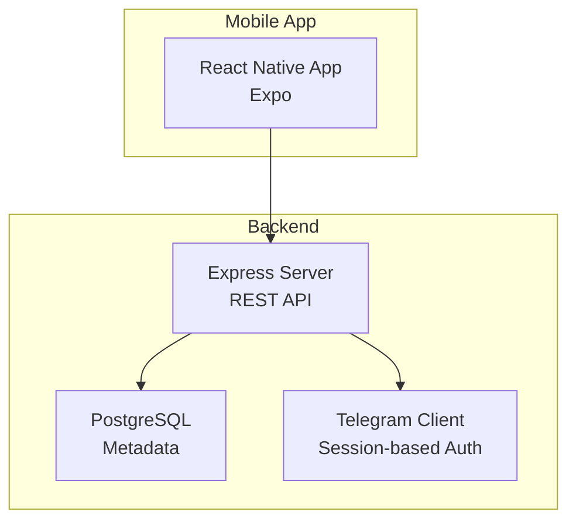

# Getting Started

<cite>
**Referenced Files in This Document**
- [README.md](file://README.md)
- [package.json](file://package.json)
- [Procfile](file://Procfile)
- [eas.json](file://eas.json)
- [server/package.json](file://server/package.json)
- [server/tsconfig.json](file://server/tsconfig.json)
- [server/src/index.ts](file://server/src/index.ts)
- [server/src/config/db.ts](file://server/src/config/db.ts)
- [server/src/config/telegram.ts](file://server/src/config/telegram.ts)
- [server/src/services/db.service.ts](file://server/src/services/db.service.ts)
- [server/src/services/telegram.service.ts](file://server/src/services/telegram.service.ts)
- [server/src/generateSession.ts](file://server/src/generateSession.ts)
- [app/package.json](file://app/package.json)
- [app/app.json](file://app/app.json)
- [app/tsconfig.json](file://app/tsconfig.json)
- [app/.gitignore](file://app/.gitignore)
</cite>

## Table of Contents
1. [Introduction](#introduction)
2. [Prerequisites](#prerequisites)
3. [Installation](#installation)
4. [Environment Configuration](#environment-configuration)
5. [Development Workflow](#development-workflow)
6. [Telegram Bot Setup](#telegram-bot-setup)
7. [Database Setup](#database-setup)
8. [Mobile App Development with Expo](#mobile-app-development-with-expo)
9. [Architecture Overview](#architecture-overview)
10. [Troubleshooting Guide](#troubleshooting-guide)
11. [Deployment Preparation](#deployment-preparation)
12. [Conclusion](#conclusion)

## Introduction
This guide helps you set up the ANYX development environment from scratch. ANYX is a self-hosted cloud storage system that uses Telegram as the storage backend, with a modern React Native mobile app and a Node.js + Express backend backed by PostgreSQL. You will configure environment variables, initialize the database, set up Telegram credentials, and run both the backend and the mobile app locally using Expo.

## Prerequisites
Before starting, ensure you have the following installed on your development machine:
- Node.js version 20.x for the backend (required by server package engines)
- npm (bundled with Node.js)
- PostgreSQL (local or hosted)
- Telegram API credentials (API ID and API Hash)
- A Telegram session string for the private channel
- Expo CLI or the Expo Go app on your mobile device

These requirements are implied by the project’s configuration and dependencies:
- Backend runtime requirement: Node.js 20.x
- Backend dependencies include Express, PostgreSQL driver, Telegram client libraries
- Mobile app uses Expo and React Native
- Telegram integration requires API credentials and a session string

**Section sources**
- [server/package.json](file://server/package.json#L16-L18)
- [server/src/config/db.ts](file://server/src/config/db.ts#L1-L61)
- [server/src/config/telegram.ts](file://server/src/config/telegram.ts#L1-L29)
- [app/package.json](file://app/package.json#L1-L59)

## Installation
Follow these steps to prepare your local environment:

1. Clone the repository
   - Use your preferred Git client to clone the repository and navigate into the project directory.

2. Install backend dependencies
   - From the project root, change into the server directory and install dependencies:
     - cd server
     - npm install

3. Install mobile app dependencies
   - From the project root, change into the app directory and install dependencies:
     - cd app
     - npm install

4. Build backend (optional)
   - Optionally compile TypeScript sources:
     - cd server
     - npm run build

5. Initialize the database schema
   - Start the backend once so it initializes the schema and indexes:
     - cd server
     - npm run dev
   - On first run, the server creates tables and applies migrations automatically.

6. Start the backend
   - Keep the backend running during development:
     - cd server
     - npm run dev

7. Start the mobile app
   - In another terminal, start the Expo dev server:
     - cd app
     - npx expo start
   - Scan the QR code with the Expo Go app on your device.

**Section sources**
- [README.md](file://README.md#L250-L321)
- [server/package.json](file://server/package.json#L6-L11)
- [server/src/index.ts](file://server/src/index.ts#L295-L312)
- [app/package.json](file://app/package.json#L5-L10)

## Environment Configuration
Create a .env file in the server directory with the required environment variables. The backend reads these variables at startup.

Required variables (examples):
- PORT: server port (default used if unset)
- DATABASE_URL: PostgreSQL connection string
- TELEGRAM_API_ID: Telegram API ID
- TELEGRAM_API_HASH: Telegram API Hash
- TELEGRAM_SESSION: Telegram session string for the private channel
- TELEGRAM_CHANNEL_ID: Private Telegram channel identifier
- JWT_SECRET: Secret for signing JWT tokens
- COOKIE_SECRET: Secret for signing cookies
- ALLOWED_ORIGINS: Comma-separated list of allowed CORS origins

Notes:
- DATABASE_URL is validated at startup; SSL mode is automatically appended for remote hosts.
- TELEGRAM_SESSION is loaded by the Telegram client to authenticate without exposing credentials to the client.
- JWT_SECRET and COOKIE_SECRET should be strong secrets in production.

**Section sources**
- [README.md](file://README.md#L279-L300)
- [server/src/config/db.ts](file://server/src/config/db.ts#L6-L37)
- [server/src/config/telegram.ts](file://server/src/config/telegram.ts#L7-L14)
- [server/src/index.ts](file://server/src/index.ts#L63-L83)

## Development Workflow
The typical development loop involves:
- Running the backend in development mode:
  - cd server
  - npm run dev
- Running the mobile app:
  - cd app
  - npx expo start
- Scanning the QR code with Expo Go to launch the app on your device
- Making changes to the app or backend and reloading as needed

Optional: Use Expo commands to target specific platforms:
- npx expo run:android
- npx expo run:ios
- npx expo start --web

**Section sources**
- [README.md](file://README.md#L303-L321)
- [app/package.json](file://app/package.json#L6-L10)

## Telegram Bot Setup
ANYX integrates with Telegram using a Telegram client configured with API credentials and a session string. The session string authenticates the backend to the Telegram API without exposing secrets to the client.

Steps:
1. Obtain Telegram API credentials
   - Register a Telegram application to get API ID and API Hash.

2. Generate a session string
   - Use the provided script to log in and generate a session string:
     - cd server
     - npx ts-node src/generateSession.ts
   - Enter your phone number, 2FA password (if enabled), and OTP when prompted.
   - Copy the printed session string and add it to your .env as TELEGRAM_SESSION.

3. Configure the Telegram client
   - The backend loads TELEGRAM_API_ID, TELEGRAM_API_HASH, and TELEGRAM_SESSION from .env.
   - The Telegram client connects on demand and supports auto-reconnect.

4. Set the Telegram channel
   - Configure TELEGRAM_CHANNEL_ID in .env to point to your private Telegram channel.

5. Optional: Use the Telegram service helpers
   - The service exposes functions to send OTP, sign in, and manage client pools for streaming and downloads.

**Section sources**
- [server/src/config/telegram.ts](file://server/src/config/telegram.ts#L7-L28)
- [server/src/services/telegram.service.ts](file://server/src/services/telegram.service.ts#L24-L97)
- [server/src/generateSession.ts](file://server/src/generateSession.ts#L13-L35)
- [README.md](file://README.md#L279-L300)

## Database Setup
ANYX uses PostgreSQL for metadata storage. The backend automatically initializes the schema and applies migrations on startup.

What happens on startup:
- The server cleans orphaned upload temporary directories.
- It initializes the schema and applies migrations.
- It starts listening on the configured port.

Important considerations:
- DATABASE_URL must be set in .env.
- For remote databases (e.g., Render, Neon), SSL mode is enforced automatically.
- The connection pool is tuned for small instances and short cold-start windows.

**Section sources**
- [server/src/index.ts](file://server/src/index.ts#L274-L312)
- [server/src/config/db.ts](file://server/src/config/db.ts#L22-L37)
- [server/src/services/db.service.ts](file://server/src/services/db.service.ts#L3-L312)

## Mobile App Development with Expo
The mobile app is an Expo React Native project with platform-specific configurations and permissions.

Key points:
- App identifiers and permissions are defined in app.json.
- iOS and Android permissions and usage descriptions are configured.
- Expo plugins enable sharing, image/video, notifications, document picker, and build properties.
- The app targets React Native 0.83.2 and Expo SDK ~55.0.4.

Development tips:
- Use npx expo start to launch the dev server.
- Use npx expo run:android or npx expo run:ios to run on devices/emulators.
- Use npx expo start --web to develop on the web.

**Section sources**
- [app/app.json](file://app/app.json#L14-L86)
- [app/package.json](file://app/package.json#L1-L59)
- [app/tsconfig.json](file://app/tsconfig.json#L1-L5)

## Architecture Overview
The development architecture consists of:
- Mobile App (React Native via Expo) communicating with the backend over HTTP
- Backend (Node.js + Express) serving REST endpoints and managing uploads/downloads
- PostgreSQL storing metadata
- Telegram acting as the storage backend via the Telegram client

**Diagram sources**
- [server/src/index.ts](file://server/src/index.ts#L1-L315)
- [server/src/config/db.ts](file://server/src/config/db.ts#L1-L61)
- [server/src/config/telegram.ts](file://server/src/config/telegram.ts#L1-L29)

## Troubleshooting Guide
Common setup issues and resolutions:

- Backend fails to start due to missing DATABASE_URL
  - Ensure DATABASE_URL is set in .env. The backend validates this variable and logs a critical message if missing.

- SSL connection errors to PostgreSQL
  - Remote databases automatically append sslmode=require. Verify your host allows SSL connections.

- Telegram connection failures
  - Confirm TELEGRAM_API_ID and TELEGRAM_API_HASH are set.
  - Regenerate TELEGRAM_SESSION using the provided script if the session is expired or revoked.

- Port conflicts
  - Change PORT in .env if the default port is in use.

- Expo dev server issues
  - Clear caches and reinstall dependencies if the dev server does not start:
    - cd app && rm -rf node_modules && npm install
  - Ensure Metro bundler is healthy and not blocked by antivirus/firewall.

- Platform-specific notes
  - Windows: Ensure Node.js 20.x is installed and PATH is configured. Use PowerShell or WSL if needed.
  - macOS: Install Xcode command line tools if targeting iOS. Use Homebrew to manage Node/npm if desired.
  - Linux: Install Node.js 20.x and system dependencies for building native modules if required.

**Section sources**
- [server/src/config/db.ts](file://server/src/config/db.ts#L9-L12)
- [server/src/config/telegram.ts](file://server/src/config/telegram.ts#L16-L28)
- [app/.gitignore](file://app/.gitignore#L1-L42)

## Deployment Preparation
Prepare for production deployment by understanding the project’s deployment-related files and recommended infrastructure.

- Procfile defines the production web command
  - web: cd server && npm start
  - Use this to deploy on platforms that honor Procfile (e.g., Render, Railway).

- Production build and scripts
  - Backend build compiles TypeScript to dist.
  - Root scripts delegate to server for build/start.

- Recommended hosting
  - Backend: Railway, Render, Fly.io, or a VPS
  - Database: Neon, Supabase, or managed PostgreSQL
  - Mobile builds: EAS Build for internal/production distributions

- Environment variables for production
  - Set DATABASE_URL, TELEGRAM_API_ID, TELEGRAM_API_HASH, TELEGRAM_SESSION, TELEGRAM_CHANNEL_ID, JWT_SECRET, COOKIE_SECRET, ALLOWED_ORIGINS
  - Ensure HTTPS is enabled in production

- Mobile distribution
  - Use EAS Build to produce native binaries:
    - eas build (development, preview, or production)
  - Configure app.json with proper identifiers and permissions for distribution.

**Section sources**
- [Procfile](file://Procfile#L1-L2)
- [package.json](file://package.json#L2-L5)
- [README.md](file://README.md#L323-L346)
- [eas.json](file://eas.json#L1-L22)
- [app/app.json](file://app/app.json#L74-L86)

## Conclusion
You now have the essentials to set up the ANYX development environment, configure the backend and database, integrate Telegram, and run the mobile app with Expo. Use the troubleshooting guide to resolve common issues, and refer to the deployment section to prepare for production. Happy developing!