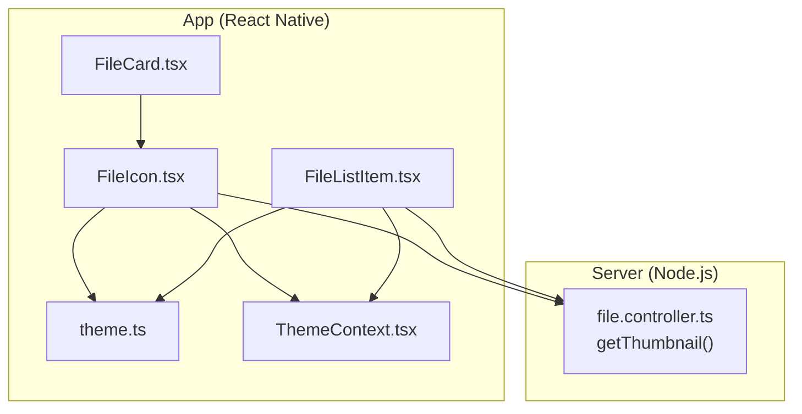
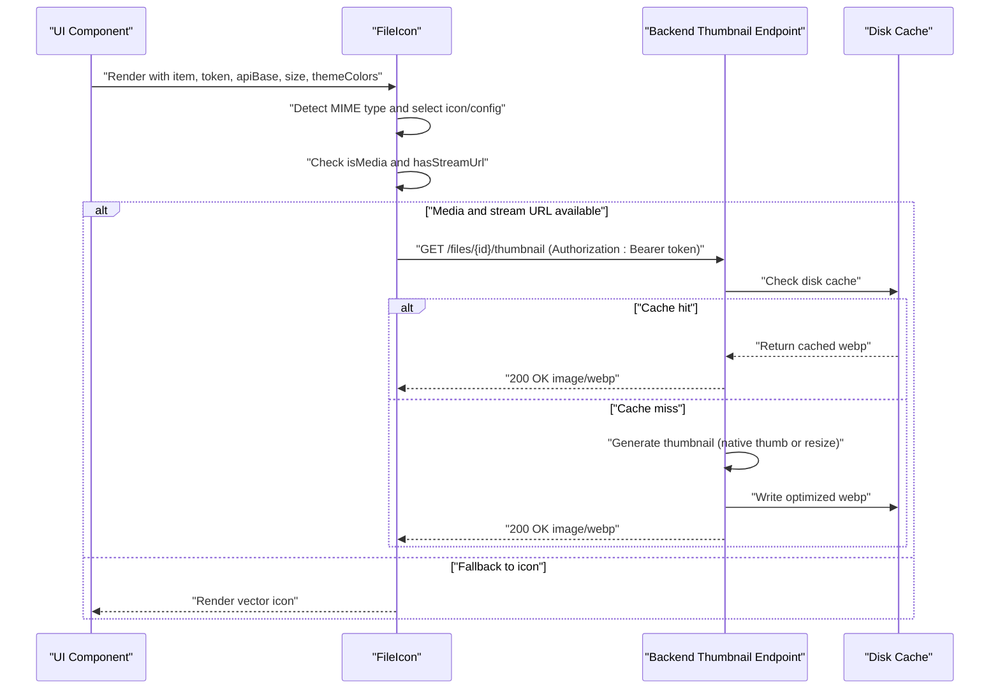
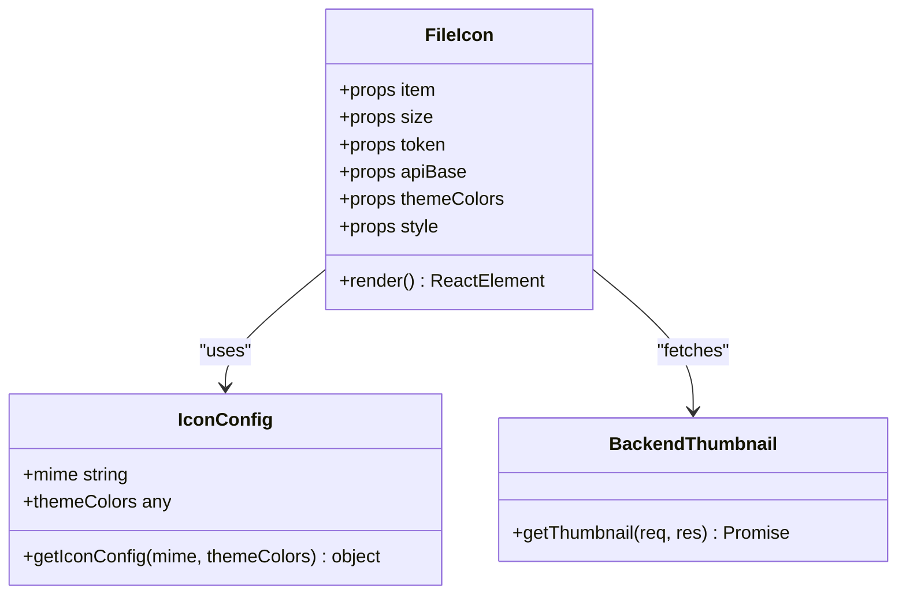
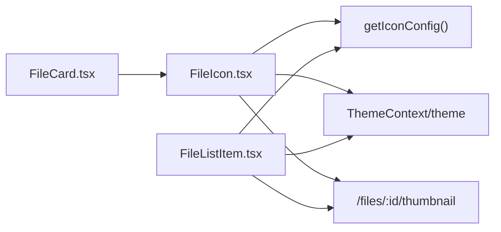

# File Icon System

<cite>
**Referenced Files in This Document**
- [FileIcon.tsx](file://app/src/components/FileIcon.tsx)
- [FileListItem.tsx](file://app/src/components/FileListItem.tsx)
- [FileCard.tsx](file://app/src/components/FileCard.tsx)
- [theme.ts](file://app/src/ui/theme.ts)
- [ThemeContext.tsx](file://app/src/context/ThemeContext.tsx)
- [file.controller.ts](file://server/src/controllers/file.controller.ts)
- [FilesScreen.tsx](file://app/src/screens/FilesScreen.tsx)
</cite>

## Table of Contents
1. [Introduction](#introduction)
2. [Project Structure](#project-structure)
3. [Core Components](#core-components)
4. [Architecture Overview](#architecture-overview)
5. [Detailed Component Analysis](#detailed-component-analysis)
6. [Dependency Analysis](#dependency-analysis)
7. [Performance Considerations](#performance-considerations)
8. [Troubleshooting Guide](#troubleshooting-guide)
9. [Conclusion](#conclusion)
10. [Appendices](#appendices)

## Introduction
This document explains the FileIcon component system used to detect file types and render appropriate icons across the application. It covers MIME type mapping, visual representation, props interface, fallback handling, responsive sizing, integration with thumbnail generation, performance optimization for large lists, cross-platform rendering consistency, accessibility considerations, and extensibility for adding new file types.

## Project Structure
The FileIcon system spans the React Native app and the Node.js backend:
- Frontend components: FileIcon, FileListItem, FileCard
- Theming: theme constants and ThemeContext provider
- Backend: thumbnail generation and caching pipeline

**Diagram sources**
- [FileIcon.tsx](file://app/src/components/FileIcon.tsx#L1-L48)
- [FileListItem.tsx](file://app/src/components/FileListItem.tsx#L1-L190)
- [FileCard.tsx](file://app/src/components/FileCard.tsx#L1-L119)
- [theme.ts](file://app/src/ui/theme.ts#L1-L113)
- [ThemeContext.tsx](file://app/src/context/ThemeContext.tsx#L1-L137)
- [file.controller.ts](file://server/src/controllers/file.controller.ts#L453-L541)

**Section sources**
- [FileIcon.tsx](file://app/src/components/FileIcon.tsx#L1-L48)
- [FileListItem.tsx](file://app/src/components/FileListItem.tsx#L1-L190)
- [FileCard.tsx](file://app/src/components/FileCard.tsx#L1-L119)
- [theme.ts](file://app/src/ui/theme.ts#L1-L113)
- [ThemeContext.tsx](file://app/src/context/ThemeContext.tsx#L1-L137)
- [file.controller.ts](file://server/src/controllers/file.controller.ts#L453-L541)

## Core Components
- FileIcon: Renders either a themed icon or a media thumbnail depending on file type and availability.
- FileListItem: Uses a similar icon-config logic for list views and supports thumbnail loading.
- FileCard: Wraps FileIcon within a card layout for grid-style browsing.
- ThemeContext and theme: Provide color tokens and theme-aware rendering.

Key responsibilities:
- Detect MIME type and derive icon and background color.
- Determine whether to show a thumbnail vs. a vector icon.
- Integrate with backend thumbnail endpoint and caching.

**Section sources**
- [FileIcon.tsx](file://app/src/components/FileIcon.tsx#L6-L14)
- [FileIcon.tsx](file://app/src/components/FileIcon.tsx#L16-L47)
- [FileListItem.tsx](file://app/src/components/FileListItem.tsx#L34-L44)
- [FileListItem.tsx](file://app/src/components/FileListItem.tsx#L113-L171)
- [FileCard.tsx](file://app/src/components/FileCard.tsx#L32-L68)
- [ThemeContext.tsx](file://app/src/context/ThemeContext.tsx#L26-L88)
- [theme.ts](file://app/src/ui/theme.ts#L1-L113)

## Architecture Overview
The FileIcon system follows a predictable flow:
- Props provide item metadata (id, mime_type, result_type), size, token, apiBase, and themeColors.
- MIME-based icon selection determines the icon component and colors.
- For media files (image/video), FileIcon attempts to load a thumbnail from the backend.
- If thumbnail fails or is unavailable, it falls back to a vector icon.
- Backend thumbnails are generated and cached to improve performance.

**Diagram sources**
- [FileIcon.tsx](file://app/src/components/FileIcon.tsx#L16-L47)
- [file.controller.ts](file://server/src/controllers/file.controller.ts#L453-L541)

## Detailed Component Analysis

### FileIcon Component
Purpose:
- Render a consistent icon for any file/folder based on MIME type and theme.
- Attempt to display a media thumbnail for images/videos when available.

Props interface:
- item: object with id, mime_type, result_type, and optional size metadata.
- size: number controlling width/height and derived icon size.
- token: string for Authorization header to access protected thumbnails.
- apiBase: base URL for thumbnail endpoint.
- themeColors: object containing primary color and other semantic colors.
- style: optional additional styles for the container.

Rendering logic:
- Folder detection: checks result_type or mime_type for directory.
- Media detection: image or video MIME types, excluding folders.
- Stream URL eligibility: requires token, apiBase, and non-folder.
- Icon selection: getIconConfig maps MIME to color, background, and icon.
- Thumbnail fallback: if media and stream URL are available and no error, render Image; otherwise render the vector icon.

Responsive sizing:
- Container size equals size prop.
- Icon size is proportional to container size (size * 0.5).
- Rounded corners derived from size.

Accessibility:
- Vector icons are accessible via screen readers; ensure meaningful alt text is provided by parent containers or labels.

Performance:
- Disk caching via cachePolicy and backend disk cache.
- onError handler switches to icon fallback to avoid long loading states.

Extensibility:
- Add new MIME categories in getIconConfig to introduce new icons and colors.
- Extend MIME checks to support additional formats.

**Section sources**
- [FileIcon.tsx](file://app/src/components/FileIcon.tsx#L6-L14)
- [FileIcon.tsx](file://app/src/components/FileIcon.tsx#L16-L47)

#### Class Diagram: Icon Config and Rendering

**Diagram sources**
- [FileIcon.tsx](file://app/src/components/FileIcon.tsx#L6-L14)
- [FileIcon.tsx](file://app/src/components/FileIcon.tsx#L16-L47)
- [file.controller.ts](file://server/src/controllers/file.controller.ts#L453-L541)

### FileListItem Component
Purpose:
- List view item with icon, name, and metadata.
- Similar icon-config logic to FileIcon for consistent visuals.

Key differences:
- Uses RN Image for thumbnails.
- Provides star/folder metadata rendering.
- Uses theme colors from ThemeContext.

**Section sources**
- [FileListItem.tsx](file://app/src/components/FileListItem.tsx#L34-L44)
- [FileListItem.tsx](file://app/src/components/FileListItem.tsx#L113-L171)

### FileCard Component
Purpose:
- Grid card layout integrating FileIcon with file name and metadata.

Integration:
- Passes item, token, apiBase, and themeColors to FileIcon.
- Uses theme colors for text and backgrounds.

**Section sources**
- [FileCard.tsx](file://app/src/components/FileCard.tsx#L32-L68)

### Theme Integration
- theme.ts defines brand and semantic colors used by FileIcon.
- ThemeContext provides light/dark variants and toggles.
- FileIcon reads themeColors.primary to unify folder and fallback icon colors.

**Section sources**
- [theme.ts](file://app/src/ui/theme.ts#L1-L113)
- [ThemeContext.tsx](file://app/src/context/ThemeContext.tsx#L26-L88)
- [FileIcon.tsx](file://app/src/components/FileIcon.tsx#L23)

### Backend Thumbnail Generation and Caching
- Endpoint: GET /files/:id/thumbnail
- Disk cache: id.webp with TTL; returns HIT/MISS headers.
- Priority: native Telegram thumbnail, fallback to full media resized to webp.
- Sharp optimization: resize to 1080x1080, webp with quality and effort tuning.
- Cache write: optimized buffer saved to disk for next request.

**Section sources**
- [file.controller.ts](file://server/src/controllers/file.controller.ts#L453-L541)

## Dependency Analysis
- FileIcon depends on:
  - getIconConfig for MIME-to-icon mapping.
  - ThemeContext/theme for colors.
  - Backend thumbnail endpoint for media previews.
- FileListItem mirrors icon logic for list rendering.
- FileCard composes FileIcon within a card layout.

**Diagram sources**
- [FileIcon.tsx](file://app/src/components/FileIcon.tsx#L6-L14)
- [FileIcon.tsx](file://app/src/components/FileIcon.tsx#L16-L47)
- [FileListItem.tsx](file://app/src/components/FileListItem.tsx#L34-L44)
- [FileListItem.tsx](file://app/src/components/FileListItem.tsx#L113-L171)
- [FileCard.tsx](file://app/src/components/FileCard.tsx#L32-L68)
- [ThemeContext.tsx](file://app/src/context/ThemeContext.tsx#L26-L88)
- [theme.ts](file://app/src/ui/theme.ts#L1-L113)
- [file.controller.ts](file://server/src/controllers/file.controller.ts#L453-L541)

**Section sources**
- [FileIcon.tsx](file://app/src/components/FileIcon.tsx#L6-L14)
- [FileIcon.tsx](file://app/src/components/FileIcon.tsx#L16-L47)
- [FileListItem.tsx](file://app/src/components/FileListItem.tsx#L34-L44)
- [FileListItem.tsx](file://app/src/components/FileListItem.tsx#L113-L171)
- [FileCard.tsx](file://app/src/components/FileCard.tsx#L32-L68)
- [ThemeContext.tsx](file://app/src/context/ThemeContext.tsx#L26-L88)
- [theme.ts](file://app/src/ui/theme.ts#L1-L113)
- [file.controller.ts](file://server/src/controllers/file.controller.ts#L453-L541)

## Performance Considerations
- Thumbnail caching:
  - Disk cache with TTL reduces repeated Telegram downloads.
  - Backend writes optimized webp buffers to disk.
- Frontend caching:
  - Image cachePolicy disk avoids redundant network fetches.
  - onError fallback to icon prevents long loading states.
- Large lists:
  - FileListItem uses React.memo with custom comparison to minimize re-renders.
  - FlatList virtualization handles scrolling efficiently.
- Streaming:
  - Separate stream controller uses disk cache and range requests for media playback.

**Section sources**
- [file.controller.ts](file://server/src/controllers/file.controller.ts#L453-L541)
- [FileIcon.tsx](file://app/src/components/FileIcon.tsx#L38-L41)
- [FileListItem.tsx](file://app/src/components/FileListItem.tsx#L175-L189)

## Troubleshooting Guide
Common issues and resolutions:
- Thumbnail not loading:
  - Verify token and apiBase are provided and not empty.
  - Confirm item is not a folder (folders do not receive thumbnails).
  - Check backend logs for cache misses and generation errors.
- Incorrect icon:
  - Ensure mime_type is present and correctly formatted.
  - Add new MIME category to getIconConfig if missing.
- Cross-platform rendering:
  - Vector icons render consistently across platforms.
  - For web, ensure proper MIME types are sent by backend.
- Accessibility:
  - Wrap icon containers with labels or ARIA attributes in parent components.
  - Use descriptive text alongside icons for screen readers.

**Section sources**
- [FileIcon.tsx](file://app/src/components/FileIcon.tsx#L19-L21)
- [FileIcon.tsx](file://app/src/components/FileIcon.tsx#L30-L44)
- [file.controller.ts](file://server/src/controllers/file.controller.ts#L453-L541)

## Conclusion
The FileIcon system provides a robust, theme-aware, and performant way to represent files across the app. By combining MIME-based icon selection with backend thumbnail caching, it delivers fast, consistent visuals for folders and media files. Extending support for new file types is straightforward by updating the icon configuration and backend MIME handling.

## Appendices

### Props Reference
- FileIcon props:
  - item: object with id, mime_type, result_type, size
  - size: number (default 46)
  - token: string (required for thumbnails)
  - apiBase: string (base URL for thumbnail endpoint)
  - themeColors: object with primary color
  - style: optional container styles

- FileListItem/FileCard props:
  - item: FileItem with id, name, mime_type, size, created_at, result_type
  - token: string
  - apiBaseUrl: string
  - theme: Theme object
  - isDark: boolean
  - onPress: callback

**Section sources**
- [FileIcon.tsx](file://app/src/components/FileIcon.tsx#L16-L23)
- [FileListItem.tsx](file://app/src/components/FileListItem.tsx#L24-L31)
- [FileCard.tsx](file://app/src/components/FileCard.tsx#L8-L14)

### MIME Type Mapping and Visual Representation
- Folders: Folder icon with primary color and light background.
- Images: Image icon with amber color and light yellow background.
- Videos: Film icon with purple color and lavender background.
- Audio: Music icon with green color and light green background.
- PDF: FileText icon with red color and light red background.
- Archives (zip/compressed): Archive icon with orange color and light orange background.
- Other: FileText icon with primary color and light background.

**Section sources**
- [FileIcon.tsx](file://app/src/components/FileIcon.tsx#L6-L14)
- [FileListItem.tsx](file://app/src/components/FileListItem.tsx#L34-L44)

### Example Scenarios
- Images: MIME includes “image”; renders thumbnail if available, otherwise vector Image icon.
- Videos: MIME includes “video”; renders thumbnail if available, otherwise vector Film icon.
- Documents/PDF: MIME includes “pdf”; renders FileText icon.
- Archives: MIME includes “zip” or “compress”; renders Archive icon.
- Folders: Always renders Folder icon with folder-specific colors.

**Section sources**
- [FileIcon.tsx](file://app/src/components/FileIcon.tsx#L19-L23)
- [FileIcon.tsx](file://app/src/components/FileIcon.tsx#L30-L44)

### Responsive Design Notes
- Container size scales with size prop; icon size is proportional (size * 0.5).
- Rounded corners derived from size for consistent aspect ratios.
- List/grid layouts adapt sizes via props passed down from higher-order components.

**Section sources**
- [FileIcon.tsx](file://app/src/components/FileIcon.tsx#L29)
- [FileIcon.tsx](file://app/src/components/FileIcon.tsx#L43)
- [FileCard.tsx](file://app/src/components/FileCard.tsx#L39)

### Accessibility Guidelines
- Provide labels for icon containers (e.g., file name text).
- Use sufficient color contrast with theme colors.
- Prefer vector icons for scalable, crisp rendering on all devices.

**Section sources**
- [ThemeContext.tsx](file://app/src/context/ThemeContext.tsx#L26-L88)
- [theme.ts](file://app/src/ui/theme.ts#L1-L113)

### Extensibility: Adding New File Types
Steps:
- Update getIconConfig to map new MIME patterns to an icon and color/background.
- Optionally adjust backend thumbnail generation to handle new media types if needed.
- Test rendering in FileIcon and FileListItem to ensure consistent visuals.

**Section sources**
- [FileIcon.tsx](file://app/src/components/FileIcon.tsx#L6-L14)
- [FileListItem.tsx](file://app/src/components/FileListItem.tsx#L34-L44)