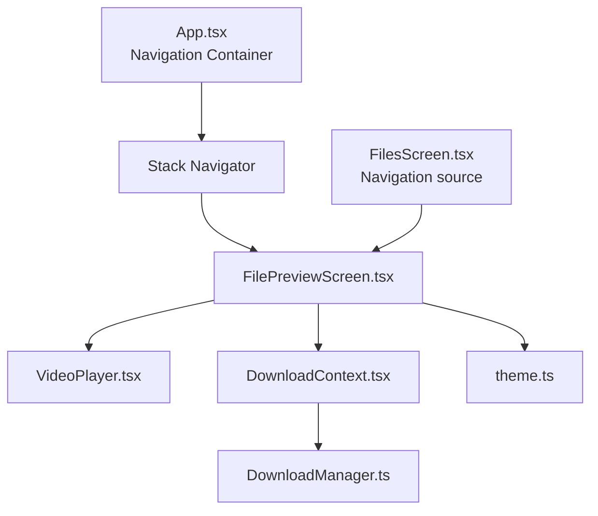
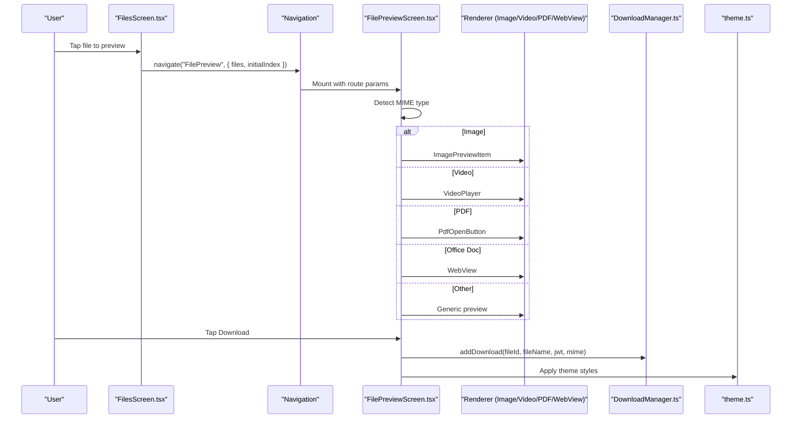
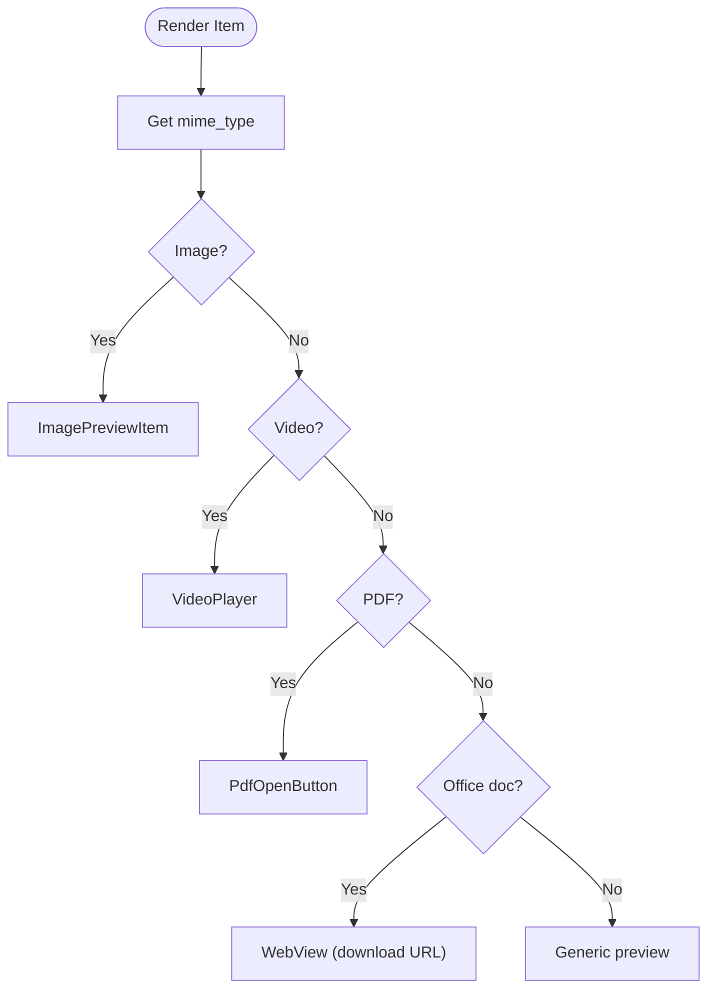
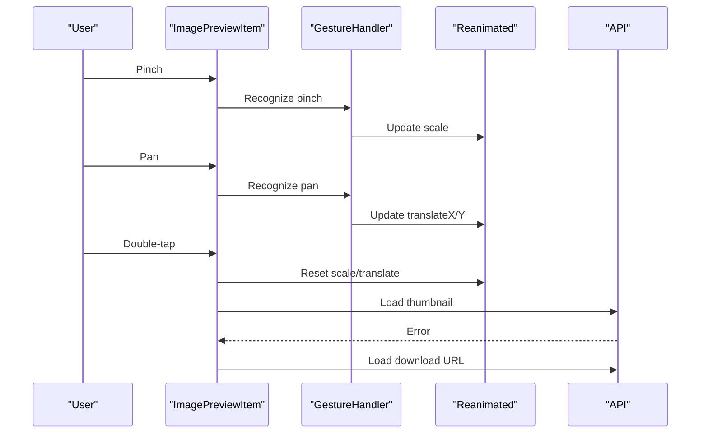
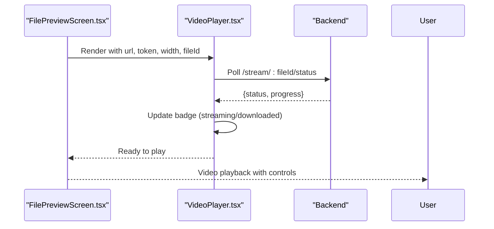
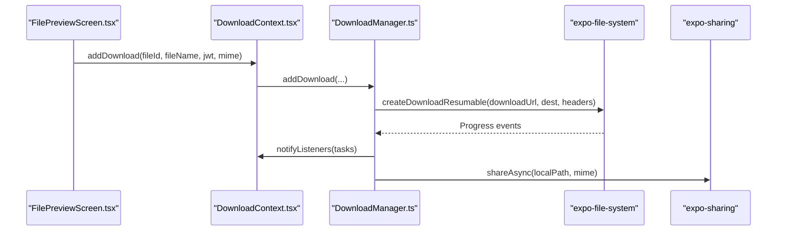
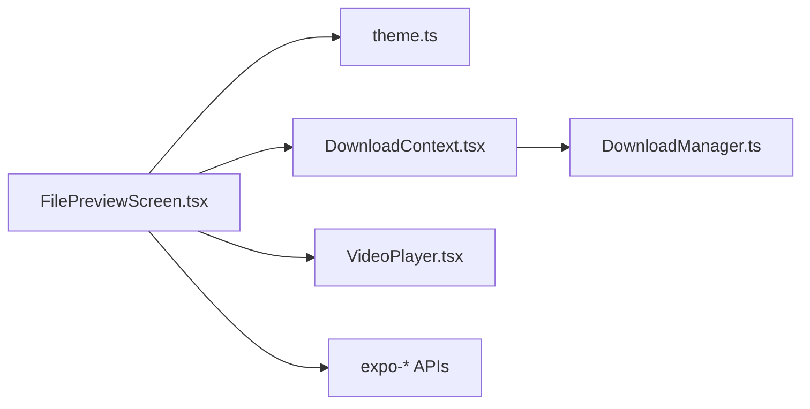

# File Preview Screen

<cite>
**Referenced Files in This Document**
- [FilePreviewScreen.tsx](file://app/src/screens/FilePreviewScreen.tsx)
- [VideoPlayer.tsx](file://app/src/components/VideoPlayer.tsx)
- [DownloadContext.tsx](file://app/src/context/DownloadContext.tsx)
- [DownloadManager.ts](file://app/src/services/DownloadManager.ts)
- [FilesScreen.tsx](file://app/src/screens/FilesScreen.tsx)
- [App.tsx](file://app/App.tsx)
- [theme.ts](file://app/src/ui/theme.ts)
</cite>

## Table of Contents
1. [Introduction](#introduction)
2. [Project Structure](#project-structure)
3. [Core Components](#core-components)
4. [Architecture Overview](#architecture-overview)
5. [Detailed Component Analysis](#detailed-component-analysis)
6. [Dependency Analysis](#dependency-analysis)
7. [Performance Considerations](#performance-considerations)
8. [Troubleshooting Guide](#troubleshooting-guide)
9. [Conclusion](#conclusion)
10. [Appendices](#appendices)

## Introduction
The File Preview Screen provides a unified, responsive media preview experience for images, videos, PDFs, and office documents. It integrates tightly with the file management system, authentication, and the download pipeline. Users can browse multiple files, perform actions (star, trash, share, move, rename), and preview content with optimized rendering and gesture support.

## Project Structure
The preview screen is part of the React Native application under the screens directory and integrates with:
- Navigation stack for routing
- Theme system for consistent UI
- Download context and manager for background downloads
- Video player component for streaming video playback
- File metadata and actions (star, trash, share, move, rename)

**Diagram sources**
- [App.tsx](file://app/App.tsx#L82-L112)
- [FilePreviewScreen.tsx](file://app/src/screens/FilePreviewScreen.tsx#L314-L753)
- [VideoPlayer.tsx](file://app/src/components/VideoPlayer.tsx#L28-L241)
- [DownloadContext.tsx](file://app/src/context/DownloadContext.tsx#L29-L84)
- [DownloadManager.ts](file://app/src/services/DownloadManager.ts#L42-L322)
- [FilesScreen.tsx](file://app/src/screens/FilesScreen.tsx#L138-L147)
- [theme.ts](file://app/src/ui/theme.ts#L1-L130)

**Section sources**
- [App.tsx](file://app/App.tsx#L82-L112)
- [FilePreviewScreen.tsx](file://app/src/screens/FilePreviewScreen.tsx#L314-L753)
- [FilesScreen.tsx](file://app/src/screens/FilesScreen.tsx#L138-L147)

## Core Components
- FilePreviewScreen: Main screen orchestrating preview rendering, gestures, actions, and navigation integration.
- ImagePreviewItem: Zoomable image preview with pinch-to-zoom, pan, and double-tap reset.
- PdfOpenButton: Downloads PDF to cache and opens externally or shares on iOS.
- VideoPlayer: Streaming video player with progress badges and retry controls.
- DownloadContext and DownloadManager: Global download queue with notifications and progress tracking.

Key responsibilities:
- Media type detection and renderer selection
- Authentication and JWT propagation
- Gesture handling for image zooming
- Download initiation and progress tracking
- File metadata display and actions

**Section sources**
- [FilePreviewScreen.tsx](file://app/src/screens/FilePreviewScreen.tsx#L54-L205)
- [FilePreviewScreen.tsx](file://app/src/screens/FilePreviewScreen.tsx#L211-L309)
- [VideoPlayer.tsx](file://app/src/components/VideoPlayer.tsx#L28-L241)
- [DownloadContext.tsx](file://app/src/context/DownloadContext.tsx#L11-L25)
- [DownloadManager.ts](file://app/src/services/DownloadManager.ts#L20-L38)

## Architecture Overview
The preview screen composes specialized renderers based on MIME type and coordinates with the download system and theme provider.

**Diagram sources**
- [FilesScreen.tsx](file://app/src/screens/FilesScreen.tsx#L138-L147)
- [FilePreviewScreen.tsx](file://app/src/screens/FilePreviewScreen.tsx#L314-L536)
- [VideoPlayer.tsx](file://app/src/components/VideoPlayer.tsx#L28-L241)
- [DownloadManager.ts](file://app/src/services/DownloadManager.ts#L153-L174)
- [theme.ts](file://app/src/ui/theme.ts#L1-L130)

## Detailed Component Analysis

### Props Interface and State Management
- Route props:
  - files: array of file objects (filtered to exclude directories)
  - file: fallback single file object
  - initialIndex: number indicating starting slide
- Local state:
  - currentIndex: current visible file index
  - isZoomed: disables horizontal scrolling when true (image zoom)
  - file: memoized current file object
  - jwt: authentication token
  - downloading: download button disabled state
  - isStarred: starred state
  - share modal state: shareModalVisible, shareToken, isCreatingShare
  - move modal state: moveModalVisible, folders, loadingFolders
  - rename modal state: renameModalVisible, newName

Rendering and navigation:
- FlatList renders items horizontally with paging and snapping
- onViewableItemsChanged updates currentIndex
- Header actions: back, star, trash
- Bottom sheet: download, share, rename, move

**Section sources**
- [FilePreviewScreen.tsx](file://app/src/screens/FilePreviewScreen.tsx#L314-L396)
- [FilePreviewScreen.tsx](file://app/src/screens/FilePreviewScreen.tsx#L614-L681)

### Media Type Detection and Rendering
- MIME-based renderer selection:
  - Images: ImagePreviewItem with zoom and pan
  - Videos: VideoPlayer with streaming badges and retry
  - PDFs: PdfOpenButton with external open/share
  - Office docs: WebView with auth headers
  - Others: Generic preview with file name and type

**Diagram sources**
- [FilePreviewScreen.tsx](file://app/src/screens/FilePreviewScreen.tsx#L459-L536)

**Section sources**
- [FilePreviewScreen.tsx](file://app/src/screens/FilePreviewScreen.tsx#L459-L536)

### Image Gallery and Gesture Handling
- ImagePreviewItem implements:
  - Pinch-to-zoom with min/max scale bounds
  - Pan with clamping to visible area
  - Double-tap to reset to 1x
  - Animated transforms via reanimated
  - Fallback to full download URL on thumbnail failure
  - Loading and error states

**Diagram sources**
- [FilePreviewScreen.tsx](file://app/src/screens/FilePreviewScreen.tsx#L54-L205)

**Section sources**
- [FilePreviewScreen.tsx](file://app/src/screens/FilePreviewScreen.tsx#L54-L205)

### Video Player Integration
- VideoPlayer streams via expo-video with Authorization header
- Progressively shows “Streaming…” or “Downloaded” badges based on backend status
- Provides retry mechanism and error overlay
- Handles mute/play controls and native controls

**Diagram sources**
- [FilePreviewScreen.tsx](file://app/src/screens/FilePreviewScreen.tsx#L482-L489)
- [VideoPlayer.tsx](file://app/src/components/VideoPlayer.tsx#L48-L88)

**Section sources**
- [VideoPlayer.tsx](file://app/src/components/VideoPlayer.tsx#L28-L241)

### PDF and Office Document Handling
- PDF:
  - Uses legacy file system to download to cache with Authorization header
  - On Android: converts to content URI and launches VIEW intent
  - On iOS: uses sharing sheet if available
- Office docs:
  - Renders in WebView with download URL and Authorization header
  - Restricts allowed URLs to API base, about:blank, blob:, data:

**Section sources**
- [FilePreviewScreen.tsx](file://app/src/screens/FilePreviewScreen.tsx#L211-L309)
- [FilePreviewScreen.tsx](file://app/src/screens/FilePreviewScreen.tsx#L494-L527)

### Download System Integration
- Initiates downloads via DownloadContext.addDownload
- Tracks active downloads and overall progress
- Provides notifications for download progress and completion
- Supports cancel, cancelAll, and clearCompleted

**Diagram sources**
- [FilePreviewScreen.tsx](file://app/src/screens/FilePreviewScreen.tsx#L423-L429)
- [DownloadContext.tsx](file://app/src/context/DownloadContext.tsx#L41-L45)
- [DownloadManager.ts](file://app/src/services/DownloadManager.ts#L153-L174)
- [DownloadManager.ts](file://app/src/services/DownloadManager.ts#L268-L318)

**Section sources**
- [DownloadContext.tsx](file://app/src/context/DownloadContext.tsx#L11-L25)
- [DownloadManager.ts](file://app/src/services/DownloadManager.ts#L20-L38)
- [DownloadManager.ts](file://app/src/services/DownloadManager.ts#L153-L174)

### File Metadata and User Interactions
- Displays file name, size, and formatted creation date
- Actions:
  - Star/unstar
  - Trash with confirmation
  - Share link creation and copy
  - Rename with modal
  - Move to folder with folder picker
- Responsive bottom sheet with action buttons

**Section sources**
- [FilePreviewScreen.tsx](file://app/src/screens/FilePreviewScreen.tsx#L656-L751)
- [FilePreviewScreen.tsx](file://app/src/screens/FilePreviewScreen.tsx#L389-L421)

### Navigation Integration
- Navigated from FilesScreen with files array and initialIndex
- Registered in App.tsx stack navigator as "FilePreview"
- Back navigation handled via header button

**Section sources**
- [FilesScreen.tsx](file://app/src/screens/FilesScreen.tsx#L138-L147)
- [App.tsx](file://app/App.tsx#L97-L97)

## Dependency Analysis
- FilePreviewScreen depends on:
  - Theme system for consistent styling
  - DownloadContext for global download state
  - VideoPlayer for video rendering
  - Expo APIs for file system, sharing, clipboard, and intents
- DownloadManager is a singleton providing:
  - Task lifecycle management
  - Progress notifications
  - Concurrent download limits
  - Resumable downloads

**Diagram sources**
- [FilePreviewScreen.tsx](file://app/src/screens/FilePreviewScreen.tsx#L1-L30)
- [DownloadContext.tsx](file://app/src/context/DownloadContext.tsx#L8-L9)
- [DownloadManager.ts](file://app/src/services/DownloadManager.ts#L11-L16)
- [VideoPlayer.tsx](file://app/src/components/VideoPlayer.tsx#L12-L16)

**Section sources**
- [FilePreviewScreen.tsx](file://app/src/screens/FilePreviewScreen.tsx#L1-L30)
- [DownloadContext.tsx](file://app/src/context/DownloadContext.tsx#L8-L9)
- [DownloadManager.ts](file://app/src/services/DownloadManager.ts#L11-L16)

## Performance Considerations
- FlatList optimizations:
  - pagingEnabled and snapToInterval for smooth horizontal paging
  - removeClippedSubviews, initialNumToRender, maxToRenderPerBatch, windowSize for memory efficiency
  - viewabilityConfig with 50% coverage threshold
- Image rendering:
  - expo-image with disk cache policy and transition
  - fallback to download URL on thumbnail failure
- Video streaming:
  - expo-video with native controls and progress polling
  - streaming badge informs users about caching progress
- Download progress:
  - Notifications for ongoing downloads
  - Max concurrent downloads enforced
  - Progress updates via subscriber pattern

[No sources needed since this section provides general guidance]

## Troubleshooting Guide
Common issues and resolutions:
- Authentication missing:
  - Screen shows loading state until JWT is available
  - Ensure token is persisted and retrieved
- Video stream fails:
  - VideoPlayer displays error overlay with retry
  - Consider switching to download-based preview
- PDF opening fails:
  - PdfOpenButton handles platform differences and errors
  - Verify Authorization header and sharing availability
- Download stuck:
  - Check DownloadContext.hasActive and overall progress
  - Cancel or clear completed tasks if needed
- Gesture conflicts:
  - isZoomed disables FlatList horizontal scrolling to prevent conflicts

**Section sources**
- [FilePreviewScreen.tsx](file://app/src/screens/FilePreviewScreen.tsx#L616-L621)
- [VideoPlayer.tsx](file://app/src/components/VideoPlayer.tsx#L183-L193)
- [FilePreviewScreen.tsx](file://app/src/screens/FilePreviewScreen.tsx#L216-L261)
- [DownloadContext.tsx](file://app/src/context/DownloadContext.tsx#L51-L67)

## Conclusion
The File Preview Screen delivers a cohesive, responsive media preview experience with robust integrations for images, videos, PDFs, and office documents. It leverages gesture handling, streaming badges, and a centralized download system to provide a smooth user experience across devices and network conditions.

## Appendices

### Setup Examples
- Preview screen setup:
  - Navigate from FilesScreen with files array and initialIndex
  - Ensure route params are passed correctly
- Media type detection:
  - Use mime_type to select renderer
  - Handle fallbacks for unsupported types
- Video player integration:
  - Pass stream URL and JWT to VideoPlayer
  - Handle onError callback for graceful degradation
- Image gallery:
  - Use ImagePreviewItem with JWT and zoom callbacks
  - Disable FlatList scrolling when zoomed
- Download integration:
  - Call addDownload with fileId, fileName, jwt, and mime
  - Subscribe to DownloadContext for progress updates

**Section sources**
- [FilesScreen.tsx](file://app/src/screens/FilesScreen.tsx#L138-L147)
- [FilePreviewScreen.tsx](file://app/src/screens/FilePreviewScreen.tsx#L459-L536)
- [VideoPlayer.tsx](file://app/src/components/VideoPlayer.tsx#L28-L241)
- [FilePreviewScreen.tsx](file://app/src/screens/FilePreviewScreen.tsx#L54-L205)
- [DownloadContext.tsx](file://app/src/context/DownloadContext.tsx#L41-L45)