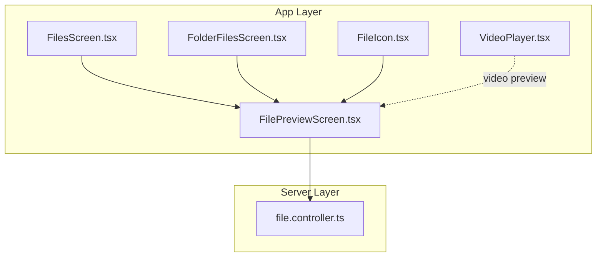
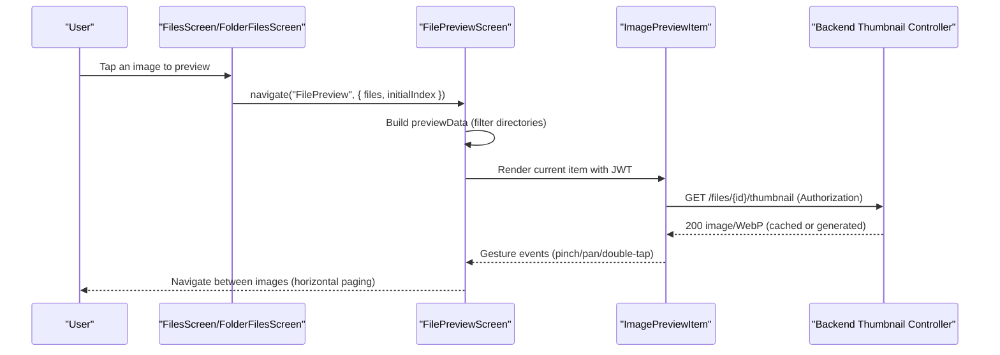
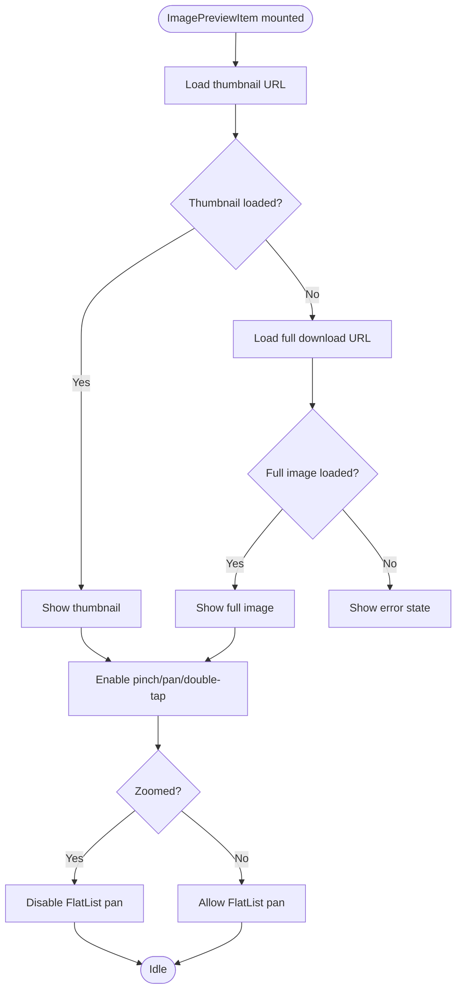
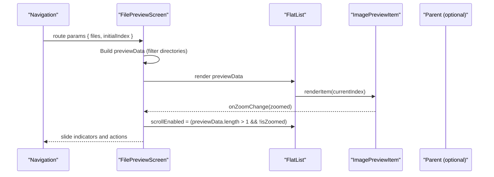
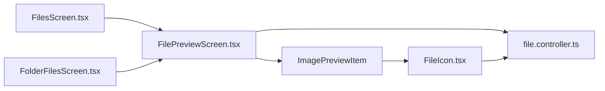

# Image Gallery Integration

<cite>
**Referenced Files in This Document**
- [FilePreviewScreen.tsx](file://app/src/screens/FilePreviewScreen.tsx)
- [FileIcon.tsx](file://app/src/components/FileIcon.tsx)
- [FolderFilesScreen.tsx](file://app/src/screens/FolderFilesScreen.tsx)
- [FilesScreen.tsx](file://app/src/screens/FilesScreen.tsx)
- [VideoPlayer.tsx](file://app/src/components/VideoPlayer.tsx)
- [file.controller.ts](file://server/src/controllers/file.controller.ts)
</cite>

## Table of Contents
1. [Introduction](#introduction)
2. [Project Structure](#project-structure)
3. [Core Components](#core-components)
4. [Architecture Overview](#architecture-overview)
5. [Detailed Component Analysis](#detailed-component-analysis)
6. [Dependency Analysis](#dependency-analysis)
7. [Performance Considerations](#performance-considerations)
8. [Troubleshooting Guide](#troubleshooting-guide)
9. [Conclusion](#conclusion)
10. [Appendices](#appendices)

## Introduction
This document explains how the image gallery integrates into the media preview system. It covers the gallery component implementation, thumbnail generation, grid layout, navigation between images, and integration with file listing screens. It also documents touch gesture handling, lazy loading, caching strategies, responsive layouts, and performance optimizations for large image collections. Finally, it provides guidelines for extending gallery functionality and building custom image viewing experiences.

## Project Structure
The gallery is primarily implemented in a dedicated preview screen that hosts a horizontally paginated list of media items. Supporting components include a thumbnail icon renderer and file listing screens that feed the preview with filtered, sorted, and searchable datasets. On the backend, thumbnails are generated and cached efficiently.

**Diagram sources**
- [FilePreviewScreen.tsx](file://app/src/screens/FilePreviewScreen.tsx#L314-L755)
- [FileIcon.tsx](file://app/src/components/FileIcon.tsx#L1-L48)
- [FolderFilesScreen.tsx](file://app/src/screens/FolderFilesScreen.tsx#L426-L464)
- [FilesScreen.tsx](file://app/src/screens/FilesScreen.tsx#L137-L147)
- [VideoPlayer.tsx](file://app/src/components/VideoPlayer.tsx#L1-L353)
- [file.controller.ts](file://server/src/controllers/file.controller.ts#L453-L541)

**Section sources**
- [FilePreviewScreen.tsx](file://app/src/screens/FilePreviewScreen.tsx#L314-L755)
- [FileIcon.tsx](file://app/src/components/FileIcon.tsx#L1-L48)
- [FolderFilesScreen.tsx](file://app/src/screens/FolderFilesScreen.tsx#L426-L464)
- [FilesScreen.tsx](file://app/src/screens/FilesScreen.tsx#L137-L147)
- [VideoPlayer.tsx](file://app/src/components/VideoPlayer.tsx#L1-L353)
- [file.controller.ts](file://server/src/controllers/file.controller.ts#L453-L541)

## Core Components
- ImagePreviewItem: Renders a single image with pinch-to-zoom, pan, and double-tap reset gestures. It lazily loads thumbnails and falls back to full-size images on failure.
- FilePreviewScreen: Hosts the gallery as a horizontally paginated FlatList. Manages navigation between images, zoom state, and bottom sheets for file actions.
- FileIcon: Renders thumbnails for file cards and lists, using the same thumbnail endpoint.
- FolderFilesScreen and FilesScreen: Provide file listings with filtering, sorting, and search. They pass filtered, previewable files to the gallery.
- VideoPlayer: Handles video playback and streaming status; used alongside images in the preview stack.
- Backend Thumbnail Controller: Generates and caches WebP thumbnails, serving cached results when available.

**Section sources**
- [FilePreviewScreen.tsx](file://app/src/screens/FilePreviewScreen.tsx#L54-L205)
- [FileIcon.tsx](file://app/src/components/FileIcon.tsx#L16-L47)
- [FolderFilesScreen.tsx](file://app/src/screens/FolderFilesScreen.tsx#L426-L464)
- [FilesScreen.tsx](file://app/src/screens/FilesScreen.tsx#L137-L147)
- [VideoPlayer.tsx](file://app/src/components/VideoPlayer.tsx#L28-L88)
- [file.controller.ts](file://server/src/controllers/file.controller.ts#L453-L541)

## Architecture Overview
The gallery is a horizontally paginated preview surface driven by a FlatList. Each page renders either an image preview item (with gestures), a video player, or a document preview. Thumbnails are fetched from the backend and cached on both server and client.

**Diagram sources**
- [FilesScreen.tsx](file://app/src/screens/FilesScreen.tsx#L137-L147)
- [FolderFilesScreen.tsx](file://app/src/screens/FolderFilesScreen.tsx#L426-L464)
- [FilePreviewScreen.tsx](file://app/src/screens/FilePreviewScreen.tsx#L314-L755)
- [FilePreviewScreen.tsx](file://app/src/screens/FilePreviewScreen.tsx#L460-L536)
- [FilePreviewScreen.tsx](file://app/src/screens/FilePreviewScreen.tsx#L622-L644)
- [FilePreviewScreen.tsx](file://app/src/screens/FilePreviewScreen.tsx#L54-L205)
- [file.controller.ts](file://server/src/controllers/file.controller.ts#L453-L541)

## Detailed Component Analysis

### ImagePreviewItem: Gesture-driven image viewer
- Purpose: Host a single image with pinch-to-zoom, pan, and double-tap reset. Supports lazy loading and fallback to full-size images.
- Key behaviors:
  - Uses shared values for scale and translation to drive animated transforms.
  - Disables pan when zoomed out to avoid conflicting with FlatList horizontal scroll.
  - Switches between thumbnail and full download URL on error.
  - Notifies parent when zoom state changes to coordinate with paging.
- Performance:
  - Uses Reanimated v4 for smooth animations.
  - Uses expo-image with disk caching and transitions.

**Diagram sources**
- [FilePreviewScreen.tsx](file://app/src/screens/FilePreviewScreen.tsx#L54-L205)

**Section sources**
- [FilePreviewScreen.tsx](file://app/src/screens/FilePreviewScreen.tsx#L54-L205)

### FilePreviewScreen: Gallery host and navigation
- Purpose: Hosts the gallery as a horizontally paginated FlatList. Manages current index, zoom state, and bottom sheet actions.
- Key behaviors:
  - Builds previewData by filtering out directories.
  - Renders different views per MIME type (image, video, PDF, office docs).
  - Coordinates zoom state with paging to prevent gesture conflicts.
  - Provides slide indicators and action buttons (download, share, rename, move).
- Performance:
  - Uses getItemLayout for O(1) scroll.
  - Enables removeClippedSubviews, limits initial rendering, and sets windowSize for efficient virtualization.

**Diagram sources**
- [FilePreviewScreen.tsx](file://app/src/screens/FilePreviewScreen.tsx#L314-L755)
- [FilePreviewScreen.tsx](file://app/src/screens/FilePreviewScreen.tsx#L622-L644)
- [FilePreviewScreen.tsx](file://app/src/screens/FilePreviewScreen.tsx#L460-L536)

**Section sources**
- [FilePreviewScreen.tsx](file://app/src/screens/FilePreviewScreen.tsx#L314-L755)

### FileIcon: Thumbnail renderer for lists and cards
- Purpose: Renders thumbnails for file cards and lists. Falls back to appropriate icons when thumbnails are unavailable.
- Key behaviors:
  - Uses the same thumbnail endpoint as the preview.
  - Applies disk caching and transitions for fast rendering.
  - Switches to icon-only rendering when thumbnails fail.

**Section sources**
- [FileIcon.tsx](file://app/src/components/FileIcon.tsx#L16-L47)

### File listing integration: Navigation patterns
- FilesScreen and FolderFilesScreen:
  - Provide filtering, sorting, and search.
  - Build a previewable subset by filtering out directories.
  - Navigate to the preview screen with the filtered dataset and computed initial index.
- Navigation flow:
  - From FilesScreen: pass filteredFiles and index to FilePreviewScreen.
  - From FolderFilesScreen: compute index among previewable files and navigate similarly.

**Section sources**
- [FilesScreen.tsx](file://app/src/screens/FilesScreen.tsx#L137-L147)
- [FolderFilesScreen.tsx](file://app/src/screens/FolderFilesScreen.tsx#L426-L464)

### Backend thumbnail generation and caching
- Endpoint: GET /files/{id}/thumbnail
- Strategy:
  - Check disk cache first; serve if fresh.
  - Attempt to fetch a native Telegram thumbnail; otherwise download full image.
  - Compress to WebP with quality and effort tuned for performance.
  - Save to disk cache for subsequent requests.
- Headers and caching:
  - Sets Cache-Control and immutable TTL.
  - Returns X-Cache header indicating cache hit/miss.

**Section sources**
- [file.controller.ts](file://server/src/controllers/file.controller.ts#L453-L541)

### Video preview integration
- VideoPlayer is used for video MIME types within the preview stack.
- It streams via Range requests, polls cache status, and shows loading overlays.
- Integrates seamlessly with the same preview navigation.

**Section sources**
- [VideoPlayer.tsx](file://app/src/components/VideoPlayer.tsx#L28-L88)
- [FilePreviewScreen.tsx](file://app/src/screens/FilePreviewScreen.tsx#L482-L489)

## Dependency Analysis
- Frontend dependencies:
  - FilePreviewScreen depends on ImagePreviewItem, FlatList, and gesture libraries.
  - FileIcon depends on expo-image and uses the same thumbnail endpoint.
  - Listing screens depend on navigation to FilePreviewScreen.
- Backend dependencies:
  - Thumbnail controller depends on Telegram client, Sharp for compression, and disk cache.

**Diagram sources**
- [FilesScreen.tsx](file://app/src/screens/FilesScreen.tsx#L137-L147)
- [FolderFilesScreen.tsx](file://app/src/screens/FolderFilesScreen.tsx#L426-L464)
- [FilePreviewScreen.tsx](file://app/src/screens/FilePreviewScreen.tsx#L314-L755)
- [FilePreviewScreen.tsx](file://app/src/screens/FilePreviewScreen.tsx#L54-L205)
- [FileIcon.tsx](file://app/src/components/FileIcon.tsx#L16-L47)
- [file.controller.ts](file://server/src/controllers/file.controller.ts#L453-L541)

**Section sources**
- [FilesScreen.tsx](file://app/src/screens/FilesScreen.tsx#L137-L147)
- [FolderFilesScreen.tsx](file://app/src/screens/FolderFilesScreen.tsx#L426-L464)
- [FilePreviewScreen.tsx](file://app/src/screens/FilePreviewScreen.tsx#L314-L755)
- [FilePreviewScreen.tsx](file://app/src/screens/FilePreviewScreen.tsx#L54-L205)
- [FileIcon.tsx](file://app/src/components/FileIcon.tsx#L16-L47)
- [file.controller.ts](file://server/src/controllers/file.controller.ts#L453-L541)

## Performance Considerations
- Virtualization and rendering:
  - FlatList uses getItemLayout for O(1) scroll and removeClippedSubviews to reduce offscreen work.
  - initialNumToRender, maxToRenderPerBatch, and windowSize limit rendering pressure.
- Lazy loading and fallback:
  - ImagePreviewItem attempts thumbnail first; falls back to full download URL on error.
  - expo-image applies disk caching and transitions to improve perceived performance.
- Backend caching:
  - Server-side disk cache avoids repeated Telegram downloads and recompression.
  - Immutable cache headers reduce bandwidth and latency.
- Gesture coordination:
  - Disabling pan when zoomed prevents gesture conflicts with horizontal paging.
- Memory management:
  - Reanimated worklets keep heavy computations off the JS thread.
  - Animated transforms are hardware-accelerated.

[No sources needed since this section provides general guidance]

## Troubleshooting Guide
- Thumbnails not loading:
  - Verify JWT presence and Authorization header in requests.
  - Check server logs for thumbnail generation errors and cache misses.
- Gesture conflicts:
  - Ensure zoom state is propagated to disable pan when zoomed.
  - Confirm that FlatList paging is enabled only when not zoomed.
- Large image collections:
  - Use getItemLayout and virtualization settings to maintain smoothness.
  - Consider client-side pagination in listing screens to reduce initial dataset size.
- Video streaming issues:
  - Monitor cache status polling and retry logic in VideoPlayer.
  - Ensure Range requests are supported by the backend.

**Section sources**
- [FilePreviewScreen.tsx](file://app/src/screens/FilePreviewScreen.tsx#L622-L644)
- [FilePreviewScreen.tsx](file://app/src/screens/FilePreviewScreen.tsx#L114-L130)
- [file.controller.ts](file://server/src/controllers/file.controller.ts#L453-L541)
- [VideoPlayer.tsx](file://app/src/components/VideoPlayer.tsx#L48-L88)

## Conclusion
The image gallery is a robust, gesture-driven preview system integrated with file listings and backend thumbnail caching. It balances performance and UX through virtualization, lazy loading, and coordinated gestures. The architecture cleanly separates concerns between frontend preview, backend thumbnail generation, and file listing integration.

[No sources needed since this section summarizes without analyzing specific files]

## Appendices

### Concrete Examples

- Gallery setup
  - From a file listing, filter out directories and pass the dataset to the preview screen with an initial index.
  - Example path: [FilesScreen.tsx](file://app/src/screens/FilesScreen.tsx#L137-L147), [FolderFilesScreen.tsx](file://app/src/screens/FolderFilesScreen.tsx#L426-L464)

- Thumbnail optimization
  - Server generates WebP thumbnails with quality and effort tuning and caches them to disk.
  - Example path: [file.controller.ts](file://server/src/controllers/file.controller.ts#L513-L524)

- Lazy loading implementation
  - ImagePreviewItem tries thumbnail first; on error, switches to full download URL and retries.
  - Example path: [FilePreviewScreen.tsx](file://app/src/screens/FilePreviewScreen.tsx#L60-L199)

- Touch gesture handling
  - Pinch-to-zoom, pan, and double-tap reset are handled with Reanimated and RNGH; pan disabled when zoomed.
  - Example path: [FilePreviewScreen.tsx](file://app/src/screens/FilePreviewScreen.tsx#L77-L147)

- Responsive grid layouts
  - File listing screens support grid/list modes with dynamic column counts and responsive sizing.
  - Example path: [FolderFilesScreen.tsx](file://app/src/screens/FolderFilesScreen.tsx#L527-L552)

- Infinite scrolling
  - Listing screens implement client-side pagination with onEndReached and display limits.
  - Example path: [FolderFilesScreen.tsx](file://app/src/screens/FolderFilesScreen.tsx#L350-L352), [FilesScreen.tsx](file://app/src/screens/FilesScreen.tsx#L258-L260)

- Memory management
  - Reanimated worklets and virtualization settings minimize memory footprint.
  - Example path: [FilePreviewScreen.tsx](file://app/src/screens/FilePreviewScreen.tsx#L638-L643)

### Guidelines for extending gallery functionality
- Add new media types:
  - Extend the preview renderer to detect additional MIME types and render appropriate components.
  - Example path: [FilePreviewScreen.tsx](file://app/src/screens/FilePreviewScreen.tsx#L460-L536)
- Custom image viewing experiences:
  - Wrap ImagePreviewItem with additional UI (e.g., overlays, annotations) while preserving gestures.
  - Example path: [FilePreviewScreen.tsx](file://app/src/screens/FilePreviewScreen.tsx#L54-L205)
- Advanced caching:
  - Integrate client-side image cache policies and prefetch strategies for smoother transitions.
  - Example path: [FileIcon.tsx](file://app/src/components/FileIcon.tsx#L30-L41), [FilePreviewScreen.tsx](file://app/src/screens/FilePreviewScreen.tsx#L186-L188)

[No sources needed since this section provides general guidance]