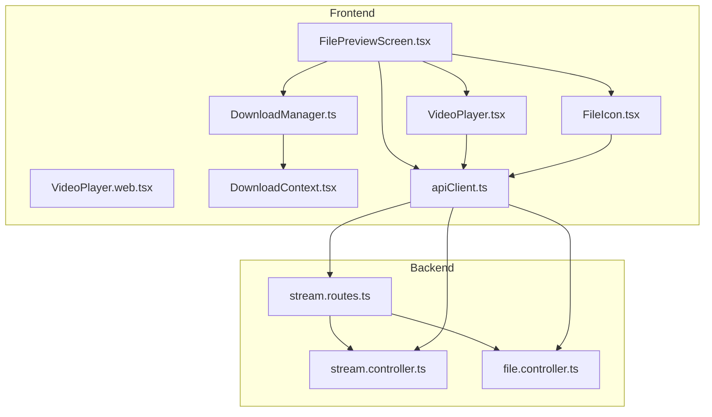
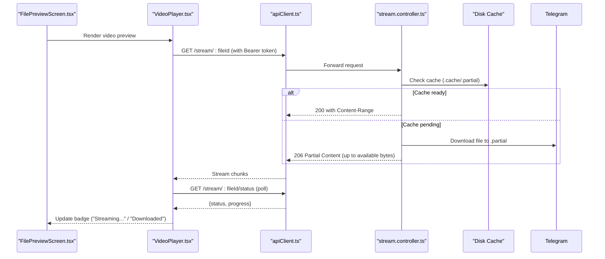
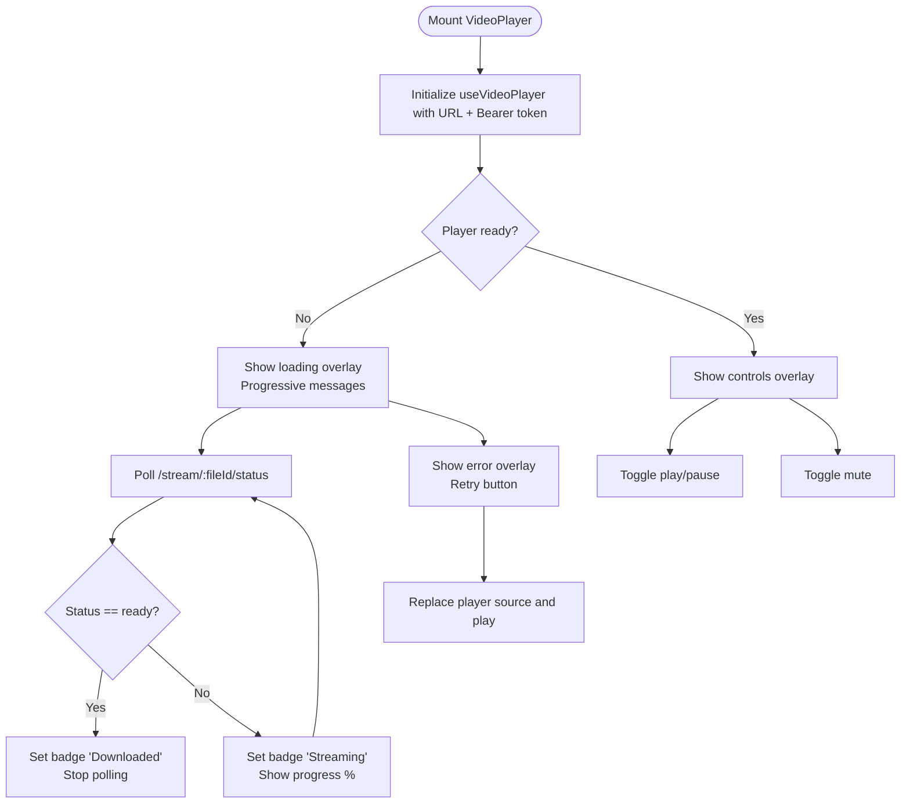
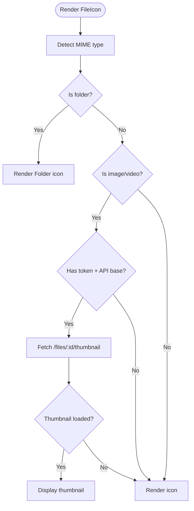
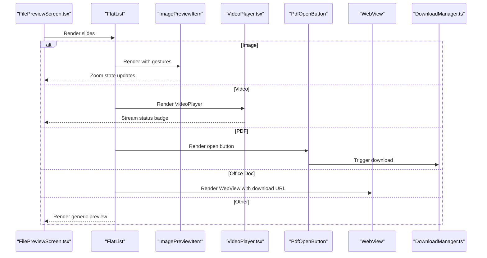
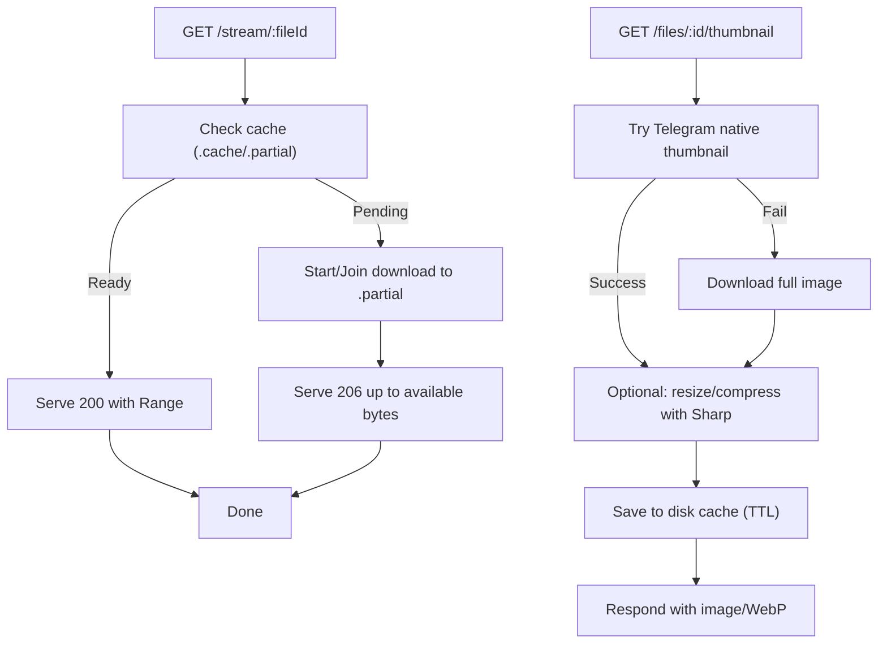
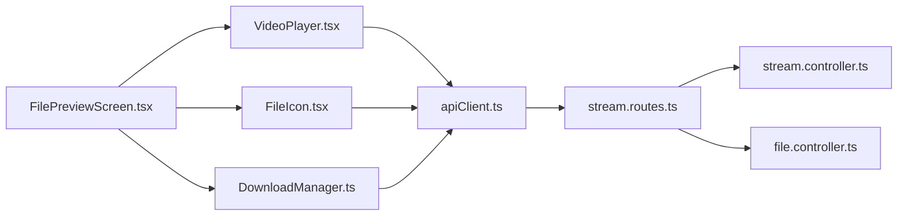

# Media Preview and Playback

<cite>
**Referenced Files in This Document**
- [VideoPlayer.tsx](file://app/src/components/VideoPlayer.tsx)
- [VideoPlayer.web.tsx](file://app/src/components/VideoPlayer.web.tsx)
- [FileIcon.tsx](file://app/src/components/FileIcon.tsx)
- [FilePreviewScreen.tsx](file://app/src/screens/FilePreviewScreen.tsx)
- [DownloadManager.ts](file://app/src/services/DownloadManager.ts)
- [DownloadContext.tsx](file://app/src/context/DownloadContext.tsx)
- [apiClient.ts](file://app/src/services/apiClient.ts)
- [stream.controller.ts](file://server/src/controllers/stream.controller.ts)
- [file.controller.ts](file://server/src/controllers/file.controller.ts)
- [stream.routes.ts](file://server/src/routes/stream.routes.ts)
- [expo-video.web.tsx](file://app/src/mocks/expo-video.web.tsx)
</cite>

## Table of Contents
1. [Introduction](#introduction)
2. [Project Structure](#project-structure)
3. [Core Components](#core-components)
4. [Architecture Overview](#architecture-overview)
5. [Detailed Component Analysis](#detailed-component-analysis)
6. [Dependency Analysis](#dependency-analysis)
7. [Performance Considerations](#performance-considerations)
8. [Troubleshooting Guide](#troubleshooting-guide)
9. [Conclusion](#conclusion)
10. [Appendices](#appendices)

## Introduction
This document explains the media preview and playback system with a focus on:
- Image gallery and thumbnail generation
- Video player integration with streaming and caching
- File type visualization via FileIcon
- Media preview screen implementation
- Thumbnail generation strategies, image optimization, video streaming, and progressive loading
- Cross-platform considerations, offline playback, and integration with the download system
- Guidelines for extending media support and optimizing performance

## Project Structure
The media preview system spans frontend components and backend controllers:
- Frontend: VideoPlayer, FileIcon, FilePreviewScreen, DownloadManager, DownloadContext, apiClient
- Backend: Stream controller for video caching and range-based streaming, file controller for thumbnails, and stream routes

**Diagram sources**
- [FilePreviewScreen.tsx](file://app/src/screens/FilePreviewScreen.tsx#L314-L755)
- [VideoPlayer.tsx](file://app/src/components/VideoPlayer.tsx#L28-L241)
- [VideoPlayer.web.tsx](file://app/src/components/VideoPlayer.web.tsx#L4-L15)
- [FileIcon.tsx](file://app/src/components/FileIcon.tsx#L16-L47)
- [DownloadManager.ts](file://app/src/services/DownloadManager.ts#L42-L323)
- [DownloadContext.tsx](file://app/src/context/DownloadContext.tsx#L29-L94)
- [apiClient.ts](file://app/src/services/apiClient.ts#L31-L164)
- [stream.routes.ts](file://server/src/routes/stream.routes.ts#L10-L25)
- [stream.controller.ts](file://server/src/controllers/stream.controller.ts#L322-L460)
- [file.controller.ts](file://server/src/controllers/file.controller.ts#L459-L545)

**Section sources**
- [FilePreviewScreen.tsx](file://app/src/screens/FilePreviewScreen.tsx#L314-L755)
- [VideoPlayer.tsx](file://app/src/components/VideoPlayer.tsx#L28-L241)
- [FileIcon.tsx](file://app/src/components/FileIcon.tsx#L16-L47)
- [DownloadManager.ts](file://app/src/services/DownloadManager.ts#L42-L323)
- [DownloadContext.tsx](file://app/src/context/DownloadContext.tsx#L29-L94)
- [apiClient.ts](file://app/src/services/apiClient.ts#L31-L164)
- [stream.routes.ts](file://server/src/routes/stream.routes.ts#L10-L25)
- [stream.controller.ts](file://server/src/controllers/stream.controller.ts#L322-L460)
- [file.controller.ts](file://server/src/controllers/file.controller.ts#L459-L545)

## Core Components
- VideoPlayer: Native video playback with streaming badges, progressive loading messages, retry logic, and overlay controls.
- FileIcon: File type visualization with dynamic icon selection and thumbnail fallback.
- FilePreviewScreen: Full-screen media preview with image gallery, pinch-to-zoom, PDF open flow, and document previews.
- DownloadManager: Centralized download queue with progress tracking, notifications, and concurrency limits.
- DownloadContext: React provider wrapping DownloadManager for global state.
- apiClient: Axios client with JWT injection, request logging, and retry logic.
- Backend stream controller: Range-based streaming, disk caching, and status polling.
- Backend file controller: Thumbnail generation with Telegram native thumbnails and Sharp optimization.

**Section sources**
- [VideoPlayer.tsx](file://app/src/components/VideoPlayer.tsx#L28-L241)
- [FileIcon.tsx](file://app/src/components/FileIcon.tsx#L16-L47)
- [FilePreviewScreen.tsx](file://app/src/screens/FilePreviewScreen.tsx#L314-L755)
- [DownloadManager.ts](file://app/src/services/DownloadManager.ts#L42-L323)
- [DownloadContext.tsx](file://app/src/context/DownloadContext.tsx#L29-L94)
- [apiClient.ts](file://app/src/services/apiClient.ts#L31-L164)
- [stream.controller.ts](file://server/src/controllers/stream.controller.ts#L322-L460)
- [file.controller.ts](file://server/src/controllers/file.controller.ts#L459-L545)

## Architecture Overview
The system integrates frontend components with backend streaming and caching:
- Frontend requests media via JWT-protected URLs.
- Backend caches full files on disk and serves HTTP Range requests.
- Frontend polls cache status to display “Streaming…” or “Downloaded” badges.
- Thumbnails are generated on-demand and cached with immutable headers.

**Diagram sources**
- [FilePreviewScreen.tsx](file://app/src/screens/FilePreviewScreen.tsx#L482-L489)
- [VideoPlayer.tsx](file://app/src/components/VideoPlayer.tsx#L53-L88)
- [apiClient.ts](file://app/src/services/apiClient.ts#L31-L164)
- [stream.controller.ts](file://server/src/controllers/stream.controller.ts#L322-L460)

## Detailed Component Analysis

### VideoPlayer Component
Implements a native video player with:
- Streaming via Range requests with Authorization header
- Badge indicators for “Streaming…” and “Downloaded”
- Progressive loading messages timed with timeouts
- Error overlay with retry
- Overlay controls for play/pause and mute

**Diagram sources**
- [VideoPlayer.tsx](file://app/src/components/VideoPlayer.tsx#L28-L159)

**Section sources**
- [VideoPlayer.tsx](file://app/src/components/VideoPlayer.tsx#L28-L241)

### FileIcon Component
Provides file type visualization:
- Selects icon and background based on MIME type
- Uses thumbnail URL for media items when available
- Falls back to icon rendering if thumbnail fails or unavailable

**Diagram sources**
- [FileIcon.tsx](file://app/src/components/FileIcon.tsx#L16-L47)

**Section sources**
- [FileIcon.tsx](file://app/src/components/FileIcon.tsx#L16-L47)

### FilePreviewScreen
Full-screen media preview with:
- Horizontal gallery using FlatList with paging
- ImagePreviewItem with pinch-to-zoom, pan, and double-tap reset
- PDF open flow using local download and system intents
- Document preview via WebView for office documents
- Generic preview fallback for unsupported types
- Integration with DownloadManager and share actions

**Diagram sources**
- [FilePreviewScreen.tsx](file://app/src/screens/FilePreviewScreen.tsx#L459-L536)
- [FilePreviewScreen.tsx](file://app/src/screens/FilePreviewScreen.tsx#L50-L205)
- [FilePreviewScreen.tsx](file://app/src/screens/FilePreviewScreen.tsx#L211-L309)
- [VideoPlayer.tsx](file://app/src/components/VideoPlayer.tsx#L28-L241)
- [DownloadManager.ts](file://app/src/services/DownloadManager.ts#L153-L174)

**Section sources**
- [FilePreviewScreen.tsx](file://app/src/screens/FilePreviewScreen.tsx#L314-L755)

### Backend Streaming and Thumbnail Generation
Backend responsibilities:
- Stream controller: Range-based streaming, disk caching, progress tracking, and status polling
- File controller: Thumbnail extraction from Telegram, Sharp optimization, disk caching with TTL and immutable headers

**Diagram sources**
- [stream.controller.ts](file://server/src/controllers/stream.controller.ts#L322-L460)
- [file.controller.ts](file://server/src/controllers/file.controller.ts#L459-L545)

**Section sources**
- [stream.controller.ts](file://server/src/controllers/stream.controller.ts#L322-L460)
- [file.controller.ts](file://server/src/controllers/file.controller.ts#L459-L545)

## Dependency Analysis
Frontend-to-backend dependencies and interactions:
- FilePreviewScreen renders appropriate preview based on MIME type
- VideoPlayer streams via /stream/:fileId with Authorization header
- FileIcon fetches thumbnails via /files/:id/thumbnail
- DownloadManager coordinates downloads and shares via system APIs
- apiClient injects JWT and handles retries

**Diagram sources**
- [FilePreviewScreen.tsx](file://app/src/screens/FilePreviewScreen.tsx#L459-L536)
- [VideoPlayer.tsx](file://app/src/components/VideoPlayer.tsx#L28-L241)
- [FileIcon.tsx](file://app/src/components/FileIcon.tsx#L16-L47)
- [DownloadManager.ts](file://app/src/services/DownloadManager.ts#L153-L174)
- [apiClient.ts](file://app/src/services/apiClient.ts#L31-L164)
- [stream.routes.ts](file://server/src/routes/stream.routes.ts#L10-L25)
- [stream.controller.ts](file://server/src/controllers/stream.controller.ts#L322-L460)
- [file.controller.ts](file://server/src/controllers/file.controller.ts#L459-L545)

**Section sources**
- [FilePreviewScreen.tsx](file://app/src/screens/FilePreviewScreen.tsx#L459-L536)
- [VideoPlayer.tsx](file://app/src/components/VideoPlayer.tsx#L28-L241)
- [FileIcon.tsx](file://app/src/components/FileIcon.tsx#L16-L47)
- [DownloadManager.ts](file://app/src/services/DownloadManager.ts#L153-L174)
- [apiClient.ts](file://app/src/services/apiClient.ts#L31-L164)
- [stream.routes.ts](file://server/src/routes/stream.routes.ts#L10-L25)
- [stream.controller.ts](file://server/src/controllers/stream.controller.ts#L322-L460)
- [file.controller.ts](file://server/src/controllers/file.controller.ts#L459-L545)

## Performance Considerations
- Progressive streaming with Range requests and partial file serving reduces startup latency and improves reliability on mobile players.
- Disk caching minimizes repeated downloads and accelerates subsequent plays.
- Thumbnail generation uses Sharp to produce optimized WebP images with TTL caching.
- Frontend uses gesture-based zoom with animated transforms and disables conflicting gestures when unzoomed to preserve list scrolling.
- DownloadManager caps concurrent downloads and provides progress notifications.
- apiClient applies exponential backoff and request timers to improve resilience.

[No sources needed since this section provides general guidance]

## Troubleshooting Guide
Common issues and remedies:
- Video fails to load: Verify JWT token presence and Authorization header propagation; use retry mechanism in VideoPlayer.
- Thumbnail not showing: Confirm token and API base; fallback to icon rendering; check backend thumbnail endpoint availability.
- Download stuck: Check DownloadManager progress and cancel/resume; ensure network connectivity and storage permissions.
- Streaming lag: Expect initial download to cache; monitor status endpoint; large files may take time to prepare.

**Section sources**
- [VideoPlayer.tsx](file://app/src/components/VideoPlayer.tsx#L118-L131)
- [FileIcon.tsx](file://app/src/components/FileIcon.tsx#L30-L41)
- [DownloadManager.ts](file://app/src/services/DownloadManager.ts#L233-L264)
- [stream.controller.ts](file://server/src/controllers/stream.controller.ts#L376-L402)

## Conclusion
The media preview and playback system combines robust backend streaming and caching with responsive frontend components. It supports image galleries with gesture-based zoom, video playback with streaming badges, and specialized flows for PDFs and office documents. Backend optimizations ensure efficient thumbnail generation and reliable progressive streaming, while the download system enables offline access and sharing.

[No sources needed since this section summarizes without analyzing specific files]

## Appendices

### Cross-Platform Media Compatibility
- Native video playback is supported on mobile via expo-video; web stubs prevent bundling errors and display a helpful message.
- For web, VideoPlayer.web.tsx and expo-video.web.tsx provide non-functional placeholders to maintain build stability.

**Section sources**
- [VideoPlayer.web.tsx](file://app/src/components/VideoPlayer.web.tsx#L4-L15)
- [expo-video.web.tsx](file://app/src/mocks/expo-video.web.tsx#L1-L23)

### Offline Playback Considerations
- Video playback uses a download-first strategy; once cached, subsequent plays are instant and independent of Telegram.
- Thumbnails are cached on disk with immutable headers for fast retrieval.

**Section sources**
- [stream.controller.ts](file://server/src/controllers/stream.controller.ts#L178-L264)
- [file.controller.ts](file://server/src/controllers/file.controller.ts#L459-L545)

### Extending Media Support
- Add MIME-type checks in FilePreviewScreen to route to new preview components.
- Integrate additional backend endpoints for specialized previews (e.g., audio waveforms).
- Extend FileIcon to support new file categories with dedicated icons and fallbacks.

**Section sources**
- [FilePreviewScreen.tsx](file://app/src/screens/FilePreviewScreen.tsx#L459-L536)
- [FileIcon.tsx](file://app/src/components/FileIcon.tsx#L6-L14)

### Performance Optimization Guidelines
- Prefer disk caching for large media; avoid frequent re-downloads.
- Use progressive loading overlays and status polling to inform users during initial cache builds.
- Limit concurrent downloads and provide user feedback via notifications.
- Optimize thumbnails with appropriate sizing and WebP compression.

**Section sources**
- [DownloadManager.ts](file://app/src/services/DownloadManager.ts#L45-L47)
- [DownloadManager.ts](file://app/src/services/DownloadManager.ts#L233-L264)
- [file.controller.ts](file://server/src/controllers/file.controller.ts#L513-L530)