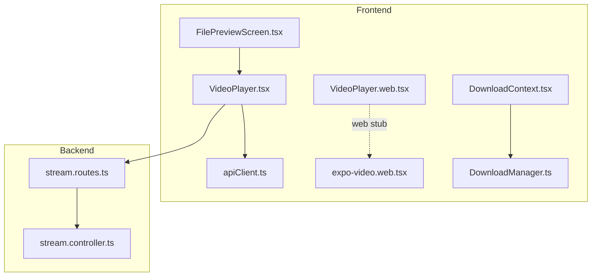
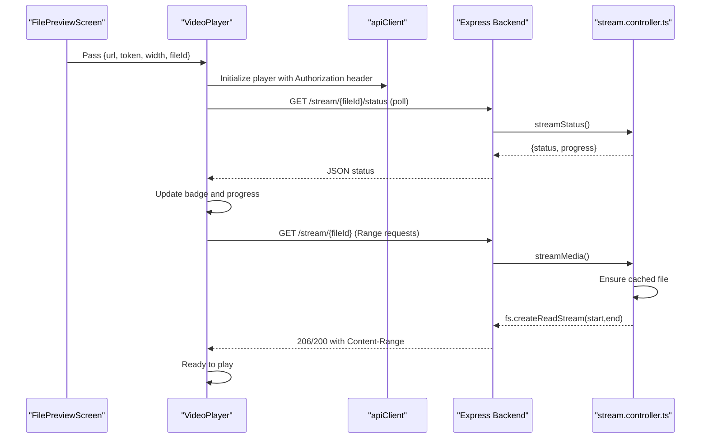
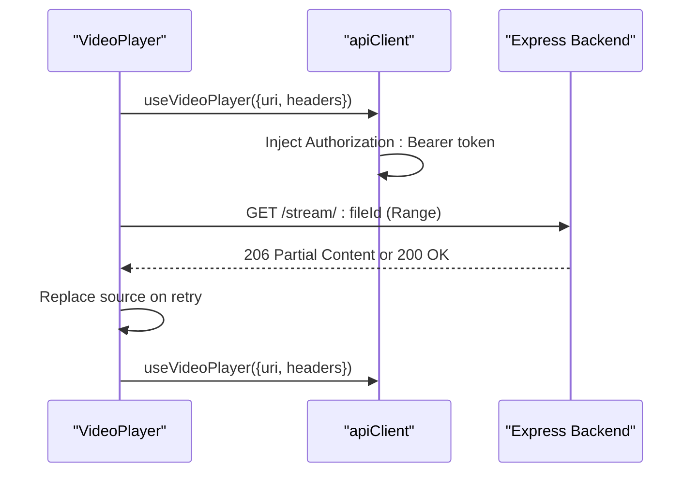
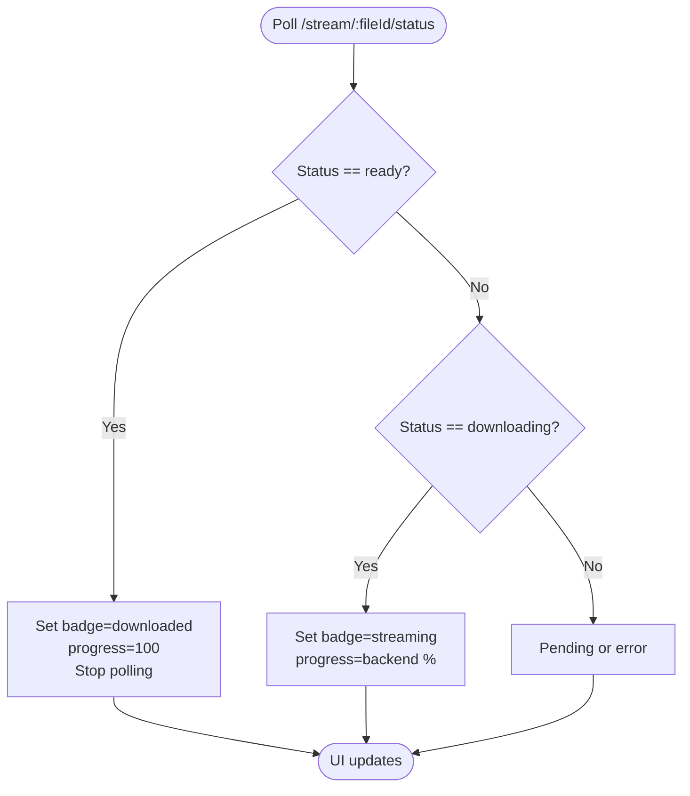
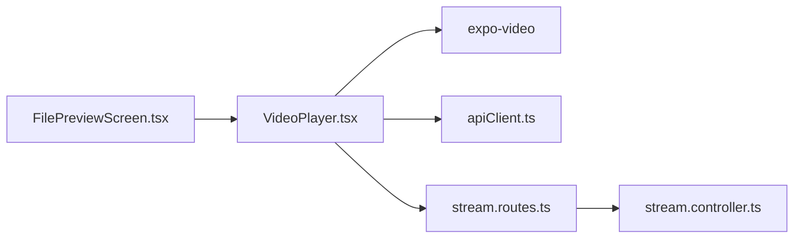

# Video Player Component

<cite>
**Referenced Files in This Document**
- [VideoPlayer.tsx](file://app/src/components/VideoPlayer.tsx)
- [VideoPlayer.web.tsx](file://app/src/components/VideoPlayer.web.tsx)
- [expo-video.web.tsx](file://app/src/mocks/expo-video.web.tsx)
- [DownloadContext.tsx](file://app/src/context/DownloadContext.tsx)
- [DownloadManager.ts](file://app/src/services/DownloadManager.ts)
- [apiClient.ts](file://app/src/services/apiClient.ts)
- [FilePreviewScreen.tsx](file://app/src/screens/FilePreviewScreen.tsx)
- [stream.routes.ts](file://server/src/routes/stream.routes.ts)
- [stream.controller.ts](file://server/src/controllers/stream.controller.ts)
- [retry.ts](file://app/src/utils/retry.ts)
</cite>

## Table of Contents
1. [Introduction](#introduction)
2. [Project Structure](#project-structure)
3. [Core Components](#core-components)
4. [Architecture Overview](#architecture-overview)
5. [Detailed Component Analysis](#detailed-component-analysis)
6. [Dependency Analysis](#dependency-analysis)
7. [Performance Considerations](#performance-considerations)
8. [Troubleshooting Guide](#troubleshooting-guide)
9. [Conclusion](#conclusion)

## Introduction
This document explains the VideoPlayer component implementation that powers production video playback with streaming capabilities. It integrates expo-video with authentication headers for Range-based streaming, displays streaming/download status badges, manages progressive loading overlays, and provides smooth controls with retry functionality. The backend enforces a download-first caching strategy with HTTP Range support to reliably serve mobile players.

## Project Structure
The video player spans frontend and backend layers:
- Frontend: React Native component with expo-video, platform-specific web stubs, and integration with the download system
- Backend: Express routes and controllers that manage file ownership, background downloads, cache lifecycle, and HTTP Range responses

**Diagram sources**
- [VideoPlayer.tsx](file://app/src/components/VideoPlayer.tsx#L1-L353)
- [VideoPlayer.web.tsx](file://app/src/components/VideoPlayer.web.tsx#L1-L32)
- [expo-video.web.tsx](file://app/src/mocks/expo-video.web.tsx#L1-L23)
- [DownloadContext.tsx](file://app/src/context/DownloadContext.tsx#L1-L94)
- [DownloadManager.ts](file://app/src/services/DownloadManager.ts#L1-L323)
- [apiClient.ts](file://app/src/services/apiClient.ts#L1-L164)
- [FilePreviewScreen.tsx](file://app/src/screens/FilePreviewScreen.tsx#L1-L755)
- [stream.routes.ts](file://server/src/routes/stream.routes.ts#L1-L25)
- [stream.controller.ts](file://server/src/controllers/stream.controller.ts#L1-L460)

**Section sources**
- [VideoPlayer.tsx](file://app/src/components/VideoPlayer.tsx#L1-L353)
- [VideoPlayer.web.tsx](file://app/src/components/VideoPlayer.web.tsx#L1-L32)
- [expo-video.web.tsx](file://app/src/mocks/expo-video.web.tsx#L1-L23)
- [DownloadContext.tsx](file://app/src/context/DownloadContext.tsx#L1-L94)
- [DownloadManager.ts](file://app/src/services/DownloadManager.ts#L1-L323)
- [apiClient.ts](file://app/src/services/apiClient.ts#L1-L164)
- [FilePreviewScreen.tsx](file://app/src/screens/FilePreviewScreen.tsx#L1-L755)
- [stream.routes.ts](file://server/src/routes/stream.routes.ts#L1-L25)
- [stream.controller.ts](file://server/src/controllers/stream.controller.ts#L1-L460)

## Core Components
- VideoPlayer (React Native): Manages player lifecycle, loading states, error handling, streaming badge, and controls overlay
- VideoPlayer.web: Provides a non-functional placeholder on web with platform-specific messaging
- DownloadContext and DownloadManager: Provide global download task state and progress for derived UI
- apiClient: Injects Authorization headers and handles retries for backend requests
- FilePreviewScreen: Integrates VideoPlayer into the file preview carousel and passes streaming status polling

**Section sources**
- [VideoPlayer.tsx](file://app/src/components/VideoPlayer.tsx#L18-L24)
- [VideoPlayer.web.tsx](file://app/src/components/VideoPlayer.web.tsx#L4-L15)
- [DownloadContext.tsx](file://app/src/context/DownloadContext.tsx#L11-L25)
- [DownloadManager.ts](file://app/src/services/DownloadManager.ts#L20-L38)
- [apiClient.ts](file://app/src/services/apiClient.ts#L46-L55)
- [FilePreviewScreen.tsx](file://app/src/screens/FilePreviewScreen.tsx#L482-L489)

## Architecture Overview
The streaming pipeline combines frontend and backend:
- Frontend initializes a player with an authenticated URL and optional file ID for status polling
- Backend validates ownership, ensures a cached copy exists, and serves HTTP Range requests
- The frontend polls the backend for cache status to show “Streaming…” or “Downloaded” badges
- Progressive loading messages guide the user during initial cache builds

**Diagram sources**
- [FilePreviewScreen.tsx](file://app/src/screens/FilePreviewScreen.tsx#L482-L489)
- [VideoPlayer.tsx](file://app/src/components/VideoPlayer.tsx#L39-L46)
- [apiClient.ts](file://app/src/services/apiClient.ts#L46-L55)
- [stream.routes.ts](file://server/src/routes/stream.routes.ts#L19-L23)
- [stream.controller.ts](file://server/src/controllers/stream.controller.ts#L268-L318)
- [stream.controller.ts](file://server/src/controllers/stream.controller.ts#L322-L459)

## Detailed Component Analysis

### Props Interface and State Management
- Props:
  - url: Streaming URL
  - token: Bearer token for Authorization header
  - width: Container width (controls aspect ratio)
  - fileId: Optional file ID for cache status polling
  - onError: Callback invoked on player load errors
- Internal state:
  - loading: Tracks initial preparation and network latency
  - loadError: Stores error message for overlay
  - loadingMsg: Progressive messages shown during long loads
  - muted: Audio muting state
  - isPlaying: Playback state
  - streamBadge: Badge type (“none”, “streaming”, “downloaded”)
  - downloadProgress: Percent cached for progress overlay

**Section sources**
- [VideoPlayer.tsx](file://app/src/components/VideoPlayer.tsx#L18-L36)

### Authentication Headers and Range-based Streaming
- The player initializes with an authenticated source and automatically applies Authorization headers
- Backend enforces JWT-protected routes and parses HTTP Range requests to serve partial content
- The frontend retries playback by replacing the player source with the same URL and headers

**Diagram sources**
- [VideoPlayer.tsx](file://app/src/components/VideoPlayer.tsx#L39-L46)
- [VideoPlayer.tsx](file://app/src/components/VideoPlayer.tsx#L153-L159)
- [apiClient.ts](file://app/src/services/apiClient.ts#L46-L55)
- [stream.routes.ts](file://server/src/routes/stream.routes.ts#L22-L23)
- [stream.controller.ts](file://server/src/controllers/stream.controller.ts#L361-L412)

**Section sources**
- [VideoPlayer.tsx](file://app/src/components/VideoPlayer.tsx#L39-L46)
- [VideoPlayer.tsx](file://app/src/components/VideoPlayer.tsx#L153-L159)
- [apiClient.ts](file://app/src/services/apiClient.ts#L46-L55)
- [stream.controller.ts](file://server/src/controllers/stream.controller.ts#L361-L412)

### Streaming Badge and Progress Tracking
- Badge types:
  - none: No badge shown
  - streaming: Caching in progress with percent cached
  - downloaded: Fully cached and ready
- Progress overlay shows percent cached when available
- Polling interval: Every 2 seconds while streaming

**Diagram sources**
- [VideoPlayer.tsx](file://app/src/components/VideoPlayer.tsx#L48-L88)
- [stream.controller.ts](file://server/src/controllers/stream.controller.ts#L268-L318)

**Section sources**
- [VideoPlayer.tsx](file://app/src/components/VideoPlayer.tsx#L48-L88)
- [VideoPlayer.tsx](file://app/src/components/VideoPlayer.tsx#L195-L217)
- [stream.controller.ts](file://server/src/controllers/stream.controller.ts#L268-L318)

### Progressive Loading Messages
- Three staged messages appear after specific delays to inform users during long initial loads
- Timers are cleared on unmount to prevent leaks

**Section sources**
- [VideoPlayer.tsx](file://app/src/components/VideoPlayer.tsx#L90-L111)

### Error Handling and Retry Mechanism
- On player status error, the component sets an error overlay with a retry button
- Retry replaces the player source with the same URL and headers, then resumes playback
- The parent screen receives an onError callback to surface user-facing messages

**Section sources**
- [VideoPlayer.tsx](file://app/src/components/VideoPlayer.tsx#L113-L131)
- [VideoPlayer.tsx](file://app/src/components/VideoPlayer.tsx#L153-L159)
- [FilePreviewScreen.tsx](file://app/src/screens/FilePreviewScreen.tsx#L485-L487)

### Controls Overlay
- Top row: Stream badge and mute toggle
- Center row: Play/Pause button
- Bottom row: Placeholder for future controls
- Smooth overlay with rounded buttons and translucent backgrounds

**Section sources**
- [VideoPlayer.tsx](file://app/src/components/VideoPlayer.tsx#L195-L239)
- [VideoPlayer.tsx](file://app/src/components/VideoPlayer.tsx#L243-L352)

### Platform-Specific Considerations
- iOS and Android:
  - Uses native controls and content fit for optimal playback
  - Handles pointer events for overlay visibility
- Web:
  - Video playback is not supported; a non-functional placeholder is shown
  - A web stub for expo-video prevents bundler crashes

**Section sources**
- [VideoPlayer.tsx](file://app/src/components/VideoPlayer.tsx#L162-L169)
- [VideoPlayer.web.tsx](file://app/src/components/VideoPlayer.web.tsx#L4-L15)
- [expo-video.web.tsx](file://app/src/mocks/expo-video.web.tsx#L7-L17)

### Integration with Download System
- The frontend’s download context and manager provide a global view of queued and active downloads
- While the video player focuses on streaming, the download system complements offline availability
- The player’s polling uses the backend’s cache status rather than the download manager’s internal state

**Section sources**
- [DownloadContext.tsx](file://app/src/context/DownloadContext.tsx#L11-L25)
- [DownloadManager.ts](file://app/src/services/DownloadManager.ts#L20-L38)
- [VideoPlayer.tsx](file://app/src/components/VideoPlayer.tsx#L48-L88)

## Dependency Analysis
The VideoPlayer depends on:
- expo-video for playback
- apiClient for Authorization header injection
- Backend routes/controllers for streaming and status
- Parent screen for passing URL, token, and file ID

**Diagram sources**
- [VideoPlayer.tsx](file://app/src/components/VideoPlayer.tsx#L12-L16)
- [apiClient.ts](file://app/src/services/apiClient.ts#L46-L55)
- [stream.routes.ts](file://server/src/routes/stream.routes.ts#L10-L23)
- [stream.controller.ts](file://server/src/controllers/stream.controller.ts#L29-L36)
- [FilePreviewScreen.tsx](file://app/src/screens/FilePreviewScreen.tsx#L482-L489)

**Section sources**
- [VideoPlayer.tsx](file://app/src/components/VideoPlayer.tsx#L12-L16)
- [apiClient.ts](file://app/src/services/apiClient.ts#L46-L55)
- [stream.routes.ts](file://server/src/routes/stream.routes.ts#L10-L23)
- [stream.controller.ts](file://server/src/controllers/stream.controller.ts#L29-L36)
- [FilePreviewScreen.tsx](file://app/src/screens/FilePreviewScreen.tsx#L482-L489)

## Performance Considerations
- Download-first caching:
  - Ensures reliable Range requests and reduces timeouts on mobile players
  - Cache TTL and cleanup reduce disk usage
- Progressive streaming:
  - Waits until sufficient bytes are available to serve a minimal chunk
  - Limits served ranges to available bytes to avoid 416 responses
- Frontend optimizations:
  - Player listeners are cleaned up on unmount
  - Timers are cleared to prevent memory leaks
- Backend safeguards:
  - Ownership cache avoids frequent DB queries
  - Stream read streams are destroyed on client disconnect

**Section sources**
- [stream.controller.ts](file://server/src/controllers/stream.controller.ts#L9-L27)
- [stream.controller.ts](file://server/src/controllers/stream.controller.ts#L376-L402)
- [stream.controller.ts](file://server/src/controllers/stream.controller.ts#L435-L436)
- [VideoPlayer.tsx](file://app/src/components/VideoPlayer.tsx#L90-L111)
- [VideoPlayer.tsx](file://app/src/components/VideoPlayer.tsx#L113-L131)

## Troubleshooting Guide
Common issues and resolutions:
- Video fails to load:
  - Verify Authorization header is present and token is valid
  - Check backend status endpoint for cache readiness
  - Use the retry button to refresh the player source
- Long initial load times:
  - Expect progressive messages indicating “Downloading from Telegram…” and “Still loading…”
  - Allow time for the backend to cache the file
- Streaming badge not updating:
  - Confirm file ID is passed to enable polling
  - Ensure backend status endpoint is reachable and returns expected values
- Web preview limitations:
  - Video playback is intentionally unsupported on web; open on mobile to play

**Section sources**
- [VideoPlayer.tsx](file://app/src/components/VideoPlayer.tsx#L113-L131)
- [VideoPlayer.tsx](file://app/src/components/VideoPlayer.tsx#L153-L159)
- [VideoPlayer.tsx](file://app/src/components/VideoPlayer.tsx#L90-L111)
- [VideoPlayer.web.tsx](file://app/src/components/VideoPlayer.web.tsx#L4-L15)
- [stream.controller.ts](file://server/src/controllers/stream.controller.ts#L268-L318)

## Conclusion
The VideoPlayer component delivers robust, authenticated, and resilient video playback through a download-first caching strategy with HTTP Range support. Its UI communicates progress and status clearly, integrates smoothly with the download system, and provides a consistent experience across platforms. The backend’s ownership caching, concurrent-safe downloads, and graceful error handling ensure reliability for large video files.