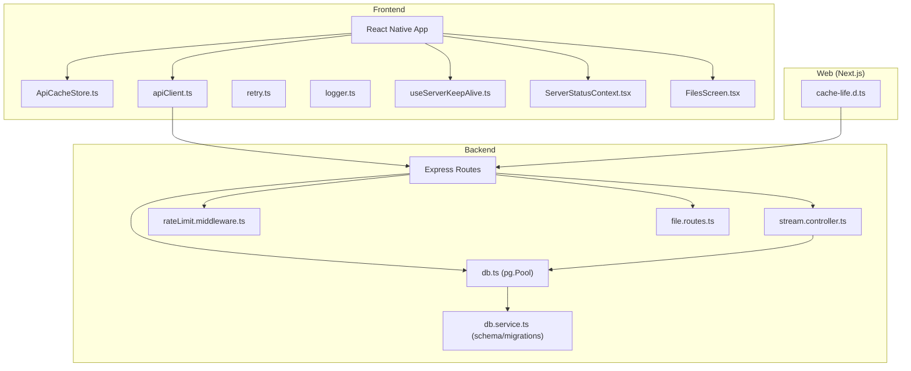
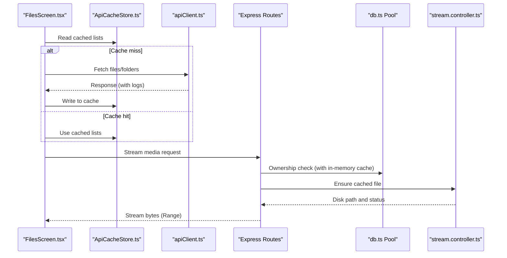
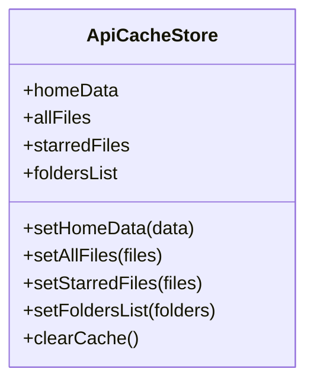
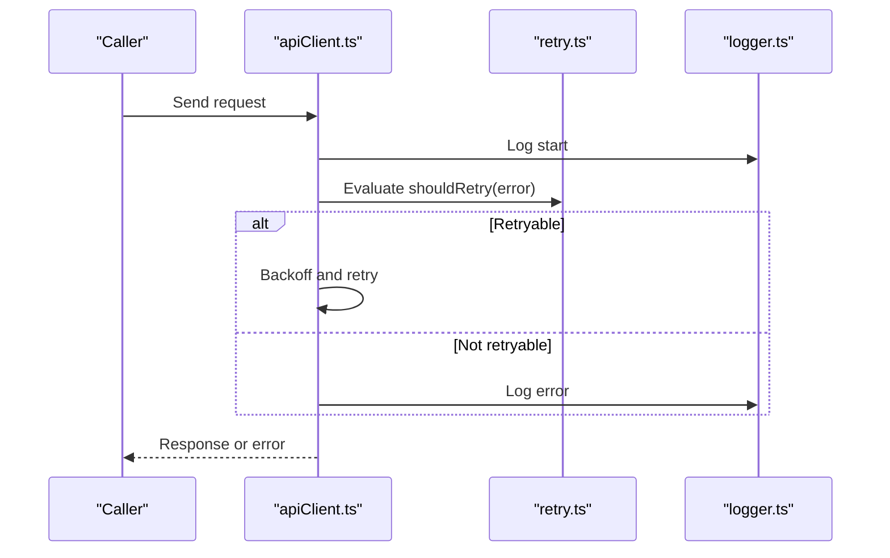
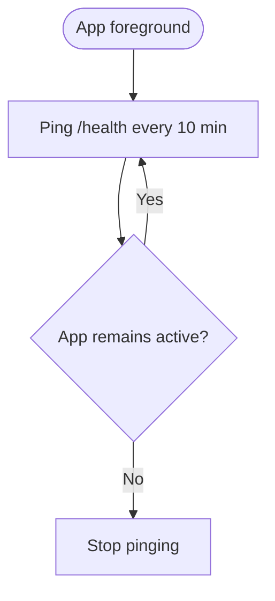
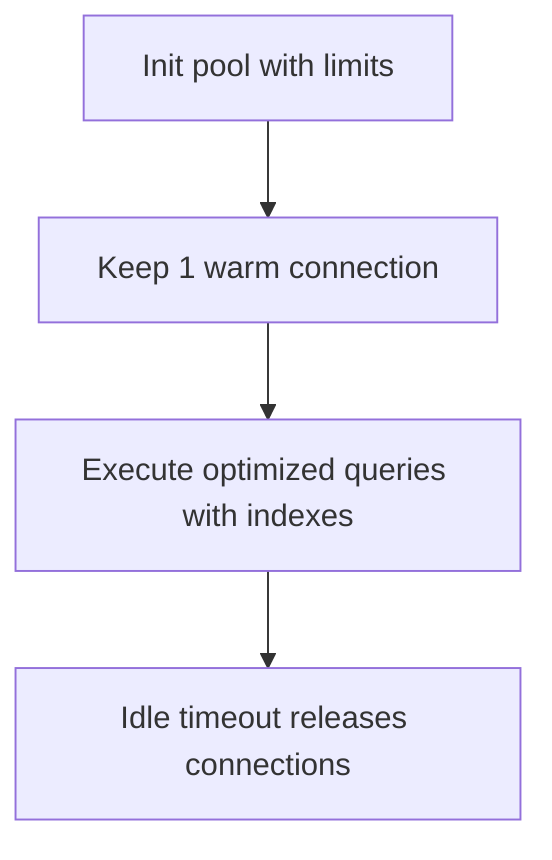
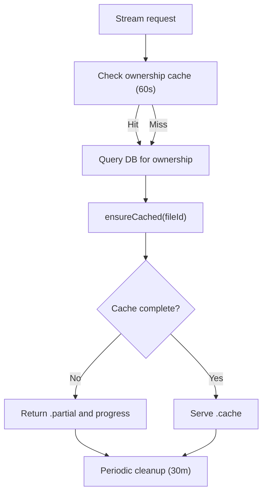
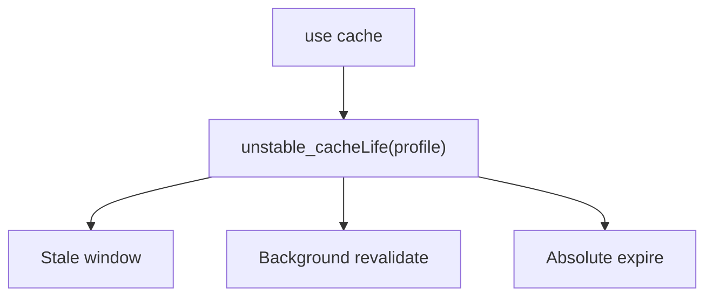
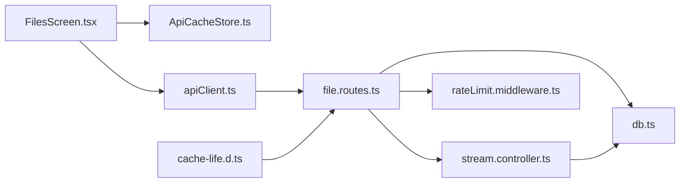

# Caching Strategies and Memory Management

<cite>
**Referenced Files in This Document**
- [ApiCacheStore.ts](file://app/src/context/ApiCacheStore.ts)
- [apiClient.ts](file://app/src/services/apiClient.ts)
- [retry.ts](file://app/src/utils/retry.ts)
- [logger.ts](file://app/src/utils/logger.ts)
- [useServerKeepAlive.ts](file://app/src/hooks/useServerKeepAlive.ts)
- [ServerStatusContext.tsx](file://app/src/context/ServerStatusContext.tsx)
- [FilesScreen.tsx](file://app/src/screens/FilesScreen.tsx)
- [db.ts](file://server/src/config/db.ts)
- [db.service.ts](file://server/src/services/db.service.ts)
- [stream.controller.ts](file://server/src/controllers/stream.controller.ts)
- [rateLimit.middleware.ts](file://server/src/middlewares/rateLimit.middleware.ts)
- [file.routes.ts](file://server/src/routes/file.routes.ts)
- [cache-life.d.ts](file://web/.next/types/cache-life.d.ts)
</cite>

## Table of Contents
1. [Introduction](#introduction)
2. [Project Structure](#project-structure)
3. [Core Components](#core-components)
4. [Architecture Overview](#architecture-overview)
5. [Detailed Component Analysis](#detailed-component-analysis)
6. [Dependency Analysis](#dependency-analysis)
7. [Performance Considerations](#performance-considerations)
8. [Troubleshooting Guide](#troubleshooting-guide)
9. [Conclusion](#conclusion)
10. [Appendices](#appendices)

## Introduction
This document focuses on caching strategies and memory management across the frontend and backend systems. It explains how API response caching is implemented on the client, how database queries are optimized and pooled on the server, and how memory efficiency is achieved through intelligent caching, TTL management, and client-side rendering optimizations. It also covers cache invalidation, coherency, stale data prevention, performance measurement, and practical guidelines for cache sizing and eviction.

## Project Structure
The project is a React Native mobile app with a Next.js web client and a Node.js/Express backend. Caching touches three primary areas:
- Frontend client-side caching and API client behavior
- Server-side database connection pooling and query optimization
- Server-side disk caching for media streaming with TTL and cleanup

**Diagram sources**
- [ApiCacheStore.ts](file://app/src/context/ApiCacheStore.ts#L1-L28)
- [apiClient.ts](file://app/src/services/apiClient.ts#L1-L164)
- [retry.ts](file://app/src/utils/retry.ts#L1-L34)
- [logger.ts](file://app/src/utils/logger.ts#L1-L27)
- [useServerKeepAlive.ts](file://app/src/hooks/useServerKeepAlive.ts#L1-L67)
- [ServerStatusContext.tsx](file://app/src/context/ServerStatusContext.tsx#L1-L52)
- [FilesScreen.tsx](file://app/src/screens/FilesScreen.tsx#L1-L402)
- [db.ts](file://server/src/config/db.ts#L1-L61)
- [db.service.ts](file://server/src/services/db.service.ts#L1-L315)
- [stream.controller.ts](file://server/src/controllers/stream.controller.ts#L1-L460)
- [rateLimit.middleware.ts](file://server/src/middlewares/rateLimit.middleware.ts#L1-L47)
- [file.routes.ts](file://server/src/routes/file.routes.ts#L1-L118)
- [cache-life.d.ts](file://web/.next/types/cache-life.d.ts#L1-L141)

**Section sources**
- [ApiCacheStore.ts](file://app/src/context/ApiCacheStore.ts#L1-L28)
- [apiClient.ts](file://app/src/services/apiClient.ts#L1-L164)
- [db.ts](file://server/src/config/db.ts#L1-L61)
- [stream.controller.ts](file://server/src/controllers/stream.controller.ts#L1-L460)
- [cache-life.d.ts](file://web/.next/types/cache-life.d.ts#L1-L141)

## Core Components
- Client-side API cache store: Provides a Zustand store for selected lists and dashboard data to reduce redundant network calls and improve perceived performance.
- API client: Centralized Axios client with request/response interceptors, retry logic, and server wake UI signaling.
- Database connection pooling: PostgreSQL pool configured for low memory footprint and fast recovery on Render’s free tier.
- Streaming cache: Disk-backed cache for media with TTL, progress tracking, and cleanup.
- Web cache lifecycle: Next.js cache profiles and expiration controls for server-rendered content.

**Section sources**
- [ApiCacheStore.ts](file://app/src/context/ApiCacheStore.ts#L1-L28)
- [apiClient.ts](file://app/src/services/apiClient.ts#L1-L164)
- [db.ts](file://server/src/config/db.ts#L22-L37)
- [stream.controller.ts](file://server/src/controllers/stream.controller.ts#L38-L460)
- [cache-life.d.ts](file://web/.next/types/cache-life.d.ts#L1-L141)

## Architecture Overview
The system integrates client-side and server-side caching to minimize latency and resource usage. On the client, the API cache store holds frequently accessed lists. On the server, database pools and streaming caches reduce cold starts and repeated downloads. Rate limiting protects shared resources, and Next.js cache profiles govern server-side caching behavior.

**Diagram sources**
- [FilesScreen.tsx](file://app/src/screens/FilesScreen.tsx#L88-L100)
- [ApiCacheStore.ts](file://app/src/context/ApiCacheStore.ts#L16-L27)
- [apiClient.ts](file://app/src/services/apiClient.ts#L84-L132)
- [db.ts](file://server/src/config/db.ts#L27-L37)
- [stream.controller.ts](file://server/src/controllers/stream.controller.ts#L320-L460)

## Detailed Component Analysis

### Client-Side API Cache Store (ApiCacheStore)
- Purpose: Holds dashboard/home data and lists (all files, starred, folders) to avoid repeated network calls and to stabilize UI during navigation.
- Data model: Four top-level keys for structured caching plus setters and a clear-cache function.
- Usage pattern: Screens read from the store first; on refresh or navigation, they populate the store with fresh data.

**Diagram sources**
- [ApiCacheStore.ts](file://app/src/context/ApiCacheStore.ts#L3-L27)

**Section sources**
- [ApiCacheStore.ts](file://app/src/context/ApiCacheStore.ts#L1-L28)

### API Client and Retry Behavior
- Interceptors: Inject auth tokens, log request lifecycle, and show server wake UI after a delay.
- Retry policy: Exponential backoff for transient failures (network errors, 5xx, 408) with capped retries.
- Logging: Structured logs for success and error paths, including duration and request IDs.

**Diagram sources**
- [apiClient.ts](file://app/src/services/apiClient.ts#L46-L132)
- [retry.ts](file://app/src/utils/retry.ts#L14-L33)
- [logger.ts](file://app/src/utils/logger.ts#L10-L25)

**Section sources**
- [apiClient.ts](file://app/src/services/apiClient.ts#L1-L164)
- [retry.ts](file://app/src/utils/retry.ts#L1-L34)
- [logger.ts](file://app/src/utils/logger.ts#L1-L27)

### Server Keep-Alive and Cold Start Mitigation
- Keeps the backend alive by pinging the health endpoint periodically when the app is active.
- Prevents Render free-tier sleep-induced delays by maintaining a warm connection.

**Diagram sources**
- [useServerKeepAlive.ts](file://app/src/hooks/useServerKeepAlive.ts#L14-L42)

**Section sources**
- [useServerKeepAlive.ts](file://app/src/hooks/useServerKeepAlive.ts#L1-L67)

### Database Connection Pooling and Query Optimization
- Pool configuration: Limited max connections, short idle timeouts, and warm connection kept to avoid cold starts.
- Schema and indexes: Extensive indexing for common queries (user+folder, starred, trashed, sorting, tagging).
- Migrations: Idempotent schema creation and integrity checks for constraints and triggers.

**Diagram sources**
- [db.ts](file://server/src/config/db.ts#L27-L37)
- [db.service.ts](file://server/src/services/db.service.ts#L134-L264)

**Section sources**
- [db.ts](file://server/src/config/db.ts#L1-L61)
- [db.service.ts](file://server/src/services/db.service.ts#L1-L315)

### Streaming Cache with TTL and Cleanup
- Disk cache: Downloads full media to disk, then serves via Range requests.
- Ownership cache: In-memory cache (60s TTL) to avoid frequent DB checks for status polling.
- TTL and cleanup: Cache expires after 1 hour; periodic cleanup removes stale files and progress entries.
- Concurrency: Download locks prevent duplicate downloads for the same file ID.

**Diagram sources**
- [stream.controller.ts](file://server/src/controllers/stream.controller.ts#L58-L121)
- [stream.controller.ts](file://server/src/controllers/stream.controller.ts#L180-L264)
- [stream.controller.ts](file://server/src/controllers/stream.controller.ts#L159-L176)

**Section sources**
- [stream.controller.ts](file://server/src/controllers/stream.controller.ts#L1-L460)

### Next.js Server Cache Lifecycle (Profiles and Expiration)
- Profiles define stale, revalidation, and expire windows for server caching.
- Controls cache behavior similar to Cache-Control semantics for server-rendered content.

**Diagram sources**
- [cache-life.d.ts](file://web/.next/types/cache-life.d.ts#L14-L141)

**Section sources**
- [cache-life.d.ts](file://web/.next/types/cache-life.d.ts#L1-L141)

### Intelligent Cache Warming and Memory Efficiency
- Client-side: Files screen loads a large batch and paginates locally to reduce network overhead and UI jank.
- Server-side: Ownership cache warms frequently accessed ownership checks; disk cache reduces repeated Telegram downloads.
- Memory pressure handling: Short TTLs and periodic cleanup ensure disk and memory caches do not accumulate indefinitely.

**Section sources**
- [FilesScreen.tsx](file://app/src/screens/FilesScreen.tsx#L65-L100)
- [stream.controller.ts](file://server/src/controllers/stream.controller.ts#L46-L121)

## Dependency Analysis
- Frontend depends on the API client for all network calls and on the cache store for UI stability.
- Backend routes depend on the database pool and streaming controller for media delivery.
- Rate limiting middleware protects shared endpoints from abuse.
- Next.js cache lifecycle types influence server-side caching behavior.

**Diagram sources**
- [FilesScreen.tsx](file://app/src/screens/FilesScreen.tsx#L88-L100)
- [ApiCacheStore.ts](file://app/src/context/ApiCacheStore.ts#L16-L27)
- [apiClient.ts](file://app/src/services/apiClient.ts#L84-L132)
- [file.routes.ts](file://server/src/routes/file.routes.ts#L1-L118)
- [db.ts](file://server/src/config/db.ts#L27-L37)
- [stream.controller.ts](file://server/src/controllers/stream.controller.ts#L320-L460)
- [rateLimit.middleware.ts](file://server/src/middlewares/rateLimit.middleware.ts#L1-L47)
- [cache-life.d.ts](file://web/.next/types/cache-life.d.ts#L1-L141)

**Section sources**
- [file.routes.ts](file://server/src/routes/file.routes.ts#L1-L118)
- [rateLimit.middleware.ts](file://server/src/middlewares/rateLimit.middleware.ts#L1-L47)

## Performance Considerations
- Client-side:
  - Use the cache store to avoid redundant network calls for dashboard and list data.
  - Apply exponential backoff and capped retries to reduce wasted bandwidth and server load.
  - Paginate and filter client-side to minimize server round trips.
- Server-side:
  - Keep a small, warm pool to avoid cold starts on Render.
  - Use targeted indexes to accelerate common queries.
  - Stream media with disk caching and TTL to eliminate repeated downloads.
- Measurement:
  - Track request durations and retry counts via structured logs.
  - Monitor cache hit rates and cleanup effectiveness.

[No sources needed since this section provides general guidance]

## Troubleshooting Guide
- Frequent 5xx or timeouts:
  - Verify retry conditions and exponential backoff behavior.
  - Confirm server wake UI appears appropriately and keep-alive pings are scheduled.
- Stale data symptoms:
  - Ensure cache invalidation occurs on mutations (e.g., starring, trashing).
  - For streaming, confirm cache TTL and cleanup intervals are effective.
- Database connectivity issues:
  - Check pool error events and idle timeout behavior.
  - Validate SSL mode and connection string parameters.

**Section sources**
- [retry.ts](file://app/src/utils/retry.ts#L14-L33)
- [apiClient.ts](file://app/src/services/apiClient.ts#L100-L131)
- [useServerKeepAlive.ts](file://app/src/hooks/useServerKeepAlive.ts#L14-L42)
- [db.ts](file://server/src/config/db.ts#L40-L52)
- [stream.controller.ts](file://server/src/controllers/stream.controller.ts#L159-L176)

## Conclusion
The system employs layered caching: client-side lists and dashboard data, server-side database pooling and streaming caches, and Next.js server cache profiles. Together, these strategies reduce latency, lower resource consumption, and improve resilience against cold starts and transient failures. Proper TTL management, cleanup routines, and structured logging enable maintainable and observable performance.

[No sources needed since this section summarizes without analyzing specific files]

## Appendices

### Cache Invalidation and Coherency Guidelines
- Invalidate cache on mutation endpoints (e.g., star, trash, update).
- Use tags or explicit invalidation when server-side cache lifecycles are involved.
- Maintain ownership cache with short TTLs to balance freshness and DB load.

**Section sources**
- [stream.controller.ts](file://server/src/controllers/stream.controller.ts#L58-L121)

### TTL and Eviction Policies
- Streaming cache: 1-hour TTL with periodic cleanup.
- Ownership cache: 60-second TTL with periodic pruning.
- Client cache: Clear on logout or route changes; consider time-bounded updates.

**Section sources**
- [stream.controller.ts](file://server/src/controllers/stream.controller.ts#L41-L41)
- [stream.controller.ts](file://server/src/controllers/stream.controller.ts#L83-L86)
- [stream.controller.ts](file://server/src/controllers/stream.controller.ts#L115-L121)

### Memory Profiling Techniques
- Monitor heap snapshots and long-tasks in React DevTools and Flipper.
- Track disk usage growth for streaming cache and prune aggressively if needed.
- Observe DB pool connections and adjust max/min based on observed concurrency.

**Section sources**
- [db.ts](file://server/src/config/db.ts#L27-L37)
- [stream.controller.ts](file://server/src/controllers/stream.controller.ts#L159-L176)