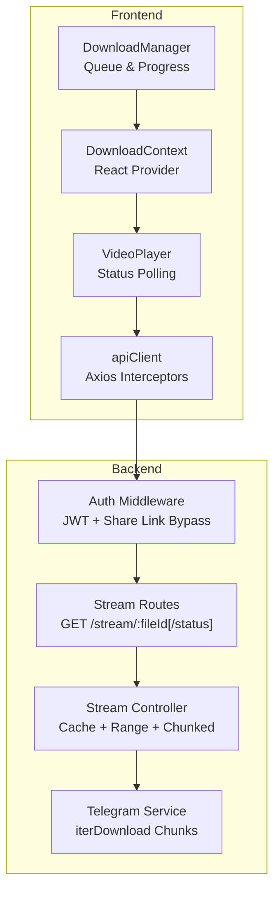
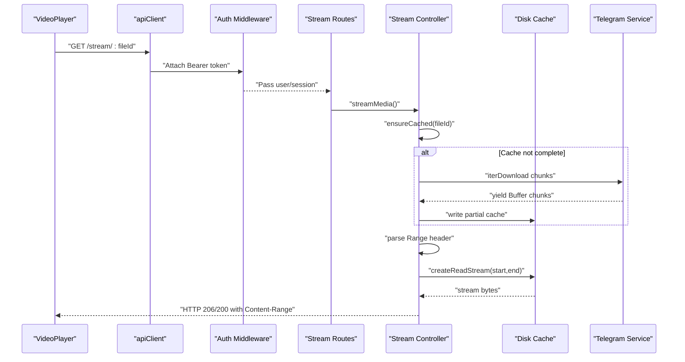
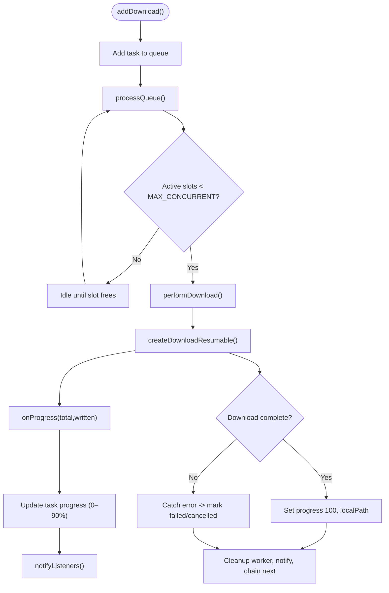
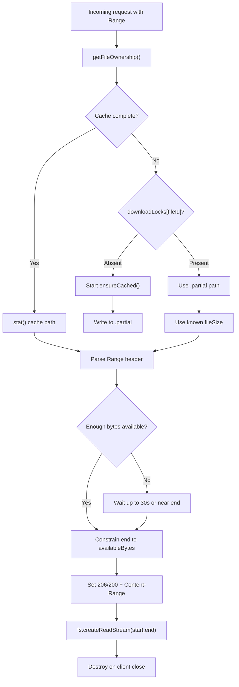
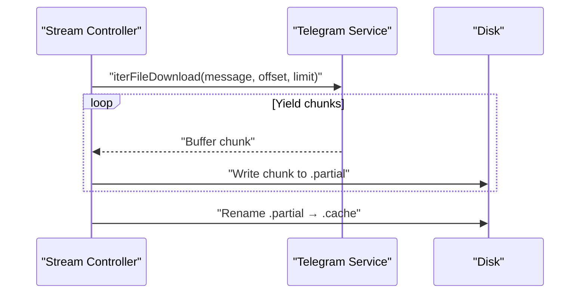
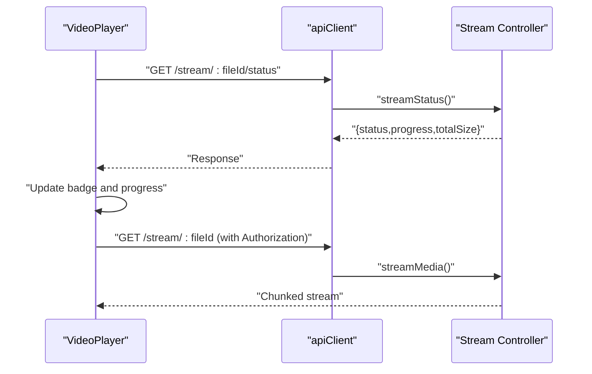
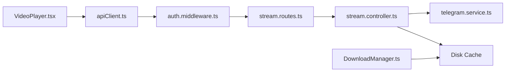

# Download and Streaming Performance

<cite>
**Referenced Files in This Document**
- [DownloadManager.ts](file://app/src/services/DownloadManager.ts)
- [DownloadContext.tsx](file://app/src/context/DownloadContext.tsx)
- [VideoPlayer.tsx](file://app/src/components/VideoPlayer.tsx)
- [apiClient.ts](file://app/src/services/apiClient.ts)
- [retry.ts](file://app/src/utils/retry.ts)
- [stream.controller.ts](file://server/src/controllers/stream.controller.ts)
- [stream.routes.ts](file://server/src/routes/stream.routes.ts)
- [auth.middleware.ts](file://server/src/middlewares/auth.middleware.ts)
- [telegram.service.ts](file://server/src/services/telegram.service.ts)
</cite>

## Table of Contents
1. [Introduction](#introduction)
2. [Project Structure](#project-structure)
3. [Core Components](#core-components)
4. [Architecture Overview](#architecture-overview)
5. [Detailed Component Analysis](#detailed-component-analysis)
6. [Dependency Analysis](#dependency-analysis)
7. [Performance Considerations](#performance-considerations)
8. [Troubleshooting Guide](#troubleshooting-guide)
9. [Conclusion](#conclusion)

## Introduction
This document focuses on download and streaming performance optimization with an emphasis on progressive loading, range request handling, and streaming efficiency. It explains the DownloadManager’s streaming architecture, buffer management, and real-time progress tracking. It documents the server-side stream controller’s range request processing, chunked response generation, and bandwidth optimization techniques. It also covers adaptive streaming strategies, cache warming, memory-efficient file handling, performance monitoring, latency optimization, quality degradation strategies, resume capability, error recovery, and connection resilience.

## Project Structure
The streaming pipeline spans the frontend React Native app and the backend Express server:
- Frontend: DownloadManager orchestrates downloads, tracks progress, and integrates with the platform’s file system and notifications.
- Backend: Stream controller manages ownership checks, cache warming, range requests, and chunked streaming from disk.
- Shared: Authentication middleware enforces JWT-based access, and Telegram service provides progressive, chunked downloads from Telegram.

**Diagram sources**
- [DownloadManager.ts](file://app/src/services/DownloadManager.ts#L42-L323)
- [DownloadContext.tsx](file://app/src/context/DownloadContext.tsx#L27-L94)
- [VideoPlayer.tsx](file://app/src/components/VideoPlayer.tsx#L28-L353)
- [apiClient.ts](file://app/src/services/apiClient.ts#L31-L164)
- [auth.middleware.ts](file://server/src/middlewares/auth.middleware.ts#L19-L82)
- [stream.routes.ts](file://server/src/routes/stream.routes.ts#L10-L26)
- [stream.controller.ts](file://server/src/controllers/stream.controller.ts#L322-L459)
- [telegram.service.ts](file://server/src/services/telegram.service.ts#L57-L97)

**Section sources**
- [DownloadManager.ts](file://app/src/services/DownloadManager.ts#L1-L323)
- [DownloadContext.tsx](file://app/src/context/DownloadContext.tsx#L1-L94)
- [VideoPlayer.tsx](file://app/src/components/VideoPlayer.tsx#L1-L353)
- [apiClient.ts](file://app/src/services/apiClient.ts#L1-L164)
- [auth.middleware.ts](file://server/src/middlewares/auth.middleware.ts#L1-L82)
- [stream.routes.ts](file://server/src/routes/stream.routes.ts#L1-L26)
- [stream.controller.ts](file://server/src/controllers/stream.controller.ts#L1-L460)
- [telegram.service.ts](file://server/src/services/telegram.service.ts#L1-L260)

## Core Components
- DownloadManager: Manages concurrent downloads, progress tracking, notifications, and cancellation via an underlying download worker. It exposes a subscription model for React integration.
- Stream Controller: Implements a download-first caching strategy, range request parsing, progressive serving, and disk-backed streaming with automatic cleanup.
- Telegram Service: Provides chunked downloads via iterDownload to avoid full buffering, enabling efficient streaming and memory usage.
- VideoPlayer: Integrates with the streaming endpoint, polls status for cache readiness, and displays real-time badges and progress overlays.
- Authentication Middleware: Enforces JWT-based access and supports a share-link bypass for public access scenarios.

**Section sources**
- [DownloadManager.ts](file://app/src/services/DownloadManager.ts#L42-L323)
- [stream.controller.ts](file://server/src/controllers/stream.controller.ts#L1-L460)
- [telegram.service.ts](file://server/src/services/telegram.service.ts#L162-L251)
- [VideoPlayer.tsx](file://app/src/components/VideoPlayer.tsx#L28-L353)
- [auth.middleware.ts](file://server/src/middlewares/auth.middleware.ts#L19-L82)

## Architecture Overview
The system uses a “download-first, serve-from-cache” model to reliably support range requests from mobile players. The backend ensures cache readiness, progressively serves available bytes, and streams from disk with strict bounds. The frontend coordinates downloads and streaming UI, including status polling and retry logic.

**Diagram sources**
- [VideoPlayer.tsx](file://app/src/components/VideoPlayer.tsx#L39-L88)
- [apiClient.ts](file://app/src/services/apiClient.ts#L31-L164)
- [auth.middleware.ts](file://server/src/middlewares/auth.middleware.ts#L19-L82)
- [stream.routes.ts](file://server/src/routes/stream.routes.ts#L10-L26)
- [stream.controller.ts](file://server/src/controllers/stream.controller.ts#L322-L459)
- [telegram.service.ts](file://server/src/services/telegram.service.ts#L215-L251)

## Detailed Component Analysis

### DownloadManager: Streaming Architecture and Progress Tracking
- Concurrency control: Limits active downloads to a fixed cap to prevent resource contention.
- Task lifecycle: Queued → Downloading → Completed/Failed/Cancelled with granular progress updates.
- Progress calculation: Uses platform download worker callbacks to compute percentage and caps progress to avoid premature completion signals.
- Notifications: Aggregates average progress for active downloads and posts ongoing notifications on Android.
- Cancellation: Supports per-task and global cancellation via the underlying worker.

**Diagram sources**
- [DownloadManager.ts](file://app/src/services/DownloadManager.ts#L153-L318)

**Section sources**
- [DownloadManager.ts](file://app/src/services/DownloadManager.ts#L42-L323)
- [DownloadContext.tsx](file://app/src/context/DownloadContext.tsx#L27-L94)

### Server-Side Stream Controller: Range Requests and Chunked Streaming
- Ownership caching: Maintains a short-lived in-memory cache of file sizes to reduce DB queries during status polling.
- Cache warming: Ensures a file is fully cached on disk; returns a partial path while downloading to enable progressive streaming.
- Range parsing: Validates and constrains range requests to available bytes, returning HTTP 206 Partial Content with precise Content-Range.
- Progressive serving: Waits up to a bounded time for sufficient bytes to serve a minimum chunk, improving initial playback latency.
- Memory efficiency: Streams directly from disk using read streams with explicit start/end offsets.
- Cleanup: Periodically removes stale cache files and clears associated progress entries.

**Diagram sources**
- [stream.controller.ts](file://server/src/controllers/stream.controller.ts#L322-L459)

**Section sources**
- [stream.controller.ts](file://server/src/controllers/stream.controller.ts#L1-L460)
- [stream.routes.ts](file://server/src/routes/stream.routes.ts#L1-L26)
- [auth.middleware.ts](file://server/src/middlewares/auth.middleware.ts#L19-L82)

### Telegram Service: Memory-Efficient Chunked Downloads
- Iterative download: Uses iterDownload to yield Buffer chunks incrementally, avoiding full file buffering.
- Chunk sizing: 512 KB chunks balance throughput and latency for streaming.
- Range-aware iteration: Respects offset and limit to align with HTTP Range requests.
- Client pooling: Maintains persistent clients with TTL and auto-reconnect to minimize handshake overhead.

**Diagram sources**
- [telegram.service.ts](file://server/src/services/telegram.service.ts#L215-L251)
- [stream.controller.ts](file://server/src/controllers/stream.controller.ts#L212-L264)

**Section sources**
- [telegram.service.ts](file://server/src/services/telegram.service.ts#L162-L251)
- [stream.controller.ts](file://server/src/controllers/stream.controller.ts#L178-L264)

### VideoPlayer: Real-Time Streaming UI and Status Polling
- Authentication headers: Passes Bearer token to the streaming endpoint for Range-based requests.
- Status polling: Queries /stream/:fileId/status every 2 seconds to display “Streaming…” or “Downloaded” badges and progress percentage.
- Progressive messaging: Shows contextual messages during initial load and extended waits.
- Error handling: Displays error overlay with retry action and restarts playback on retry.

**Diagram sources**
- [VideoPlayer.tsx](file://app/src/components/VideoPlayer.tsx#L48-L88)
- [stream.routes.ts](file://server/src/routes/stream.routes.ts#L10-L26)
- [stream.controller.ts](file://server/src/controllers/stream.controller.ts#L268-L318)

**Section sources**
- [VideoPlayer.tsx](file://app/src/components/VideoPlayer.tsx#L28-L353)
- [apiClient.ts](file://app/src/services/apiClient.ts#L31-L164)

## Dependency Analysis
- Frontend-to-backend: VideoPlayer depends on apiClient for authenticated requests; DownloadManager uses platform download APIs for file operations.
- Backend-to-external: Stream controller depends on Telegram service for chunked downloads and on filesystem for cache management.
- Authentication: Both routes and stream controller rely on auth middleware for JWT verification and optional share-link bypass.

**Diagram sources**
- [VideoPlayer.tsx](file://app/src/components/VideoPlayer.tsx#L28-L353)
- [apiClient.ts](file://app/src/services/apiClient.ts#L31-L164)
- [auth.middleware.ts](file://server/src/middlewares/auth.middleware.ts#L19-L82)
- [stream.routes.ts](file://server/src/routes/stream.routes.ts#L10-L26)
- [stream.controller.ts](file://server/src/controllers/stream.controller.ts#L322-L459)
- [telegram.service.ts](file://server/src/services/telegram.service.ts#L57-L97)
- [DownloadManager.ts](file://app/src/services/DownloadManager.ts#L268-L318)

**Section sources**
- [DownloadManager.ts](file://app/src/services/DownloadManager.ts#L1-L323)
- [stream.controller.ts](file://server/src/controllers/stream.controller.ts#L1-L460)
- [telegram.service.ts](file://server/src/services/telegram.service.ts#L1-L260)
- [VideoPlayer.tsx](file://app/src/components/VideoPlayer.tsx#L1-L353)
- [apiClient.ts](file://app/src/services/apiClient.ts#L1-L164)
- [auth.middleware.ts](file://server/src/middlewares/auth.middleware.ts#L1-L82)
- [stream.routes.ts](file://server/src/routes/stream.routes.ts#L1-L26)

## Performance Considerations
- Progressive loading and range requests:
  - The server waits for a minimum amount of data before serving a chunk to improve startup latency while honoring available bytes.
  - Range requests are strictly constrained to what is physically present on disk to avoid partial reads and ensure robustness.
- Bandwidth optimization:
  - Chunk size of 512 KB balances throughput and responsiveness for streaming.
  - Cache TTL of 1 hour reduces repeated downloads and leverages disk I/O for subsequent plays.
- Memory efficiency:
  - iterDownload yields Buffer chunks; no full file buffering occurs in memory.
  - Disk-backed streaming with explicit start/end offsets minimizes memory footprint.
- Concurrency and resilience:
  - Fixed concurrency for downloads prevents resource saturation.
  - Ownership cache reduces DB load during frequent status polling.
  - Client pooling with TTL and auto-reconnect improves reliability and reduces handshake overhead.
- Latency optimization:
  - Status polling interval of 2 seconds provides timely feedback without excessive load.
  - Short-lived ownership cache (60 seconds) balances freshness and performance.
- Quality degradation strategies:
  - While adaptive bitrate is not implemented here, the progressive model inherently adapts to available bandwidth by serving what is ready.
  - Future enhancements could include dynamic chunk sizing or client-side quality selection based on observed throughput.
- Resume capability and error recovery:
  - DownloadManager supports cancellation and cleanup of workers.
  - Stream controller handles partial files and renames them atomically to cache upon completion.
  - Client disconnection handling destroys read streams to free resources promptly.
- Monitoring:
  - Frontend logs request durations and retries; backend logs stream failures and cache operations.
  - Status endpoint provides progress and readiness for UI feedback.

[No sources needed since this section provides general guidance]

## Troubleshooting Guide
- Initial load delays:
  - Verify that the cache is warming and that the status endpoint reports “downloading” with increasing progress.
  - Ensure the client is configured to accept Range requests and pass the Authorization header.
- Range request errors:
  - Confirm that the server returns HTTP 416 when the requested range is invalid and that Content-Range reflects total size.
  - Check that available bytes are respected and that the end offset does not exceed downloaded bytes.
- Connection drops:
  - The server destroys read streams on client close; re-establishing the stream should resume from the last available byte.
  - Ensure the client retries appropriately on transient network errors.
- Authentication failures:
  - Verify JWT presence and validity; for share links, confirm the token is valid and maps to a user with a session string.
- Telegram session issues:
  - If the session expires, the server evicts the client from the pool and returns an appropriate error; prompt the user to re-authenticate.

**Section sources**
- [stream.controller.ts](file://server/src/controllers/stream.controller.ts#L361-L412)
- [stream.controller.ts](file://server/src/controllers/stream.controller.ts#L435-L446)
- [auth.middleware.ts](file://server/src/middlewares/auth.middleware.ts#L19-L82)
- [telegram.service.ts](file://server/src/services/telegram.service.ts#L42-L47)
- [retry.ts](file://app/src/utils/retry.ts#L14-L33)

## Conclusion
The system achieves robust, efficient streaming by combining a download-first caching strategy with precise range request handling and chunked disk streaming. The frontend provides responsive progress tracking and user feedback, while the backend optimizes for memory efficiency, concurrency, and resilience. The architecture supports progressive loading, cache warming, and graceful error recovery, laying a foundation for future adaptive streaming enhancements.