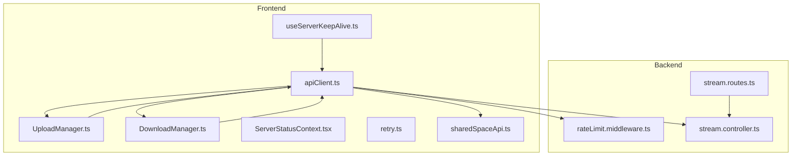
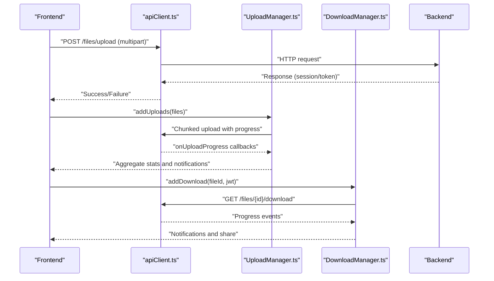
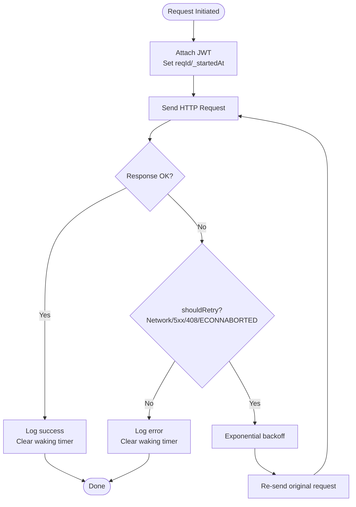
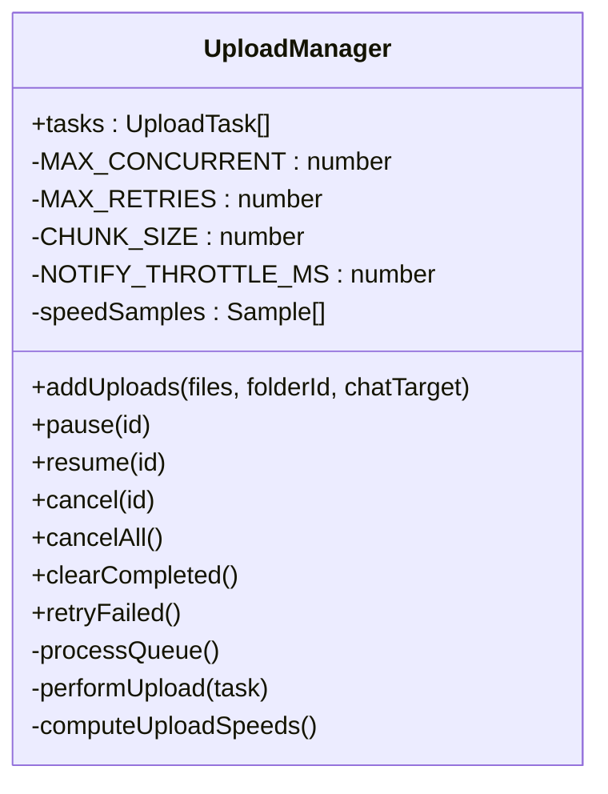
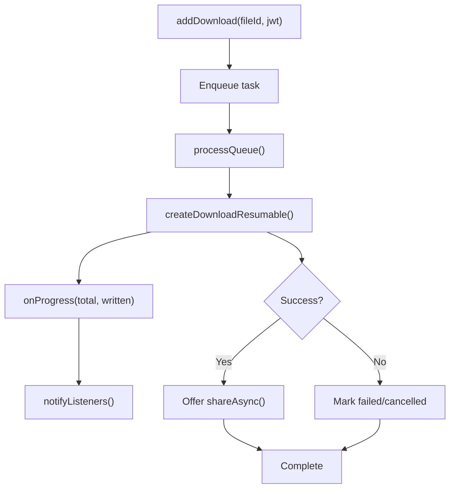
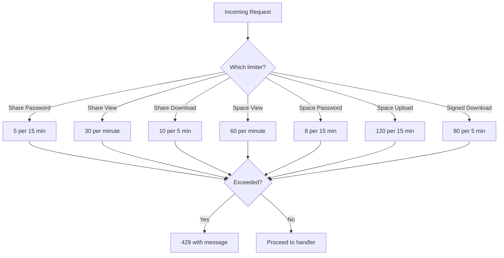
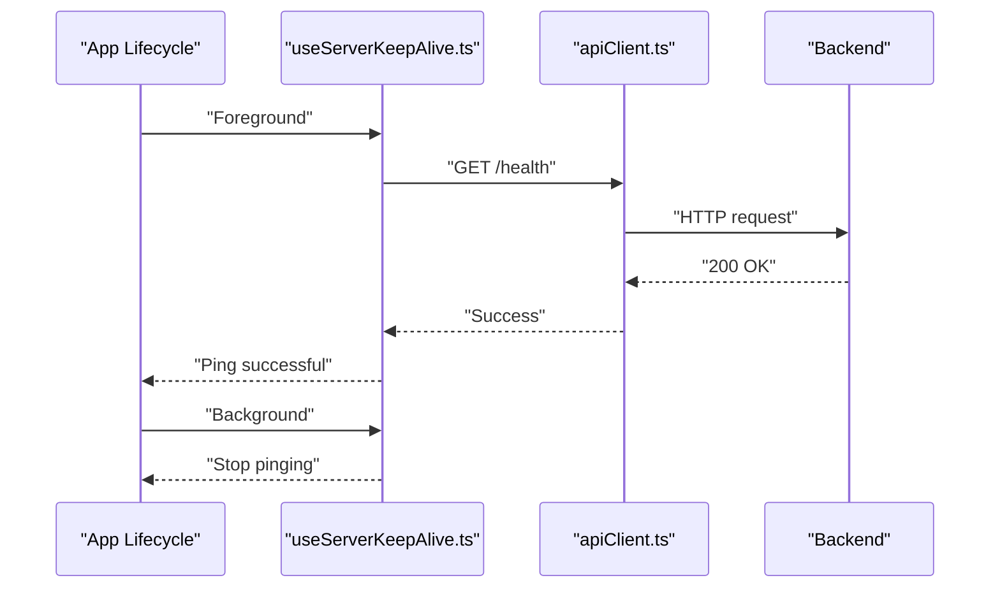
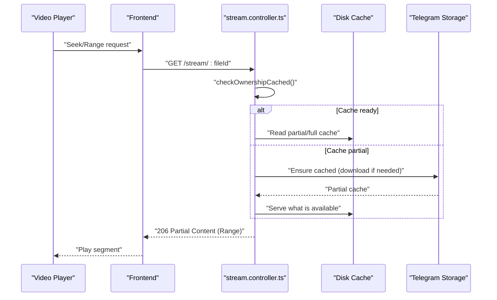
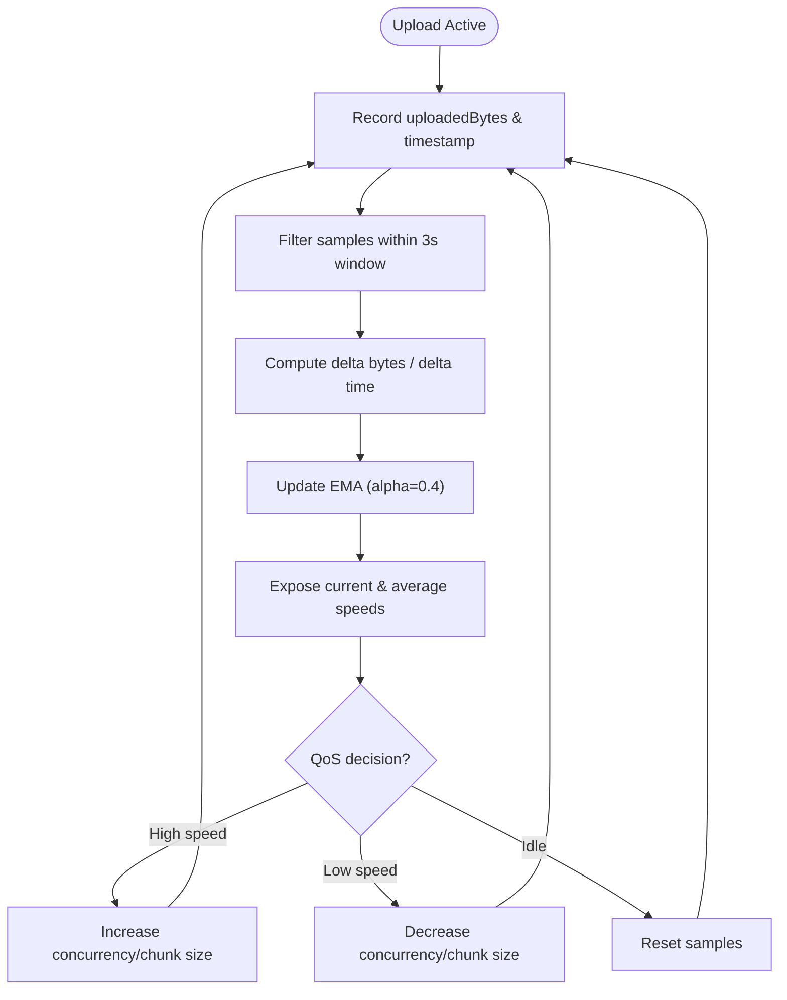
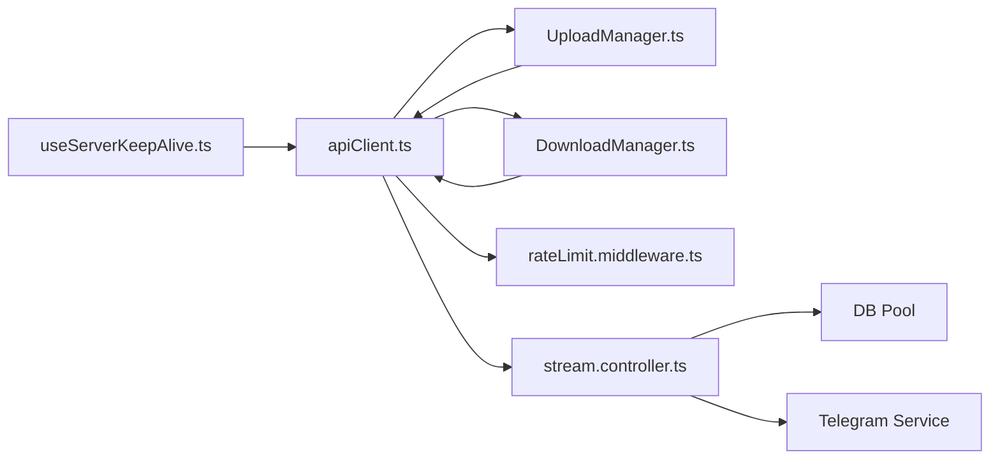

# Network Optimization and Bandwidth Management

<cite>
**Referenced Files in This Document**
- [apiClient.ts](file://app/src/services/apiClient.ts)
- [retry.ts](file://app/src/utils/retry.ts)
- [useServerKeepAlive.ts](file://app/src/hooks/useServerKeepAlive.ts)
- [ServerStatusContext.tsx](file://app/src/context/ServerStatusContext.tsx)
- [UploadManager.ts](file://app/src/services/UploadManager.ts)
- [DownloadManager.ts](file://app/src/services/DownloadManager.ts)
- [rateLimit.middleware.ts](file://server/src/middlewares/rateLimit.middleware.ts)
- [stream.controller.ts](file://server/src/controllers/stream.controller.ts)
- [stream.routes.ts](file://server/src/routes/stream.routes.ts)
- [sharedSpaceApi.ts](file://app/src/services/sharedSpaceApi.ts)
- [format.ts](file://app/src/utils/format.ts)
</cite>

## Table of Contents
1. [Introduction](#introduction)
2. [Project Structure](#project-structure)
3. [Core Components](#core-components)
4. [Architecture Overview](#architecture-overview)
5. [Detailed Component Analysis](#detailed-component-analysis)
6. [Dependency Analysis](#dependency-analysis)
7. [Performance Considerations](#performance-considerations)
8. [Troubleshooting Guide](#troubleshooting-guide)
9. [Conclusion](#conclusion)

## Introduction
This document focuses on network optimization and bandwidth management across the frontend and backend systems. It explains connection pooling, request batching, timeouts, retries, rate limiting, traffic shaping, keep-alive mechanisms, adaptive streaming, multiplexing, and failure recovery. It also covers bandwidth throttling, QoS prioritization, WebSocket/long-polling efficiency, and CDN integration strategies grounded in the repository’s implementation.

## Project Structure
The network optimization spans three primary areas:
- Frontend HTTP clients and managers for uploads/downloads
- Backend rate limiting and streaming controllers
- Keep-alive and server-wake UX

**Diagram sources**
- [apiClient.ts](file://app/src/services/apiClient.ts#L1-L164)
- [UploadManager.ts](file://app/src/services/UploadManager.ts#L1-L992)
- [DownloadManager.ts](file://app/src/services/DownloadManager.ts#L1-L323)
- [useServerKeepAlive.ts](file://app/src/hooks/useServerKeepAlive.ts#L1-L67)
- [ServerStatusContext.tsx](file://app/src/context/ServerStatusContext.tsx#L1-L52)
- [retry.ts](file://app/src/utils/retry.ts#L1-L34)
- [sharedSpaceApi.ts](file://app/src/services/sharedSpaceApi.ts#L1-L81)
- [rateLimit.middleware.ts](file://server/src/middlewares/rateLimit.middleware.ts#L1-L47)
- [stream.controller.ts](file://server/src/controllers/stream.controller.ts#L1-L460)
- [stream.routes.ts](file://server/src/routes/stream.routes.ts#L1-L26)

**Section sources**
- [apiClient.ts](file://app/src/services/apiClient.ts#L1-L164)
- [UploadManager.ts](file://app/src/services/UploadManager.ts#L1-L992)
- [DownloadManager.ts](file://app/src/services/DownloadManager.ts#L1-L323)
- [useServerKeepAlive.ts](file://app/src/hooks/useServerKeepAlive.ts#L1-L67)
- [ServerStatusContext.tsx](file://app/src/context/ServerStatusContext.tsx#L1-L52)
- [retry.ts](file://app/src/utils/retry.ts#L1-L34)
- [sharedSpaceApi.ts](file://app/src/services/sharedSpaceApi.ts#L1-L81)
- [rateLimit.middleware.ts](file://server/src/middlewares/rateLimit.middleware.ts#L1-L47)
- [stream.controller.ts](file://server/src/controllers/stream.controller.ts#L1-L460)
- [stream.routes.ts](file://server/src/routes/stream.routes.ts#L1-L26)

## Core Components
- HTTP clients with interceptors, timeouts, and retry logic
- Upload and download managers with concurrency limits, progress tracking, and persistence
- Rate limiting middleware on the backend
- Streaming controller with disk caching and HTTP Range support
- Keep-alive mechanism to mitigate cold starts

**Section sources**
- [apiClient.ts](file://app/src/services/apiClient.ts#L31-L164)
- [retry.ts](file://app/src/utils/retry.ts#L14-L33)
- [UploadManager.ts](file://app/src/services/UploadManager.ts#L126-L135)
- [DownloadManager.ts](file://app/src/services/DownloadManager.ts#L42-L53)
- [rateLimit.middleware.ts](file://server/src/middlewares/rateLimit.middleware.ts#L1-L47)
- [stream.controller.ts](file://server/src/controllers/stream.controller.ts#L180-L264)
- [useServerKeepAlive.ts](file://app/src/hooks/useServerKeepAlive.ts#L14-L42)

## Architecture Overview
The frontend uses two Axios clients:
- Standard API client with short timeouts and exponential backoff
- Dedicated upload client with extended timeouts for large payloads

Both clients attach JWT tokens, log request lifecycle, and implement retry logic. UploadManager and DownloadManager coordinate concurrency and progress. On the backend, rate limiting protects endpoints, and the streaming controller caches media to disk and serves via HTTP Range.

**Diagram sources**
- [apiClient.ts](file://app/src/services/apiClient.ts#L31-L164)
- [UploadManager.ts](file://app/src/services/UploadManager.ts#L514-L760)
- [DownloadManager.ts](file://app/src/services/DownloadManager.ts#L153-L318)
- [stream.controller.ts](file://server/src/controllers/stream.controller.ts#L322-L459)

## Detailed Component Analysis

### HTTP Clients and Retry Strategy
- Two clients:
  - Standard API client with short timeout suitable for typical API calls
  - Upload client with extended timeout to accommodate large uploads
- Interceptors:
  - Inject Authorization header
  - Log request start and success/failure
  - Show server waking UI after a delay
  - Retry logic with exponential backoff for transient failures
- Retry criteria:
  - Network errors (no response)
  - 5xx gateway/server errors
  - 408 Request Timeout
  - Client-side aborts (timeouts)

**Diagram sources**
- [apiClient.ts](file://app/src/services/apiClient.ts#L46-L132)
- [retry.ts](file://app/src/utils/retry.ts#L14-L33)

**Section sources**
- [apiClient.ts](file://app/src/services/apiClient.ts#L31-L164)
- [retry.ts](file://app/src/utils/retry.ts#L1-L34)

### Upload Manager: Concurrency, Batching, and Throttling
- Concurrency: Up to 3 simultaneous uploads
- Chunking: 5 MB chunks for efficient resume and progress
- Progress: Real-time via onUploadProgress; aggregated stats and notifications
- Persistence: Queue saved to storage; resumes after app restart
- Retry: Up to 5 attempts with exponential backoff; distinguishes fatal vs retryable errors
- Speed computation: Sliding window with EMA for current and average speeds
- Notifications: Throttled to reduce UI churn

**Diagram sources**
- [UploadManager.ts](file://app/src/services/UploadManager.ts#L126-L445)

**Section sources**
- [UploadManager.ts](file://app/src/services/UploadManager.ts#L126-L992)

### Download Manager: Queue Control and Progress
- Concurrency: Up to 3 active downloads
- Progress: Percentile-based with capped upper bound to reserve headroom for post-processing
- Notifications: Aggregate progress and completion summaries
- Cancellation: Per-task and bulk; cancels underlying transport where available
- Share: Offers share dialog upon completion

**Diagram sources**
- [DownloadManager.ts](file://app/src/services/DownloadManager.ts#L153-L318)

**Section sources**
- [DownloadManager.ts](file://app/src/services/DownloadManager.ts#L1-L323)

### Rate Limiting Middleware
- Multiple limits tailored to endpoints:
  - Share password attempts
  - Public share views
  - Public share downloads
  - Shared space views/passwords
  - Space uploads
  - Signed downloads
- Limits configured per window with explicit messages

**Diagram sources**
- [rateLimit.middleware.ts](file://server/src/middlewares/rateLimit.middleware.ts#L1-L47)

**Section sources**
- [rateLimit.middleware.ts](file://server/src/middlewares/rateLimit.middleware.ts#L1-L47)

### Traffic Shaping and Server Keep-Alive
- Keep-alive:
  - Pings health endpoint every 10 minutes when app is active
  - Stops pinging when app goes to background to save resources
- UX bridge:
  - ServerStatusContext coordinates waking UI visibility across components
- Timeout and retry:
  - Short API timeouts with exponential backoff
  - Upload client uses extended timeout for large transfers

**Diagram sources**
- [useServerKeepAlive.ts](file://app/src/hooks/useServerKeepAlive.ts#L14-L42)
- [apiClient.ts](file://app/src/services/apiClient.ts#L20-L27)
- [ServerStatusContext.tsx](file://app/src/context/ServerStatusContext.tsx#L16-L23)

**Section sources**
- [useServerKeepAlive.ts](file://app/src/hooks/useServerKeepAlive.ts#L1-L67)
- [ServerStatusContext.tsx](file://app/src/context/ServerStatusContext.tsx#L1-L52)
- [apiClient.ts](file://app/src/services/apiClient.ts#L1-L164)

### Adaptive Bitrate Streaming and Multiplexing
- Strategy:
  - Download-first, serve-from-disk-cached model
  - HTTP Range support for progressive playback
  - Ownership cache to reduce DB queries
  - Locks to prevent concurrent redundant downloads
- Behavior:
  - First play: download to cache; subsequent plays serve instantly
  - Cache TTL and partial file handling with progress-aware serving
  - Graceful handling of client disconnects

**Diagram sources**
- [stream.controller.ts](file://server/src/controllers/stream.controller.ts#L180-L459)
- [stream.routes.ts](file://server/src/routes/stream.routes.ts#L10-L23)

**Section sources**
- [stream.controller.ts](file://server/src/controllers/stream.controller.ts#L1-L460)
- [stream.routes.ts](file://server/src/routes/stream.routes.ts#L1-L26)

### Network Condition Detection and QoS
- UploadManager computes instantaneous and averaged upload speeds using a sliding window and EMA, enabling dynamic decisions (e.g., adjust chunk size or concurrency).
- DownloadManager tracks aggregate progress and can influence UX (e.g., show ETA or pause low-priority tasks).
- Shared space API supports access tokens for protected endpoints, complementing rate limiting.

**Diagram sources**
- [UploadManager.ts](file://app/src/services/UploadManager.ts#L407-L445)

**Section sources**
- [UploadManager.ts](file://app/src/services/UploadManager.ts#L407-L445)
- [sharedSpaceApi.ts](file://app/src/services/sharedSpaceApi.ts#L29-L31)

### Bandwidth Throttling and Failure Recovery
- Frontend:
  - UploadManager throttles UI notifications and uses exponential backoff
  - DownloadManager caps progress to leave room for post-processing
  - Retry logic covers transient network/server errors
- Backend:
  - Rate limiting prevents abuse and stabilizes throughput
  - Streaming controller ensures robust cache management and graceful degradation

**Section sources**
- [UploadManager.ts](file://app/src/services/UploadManager.ts#L283-L310)
- [DownloadManager.ts](file://app/src/services/DownloadManager.ts#L287-L296)
- [rateLimit.middleware.ts](file://server/src/middlewares/rateLimit.middleware.ts#L1-L47)

### WebSocket and Long-Polling Efficiency
- Current implementation does not include WebSocket or long-polling handlers in the provided files. Recommendations:
  - Use a single persistent connection with multiplexed streams for real-time features
  - Apply backpressure and batch acknowledgments
  - Implement exponential backoff on reconnect and jitter to avoid thundering herd
  - For long-polling, set conservative timeouts and leverage conditional requests (ETag/Last-Modified)

[No sources needed since this section provides general guidance]

### CDN Integration Strategies
- Recommended approach:
  - Serve media via signed URLs with short TTLs
  - Cache static assets at CDN edges with appropriate cache-control headers
  - Use origin pull caching to minimize origin hits
  - Compress and optimize assets (e.g., gzip/brotli) and enable HTTP/2 push where applicable
  - Monitor cache hit ratios and tune TTLs based on usage patterns

[No sources needed since this section provides general guidance]

## Dependency Analysis
- Frontend dependencies:
  - apiClient.ts depends on AsyncStorage for tokens and logger for telemetry
  - UploadManager and DownloadManager depend on apiClient.ts and platform-specific filesystem APIs
  - useServerKeepAlive.ts depends on apiClient.ts and AppState for lifecycle
- Backend dependencies:
  - stream.controller.ts depends on Telegram service, DB pool, and filesystem
  - rateLimit.middleware.ts depends on express-rate-limit

**Diagram sources**
- [apiClient.ts](file://app/src/services/apiClient.ts#L1-L164)
- [UploadManager.ts](file://app/src/services/UploadManager.ts#L1-L992)
- [DownloadManager.ts](file://app/src/services/DownloadManager.ts#L1-L323)
- [useServerKeepAlive.ts](file://app/src/hooks/useServerKeepAlive.ts#L1-L67)
- [rateLimit.middleware.ts](file://server/src/middlewares/rateLimit.middleware.ts#L1-L47)
- [stream.controller.ts](file://server/src/controllers/stream.controller.ts#L1-L460)

**Section sources**
- [apiClient.ts](file://app/src/services/apiClient.ts#L1-L164)
- [UploadManager.ts](file://app/src/services/UploadManager.ts#L1-L992)
- [DownloadManager.ts](file://app/src/services/DownloadManager.ts#L1-L323)
- [useServerKeepAlive.ts](file://app/src/hooks/useServerKeepAlive.ts#L1-L67)
- [rateLimit.middleware.ts](file://server/src/middlewares/rateLimit.middleware.ts#L1-L47)
- [stream.controller.ts](file://server/src/controllers/stream.controller.ts#L1-L460)

## Performance Considerations
- Connection pooling:
  - Use a single Axios instance per domain to benefit from built-in pooling; avoid creating multiple clients unnecessarily
- Request batching:
  - Group small requests where feasible (e.g., prefetch metadata) and leverage HTTP/2 multiplexing
- Timeout tuning:
  - Keep API timeouts short for responsiveness; use dedicated upload client for large payloads
- Retry and backoff:
  - Exponential backoff with jitter reduces contention; cap retries to prevent resource exhaustion
- Concurrency:
  - Cap concurrent uploads/downloads to balance throughput and device/network constraints
- Caching:
  - Disk cache for streaming reduces origin load and latency; monitor cache hit rates and TTLs
- Observability:
  - Log request durations and statuses; surface server waking UX to improve perceived performance

[No sources needed since this section provides general guidance]

## Troubleshooting Guide
- Frequent retries:
  - Verify shouldRetry logic and ensure transient errors are being handled correctly
- Slow uploads:
  - Check chunk size, concurrency, and network speed; consider reducing concurrency on poor networks
- Download stalls:
  - Confirm progress callbacks and ensure notifications are not throttling UI updates
- Rate limit errors:
  - Review per-endpoint limits and consider increasing thresholds or adding client-side queues
- Cold start delays:
  - Confirm keep-alive pings and server waking UI behavior

**Section sources**
- [retry.ts](file://app/src/utils/retry.ts#L14-L33)
- [UploadManager.ts](file://app/src/services/UploadManager.ts#L676-L760)
- [DownloadManager.ts](file://app/src/services/DownloadManager.ts#L268-L318)
- [rateLimit.middleware.ts](file://server/src/middlewares/rateLimit.middleware.ts#L1-L47)
- [useServerKeepAlive.ts](file://app/src/hooks/useServerKeepAlive.ts#L14-L42)

## Conclusion
The system combines pragmatic frontend managers with backend safeguards to achieve efficient, resilient network behavior. Short timeouts with exponential backoff, controlled concurrency, disk caching, and rate limiting collectively improve bandwidth efficiency and user experience. Extending the design with adaptive bitrate controls, CDN integration, and WebSocket/long-polling optimizations can further enhance performance under varying network conditions.