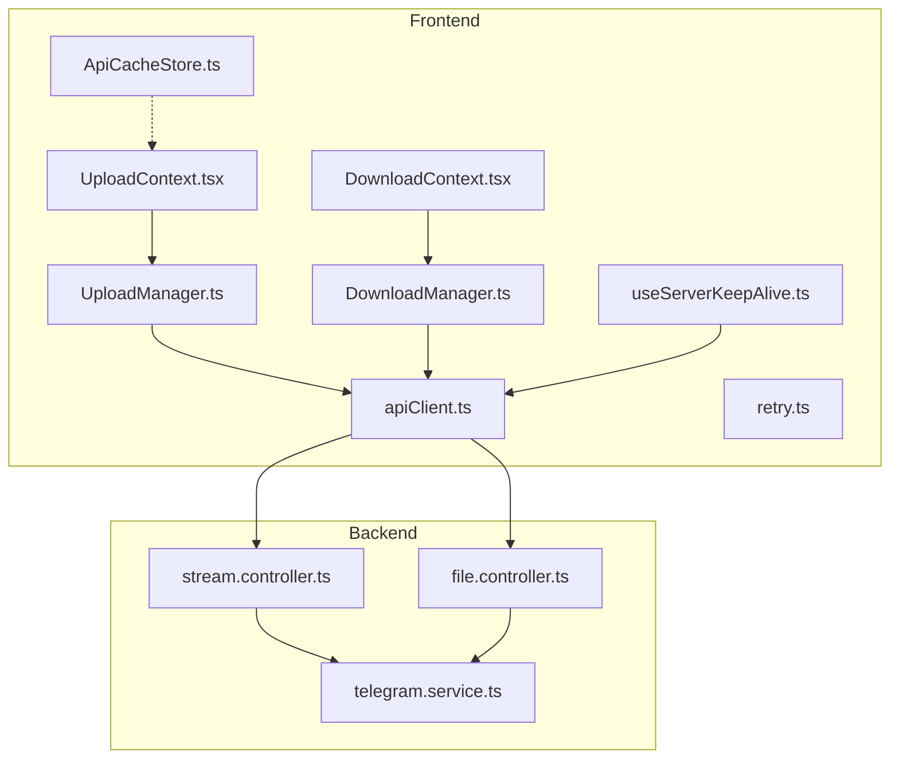
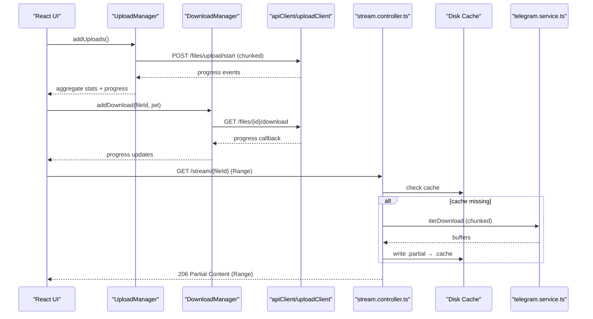
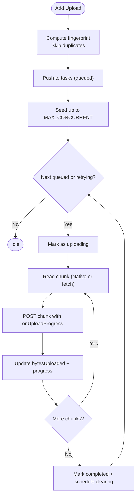
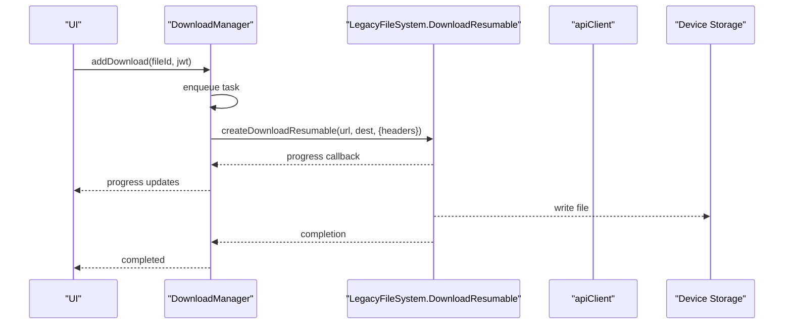
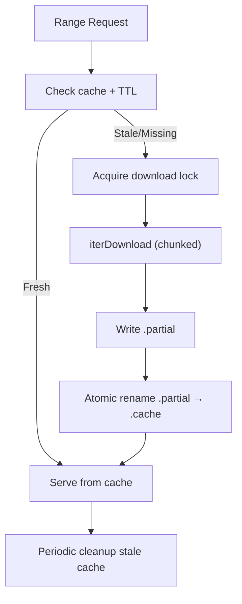
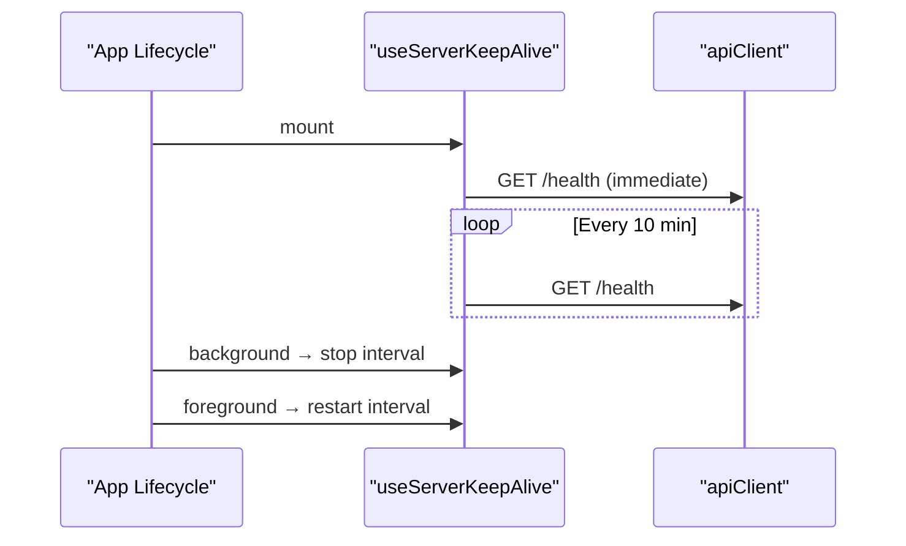
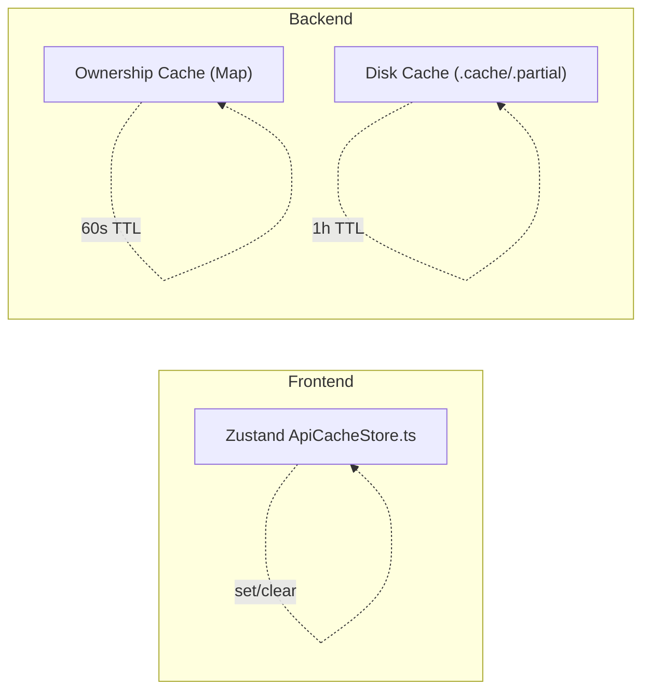
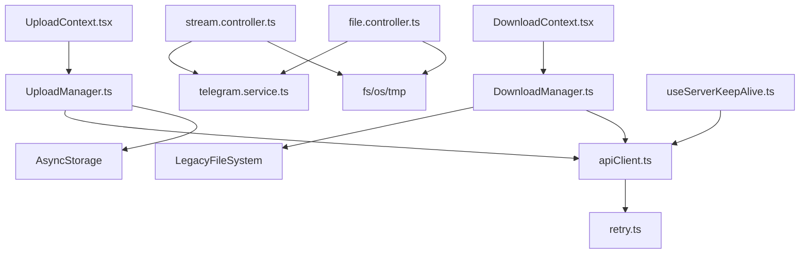

# Performance and Optimization

<cite>
**Referenced Files in This Document**
- [UploadManager.ts](file://app/src/services/UploadManager.ts)
- [DownloadManager.ts](file://app/src/services/DownloadManager.ts)
- [UploadContext.tsx](file://app/src/context/UploadContext.tsx)
- [DownloadContext.tsx](file://app/src/context/DownloadContext.tsx)
- [useServerKeepAlive.ts](file://app/src/hooks/useServerKeepAlive.ts)
- [apiClient.ts](file://app/src/services/apiClient.ts)
- [retry.ts](file://app/src/utils/retry.ts)
- [ApiCacheStore.ts](file://app/src/context/ApiCacheStore.ts)
- [stream.controller.ts](file://server/src/controllers/stream.controller.ts)
- [file.controller.ts](file://server/src/controllers/file.controller.ts)
- [telegram.service.ts](file://server/src/services/telegram.service.ts)
</cite>

## Table of Contents
1. [Introduction](#introduction)
2. [Project Structure](#project-structure)
3. [Core Components](#core-components)
4. [Architecture Overview](#architecture-overview)
5. [Detailed Component Analysis](#detailed-component-analysis)
6. [Dependency Analysis](#dependency-analysis)
7. [Performance Considerations](#performance-considerations)
8. [Troubleshooting Guide](#troubleshooting-guide)
9. [Conclusion](#conclusion)
10. [Appendices](#appendices)

## Introduction
This document focuses on performance and optimization across upload/download operations, caching strategies, memory management, and network efficiency. It explains the UploadManager and DownloadManager implementations, streaming performance improvements, and server keep-alive mechanisms. It also documents caching strategies for reduced latency, memory management for large file operations, and network optimization techniques. Practical examples of performance monitoring, optimization algorithms, caching implementations, and resource management are included, along with profiling techniques, bottleneck identification, scalability, and load balancing strategies.

## Project Structure
The performance-critical areas span the frontend React Native application and the backend Node.js service:
- Frontend managers: UploadManager and DownloadManager orchestrate file transfers, manage concurrency, persistence, and notifications.
- Frontend contexts: UploadContext and DownloadContext expose aggregated stats and actions to React components.
- Hooks and clients: useServerKeepAlive maintains server responsiveness; apiClient manages request lifecycle and retries.
- Backend streaming: stream.controller.ts and file.controller.ts implement disk-cached streaming with HTTP Range support and Telegram client pooling.
- Backend services: telegram.service.ts provides progressive, chunked downloads without full buffering.

**Diagram sources**
- [UploadManager.ts](file://app/src/services/UploadManager.ts#L126-L992)
- [DownloadManager.ts](file://app/src/services/DownloadManager.ts#L42-L323)
- [UploadContext.tsx](file://app/src/context/UploadContext.tsx#L51-L114)
- [DownloadContext.tsx](file://app/src/context/DownloadContext.tsx#L29-L84)
- [useServerKeepAlive.ts](file://app/src/hooks/useServerKeepAlive.ts#L16-L66)
- [apiClient.ts](file://app/src/services/apiClient.ts#L31-L164)
- [retry.ts](file://app/src/utils/retry.ts#L14-L33)
- [ApiCacheStore.ts](file://app/src/context/ApiCacheStore.ts#L16-L27)
- [stream.controller.ts](file://server/src/controllers/stream.controller.ts#L1-L460)
- [file.controller.ts](file://server/src/controllers/file.controller.ts#L540-L739)
- [telegram.service.ts](file://server/src/services/telegram.service.ts#L1-L260)

**Section sources**
- [UploadManager.ts](file://app/src/services/UploadManager.ts#L126-L992)
- [DownloadManager.ts](file://app/src/services/DownloadManager.ts#L42-L323)
- [UploadContext.tsx](file://app/src/context/UploadContext.tsx#L51-L114)
- [DownloadContext.tsx](file://app/src/context/DownloadContext.tsx#L29-L84)
- [useServerKeepAlive.ts](file://app/src/hooks/useServerKeepAlive.ts#L16-L66)
- [apiClient.ts](file://app/src/services/apiClient.ts#L31-L164)
- [retry.ts](file://app/src/utils/retry.ts#L14-L33)
- [ApiCacheStore.ts](file://app/src/context/ApiCacheStore.ts#L16-L27)
- [stream.controller.ts](file://server/src/controllers/stream.controller.ts#L1-L460)
- [file.controller.ts](file://server/src/controllers/file.controller.ts#L540-L739)
- [telegram.service.ts](file://server/src/services/telegram.service.ts#L1-L260)

## Core Components
- UploadManager: Manages upload queues with concurrency control, exponential backoff, persistence, throttled notifications, and accurate progress computation. It computes upload speeds using a sliding window and EMA.
- DownloadManager: Manages download queues with concurrency control, transport-level cancellation, and progress notifications. It streams via legacy download resumable with progress callbacks.
- Streaming Controllers: Disk-cached streaming with HTTP Range support, ownership caching, download locks, and periodic cleanup.
- Telegram Service: Progressive, chunked downloads via iterDownload to avoid full buffering; client pooling with TTL and auto-reconnect.
- API Client and Retry: Unified interceptors for timing, logging, and exponential backoff; distinct timeouts for standard and upload clients.
- Keep-Alive Hook: Periodic pings to prevent server cold starts on Render.

**Section sources**
- [UploadManager.ts](file://app/src/services/UploadManager.ts#L126-L445)
- [DownloadManager.ts](file://app/src/services/DownloadManager.ts#L42-L318)
- [stream.controller.ts](file://server/src/controllers/stream.controller.ts#L1-L460)
- [file.controller.ts](file://server/src/controllers/file.controller.ts#L540-L739)
- [telegram.service.ts](file://server/src/services/telegram.service.ts#L162-L251)
- [apiClient.ts](file://app/src/services/apiClient.ts#L31-L164)
- [retry.ts](file://app/src/utils/retry.ts#L14-L33)
- [useServerKeepAlive.ts](file://app/src/hooks/useServerKeepAlive.ts#L16-L66)

## Architecture Overview
The system separates concerns between frontend managers and backend streaming:
- Frontend upload/download managers coordinate tasks, retries, and UI updates.
- Backend streaming controllers cache media to disk, support Range requests, and stream efficiently.
- Telegram service provides chunked downloads and pooled clients for reliability and throughput.
- API client enforces timeouts and retries, while keep-alive prevents cold starts.

**Diagram sources**
- [UploadManager.ts](file://app/src/services/UploadManager.ts#L514-L760)
- [DownloadManager.ts](file://app/src/services/DownloadManager.ts#L153-L318)
- [apiClient.ts](file://app/src/services/apiClient.ts#L31-L164)
- [stream.controller.ts](file://server/src/controllers/stream.controller.ts#L320-L459)
- [telegram.service.ts](file://server/src/services/telegram.service.ts#L215-L251)

## Detailed Component Analysis

### UploadManager Optimization Techniques
- Concurrency control: Limits to three simultaneous uploads to align with server semaphores and reduce contention.
- Chunked uploads: 5 MB chunks balance throughput and memory usage; fallback to fetch Range for unsupported URIs.
- Deduplication: Fingerprints prevent duplicate uploads for the same file URI/name/size.
- Persistence: Queue and stats persisted to AsyncStorage to survive app restarts.
- Throttled notifications: 200 ms throttle reduces React re-renders and improves UI responsiveness.
- Speed computation: Sliding window (3 seconds) plus EMA smooths upload speed metrics.
- Exponential backoff: Up to five retries with jittered delays for transient failures.
- AbortController: Graceful pause/resume/cancel with transport-level interruption.

**Diagram sources**
- [UploadManager.ts](file://app/src/services/UploadManager.ts#L514-L760)
- [UploadManager.ts](file://app/src/services/UploadManager.ts#L92-L122)

**Section sources**
- [UploadManager.ts](file://app/src/services/UploadManager.ts#L126-L198)
- [UploadManager.ts](file://app/src/services/UploadManager.ts#L200-L255)
- [UploadManager.ts](file://app/src/services/UploadManager.ts#L283-L310)
- [UploadManager.ts](file://app/src/services/UploadManager.ts#L314-L445)
- [UploadManager.ts](file://app/src/services/UploadManager.ts#L676-L760)

### DownloadManager Optimization Techniques
- Concurrency control: Limits to three simultaneous downloads to avoid I/O saturation.
- Transport-level cancellation: Uses legacy DownloadResumable to cancel mid-transfer.
- Progress reporting: Updates progress via callback; caps post-download processing to preserve share/save UX.
- Notifications: Aggregated progress and completion notifications for user feedback.

**Diagram sources**
- [DownloadManager.ts](file://app/src/services/DownloadManager.ts#L153-L318)

**Section sources**
- [DownloadManager.ts](file://app/src/services/DownloadManager.ts#L42-L264)
- [DownloadManager.ts](file://app/src/services/DownloadManager.ts#L268-L318)

### Streaming Performance Improvements
- Disk-cached streaming: Download once to /tmp, then serve instantly via HTTP Range.
- Ownership caching: In-memory cache (60s TTL) avoids frequent DB queries for ownership checks.
- Download locks: Prevents redundant downloads when multiple Range requests arrive concurrently.
- Progressive serving: Waits until sufficient bytes are available to satisfy a minimum chunk size.
- Cleanup: Periodic removal of stale cache files to control disk usage.
- Telegram progressive download: iterDownload yields chunks without full buffering.

**Diagram sources**
- [stream.controller.ts](file://server/src/controllers/stream.controller.ts#L178-L264)
- [file.controller.ts](file://server/src/controllers/file.controller.ts#L560-L612)
- [telegram.service.ts](file://server/src/services/telegram.service.ts#L215-L251)

**Section sources**
- [stream.controller.ts](file://server/src/controllers/stream.controller.ts#L46-L121)
- [stream.controller.ts](file://server/src/controllers/stream.controller.ts#L178-L264)
- [stream.controller.ts](file://server/src/controllers/stream.controller.ts#L320-L459)
- [file.controller.ts](file://server/src/controllers/file.controller.ts#L540-L612)
- [telegram.service.ts](file://server/src/services/telegram.service.ts#L215-L251)

### Server Keep-Alive Mechanism
- Keeps the Render server warm by pinging every 10 minutes when the app is active.
- Starts on mount and stops when the app goes to background to conserve resources.
- Prevents cold starts that cause long initial request times.

**Diagram sources**
- [useServerKeepAlive.ts](file://app/src/hooks/useServerKeepAlive.ts#L16-L66)
- [apiClient.ts](file://app/src/services/apiClient.ts#L31-L164)

**Section sources**
- [useServerKeepAlive.ts](file://app/src/hooks/useServerKeepAlive.ts#L16-L66)

### Caching Strategies for Improved Response Times
- Frontend API cache store: Zustand-backed cache for home data, lists, and starred items to reduce repeated network calls.
- Backend ownership cache: Short-lived in-memory cache for file ownership checks to minimize DB load.
- Streaming cache: Disk cache with TTL and atomic rename to avoid partial reads and enable fast subsequent plays.
- Next.js cache profiles: Web-side cache controls for server-rendered pages and data.

**Diagram sources**
- [ApiCacheStore.ts](file://app/src/context/ApiCacheStore.ts#L16-L27)
- [stream.controller.ts](file://server/src/controllers/stream.controller.ts#L46-L121)
- [file.controller.ts](file://server/src/controllers/file.controller.ts#L540-L575)

**Section sources**
- [ApiCacheStore.ts](file://app/src/context/ApiCacheStore.ts#L16-L27)
- [stream.controller.ts](file://server/src/controllers/stream.controller.ts#L46-L121)
- [file.controller.ts](file://server/src/controllers/file.controller.ts#L540-L575)

### Memory Management for Large File Operations
- Progressive streaming: iterDownload yields chunks; no full file buffering in memory.
- Chunk size tuning: 512 KB per chunk balances throughput and memory footprint.
- Client pooling: Reuses Telegram clients to avoid reconnect overhead and reduce memory churn.
- Frontend chunked uploads: 5 MB chunks prevent oversized memory spikes during upload preparation.
- Cleanup: Periodic cache pruning and abort signals for paused/cancelled tasks.

**Section sources**
- [telegram.service.ts](file://server/src/services/telegram.service.ts#L215-L251)
- [UploadManager.ts](file://app/src/services/UploadManager.ts#L132-L134)
- [stream.controller.ts](file://server/src/controllers/stream.controller.ts#L159-L176)

### Network Optimization for Bandwidth Efficiency
- Distinct timeouts: Standard API 15s; upload client 10 minutes to accommodate long uploads.
- Exponential backoff: Reduces load on flaky networks and servers.
- Range requests: Enables efficient seeking and partial playback without re-downloading.
- Keep-alive pings: Prevents idle timeouts and reduces handshake overhead.
- Ownership caching: Reduces repeated DB queries, lowering network chatter.

**Section sources**
- [apiClient.ts](file://app/src/services/apiClient.ts#L31-L42)
- [retry.ts](file://app/src/utils/retry.ts#L14-L33)
- [stream.controller.ts](file://server/src/controllers/stream.controller.ts#L361-L427)
- [useServerKeepAlive.ts](file://app/src/hooks/useServerKeepAlive.ts#L14-L34)

## Dependency Analysis
- UploadManager depends on apiClient and uploadClient for network operations and AsyncStorage for persistence.
- DownloadManager depends on legacy filesystem for transport-level cancellation and progress tracking.
- Streaming controllers depend on telegram.service for progressive downloads and filesystem for caching.
- API client integrates with retry logic and server status manager for user feedback.

**Diagram sources**
- [UploadManager.ts](file://app/src/services/UploadManager.ts#L20-L25)
- [DownloadManager.ts](file://app/src/services/DownloadManager.ts#L11-L16)
- [apiClient.ts](file://app/src/services/apiClient.ts#L31-L164)
- [retry.ts](file://app/src/utils/retry.ts#L14-L33)
- [stream.controller.ts](file://server/src/controllers/stream.controller.ts#L29-L36)
- [file.controller.ts](file://server/src/controllers/file.controller.ts#L540-L558)
- [telegram.service.ts](file://server/src/services/telegram.service.ts#L13-L18)
- [UploadContext.tsx](file://app/src/context/UploadContext.tsx#L12-L14)
- [DownloadContext.tsx](file://app/src/context/DownloadContext.tsx#L8-L9)
- [useServerKeepAlive.ts](file://app/src/hooks/useServerKeepAlive.ts#L10-L12)

**Section sources**
- [UploadManager.ts](file://app/src/services/UploadManager.ts#L20-L25)
- [DownloadManager.ts](file://app/src/services/DownloadManager.ts#L11-L16)
- [apiClient.ts](file://app/src/services/apiClient.ts#L31-L164)
- [retry.ts](file://app/src/utils/retry.ts#L14-L33)
- [stream.controller.ts](file://server/src/controllers/stream.controller.ts#L29-L36)
- [file.controller.ts](file://server/src/controllers/file.controller.ts#L540-L558)
- [telegram.service.ts](file://server/src/services/telegram.service.ts#L13-L18)
- [UploadContext.tsx](file://app/src/context/UploadContext.tsx#L12-L14)
- [DownloadContext.tsx](file://app/src/context/DownloadContext.tsx#L8-L9)
- [useServerKeepAlive.ts](file://app/src/hooks/useServerKeepAlive.ts#L10-L12)

## Performance Considerations
- Concurrency limits: Both upload and download managers cap concurrent operations to balance CPU, I/O, and network utilization.
- Chunk sizing: 5 MB for uploads and 512 KB for streaming strike a practical balance between throughput and memory.
- Throttling: Upload progress notifications are throttled to reduce UI churn and improve responsiveness.
- Caching: Disk cache for streaming and short-lived ownership cache reduce server load and latency.
- Timeouts: Separate timeouts for standard vs. upload requests prevent stalls and improve perceived performance.
- Backoff: Exponential backoff mitigates thundering herds and server pressure.
- Progressive downloads: iterDownload avoids full buffering and enables early playback.

[No sources needed since this section provides general guidance]

## Troubleshooting Guide
- Upload stuck at 0% or slow progress:
  - Verify chunk reading fallback and network connectivity.
  - Check throttled notifications and ensure listeners are not blocked.
- Upload fails with non-recoverable errors:
  - Fatal Telegram errors are surfaced; inspect logs and avoid retrying.
- Downloads fail mid-stream:
  - Confirm transport-level cancellation via DownloadResumable and proper JWT handling.
- Streaming stalls or returns 416:
  - Ensure Range parsing and available bytes calculation are correct; confirm cache availability.
- Server cold start delays:
  - Enable keep-alive pings and verify interval logic.

**Section sources**
- [UploadManager.ts](file://app/src/services/UploadManager.ts#L697-L751)
- [DownloadManager.ts](file://app/src/services/DownloadManager.ts#L247-L263)
- [stream.controller.ts](file://server/src/controllers/stream.controller.ts#L395-L412)
- [useServerKeepAlive.ts](file://app/src/hooks/useServerKeepAlive.ts#L14-L34)

## Conclusion
The system achieves robust performance through coordinated frontend managers, backend streaming with disk caching, and pragmatic network strategies. UploadManager and DownloadManager enforce concurrency, persistence, and progress fidelity. Streaming controllers leverage ownership caching, download locks, and progressive downloads to minimize latency and maximize throughput. The Telegram service’s chunked downloads and client pooling further enhance reliability. Together, these components provide a scalable, responsive foundation for upload/download and media streaming.

[No sources needed since this section summarizes without analyzing specific files]

## Appendices

### Performance Monitoring Examples
- Upload speed metrics: Use computed average and current upload speeds from UploadManager stats for real-time dashboards.
- Request timing: Leverage apiClient interceptors to log durations and statuses for each request.
- Retry analytics: Track retry counts and delays to identify flaky networks or server issues.
- Streaming cache health: Monitor cache hit rates and cleanup intervals to tune TTL and disk quotas.

**Section sources**
- [UploadManager.ts](file://app/src/services/UploadManager.ts#L314-L445)
- [apiClient.ts](file://app/src/services/apiClient.ts#L87-L132)

### Optimization Algorithms
- Sliding window + EMA: Smooth upload speed calculations for stable UI indicators.
- Exponential backoff: Gradually increasing delays for retries to stabilize transient failures.
- Chunked iteration: iterDownload yields buffers incrementally to avoid memory spikes.

**Section sources**
- [UploadManager.ts](file://app/src/services/UploadManager.ts#L407-L445)
- [retry.ts](file://app/src/utils/retry.ts#L14-L33)
- [telegram.service.ts](file://server/src/services/telegram.service.ts#L215-L251)

### Resource Management Guidelines
- Limit concurrency to match device capabilities and server capacity.
- Use chunk sizes appropriate for the target platform and network conditions.
- Persist queues and stats to recover from interruptions.
- Clean up caches periodically and honor abort signals promptly.

**Section sources**
- [UploadManager.ts](file://app/src/services/UploadManager.ts#L128-L134)
- [DownloadManager.ts](file://app/src/services/DownloadManager.ts#L45-L46)
- [stream.controller.ts](file://server/src/controllers/stream.controller.ts#L159-L176)
- [UploadManager.ts](file://app/src/services/UploadManager.ts#L752-L760)

### Scalability and Load Balancing
- Client pooling: Reuse Telegram clients to reduce connection overhead.
- Ownership caching: Minimize DB load with short-lived in-memory cache.
- Streaming cache: Reduce upstream bandwidth by serving cached content.
- Keep-alive: Maintain server readiness to reduce cold-start penalties.

**Section sources**
- [telegram.service.ts](file://server/src/services/telegram.service.ts#L35-L97)
- [stream.controller.ts](file://server/src/controllers/stream.controller.ts#L46-L121)
- [useServerKeepAlive.ts](file://app/src/hooks/useServerKeepAlive.ts#L14-L34)