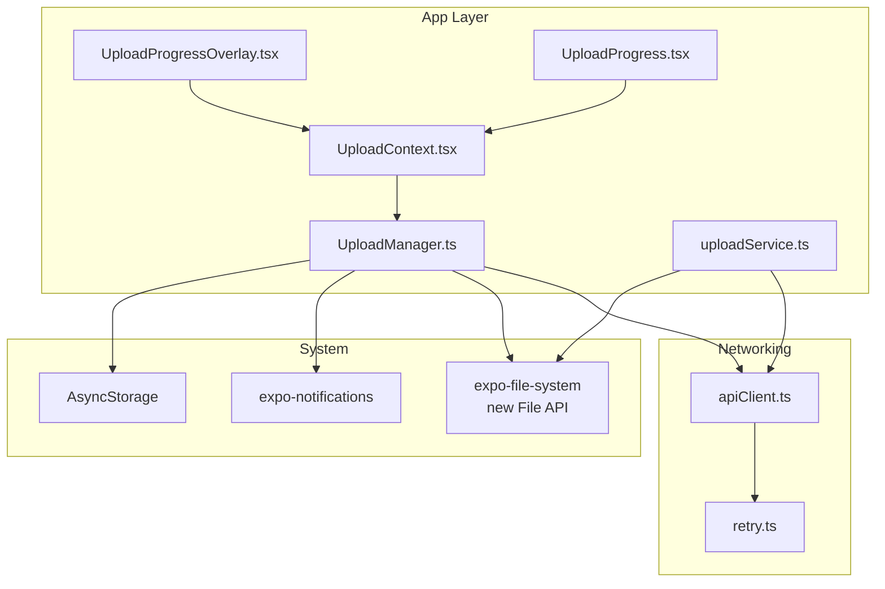
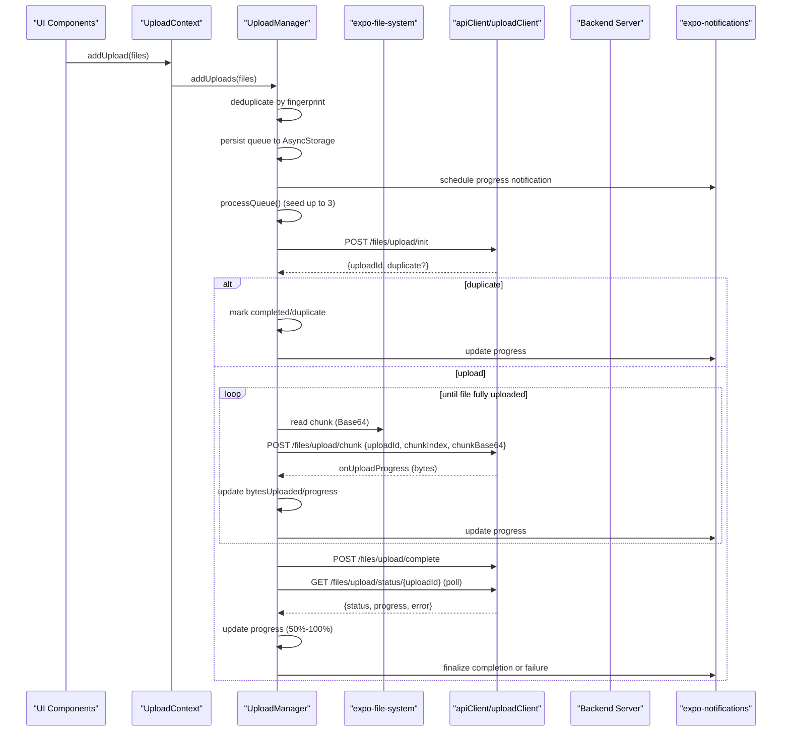
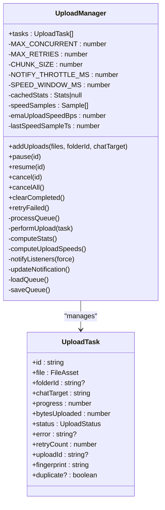
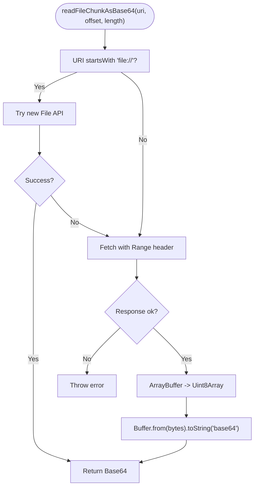
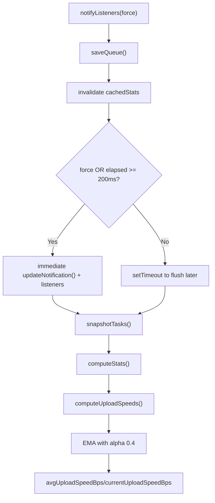
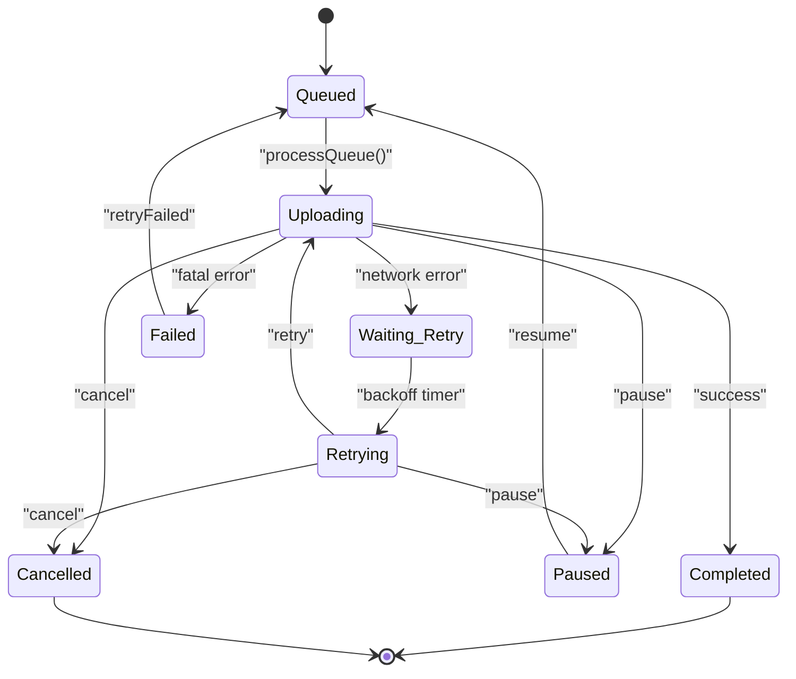
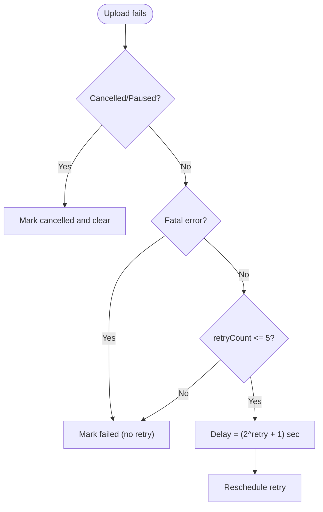
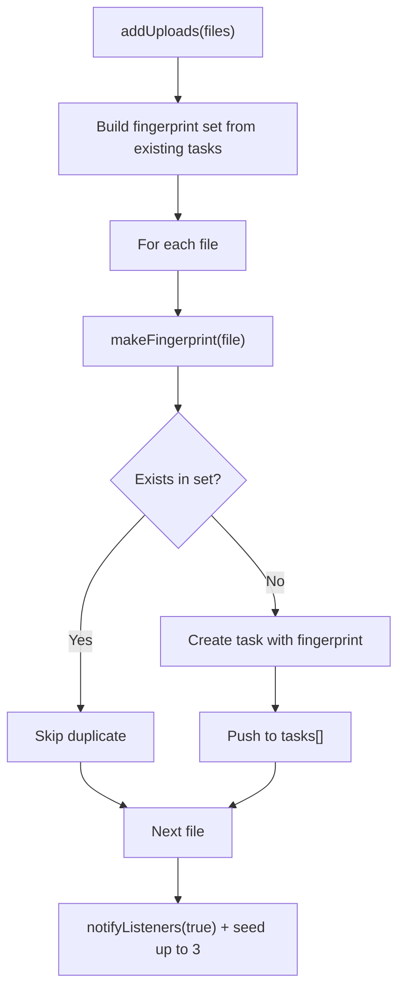
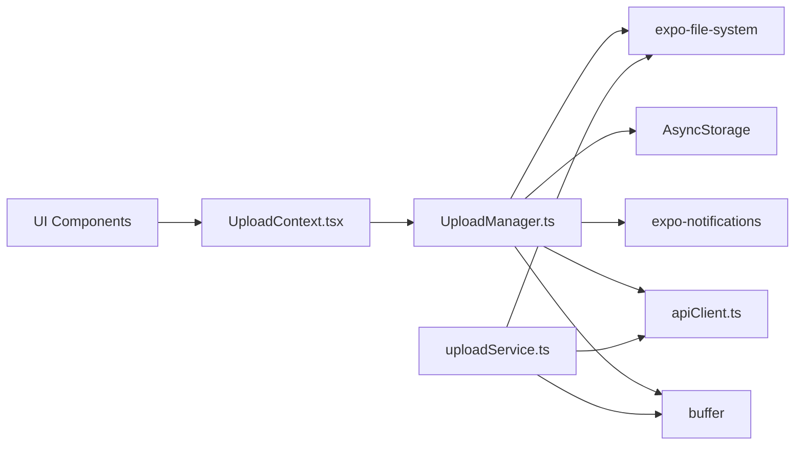

# Upload Performance Optimization

<cite>
**Referenced Files in This Document**
- [UploadManager.ts](file://app/src/services/UploadManager.ts)
- [uploadService.ts](file://app/src/services/uploadService.ts)
- [UploadContext.tsx](file://app/src/context/UploadContext.tsx)
- [apiClient.ts](file://app/src/services/apiClient.ts)
- [retry.ts](file://app/src/utils/retry.ts)
- [UploadProgressOverlay.tsx](file://app/src/components/UploadProgressOverlay.tsx)
- [UploadProgress.tsx](file://app/src/components/UploadProgress.tsx)
</cite>

## Table of Contents
1. [Introduction](#introduction)
2. [Project Structure](#project-structure)
3. [Core Components](#core-components)
4. [Architecture Overview](#architecture-overview)
5. [Detailed Component Analysis](#detailed-component-analysis)
6. [Dependency Analysis](#dependency-analysis)
7. [Performance Considerations](#performance-considerations)
8. [Troubleshooting Guide](#troubleshooting-guide)
9. [Conclusion](#conclusion)

## Introduction
This document focuses on upload performance optimization in the Axya application, covering chunked upload strategies, concurrent upload management, bandwidth optimization, and progress tracking. It explains the UploadManager’s 5 MB chunk size strategy, 3-concurrent upload limit, exponential backoff retry mechanism, and deduplication techniques. It documents the native file reading implementation using expo-file-system’s new File API, Base64 encoding optimizations, and progress tracking algorithms. It also covers performance metrics calculation, speed averaging using exponential moving average, memory management for large file operations, upload throttling, notification optimization, error handling strategies, upload queue management, task prioritization, and performance monitoring techniques.

## Project Structure
The upload system is centered around a singleton UploadManager that orchestrates background uploads, maintains a persistent queue, and exposes real-time progress and stats to React components via a context provider. Supporting services include a standalone upload helper for single-file uploads and API clients with retry logic. UI components render progress overlays and individual task cards.

**Diagram sources**
- [UploadManager.ts](file://app/src/services/UploadManager.ts#L126-L992)
- [uploadService.ts](file://app/src/services/uploadService.ts#L1-L207)
- [UploadContext.tsx](file://app/src/context/UploadContext.tsx#L1-L123)
- [apiClient.ts](file://app/src/services/apiClient.ts#L1-L164)
- [retry.ts](file://app/src/utils/retry.ts#L1-L34)

**Section sources**
- [UploadManager.ts](file://app/src/services/UploadManager.ts#L1-L120)
- [UploadContext.tsx](file://app/src/context/UploadContext.tsx#L1-L123)

## Core Components
- UploadManager: Singleton orchestrating chunked uploads, concurrency control, deduplication, exponential backoff, persistence, progress tracking, and notifications.
- uploadService: Standalone helper for single-file uploads with chunked Base64 encoding and polling.
- UploadContext: React context exposing aggregate stats and actions to UI.
- apiClient: Axios instances with interceptors for token injection, logging, and retry logic.
- retry: Utility determining retry eligibility for network errors and timeouts.
- UI components: Overlay and task cards rendering progress, stats, and actions.

**Section sources**
- [UploadManager.ts](file://app/src/services/UploadManager.ts#L126-L992)
- [uploadService.ts](file://app/src/services/uploadService.ts#L1-L207)
- [UploadContext.tsx](file://app/src/context/UploadContext.tsx#L1-L123)
- [apiClient.ts](file://app/src/services/apiClient.ts#L1-L164)
- [retry.ts](file://app/src/utils/retry.ts#L1-L34)

## Architecture Overview
The upload pipeline consists of:
- Queue ingestion with deduplication and persistence
- Concurrency gating with 3 simultaneous uploads
- Chunked upload using native File API with Base64 encoding
- Progress reporting via onUploadProgress and polling
- Exponential backoff retries and fatal error detection
- Android progress notifications and throttled UI updates

**Diagram sources**
- [UploadManager.ts](file://app/src/services/UploadManager.ts#L514-L981)
- [uploadService.ts](file://app/src/services/uploadService.ts#L67-L206)
- [apiClient.ts](file://app/src/services/apiClient.ts#L31-L164)

## Detailed Component Analysis

### UploadManager: Chunked Uploads, Concurrency, and Deduplication
- Chunk size: 5 MB constant across platforms.
- Concurrency: 3 simultaneous uploads using activeUploads count as the gate.
- Deduplication: fingerprint computed from file URI, name, and size; duplicates skipped.
- Native file reading: new File + FileHandle API for file:// URIs; fetch fallback for content:// URIs.
- Progress tracking: onUploadProgress with known chunk sizes; polling for Telegram delivery phase.
- Exponential backoff: up to 5 retries with 2^n second delays plus jitter.
- Persistence: AsyncStorage queue and historical stats; auto-clearing of completed/failed tasks.
- Notifications: Android progress notifications with throttling; completion/failure summaries.

**Diagram sources**
- [UploadManager.ts](file://app/src/services/UploadManager.ts#L29-L65)
- [UploadManager.ts](file://app/src/services/UploadManager.ts#L126-L992)

**Section sources**
- [UploadManager.ts](file://app/src/services/UploadManager.ts#L126-L992)

### Native File Reading and Base64 Encoding Optimizations
- New File API: file:// URIs use File.open() + FileHandle.readBytes() for efficient binary reads.
- Fallback: fetch() with Range header for content:// URIs and edge cases.
- Base64 conversion: Buffer-based conversion from Uint8Array to Base64 string.
- Memory: chunks are read incrementally; Base64 payload is transmitted per chunk.

**Diagram sources**
- [UploadManager.ts](file://app/src/services/UploadManager.ts#L92-L122)
- [uploadService.ts](file://app/src/services/uploadService.ts#L37-L63)

**Section sources**
- [UploadManager.ts](file://app/src/services/UploadManager.ts#L92-L122)
- [uploadService.ts](file://app/src/services/uploadService.ts#L37-L63)

### Progress Tracking and Speed Metrics
- Real progress: onUploadProgress uses known chunk sizes; polling updates progress for Telegram delivery phase.
- Speed computation: samples collected at throttle intervals; sliding window of 3 seconds; exponential moving average with alpha 0.4.
- Stats caching: invalidated on every notify; single-pass aggregation over tasks.

**Diagram sources**
- [UploadManager.ts](file://app/src/services/UploadManager.ts#L283-L310)
- [UploadManager.ts](file://app/src/services/UploadManager.ts#L314-L445)

**Section sources**
- [UploadManager.ts](file://app/src/services/UploadManager.ts#L283-L310)
- [UploadManager.ts](file://app/src/services/UploadManager.ts#L407-L445)

### Concurrent Upload Management and Queue Control
- Concurrency gate: activeUploads count determines whether to spawn another processQueue.
- Queue seeding: when adding new tasks, seed up to MAX_CONCURRENT processors.
- Task transitions: strict state machine prevents illegal transitions.
- AbortController per task: supports pause/resume/cancel with graceful cleanup.

**Diagram sources**
- [UploadManager.ts](file://app/src/services/UploadManager.ts#L154-L174)
- [UploadManager.ts](file://app/src/services/UploadManager.ts#L676-L760)

**Section sources**
- [UploadManager.ts](file://app/src/services/UploadManager.ts#L154-L174)
- [UploadManager.ts](file://app/src/services/UploadManager.ts#L676-L760)

### Exponential Backoff Retry Mechanism
- Max retries: 5 attempts.
- Delay: 2^(retryCount) + 1 seconds; increases exponentially.
- Fatal error detection: specific Telegram and schema errors are not retried.
- API-level retries: axios interceptors retry on network/server errors and timeouts.

**Diagram sources**
- [UploadManager.ts](file://app/src/services/UploadManager.ts#L717-L751)
- [apiClient.ts](file://app/src/services/apiClient.ts#L118-L127)
- [retry.ts](file://app/src/utils/retry.ts#L14-L33)

**Section sources**
- [UploadManager.ts](file://app/src/services/UploadManager.ts#L717-L751)
- [apiClient.ts](file://app/src/services/apiClient.ts#L118-L127)
- [retry.ts](file://app/src/utils/retry.ts#L14-L33)

### Deduplication Techniques
- Fingerprint: concatenation of file URI, name, and size.
- Pre-add deduplication: skip files already in the queue.
- Server-side deduplication: init endpoint returns duplicate flag; task marked as completed instantly.

**Diagram sources**
- [UploadManager.ts](file://app/src/services/UploadManager.ts#L514-L556)
- [UploadManager.ts](file://app/src/services/UploadManager.ts#L818-L825)

**Section sources**
- [UploadManager.ts](file://app/src/services/UploadManager.ts#L514-L556)
- [UploadManager.ts](file://app/src/services/UploadManager.ts#L818-L825)

### Bandwidth Optimization and Throttling
- Chunk size: 5 MB to balance throughput and memory usage.
- Throttled notifications: 200 ms interval to reduce React re-renders and UI churn.
- Speed window: 3 seconds sliding window for current speed; EMA smooths averages.
- UploadClient timeout: 10 minutes to avoid hanging uploads; UploadManager retries independently.

**Section sources**
- [UploadManager.ts](file://app/src/services/UploadManager.ts#L132-L135)
- [UploadManager.ts](file://app/src/services/UploadManager.ts#L418-L444)
- [apiClient.ts](file://app/src/services/apiClient.ts#L36-L42)

### Notification Optimization
- Android progress notifications: ongoing, indeterminate when progress is 0, progress bar updates.
- Completion/failure notifications: summarized counts and messages.
- Identifier reuse: single notification identifier for progress updates.

**Section sources**
- [UploadManager.ts](file://app/src/services/UploadManager.ts#L449-L510)

### Error Handling Strategies
- AbortController: supports pause/resume/cancel with immediate termination.
- Fatal error detection: Telegram-specific and schema errors are not retried.
- API-level retry: axios interceptors handle network/server errors and timeouts.
- Polling safety: recursive setTimeout prevents overlapping poll requests; abort signal cleanup.

**Section sources**
- [UploadManager.ts](file://app/src/services/UploadManager.ts#L764-L981)
- [apiClient.ts](file://app/src/services/apiClient.ts#L100-L132)
- [uploadService.ts](file://app/src/services/uploadService.ts#L154-L205)

### Upload Queue Management and Task Prioritization
- Priority: queued > retrying > paused > failed > completed > cancelled.
- Auto-resume: background wake triggers resumeAllBackground().
- Auto-clear: completed/failed tasks are removed after a short delay to keep UI clean.

**Section sources**
- [UploadManager.ts](file://app/src/services/UploadManager.ts#L154-L164)
- [UploadManager.ts](file://app/src/services/UploadManager.ts#L985-L987)
- [UploadManager.ts](file://app/src/services/UploadManager.ts#L662-L674)

### Performance Monitoring Techniques
- Aggregate stats: total files, uploaded count, queued, failed, active, uploading, paused, cancelled, total bytes, uploaded bytes, overall progress.
- Speed metrics: current upload speed and exponential moving average.
- UI overlay: animated progress bars, stats pills, and action buttons.

**Section sources**
- [UploadManager.ts](file://app/src/services/UploadManager.ts#L314-L405)
- [UploadProgressOverlay.tsx](file://app/src/components/UploadProgressOverlay.tsx#L29-L36)
- [UploadProgress.tsx](file://app/src/components/UploadProgress.tsx#L42-L103)

## Dependency Analysis
- UploadManager depends on:
  - expo-file-system for native file reading
  - AsyncStorage for queue persistence
  - expo-notifications for Android progress notifications
  - apiClient/uploadClient for HTTP requests
  - Buffer for Base64 encoding
- uploadService is a standalone helper with the same dependencies for single-file uploads.
- UploadContext subscribes to UploadManager and exposes stats/actions to UI.

**Diagram sources**
- [UploadManager.ts](file://app/src/services/UploadManager.ts#L20-L25)
- [uploadService.ts](file://app/src/services/uploadService.ts#L10-L13)
- [UploadContext.tsx](file://app/src/context/UploadContext.tsx#L12-L14)

**Section sources**
- [UploadManager.ts](file://app/src/services/UploadManager.ts#L20-L25)
- [uploadService.ts](file://app/src/services/uploadService.ts#L10-L13)
- [UploadContext.tsx](file://app/src/context/UploadContext.tsx#L12-L14)

## Performance Considerations
- Chunk size: 5 MB balances throughput and memory; larger chunks reduce overhead but increase memory pressure.
- Concurrency: 3 concurrent uploads aligns with server-side semaphore and reduces connection overhead.
- Throttling: 200 ms notification throttle prevents excessive React re-renders and UI churn.
- Speed averaging: 3-second sliding window with EMA alpha 0.4 provides responsive yet smooth metrics.
- Memory management: incremental chunk reads and Base64 payloads; consider streaming alternatives for extremely large files.
- Persistence: AsyncStorage queue survives app restarts; historical stats persist separately.
- UploadClient timeout: 10 minutes prevents hangs; UploadManager retries independently to avoid double-retry logic.

[No sources needed since this section provides general guidance]

## Troubleshooting Guide
- Duplicate uploads: Verify fingerprint uniqueness and init endpoint duplicate flag.
- Stalled uploads: Check UploadClient timeout and UploadManager retry logic.
- Progress not updating: Ensure onUploadProgress handlers and polling are active.
- Fatal errors: Telegram-specific and schema errors are not retried; inspect error messages.
- Notifications not appearing: Confirm notification scheduling and channel configuration.

**Section sources**
- [UploadManager.ts](file://app/src/services/UploadManager.ts#L818-L825)
- [UploadManager.ts](file://app/src/services/UploadManager.ts#L717-L751)
- [UploadManager.ts](file://app/src/services/UploadManager.ts#L919-L980)
- [UploadManager.ts](file://app/src/services/UploadManager.ts#L449-L510)

## Conclusion
The upload system employs a robust, production-ready design with chunked uploads, controlled concurrency, deduplication, and comprehensive progress tracking. The 5 MB chunk size, 3-concurrent limit, exponential backoff, and throttled notifications deliver reliable performance across diverse environments. The combination of native file reading, Base64 encoding, and polling ensures accurate progress and resilience against transient failures. The UI components provide real-time feedback, while persistence and auto-clearing keep the queue manageable.