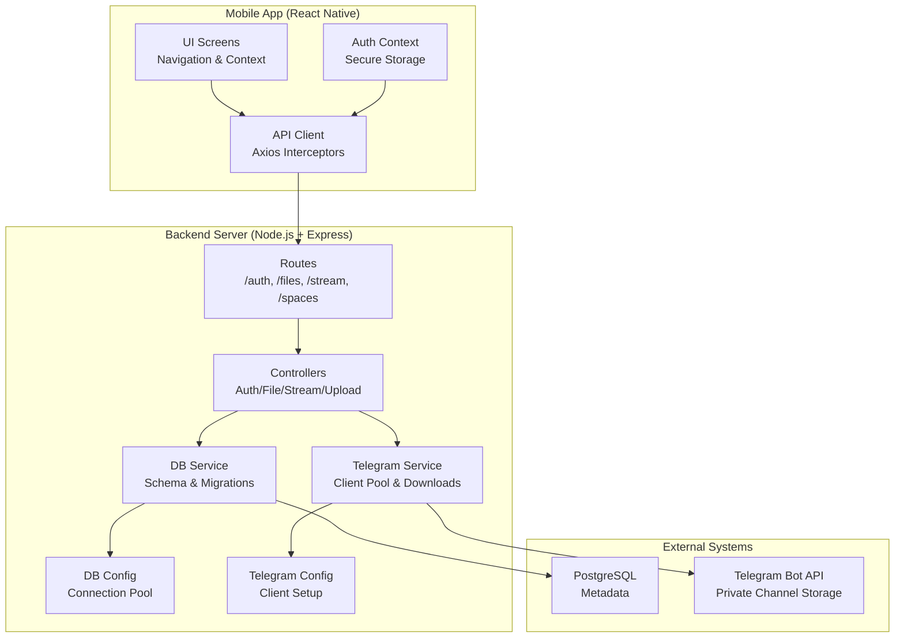
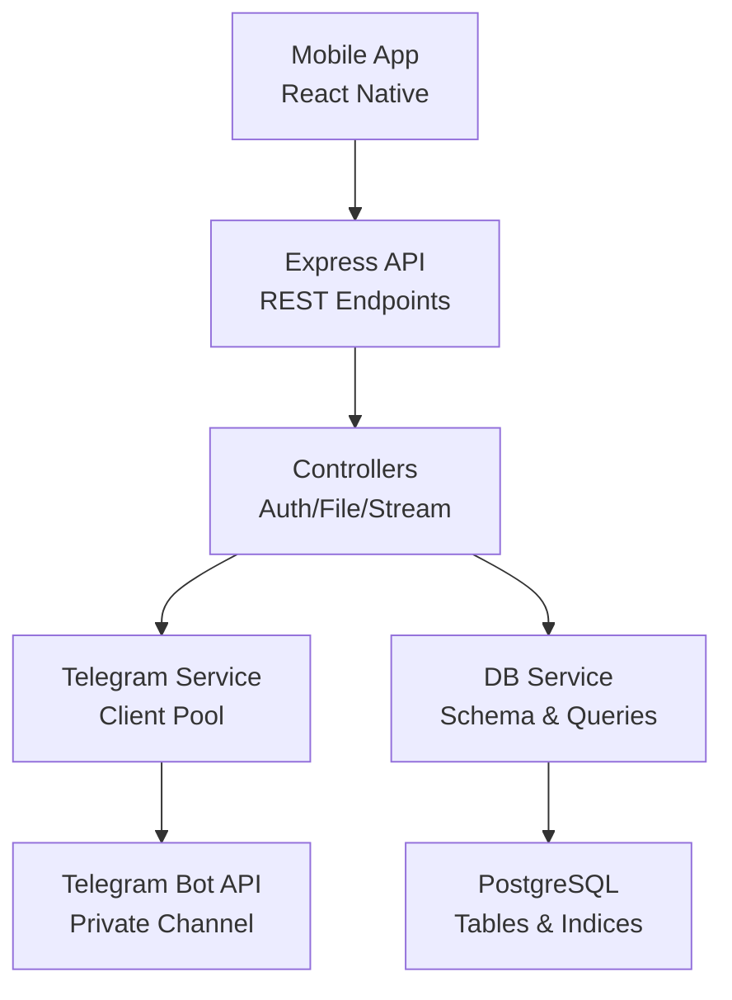
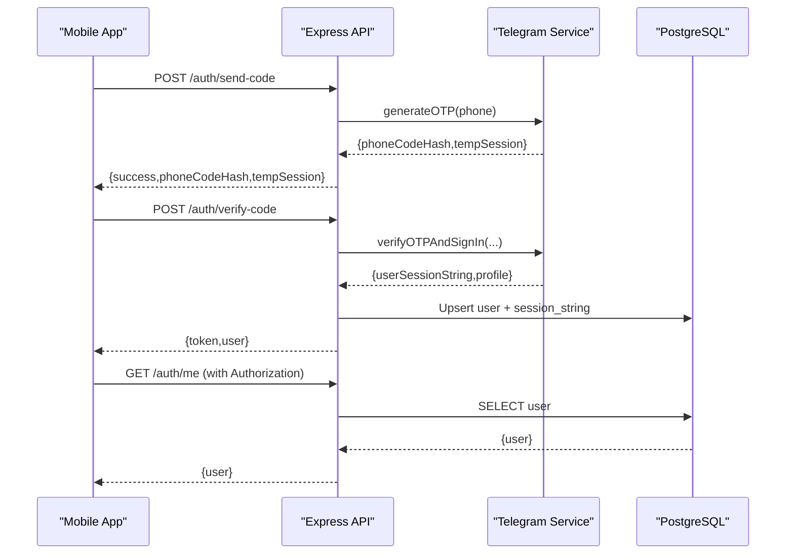
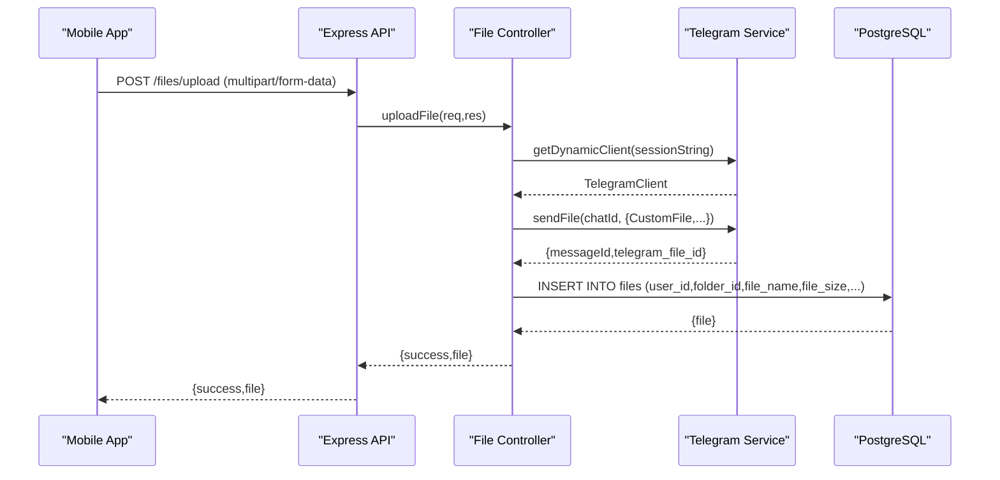
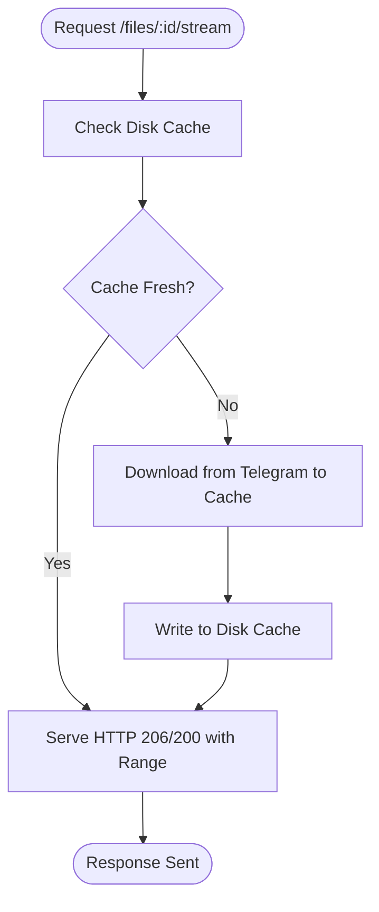
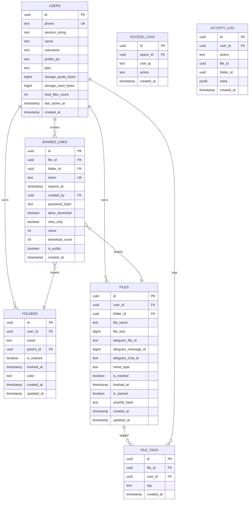
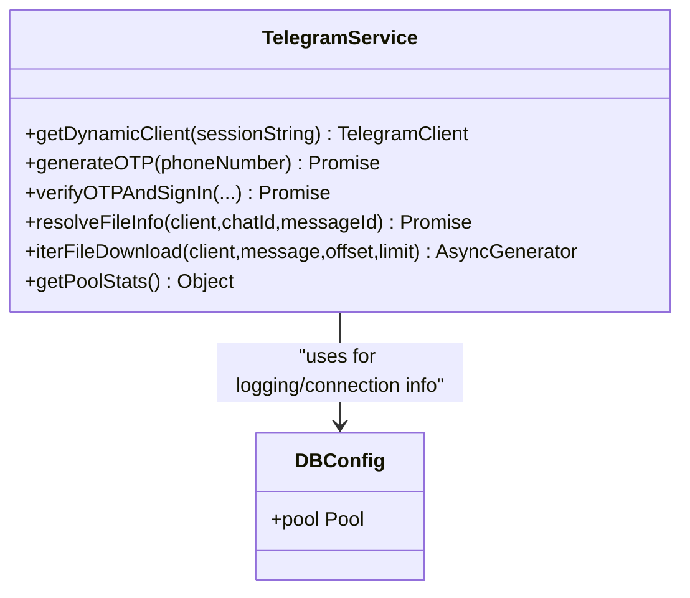
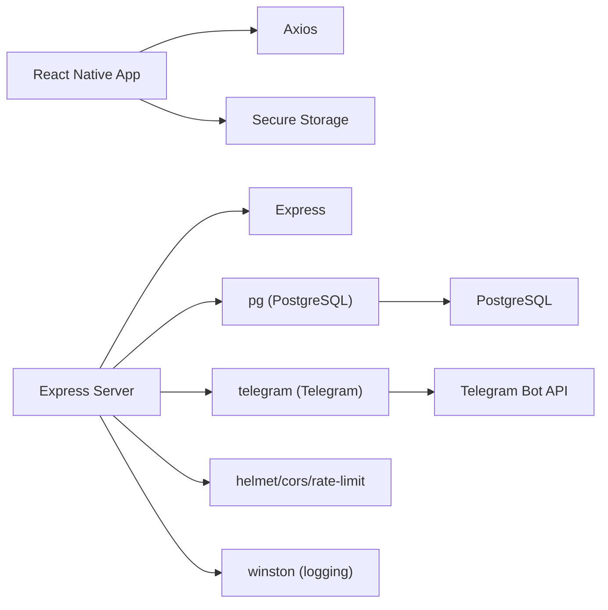

# Architecture Overview

<cite>
**Referenced Files in This Document**
- [README.md](file://README.md)
- [server/src/index.ts](file://server/src/index.ts)
- [server/src/config/db.ts](file://server/src/config/db.ts)
- [server/src/config/telegram.ts](file://server/src/config/telegram.ts)
- [server/src/services/db.service.ts](file://server/src/services/db.service.ts)
- [server/src/services/telegram.service.ts](file://server/src/services/telegram.service.ts)
- [server/src/controllers/file.controller.ts](file://server/src/controllers/file.controller.ts)
- [server/src/routes/file.routes.ts](file://server/src/routes/file.routes.ts)
- [server/src/controllers/auth.controller.ts](file://server/src/controllers/auth.controller.ts)
- [app/package.json](file://app/package.json)
- [server/package.json](file://server/package.json)
- [app/src/services/apiClient.ts](file://app/src/services/apiClient.ts)
- [app/src/context/AuthContext.tsx](file://app/src/context/AuthContext.tsx)
- [app/src/services/api.ts](file://app/src/services/api.ts)
</cite>

## Table of Contents
1. [Introduction](#introduction)
2. [Project Structure](#project-structure)
3. [Core Components](#core-components)
4. [Architecture Overview](#architecture-overview)
5. [Detailed Component Analysis](#detailed-component-analysis)
6. [Dependency Analysis](#dependency-analysis)
7. [Performance Considerations](#performance-considerations)
8. [Troubleshooting Guide](#troubleshooting-guide)
9. [Conclusion](#conclusion)

## Introduction
This document describes the system architecture of ANYX, a self-hosted cloud storage platform that turns a private Telegram channel into an unlimited storage backend while providing a modern React Native mobile app and a Node.js/Express backend. The backend persists metadata in PostgreSQL and orchestrates file lifecycle operations via the Telegram Bot/Client APIs. The system emphasizes ownership of data, self-hosting, and a mobile-first experience.

## Project Structure
The repository is organized into three primary areas:
- app: React Native mobile application with authentication, upload/download, and UI components
- server: Node.js/Express backend with routing, controllers, services, and database integration
- docs: Documentation and assets

**Diagram sources**
- [server/src/index.ts](file://server/src/index.ts#L1-L315)
- [server/src/routes/file.routes.ts](file://server/src/routes/file.routes.ts#L1-L118)
- [server/src/controllers/file.controller.ts](file://server/src/controllers/file.controller.ts#L1-L800)
- [server/src/services/telegram.service.ts](file://server/src/services/telegram.service.ts#L1-L260)
- [server/src/services/db.service.ts](file://server/src/services/db.service.ts#L1-L315)
- [server/src/config/db.ts](file://server/src/config/db.ts#L1-L61)
- [server/src/config/telegram.ts](file://server/src/config/telegram.ts#L1-L29)
- [app/src/services/apiClient.ts](file://app/src/services/apiClient.ts#L1-L164)
- [app/src/context/AuthContext.tsx](file://app/src/context/AuthContext.tsx#L1-L98)

**Section sources**
- [README.md](file://README.md#L225-L246)
- [server/src/index.ts](file://server/src/index.ts#L1-L315)
- [server/src/routes/file.routes.ts](file://server/src/routes/file.routes.ts#L1-L118)
- [server/src/controllers/file.controller.ts](file://server/src/controllers/file.controller.ts#L1-L800)
- [server/src/services/telegram.service.ts](file://server/src/services/telegram.service.ts#L1-L260)
- [server/src/services/db.service.ts](file://server/src/services/db.service.ts#L1-L315)
- [server/src/config/db.ts](file://server/src/config/db.ts#L1-L61)
- [server/src/config/telegram.ts](file://server/src/config/telegram.ts#L1-L29)
- [app/src/services/apiClient.ts](file://app/src/services/apiClient.ts#L1-L164)
- [app/src/context/AuthContext.tsx](file://app/src/context/AuthContext.tsx#L1-L98)

## Core Components
- Mobile App (React Native)
  - Authentication flow with secure token storage
  - REST API client with interceptors and retry logic
  - UI screens for files, folders, previews, and settings
- Backend Server (Node.js/Express)
  - Centralized middleware for security, CORS, rate limiting, and logging
  - Routing for authentication, file management, streaming, and shared spaces
  - Controllers implementing business logic for uploads, downloads, streaming, and metadata operations
  - Services for Telegram client pooling and PostgreSQL schema initialization
- PostgreSQL
  - Stores user profiles, files, folders, shared links, tags, and audit logs
  - Indexes and triggers optimize queries and maintain counters
- Telegram Bot API
  - Acts as the actual storage engine for files
  - Client pool enables efficient, persistent connections and progressive downloads

**Section sources**
- [app/package.json](file://app/package.json#L1-L59)
- [server/package.json](file://server/package.json#L1-L57)
- [server/src/index.ts](file://server/src/index.ts#L1-L315)
- [server/src/services/db.service.ts](file://server/src/services/db.service.ts#L1-L315)
- [server/src/services/telegram.service.ts](file://server/src/services/telegram.service.ts#L1-L260)

## Architecture Overview
ANYX follows a layered architecture:
- Presentation Layer: React Native mobile app
- Application Layer: Express routes and controllers
- Domain Layer: Business logic for uploads, downloads, streaming, and shared access
- Infrastructure Layer: PostgreSQL for metadata and Telegram for file storage

**Diagram sources**
- [server/src/index.ts](file://server/src/index.ts#L1-L315)
- [server/src/controllers/file.controller.ts](file://server/src/controllers/file.controller.ts#L1-L800)
- [server/src/services/telegram.service.ts](file://server/src/services/telegram.service.ts#L1-L260)
- [server/src/services/db.service.ts](file://server/src/services/db.service.ts#L1-L315)
- [server/src/config/db.ts](file://server/src/config/db.ts#L1-L61)
- [server/src/config/telegram.ts](file://server/src/config/telegram.ts#L1-L29)

## Detailed Component Analysis

### Mobile App Authentication Flow
The mobile app authenticates users via Telegram OTP and stores a JWT token securely. On startup, the app verifies the token against the backend and hydrates the UI accordingly.

**Diagram sources**
- [server/src/controllers/auth.controller.ts](file://server/src/controllers/auth.controller.ts#L1-L96)
- [server/src/services/telegram.service.ts](file://server/src/services/telegram.service.ts#L101-L160)
- [server/src/config/db.ts](file://server/src/config/db.ts#L1-L61)
- [app/src/context/AuthContext.tsx](file://app/src/context/AuthContext.tsx#L1-L98)
- [app/src/services/apiClient.ts](file://app/src/services/apiClient.ts#L1-L164)

**Section sources**
- [app/src/context/AuthContext.tsx](file://app/src/context/AuthContext.tsx#L1-L98)
- [app/src/services/apiClient.ts](file://app/src/services/apiClient.ts#L1-L164)
- [server/src/controllers/auth.controller.ts](file://server/src/controllers/auth.controller.ts#L1-L96)
- [server/src/services/telegram.service.ts](file://server/src/services/telegram.service.ts#L101-L160)
- [server/src/config/db.ts](file://server/src/config/db.ts#L1-L61)

### File Upload Pipeline
The upload pipeline streams files to Telegram via the Telegram client and records metadata in PostgreSQL.

**Diagram sources**
- [server/src/controllers/file.controller.ts](file://server/src/controllers/file.controller.ts#L49-L98)
- [server/src/services/telegram.service.ts](file://server/src/services/telegram.service.ts#L57-L97)
- [server/src/config/db.ts](file://server/src/config/db.ts#L1-L61)

**Section sources**
- [server/src/controllers/file.controller.ts](file://server/src/controllers/file.controller.ts#L49-L98)
- [server/src/services/telegram.service.ts](file://server/src/services/telegram.service.ts#L57-L97)
- [server/src/config/db.ts](file://server/src/config/db.ts#L1-L61)

### Streaming and Thumbnail Generation
Streaming avoids buffering by caching downloaded media to disk and serving HTTP Range requests. Thumbnails are generated efficiently using Telegram’s native thumbnails or on-demand compression.

**Diagram sources**
- [server/src/controllers/file.controller.ts](file://server/src/controllers/file.controller.ts#L544-L689)
- [server/src/services/telegram.service.ts](file://server/src/services/telegram.service.ts#L215-L251)

**Section sources**
- [server/src/controllers/file.controller.ts](file://server/src/controllers/file.controller.ts#L544-L689)
- [server/src/services/telegram.service.ts](file://server/src/services/telegram.service.ts#L215-L251)

### Data Model and Schema
PostgreSQL stores all metadata, including users, files, folders, shared links, tags, and audit logs. Migrations ensure schema integrity and indexes optimize common queries.

**Diagram sources**
- [server/src/services/db.service.ts](file://server/src/services/db.service.ts#L3-L137)

**Section sources**
- [server/src/services/db.service.ts](file://server/src/services/db.service.ts#L3-L137)

### Telegram Client Pool and Progressive Downloads
The Telegram service maintains a persistent client pool keyed by session fingerprint, enabling long-lived connections for streaming and reducing re-auth overhead. Downloads use iterative chunking to avoid full buffering.

**Diagram sources**
- [server/src/services/telegram.service.ts](file://server/src/services/telegram.service.ts#L1-L260)
- [server/src/config/db.ts](file://server/src/config/db.ts#L1-L61)

**Section sources**
- [server/src/services/telegram.service.ts](file://server/src/services/telegram.service.ts#L1-L260)
- [server/src/config/db.ts](file://server/src/config/db.ts#L1-L61)

## Dependency Analysis
- Mobile app depends on:
  - Axios for HTTP requests
  - Secure storage for JWT
  - Navigation and UI libraries
- Backend depends on:
  - Express for routing and middleware
  - node-telegram-bot-api/telegram for Telegram integration
  - pg for PostgreSQL connectivity
  - bcryptjs, helmet, cors, rate-limit for security and resilience
- External dependencies:
  - Telegram Bot API for storage
  - PostgreSQL for metadata persistence

**Diagram sources**
- [app/package.json](file://app/package.json#L1-L59)
- [server/package.json](file://server/package.json#L1-L57)
- [server/src/index.ts](file://server/src/index.ts#L1-L315)

**Section sources**
- [app/package.json](file://app/package.json#L1-L59)
- [server/package.json](file://server/package.json#L1-L57)
- [server/src/index.ts](file://server/src/index.ts#L1-L315)

## Performance Considerations
- Streaming and caching
  - Disk cache for streams reduces repeated Telegram downloads and supports HTTP Range requests
  - Thumbnail cache avoids recompression and redundant downloads
- Client pooling
  - Persistent Telegram clients reduce handshake overhead and improve throughput for media playback
- Database tuning
  - Connection pool limits and timeouts prevent resource exhaustion on free tiers
  - Indexes on frequently queried columns accelerate listing and search
- Resilience
  - Retry logic in the mobile app and backend mitigates transient failures
  - Graceful degradation for optional features (e.g., thumbnail generation)

[No sources needed since this section provides general guidance]

## Troubleshooting Guide
- Authentication failures
  - Verify Telegram API credentials and session storage
  - Confirm JWT secret and token validity
- Upload/download issues
  - Check Telegram client pool status and session revocation
  - Inspect disk cache directories and permissions
- Database connectivity
  - Validate DATABASE_URL and SSL mode
  - Monitor pool errors and connection timeouts
- Streaming problems
  - Ensure cache TTL and disk space availability
  - Review Range request handling and partial content responses

**Section sources**
- [server/src/controllers/auth.controller.ts](file://server/src/controllers/auth.controller.ts#L1-L96)
- [server/src/services/telegram.service.ts](file://server/src/services/telegram.service.ts#L255-L260)
- [server/src/config/db.ts](file://server/src/config/db.ts#L39-L58)
- [server/src/controllers/file.controller.ts](file://server/src/controllers/file.controller.ts#L544-L689)

## Conclusion
ANYX achieves unlimited, private, self-hosted storage by leveraging Telegram as the backend while managing structure and access through a robust Node.js/Express backend and a modern React Native frontend. PostgreSQL ensures reliable metadata persistence, and the Telegram client pool enables efficient streaming and downloads. The layered architecture, combined with thoughtful caching and resilience strategies, delivers a scalable and user-friendly cloud storage solution.