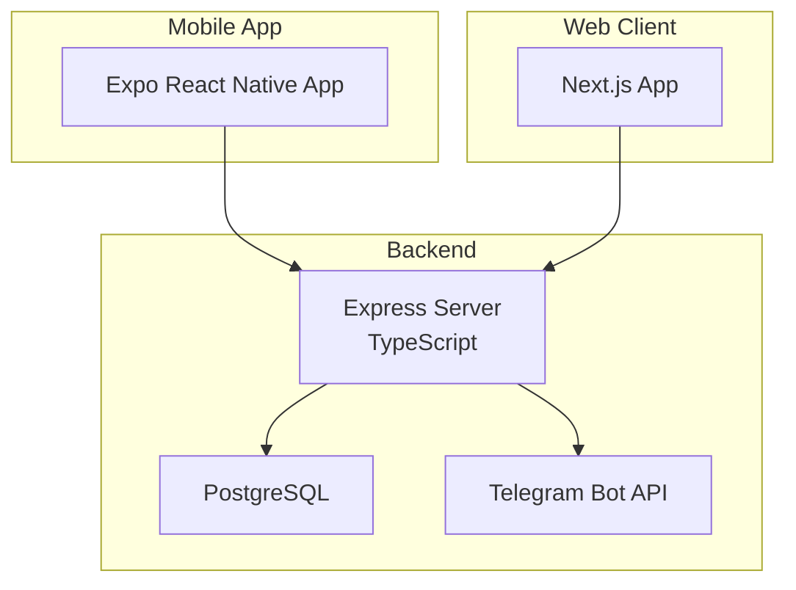
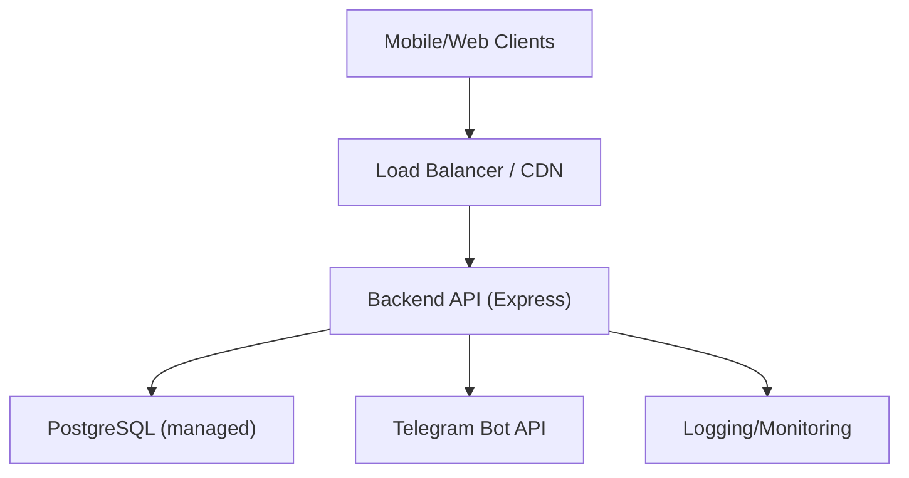
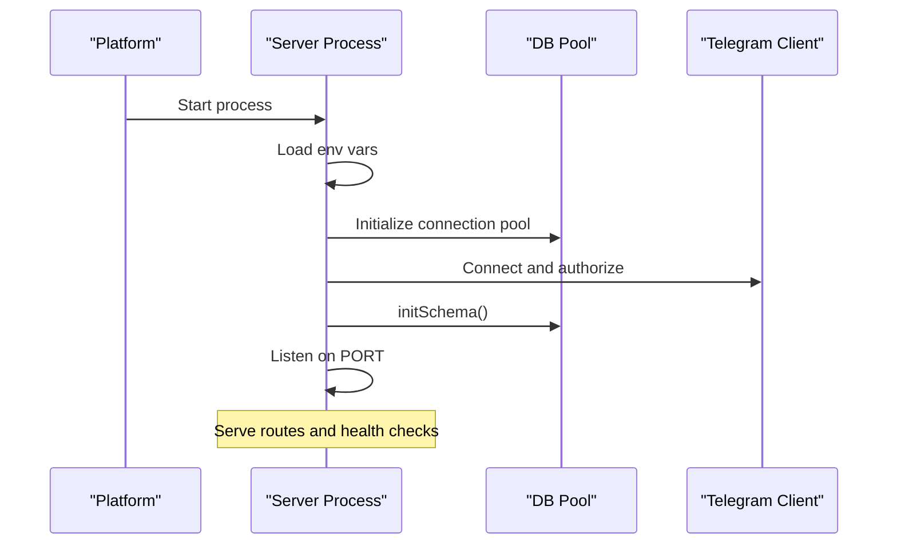
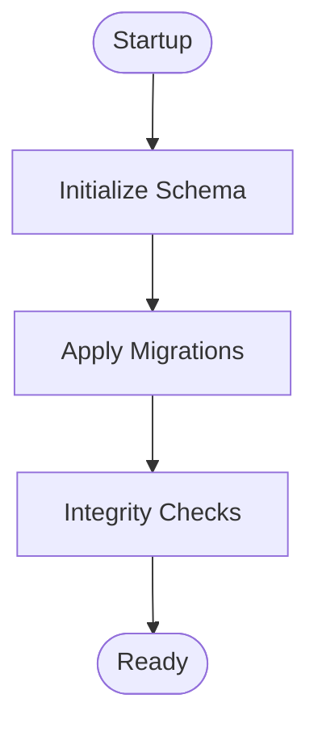
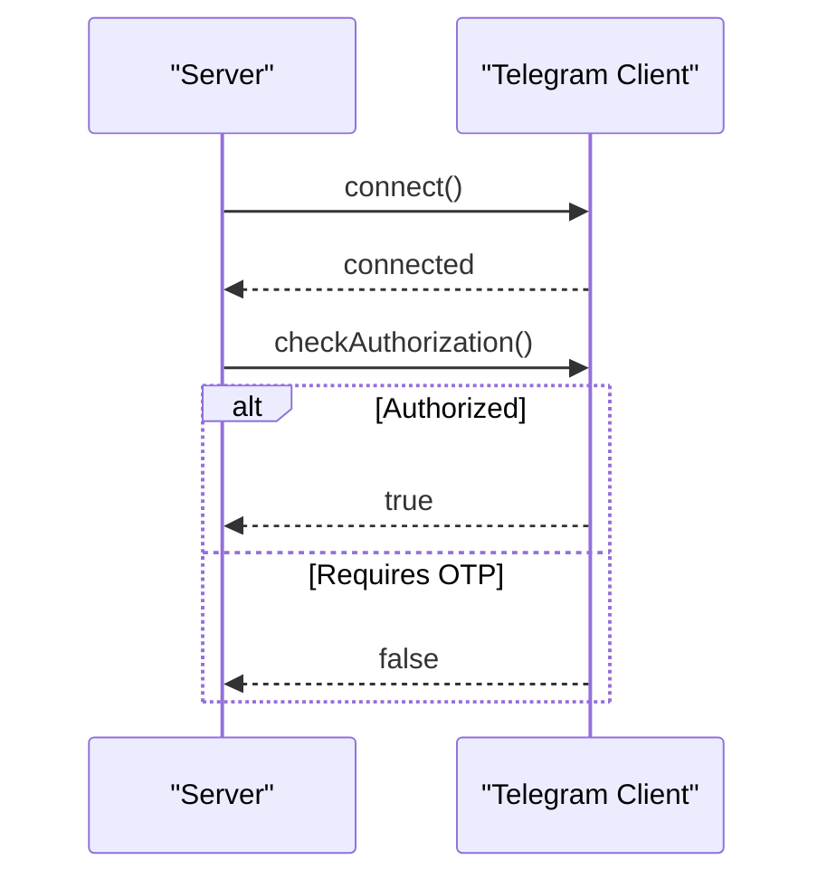
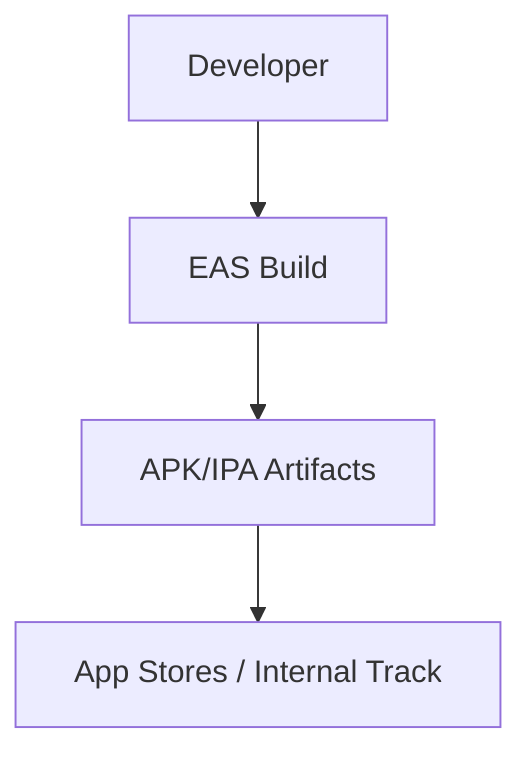
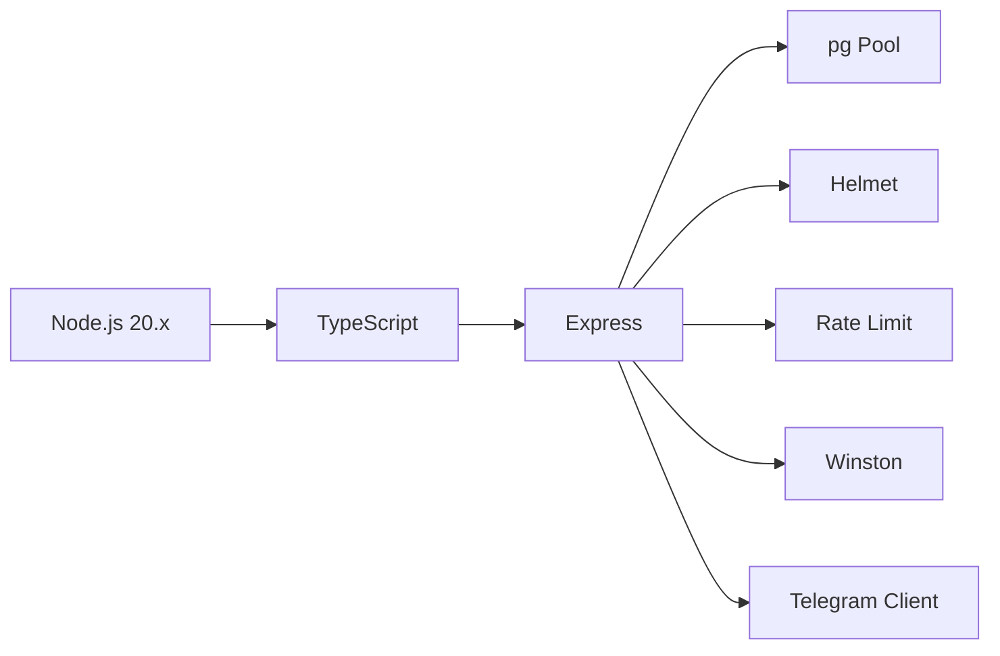

# Deployment Guide

<cite>
**Referenced Files in This Document**
- [README.md](file://README.md)
- [package.json](file://package.json)
- [Procfile](file://Procfile)
- [app.json](file://app.json)
- [eas.json](file://eas.json)
- [server/package.json](file://server/package.json)
- [web/package.json](file://web/package.json)
- [server/src/index.ts](file://server/src/index.ts)
- [server/src/config/db.ts](file://server/src/config/db.ts)
- [server/src/config/telegram.ts](file://server/src/config/telegram.ts)
- [server/src/services/db.service.ts](file://server/src/services/db.service.ts)
- [server/tsconfig.json](file://server/tsconfig.json)
- [server/src/db/index.ts](file://server/src/db/index.ts)
</cite>

## Table of Contents
1. [Introduction](#introduction)
2. [Project Structure](#project-structure)
3. [Core Components](#core-components)
4. [Architecture Overview](#architecture-overview)
5. [Detailed Component Analysis](#detailed-component-analysis)
6. [Dependency Analysis](#dependency-analysis)
7. [Performance Considerations](#performance-considerations)
8. [Troubleshooting Guide](#troubleshooting-guide)
9. [Conclusion](#conclusion)
10. [Appendices](#appendices)

## Introduction
This deployment guide explains how to deploy ANYX to production environments. It covers backend hosting options, database providers, Telegram bot configuration, and mobile app distribution using EAS build. It also provides production configuration recommendations, security considerations, SSL setup, monitoring approaches, scaling guidance, and step-by-step deployment processes tailored to popular platforms.

## Project Structure
ANYX consists of:
- Backend API server (Node.js + Express) with TypeScript
- PostgreSQL database for metadata
- Telegram Bot API for storage
- Mobile app (Expo React Native) and optional Next.js web client
- CI/CD pipeline artifacts and build configurations

**Diagram sources**
- [server/src/index.ts](file://server/src/index.ts#L1-L315)
- [server/src/config/db.ts](file://server/src/config/db.ts#L1-L61)
- [server/src/config/telegram.ts](file://server/src/config/telegram.ts#L1-L29)
- [web/package.json](file://web/package.json#L1-L21)

**Section sources**
- [README.md](file://README.md#L72-L99)
- [server/src/index.ts](file://server/src/index.ts#L1-L315)
- [web/package.json](file://web/package.json#L1-L21)

## Core Components
- Backend API server
  - Express-based REST API with TypeScript
  - Security middleware (Helmet), CORS, rate limiting, health check
  - Telegram client integration and session management
  - PostgreSQL connection pool with SSL and pooling tuned for free tiers
  - Schema initialization and migrations
- Database
  - PostgreSQL schema for users, files, folders, shared links, shared spaces, logs
  - Migrations with integrity checks and triggers
- Telegram integration
  - Telegram client configured via API ID/Hash and session string
  - Automatic reconnection and authorization checks
- Mobile app
  - Expo-based app with EAS build configuration
  - Distribution via internal and production builds
- Optional web client
  - Next.js app for browser-based access

**Section sources**
- [server/src/index.ts](file://server/src/index.ts#L25-L110)
- [server/src/config/db.ts](file://server/src/config/db.ts#L27-L37)
- [server/src/config/telegram.ts](file://server/src/config/telegram.ts#L7-L14)
- [server/src/services/db.service.ts](file://server/src/services/db.service.ts#L3-L137)
- [eas.json](file://eas.json#L1-L22)
- [web/package.json](file://web/package.json#L1-L21)

## Architecture Overview
Production-grade deployment requires:
- Backend hosting on platforms that support Node.js and environment variables
- Managed PostgreSQL-compatible databases (Neon, Supabase, or managed PostgreSQL)
- Telegram bot configured with a session string and channel ID
- EAS build for Android/iOS distribution
- HTTPS termination at platform edge or reverse proxy
- Monitoring and health checks

**Diagram sources**
- [server/src/index.ts](file://server/src/index.ts#L43-L98)
- [server/src/config/db.ts](file://server/src/config/db.ts#L14-L37)
- [server/src/config/telegram.ts](file://server/src/config/telegram.ts#L12-L14)

## Detailed Component Analysis

### Backend API Deployment
- Platform options
  - Railway, Render, Fly.io, VPS
  - Ensure Node.js runtime alignment and environment variable support
- Build and start
  - Use the provided scripts to build and start the server
  - The repository defines a Procfile that starts the server from the server directory
- Environment variables
  - Required keys include PORT, DATABASE_URL, TELEGRAM_API_ID, TELEGRAM_API_HASH, TELEGRAM_SESSION, TELEGRAM_CHANNEL_ID, JWT_SECRET, ALLOWED_ORIGINS, COOKIE_SECRET
  - SSL mode is enforced for non-local deployments
- Security and middleware
  - Helmet CSP with nonce-based script-src
  - CORS configured per ALLOWED_ORIGINS with broad allowance for share endpoints
  - Global rate limiter and stricter auth limiter
  - Health endpoint for keep-alive and monitoring
- Initialization
  - On startup, the server cleans orphaned upload temp directories, initializes schema, and starts listening

**Diagram sources**
- [server/src/index.ts](file://server/src/index.ts#L295-L312)
- [server/src/config/db.ts](file://server/src/config/db.ts#L27-L37)
- [server/src/config/telegram.ts](file://server/src/config/telegram.ts#L16-L28)

**Section sources**
- [README.md](file://README.md#L323-L346)
- [server/src/index.ts](file://server/src/index.ts#L25-L110)
- [server/src/index.ts](file://server/src/index.ts#L222-L236)
- [server/src/index.ts](file://server/src/index.ts#L295-L312)
- [server/src/config/db.ts](file://server/src/config/db.ts#L14-L37)
- [server/src/config/telegram.ts](file://server/src/config/telegram.ts#L7-L14)
- [Procfile](file://Procfile#L1-L2)
- [package.json](file://package.json#L2-L5)

### Database Setup and Migration
- Provider options
  - Neon, Supabase, or managed PostgreSQL
  - DATABASE_URL must be set; SSL mode is automatically appended for remote connections
- Connection tuning
  - Max 5 connections, short idle timeout, and connection timeout suited for free-tier environments
  - One warm connection kept to reduce cold-start latency
- Schema and migrations
  - Initial schema creation with tables for users, files, folders, shared links, shared spaces, logs
  - Extensive migrations including indexes, constraints, triggers, and integrity checks
  - Integrity verification ensures critical constraints and indexes exist post-migration
- Local development fallback
  - A separate local DB initializer exists for development scenarios

**Diagram sources**
- [server/src/services/db.service.ts](file://server/src/services/db.service.ts#L3-L137)
- [server/src/services/db.service.ts](file://server/src/services/db.service.ts#L276-L312)
- [server/src/config/db.ts](file://server/src/config/db.ts#L27-L37)

**Section sources**
- [server/src/config/db.ts](file://server/src/config/db.ts#L6-L37)
- [server/src/services/db.service.ts](file://server/src/services/db.service.ts#L3-L137)
- [server/src/services/db.service.ts](file://server/src/services/db.service.ts#L276-L312)
- [server/src/db/index.ts](file://server/src/db/index.ts#L1-L56)

### Telegram Bot Configuration
- Required environment variables
  - TELEGRAM_API_ID, TELEGRAM_API_HASH, TELEGRAM_SESSION, TELEGRAM_CHANNEL_ID
- Client behavior
  - Connects with retry attempts and checks authorization state
  - Uses a persistent session string to avoid repeated login
- Operational notes
  - Ensure the session string corresponds to a logged-in Telegram client authorized to post to the target channel

**Diagram sources**
- [server/src/config/telegram.ts](file://server/src/config/telegram.ts#L16-L28)

**Section sources**
- [server/src/config/telegram.ts](file://server/src/config/telegram.ts#L7-L14)
- [server/src/config/telegram.ts](file://server/src/config/telegram.ts#L16-L28)

### Mobile App Building and Publishing (EAS)
- Build configuration
  - EAS build profiles for development, preview, and production
  - Production builds auto-increment version
- Project identifiers
  - Android package name and EAS project ID are defined in app configuration
- Distribution
  - Internal distribution for development and preview
  - Production distribution handled via EAS Submit

**Diagram sources**
- [eas.json](file://eas.json#L6-L16)
- [app.json](file://app.json#L3-L10)

**Section sources**
- [eas.json](file://eas.json#L1-L22)
- [app.json](file://app.json#L1-L13)

### Web Client Deployment (Optional)
- Next.js app runs on port 3001 in development
- Build and start scripts are provided
- Intended for browser-based access alongside the mobile app

**Section sources**
- [web/package.json](file://web/package.json#L5-L8)

## Dependency Analysis
- Backend runtime and toolchain
  - Node.js 20.x required by server package engines
  - TypeScript compilation and runtime dependencies
- Database connectivity
  - pg connection pool with environment-driven configuration
- Telegram integration
  - telegram and node-telegram-bot-api clients
- Security and observability
  - helmet, cors, express-rate-limit, winston logger
- Packaging and orchestration
  - Root package.json scripts to build and start server
  - Procfile for platform deployment

**Diagram sources**
- [server/package.json](file://server/package.json#L16-L18)
- [server/package.json](file://server/package.json#L19-L41)
- [server/tsconfig.json](file://server/tsconfig.json#L1-L13)
- [package.json](file://package.json#L2-L5)

**Section sources**
- [server/package.json](file://server/package.json#L16-L18)
- [server/package.json](file://server/package.json#L19-L41)
- [server/tsconfig.json](file://server/tsconfig.json#L1-L13)
- [package.json](file://package.json#L2-L5)

## Performance Considerations
- Database pooling
  - Max 5 connections, short idle timeout, and warm connection to minimize cold-starts on free tiers
- Request sizing
  - JSON body limit reduced to 10MB to align with chunked uploads
- Rate limiting
  - Global limit raised to accommodate batch uploads; auth endpoints have stricter limits
- Health checks
  - Dedicated /health endpoint supports keep-alive and monitoring
- Memory and graceful shutdown
  - Uncaught exception and rejection handlers to prevent crashes
  - Graceful shutdown closes DB connections

**Section sources**
- [server/src/config/db.ts](file://server/src/config/db.ts#L27-L37)
- [server/src/index.ts](file://server/src/index.ts#L80-L98)
- [server/src/index.ts](file://server/src/index.ts#L222-L236)
- [server/src/index.ts](file://server/src/index.ts#L251-L272)

## Troubleshooting Guide
- Database connectivity
  - Missing DATABASE_URL or SSL misconfiguration leads to connection errors; ensure sslmode=require for remote DBs
  - Pool emits warnings for unexpected disconnects; server reconnects automatically
- Telegram client
  - If authorization fails, verify API ID/Hash and session string; client may require OTP
- CORS and origins
  - ALLOWED_ORIGINS controls trusted origins; share endpoints relax CORS intentionally
- Health and logs
  - Use /health to confirm liveness; review server logs for unhandled exceptions and rate-limit messages

**Section sources**
- [server/src/config/db.ts](file://server/src/config/db.ts#L9-L12)
- [server/src/config/db.ts](file://server/src/config/db.ts#L40-L52)
- [server/src/config/telegram.ts](file://server/src/config/telegram.ts#L25-L28)
- [server/src/index.ts](file://server/src/index.ts#L63-L77)
- [server/src/index.ts](file://server/src/index.ts#L222-L236)

## Conclusion
Deploying ANYX to production involves configuring the backend with environment variables, provisioning a managed PostgreSQL database, setting up a Telegram bot with a session string, and building/publishing the mobile app via EAS. Follow the platform-specific steps below, apply production hardening (HTTPS, secrets management, monitoring), and validate with health checks and logs.

## Appendices

### Production Configuration Recommendations
- Environment variables
  - PORT, DATABASE_URL, TELEGRAM_API_ID, TELEGRAM_API_HASH, TELEGRAM_SESSION, TELEGRAM_CHANNEL_ID, JWT_SECRET, ALLOWED_ORIGINS, COOKIE_SECRET
- HTTPS and SSL
  - Enforce HTTPS in production; platforms typically terminate TLS at the edge
  - DATABASE_URL includes sslmode=require for managed DBs
- Secrets management
  - Store tokens and secrets in platform-provided secret managers
- CORS and cookies
  - Set ALLOWED_ORIGINS to your domains; ensure credentials-enabled CORS where required
- Rate limiting and security
  - Keep global and auth rate limits as configured; adjust only if necessary

**Section sources**
- [server/src/config/db.ts](file://server/src/config/db.ts#L14-L20)
- [server/src/index.ts](file://server/src/index.ts#L63-L77)
- [server/src/index.ts](file://server/src/index.ts#L85-L98)

### Backend Hosting Options
- Railway
  - Node.js app with environment variables; use the Procfile to start the server
- Render
  - Node.js service; set DATABASE_URL in the Environment tab; enable HTTPS
- Fly.io
  - Node.js app; configure environment variables and volumes for uploads if needed
- VPS
  - Install Node.js 20.x, clone repo, set environment variables, and run the server

**Section sources**
- [README.md](file://README.md#L327-L332)
- [Procfile](file://Procfile#L1-L2)

### Database Providers
- Neon
  - Serverless PostgreSQL; DATABASE_URL includes sslmode=require
- Supabase
  - Managed PostgreSQL; DATABASE_URL compatible with pg pool
- PostgreSQL
  - Managed or self-hosted; ensure sslmode=require for remote connections

**Section sources**
- [README.md](file://README.md#L334-L338)
- [server/src/config/db.ts](file://server/src/config/db.ts#L14-L20)

### Telegram Bot Setup
- Create a Telegram Bot and obtain token
- Generate a session string for a logged-in Telegram client authorized to post to your channel
- Set TELEGRAM_API_ID, TELEGRAM_API_HASH, TELEGRAM_SESSION, TELEGRAM_CHANNEL_ID

**Section sources**
- [server/src/config/telegram.ts](file://server/src/config/telegram.ts#L7-L14)

### Mobile App Distribution Using EAS Build
- Configure eas.json for development, preview, and production builds
- Use app.json for Android package and EAS project ID
- Build and submit via EAS Build and EAS Submit

**Section sources**
- [eas.json](file://eas.json#L1-L22)
- [app.json](file://app.json#L1-L13)

### Monitoring and Observability
- Health endpoint
  - Use /health for uptime, memory, and service status
- Logging
  - Winston logger captures structured logs; integrate with platform logging
- Error handling
  - Global error handler and uncaught exception/rejection handlers prevent silent failures

**Section sources**
- [server/src/index.ts](file://server/src/index.ts#L222-L236)
- [server/src/index.ts](file://server/src/index.ts#L238-L249)
- [server/src/index.ts](file://server/src/index.ts#L264-L272)

### Scaling Considerations
- Horizontal scaling
  - Stateless backend; scale replicas behind a load balancer
  - Use managed PostgreSQL with read replicas if needed
- Connection pooling
  - Keep max connections low for free tiers; increase cautiously with paid plans
- Uploads and temp storage
  - Ensure temporary upload directories are cleaned and persisted appropriately
- CDN and caching
  - Offload static assets and thumbnails via CDN where supported

**Section sources**
- [server/src/config/db.ts](file://server/src/config/db.ts#L27-L37)
- [server/src/index.ts](file://server/src/index.ts#L276-L293)