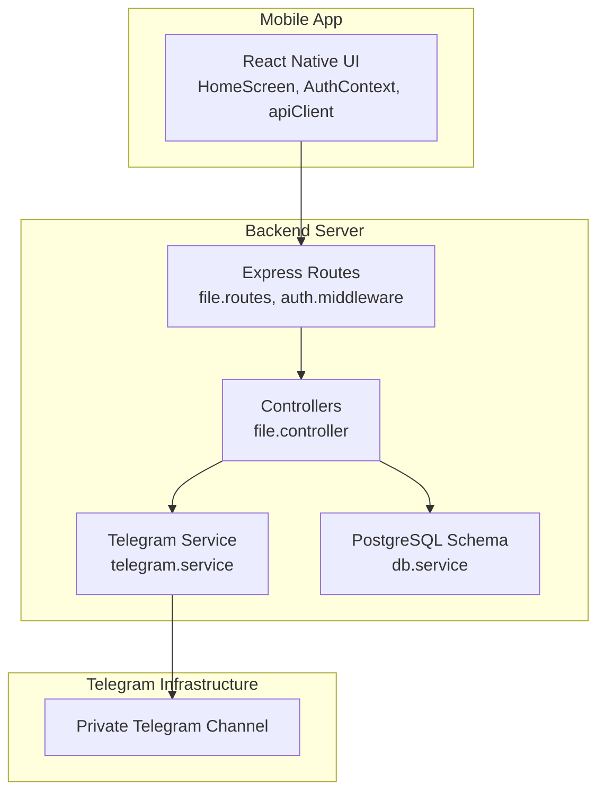
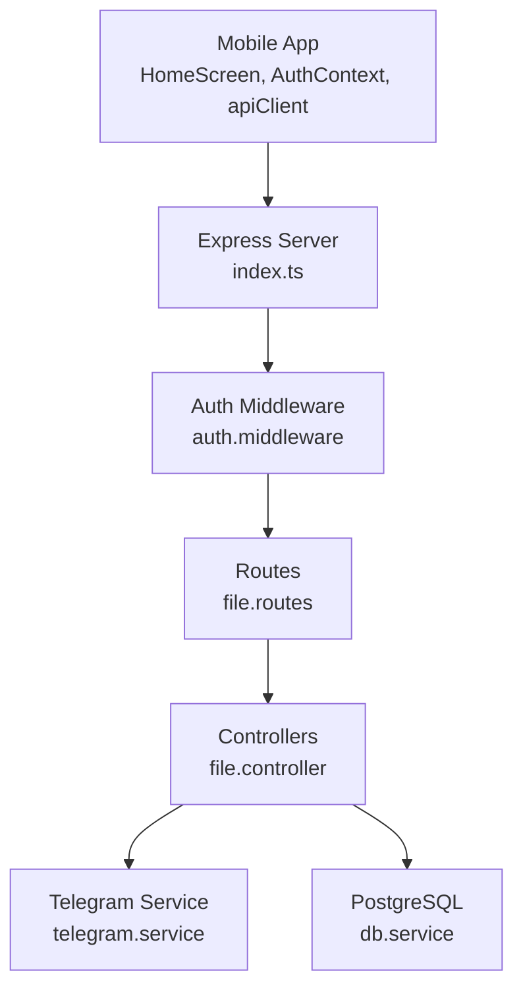
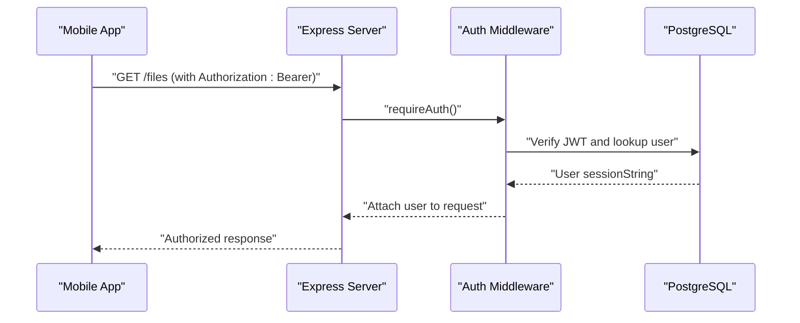
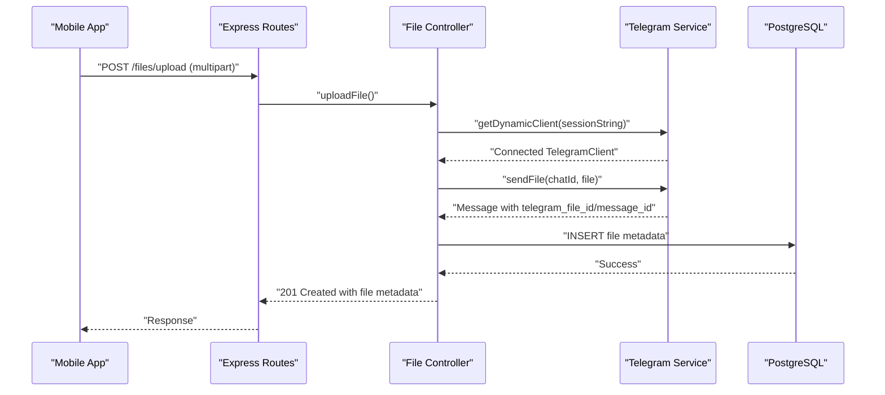
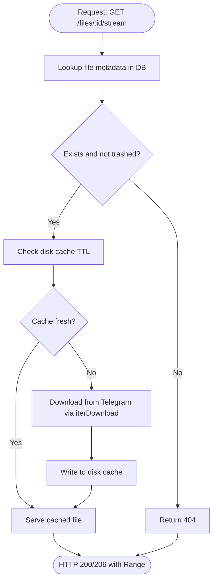
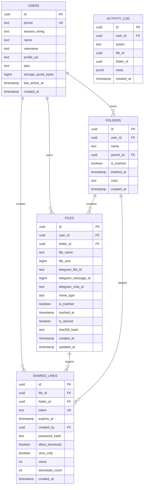
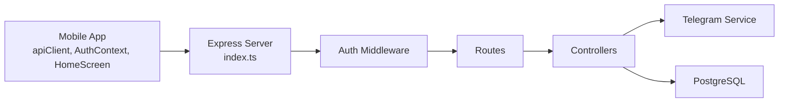

# Introduction and Purpose

<cite>
**Referenced Files in This Document**
- [README.md](file://README.md)
- [server/src/index.ts](file://server/src/index.ts)
- [server/src/services/telegram.service.ts](file://server/src/services/telegram.service.ts)
- [server/src/controllers/file.controller.ts](file://server/src/controllers/file.controller.ts)
- [server/src/routes/file.routes.ts](file://server/src/routes/file.routes.ts)
- [server/src/middlewares/auth.middleware.ts](file://server/src/middlewares/auth.middleware.ts)
- [server/src/services/db.service.ts](file://server/src/services/db.service.ts)
- [app/src/services/apiClient.ts](file://app/src/services/apiClient.ts)
- [app/src/context/AuthContext.tsx](file://app/src/context/AuthContext.tsx)
- [app/src/screens/HomeScreen.tsx](file://app/src/screens/HomeScreen.tsx)
</cite>

## Table of Contents
1. [Introduction](#introduction)
2. [Project Structure](#project-structure)
3. [Core Components](#core-components)
4. [Architecture Overview](#architecture-overview)
5. [Detailed Component Analysis](#detailed-component-analysis)
6. [Dependency Analysis](#dependency-analysis)
7. [Performance Considerations](#performance-considerations)
8. [Troubleshooting Guide](#troubleshooting-guide)
9. [Conclusion](#conclusion)

## Introduction
ANYX is a self-hosted cloud storage system that turns Telegram into your personal, unlimited, private cloud drive. Instead of paying for traditional services like Google Drive or Dropbox, ANYX lets you upload files from the mobile app, which are stored inside your private Telegram channel. The backend is a Node.js/Express server that orchestrates authentication, metadata management, and streaming, while Telegram’s infrastructure serves as the actual storage engine.

ANYX’s mission is to put data ownership and privacy first. Users retain control of their files, which live in a private Telegram channel they fully own. The system emphasizes:
- Unlimited storage via Telegram
- Self-hosted backend
- Privacy-first design
- Modern, mobile-first experience

### Problem ANYX Solves
- Traditional cloud providers often impose storage limits and recurring costs.
- Many services centralize your data, reducing your control and increasing privacy risks.
- Existing “self-hosted” solutions often lack a polished user experience or require deep technical setup.

ANYX solves these by combining:
- Telegram’s reliable, private infrastructure for storage
- A modern mobile app and REST API for a seamless experience
- Self-hosting so you control the backend

### Value Proposition
- Unlimited, free storage backed by Telegram
- Full ownership and privacy: your data lives in your Telegram channel
- Modern UI with folder organization, search, streaming, and offline-friendly caching
- Self-hosted freedom: deploy and operate the backend yourself

### How ANYX Leverages Telegram
- Telegram acts as the storage backend: files are uploaded to a private Telegram channel and referenced by the backend.
- The backend maintains metadata (names, sizes, MIME types, folders, stars, trash state) in PostgreSQL.
- Streaming and downloads leverage Telegram’s MTProto protocol with chunked, progressive retrieval and optional disk caching for performance.

### Practical Examples
- Upload a large video from your phone: the app streams it to the backend, which uploads to your Telegram channel and records metadata.
- Stream a movie directly from Telegram through the backend with HTTP Range support and disk caching.
- Share a file or folder securely with a link that can be password-protected and time-limited.

## Project Structure
ANYX comprises:
- A React Native mobile app with a modern UI and offline-friendly caching
- A Node.js/Express backend with routing, authentication, and Telegram integration
- PostgreSQL for metadata persistence
- Telegram Bot API as the storage engine

**Diagram sources**
- [app/src/screens/HomeScreen.tsx](file://app/src/screens/HomeScreen.tsx#L360-L520)
- [app/src/context/AuthContext.tsx](file://app/src/context/AuthContext.tsx#L19-L91)
- [app/src/services/apiClient.ts](file://app/src/services/apiClient.ts#L31-L42)
- [server/src/routes/file.routes.ts](file://server/src/routes/file.routes.ts#L17-L118)
- [server/src/middlewares/auth.middleware.ts](file://server/src/middlewares/auth.middleware.ts#L19-L82)
- [server/src/controllers/file.controller.ts](file://server/src/controllers/file.controller.ts#L49-L98)
- [server/src/services/telegram.service.ts](file://server/src/services/telegram.service.ts#L57-L97)
- [server/src/services/db.service.ts](file://server/src/services/db.service.ts#L3-L137)

**Section sources**
- [README.md](file://README.md#L29-L100)
- [server/src/index.ts](file://server/src/index.ts#L25-L315)
- [server/src/routes/file.routes.ts](file://server/src/routes/file.routes.ts#L17-L118)
- [server/src/controllers/file.controller.ts](file://server/src/controllers/file.controller.ts#L49-L98)
- [server/src/services/telegram.service.ts](file://server/src/services/telegram.service.ts#L1-L260)
- [server/src/services/db.service.ts](file://server/src/services/db.service.ts#L3-L137)
- [app/src/services/apiClient.ts](file://app/src/services/apiClient.ts#L31-L42)
- [app/src/context/AuthContext.tsx](file://app/src/context/AuthContext.tsx#L19-L91)
- [app/src/screens/HomeScreen.tsx](file://app/src/screens/HomeScreen.tsx#L360-L520)

## Core Components
- Mobile App (React Native)
  - Provides the user interface, authentication, and API communication.
  - Uses a dedicated upload client with longer timeouts for large files.
  - Implements offline-friendly caching and retry logic.

- Backend Server (Node.js + Express)
  - Handles authentication, routing, and orchestration.
  - Integrates with Telegram via a persistent client pool and progressive download iterators.
  - Manages metadata in PostgreSQL and exposes REST endpoints for files, folders, sharing, and streaming.

- Telegram Integration
  - Uses GramJS to connect to Telegram, upload files, and stream media progressively.
  - Maintains a client pool with TTL and automatic reconnects.

- Database (PostgreSQL)
  - Stores user profiles, folders, files, shared links, activity logs, and tags.
  - Includes indexes and triggers to maintain counters and enforce referential integrity.

**Section sources**
- [app/src/services/apiClient.ts](file://app/src/services/apiClient.ts#L31-L42)
- [app/src/context/AuthContext.tsx](file://app/src/context/AuthContext.tsx#L19-L91)
- [app/src/screens/HomeScreen.tsx](file://app/src/screens/HomeScreen.tsx#L360-L520)
- [server/src/index.ts](file://server/src/index.ts#L25-L315)
- [server/src/routes/file.routes.ts](file://server/src/routes/file.routes.ts#L17-L118)
- [server/src/middlewares/auth.middleware.ts](file://server/src/middlewares/auth.middleware.ts#L19-L82)
- [server/src/services/telegram.service.ts](file://server/src/services/telegram.service.ts#L57-L97)
- [server/src/services/db.service.ts](file://server/src/services/db.service.ts#L3-L137)

## Architecture Overview
ANYX follows a layered architecture:
- Presentation: React Native mobile app
- API: Express server with route handlers and middleware
- Domain: Controllers coordinate file operations, folders, and sharing
- Persistence: PostgreSQL for metadata and counters
- Transport: Telegram MTProto for storage and streaming

**Diagram sources**
- [app/src/screens/HomeScreen.tsx](file://app/src/screens/HomeScreen.tsx#L360-L520)
- [app/src/context/AuthContext.tsx](file://app/src/context/AuthContext.tsx#L19-L91)
- [app/src/services/apiClient.ts](file://app/src/services/apiClient.ts#L31-L42)
- [server/src/index.ts](file://server/src/index.ts#L25-L315)
- [server/src/middlewares/auth.middleware.ts](file://server/src/middlewares/auth.middleware.ts#L19-L82)
- [server/src/routes/file.routes.ts](file://server/src/routes/file.routes.ts#L17-L118)
- [server/src/controllers/file.controller.ts](file://server/src/controllers/file.controller.ts#L49-L98)
- [server/src/services/telegram.service.ts](file://server/src/services/telegram.service.ts#L57-L97)
- [server/src/services/db.service.ts](file://server/src/services/db.service.ts#L3-L137)

## Detailed Component Analysis

### Authentication Flow
The app authenticates via JWT. The backend verifies tokens and, for shared access, can bypass authentication for valid share link tokens by resolving the owner’s session string.

**Diagram sources**
- [app/src/services/apiClient.ts](file://app/src/services/apiClient.ts#L31-L42)
- [app/src/context/AuthContext.tsx](file://app/src/context/AuthContext.tsx#L19-L91)
- [server/src/middlewares/auth.middleware.ts](file://server/src/middlewares/auth.middleware.ts#L19-L82)
- [server/src/services/db.service.ts](file://server/src/services/db.service.ts#L3-L137)

**Section sources**
- [app/src/services/apiClient.ts](file://app/src/services/apiClient.ts#L31-L42)
- [app/src/context/AuthContext.tsx](file://app/src/context/AuthContext.tsx#L19-L91)
- [server/src/middlewares/auth.middleware.ts](file://server/src/middlewares/auth.middleware.ts#L19-L82)

### Upload and Storage Workflow
The upload pipeline leverages Telegram as the storage backend while the server manages metadata and streaming.

**Diagram sources**
- [server/src/routes/file.routes.ts](file://server/src/routes/file.routes.ts#L83-L91)
- [server/src/controllers/file.controller.ts](file://server/src/controllers/file.controller.ts#L49-L98)
- [server/src/services/telegram.service.ts](file://server/src/services/telegram.service.ts#L57-L97)
- [server/src/services/db.service.ts](file://server/src/services/db.service.ts#L3-L137)

**Section sources**
- [server/src/routes/file.routes.ts](file://server/src/routes/file.routes.ts#L83-L91)
- [server/src/controllers/file.controller.ts](file://server/src/controllers/file.controller.ts#L49-L98)
- [server/src/services/telegram.service.ts](file://server/src/services/telegram.service.ts#L57-L97)

### Streaming and Thumbnail Pipeline
Streaming uses HTTP Range requests with a disk cache to avoid re-downloading from Telegram. Thumbnails are generated and cached for performance.

**Diagram sources**
- [server/src/controllers/file.controller.ts](file://server/src/controllers/file.controller.ts#L614-L689)
- [server/src/services/telegram.service.ts](file://server/src/services/telegram.service.ts#L215-L251)

**Section sources**
- [server/src/controllers/file.controller.ts](file://server/src/controllers/file.controller.ts#L614-L689)
- [server/src/services/telegram.service.ts](file://server/src/services/telegram.service.ts#L215-L251)

### Database Schema Overview
The backend defines tables for users, folders, files, shared links, activity logs, and tags, with indexes and triggers to maintain counters and enforce constraints.

**Diagram sources**
- [server/src/services/db.service.ts](file://server/src/services/db.service.ts#L3-L137)

**Section sources**
- [server/src/services/db.service.ts](file://server/src/services/db.service.ts#L3-L137)

## Dependency Analysis
- Mobile app depends on:
  - apiClient for HTTP requests and retries
  - AuthContext for JWT lifecycle and user state
  - HomeScreen for UI and data fetching
- Backend depends on:
  - Express for routing and middleware
  - Auth middleware for JWT verification and shared access bypass
  - Telegram service for MTProto connectivity and streaming
  - PostgreSQL for metadata and counters

**Diagram sources**
- [app/src/services/apiClient.ts](file://app/src/services/apiClient.ts#L31-L42)
- [app/src/context/AuthContext.tsx](file://app/src/context/AuthContext.tsx#L19-L91)
- [app/src/screens/HomeScreen.tsx](file://app/src/screens/HomeScreen.tsx#L360-L520)
- [server/src/index.ts](file://server/src/index.ts#L25-L315)
- [server/src/middlewares/auth.middleware.ts](file://server/src/middlewares/auth.middleware.ts#L19-L82)
- [server/src/routes/file.routes.ts](file://server/src/routes/file.routes.ts#L17-L118)
- [server/src/controllers/file.controller.ts](file://server/src/controllers/file.controller.ts#L49-L98)
- [server/src/services/telegram.service.ts](file://server/src/services/telegram.service.ts#L57-L97)
- [server/src/services/db.service.ts](file://server/src/services/db.service.ts#L3-L137)

**Section sources**
- [app/src/services/apiClient.ts](file://app/src/services/apiClient.ts#L31-L42)
- [app/src/context/AuthContext.tsx](file://app/src/context/AuthContext.tsx#L19-L91)
- [server/src/index.ts](file://server/src/index.ts#L25-L315)
- [server/src/middlewares/auth.middleware.ts](file://server/src/middlewares/auth.middleware.ts#L19-L82)
- [server/src/routes/file.routes.ts](file://server/src/routes/file.routes.ts#L17-L118)
- [server/src/controllers/file.controller.ts](file://server/src/controllers/file.controller.ts#L49-L98)
- [server/src/services/telegram.service.ts](file://server/src/services/telegram.service.ts#L57-L97)
- [server/src/services/db.service.ts](file://server/src/services/db.service.ts#L3-L137)

## Performance Considerations
- Streaming with Range requests and disk caching reduces redundant downloads and improves responsiveness.
- A client pool with TTL and auto-reconnect minimizes connection overhead and latency.
- Indexes and triggers optimize queries for files, folders, and shared links.
- Rate limiting protects the server under load while accommodating batch uploads.

[No sources needed since this section provides general guidance]

## Troubleshooting Guide
- Authentication failures: Verify JWT secret and token validity; the auth middleware returns explicit 401 responses for missing or invalid tokens.
- Telegram session issues: The Telegram service detects expired sessions and throws descriptive errors; users may need to re-authenticate.
- Upload failures: The upload client has a longer timeout; check network conditions and retry logic.
- Streaming errors: Ensure the file exists in Telegram and the disk cache is healthy; inspect logs for Range-related errors.

**Section sources**
- [server/src/middlewares/auth.middleware.ts](file://server/src/middlewares/auth.middleware.ts#L54-L82)
- [server/src/services/telegram.service.ts](file://server/src/services/telegram.service.ts#L88-L97)
- [app/src/services/apiClient.ts](file://app/src/services/apiClient.ts#L100-L132)

## Conclusion
ANYX delivers a powerful, privacy-preserving, self-hosted cloud storage solution by combining Telegram’s infrastructure with a modern mobile app and a robust backend. It empowers users to take control of their data while enjoying a seamless, unlimited storage experience. Whether you are a privacy-conscious individual or a developer who values open-source, self-hosted systems, ANYX offers a compelling alternative to traditional cloud storage.