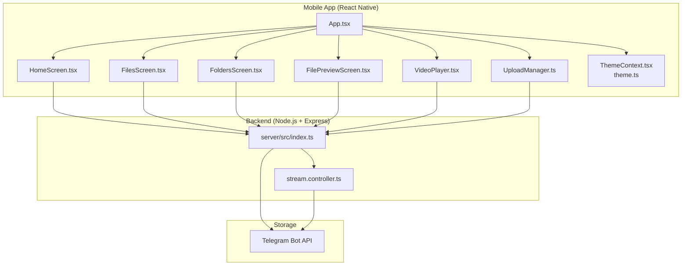
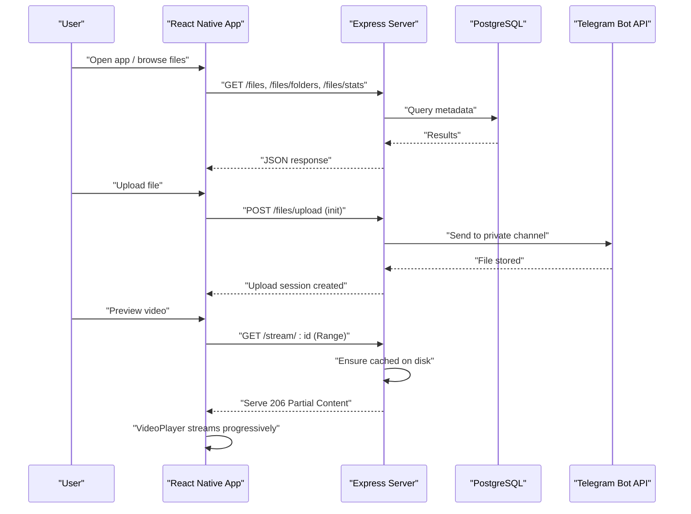
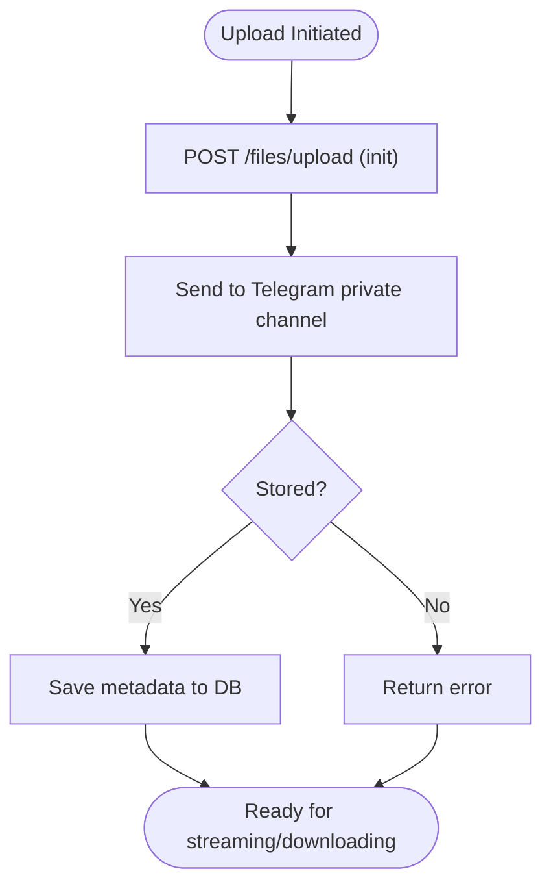
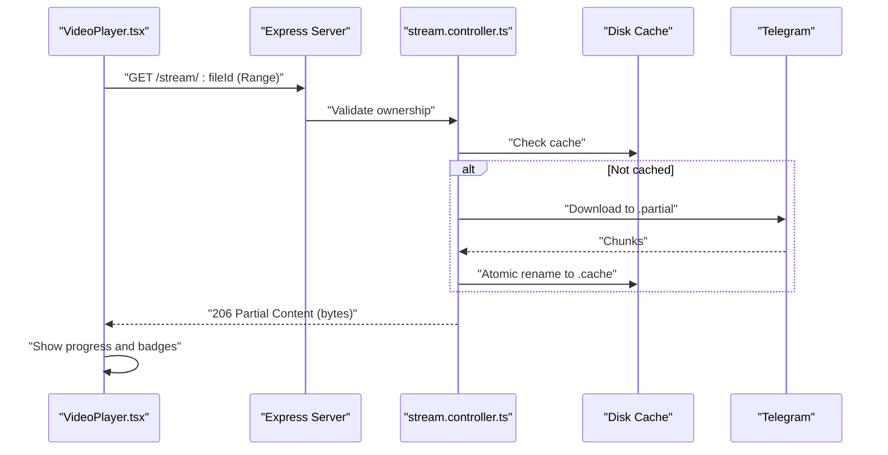
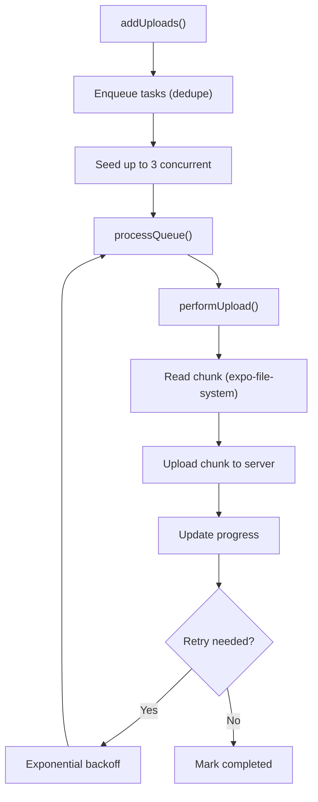
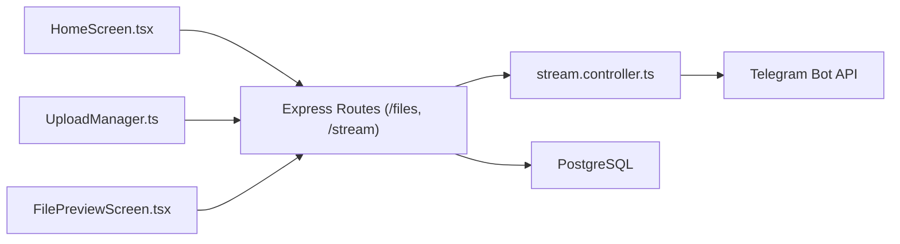

# Key Features Overview

<cite>
**Referenced Files in This Document**
- [README.md](file://README.md)
- [server/src/index.ts](file://server/src/index.ts)
- [app/App.tsx](file://app/App.tsx)
- [app/src/ui/theme.ts](file://app/src/ui/theme.ts)
- [app/src/context/ThemeContext.tsx](file://app/src/context/ThemeContext.tsx)
- [app/src/screens/HomeScreen.tsx](file://app/src/screens/HomeScreen.tsx)
- [app/src/screens/FilesScreen.tsx](file://app/src/screens/FilesScreen.tsx)
- [app/src/screens/FoldersScreen.tsx](file://app/src/screens/FoldersScreen.tsx)
- [app/src/services/UploadManager.ts](file://app/src/services/UploadManager.ts)
- [app/src/components/VideoPlayer.tsx](file://app/src/components/VideoPlayer.tsx)
- [app/src/screens/FilePreviewScreen.tsx](file://app/src/screens/FilePreviewScreen.tsx)
- [server/src/controllers/stream.controller.ts](file://server/src/controllers/stream.controller.ts)
</cite>

## Table of Contents
1. [Introduction](#introduction)
2. [Project Structure](#project-structure)
3. [Core Components](#core-components)
4. [Architecture Overview](#architecture-overview)
5. [Detailed Component Analysis](#detailed-component-analysis)
6. [Dependency Analysis](#dependency-analysis)
7. [Performance Considerations](#performance-considerations)
8. [Troubleshooting Guide](#troubleshooting-guide)
9. [Conclusion](#conclusion)

## Introduction
ANYX is a self-hosted cloud storage system that turns a private Telegram channel into unlimited personal storage. The platform provides a modern React Native mobile app with a modern UX, folder-based organization, background uploads with resumable transfers, video streaming with caching, media previews, and a user dashboard with storage statistics. All files are stored in Telegram channels while the app provides a structured, fast, and privacy-preserving interface.

## Project Structure
ANYX consists of:
- A React Native mobile app (Expo) with TypeScript and modern UI libraries
- A Node.js + Express backend with PostgreSQL for metadata
- Telegram Bot API as the storage engine
- A streaming and caching subsystem for efficient media playback

**Diagram sources**
- [app/App.tsx](file://app/App.tsx#L115-L287)
- [app/src/screens/HomeScreen.tsx](file://app/src/screens/HomeScreen.tsx#L360-L800)
- [app/src/screens/FilesScreen.tsx](file://app/src/screens/FilesScreen.tsx#L55-L403)
- [app/src/screens/FoldersScreen.tsx](file://app/src/screens/FoldersScreen.tsx#L35-L531)
- [app/src/screens/FilePreviewScreen.tsx](file://app/src/screens/FilePreviewScreen.tsx#L314-L755)
- [app/src/components/VideoPlayer.tsx](file://app/src/components/VideoPlayer.tsx#L28-L353)
- [app/src/services/UploadManager.ts](file://app/src/services/UploadManager.ts#L126-L992)
- [app/src/context/ThemeContext.tsx](file://app/src/context/ThemeContext.tsx#L102-L137)
- [app/src/ui/theme.ts](file://app/src/ui/theme.ts#L1-L113)
- [server/src/index.ts](file://server/src/index.ts#L1-L315)
- [server/src/controllers/stream.controller.ts](file://server/src/controllers/stream.controller.ts#L1-L460)

**Section sources**
- [README.md](file://README.md#L225-L246)
- [server/src/index.ts](file://server/src/index.ts#L1-L315)
- [app/App.tsx](file://app/App.tsx#L1-L287)

## Core Components
- Unlimited storage via Telegram: Files are stored in a private Telegram channel, enabling truly unlimited capacity without provider quotas.
- Modern React Native mobile app: Built with Expo, TypeScript, and modern UI libraries for a smooth, responsive experience.
- Video streaming and media preview: Progressive caching and HTTP Range support for reliable playback across mobile players.
- Folder-based organization: Create, manage, sort, and navigate folders with rich metadata and actions.
- Background uploads and resumable transfers: Queue-based upload manager with pause/resume, retries, and persistence across app restarts.
- User dashboard with storage statistics: Real-time usage visualization and file metrics on the home screen.
- Modern UX with dark mode support: Consistent theming, smooth animations, and persistent theme preference.

**Section sources**
- [README.md](file://README.md#L43-L145)
- [app/src/screens/HomeScreen.tsx](file://app/src/screens/HomeScreen.tsx#L651-L795)
- [app/src/screens/FilesScreen.tsx](file://app/src/screens/FilesScreen.tsx#L24-L100)
- [app/src/screens/FoldersScreen.tsx](file://app/src/screens/FoldersScreen.tsx#L84-L101)
- [app/src/services/UploadManager.ts](file://app/src/services/UploadManager.ts#L126-L760)
- [app/src/components/VideoPlayer.tsx](file://app/src/components/VideoPlayer.tsx#L28-L160)
- [app/src/context/ThemeContext.tsx](file://app/src/context/ThemeContext.tsx#L102-L137)

## Architecture Overview
ANYX’s architecture separates concerns cleanly:
- Frontend: React Native app orchestrates navigation, UI, uploads, and media playback.
- Backend: Express server exposes REST endpoints, validates JWT, and coordinates with Telegram.
- Storage: Telegram Bot API stores files in a private channel; the backend tracks metadata in PostgreSQL.
- Streaming: Dedicated controller caches files to disk and serves HTTP Range requests for smooth playback.

**Diagram sources**
- [server/src/index.ts](file://server/src/index.ts#L107-L221)
- [server/src/controllers/stream.controller.ts](file://server/src/controllers/stream.controller.ts#L320-L460)
- [app/src/services/UploadManager.ts](file://app/src/services/UploadManager.ts#L514-L646)
- [app/src/screens/FilePreviewScreen.tsx](file://app/src/screens/FilePreviewScreen.tsx#L482-L489)

**Section sources**
- [README.md](file://README.md#L72-L99)
- [server/src/index.ts](file://server/src/index.ts#L1-L315)

## Detailed Component Analysis

### Unlimited Storage via Telegram
- Benefit: No storage quotas or recurring costs; files live in your private Telegram channel.
- Implementation highlights:
  - Backend routes accept uploads and delegate to Telegram Bot API.
  - Metadata (file name, size, MIME type, Telegram message ID) stored in PostgreSQL.
  - Users can access files directly via streaming or download endpoints.

**Diagram sources**
- [server/src/index.ts](file://server/src/index.ts#L107-L111)
- [server/src/controllers/stream.controller.ts](file://server/src/controllers/stream.controller.ts#L320-L354)

**Section sources**
- [README.md](file://README.md#L45-L46)
- [server/src/index.ts](file://server/src/index.ts#L107-L111)

### Modern React Native Mobile App
- Benefit: Cross-platform mobile experience with native feel and performance.
- Highlights:
  - Expo-based app with TypeScript and modern UI libraries.
  - Navigation via React Navigation, gesture handling, and animated transitions.
  - OTA update checks and error boundary for resilience.

**Section sources**
- [README.md](file://README.md#L18-L25)
- [app/App.tsx](file://app/App.tsx#L115-L287)

### Video Streaming and Media Preview
- Benefit: Reliable playback with minimal buffering using progressive caching and HTTP Range support.
- Implementation:
  - Streaming endpoint supports Range requests and progressive serving.
  - Frontend polls cache status and shows “Streaming…” or “Downloaded” badges.
  - Video player integrates with Expo Video and displays loading overlays and retry controls.

**Diagram sources**
- [app/src/components/VideoPlayer.tsx](file://app/src/components/VideoPlayer.tsx#L48-L88)
- [server/src/controllers/stream.controller.ts](file://server/src/controllers/stream.controller.ts#L320-L460)

**Section sources**
- [README.md](file://README.md#L48-L49)
- [app/src/components/VideoPlayer.tsx](file://app/src/components/VideoPlayer.tsx#L28-L160)
- [server/src/controllers/stream.controller.ts](file://server/src/controllers/stream.controller.ts#L1-L27)

### Folder-Based Organization
- Benefit: Logical grouping of files improves discoverability and management.
- Features:
  - Create, rename, move, and delete folders.
  - Sort and filter by various criteria.
  - Pin frequently used folders to Home for quick access.

**Section sources**
- [README.md](file://README.md#L105-L111)
- [app/src/screens/FoldersScreen.tsx](file://app/src/screens/FoldersScreen.tsx#L84-L101)
- [app/src/screens/FilesScreen.tsx](file://app/src/screens/FilesScreen.tsx#L24-L52)

### Background Uploads and Resumable Transfers
- Benefit: Seamless uploads that survive network interruptions and app restarts.
- Implementation:
  - Queue-based upload manager with concurrency control and persistence.
  - Pause/resume/cancel with AbortController and server-side cancellation.
  - Exponential backoff and progress notifications on Android.

**Diagram sources**
- [app/src/services/UploadManager.ts](file://app/src/services/UploadManager.ts#L514-L760)

**Section sources**
- [README.md](file://README.md#L122-L128)
- [app/src/services/UploadManager.ts](file://app/src/services/UploadManager.ts#L126-L760)

### User Dashboard with Storage Statistics
- Benefit: Instant visibility into storage usage and file counts.
- Features:
  - Animated usage display with color-coded indicators.
  - File type breakdown (images, videos, documents).
  - Staggered loads on cold start to reduce server wake-ups.

**Section sources**
- [README.md](file://README.md#L131-L136)
- [app/src/screens/HomeScreen.tsx](file://app/src/screens/HomeScreen.tsx#L651-L795)

### Modern UX with Dark Mode Support
- Benefit: Consistent, accessible UI with theme-aware components.
- Features:
  - Shared design tokens and theme switching (light/dark).
  - Persistent theme preference stored locally.
  - Rich animations and gesture handling for smooth interactions.

**Section sources**
- [README.md](file://README.md#L139-L145)
- [app/src/context/ThemeContext.tsx](file://app/src/context/ThemeContext.tsx#L102-L137)
- [app/src/ui/theme.ts](file://app/src/ui/theme.ts#L1-L113)

## Dependency Analysis
- Frontend-to-backend contracts:
  - Files: list, create folder, search, stats, stream, download, trash, star, move, rename.
  - Uploads: init, chunk upload, cancel, status.
  - Streaming: status endpoint and Range-based streaming.
- Backend-to-Telegram:
  - Uploads and downloads via Telegram Bot API using stored session strings.
- Backend-to-database:
  - PostgreSQL for file metadata, ownership, and shared links.

**Diagram sources**
- [app/src/screens/HomeScreen.tsx](file://app/src/screens/HomeScreen.tsx#L465-L517)
- [app/src/services/UploadManager.ts](file://app/src/services/UploadManager.ts#L514-L646)
- [app/src/screens/FilePreviewScreen.tsx](file://app/src/screens/FilePreviewScreen.tsx#L482-L489)
- [server/src/index.ts](file://server/src/index.ts#L107-L221)
- [server/src/controllers/stream.controller.ts](file://server/src/controllers/stream.controller.ts#L320-L460)

**Section sources**
- [README.md](file://README.md#L193-L222)
- [server/src/index.ts](file://server/src/index.ts#L107-L221)

## Performance Considerations
- Streaming:
  - Progressive caching reduces repeated Telegram downloads and improves repeat playback performance.
  - HTTP Range requests and partial reads minimize latency and bandwidth.
- Uploads:
  - Concurrency capped at three to balance throughput and stability.
  - Persistence ensures uploads resume after app restarts.
- UI:
  - Staggered loads on Home reduce initial server load.
  - Virtualized lists and memoized styles improve scrolling performance.

[No sources needed since this section provides general guidance]

## Troubleshooting Guide
- Uploads fail or stall:
  - Check network connectivity and retry with exponential backoff.
  - Verify Telegram session validity; server cancels stale sessions on resume.
- Video fails to stream:
  - Confirm cache status via status endpoint; ensure sufficient bytes are cached.
  - Retry after waiting for partial content to accumulate.
- Theme not sticking:
  - Ensure theme preference is persisted and loaded on startup.

**Section sources**
- [app/src/services/UploadManager.ts](file://app/src/services/UploadManager.ts#L697-L751)
- [app/src/components/VideoPlayer.tsx](file://app/src/components/VideoPlayer.tsx#L48-L88)
- [app/src/context/ThemeContext.tsx](file://app/src/context/ThemeContext.tsx#L114-L121)

## Conclusion
ANYX delivers a complete, self-hosted cloud storage solution by combining Telegram’s unlimited storage with a modern React Native app, robust streaming, and a thoughtful UX. Together, these features provide a powerful, privacy-preserving, and developer-friendly platform for personal file management.

[No sources needed since this section summarizes without analyzing specific files]